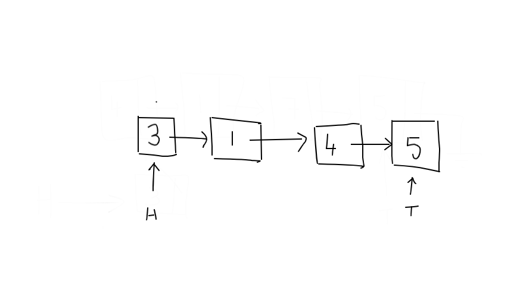

1. [Introduction](#introduction)
2. [Code](#code)
3. [Setup](#setup)
4. [Inserts](#inserts)
5. [Reverse Singly Linked List](#reverse-a-singly-linked-list)
6. [Move to Front Algorithm](#move-to-front-algorithm)
7. [Intro](#intro)
    * [Search](#search)
    * [Merge Two Sorted Lists](#merge-two-sorted-lists)
    * [Reverse a sublist](#reverse-a-sublist)
    * [Reverse a singly linked list](#reverse-a-singly-linked-list)
    * [Check if list is circular](#check-if-list-is-circular)
    * [Check if lists overlap](#check-if-lists-overlap)
    * [Remove Kth last node from list](#remove-kth-last-node-from-list)
    * [Remove duplicates from sorted list](#remove-duplicates-from-sorted-list)
    * [Right shift elements in a linked list](#right-shift-elements-in-a-linked-list)
    * [Even odd list](#even-odd-list)
    * [Check if list is a palindrome](#check-if-list-is-a-palindrome)
    * [Pivot list](#pivot-list)
    * [Add numbers in a list](#add-numbers-in-a-list)
    * [Swap pairs in a list](#swap-pairs-in-a-list)

2. [Conclusion](#conclusion)


### Introduction

In this post I'll talk about a very common data structure called linked list. The idea behind linked lists is to have data objects **linked** together like a chain where each element **points** to the next element it is linked to. Have enough of these connected together and you've got yourself a **linked list**. You can visualize a linked list like so:


In a linked list, a node is nothing but an "object" that holds some information for us. That information could be an integer, string etc along with a pointer to the next node or item in the list. Usually the last node in the list points to nothing (denoted by arrow going into the ground!). There are two types of linked lists: singly linked and doubly linked. The image above shows a singly linked list since there is a single link between two nodes. In a doubly linked list, there'd be another pointer, `prev`, that would point to the previous element. As in, there'd be an arrow going from $1$ to $4$. 

Why study linked lists? Linked lists can be useful in scenarios where our data is frequently updated by inserting new nodes in arbitrary positions. Since our list is dynamic and we haven't limited ourselves with contiguous memory, we can easily break links between nodes, add new nodes and extend our chain. Thus a linked list can be used to implement other useful data structures such as **queues** and **stacks**. 

### Code

I've written a template class in C++ called LinkedList that I'll build on top of for our future posts on queues and stacks. I'll assume that you're quite comfortable with C++ templates and pointers and will start with explaining the concepts behind linked lists. Let's dive in and understand what is going on.

```cpp{numberLines}
#ifndef LinkedList_h
#define LinkedList_h

template<typename T>
struct Node{
    T element;
    Node* next;
};

template<typename T>
class LinkedList{
private:
    Node<T>* head;
    Node<T>* tail;
    int size;
    
public:
    LinkedList();
    ~LinkedList();
    void printList();
    
    void InsertAtHead(T num);
    void InsertAtTail(T num);
    
    void PrintTail();
    void ReverseList();
    void PrintList();
};

//Constructor that initializes our head and tail pointers
//and sets our size to 0.
template<typename T>
LinkedList<T>::LinkedList(){
    head = nullptr;
    tail = nullptr;
    size = 0;
}

//Destructor to clean up our list
template<typename T>
LinkedList<T>::~LinkedList(){
    std::cout << "Destructor called" << std::endl;
    Node<T>* curr = head;
    while (curr != 0){
        Node<T>* temp = curr;
        std::cout << "Deleting: " << curr->element << " ";
        curr = curr->next;
        delete temp;
        temp = curr;
    }
    head = nullptr;
    tail = nullptr;
    std::cout << std::endl;
}

//Function to print our list starting at head
template<typename T>
void LinkedList<T>::PrintList(){
    Node<T>* itr = head;
    while(itr != 0){
        std::cout << itr->element << " ";
        itr = itr->next;
    }
    std::cout << std::endl;
}

//Function to print element pointed to by tail pointer
template<typename T>
void LinkedList<T>::PrintTail(){
    std::cout << tail->element << std::endl;
}

//Function to insert at head of list
template<typename T>
void LinkedList<T>::InsertAtHead(T num){
    Node<T>* n = new Node<T>;
    n->element = num;
    
    if (size == 0){
        n->next = nullptr;
        head = n;
        tail = n;
        size++;
    } else {
        n->next = head;
        head = n;
        size++;
    }
}

//Function to insert at tail of list
template<typename T>
void LinkedList<T>::InsertAtTail(T num){
    Node<T>* n = new Node<T>;
    n->element = num;
    n->next = nullptr;
    
    if (size == 0){
        head = n;
        tail = n;
        size++;
    } else {
        tail->next = n;
        tail = n;
        size++;
    }
}

template<typename T>
void LinkedList<T>::ReverseList(){
    Node<T>* added = head;
    Node<T>* curr = head->next;
    added->next = nullptr;
    tail = head;
    tail->next = nullptr;
    
    while(curr != 0){
        Node<T>* toAdd = curr;
        curr = curr->next;
        toAdd->next = added;
        added = toAdd;
    }
    head = added;
}

#endif
```
### Setup

```cpp{numberLines:30}
//Constructor that initializes our head and tail pointers
//and sets our size to 0.
template<typename T>
LinkedList<T>::LinkedList(){
    head = nullptr;
    tail = nullptr;
    size = 0;
}
```

Let's start with the actual `Node` that holds our data and the link to the next node:

```cpp
template<typename T>
struct Node{
    T element;
    Node* next;
};
```

Our node is a template struct that holds an element of type `T` and a pointer to the next node in the field `next`. The linked list class makes use of this node struct to store data and to create the actual list.

Before we look at the major operations of our linked list class, it is worth talking about our constructor. On lines 34 and 35 we initialize our head and tail pointers to null and set the size to $0$ on line 36. 

The head pointer will always point to the first element in the list and, as the name suggests, the tail pointer will always point to the last element in the list.

Once this constructor is called, we've got our necessary components in place to start adding nodes to our list.

#### Inserts

Let's start with the insert at head function. This function takes in an element,and inserts it, as the name suggests, at the head of our list. This would be the first element in our list if we're going from left to right (as is the convention).


```cpp{numberLines:73}
//Function to insert at head of list
template<typename T>
void LinkedList<T>::InsertAtHead(T num){
    Node<T>* n = new Node<T>;
    n->element = num;
    
    if (size == 0){
        n->next = nullptr;
        head = n;
        tail = n;
        size++;
    } else {
        n->next = head;
        head = n;
        size++;
    }
}
```

Inside the function, first thing we do is declare a pointer to a new Node object.  We then add to this Node object's element field the value that was passed in. Next we test if the list was empty: if so, we point both our head and tail pointers to this new object. If the list wasn't empty, we assign the next value for this new node to head and then reassign head to point to this new node. 

Say, for example, we've got our list as shown at the [top](#introduction). Let's say we're adding $3$ to the head of the list. Based on the code for our function, well fall into the else part of `if-else` and the first thing that'll happen is that we'll create a new node:


Next, we'll reassign this newly made node's next pointer to whatever `head` is pointing to:


We'll finally then point `head` to this new node:


Thus, as the image shows, we've added a new node to the head of the linked list. Similar logic is used to insert at tail of the linked list. 

### Reverse Singly Linked List

A fun exercise to try is to reverse a singly linked list using $O(1) (constant)$ space and $O(n)$ time. There are plenty of ways to do this and I encourage you to try a different approach. Here's how I thought about the reversing process: we start with the current head and break the link between head and the following node. Then we make the next node point to the previous node thus reversing the order. We repeat this process until no more nodes are left. Of course, in the process, we need to assign the new tail and head.

Before I explain with pictures, let me show you what the code looks like:

```cpp{numberLines:109}
template<typename T>
void LinkedList<T>::ReverseList(){
    Node<T>* added = head;
    Node<T>* curr = head->next;
    tail = head;
    tail->next = nullptr;
    
    while(curr != 0){
        Node<T>* toAdd = curr;
        curr = curr->next;
        toAdd->next = added;
        added = toAdd;
    }
    head = added;
}
```

Pictorially, here is what I'm doing:

Let's say this is our list with our head and tail pointers:



In reversed order, when we print this list, obviously we'd want to see 5-4-1-3 printed. At the beginning of the `ReverseList()` function, I assign a few pointers:

```cpp{numberLines:111}
    Node<T>* added = head;
    Node<T>* curr = head->next;
```

and now our list looks like this: (I've substituted `a` as the name for `added` pointer in the pictures)


Now that we've got our pointers in place, let's break the old links and create new ones. Since our current head will be our new tail,I do the following:

```cpp{numberLines:113}
    tail = head;
    tail->next = nullptr;
```

Line 113 changes the current head and re-name it as tail, since, as I mentioned earlier, our current head will be the new tail once the list is reversed. On line 114, I point tail to `nullptr` since tails always point to it (denoted by no arrow going out of tail). Once these two lines are executed we're done with our initial setup. We've isolated our new tail and now need to iteratively go through each element (1,4 and 5) and add it behind our new tail. Our list looks like this right now:


Now we enter the `while` loop which is executed until our `curr` pointer points to null:

```cpp{numberLines:116}
    while(curr != 0){
        Node<T>* toAdd = curr;
        curr = curr->next;
        toAdd->next = added;
        added = toAdd;
    }
```

Inside the `while` loop, we create another Node pointer, `toAdd` (denoted by ta in pictures) and point it to curr on line 117. We then move curr to the next element on line 118. After lines 117 and 118 are executed, our list looks like this:


Next,on line 119, we re-assign the `next` for our `toAdd` variable, and point it to whatever was recently added to the reversed list, and the element recently added to the reversed list is being pointed to by `added`. So, we make `toAdd`'s next point to `added`. Now, our list looks like this:


We then make `added` point to `toAdd` on line 120 and we go back to the top of the while loop. We see that `curr` is not pointing to null, so we continue inside the loop and re-declare `toAdd` to point to `curr` and increment `curr` to point to `curr`'s next:


We then continue to repeat the process in the `while` loop until our `curr` pointer is pointing to `nullptr`. At that point, we've reversed our list and all that is left to do is assign our new `head` which is currently being pointed to be `added`. I strongly suggest that you try this out with a paper and a pencil and iterate through the steps to see how we reversed it. 

### Move to Front Algorithm

As you noticed, iterating over a list to find an element takes $O(N)$ time. This can get quite slow for long lists. There are  [algorithms](https://en.wikipedia.org/wiki/Self-organizing_list) that allow us to transform our linked list so as to improve access time for elements. One such algorithm is called **Move to Front**. As the name suggests, MTF searches the list for an element the user is interested in and once the element is found, it is moved to the front of the list so that subsequent searches for the same element are faster. The idea is useful where we make the assumption that recently accessed elements are more likely to be reaccessed. Of course, as you can imagine, this is not a perfect approach to reduce the $O(N)$ search time and there are many scenarios where our time won't be that much different from a sequential search. Assuming our searches are such that once we access an element, we're very likely to search for it again, MTF works perfectly fine. 

Sample code for moving an element to the front of the list is quite simple and here I share my implementation:

```cpp{numberLines}
template <typename T>
void LinkedList<T>::MoveToFront(T elem){
    Node<T>* temp = head->next;
    Node<T>* prev = head;
    while(temp != 0){
        if (temp->element == elem){
            prev->next = temp->next;
            temp->next = nullptr;
            temp->next = head;
            head = temp;
        } else {
            temp = temp->next;
            prev = prev->next;
        }
    }
}
```

The idea is simple: we use two pointers, `temp` and `prev` to iterate over the list. If the element pointed to by `temp` is what we've been searching for, we sever the links and move `temp` to the front of the list.

### Intro

Before we look at the problems, let's have a look at the node struct we'd be using:
```cpp
template <typename T>
struct ListNode{
    T data;
    shared_ptr<ListNode<T>> next;
};
```

It is a template node that has two fields: `data` that stores the actual value and `next` which is of type `shared_ptr<ListNode<T>>` . This next field points to the next node in the list.

### Search
**Search for an element in the list**

```cpp

shared_ptr<ListNode<int>> Search(shared_ptr<ListNode<int>> l, int key){
   shared_ptr<ListNode<int>> ptr = l;
    while (l && l->data != key){
        l = l->next;
    }
    
    return l;
}

```

### Merge two sorted lists

**Merge two sorted singly linked lists. You must not use extra space but use of extra constant space is allowed**. 

Without the limitations, this problem is easy. You can create a new list and then iterate over existing lists and keep adding elements by comparing them. You can also append the two lists and then sort them. Both methods are inefficient. Here's a look at an efficient method. Say, here are our two lists:

 ```text

    2 -> 3 -> 7
    -1 -> 6 -> 13
```

First you can create a **dummy head** that'll be the starting point of the merged lists. Intuitively, you'd assign the smaller of the two lists' head as the new head but that requires more checks (if else statements). Dummy heads allow us to write cleaner and more generic code that generalizes well. We'll place any value we like in the dummy head (we'll see later why this won't matter). Say our dummy head has value -1 in it. We'll also have a tail pointer that points to the dummy head initially:

 ```text
dummy head
     |
    -1 - tail
    
   l1
    2 -> 3 -> 7
    -1 -> 6 -> 13
    l2
```

Next, we keep iterating both lists until both pointers are NOT null ie `while (l1 && l2)` where `l1` is the head pointer for list 1 and `l2` is the head pointer for list 2. Next, we compare which pointer has the lesser value and make `tail->next` point to that value and increment the lesser pointer (ie increment `l1` or `l2`.) So, in our example above, `l2` < `l1` so we make `tail->next` point to `l2`, move `l2` down and move tail to this new node:


```text
 dummy head
    -1
   l1
    2 -> 3 -> 7
    -1 -> 6 -> 13
    tail  l2
```

We repeat this process until either `l1` or `l2` is out of elements to iterate over. We may have a case where one list is done earlier than the other, where we'd simply take the remaining elements and append to tail until we're done.

Finally, when it's time to return this, is what our final list would look like:

  
```text
 dummy head                         tail
    -1 -> -1 -> 2 -> 3 -> 6 -> 7 -> 13
```

```cpp
Node<int>* mergeTwoLists(Node<int>* l1, Node<int>* l2){
    Node<int>* dummyHead = new Node<int>;
    dummyHead->element = -1;
    auto tail = dummyHead;
    
    while (l1 && l2){
        if (l1->element < l2->element){
            tail->next = l1;
            l1 = l1->next;
            tail = tail->next;
        } else {
            tail->next = l2;
            l2 = l2->next;
            tail = tail->next;
        }
    }
    if (l1 == nullptr){
        //remainders are l2:
        while (l2){
            tail->next = l2;
            tail = tail->next;
            l2 = l2->next;
        }
    } else {
        while (l1){
            //remainders are l1:
            tail->next = l1;
            tail = tail->next;
            l1 = l1->next;
        }
    }
    return dummyHead->next;
}

```

Remember that `-1` value we added, when we return we'll simply return `dummyHead->next` as our answer. The running time of this algorithm is $O(M + N)$ where $M$ and $N$ are the number of nodes in list 1 and list 2 respectively. The space used is constant because we reuse the existing nodes. The only extra node we created was the value in the dummy head node. Other than that, we were just manipulating next pointer for the smallest node we found.

**Variant: What if the list is doubly linked?** The approach would remain the same except that now you'd also have to handle the `prev` link.

### Reverse A sublist

**Given a pointer to the head of a list and two indices, reverse all elements within the sublist including the indices**. Example given list:
 ```text
    2              7 
11->4->5->6->7->8->9->2 and indices 2 and 7 reversed list would be:
    
    2              7     
11->9->8->7->6->5->4->2
```
 
 There are a few different approaches that we can take: we can create a new list, keep track of the indices and insert nodes into the new list in reverse order. This would be inefficient since it takes $O(N)$ extra space where $N$ is the number of vertices. 
 
 The best approach would be to realize that reversal is nothing but picking element at index 2, and placing it right after index 7:
 
 ```text
     2              7 
 11->4->5->6->7->8->9->2 
     
     2           7        
 11->5->6->7->8->9->4->2

then:
     2           7       
 11->5->6->7->8->9->4->2

     2        7           
 11->6->7->8->9->5->4->2

```

and continue until pointers 2 and 7 point to the same node. We cannot go in reverse direction because this is not a doubly linked list. So the easier method would be to move from left to right. We'd also have to keep track of `prev so that we can update its link to the next node that needs to be moved to the other end. 

Here's the function that performs the reversal:

```cpp{numberLines:true}
void ReverseGivenSublist(Node<int>* L, int start, int finish){
    start = start - 1;
    finish = finish-1;
    Node<int>* prev = L;
    Node<int>* a = L;
    Node<int>* b = L;
    for (int i = 0; i <= finish; i++){
        if (i == start - 1)
            prev = L;
        else if (i == start)
            a = L;
        else if (i == finish)
            b = L;
        
        L = L->next;
    }
    
    cout << "prev points to: " << prev->element << endl;
    cout << "a points to: " << a->element << endl;
    cout << "b points to: " << b->element << endl;
    
    while (a != b){
        prev->next = a->next;
        a->next = b->next;
        b->next = a;
        a = prev->next;
        cout << endl;
        cout << "prev points to: " << prev->element << endl;
        cout << "a points to: " << a->element << endl;
        cout << "b points to: " << b->element << endl;
    }
}
``` 

The loop on line 7 helps us position our pointers in the correct position. Here's the position of the pointers once the loop ends:


 ```text
prev a              b
 11->4->5->6->7->8->9->2 
```

- Now, the logic is to first make `prev` point to `a->next` (11 connects to 5)
- Next, make `a` point to `b->next` (4 connects to 2)
- Then, make `b->next` point to `a` (9 connects to 4)
- Update `a` to point to `prev->next` (new a is 5)

`b` stays with 9:

 ```text
prev a           b
 11->5->6->7->8->9->4->2 
```

Notice how `a` and `b` are getting closer. We continue this move and update until, on line 22, `a` and `b` point to the same node. At that point we'd be done with our reversal. 

The running time:

- We go from $0$ to $B$ to setup the pointers in the correct position which takes $O(B)$ time.
- We then iterate from $A$ till $B$ until $A == B$ which takes $O(A-B)$ time.

Adding up those we take overall $O(B)$ time where $B$ is the finish index.

### Reverse a singly linked list

**Given a singly linked list, reverse it**. Example: 1234 -> 4321

The idea here is similar to what we did while reversing sublist: Pick an element from the left end, place after right end. Continue until left and right pointers point to the same node:

```text
a              b
1 -> 2 -> 3 -> 4

Pick a, put after b:

a         b
2 -> 3 -> 4 -> 1

Pick a, put after b:

a    b
3 -> 4 -> 2 -> 1

Pick a, put after b:

ab
4 -> 3 -> 2 -> 1

Return!
```


Here's the code for this:

```cpp
Node<int>* ReverseASinglyLinkedList(Node<int>* L){
    Node<int>* a = L;
    Node<int>* b = L;
    while (L){
        b = L;
        L = L->next;
    }
    
    while (a != b){
        auto temp = a->next;
        a->next = b->next;
        b->next = a;
        a = temp;
    }
    return a;
}
```

The first while loop places our pointers with `a` at the beginning and `b` at the end of the list. Then, while `a != b`, pick `a` and put after `b`. Make old `a->next` the new `a`. Running time of this algorithm is:
 - $O(N)$ for placing a pointer at the end of the list (assuming there's no tail pointer present) where $N$ is the number of nodes. 
 - Then, choose and swap until `a == b` which is another $O(N)$.
 
 Total  = $O(2N)$ = $O(N)$   

### Check if list is circular

**Write a program that takes the head of a singly linked list and returns null if there does not exist a cycle, and the node at the start of the cycle, if a cycle is present. (You do not know the length of the list in advance.)**

There're again multiple solutions to this problem. The first thing that comes to mind is to create a set and keep inserting node addresses to the set. If you encounter an address that already exists in the set, then you have a cycle. This approach requires $O(N)$ space where $N$ is the number of nodes in the linked list. 

Another approach would be two have two iterators. The first iterator chooses a current node and then has a second iterator to go over all other nodes. If at any point the second iterator == first iterator, we have a cycle. This uses no extra space but running time $O(N^2)$.

However, there's another approach that uses $O(1)$ space and $O(N)$ time: Have two pointers: one fast pointer that goes ahead two nodes and a slow pointer that moves one node at a time. If slow pointer at any point becomes equal to the faster pointer (other than when it is null), we have a cycle. If not, we don't have a cycle. Let's see how this works. Say this is our circular list with no null pointers:

```text
 fast slow
    |
    1 -> 2 -> 3 -> 4 -> 5 -> 6
                        |    |
                       10    7
                        |    |
                        9 <- 8
                       
``` 

Our fast and slow pointers both start at 1. Fast and slow go through these nodes:

```text
                         FAST == SLOW
                             |
FAST 1   3   5   7   9   5   7   9
SLOW 1   2   3   4   5   6   7
```

Since fast == slow, we have a cycle.

Now, the question also asks us to find the node where the loop begins. To do so, we'll have to use a trick. As soon as slow and fast collide, we know we have a cycle. Keep the fast pointer at the collision point but move the slow pointer to the beginning of the list. Now, keep incrementing slow and fast by 1 until they meet again. This meeting point is the beginning of our loop.

That seems like magic! Why did this random approach work and how do we know that this was the starting of our loop? This is a common algorithm called **Floyd's Cycle detection algorithm** and there are plenty of explanations available which I won't repeat here.
Here's the code for this approach:

```cpp
bool isCircular(Node<int>* L){
    Node<int>* slow = L;
    Node<int>* fast = L->next->next;
    
    while (slow != fast && fast != nullptr){
        slow = slow->next;
        if (fast->next == nullptr){
            fast = nullptr;
            break;
        }
        else if (fast->next->next == nullptr){
            fast = nullptr;
            break;
        } else {
            fast = fast->next->next;
        }
    }
    if (fast == nullptr)
        return false;
    return true;
}
```

### Check if lists overlap

**Given two singly linked lists there may be list nodes that are common to both. (This may not be a bug—it may be desirable from the perspective of reducing memory footprint, as in the flyweight pattern, or maintaining a canonical form.)**

```text
list 1: 1->2->3->4
                 |
list 2: 5->6->7->8->9->10->NULL
```

Here's an approach: store addresses of each node in list 1 in a hash table and then iterate over list 2. While going over list 2, check the hash table if the address has been encountered: if so, they overlap, otherwise, they don't.This approach takes $O(M+N)$ time and space $O(M+N)$.

An observation above leads to a better space time complexity: if, they overlap, they'll both end up at the same last node (the node before null). For example, since 1 and 2 overlap, they end up at the same node address for node with value 10. If not, their last node would have a different address.

```cpp
bool doOverlap(Node<int>* L1, Node<int>* L2){
    while (L1->next != nullptr && L2->next != nullptr){
        L1 = L1->next;
        L2 = L2->next;
    }
    
    if (L1->next != nullptr){
        while (L1->next != nullptr){
            L1 = L1->next;
        }
    } else {
        while (L2->next != nullptr){
            L2 = L2->next;
        }
    }
        
    
    if (L1 == L2){
        return true;
    }
   
    return false;
}
``` 

### Return overlap node
**Extension of previous problem, check if the nodes overlap and if they do, return overlap node**

Let's look at an example:

```cpp
list a: 1-2-3-4
              |
list b: 3-4-5-7-9-NULL
```

We'll check if they end at the same node which'll return true. Next, notice `b` length is 5 and `a` length is 6. One way to get to the overlap node is:

```cpp
int diff = longer - shorter; //6 - 5 = 1
int pos = shorter - diff; //5 - 1 = 4
```

Node in shorter list at position `pos` is the overlap node. Let's try with a different example:

```cpp
list a: 1-2-3-4
              |
list b:   3-4-5-7-9-NULL
```

Then our calculations would be:

```cpp
int diff = longer - shorter; //7 - 5 = 2
int pos = shorter - diff; //5 - 2 = 3
```

Notice how the `shorter[pos]` is the overlap node.

Here's the code for logic above:

```cpp
Node<int>* getOverlapNodeIfExists(Node<int>* a, Node<int>* b){
    Node<int>* overLapNode = nullptr;
    int aLen = 1, bLen = 1;
    Node<int>* aTemp = a;
    Node<int>* bTemp = b;
    
    while (aTemp->next){
        aTemp = aTemp->next;
        aLen++;
    }
    
    while (bTemp->next){
        bTemp = bTemp->next;
        bLen++;
    }
    
    if (aTemp == bTemp){
        int diff = abs(aLen - bLen);
        int pos = (bLen < aLen) ? (bLen - diff): (aLen - diff);
        if (bLen < aLen){
            overLapNode = b;
        } else {
            overLapNode = a;
        }
        
        while (pos != 1){
            overLapNode = overLapNode->next;
            pos--;
        }
    }

    return overLapNode;
}
```


### Remove Kth last node from list

**Given a singly linked list and an integer k, write a program to remove the /cth last element from the list. Your algorithm cannot use more than a few words of storage, regardless of the length of the list. In particular, you cannot assume that it is possible to record the length of the list.**

Naive approach would be to first iterate over the length of the list to get its length. Then, once you have the length, subtract the value of K from this length and then iterate again up till this value you calculated and then delete the node. This is not possible since the question states you cannot assume that it is possible to record the length of the list. 

Better approach would be to have 3 pointers: `prev`,`i`, and `j`. Start with `i` at 0 and `j` at `i + K` so that when `j` hits end of list, `i` would be at the element to be deleted and `prev` would be one node behind the element to be deleted:

Say, K = 3. So delete 7:

```css
prev,i  j
|       |            
1   2   3   4   5   6   7   8   9
``` 

Keep moving `j` until it gets to the last node:
```css
                  prev  i       j
                    |   |       |            
1   2   3   4   5   6   7   8   9
``` 

Now, make prev->next point to i->next and then delete `i`.

Running time: $O(N)$ where $N$ is the size of the list.

```cpp
Node<int>* RemoveKFromLast(Node<int>* L, int k){
    Node<int>* i = L;
    Node<int>* j = L;
    Node<int>* prev = i;
    
    for (int i = 0; i < k; i++){
        j = j->next;
    }
    
    while (j->next != nullptr){
        prev = i;
        i = i->next;
        j = j->next;
    }
    
    prev->next = i->next;
    delete i;

    return L;
}
```

### Remove duplicates from sorted list

**Write a program that takes as input a singly linked list of integers in sorted order, and removes duplicates from it. The list should be sorted.**

Approach 1: Create a new list and copy over each element only once by maintaining a set as you iterate over the list. Then, for each item in the set, create a new node and add it to the new list you created. Time complexity $O(2N) \approx O(N)$. Space complexity $O(N)$.

Better approach: iterate over the list and keep pointers to delete nodes that have value equal to the value in the current node. Use another pointer to free up the memory and actually delete the node that is a duplicate. Simply updating the next pointer won't suffice since we'd have memory leak because the nodes were created using `new` keyword. Once duplicates are deleted, make the current node point to the next available node that has a different value. Repeat until faster pointer, `j`, reaches null. 

```cpp
Node<int>* RemoveDup(Node<int>*L){
    Node<int>* j = L;
    Node<int>* i = L;
    Node<int>* prev = L;
    while (j != nullptr){
        if (i->element == j->element){
            j = j->next;
            prev = j;
            if (j == nullptr)
                break;
            while (i->element == j->element){
                j = j->next;
                delete prev;
                prev = nullptr;
                prev = j;
            }
            
            i->next = j;
            i = i->next;
        }
    }
    
    return L;
}
```

### Right shift elements in a linked list

**Given a list, return elements shifted to the right by k (where k < size of list)**.

Example:

```text
1->2->3->4 and k = 1
4->1->2->3
or
1->2->3->4 and k = 2
3->4->1->2
```

Now, the best solution to this problem is to figure out how we can manipulate the links. Notice, that:

```cpp
newTail = oldTail + shiftAmount.
``` 

If old tail was 4 and K = 2, then new tail is 2 elements after 4 (if we consider the linked list as circular) which is the element 2. Obviously, since we've made our list circular and figured out what the new tail should be, we can say that the element right after the new tail is the new head.

### Even odd List  

**Given a list with even and odd elements, rearrange the list so that all even elements appear in the list before odd elements.**

Example:

```cpp
Given:  4->11->2->9->12->6->8->13->21
Return: 4->2->12->6->8->11->9->13->21
```

The naive approach would be to create a new list and keep appending to the new list nodes from the old list by checking the value. This approach requires extra space.

Better approach would be to have 5 pointers: 
- evenHead (to keep track of start of final list)
- oddHead (to keep track of start of odd part)
- even (to attach nodes to the even list)
- odd (to attach nodes to the odd list)
- temp (to move across the list)

Then move the pointers based on the value encountered in the temp pointer. Once temp reaches the end of the original list, make even pointer point to oddHead and make odd point to null. Running time is $O(N)$ where $N$ is the number of nodes in the list and space is $O(1)$.

```cpp
Node<int>* EvenOddList(Node<int>* L){
    Node<int>* eH = nullptr;
    Node<int>* oH = nullptr;
    Node<int>* ev = L;
    Node<int>* od = L;
    Node<int>* temp = L;
    
    while (temp){
        int curr = temp->element;
        if (curr % 2 == 0){
            //even element
            if (eH == nullptr)
                eH = temp;
            else{
                ev->next = temp;
                ev = ev->next;
            }
        } else{
            if (oH == nullptr)
                oH = temp;
            else {
                od->next = temp;
                od = od->next;
            }
        }
        
        temp = temp->next;
    }
    
    ev->next = oH;
    od->next = nullptr;
    return eH;
}
```

### Check if list is a palindrome 

**Given a singly linked list, return true if it is a palindrome and false otherwise**

example:

```cpp
1->2->3->4->3->2->1 true
1->2->3 false
```

Naive approach would be to choose the first node and then take a pointer to the last node and compare. Then, move to the second node and take a pointer to the second to last node and compare. This would take $O(N^2)$ time. 

A better approach would be to first figure out the size of our list ($O(N)$), then place a pointer at the mid point and then compare with start of list. This approach would take $O(N)$ time.

### Pivot list

**For any integer k, the pivot of a list of integers with respect to k is that list with its nodes reordered so that all nodes containing keys less than k appear before nodes containing k, and all nodes containing keys greater than k appear after the nodes containing k.Implement a function which takes as input a singly linked list and an integer k and performs a pivot of the list with respect to k.**

Example:

```cpp
Pivot around 7:

    13->2->5->7->11->12->3->4->7->NULL

Pivoted:
    2->5->3->4->7->7->13->11->12
```

Notice how the order stays the same.

Naive approach would create new nodes for each type of value found: lesser, equal or greater and then append to each list and then finally merge the lists. However, that is not necessary. Run time is $O(N)$ but space is also $O(N)$.


One approach is to find the pivot node then start at head and if you find any nodes greater than pivot, put that node after pivot. Once you get to the pivot, find any that are larger than the pivot and put before the pivot and then return the list. Run time is $O(N)$ 

A better approach is where you have 3 head pointers for each type: `lH`, `eH` and `gH` (lessHead, equalHead and greaterHead). You can then also have 3 more pointers: `l`, `e` and `g` that move depending on the type of value found. To actually iterate over the list, you can use a `temp` pointer. I'll use this approach since it is easier to follow. Run time is $O(N)$

```cpp
Node<int>* PivotAround(Node<int>* L,int p){
    Node<int>* lH = nullptr;
    Node<int>* eH = nullptr;
    Node<int>* gH = nullptr;
    Node<int>* temp = L;
    Node<int>* l = lH;
    Node<int>* e = eH;
    Node<int>* g = gH;
    
    while (temp != nullptr){
        int curr = temp->element;
        if (curr < p){
            if (lH == nullptr){
                lH = temp;
                l = temp;
            } else {
                l->next = temp;
                l = l->next;
            }
        } else if (curr == p){
            if (eH == nullptr){
                eH = temp;
                e = eH;
            } else {
                e->next = temp;
                e = e->next;
            }
        } else {
            if (gH == nullptr){
                gH = temp;
                g = gH;
            } else {
                g->next = temp;
                g = g->next;
            }
        }
        
        temp = temp->next;
    }
    
    l->next = eH;
    e->next = gH;
    g->next = nullptr;
    
    return lH;
}
```

### Add numbers in a list

**Write a program which takes two singly linked lists of digits, and returns the list corresponding to the sum of the integers they represent. The least significant digit comes first.**

Example:

```cpp

(403 + 119) = 522

3 -> 0 -> 4
9 -> 1 -> 1 +
-------------
2 -> 2 -> 5
```

This is a simple problem with the only requirement being that you write clean correct code. The logic goes like so: start with the least significant digits of the two lists and add them. Save the answer of addition mod 10 to the new list you're creating and carry answer/10. Stop as soon as one of the pointers becomes null. Once stopped check to see if other list has any remaining elements, if so add them to the answer. If not, check if there's a carry. If so, add to the answer. 

Run time: $O(max(A,B))$ ie the maximum of the two lists.
Space: $O(max(A,B))$ ie max of the two lists. 

```cpp
Node<int>* AddNumbersInAList(Node<int>* l1, Node<int>* l2){
    Node<int>* p1 = l1;
    Node<int>* p2 = l2;
    Node<int>* ansHead = nullptr;
    Node<int>* ansNext = nullptr;
    int carry = 0;
    
    while (p1 && p2){
        int num1 = p1->element;
        int num2 = p2->element;
        int ans = num1 + num2 + carry;
        int save = ans%10;
        carry = ans/10;
        if (ansHead == nullptr){
            ansHead = new Node<int>;
            ansHead->element = save;
            ansNext = ansHead;
        } else {
            ansNext->next = new Node<int>;
            ansNext = ansNext->next;
            ansNext->element = ans % 10;
            ansNext->next = nullptr;
        }
        p1 = p1->next;
        p2 = p2->next;
    }
    
    if (p1 != nullptr){
        while (p1){
            int curr = p1->element;
            int ans = curr + carry;
            ansNext->next = new Node<int>;
            ansNext = ansNext->next;
            ansNext->element = ans % 10;
            ansNext->next = nullptr;
            carry = ans / 10;
            p1 = p1->next;
        }
    } else if (p2 != nullptr){
        while (p2){
            int curr = p2->element;
            int ans = curr + carry;
            ansNext->next = new Node<int>;
            ansNext = ansNext->next;
            ansNext->element = ans % 10;
            ansNext->next = nullptr;
            carry = ans / 10;
            p2 = p2->next;
        }
    }
    
    if (carry > 0){
        ansNext->next = new Node<int>;
        ansNext = ansNext->next;
        ansNext->element = carry;
        ansNext->next = nullptr;
    }
    
    return ansHead;
}
```

### Swap pairs in a list

**Given a linked list, swap every two adjacent nodes and return its head. You may not modify the values in the list's nodes, only nodes itself may be changed. You can assume the number of nodes in the list will always be even.**

```cpp
Example:
10-2-3-4-1-9-NULL
2-10-4-3-9-1-NULL
```

Naive approach would be to create a new list and then move 2 pointers along the original list in an alternating fashion and append to the new list. This requires $O(N)$ extra space. 

A better approach would edit the list in place. We first create a dummy head and make it point to the first element. Then we start swapping elements making use of `prev`, `i` and `j` pointers:   

```cpp
    ListNode* swapPairs(ListNode* head) {
        if (head == nullptr)
            return head;
        if (head->next == nullptr)
            return head;

        ListNode* dummyHead = new ListNode(-1);
        ListNode* prev = dummyHead;
        ListNode* i = head;
        ListNode* j = head->next;

        while (i && j){
            i->next = j->next;
            j->next = i;
            prev->next = j;
            prev = i;
            i = prev->next;
            if (i == nullptr)
                break;
            j = i->next;
        }
        return dummyHead->next;
    }
```

This approach takes $O(N)$ time and $O(1)$ space.

### Conclusion

- More often than not, you'd be required to manipulate the array somehow such as the [even odd problem](/linked-list-problems#even-odd-list), make use of new head pointers and temp pointers to make your way through the list and solve the problem in $O(N)$ time. Another problem that makes use of this is the [pivot list problem](/linked-list-problems#pivot-list)

- Some times it is easier to use a dummy head and then return `dummyHead->next` as your answer to make life easier. Look at [swap pairs problem](/linked-list#swap-pairs-in-a-list). If you're worried about the start of the list and how to handle that first case, use a dummy head.

- If it is a singly linked list, go from left to right since it's the only method possible. For example, if you're moving nodes around, pick ones that are on the left and place after the ones on the right

- See if you can solve a problem by using multiple pointers (2 or 3 pointers) to move along the list and get the job done in a single pass

- Remember to move to next node when iterating over the list!

- When rotating a list, make it circular (connect tail to head) and figure out what the new tail should be. Then from there, the node after newTail is the newHead.

- Linked lists are extremely powerful if you're required to constantly update your data (inserts and deletes). Insertion into a linked list would require you to sequentially iterate through your list - $O(n)$ - and then add your new node: $O(1)$. The down side is that if you need to search your list, you'd have to iterate through all the elements: $O(n)$.

However, if your updates are infrequent, it'd be better to use an array since arrays provide us with fast lookup: $O(1)$. However, if you need to add a new item to your array, you'd have to allocate a new array, shift entries down and insert the new element in its correct position.