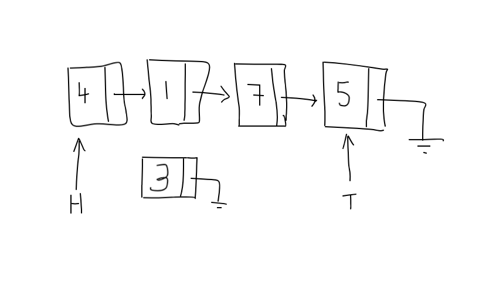

### Introduction

In this post I'll talk about a very common data structure called linked list. The idea behind linked lists is to have data objects **linked** together like a chain where each element **points** to the next element it is linked to. Have enough of these connected together and you've got yourself a **linked list**. You can visualize a linked list like so:


In a linked list, a node is nothing but an "object" that holds some informtion for us. That information could be an integer, string etc along with a pointer to the next node or item in the list. Usually the last node in the list points to nothing (denoted by arrow going into the ground!). There are two types of linked lists: singly linked and doubly linked. The image above shows a singly linked list since there is a single link between two nodes. In a doubly linked list, there'd be another pointer, `prev`, that would point to the previous element. As in, there'd be an arrow going from $1$ to $4$. 

Why study linked lists? Linked lists can be useful in scenarios where our data is frequently updated by inserting new nodes in arbitrary positions. Since our list is dynamic and we haven't limited ourselves with contiguous memory, we can easily break links between nodes, add new nodes and extend our chain. Thus a linked list can be used to implement other useful data structures such as **queues** and **stacks**. 

### Code

I've written a template class in C++ called LinkedList that I'll build on top of for our future posts on queues and stacks. I'll assume that you're quite comfortable with C++ templates and pointers and will start with explaining the concepts behind linked lists. Let's dive in and understand what is going on.

```cpp{numberLines}
#ifndef LinkedList_h
#define LinkedList_h

template<typename T>
struct Node{
    T element;
    Node* next;
};

template<typename T>
class LinkedList{
private:
    Node<T>* head;
    Node<T>* tail;
    int size;
    
public:
    LinkedList();
    ~LinkedList();
    void printList();
    
    void InsertAtHead(T num);
    void InsertAtTail(T num);
    
    void PrintTail();
    void ReverseList();
    void PrintList();
};

//Constructor that initializes our head and tail pointers
//and sets our size to 0.
template<typename T>
LinkedList<T>::LinkedList(){
    head = nullptr;
    tail = nullptr;
    size = 0;
}

//Destructor to clean up our list
template<typename T>
LinkedList<T>::~LinkedList(){
    std::cout << "Destructor called" << std::endl;
    Node<T>* curr = head;
    while (curr != 0){
        Node<T>* temp = curr;
        std::cout << "Deleting: " << curr->element << " ";
        curr = curr->next;
        delete temp;
        temp = curr;
    }
    head = nullptr;
    tail = nullptr;
    std::cout << std::endl;
}

//Function to print our list starting at head
template<typename T>
void LinkedList<T>::PrintList(){
    Node<T>* itr = head;
    while(itr != 0){
        std::cout << itr->element << " ";
        itr = itr->next;
    }
    std::cout << std::endl;
}

//Function to print element pointed to by tail pointer
template<typename T>
void LinkedList<T>::PrintTail(){
    std::cout << tail->element << std::endl;
}

//Function to insert at head of list
template<typename T>
void LinkedList<T>::InsertAtHead(T num){
    Node<T>* n = new Node<T>;
    n->element = num;
    
    if (size == 0){
        n->next = nullptr;
        head = n;
        tail = n;
        size++;
    } else {
        n->next = head;
        head = n;
        size++;
    }
}

//Function to insert at tail of list
template<typename T>
void LinkedList<T>::InsertAtTail(T num){
    Node<T>* n = new Node<T>;
    n->element = num;
    n->next = nullptr;
    
    if (size == 0){
        head = n;
        tail = n;
        size++;
    } else {
        tail->next = n;
        tail = n;
        size++;
    }
}

template<typename T>
void LinkedList<T>::ReverseList(){
    Node<T>* added = head;
    Node<T>* curr = head->next;
    added->next = nullptr;
    tail = head;
    tail->next = nullptr;
    
    while(curr != 0){
        Node<T>* toAdd = curr;
        curr = curr->next;
        toAdd->next = added;
        added = toAdd;
    }
    head = added;
}

#endif
```
### Setup

```cpp{numberLines:30}
//Constructor that initializes our head and tail pointers
//and sets our size to 0.
template<typename T>
LinkedList<T>::LinkedList(){
    head = nullptr;
    tail = nullptr;
    size = 0;
}
```

Before we look at the major opertaions of our linked list class, it is worth talking about our constructor. One lines 34 and 35 we initialize our head and tail pointers to null and set the size to $0$ on line 36. 

The head pointer will always point to the first element in the list and, as the name suggests, the tail pointer will always point to the last element in the list.

Once this constructor is called, we've got our necessary components in place to start adding nodes to our list.

#### Inserts

Let's start with the insert at head function. This function takes in an element,and inserts it, as the name suggests, at the head of our list. This would be the first element in our list if we're going from left to right (as is the convention).


```cpp{numberLines:73}
//Function to insert at head of list
template<typename T>
void LinkedList<T>::InsertAtHead(T num){
    Node<T>* n = new Node<T>;
    n->element = num;
    
    if (size == 0){
        n->next = nullptr;
        head = n;
        tail = n;
        size++;
    } else {
        n->next = head;
        head = n;
        size++;
    }
}
```

Inside the function, first thing we do is declare a pointer to a new Node object.  We then add to this Node object's element field the value that was passed in. Next we test if the list was empty: if so, we point both our head and tail pointers to this new object. If the list wasn't empty, we assign the next value for this new node to head and then reassign head to point to this new node. 

Say, for example, we've got our list as shown at the [top](#introduction). Let's say we're adding $3$ to the head of the list. Based on the code for our function, well fall into the else part of `if-else` and the first thing that'll happen is that we'll create a new node:



Next, we'll reassign this newly made node's next pointer to whatever `head` is pointing to:


We'll finally then point `head` to this new node:


Thus, as the image shows, we've added a new node to the head of the linked list. Similar logic is used to insert at tail of the linked list. 

### Reverse Singly Linked List

A fun exercise to try is to reverse a singly linked list using $O(1) (constant)$ space and $O(n)$ time. There are plenty of ways to do this and I encourage you to try a different approach. Here's how I thought about the reversing process: we start with the current head and break the link between head and the following node. Then we make the next node point to the previous node thus reversing the order. We repeat this process until no more nodes are left. Ofcourse, in the process, we need to assign the new tail and head.

Before I explain with pictures, let me show you what the code looks like:

```cpp{numberLines:109}
template<typename T>
void LinkedList<T>::ReverseList(){
    Node<T>* added = head;
    Node<T>* curr = head->next;
    tail = head;
    tail->next = nullptr;
    
    while(curr != 0){
        Node<T>* toAdd = curr;
        curr = curr->next;
        toAdd->next = added;
        added = toAdd;
    }
    head = added;
}
```

Pictorially, here is what I'm doing:

Let's say this is our list with our head and tail pointers:


In reversed order, when we print this list, obviously we'd want to see 5-4-1-3 printed. At the beginning of the `ReverseList()` function, I assign a few pointers:

```cpp{numberLines:111}
    Node<T>* added = head;
    Node<T>* curr = head->next;
```

and now our list looks like this: (I've substituted `a` as the name for `added` pointer in the pictures)


Now that we've got our pointers in place, let's break the old links and create new ones. Since our current head will be our new tail,I do the following:

```cpp{numberLines:113}
    tail = head;
    tail->next = nullptr;
```

Line 113 changes the current head and re-name it as tail, since, as I mentioned earlier, our current head will be the new tail once the list is reversed. On line 114, I point tail to `nullptr` since tails always point to it (denoted by no arrow going out of tail). Once these two lines are executed we're done with our initial setup. We've isolated our new tail and now need to iteratively go through each element (1,4 and 5) and add it behind our new tail. Our list looks like this right now:


Now we enter the `while` loop which is executed until our `curr` pointer points to null:

```cpp{numberLines:116}
    while(curr != 0){
        Node<T>* toAdd = curr;
        curr = curr->next;
        toAdd->next = added;
        added = toAdd;
    }
```

Inside the `while` loop, we create another Node pointer, `toAdd` (denoted by ta in pictures) and point it to curr on line 117. We then move curr to the next element on line 118. After lines 117 and 118 are executed, our list looks like this:


Next,on line 119, we re-assign the `next` for our `toAdd` variable, and point it to whatever was recently added to the reversed list, and the element recently added to the reversed list is being pointed to by `added`. So, we make `toAdd`'s next point to `added`. Now, our list looks like this:


We then make `added` point to `toAdd` on line 120 and we go back to the top of the while loop. We see that `curr` is not pointing to null, so we continue inside the loop and re-declare `toAdd` to point to `curr` and increment `curr` to point to `curr`'s next:


We then continue to repeat the process in the `while` loop until our `curr` pointer is pointing to `nullptr`. At that point, we've reversed our list and all that is left to do is assign our new `head` which is currently being pointed to be `added`. I strongly suggest that you try this out with a paper and a pencil and iterate through the steps to see how we reversed it. 

### Move to Front Algorithm

As you noticed, iterating over a list to find an element takes $O(N)$ time. This can get quite slow for long lists. There are  [algorithms](https://en.wikipedia.org/wiki/Self-organizing_list) that allow us to transform our linked list so as to improve access time for elements. One such algorithm is called **Move to Front**. As the name suggests, MTF searches the list for an element the user is interested in and once the element is found, it is moved to the front of the list so that subsequent searches for the same element are faster. The idea is useful where we make the assumption that recently accessed elemetns are more likely to be reaccessed. Ofcourse, as you can imagine, this is not a perfect approach to reduce the $O(N)$ search time and there are many scenarios where our time won't be that much different from a sequential search. Assuming our searches are such that once we access an element, we're very likely to search for it again, MTF works perfectly fine. 

Sample code for moving an element to the front of the list is quite simple and here I share my implementation:

```cpp{numberLines}
template <typename T>
void LinkedList<T>::MoveToFront(T elem){
    Node<T>* temp = head->next;
    Node<T>* prev = head;
    while(temp != 0){
        if (temp->element == elem){
            prev->next = temp->next;
            temp->next = nullptr;
            temp->next = head;
            head = temp;
        } else {
            temp = temp->next;
            prev = prev->next;
        }
    }
}
```

The idea is simple: we use two pointers, `temp` and `prev` to iterate over the list. If the element pointed to by `temp` is what we've been searching for, we sever the links and move `temp` to the front of the list.

### Conclusion

Linked lists are extremely powerful if you're required to constantly update your data (inserts and deletes). Insertion into a linked list would require you to sequentially iterate through your list - $O(n)$ - and then add your new node: $O(1)$. The down side is that if you need to search your list, you'd have to iterate through all the elements: $O(n)$.
However, if your updates are infrequent, it'd be better to use an array since arrays provide us with fast lookup: $O(1)$. However, if you need to add a new item to your array, you'd have to allocate a new array, shift entries down and insert the new element in its correct position.