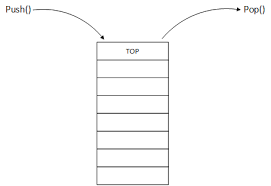

Stack data structure
<!-- end -->

### Introduction

In this post I'll talk about a very common data structure called **stack**. Stack, as the name suggests, depicts the stack ADT. It means that elements are **stacked** on top of one another.



The image above shows the stack data structure. As the pointers show, the only operations we're concerned with in a stack are **push** and **pop**. Pushing on a stack means adding data to the top of our stack while popping means removing data from the stack. Due to this, a stack is a **LIFO** data structure: Last In, First Out. Let's have a look at some code on how to implement a stack and its common operations.

### Code

```{cpp:numberLines}
#ifndef Stack_h
#define Stack_h

#include <iostream>
#include <stdio.h>
#include <string>

using namespace std;

template <typename T>
struct Node{
    Node<T>* next;
    T element;
};

template <typename T>
class Stack{
private:
    Node<T>* head;
    int size;
    
public:
    Stack();
    ~Stack();
    void Push(T elem);
    T Pop();
    int GetSize();
    void Print();
};

template <typename T>
Stack<T>::Stack(){
    size = 0;
    head = nullptr;
}

template <typename T>
void Stack<T>::Push(T elem){
    Node<T>* newItem = new Node<T>;
    newItem->element = elem;
    newItem->next = nullptr;
    if (size == 0){
        head = newItem;
    } else {
        newItem->next = head;
        head = newItem;
    }
    size++;
}

template <typename T>
T Stack<T>::Pop(){
    T poppedElement;
    if (size == 1){
        poppedElement = head->element;
        delete head;
    } else {
        Node<T>* curr = head;
        head = head->next;
        poppedElement = curr->element;
        delete curr;
    }
    size--;
    return poppedElement;
}

template <typename T>
void Stack<T>::Print(){
    Node<T>* temp = head;
    while (temp != 0){
        cout << temp->element << " ";
        temp = temp->next;
    }
    cout << endl;
}

template <typename T>
Stack<T>::~Stack(){
    while (head != 0){
        Node<T>* temp = head;
        cout << "Deleting: " << temp->element << " ";
        head = head->next;
        delete temp;
    }
    
    cout << endl;
}

template <typename T>
int Stack<T>::GetSize(){
    return size;
}
```

### Explanation

Similar to my [Linked List](/post/linked-lists/#code) implementation, I've created a templated `Stack()` class. We can think of a stack as a linked list where the only operations allowed are add to front and remove from front. 

The code is pretty standard. It is clear that the insertion, or `Push()` method takes $O(1)$ time since all we're doing is creating a new node and adding it to the top of our stack.

Removal, or `Pop()`, takes $O(1)$ time as well since all we're doing is removing the element present at head, freeing up memory that was being used by that node, and then reassigning `head` pointer to the next element on stack.

### Dijkstra's Two Stack Algorithm

Let's look at a simple problem: Write a program to evaluate expressions such as $ {1+[(2+3)*(4*5)]} $. This is a simple arithmetic expression where we work our way out by evaluating inner-most expression. A simple algorithm, developed by Dijkstra, uses two stacks to solve expressions similar to the one shown above. The algorithm follows these steps:

- Ignore opening ( `{,[,(` ) parenthesis
- If an operand is read, push to operand stack (stack one)
- If an operator is read, push to operator stack (stack two)
- If a closing ( `},],)` ) parenthesis is read, pop two elements from the operand stack and the top element from operator stack and perform the relevant operation.
- Continue until both stacks are empty

#### Code

I'm assuming that the input expression is in the string format. With that in mind, here is the method that I wrote to evaluate the expression:

```cpp{numberLines}
template <typename T>
int Stack<T>::EvaluateExpression(string input){
    stringstream ss;
    char ch;
    ss << input;
    Stack<T> operatorStack;
    Stack<T> operandStack;
    int answer = 0;
    while (ss >> ch){
        if (isdigit(ch)){
            int elem = ch - '0';
            operandStack.Push(elem);
        } else if (ch == '*' || ch == '/' || ch == '+' || ch == '-'){
            operatorStack.Push(ch);
        } else if (ch == ']' || ch == '}' || ch == ')'){
            int elem1 = operandStack.Pop();
            int elem2 = operandStack.Pop();
            char sign = operatorStack.Pop();
            if (sign == '+'){
                answer = elem2 + elem1;
            } else if (sign == '-'){
                answer = elem2 - elem1;
            } else if (sign == '*'){
                answer = elem2 * elem1;
            } else {
                answer = elem2 / elem1;
            }
            operandStack.Push(answer);
        }
    }
    
    int itemsLeft = operatorStack.GetSize();
    while (itemsLeft > 0){
        int elem1 = operandStack.Pop();
        int elem2 = operandStack.Pop();
        char sign = operatorStack.Pop();
        if (sign == '+'){
            answer = elem2 + elem1;
        } else if (sign == '-'){
            answer = elem2 - elem1;
        } else if (sign == '*'){
            answer = elem2 * elem1;
        } else {
            answer = elem2 / elem1;
        }
        
        operandStack.Push(answer);
        itemsLeft--;
    }
    return operandStack.Pop();
}
```

#### Explanation
From lines `3 - 8` I'm declaring the stringstream that is to be used to process the input. We then declare our two stacks, the `operatorStack` for our mathematical operations and the `operandStack` the actual integers we'd be performing our operations on. 

Once we have that setup taken care of, we start reading the input character by character. On lines `10 - 13`:

```cpp{numberLines:10}
    if (isdigit(ch)){
            int elem = ch - '0';
            operandStack.Push(elem);
        } 
```

we check to see if the input is a digit using `isdigit` defined in `#include <ctype.h>`. You need to import `#include <ctype.h>` in your class to be able to use this method. If the character read is a digit, we convert to an integer and push it to our `operandStack`. 


Next, we check to see if the element is a symbol that represents a mathematical operation and if so, we push that symbol to the `operandStack`:

```cpp{numberLines:13}
    else if (ch == '*' || ch == '/' || ch == '+' || ch == '-'){
            operatorStack.Push(ch);
    }
```

Finally, in the final `else if` we check to see if we've encountered a closing brace. If so, we pop the two operands from our `operandStack` and the operator from our `operatorStack` and perform the necessary operation. Finally, after the operation is done, we push the result back on to the `operandStack`:

```cpp{numberLines:15}
    else if (ch == ']' || ch == '}' || ch == ')'){
            int elem1 = operandStack.Pop();
            int elem2 = operandStack.Pop();
            char sign = operatorStack.Pop();
            if (sign == '+'){
                answer = elem1 + elem2;
            } else if (sign == '-'){
                answer = elem1 - elem2;
            } else if (sign == '*'){
                answer = elem1 * elem2;
            } else {
                answer = elem1 / elem2;
            }
            operandStack.Push(answer);
    }
```

This process is continued until we've encountered the last closing brace after which we check to see if the stacks are empty. If not, we continue to perform the steps above until the stacks are empty.

As an example, let's assume that we had to evaluate this expression:

$$10*[ (4 + 5) * ( 13 - 12) ]$$ 

First, we encounter the 10, and push it to our `operandStack`:

```
    10
____________        _____________
operandStack        operatorStack
```
Next, we encounter the multiplication sign and push to our `operatorStack`:

```
    10                  *
____________        _____________
operandStack        operatorStack
```

Then, we ignore the two opening braces: "[" and "(". We then push 4 to `operandStack`, the addition symbol to `operatorStack` and again the integer 5 to `operandStack`:

```
    5
    4                   +
    10                  *
____________        _____________
operandStack        operatorStack
```
Now comes the fun part: we encounter a closing brace, ) , at which point we pop two elements from `operandStack`, a single element from the `operatorStack`:

```

                        
    10                  *
____________        _____________
operandStack        operatorStack
```

and perform the operation based on the operator we popped from the `operatorStack`:

`4 + 5`. 

We then push the result back to our `operandStack`:

```

    9                    
    10                  *
____________        _____________
operandStack        operatorStack
```
Next, we continue reading from our string and find a multiplication symbol:

```

    9                   * 
    10                  *
____________        _____________
operandStack        operatorStack
```

Next we ignore the opening brace, push 13 to `operandStack`, push the subtraction sign to `operatoStack` and push 12 to `operandStack`:

```
    12
    13                  -
    9                   * 
    10                  *
____________        _____________
operandStack        operatorStack
```

Now, we encounter a closing brace, ), so we pop two elements from the `operandStack` and a single element from the `operatorStack`. We then perform the operation based on the popped element from the `operatorStack`, and push the result back to `operandStack`:

```cpp

13 - 12 = 1

```

```
    
    1                 
    9                   * 
    10                  *
____________        _____________
operandStack        operatorStack
```

Next we get another closing brace, ], so we pop and push our operation's result:

```
    
             
    9                   
    10                  *
____________        _____________
operandStack        operatorStack
```

Now, we're done with the closing braces and there is no more input to process. However, we still have elements on both stacks. So, while `operatorStack` is not empty, repeat the calculation and pushing process:

```
    
             
                       
    90                  
____________        _____________
operandStack        operatorStack
```

Notice, our final answer is the only item that remains on the `operandStack` which we return from the function.

### Balanced Parenthesis Check

A problem similar to what we discussed in the previous section is one that checks whether an expression has balanced parenthesis. 
Again, we'll take advantage of the stack class we wrote to verify a given string. Our sample string could look like:

`[{()}]{([])}` 

and we're to check whether this is valid. In the example above, we should return true.

The logic is quite simple. I've written a function in our `Stack` class called `isValid(string input) that looks like this:

```cpp{numberLines}
template <typename T>
bool Stack<T>::isValid(string input){
    stringstream ss;
    char ch;
    ss << input;
    Stack<T> inputStack;
    while (ss >> ch){
        if (ch == '[' || ch == '{' || ch == '('){
            inputStack.Push(ch);
        } else if (ch == ']') {
            char popped = inputStack.Pop();
            if (popped != '[')
                return false;
        }else if (ch == '}') {
            char popped = inputStack.Pop();
            if (popped != '{')
                return false;
        }else if (ch == ')') {
            char popped = inputStack.Pop();
            if (popped != '(')
                return false;
        }
    }
    
    if (inputStack.size != 0){
        return false;
    }
    
    return true;
}
```

The logic is quite simple: If we encounter an opening brace, we push it to on our stack. If a closing brace is read, we pop an element from our stack and compare whether it is the corresponding opening brace. If so, we continue, otherwise, we break immediately and return false. 

### Print in Reverse

Another simple use case for a stack: given a string, print it in reverse order. Obviously, there are better methods to do so using just a for loop but this is a good exercise to understand how stacks work:

```cpp{numberLines}
template <typename T>
void Stack<T>::PrintStringInReverse(string input){
    stringstream ss;
    char ch;
    ss << input;
    Stack<T> inputStack;
    while (ss >> ch){
        inputStack.Push(ch);
    }
    
    while (inputStack.GetSize() > 0){
        cout << inputStack.Pop();
    }
    cout << endl;
}
```

The code above is quite self explanatory: it will take in a string, push it to our `inputStack` and then print out elements as they're popped off the stack. This would result in our string being printed in reverse order.

### Conclusion

Stacks can be quite handy when attempting to solve a certain type of problem where the order of elements is important.