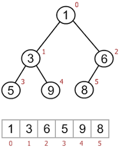

### Table of Contents

1. [Introduction](#introduction)

2. [Setup](#setup)

3. [Constructor](#constructor)

4. [Insert](#insert)

5. [Recursive Insert](#recursive-insert)

6. [Traversal](#traversal)

7. [Find](#find)

8. [Max](#max)

9. [Min](#min)

10. [Delete](#delete)

11. [Destructor](#destructor)

12. [Running time analysis](#running-time-analysis)

13. [Trees as arrays](#trees-as-arrays)

15. [Problems](#problems)
    * [Test if a Binary Tree satisfies the Binary Search Tree Property](#test-if-a-bt-satisfies-the-bst-property)
    * [Find next in in-order traversal](#find-next-in-in-order-traversal)
    * [Find k largest elements](#find-k-largest-elements)
    * [Find LCA](#find-lca)
    * [Construct tree from pre-order](#construct-tree-from-pre-order)
    * [Construct tree from post-order]

14. [Conclusion](#conclusion)

### Introduction

In this post I'll talk about a data structure called Binary Search Tree. This post is related to my [binary search](/binary-search) post where we discussed the binary search algorithm. BSTs use a similar idea but allow us to store our data efficiently so that we don't have to iterate over an entire array to perform various operations on the data that we stored. We'll look at this in more detail as we go over the code.

Formally, a BST is a **rooted [binary tree](/binary-trees) whose internal nodes each store a key greater than all the keys in the node's left subtree and less than those in its right subtree**

### Setup

I've got 2 generic classes: A `BinaryTree` class that includes another private class called `Node`. The initial setup looks like so:

```cpp{numberLines: true}
template<typename T>
class BinaryTree{
private:
    class Node{
    public:
        Node* left;
        Node* right;
        T item;
    };
    Node* root;
    int size;
    void InOrderTraversal(Node* curr);
    void PreOrderTraversal(Node* curr);
    void PostOrderTraversal(Node* curr);
    void PostOrderRemoval(Node* curr);
    void RecursiveInsert(Node*& curr, T newItem);
    void FindMin(Node*curr);
    Node* RecursiveDeletePrivate(Node*, T);
    
public:
    BinaryTree();
    ~BinaryTree();
    void Insert(T newItem);
    bool Find(T itemToFind);
    void InOrderTraversal();
    void PreOrderTraversal();
    void PostOrderTraversal();
    T FindMax();
    T FindMin();
    void RecursiveDelete(T itemToDelete);
    
};
```

We'll go in more detail as we implement each of the functions in this class. The initial setup declares a generic class called `BinaryTree`. Inside this class, as a private member, we've got another class called `Node` to represent each node of the tree. The `Node` class will hold a generic item.

### Constructor

For the `BinaryTree` constructor, all we do is initialize the root pointer and the size variable to 0. Therefore, when the class is created, we setup our root that'll be used to access the tree:

```cpp
template<typename T>
BinaryTree<T>::BinaryTree(){
    root = nullptr;
    size = 0;
}
```
### Insert

```cpp{numberLines: true}
template<typename T>
void BinaryTree<T>::Insert(T newItem){
    size++;
    Node* newNode = new Node;
    newNode->item = newItem;
    newNode->left = nullptr;
    newNode->right = nullptr;
    if (root == nullptr){
        root = newNode;
    } else {
        Node* curr = root;
        Node* prev = root;
        while (curr != nullptr){
            prev = curr;
            if (newItem < curr->item){
                curr = curr->left;
            } else {
                curr = curr->right;
            }
        }
        
        if (newItem < prev->item)
            prev->left = newNode;
        else
            prev->right = newNode;
    }
}
```

Line 3 increments the size variable because we're about to add a new node to our tree. Then, lines 4-7 create the new node, populate the data field (called `item` in our example) and set the `left` and `right` pointers to `nullptr`. 

We then check to see if the root points to `nullptr`. This would happen when our tree is empty and we're adding a new node to it. If that is the case, all we do is make `root` point to this newly created node. We then increment the size variable and exit the function.

If root is not null, we have to traverse down the tree to find the correct position to add this new node. To do so, we maintain 2 pointers: `prev` and `curr`. The `prev` pointer is to keep track of the parent of this newly created node. We continue going down the tree until `curr` is null at which point `prev` would be pointing to the parent node. At this point, we can add our new node in the leaf position as either a left child (if less than parent) or right child (if greater than parent).

### Recursive Insert

You can insert a new node into the tree recursively as well since a tree can be considered a recursive structure. You can expose a public function that is called `RecursiveInsert(T newItem)` that takes in a new item that is to be inserted in the tree. This function can then in turn call a private function that has access to the root and can recursively insert items into the tree.

```cpp{numberLines:true}
template<typename T>
void BinaryTree<T>::RecursiveInsert(Node*& curr, T newItem){
    if (curr == nullptr){
        Node* newNode = new Node;
        newNode->item = newItem;
        newNode->left = nullptr;
        newNode->right = nullptr;
        curr = newNode;
        return;
    }
    if (newItem < curr->item)
        RecursiveInsert(curr->left, newItem);
    if (newItem > curr->item)
        RecursiveInsert(curr->right, newItem);
}
```

The function signature takes in a reference to a pointer. This reference is to the root of the tree since we're modifying the root. Now, once this function is called we've got 3 different cases to handle: 

- one where the tree is empty and we're inserting for the first time (lines 3-9)
- one where the item to be inserted is less than the current item we're on (line 12)
- one where item to be inserted is greater than the current item we're on (line 14)

In each case, we make a recursive call based on the value we received and the item we're on. So, if we've got these calls:

```cpp
    bt.Insert(10);
    bt.Insert(4);
    bt.Insert(3);
    bt.Insert(6);
    bt.Insert(18);
    bt.Insert(13);
    bt.Insert(11);
    bt.Insert(12);
    bt.Insert(21);
    bt.Insert(20);
```

we'll have the following recursive call stack:

```cpp
bt.Insert(root, 10) --> first item being inserted therefore we execute lines 3-9

bt.Insert(root, 4) --> root points to 10 so item to be inserted < curr->item so we call the function again with curr->left
   bt.Insert(root->left, 4) --> We're now at nullptr so we can execute lines 3-9 and return  
 
```

This check and insert continues for each new insert. 

### Traversal

```cpp{numberLines: true}
template<typename T>
void BinaryTree<T>::InOrderTraversal(){
    BinaryTree<T>::InOrderTraversal(root);
}

template<typename T>
void BinaryTree<T>::InOrderTraversal(Node* curr){
    if (curr == nullptr){
        return;
    }
    InOrderTraversal(curr->left);
    cout << curr->item << " ";
    InOrderTraversal(curr->right);
}
```

To traverse the tree, we've got 2 functions: the one on line 2 is exposed to the client. This function, in turn calls another private function that'll have access to the `root` and will be able to recursively call itself to print the tree. In-order traversal is done in the following sequence:
- Print the left-subtree
- Print the current node
- Print the right sub-tree

(Left,curr,right)

Similarly, we can have pre-order traversal (curr,left,right) and post-order traversal (left,right,curr). The only thing that changes for these two methods is the order of the recursive and `cout` calls on lines 11-13.

### Find

```cpp{numberLines: true}
template<typename T>
bool BinaryTree<T>::Find(T itemToFind) {
    Node* curr = root;
    while (curr != nullptr){
        if (itemToFind < curr->item)
            curr = curr->left;
        else if (itemToFind > curr->item)
            curr = curr->right;
        else
            return true;
    }
    
    return false;
}
```

The `Find` function, as the name suggests, checks to see if value exists in the tree. If so, we return `true` otherwise `false` is returned. The logic is that we start at the root and keep moving in the right direction: search in the left subtree if `itemToFind` is less than `curr` or right subtree if `itemToFind` is greater than `curr`. If we reach all the way to the end and find that `curr` is null, we return false. Otherwise we return true as soon as the value is found. 

### Max

```cpp{numberLines: true}
template<typename T>
T BinaryTree<T>::FindMax(){
    Node* curr = root;
    while (curr->right != nullptr){
        curr = curr->right;
    }
    return curr->item;
}
```

The max value in the tree is the right-most node (it can be in the leaf position or an internal node with just the left child). For example, if you have this tree:

```
    10
   /  \
  4   21
     /
    20 

```

the max value is `21` even though it is not a leaf however it is the right-most node in the tree. A simpler example would be:

```

    10
   /  \
  4   21
     /  \
    20  32
``` 

Here, max is `32` which is the right-most node in the tree. Therefore, keep moving to the right child of current node until there is no right child to visit.

### Min

```cpp{numberLines: true}
template<typename T>
T BinaryTree<T>::FindMin(){
    Node* curr = root;
    while (curr->left != nullptr){
        curr = curr->left;
    }
    return curr->item;
}
```

Here, the minimum element is the left-most node in the tree. Therefore, keep moving to the left child of current node until there is no left child to visit.

### Delete:

[Credit for this section](https://www.youtube.com/watch?v=gcULXE7ViZw&list=PL2_aWCzGMAwI3W_JlcBbtYTwiQSsOTa6P&index=36)

Let's look at a recursive approach that deletes a node from a BST:
 
 This is the function that our client will be calling:
 ```cpp{numberLines: true}
 template <typename T>
 void BinaryTree<T>::RecursiveDelete(T itemToDelete){
     //Need to capture returned root because we might be
     //deleting the actual root during the delete operation
     root = RecursiveDeletePrivate(root, itemToDelete);
 } 
 ```

As was explained earlier, this function takes in the `itemToDelete` and calls another private function with the `root` since the client won't have access to the root. The returned value of that private function is again captured by the `root` variable since our delete operation might edit the root of the tree as well.

As mentioned, it takes in a pointer to the root of the tree and the value of the item to be deleted, due to which the private helper function signature looks like so: 

```cpp
template <typename T>
typename BinaryTree<T>::Node* BinaryTree<T>::RecursiveDeletePrivate(Node* root, T itemToDelete){
    //Do something....
}
```

 First thing we want to do inside this function is to check whether the `root` passed is null which would occur when the tree is empty. We do so by adding this check:
 
 ```cpp{numberLines: true}
 template <typename T>
 typename BinaryTree<T>::Node* BinaryTree<T>::RecursiveDeletePrivate(Node* root, T itemToDelete){
     if (root == nullptr){
         return nullptr;
     }
```

Next, if the root is not null, we want to check to see if the item to be deleted lies in left subtree (`if itemToDelete < root->item`) or in the right subtree (`if itemToDelete > root->item`). If it lies in the left sub-tree, we make a recursive call to the same function, `RecursiveDeletePrivate` but this time the root as `root->left`. If it lies in the right sub-tree, we make a recursive call with root as `root->right`. For each of these two calls, the returned value would be the modified sub-tree so we set the respective subtree (right or left) based on the case we have:

 ```cpp{numberLines: true}
template <typename T>
typename BinaryTree<T>::Node* BinaryTree<T>::RecursiveDeletePrivate(Node* root, T itemToDelete){
    if (root == nullptr){
        return nullptr;
    } else if (itemToDelete < root->item){
        root->left = RecursiveDeletePrivate(root->left, itemToDelete);
    } else if (itemToDelete > root->item){
        root->right = RecursiveDeletePrivate(root->right, itemToDelete);
    } 
```

If the value is not less than or greater than `root->item`, it means that `itemToDelete` == `root->item`. In this case, we need to check whether the node we're about to delete (pointed to by `root`) has:
 - no children 
 - a right only child
 - a left only child 
 - two children
 
 If the root has no children, we can simply delete `root` and return `nullptr`:
  ```cpp{numberLines: true}
 template <typename T>
 typename BinaryTree<T>::Node* BinaryTree<T>::RecursiveDeletePrivate(Node* root, T itemToDelete){
     if (root == nullptr){
         return nullptr;
     } else if (itemToDelete < root->item){
         root->left = RecursiveDeletePrivate(root->left, itemToDelete);
     } else if (itemToDelete > root->item){
         root->right = RecursiveDeletePrivate(root->right, itemToDelete);
     } else {
         //We found the item.
         if (root->left == nullptr && root->right == nullptr){
             //It is a leaf node
             delete root;
             root = nullptr;
             return root;
             
         }
     }
 }
```

If the root has a right only child, we can make root point to this right child and delete root's old value:

 ```cpp{numberLines: true}
template <typename T>
typename BinaryTree<T>::Node* BinaryTree<T>::RecursiveDeletePrivate(Node* root, T itemToDelete){
    if (root == nullptr){
        return nullptr;
    } else if (itemToDelete < root->item){
        root->left = RecursiveDeletePrivate(root->left, itemToDelete);
    } else if (itemToDelete > root->item){
        root->right = RecursiveDeletePrivate(root->right, itemToDelete);
    } else {
        //We found the item.
        if (root->left == nullptr && root->right == nullptr){
            //It is a leaf node
            delete root;
            root = nullptr;
            return root;
            
        } else if (root->left == nullptr){
            //Node to be deleted has right children
            Node* temp = root;
            root = root->right;
            delete temp;
            temp = nullptr;
            return root;
            
        }
    }
}
```

If the root has a left only child, we can make the root point to this left child and delete the old root node:
 
 ```cpp{numberLines: true}
template <typename T>
typename BinaryTree<T>::Node* BinaryTree<T>::RecursiveDeletePrivate(Node* root, T itemToDelete){
    if (root == nullptr){
        return nullptr;
    } else if (itemToDelete < root->item){
        root->left = RecursiveDeletePrivate(root->left, itemToDelete);
    } else if (itemToDelete > root->item){
        root->right = RecursiveDeletePrivate(root->right, itemToDelete);
    } else {
        //We found the item.
        if (root->left == nullptr && root->right == nullptr){
            //It is a leaf node
            delete root;
            root = nullptr;
            return root;
            
        } else if (root->left == nullptr){
            //Node to be deleted has right children
            Node* temp = root;
            root = root->right;
            delete temp;
            temp = nullptr;
            return root;
            
        } else if (root->right == nullptr){
            //Node to be deleted has left children
            Node* temp = root;
            root = root->left;
            delete temp;
            temp = nullptr;
            return root;
        }
    }
}
```

And finally, if none of those conditions hold, it means that the root points to a node that has 2 children. In this case, we need to search for the smallest value in the right subtree (or the largest value in the left subtree but the example below shows the former) and write to root this new value. We'd then have 2 nodes with the same value. To delete this smallest child in the right subtree, we'll again call our `RecursiveDeletePrivate()` function but this time with root's right child and the value we just copied over:
 
 ```cpp{numberLines: true}
template <typename T>
typename BinaryTree<T>::Node* BinaryTree<T>::RecursiveDeletePrivate(Node* root, T itemToDelete){
    if (root == nullptr){
        return nullptr;
    } else if (itemToDelete < root->item){
        root->left = RecursiveDeletePrivate(root->left, itemToDelete);
    } else if (itemToDelete > root->item){
        root->right = RecursiveDeletePrivate(root->right, itemToDelete);
    } else {
        //We found the item.
        if (root->left == nullptr && root->right == nullptr){
            //It is a leaf node
            delete root;
            root = nullptr;
            return root;
            
        } else if (root->left == nullptr){
            //Node to be deleted has right children
            Node* temp = root;
            root = root->right;
            delete temp;
            temp = nullptr;
            return root;
            
        } else if (root->right == nullptr){
            //Node to be deleted has left children
            Node* temp = root;
            root = root->left;
            delete temp;
            temp = nullptr;
            return root;
        } else{
            //Node to be deleted has 2 children - left and right
            //Find min in right subtree
            Node* temp = root->right;
            
            while (temp->left != nullptr){
                temp = temp->left;
            }
            
            root->item = temp->item;
            root->right = RecursiveDeletePrivate(root->right, temp->item);
            
        }
    }
    return root;
}
```

Finally, after all these operations are done, we can return `root`.

Let's run through an example to see what is going on. Say our tree looks like this:

```

    10
   /  \
  4   21
     /  \
    15  32
     \
     20
``` 

#### Delete leaf node 20:

We get this call from our client:

```cpp
    root = RecursiveDeletePrivate(root, 20);
```

Before we start executing `RecursiveDeletePrivate()`, here is what we've got now:

```

    10 ---> root
   /  \
  4   21
     /  \
    15  32
     \
     20
``` 

`root` is not `nullptr` and `itemToDelete > root->item` we fall to line 8:

```cpp{numberLines: 8}
       root->right = RecursiveDeletePrivate(root->right, itemToDelete);
```

At this point we halt execution of the current run and make a new recursive call:

```cpp
//Recursive call stack:
10->right = RecursiveDeletePrivate(10->right, 20)
```

where `10->right` is actually the node with value 21. So now, this new call has our root positioned like so:

```

    10 
   /  \
  4   21 ---> root
     /  \
    15  32
     \
     20
``` 

So, we've called this: `RecursiveDeletePrivate(10->right, 20)` so our root is at node with value `21`. This time we fall to line 6:

```cpp{numberLines: 6}
       root->left = RecursiveDeletePrivate(root->left, itemToDelete);
```

so now our recursive call stack would look like this:

```cpp
//Recursive call stack:
10->right = RecursiveDeletePrivate(10->right, 20) // root = 21
        21->left = RecursiveDeletePrivate(21->left, 20) // root = 15
```

With this new call, we pause this recursive call on the call stack and start another recursive call with root as 15:

```

            10 
           /  \
          4   21 
             /  \
    root-->15   32
            \
            20
```

Again, we go inside `RecursiveDeletePrivate(21->left, 20)` and find that `itemToDelete > root->item` so we fall to line 8:

```cpp{numberLines: 8}
       root->right = RecursiveDeletePrivate(root->right, itemToDelete);

```

so we pause this recursive call and make another call. Our recursive call stack looks like this:

```cpp
//Recursive call stack:
10->right = RecursiveDeletePrivate(10->right, 20) // root = 21
        21->left = RecursiveDeletePrivate(21->left, 20) // root = 15
            15->right = RecursiveDeletePrivate(15->right,20) // root = 20
```

Our tree now looks like this:

```

    10 
   /  \
  4   21 
     /  \
    15  32
     \
     20 ---> root
``` 


On this recursive call, we fall to line 9 since we've found the item we were looking to delete. Check on line 11 holds true since the node has no children. So what we do is delete this node, set it to `nullptr` and return this root. So our recursive call stack now starts to unwind:

 ```cpp
 //Recursive call stack:
 10->right = RecursiveDeletePrivate(10->right, 20) // root = 21
         21->left = RecursiveDeletePrivate(21->left, 20) // root = 15
             15->right = RecursiveDeletePrivate(15->right,20) // root = 20
                root = 20 -> delete and return nullptr
 ```

The returned nullptr is assigned to `15->right`:

 ```cpp
 //Recursive call stack:
 10->right = RecursiveDeletePrivate(10->right, 20) // root = 21
         21->left = RecursiveDeletePrivate(21->left, 20) // root = 15
             15->right = RecursiveDeletePrivate(15->right,20) = nullptr // root = 20
                root = 20 -> delete and return nullptr
 ```

So, `15-right = nullptr` so our mini returned tree looks like this:

```
    15
     \
    nullptr
```

After this returns, our call stack has these calls left:


 ```cpp
 //Recursive call stack:
 10->right = RecursiveDeletePrivate(10->right, 20) // root = 21
         21->left = RecursiveDeletePrivate(21->left, 20) // root = 15
 ```

This mini tree is then returned to the call `21->left = RecursiveDeletePrivate(21->left, 20)` when it resumes. So our mini tree is attached to `21->left`:

```
     21
     /
    15
     \
    nullptr
```

Now our call stack has this call left:

```cpp
 //Recursive call stack:
 10->right = RecursiveDeletePrivate(10->right, 20) // root = 21
 ```
So for `10->right` we attach the result of `RecursiveDeletePrivate(10->right, 20)` which results in:

```
    10
     \
     21
     /
    15
     \
    nullptr
```

Now our call stack is empty and we finally return the root on line 46. Since we didn't touch any other nodes, all other connections remain as is. Notice how we went up the tree after deleting the node we were interested in. 

#### Delete node with one child 15:
Let's assume our tree looks like this:

```

    10 ---> root
   /  \
  4   21
     /  \
    15  32
     \
     20
``` 

Here is what the call stack would look like after each call (I've abbreviated the steps so that we can get to the point):


```cpp
 //Recursive call stack:
 10->right = RecursiveDeletePrivate(10->right, 15) // root = 21
    21->left = RecursiveDeletePrivate(21->left, 15) // root = 15
        root->15 : found our element-> return something...
 ```

At this point, here is what the tree looks like:

```

            10 
           /  \
          4   21 
             /  \
    root-->15   32
            \
            20
```

After root is pointing to 15, we've found our node to delete and we fall into the else on line 9. Here, we find that the case is:
`else if (root->left == nullptr)` and we go into this else if statement. Next, we create a `temp` pointer that also points to node with value 15:

```

            10 
           /  \
          4   21 
             /  \
temp/root-->15   32
             \
             20
```

and `root` moves to `root->right`:

 ```
 
             10 
            /  \
           4   21 
              /  \
     temp-->15   32
             \
     root--> 20
 ```

Next, we delete `temp` and make `temp` point to `nullptr`:

 ```
 
             10 
            /  \
           4   21 
              /  \
    temp-->NULL  32
             \
     root--> 20
 ```

and we finally return `root`. Now remember, the recursive call stack up till this point is still this:

```cpp
 //Recursive call stack:
 10->right = RecursiveDeletePrivate(10->right, 15) // root = 21
    21->left = RecursiveDeletePrivate(21->left, 15) // root = 15
        root->15 : found our element-> return something...
 ```

So, when we return root, we're returning the pointer pointing to node 20. Thus, our call stack starts to unwind like so:

We return 20:
```cpp
 //Recursive call stack:
 10->right = RecursiveDeletePrivate(10->right, 15) // root = 21
    21->left = RecursiveDeletePrivate(21->left, 15) // root = 15
        root->15 : found our element-> return something ie 20
 ```

Therefore, the `21->left` call now has a value that it can be assigned:

```cpp
 //Recursive call stack:
 10->right = RecursiveDeletePrivate(10->right, 15) // root = 21
    21->left = RecursiveDeletePrivate(21->left, 15) = 20
 ```

so our mini tree is:

```

     21
    /
  20 
```

and then that call returns back to give a value for `10->right`:

```cpp
 //Recursive call stack:
 10->right = RecursiveDeletePrivate(10->right, 15) = 21->left's result
 ```

so our mini tree now is:


```
   10
     \
     21
    /
  20 
```

at which point 10 returns by returning root on line 46 and our recursive call stack is empty. Notice how `15`'s old spot is now occupied by 20. The tree above only shows the links that we went through while we were going up our recursive call stack. All other nodes and their children remained untouched.  

#### Delete node with two children 21:

And finally the last case that could happen, delete node with 2 children, ie 21:

```

    10 ---> root
   /  \
  4   21
     /  \
    15  32
     \
     20
``` 

Again, let's go down the recursive call stack. Since 21 > 10, we go into the else if on line 7 and make the call to `Delete`:

```cpp
 //Recursive call stack:
 10->right = RecursiveDeletePrivate(10->right, 21) // root = 21
   we've found our element, do something....
 ```

Our tree looks like this now:

```

    10 
   /  \
  4   21 ---> root
     /  \
    15  32
     \
     20
``` 

Next, we find that our `root->item == itemToDelete` so we fall into the else on line 9. Here, we fall all the way down to line 32 since our `root` has 2 children. So, wwe create a `temp` pointer and point to `root->right`:

```

    10 
   /  \
  4   21 ---> root
     /  \
    15  32 ---> temp
     \
     20
``` 
Next, we keep moving to the left child of `temp` until `temp->left == nullptr` which occurs on the very first iteration so we break out of the `while` loop. Next, we assign `temp`'s value to `root`:

 ```
 
     10 
    /  \
   4   32 ---> root
      /  \
     15  32 ---> temp
      \
      20
 ``` 

Now notice, we've got 2 nodes with the same value. We need to delete the node that temp is pointing to. Before we do that, let's remind ourselves what the recursive call stack looks like:

```cpp
 //Recursive call stack:
 10->right = RecursiveDeletePrivate(10->right, 21) // root = 21
    we've found our element, do something....
 ```

Next, we make the following call: 

```cpp
root->right = RecursiveDeletePrivate(root->right, temp->item);
```

due to which our tree pointers look like this:


 ```
 
     10 
    /  \
   4   32 
      /  \
     15  32 ---> root
      \
      20
 ``` 


which adds this to our recursive call stack:

```cpp
 //Recursive call stack:
 10->right = RecursiveDeletePrivate(10->right, 32) // root = 21
   32->right = RecursiveDeletePrivate(32->right, 32)
 ```

Ok, so we call `RecursiveDeletePrivate(32->right, 32)`. Here, we find that root actually points to the value we want to delete and, as a result, we immediately fall all the way down to line 11 and find that the root, now pointing to 32, has no children. Here, we delete `root`, point `root` to `nullptr` and return `root`.

```cpp
 //Recursive call stack:
 10->right = RecursiveDeletePrivate(10->right, 32) // root = 21
   32->right = RecursiveDeletePrivate(32->right, 32) = nullptr
 ```  
So, our tree, due to this return looks like this:


 ```
    32
      \
     NULL 
 ``` 

and our call stack looks like this:

```cpp
 //Recursive call stack:
 10->right = RecursiveDeletePrivate(10->right, 32) = 32->right = nullptr
 ```  
at which point we add 32 and its `nullptr` right child back to 10->right:


 ```
   10
    \
     32
      \
      NULL 
 ``` 
We then return root.

That's it!

### Destructor

If you ran this code as is through a memory checker such as [valgrind](https://valgrind.org/), you'd find that your program is leaking memory. That is because when the destructor is called we do not properly free up all the nodes in our tree. Let's have a look at how you'd go about properly freeing up memory in your destructor.

To properly delete each node, you can't start at the root. If you delete root, you'd have no way to access all the other nodes. So, the best strategy is to start with a node that has no children and work your way up. What this means is before deleting a node, delete its children first. This sounds like something we've already seen: [post order traversal](/traversal). Although not described in that section, we can see that post order traversal means:

- delete left child
- delete right child
- delete parent


Say for example, you have this tree:

```

    10 ---> root
   /  \
  4   21
     /  \
    15  32
     \
     20
``` 

If you print the nodes in post-order, this is the output you'd get:

```cpp
4 20 15 32 21 10
```

Notice how 21 gets printed AFTER 20, 15 and 32 are deleted. Also notice how the root is printed at the end. Keeping this analogy in mind, we can, instead of printing each node, delete the node while visiting the nodes in post-order in our destructor:

```cpp{numberLines: true}
template <typename T>
BinaryTree<T>::~BinaryTree(){
    PostOrderRemoval(root);
}

template <typename T>
void BinaryTree<T>::PostOrderRemoval(Node *curr){
    if (curr == nullptr){
        return;
    }
    
    PostOrderRemoval(curr->left);
    PostOrderRemoval(curr->right);
    cout << "deleting: " << curr->item << " " << endl;
    delete curr;
    curr = nullptr;
}
```

Function on line 2 is the destructor that gets called which in turn passes the root to a private helper function we wrote called `PostOrderRemoval`. This function then checks to see if the pointer is a `nullptr` in which case it just returns (this is our base case). If not, the function is called again but with the left child of the current node. The recursive call stack keeps getting populated until we reach a leaf node and its left and right child calls start returning. Once that happens, we then move to the `cout` statement and then delete the pointer being pointed to by `curr`. 

If you ran the above code with our example tree, you'd see this output:

```
deleting: 4
deleting: 20 
deleting: 15 
deleting: 32 
deleting: 21 
deleting: 10 
Program ended with exit code: 0
```

Running time is $O(N)$ where $N$ is the number of nodes in the tree.

### Running Time Analysis:

In order to analyze the running time of any binary search tree related operation, you need to consider how many nodes we'd have to visits. If $N$ is the number of nodes in the tree and $L$ is the number of levels, then:

$$$
N = 2^{L} - 1
$$$

$$$
N + 1 = 2^{L}
$$$

$$$
log_{2}(N + 1) = L
$$$

This holds true when the tree is full.

### Trees as arrays

A tree may also be represented as an array. It may not be too efficient if you have a sparse tree (where each level is not completely filled) since that may leave too many empty entries in the array. But if your tree is almost full at each level and you're mostly concerned with finds (deletes would require us to move entries in the array which would be time consuming), an array representation would be beneficial. 

Pros:
- Faster lookup
- Less memory taken as compared to nodes with left and right pointers

Cons:
- Wasted space if tree is not full
- Deletions can be burdensome

A sample representation of a tree as an array:




If the node's position is represented by `index`, then:
 
to get a node's left child:

$$$
2*index + 1
$$$

to get a node's right child:

$$$
2*index + 2
$$$

and to get its parent:

$$$
(index-1) / 2
$$$

### Conclusion

Binary search trees work well with randomized data where a node can have both left and right children. However, if our data is partially sorted, our tree may degenerate to a linked list. Think about what would happen if we insert numbers from 0 till 7 in a tree. Each node added would be the right child of its parent node. This would defeat the purpose of a binary search tree. In cases like these, we need to re-balance our tree so that we can take advantage of the $lgN$ properties of a tree. I'll talk more about balanced trees in my AVL tree post and red-black tree post. 

### Problems

BST is a workhorse of data structures and can be used to solve almost any problem efficiently. BSTs allow us to efficiently search for a key as well as find the `min` and `max` elements, find successor or predecessor of a key (where the key itself might be absent from the tree) and enumerate the keys in a range in sorted order.

Key lookup, insertion and deletion take time proportional to $O(h)$ where $h$ is the height of our tree which in the worst case can be $O(N)$ if insertions and deletions are naively implemented. 

**Searching** os the single most fundamental application of BSTs. Unlike hash tables, you can find min, max, next largest, smallest element using BSTs. These operations, along with lookup and delete take $O(logN)$ time for library implementations (due to balanced trees). 

C++ STL offers two BST based containers: `set` and `map`:
- sets store keys only
- maps store key value pairs


### Test if a BT satisfies the BST property

**Write a program that takes as input a binary tree and checks if the tree satisfies the BST property.**

Approach 1: An obvious way to solve this problem is to test for the BST property and check to see if it holds for each node. The BST property is that a root's value must be greater than ALL its children in the left subtree and less than ALL its children in the right subtree.

Therefore, for each rooted tree, find the max in left tree, let's call it `leftMax` and find the max in right tree and let's call it `rightMax`. Now make sure that this equality holds: 
$$$
    leftMax < node->data < rightMax
$$$

If it does, return `rightMax` along with `true` meaning that the property holds so far, up the recursive calls. If it doesn't, return `false`. 

Also, keep in mind what you need to do if the node has only a left child or only a right child. 

```cpp
template<typename T>
struct Node{
    T data;
    Node<T>* left = nullptr;
    Node<T>* right = nullptr;
};

struct Info{
    bool isOk;
    int max;
    bool isNull;
};

template <typename T>
bool isBST(Node<T>* root){
    Info ans = checkBool(root);
    return ans.isOk;
}

template <typename T>
Info checkBool(Node<T>* root){
    if (!root){
        return {true,0, true};
    }
    
    if (!root->left && !root->right){
        return {true,root->data,false};
    }
    
    Info LInfo = checkBool(root->left);
    if (!LInfo.isOk)
        return {false,-1,false};
    Info RInfo = checkBool(root->right);
    if (!RInfo.isOk)
        return {false,-1,false};
    
    if (LInfo.isNull){
        //Root's left child was null, compare only with right child
        if (root->data > RInfo.max){
            cout << "Failed at root: " << root->data << endl;
            cout << "Left: " << LInfo.max << " and right: " << RInfo.max << endl;
            return {false,-1,false};
        }
        return {true,RInfo.max, false};
    }
    
    if (RInfo.isNull){
        //Root's right child was null, compare only with left child
        if (root->data < LInfo.max){
            cout << "Failed at root: " << root->data << endl;
            cout << "Left: " << LInfo.max << " and right: " << RInfo.max << endl;
            return {false,-1,false};
        }
        return {true,root->data,false};
    }
    
    if (root->data < LInfo.max || root->data > RInfo.max){
        cout << "Failed at root: " << root->data << endl;
        cout << "Left: " << LInfo.max << " and right: " << RInfo.max << endl;
        return {false,-1,false};
    }
    
    return {true, max(LInfo.max, RInfo.max)};
}
```

Running time: $O(N)$ where $N$ is the number of nodes and space is $O(h)$ for the recursive call stack.

Approach 2 : Remember pre-order,in-order and post-order [traversal](/binary-search-trees#traversal)? In-order traversal visits nodes in this order: left,node,right. If a tree is a BST, the in-order traversal would yield a sorted array. We don't need to store the entire array. All we need is the information of the last visited node and compare it with the current node: 

- Start with in-order traversal
- If current node > last visited node, make last visited node = current node and continue
- If current node < last visited node, break, BT is not a BST.

This approach is cleaner but there are some nuances as you update `lastNode`. Let's step through a tree:

```cpp
            12
           /  \
         11   10
        /  \   
       9    8 
      /  
     6
    / \
   5   7 
``` 

```cpp
currentNode: 12, lastNode: -1
currentNode: 11, lastNode: -1
currentNode: 9, lastNode: -1
currentNode: 6, lastNode: -1
currentNode: 5, lastNode: -1

We're now at 5. 5->left is null and 5->right is null, so make lastNode 5 and return

currentNode: 12, lastNode: -1
currentNode: 11, lastNode: -1
currentNode: 9, lastNode: -1
currentNode: 6, lastNode: 5
Check to see if currentNode < lastNode, it is not, so make currentNode as lastNode and continue

currentNode: 12, lastNode: -1
currentNode: 11, lastNode: -1
currentNode: 9, lastNode: -1
currentNode: 6, lastNode: 6
currentNode: 7, lastNode: 6
Check to see if currentNode < lastNode, it is not, so make currentNode as lastNode and continue

currentNode: 12, lastNode: -1
currentNode: 11, lastNode: -1
currentNode: 9, lastNode: -1
currentNode: 6, lastNode: 6
currentNode: 7, lastNode: 7
We're done with 7, return back to caller.

currentNode: 12, lastNode: -1
currentNode: 11, lastNode: -1
currentNode: 9, lastNode: -1
currentNode: 6, lastNode: 7
We're done with 6, return back to caller

currentNode: 12, lastNode: -1
currentNode: 11, lastNode: -1
currentNode: 9, lastNode: 7
Check to see if currentNode < lastNode, it is not, so make currentNode as lastNode and continue

currentNode: 12, lastNode: -1
currentNode: 11, lastNode: -1
currentNode: 9, lastNode: 9
We're done with 9, return back to caller

currentNode: 12, lastNode: -1
currentNode: 11, lastNode: 9
Check to see if currentNode < lastNode, it is not, so make currentNode as lastNode and continue

currentNode: 12, lastNode: -1
currentNode: 11, lastNode: 11
currentNode: 8, lastNode: 11
Check to see if currentNode < lastNode, IT IS!! The tree is NOT A BST!!

We can break and return now
```

The idea in the implementation above was to check whether the currentNode we're processing via in-order traversal is greater than the previous node we processed. On each process, we update the lastNode.


```cpp
int lastNode = -1;
void simpleBST(Node<int>* root){
    if (!root)
        return;
    if (!root->left && !root->right){
        if (root->data < lastNode){
            cout << "not a bst since " << root->data << " < " << lastNode << endl;
        }
        lastNode = root->data;
        return;
    }

    simpleBST(root->left);
    if (root->data < lastNode){
        cout << "not a bst since " << root->data << " < " << lastNode << endl;
    } else {
        lastNode = root->data;
    }
    simpleBST(root->right);

}
```

Running time: $O(N)$, space: $O(h)$ for recursive call stack.

### Find next in in-order traversal

**Write a program that takes as input a BST and a value, and returns the first key that would appear in an in-order traversal which is greater than the input value.**

For example, if the given key is 30 in the tree below, you should return 32

```cpp
              24
            /    \
          16      32
         /  \    /   \  
       10  18  28     40
      / \       \    /  \ 
     6  8       30  35  45
    / \
   5   7 
``` 

**Clarification questions:**
- **Will the target always be in the tree?** Yes
- **Is the tree stored as an array in memory or pointers?** Pointers

Approach 1: We can simply iterate over the tree once, saving all the nodes in an array and then iterate over the array looking for the target. This takes $O(N)$ time and $O(N)$ space. We're ignoring the fact that there is order to the nodes in the tree.

Approach 2: We can use binary search to make our way down the tree. As soon as we find the `target` value, we need to figure out what the `next` value should be. In in-order traversal, the next node would lie in the right subtree for a node that has a right subtree. Otherwise, it'd be somewhere earlier in the chain. So, there are two cases: 

- the target is has a right subtree (as in find what comes after 32 in in-order traversal?)
- the target has no right subtree (as in what comes after 30 in in-order traversal?)

For the first case where there is a right sub-tree, the next element in in-order traversal would be the smallest element in the right subtree. And since this is a binary search tree, all we need to do is move to the right subtree and keep going left until there's no left child.

For the second case where there's no right subtree, we need to keep track of earlier visited nodes. Now, we don't want to perform a full blown in-order traversal (since that takes $O(N)$ time) so we need to keep track of earlier visited nodes BUT not all of them. We need to be strategic with what we store. Say we're searching for `next` for our `target` where `target` = 30. So what comes after 30 in in-order traversal? To get to 30 we go through this:

```cpp
24 < 30 go right
32 > 30 go left
28 < 30 go right
we found 30!
```
When we're at 30 we realize that 30 has no right subtree. HOWEVER, our answer is already in the path we followed. If you notice, **the `next` value is the last value seen that was larger than `target`** which here is 32. So, we change our logic like so:

```cpp
24 < 30 go right
32 > 30 go left (save this to answer, maybe this is the answer!)
28 < 30 go right
we found 30!
30 has no right subtree, so return answer!
```

Another edge case: `target` is equal to the largest element in the tree, 45. In that case we return a -1 meaning it has no successor. 

Code:

```cpp
int FindSmallestInRightSubtree(Node<int>* root){
    while (root->left)
        root = root->left;
    return root->data;
}

int FindNext(Node<int>* root, int target){
    int next = -1;
    while (root){
        if (root->data > target){
            next = root->data;//we might have found the answer!!
            root = root->left;
        } else if (root->data == target){
            if (root->right){
                root = root->right;
                next = FindSmallestInRightSubtree(root);
            }
            break;
        } else {
            root = root->right;
        }
    }
    return next;
}
```

Running time: $O(h)$, space: $O(1)$

### Find K largest elements

**A BST is a sorted data structure, which suggests that it should be possible to find the k largest keys easily. Write a program that takes as input a BST and an integer k, and returns the k largest elements in the BST in decreasing order.**

Example, if we have this tree:

```cpp
              24
            /    \
          16      32
         /  \    /   \  
       10  18  28     40
      / \       \    /  \ 
     6  8       30  35  45
    / \
   5   7 
``` 

And k = 3,  our final array must return <45,40,35> 

Clarifying questions: 
- **Tree is in an array or pointers?** pointers
- **The tree is guaranteed to be not null?** yes

Approach 1: Iterate over the tree in in-order fashion and keep populating an array. Once done, start at the end of this newly populated array and copy over `k` elements from the end to a new array. Running time: $O(N)$ + $O(K)$ and space: $O(N)$

Approach 2: The tree is already sorted right? It is a BST so the largest element must be in the right subtree. So, we need to keep going as far right from the root as possible. Say this is our tree:


```cpp
              24
            /    \
          16      32
         /  \    /   \  
       10  18  28     40
      / \       \    /  \ 
     6  12       30  35  45
    / \
   5   7 
``` 

Ok, so once that is taken care of, we've reached the largest element, 45. What is the next largest element? It is the one that called the right sub-tree: 40. And what about the next largest? It is the left of the one that called its right subtree. So, the pattern we see here:

- Keep going right then process the right most
- Then process the node that called the right subtree
- Then process its left subtree

ie **RNL Right, node, left or reverse in-order (where in-order is LNR). Reverse in order visits nodes in decreasing order (from largest to smallest in a bst)** 

```cpp
vector<int> ans;

void ReverseInOrder(Node<int>* root, int k){
    if (!root || ans.size() == k)
        return;
    ReverseInOrder(root->right, k);
    if (ans.size() != k){
        ans.push_back(root->data);
    } else {
        return;
    }
    ReverseInOrder(root->left, k);
}
```

Running time: $O(h + k)$ this is because we first need to make our way down to the largest element and then move back k places again. Space: $O(h)$ for the recursive call stack

### Find LCA

**Design an algorithm that takes as input a BST and two nodes, and returns the LCA of the two nodes. Assume all keys are distinct. Nodes do not have references to their parents.**

Example, if we have this tree:


```cpp
              24
            /    \
          16      32
         /  \    /   \  
       10  18  28     40
      / \       \    /  \ 
     6  12       30  35  45
    / \
   5   7 
``` 

and nodes given are 12 and 18, then the LCA returned should be 16

Approach 1: Record path from root to node 1. Record path from root to node 2. Find the smallest element that is common in both paths. Too inefficient! 

Approach 2: Let's say we're searching for LCA for nodes 12 and 18. This LCA would have to have 12 in left subtree and 18 in right subtree (in a happy path! not looking at edge cases where one node is the root of the other). So, we can make use of this fact that if the root we're currently on has this property as true:
 
 - one node < root AND other node > root
 
 At this point we've found the LCA. For this to work, we also need to figure out which of the two nodes passed to us is smaller than the other. That is because the value larger than node will NEVER be in its left subtree. 
 
 We'll compare the smaller against the root and check to see if it is < root and the larger one needs to be > root. We'll call the smaller value `left` and the larger value `right`. So, based off this, our properties would change like so:
 
 - left < root AND right > root
 
 So as soon as the condition above holds, we'll return value of the root. 
 
 Now the edge cases: What if we're asked to find LCA for 12 and 10. In this case, 10 is the answer. We can add another check to see if the root we're currently on is either one of the values, `left` or `right`. In this case, we'll return the root. We can then change our logic to this:
 
- (left < root AND right > root)  OR (either left OR right equals root)

Here's this logic converted to code:

```cpp
int FindLCA(Node<int>* root, int val1, int val2){
    int left = min(val1,val2), right = max(val1,val2), r = -1, ans = -1;
    while (root){
        r = root->data;
        if ((left < r && right > r) || ((left == r) || (right == r))){
            ans = r;
            break;
        } else if (left < r && right < r){
            root = root->left;
        } else if (left > r && right > r){
            root = root->right;
        } else {
            break;
        }
    }
    
    return ans;
}
``` 

### Construct tree from pre-order
    
**Given pre-order traversal data, construct BST**

Approach 1: Create root from `arr[0]`. Then for each remaining element, pick element from array, start at root and find the correct spot for this new element. Running time: $O(N^2)$.

Approach 2: Let's say we have this tree and pre-order array:

```cpp

preorder: vector<int>A = {24,16,10,6,5,7,12,18,32,28,30,40,35,45};

              24
            /    \
          16      32
         /  \    /   \  
       10  18  28     40
      / \       \    /  \ 
     6  12       30  35  45
    / \
   5   7 
``` 

Then we can create our root using `A[0]`. Now, what would go at root->left? First we'll create the node that we're going to insert. Then, We need to check a few things:

- The value of `i`, our pointer in the array, is not past the end of the array 
- The element is in the range `[low,high]` for the subtree we're processing

If both hold, we'll set the left and right recursively, recalculating the relevant range on each step.

```cpp
Node<int>* construct(vector<int>& A, int min, int max){
    if (i == int(A.size()))
        return nullptr;
    
    if (A[i] < min || A[i] > max)
        return nullptr;
    
    Node<int>* root = new Node<int>();
    root->data = A[i];
    i++;
    root->left = construct(A, min, root->data - 1);
    root->right = construct(A,root->data + 1, max);
    return root;
}
```


Running time: $O(N)$.

### Construct tree from post-order

**Given post-order traversal data, construct BST**

Example:

```cpp

postorder: vector<int>A = {5,7,6,12,10,18,16,30,28,35,45,40,32,24}

              24
            /    \
          16      32
         /  \    /   \  
       10  18  28     40
      / \       \    /  \ 
     6  12       30  35  45
    / \
   5   7 
``` 

Approach 1: Create root from `arr[arr.size()-1]`. Then for each remaining element, pick element from array, start at root and find the correct spot for this new element. Running time: $O(N^2)$.

Approach 2: Notice that the root is at the last element. So, instead of starting at the first index in the array, we'll start from the last and will work our way backwards. We'll process the tree from right subtree to left subtree. Similar to how we constructed a tree from pre-order, we'll check for 2 things:

- The value of `i`, our pointer in the array, is not past the end of the array, ie > 0 
- The element is in the range `[low,high]` for the subtree we're processing

We'll start at 24 and then determine the min and the max based on 24's value. Since we're starting with the right subtree, the minimum value that can fall in the right subtree is 24 + 1 = 25 and the max is infinity. For left subtree of 24, the max is 24 - 1 = 23 and min is `arr[0]` because notice that the smallest value in the tree is at `arr[0]`. 

Here's the code for this logic:

```cpp
Node<int>* construct(vector<int>&A, int min, int max){
    if (i < 0)
        return nullptr;
    if (A[i] < min || A[i] > max)
        return nullptr;

    Node<int>* root = new Node<int>();
    root->data = A[i]; i--;
    root->right = construct(A,root->data + 1, max);
    root->left = construct(A,min, root->data-1);
    return root;
}
```

Running time: $O(N)$ 


### Conclusion

- When approaching to solve a problem, see if one of the traversal methods, pre,in,post would do.
- You can use reverse in-order (RNL) to visit nodes in decreasing order (largest to smallest). Look at [this](#find-k-largest-elements) problem.
- Make sure you check for edge cases where the node has only a left child or only a right child or no children at all.
- Binary search trees work well with randomized data where a node can have both left and right children. However, if our data is partially sorted, our tree may degenerate to a linked list. Think about what would happen if we insert numbers from 0 till 7 in a tree. Each node added would be the right child of its parent node. This would defeat the purpose of a binary search tree. In cases like these, we need to re-balance our tree so that we can take advantage of the $lgN$ properties of a tree.