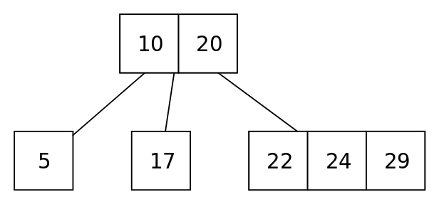

### Table of Contents

1. [Introduction](#introduction)

2. [Tree Structure](#tree-structure)

3. [Constructor](#constructor)

4. [Insert](#insert)

5. [Recursive Insert](#recursive-insert)

6. [Traversal](#traversal)

7. [Find](#find)

8. [Max](#max)

9. [Min](#min)

10. [Delete](#delete)

11. [Destructor](#destructor)

12. [Running time analysis](#running-time-analysis)

13. [Trees as arrays](#trees-as-arrays)

14. [Conclusion](#conclusion)
### Introduction

In this post I'll talk about a type of tree data structure called 2-3-4 tree (234Ts). This post is related to my [binary search trees](/binary-search-trees) post where we discussed the unbalanced BST. 2-3-4 Trees are an improvement on the BSTs in the sense that 234Ts will guarantee $O(Log(N))$ search times by balancing the tree while deleting and inserting.

The 2-3-4 in 2-3-4 tree refers to the possible links to other nodes for non-leaf nodes. For internal nodes, a node with:
- 1 data item ALWAYS has 2 children
- 2 data items ALWAYS has 3 children
- 3 data items ALWAYS has 4 children. 

This means that an internal node will always have one more child than the number of items. This is by design. A leaf node, however, won't have any children and may contain up to 3 data items. 

### Tree Structure

The example below shows 2 nodes at the first level, 10 and 20. Values less than 10 would be in the left child of 10. Values between 10 and 20 would be in the right child of 10. Values greater than 20 would be in the right child of 20. Due to this, data items in the node are stored in ascending order. Left child of 20 could point to the same sub-tree as right child of 10:

