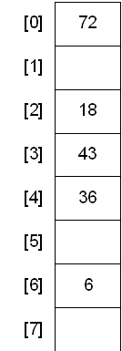

### Table of Contents

1. [Introduction](#introduction)

2. [Structure](#structure)

3. [Collisions](#collisions)

    * [Separate Chaining](#separate-chaining)
    
    * [Linear Probing](#linear-probing)

4. [Delete](#delete)

5. [Code](#code)

6. [STL Hash Table](#stl-hash-table)

    * [Unordered Map](#unordered-map)
    
    * [Unordered Set](#unordered-set)

6. [Overview](#overview)
    * [Unordered Set](#stl-unordered-set)
    * [Unordered Map](#stl-unordered-map)
    * [Multi-Map](#stl-multi-map)

7. Problems
    * [Palindromic Permutations](#palindromic-permutations)
    * [Anonymous Letter](#anonymous-letter)
    * [Nearest Repeated Entries](#find-nearest-repeated-entries)
    * [Smallest Subarray Covering All Values](#smallest-subarray-covering-all-values)
    
5. [Conclusion](#conclusion)


### Introduction


In this post I'll talk about hash tables. Each data structure we've seen has offered some pros and cons and depending on your use case, you'd weigh those pros and cons and choose the relevant data structure. Similarly, hash tables have their pros and cons that make them suitable for certain scenarios and disadvantageous for others. Let's have a look at the properties of a hash table.

Hash tables offer very fast insertion and deletion. No matter how many items there are$^*$, hash tables offer $O(1)$ insert, search and deletion. That sounds too good to be true! It is because in some cases this might not hold. However hash tables do offer faster lookup, insert and delete than tree data structures. 

On the other hand, hash tables are built on top of arrays and as we know, expanding the capacity of an array is expensive once it has been initialized. Additionally, hash tables are not ideal when you need to access/visit items in an order.

In short, if you have a fairly good idea of how many elements you're going to be adding to your table in advance and do not need to access items in a particular order (for example smallest to largest), then hash tables are the way to go!

### Structure

The example below shows a sample hash table. Notice how it looks very much like an array. That's because it is an array. We leverage array's $O(1)$ access time to make hash tables' fast access, delete and inserts. 



How do we determine which value goes in which cell? To do so, we use something called a "hash function". A hash function has one job:


**- Take in an input** 

**- Do some calculation**
  
**- Return a value (which is the outcome of the calculation in step 2)**

Usually, the calculation is to perform a modulo operation of the input with the size of the array. So, for example, if our input is 36 and array size is 8, then 

36 % 8 = 4

Meaning that 36, should be placed in our array at index 4. Do so for each input and you've populated your hash table:


 [Image Credit](https://cse.iitkgp.ac.in/~wbcm/wbcm/assignment/public/cs290032015s/asgn12/common/)


### Collisions

$^*$ Herein lies the catch with hash tables: if you have another value, say 20, and you pass it to your hash function, the hash function again returns the value 4 and you go to place 20 at index 4, you'll find that there already exists a value at that index. This is called a **collision**. Collisions are bound to happen when you're using a hash table. It is a good idea to have a set **load factor**: A value that determines when the hash table capacity needs to be increased. For example, if there are 1000 slots in the table and 750 are filled, you may want to double the size. In this case, load factor = 750/1000 = 0.75. In addition to doubling the size of your table, you can also use various techniques to address collisions:

#### Separate Chaining 

Using this technique, whenever you get a collision, you create a linked list and keep appending to that list for each collision. Ofcourse, if a horrible hash function is used, you degenerate the $O(1)$ time to $O(N)$ where all entries end up at the same array index.

 [Image Credit for Separate Chaining](https://en.wikipedia.org/wiki/Hash_table#Separate_chaining)

#### Linear Probing

Using this technique, whenever a collision is encountered, we move on to the next open space in the array and place the item there. To find the next open space, we proceed linearly. For example, if a new entry needs to go to index 4 and it is occupied, we look at index 5, then index 6 and so on, until we find an empty slot. 

### Delete

Deleting from a hash table is simple if there were no collisions present. You can simply delete the entry from the hash table. However, if you're using some collision strategy such as separate chaining, you'd have to perform additional steps after each delete. For example, you'd have to move the first item from the list into the array so that the search function wouldn't falsely return that no value exists at that index. 


### Code

Let's have a look at a sample HashTable in C++. Example below uses separate chaining.

```cpp{numberLines: true}
template <typename T>
class HashTable{
private:
    class Node{
    public:
        Node* next;
        T item;
    };
    int size;
    Node* root;
    vector<Node*> table;
    int HashFunction(T item);
    
public:
    HashTable();
    void Insert(T item);
    void PrintTable();
};

template <typename T>
HashTable<T>::HashTable(){
    //Initializing our table with 10 null items
    for (int i = 0; i < 10; i++){
        table.push_back(nullptr);
    }
    size = int(table.size());
}

template <typename T>
void HashTable<T>::Insert(T item){
    //Getting position
    int position = HashFunction(item);
    //Creating a temp node
    Node* temp = new Node;
    temp->item = item;
    temp->next = nullptr;
    //Checking if collision
    if (table[position] == nullptr){
        //No collision, just add item
        table[position] = temp;
    } else {
        //Collision..
        Node* curr = table[position];
        //Use separate chaining and append
        //to end
        while (curr->next != nullptr){
            curr = curr->next;
        }
        curr->next = temp;
    }
}

template <typename T>
int HashTable<T>::HashFunction(T item){
    //Simple modulus hash function
    return (item % size);
}

template <typename T>
void HashTable<T>::PrintTable(){
    //Printing table for sanity check
    for (int i = 0; i < size; i++){
        if (table[i] != nullptr){
            Node* curr = table[i];
            cout << i << " --> ";
            while (curr != nullptr){
                cout << curr->data << " ";
                curr = curr->next;
            }
            cout << endl;
        } else {
            cout << i << " --> " << "nullptr" << endl;
        }
    }
}
```

### STL Hash Table

The C++ STL has two associative containers that use a hash table behind the scenes:

#### Unordered Map

- `unordered_map` is an associative container that contains key value pairs with unique keys. Since a hashtable is used to implement it, search, delete and insert are done in $O(1)$ time. Just like the properties of hash tables mentioned above, there is no particular order to the elements stored in an `unordered_map`. Each key is stored in a bucket based on the hashed value determined by the hash function.

- Collisions are not handled by `unordered_map`: if there are 2 equivalent keys, the new key will overwrite the old key.

- Just like other containers, you'd have to define an iterator to search using the `find()` function.

- You can find more about unordered_map here: [https://en.cppreference.com/w/cpp/container/unordered_map]

```cpp{numberLines: true}
#include <iostream>
#include <unordered_map>
#include <string>
#include <stdio.h>

int main(int argc, const char * argv[]) {
    unordered_map<string, string> months;
    //Adding elements to our map
    months["1"] = "January";
    months["2"] = "February";
    months["3"] = "March";
    months["4"] = "April";
    months["5"] = "May";
    //Looking to see if an element is in
    //the map:
    while (true){
        cout << "Enter string you're looking for or press q to quit: " << endl;
        string input;
        cin >> input;
        if (input == "q"){
            break;
        }
        //Initializing an iterator
        unordered_map<string, string>::iterator itr = months.find(input);
        //If itr is not at end of unordered_map
        if (itr != months.end()){
            //Means item found: print it
            cout << "Found: " << itr->first << " --> " << itr->second << endl;
        } else {
            cout << input << " key not found." << endl;
        }
    }
    //Iterating over all elements in the hash table.
    for (auto &m : months){
        cout <<"Month number " <<m.first << " is " << m.second << endl;
    }
    
    return 0;
}
```

#### Unordered Set

- `unordered_map` is an associative container that contains unique objects of type key. Since a hashtable is used to implement it, search, delete and insert are done in $O(1)$ time. Just like the properties of hash tables mentioned above, there is no particular order to the elements stored in an `unordered_set`. Each key is stored in a bucket based on the hashed value determined by the hash function.

- Collisions are not handled by `unordered_set` either

- To insert elements, you'd use the `insert()` function

- Just like other containers, you'd have to define an iterator to search using the `find()` function.

- You can find more about unordered_set here: [https://en.cppreference.com/w/cpp/container/unordered_set]

```cpp{numberLines}
unordered_set<string> names;
names.insert("James");
names.insert("Bond");

auto itr = names.find("James");
if (itr != names.end()){
    cout << "Found it! " << *itr << endl; // Prints James
}
```

### Overview

Before we begin, let's review hash tables:
- Have the best insert, delete and lookup performance if hash function is implemented correctly.
- Consider using a precomputed lookup table (hash table) for mappings (character to value, character to character etc) instead of using multiple if-else statements
- Consider using multi-map when you need multiple values for a single key or a bidirectional map
- C++ STL has `unordered_set` and `unordered_map` that make use of hash tables. The difference is `unordered_set` stores keys only while `map` can store key value pairs. Both have the property that they do not allow for duplicate keys. 

### STL Unordered set
To use the unordered set, you'd include this header: 
```cpp 
#include <unordered_set>
```

Then declare an unordered set and  insert:

```cpp
unordered_set<string> s;
s.insert("string one");
```

To check if the set contains an element:


```cpp
auto search = s.find("string one");
if (search != s.end()){
   cout << "Found item in set" << endl;
} else {
    cout << "Couldn't find item in set" << endl;
}
```

### STL Unordered Map

Defined in the 
```cpp
#include <unordered_map>
```
header, `unordered_map` uses hash table behind the scenes for $O(1)$ insert, find and delete operations. Similar to `map`, here is the syntax for insert, find and print:

```cpp
int main(){
    unordered_map<string, int> m;
    m["one"] = 1;
    m["two"] = 2;
    m["three"] = 3;
    m["four"] = 4;
    
    if (m.find("four") != m.end()){
        cout << m["four"] << endl;
    } else{
        cout << "not found" << endl;
    }
    
    for (auto i : m){
        cout <<i.first << " -> " << i.second << endl;
    }

    //to increment value at m["four"]
    m["four"]++; //now m["four"] = 5
}
```

You can also use `m.erase(itr)` to erase the entry from hash table that is being pointed to by the iterator `itr`.


### STL Multi map

Map above does not allow duplicates, it will overwrite existing values if you add a duplicate. To allow for duplicates, use multi-map. multimap doesn't allow fo subscript insertion, you'd have to use the `insert` method:
```cpp
multimap<int,int> m;
m.insert({2,3});
```

Multimap will automatically store elements in sorted order by key.


### Palindromic Permutations

**A palindrome is a string that reads the same forwards and backwards, e.g., "level", "rotator", and "foobaraboof".
  Write a program to test whether the letters forming a string can be permuted to form a palindrome. For example, "edified" can be permuted to form "deified".**
  
Ok, so this question seems similar to a string problem of checkin whether a string is a palindrome. However, the question is actually asking if the characters can be rearranged to form a plindromic string. Let's see how we can solve this:
 
Approach 1: Get every possible permutation that can be formed from the characters and check if each string is a palindrome. Horrible approach!

Approach 2: It is easy to see that a palindrome string can be:
 
 - of odd length:

```text
edified = deified
```
Here, notice that only one character is allowed to have an odd number of occurrences, `f`, and all others need to have even occurrences. 

- of even length:

```text
nerrne = renner
```

Here, notice that every character must have even number of occurrences. 

Therefore, here's how we'll check if the permutations are palindromic:
- If the string size is odd, there can be only one odd character
- If the string size is even, all characters must have even occurrences

Now, how are we going to save the character and occurrence count? We'll use a hash table that would allow us to access and modify character counts in $O(1)$ time.

code:

```cpp
bool canBePermuted(string s){
    unordered_map<char,int> ht;
    bool isPal = false;
    int size = int(s.size());
    for (int i = 0; i < s.size(); i++){
        char curr = s[i];
        if (ht.find(curr) == ht.end()){
            ht[curr] = 1;
        } else {
            ht[curr]++;
        }
    }
    auto itr = ht.begin();
    if (size % 2 == 0){
        //Even size, all occurrences need to be even
        bool allEven = true;
        while (itr != ht.end()){
            if (itr->second % 2 != 0){
                allEven = false;
                break;
            }
            ++itr;
        }
        isPal = allEven;
    } else {
        //Odd size, one is allowed to be odd
        bool oneOdd = false;
        bool allEven = true;
        while (itr != ht.end()){
            if (itr->second % 2 != 0 && !oneOdd){
                oneOdd = true;
            } else if (itr->second % 2 != 0 && oneOdd){
                oneOdd = false;
                allEven = false;
                break;
            }
            ++itr;
        }
        if (oneOdd && allEven)
            isPal = true;
        else
            isPal = false;
    }
    
    return isPal;
}
```
(Notice the solution above doesn't handle strings with spaces but is easy to modify to handle them.)

Say $N$ is the size of our input string.
Running time: $O(N)$ for us to populate our hash table. Then we iterate over the elements in hash table which at worst would be of size $N$. Therefore, our total running time is $O(N)$.

### Anonymous Letter

**Write a program which takes text for an anonymous letter and text for a magazine and determines if it is possible to write the anonymous letter using the magazine. The anonymous letter can be written using the magazine if for each character in the anonymous letter, the number of times it appears in the anonymous letter is no more than the number of times it appears in the magazine.**

It is hard not to see the best approach straight away! You need two hash tables, one for letter and one for magazine and then compare th characters. If at any point letter character count > magazine character count, return false.

```cpp

bool canCreateLetter(string letter, string magazine){
    unordered_map<char,int> l;
    unordered_map<char,int> m;
    
    for (int i = 0; i < letter.size(); i++){
        char curr = letter[i];
        if (l.find(curr) == l.end()){
            l[curr] = 1;
        } else {
            l[curr]++;
        }
    }
    
    for (int i = 0; i < magazine.size(); i++){
        char curr = magazine[i];
        if (m.find(curr) == m.end()){
            m[curr] = 1;
        } else {
            m[curr]++;
        }
    }
    bool ans = true;
    auto itr = l.begin();
    while (itr != l.end()){
        char currL = itr->first;
        auto magItr = m.find(currL);
        if (magItr == m.end()){
            ans = false;
            break;
        } else{
            if (magItr->second < itr->second){
                ans = false;
                break;
            }
        }
        ++itr;
    }
    
    return ans;
}
```

Running time: 
- $O(l)$ to create `l`'s hash table
- $O(m)$ to create `m`'s hash table
- $O(l) to iterate over l

Therefore: $O(l + m)$

Space: $O(l + m)$

We can improve the space complexity by removing the magazine hash table. We can create a letter hash table and then iterate over the magazine and for each character in magazine, we can reduce the character count in the letter hash table. If at the end of the magazine iteration, the letter hash table has size > 0, then it is not possible to create letter (since letter has characters appearing more times than in magazine). Otherwise we return true saying letter can be formed:

```cpp
bool canCreateLetterImproved(string letter, string magazine){
    unordered_map<char,int> l;
    
    for (int i = 0; i < letter.size(); i++){
        char curr = letter[i];
        if (l.find(curr) == l.end()){
            l[curr] = 1;
        } else {
            l[curr]++;
        }
    }
    for (int i = 0; i < magazine.size(); i++){
        char curr = magazine[i];
        auto itr = l.find(curr);
        if (itr != l.end() && itr->second != 0){
            //character found, reduce count
            itr->second -= 1;
            
            if (itr->second == 0)
                l.erase(itr);
        }
    }
    if (l.size() > 0){
        return false;
    }
    return true;
}
```

Running time: 
- $O(l)$ for populating letter hash table
- $O(m)$ for iterating over magazine
- Total: $O(l + m)$

Space:
- $O(l)$ for letter hash table

### Find nearest repeated entries

**Write a program which takes as input an array and finds the distance between a closest pair of entries. For example, if array is:**
```cpp
["All","work","and","no", "play","is", "a", "big", "no", "and", "no", "do", "here", "that"]
    0   1       2     3     4      5    6     7     8      9     10     11    12       13      
```

**then the second and third occurrences of "no" is the closest pair. Your program needs to return the closest distance such as 2 in the example above.**

Approach 1: Choose a word from the array and then iterate over the array to find an occurrence and keep updating the closest distance on each find. This takes $O(N)^2$ time. 

Approach 2: Maintain a variable that keeps track of minimum distance seen (initially equal to array size). Also, have a hash table that adds a word to the list if not found with a value equal to the current index of the array. Then, when the word is found again, check in hash table the last index the word was seen. Subtract the last index value and the current index and see if this answer < minimum distance variable. If so, update the minimum distance variable. If not, update the hash table with the last index for the current word and continue. You can also save the distance and the word in a struct like I've done in the solution below:

```cpp
struct wordAndDistance{
    string word;
    int distance;
};


wordAndDistance getMinDistance(vector<string> sentence){
    int size = int(sentence.size());
    int minD = size;
    unordered_map<string, int> ht;
    wordAndDistance ans = {"",-1};
    
    for (int i = 0; i < size; i++){
        auto itr = ht.find(sentence[i]);
        if (itr == ht.end()){
            //Add to ht
            ht[sentence[i]] = i;
        } else {
            int dist = itr->second;
            int diff = i - dist;
            itr->second = i;
            if (diff < minD){
                minD = diff;
                ans.word = sentence[i];
                ans.distance = minD;
            }
        }
    }
    return ans;
}
```

Running time: $O(N)$ where $N$ is the size of the vector passed.
Space: $O(M)$ where $M$ is the number of unique words in the vector

### Smallest Subarray Covering All Values

**Write a program which takes an array of strings and a set of strings, and return the indices of the starting and ending index of a shortest subarray of the given array that "covers" the set, i.e., contains all strings in the set.**

Example:

```cpp

A = {"a","b","c","g","i","d","e", "f", "a", "g","c", "i", "l", "m", "n","a","c","i", "j","k","l"};
keywords = {"a","c","i"};

Then:

Size 4                             size 3                           Size 2
___________________                _________________                ___________     
{"a","b","c","g","i","d","e", "f", "a", "g","c", "i", "l", "m", "n","a","c","i", "j","k","l"};

Smallest subarray should return indices 15 and 17
```

Assumption: keywords won't overlap and order (aci,cia,aic,cai,iac,ica) are all valid coverings 

Approach 1: Iterate over the array and find indices for each occurrence. This could get too complicated too fast!

Approach 2: Iterate over each element and check if it is one of the elements. If so, start looking for others and note the index where you've found all. Record this index. Repeat for each element in the array. Too slow with running time: $O(N^2)$.

Approach 3: 
How do we keep track of the fact that we've found an element? Populate a hash table with the keywords (deep copy) of `unordered_set` into another `unordered_set` and remove the found element from this set. If our start flag is not set, set it to true and record the index: this would be our start index. 

Keep removing elements from the hash set on each successful find. Next, check to see if after the removal this copied hash set is empty, if so, it means that we've found all elements. At this point, record the end index and determine the distance between start and end. Check if this is < the running minimum distance: if so, update the minimum distance and record the new start and end indices. 

Now you've got the smallest subarray with all the keywords seen so far. Reset the hash table by clearing it and copying over from keywords again and clear the start flag to begin search again.

Here's this approach in code:

```cpp
struct Indices{
    int start;
    int end;
};

void RemoveFromHt(unordered_set<string>& ht, string curr){
    auto itr = ht.find(curr);
    if (itr != ht.end()){
        ht.erase(itr);
    }
}

Indices getCovering(vector<string> paragraph, unordered_set<string> keywords){
    unordered_set<string> ht = keywords;
    bool startSet = false;
    int start = 0, end = 0, size = int(paragraph.size()), finalDiff = size;
    Indices ans = {-1,-1};
    
    for (int i = 0; i < size; i++){
        string curr = paragraph[i];
        cout << "Curr word: " << curr << endl;
        auto kwItr = keywords.find(curr);
        if (kwItr != keywords.end()){
            if (!startSet){
                start = i;
                startSet = true;
                cout << "   Just set start to: " << i << endl;
            }
            RemoveFromHt(ht, curr);
            
            if (ht.size() == 0){
                end = i;
                cout << "   Just set end to: " << i << endl;
                if (end - start < finalDiff){
                    ans = {start,end};
                    finalDiff = end - start;
                }
                ht.clear();
                ht = keywords;
                startSet = false;
                
                cout << "   Current range: " << ans.start << " --> " << ans.end << endl;
                cout << "   Current min: " << finalDiff << endl;
            }
        }
    }
    
    return ans;
}
```

Sample output:

```text
Curr word: a
   Just set start to: 0
Curr word: b
Curr word: c
Curr word: g
Curr word: i
   Just set end to: 4
   Current range: 0 --> 4
   Current min: 4
Curr word: d
Curr word: e
Curr word: f
Curr word: a
   Just set start to: 8
Curr word: g
Curr word: c
Curr word: i
   Just set end to: 11
   Current range: 8 --> 11
   Current min: 3
Curr word: l
Curr word: m
Curr word: n
Curr word: a
   Just set start to: 15
Curr word: c
Curr word: i
   Just set end to: 17
   Current range: 15 --> 17
   Current min: 2
Curr word: j
Curr word: k
Curr word: l
```

Time Complexity: 
- We copy over keywords to another `unordered_set`. According to specifications [here](https://en.cppreference.com/w/cpp/container/unordered_set/operator%3D) the complexity is $O(K)$ where $K$ is the number of elements in the set. 
- We then iterate over the paragraph once which takes $O(P)$ where $P$ is the length of the paragraph. 

Space Complexity:
- We use one hash table of size $O(K)$.

### Longest subarray with distinct entries

**Write a program that takes an array and returns the length of a longest subarray with the property that all its elements are distinct. For example, if the array is (f,s,f,e,t,w,e,n,w,e) then a longest subarray all of whose elements are distinct is (s,f,e,t,w).**

Approach 1: Make possible sets out of different combinations of consecutive elements in the array. Reject any set that has a duplicate. Out of the remaining, find the set that has the longest length. Too slow and complicated!

Approach 2: Start at index 0 with pointer `i` and add to hash table. Next, put pointer `j` to `i+1`. Continue incrementing `j` and on each increment add `A[j]` to hash table. If `A[j]` exists in hash table, break from the loop and check the difference between `i` and `j`. If it is > the largest distance seen so far, save values of `i` and `j` as the longest subarray. Move `i` to point to element one after the duplicate entry, delete the duplicate entry and continue. 

Example: Let's say we have this: 

```text
c   d   c   b   a   b   a   
0   1   2   3   4   5   6

It's clear that he longest subarray is from index 1 till 4. 
```

Let's see how we'll proceed:

```text
max = 0

i   j
c   d   c   b   a   b   a   
0   1   2   3   4   5   6

hash table:
c,0
d,1
```

```text
max = 0

i       j
c   d   c   b   a   b   a   
0   1   2   3   4   5   6

hash table:
c,0
d,1

Now, c is already seen so we break out and see what the difference between i and j is = 2. It is greater than max so we save indices for i and j and update max to 2. Also move i to one past the collision point, delete the duplicate and continue
```

```text
max = 2

    i               j
c   d   c   b   a   b   a   
0   1   2   3   4   5   6

hash table:
d,1
c,2
b,3
a,4

Now, b is already seen so we break out and see what the difference between i and j is = 4. It is greater than max so we save indices for i and j and update max to 4. Also move i to one past the collision point, delete the duplicate and continue
```

Here's the code for this logic:

```cpp
struct Indices{
    int start;
    int end;
};

Indices findSubarray(vector<string> A){
    int i = 0, j = 1, maxD = 0, size = int(A.size());
    unordered_map<string, int> ht;
    ht[A[i]] = i;
    Indices ans = {-1,-1};
    auto itr = ht.begin();
    for (;j < size; j++){
        while (true) {
            itr = ht.find(A[j]);
            if (itr == ht.end()){
                ht[A[j]] = j;
                j++;
            } else {
                break;
            }
        }
        
        int diff = j - i;
        if (diff > maxD){
            ans.start = i;
            ans.end = j - 1;
            maxD = diff;
        }
        
        i = itr->second + 1;
        ht.erase(itr);
    }
    
    return ans;
}
```

Running time: $O(N)$ where $N$ is the size of the array passed in
Space: $O(N)$ where L size of the array

### Conclusion

- Sometimes it is easy to see that two hash tables can work but try and reduce space complexity by using only one as show in the [anonymous letter](/hash-tables#anonymous-letter) problem. This not only reduces running time (extra time required to populate the second hash table) but also obviously reduces the space required by not creating a second hash table.