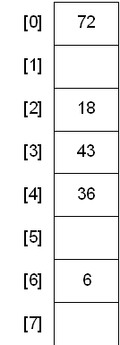
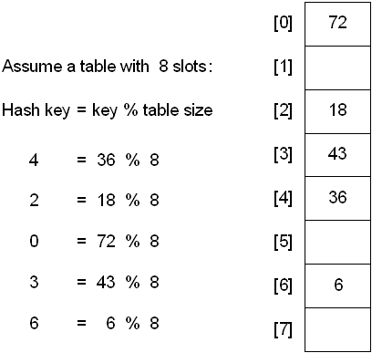

### Table of Contents

1. [Introduction](#introduction)

2. [Structure](#structure)

3. [Collisions](#collisions)

    * [Separate Chaining](#separate-chaining)
    
    * [Linear Probing](#linear-probing)

4. [Delete](#delete)

5. [Code](#code)

5. [Conclusion](#conclusion)
### Introduction

In this post I'll talk about a type data structure called hash table. Each data structure we've seen has offered some pros and cons and depending on your use case, you'd weigh those pros and cons and choose the relevant data structure. Similarly, hash tables have their pros and cons that make them suitable for certain scenarios and disadvantageous for others. Let's have a look at the properties of a hash table.

Hash tables offer very fast insertion and deletion. No matter how many items there are$^*$, hash tables offer $O(1)$ insert, search and deletion. That sounds too good to be true! It is because in some cases this might not hold however hash tables do offer faster lookup, insert and delete than tree data structures. 

On the other hand, hash tables are built on top of arrays and as we know, expanding the capacity of an array is expensive once it has been initialized. Additionally, hash tables are not ideal when you need to access/visit items in an order.

In short, if you have a fairly good idea of how many elements you're going to be adding to your table in advance and do not need to access items in a particular order (for example smallest to largest), then hash tables are the way to go!

### Structure

The example below shows a sample hash table. Notice how it looks very much like an array. That's because it is an array. We leverage array's $O(1)$ access time to make hash tables' fast access, delete and inserts. 



How do we determine which value goes in which cell? To do so, we use something called a "hash function". A hash function has one job:


**- Take in an input** 

**- Do some calculation**
  
**- Return a value (which is the outcome of the calculation in step 2)**

Usually, the calculation is to perform a modulo operation of the input with the size of the array. So, for example, if our input is 36 and array size is 8, then 

36 % 8 = 4

Meaning that 36, should be placed in our array at index 4. Do so for each input and you've populated your hash table:


 [Image Credit](https://cse.iitkgp.ac.in/~wbcm/wbcm/assignment/public/cs290032015s/asgn12/common/)


### Collisions

$^*$ Herein lies the catch with hash tables: if you have another value, say 20, and you pass it to your hash function. The hash function again returns the value 4 and you go to place 20 at index 4, you'll find that there already exists a value at that index. This is called a **collision**. Collisions are bound to happen when you're using a hash table. It is a good idea to have a set **load factor**: A value that determines when the hash table capacity needs to be increased. For example, if there are 1000 slots in the table and 750 are filled, you may want to double the size. In this case, load factor = 750/1000 = 0.75. In addition to doubling the size of your table, you can also use various techniques to address collisions:

#### Separate Chaining 

Using this technique, whenever you get a collision, you create a linked list and keep appending to that list for each collision. Ofcourse, if a horrible hash function is used, you degenerate the $O(1)$ time to $O(N)$ where all entries end up at the same array index.

 [Image Credit for Separate Chaining](https://en.wikipedia.org/wiki/Hash_table#Separate_chaining)

#### Linear Probing

Using this technique, whenever a collision is encountered, we move on to the next open space in the array and place the item there. To find the next open space, we proceed linearly. For example, if a new entry needs to go to index 4 and it is occupied, we look at index 5, then index 6 and so on, until we find an empty slot. 

### Delete

Deleting from a hash table is simple if there were no collisions present. You can simply delete the entry from the hash table. However, if you're using some collision strategy such as separate chaining, you'd have to perform additional steps after each delete. For example, you'd have to move the first item from the list into the array so that the search function wouldn't falsely return that no value exists at that index. 


### Code

Let's have a look at a sample HashTable in C++. Example below uses separate chaining.

```cpp{numberLines: true}
template <typename T>
class HashTable{
private:
    class Node{
    public:
        Node* next;
        T item;
    };
    int size;
    Node* root;
    vector<Node*> table;
    int HashFunction(T item);
    
public:
    HashTable();
    void Insert(T item);
    void PrintTable();
};

template <typename T>
HashTable<T>::HashTable(){
    //Initializing our table with 10 null items
    for (int i = 0; i < 10; i++){
        table.push_back(nullptr);
    }
    size = int(table.size());
}

template <typename T>
void HashTable<T>::Insert(T item){
    //Getting position
    int position = HashFunction(item);
    //Creating a temp node
    Node* temp = new Node;
    temp->item = item;
    temp->next = nullptr;
    //Checking if collision
    if (table[position] == nullptr){
        //No collision, just add item
        table[position] = temp;
    } else {
        //Collision..
        Node* curr = table[position];
        //Use separate chaining and append
        //to end
        while (curr->next != nullptr){
            curr = curr->next;
        }
        curr->next = temp;
    }
}

template <typename T>
int HashTable<T>::HashFunction(T item){
    //Simple modulus hash function
    return (item % size);
}

template <typename T>
void HashTable<T>::PrintTable(){
    //Printing table for sanity check
    for (int i = 0; i < size; i++){
        if (table[i] != nullptr){
            Node* curr = table[i];
            cout << i << " --> ";
            while (curr != nullptr){
                cout << curr->data << " ";
                curr = curr->next;
            }
            cout << endl;
        } else {
            cout << i << " --> " << "nullptr" << endl;
        }
    }
}
```

### Conclusion

Hash tables are an efficient data structure if you quickly want to store and retrieve items. However, there is some work that needs to be done on the developer's part to make sure that the function places values evenly across all available slots.


