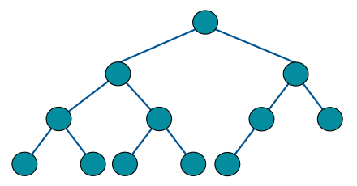
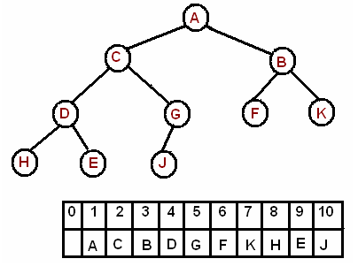

### Table of Contents

1. [Introduction](#introduction)

2. [Structure](#structure)

3. [Heaps as Arrays](#heaps-as-arrays)

    * [Insertion](#insertion)
    
    * [Deletion](#deletion)

4. [Analysis](#analysis)

5. [Max heap and min heap](#max-heap-and-min-heap)

6. [Create heap from existing containers](#how-to-initialize-a-heap-from-an-existing-vector)

7. [Sample heap sort](#sample-heap-sort)
### Introduction

In this post I'll talk about a data structure called heap. A heap can be thought of as an unordered binary tree where the parent is larger (max-heap) or smaller (min heap) than its children. In a heap, the largest (if max-heap) or smallest (if min-heap) element is always at the root (hence the name heap).

### Structure

There are a few properties that must hold for a heap:

- Each node satisfies the heap condition: the parent must be larger (max-heap) or smaller (min-heap) than its children
- It is a complete binary tree: meaning each level is completely filled except for the last level where new nodes are added left to right:

 [Image Credit - Complete Binary Tree](https://www.wikiwand.com/en/Binary_tree)

- The height of the tree would always be $O(logN)$ where $N$ is the number of nodes
- A heap can be implemented using an array or a [tree](/binary-search-trees) data structure.

Based on the structure described above, it is easy to see that a heap should be used when the goal is to consistently remove the largest or the smallest value from a set of values.

### Heaps As Arrays

Since our heap is a complete binary tree, if we implement it as an array, we'd realize that there are no "holes" in this array. Holes would arise when there are null nodes in the middle of our tree (which would not happen for heaps). Let's have a look at what our array would look like for a specific tree:


 [Image Credit - Tree As Array](https://www.cs.cmu.edu/~adamchik/15-121/lectures/Binary%20Heaps/heaps.html)

We ignore the first index of the array for the purposes of convenience. If you populate the array, starting at index 1, in breadth first fashion, you'd get the array as shown above for the tree. You can generalize the following relationships between the `index` of the element and its left child, right child and parent: 

- `leftChildIndex = index * 2`
- `rightChildIndex = (index * 2)  + 1`
- `parentIndex = index/2` 

If you want, you can start your array at index 0, in which the case the formulae to determine the left child, right child and parent would be:

- `leftChildIndex = (index * 2) + 1`
- `rightChildIndex = (index * 2)  + 2`
- `parentIndex = ((index - 1)/2)` 

I'll be using an array starting at index 0 since it feels more natural!

#### Insertion

This section assumes a max heap (parent is > children)

To insert an item in our binary heap, we need to keep a few things in mind:

- We need to make sure our insertion won't break the heap property of the tree
- We want these inserts to be fast (priority queue inserts take approx $O(N)$ time)

The best possible way to insert an item into an array would be to add it to the next available slot. This means, we can add a new item at the end of the array. Let's say we have this array:
```
 35  30  25  20
```

The corresponding tree would be:

```
    35
   /  \
  30  25
 /
20
```

Notice that the heap is a max heap since each parent is greater than its children (and its grand-children by extension).

Let's say we need to add a new value, 40, that goes all the way to the end of the array:

```
 35  30  25  20  40
```

Now, this breaks the heap property. We need to "heapify" the array, ie: make sure that the parent node is ALWAYS larger than its children. To do so we need to find the correct spot for 40. We need to do so because this is what our tree looks like right now:


```
    35
   /  \
  30  25
 / \
20 40
```
which is clearly incorrect since if we are asked to return the max from this tree in $O(1)$ time, we won't be able to do that since our max is all the way down in the leaf position. To achieve the $O(1)$ time, we want to keep the max (or min) at the root. 

Ok, so let's find the correct position for 40:

- Check: is 40 > its parent?

40 is at index 4, so parent must be at index:

$$$
(4 - 1)/2 = 1
$$$
$$$
array[2] = 30
$$$

Yes, 40 > its parent, swap 40 with its parent. Our new array would look like this:

```
 35  40  25  20  30
     ---         ---
```

Next, check again to see if 40 > than its parent. Now, 40's index is 1:


$$$
(1 - 1)/2 = 0
$$$
$$$
array[0] = 35
$$$

Yes, 40 > its parent, swap 40 with its parent. Our new array would look like this:

```
 40  35  25  20  30
---  ---         
```

We're done since 40's index is 0 and there are no more parents to check against. We also could've stopped when the check, 40 > parent returned false. We need to perform this swap and check for each insert. After all the swaps, our tree looks like this:

```
    40
   /  \
  35  25
 / \
20 30
```

We've restored our heap property. Now, our get max would return the max element in $O(1)$ time.

Here is the function `insert(T item)` for our heap:

```cpp
template <typename T>
void Heap<T>::Insert(T item){
    if (int(heapArr.size()) == 0){
        //Empty array, just push
        //new item
        heapArr.push_back(item);
    } else{
        //Array not empty, push to end
        //and call helper function
        heapArr.push_back(item);
        trickleUp(item);
    }
}

template <typename T>
void Heap<T>::trickleUp(T item){
    //Trickle up will always start at
    //the last index and will work its
    //way up the array
    int curr = int(heapArr.size() - 1);
    while (curr != 0){
        //Get parent index
        int parent = ((curr - 1) / 2);
        if (heapArr[parent] < heapArr[curr]){
            //Parent was less than newly added node
            //Move up the newly added node and re-check
            T temp = heapArr[parent];
            heapArr[parent] = heapArr[curr];
            heapArr[curr] = temp;
            curr = parent;
        } else {
            //Parent was not > child,
            //we're done
            break;
        }
    }
    
    cout << "Heap after inserting " << item << endl;
    
    for (auto item : heapArr){
        cout << item << " ";
    }
    
    cout << endl;
    
}
```
 `Insert()` implements the logic we discussed earlier. If the array is empty, it simply adds the new item to the vector. If array is not empty, it inserts the new item to the end of the vector and calls the `trickleUp()` helper function that, as the name suggests, pushes up the newly added entry until its correct position is found.
 
 #### Deletion 
 Let's say our array and the corresponding tree looks like so:
 
 ```
  40  35  25  20  30
 ```
 
 ```
     40
    /  \
   35  25
  / \
 20 30
 ```

and we call the `getMax()` function that deletes the root, 40, and returns it. Once that delete takes place, our array would look like this:

 ```
  __  35  25  20  30
 ```

and the heap property would be broken since there is a hole in the array. To fill that hole, we can move the last element to this newly vacated spot:

 ```
  30  35  25  20 
 ```

The heap property still doesn't hold since the tree looks like this:

 ```
     30
    /  \
   35  25
  / 
 20 
 ```

and notice how 35 is greater than 30 and is its child. To move 30 to its new spot, we compare it to both its children and whichever child is larger, we'll swap 30 with that child. We'll keep swapping until 30 reaches a point where there are no more children to compare with OR when both its children are smaller than 30. This is called `trickleDown`. Finally, our tree would look like this:

 ```
     35
    /  \
   30  25
  / 
 20 
 ```

Heap property has been restored and we're good!

Here is the code for `GetMax()` function that calls a helper `trickleDown()` function:

```cpp{numberLines: true}
template <typename T>
void Heap<T>::trickleDown(T item){
    //Trickle down will always begin from root,
    //so we'll always assume that the index is 0
    //for the item to be trickled down.
    int currIndex = 0;
    int arraySize = int(heapArr.size()) - 1;
    while (true){
        T leftChildIndex = (currIndex * 2) + 1;
        T rightChildIndex = (currIndex * 2) + 2;
        if (leftChildIndex <= arraySize && rightChildIndex <= arraySize){
            //We have both, a left and a right child
            if (heapArr[leftChildIndex] > heapArr[currIndex] && heapArr[leftChildIndex] > heapArr[rightChildIndex]){
                //Left child is greater than curr AND is also greater than right child
                //Swap curr with left child
                T temp = heapArr[leftChildIndex];
                heapArr[leftChildIndex] = heapArr[currIndex];
                heapArr[currIndex] = temp;
                currIndex = leftChildIndex;
            } else if (heapArr[rightChildIndex] > heapArr[currIndex] && heapArr[rightChildIndex] > heapArr[leftChildIndex]){
                //Right child is greater than curr AND is also greater than left child
                //Swap curr with right child
                T temp = heapArr[rightChildIndex];
                heapArr[rightChildIndex] = heapArr[currIndex];
                heapArr[currIndex] = temp;
                currIndex = rightChildIndex;
            }
        } else if (leftChildIndex <= arraySize && heapArr[leftChildIndex] > heapArr[currIndex]){
            //Only left child exists and this left child
            //is greater than the element we're swapping
            T temp = heapArr[leftChildIndex];
            heapArr[leftChildIndex] = heapArr[currIndex];
            heapArr[currIndex] = temp;
            currIndex = leftChildIndex;
        } else if (rightChildIndex <= arraySize && heapArr[rightChildIndex] > heapArr[currIndex]){
            //Only right child exists and this right child
            //is greater than the element we're swapping
            T temp = heapArr[rightChildIndex];
            heapArr[rightChildIndex] = heapArr[currIndex];
            heapArr[currIndex] = temp;
            currIndex = rightChildIndex;
        } else {
            //We've found the correct spot,
            //we can exit
            return;
        }
        
    }
    
}

template <typename T>
T Heap<T>::GetMax(){
    T max = heapArr[0];
    int replacement = int(heapArr.size() - 1);
    heapArr[0] = heapArr[replacement];
    heapArr.erase(heapArr.end() - 1);
    if (int(heapArr.size()) != 1)
        trickleDown(heapArr[0]);
    return max;
}
```

### Analysis

Let's see the running times for insertion and removal of items from a heap. 

- **Insertion**: As a recap, insertion inserts an item to the end of array and then continuously compares the item with its parent. If the parent is smaller than this newly inserted item, the item moves up the tree. Best case scenario is when the item is smaller than its parent and stays at the end of the array: $O(1)$. Worst case scenario, the item added is the largest out of all the existing items in the array and needs to be moved all the way up to the root: $O(log_2N)$.

- **Deletion**: Deletion removes the item at the root, $array[0]$, moves the item from the end of the list to this newly vacated root and checks if the children, if any, are larger than this newly added element. Worst case, the item brought in from the end of the array is smaller than all the nodes in the tree and has to be moved to the end again: $O(log_2N)$

### Problems

### Intro
Some great explanation for heaps can be found [here](https://diego.assencio.com/?index=d59df235a67e8efaec11682d86ac28e9)

C++ STL provides the heap data structure via the `queue` header in the `priority_queue` class. Common operations are `push(), top() and pop()`. `top()` and `pop()` need to be used with `.empty()` call because empty `priority_queue` will throw an exception.

`priority_queue` by default is a max_heap. You need to define a custom comparator to convert it to a min_heap. How do we go about doing that? Let's have a look.

 Since we're using priority queue to represent heaps, let's  have look at the documentation for a priority queue:
 
 ```cpp
template<
    class T,
    class Container = std::vector<T>,
    class Compare = std::less<typename Container::value_type>
> class priority_queue; 
```

### Max heap and Min Heap

Priority queue is a class template that requires 3 parameters:
- The type of class: ie the type of data we're storing: `class T`
- The type of container we're using to hold these elements: `class Container = std::vector<T>` which defaults to `vector<T>`
- Comparator to order the elements: `class Compare = std::less<typename Container::value_type>` which defaults to `less`. 

The first two parameters are easy to understand. Parameter 1 is for the type of data (int, string etc) and the second is by default is a vector which you don't need to edit. 

The third parameter can be edited to determine whether the priority queue is used as a `min_heap` or a `max_heap`. By default, the comparator results in a `max_heap` because this is what the comparator function looks like in the `less` class:

```cpp
bool operator() (const T& x, const T& y)
{
    return x < y;
}
```

You can change it to a `min_heap` by providing your own custom (or use the one provided by the STL) functor to compare for greater than:

```cpp
bool operator() (const T& x, const T& y)
{
    return x > y;
}
```

Wait, what's a `functor`? Functor is nothing but a class that can be used as a function. We said that `less<T>()` is a functor. We can use `less` like so:

```cpp
cout << less<int>()(4,5) << endl; //true
cout << less<int>()(5,4) << endl; //false
```

Notice how we're calling the `operator()` function of class `less` as a function call. Since the priority queue, by default, uses `less`, it generates a `max_heap`. To convert it to a `min_heap`, we need to change the `less` compare to `greater` compare. Let's have a look at how we can do it:

Say you create your default `max_heap` like so:

```cpp
priority_queue<int> max_heap;
```

This is the same as this declaration:

```cpp
priority_queue<int, vector<int>, less<int>> max_heap;
```
because of the default parameters we discussed earlier. 

**Now, to convert this to a min heap, we need to change the third parameter to greater like we discussed above. This can be achieved by explicitly providing the parameters to our priority_queue instance:**

```cpp
priority_queue<int, vector<int>, greater<int>> min_heap;
```

And now you've got the min heap and understand why it works!


### How to initialize a heap from an existing vector

Say you've already got a vector of elements and need to construct a heap out of it. If you pick an element one at a time and insert it in a new heap, it'll take $O(NlogN)$. `priority_queue` already has a constructor that takes $O(N)$ time for creating a heap from an existing container. You can do it like so:

```cpp
vector<int> arr = {6,9,8,7,4,3,5,1,2};
priority_queue<int> max_heap(arr.begin(), arr.end());
```

1. Problems
    * [Store elements in a max and a min heap](#store-elements-in-a-max-heap-and-a-min-heap)
    * [Merge sorted files](#merge-sorted-files)
    

### Store elements in a max heap and a min heap

**Given a collection of numbers, store them in a max heap and then print the elements in the heap.**

```cpp
int main(int argc, const char * argv[]) {
    vector<int> arr = {10,50,40,30,20};
    priority_queue<int> max_heap(arr.begin(), arr.end());
    
    priority_queue<int, vector<int>, greater<int>> min_heap;
    min_heap.push(50);
    min_heap.push(40);
    min_heap.push(30);
    min_heap.push(20);
    min_heap.push(10);
    
    while (!min_heap.empty()){
        cout << min_heap.top() << " ";
        min_heap.pop();
    }
    
    cout << endl;
    
    while (!max_heap.empty()){
        cout << max_heap.top() << " ";
        max_heap.pop();
    }
    cout << endl;
    return 0;
}
//OUTPUT:
10 20 30 40 50 
50 40 30 20 10 
``` 

### Merge sorted files

**Write a program that takes as input a set of sorted sequences and computes the union of these sequences as a sorted sequence. For example, if the input is (3, 5, 7), (0, 6), and (0, 6, 28), then the output is (0, 0, 3, 5, 6, 6, 7, 28).**

Naive approach: you could merge all lists and then sort them. That would be $O(N logN)$ using fastest sorting algorithms. However, the elements are already sorted in their respective lists. We can make use of that.

Better approach is to have 3 readers for each list and add each element to a min-heap. Min-heap because we're sorting in ascending order (smallest to largest). Then, perform a `top()` and a `pop()` operation to get the smallest of these elements. Add this returned smallest element to the output list. Continue until min-heap is empty.

```cpp
vector<int> mergeSorted(vector<int> a, vector<int> b, vector<int> c){
    priority_queue<int, vector<int>, greater<int>> min;
    vector<int> ans;
    min.push(a[0]);
    min.push(b[0]);
    min.push(c[0]);
    
    vector<int>::iterator itra = a.begin() + 1;
    vector<int>::iterator itrb = b.begin() + 1;
    vector<int>::iterator itrc = c.begin() + 1;
    
    while (!min.empty()){
        cout << "Pushing to ans: " << min.top() << endl;
        ans.push_back(min.top());
        min.pop();
        
        if (itra != a.end()){
            min.push(*itra);
            ++itra;
        }
        
        if (itrb != b.end()){
            min.push(*itrb);
            ++itrb;
        }
        
        if (itrc != c.end()){
            min.push(*itrc);
            ++itrc;
        }
    }
    
    return ans;
}
```

### Sample heap sort

Using the information discussed above, let's see a simple heap-sort implementation:

```cpp
void HeapSort(vector<int>& A){
    priority_queue<int, vector<int>, greater<int>> min_heap(A.begin(),A.end());
    while (!min_heap.empty()){
        cout << min_heap.top() << " ";
        min_heap.pop();
    }
    
    cout << endl;
}

int main(int argc, const char * argv[]) {
    // insert code here...
    vector<int> arr = {6,9,8,7,4,3,5,1,2};
    HeapSort(arr);
    return 0;
}
/*output
1 2 3 4 5 6 7 8 9 
*/
```