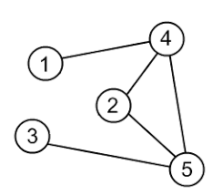

### Table of Contents

1. [Introduction](#introduction)

2. [Definitions](#definitions)

3. [Adjacency Matrix](#adjacency-matrix)]

4. [Adjacency List](#adjacency-list)

3. [Heaps as Arrays](#heaps-as-arrays)

    * [Insertion](#insertion)
    
    * [Deletion](#deletion)

4. [Analysis](#analysis)
### Introduction

In this post I'll talk about a type data structure called graph. We've already seen a type of a graph: binary search tree. Graphs can be used to model your data depending on the type of problem you have. Graphs do not have a rigid, well defined shape (unlike trees) and can be created to solve the problem at hand.

### Definitions

- **Vertices**: Similar to nodes in a tree, a vertex could represent a city in our graph.
- **Edges**: Edges connect 2 vertices together. An edge could represent a highway connecting cities.
- **Directed**: A directed graph is one that is represented by arrow heads showing the allowed direction that can be travelled.
- **Undirected**: Undirected graph allows you to travel in any direction (A to B or B to A) as long as the two vertices are connected.
- **Adjacent**: Two vertices are said to be adjacent if they're connected (ie one edge away from one another)

Here is what a sample, undirected graph looks like:

 [Image Credit - Undirected Graph](http://www.algolist.net/Data_structures/Graph/Internal_representation)

How would we go about representing a graph in our code? As you can notice, there is no defined structure. It is hard to determine what or left and right child is going to be for each node. To represent a graph in memory, we've got 2 methods:

### Adjacency Matrix

A matrix is nothing but a 2D array where the size of each array is equal to the number of vertices in our graph. A value of 1 at a particular index would mean that the vertex is connected to another vertex. A value of 0 would signify that no connection is present. Let's create an adjacency matrix for the image above:


|  | 1 | 2 | 3 | 4 | 5 |
| -- | -- | -- | -- | -- | -- |
| **1** | 0 | 0 | 0 | 0 | 0 | 0 | 
| **2** | 0 | 0 | 0 | 0 | 0 | 0 |
| **3** | 0 | 0 | 0 | 0 | 0 | 0 |
| **4** | 0 | 0 | 0 | 0 | 0 | 0 |
| **5** | 0 | 0 | 0 | 0 | 0 | 0 |

The matrix has a 2D array where each array is of size 5 (5 because our number of vertices are 5). Next, we see that 1 is connected to 4. Since this is an undirected graph, it also means that 4 is connected to 1. So, at indices $(1,4)$ and $(4,1)$ we can put a value of 1:


|  | 1 | 2 | 3 | 4 | 5 |
| -- | -- | -- | -- | -- | -- |
| **1** | 0 | 0 | 0 | 1 | 0 | 0 | 
| **2** | 0 | 0 | 0 | 0 | 0 | 0 |
| **3** | 0 | 0 | 0 | 0 | 0 | 0 |
| **4** | 1 | 0 | 0 | 0 | 0 | 0 |
| **5** | 0 | 0 | 0 | 0 | 0 | 0 |

4 is connected to 1,2 and 5. So we need to add 1s to the following positions:

$$$
(1,4) and (4,1) 
$$$

$$$
(2,4) and (4,2) 
$$$

$$$
(5,4) and (4,5) 
$$$

|  | 1 | 2 | 3 | 4 | 5 |
| -- | -- | -- | -- | -- | -- |
| **1** | 0 | 0 | 0 | 1 | 0 | 
| **2** | 0 | 0 | 0 | 1 | 0 | 
| **3** | 0 | 0 | 0 | 0 | 0 | 
| **4** | 1 | 1 | 0 | 0 | 1 | 
| **5** | 0 | 0 | 0 | 1 | 0 | 

3 and 5 are connected:

|  | 1 | 2 | 3 | 4 | 5 |
| -- | -- | -- | -- | -- | -- |
| **1** | 0 | 0 | 0 | 1 | 0 | 
| **2** | 0 | 0 | 0 | 1 | 0 | 
| **3** | 0 | 0 | 0 | 0 | 1 | 
| **4** | 1 | 1 | 0 | 0 | 1 | 
| **5** | 0 | 0 | 1 | 1 | 0 | 

Finally, 2 is connected to 4 and 5:

|  | 1 | 2 | 3 | 4 | 5 |
| -- | -- | -- | -- | -- | -- |
| **1** | 0 | 0 | 0 | 1 | 0 | 
| **2** | 0 | 0 | 0 | 1 | 1 | 
| **3** | 0 | 0 | 0 | 0 | 1 | 
| **4** | 1 | 1 | 0 | 0 | 1 | 
| **5** | 0 | 1 | 1 | 1 | 0 | 


### Adjacency List

An adjacency list also tells us what vertices are connected. As the name suggests, it is a linked list of connected items. For our image above, this is what the adjacency list would look like:

```
1 -> 4
2 -> 4 -> 5
3 -> 5
4 -> 1 -> 2 -> 5
5 -> 2 -> 3 -> 4

```