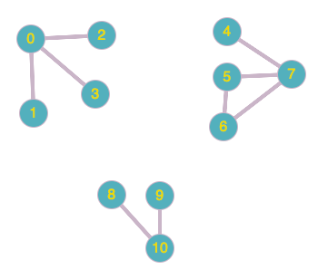

### Table of Contents

1. [Introduction](#introduction)

2. [Depth First Search](#depth-first-search)

3. [Finding Paths Using DFS](#finding-paths-using-dfs)

4. [Connected Components](#connected-components)

5. [Conclusion](#conclusion)

### Introduction

One of the questions most frequently asked about graphs is some variant of the following:
- Is there a path from A to B?
- What is the shortest path from A to B? (Either in terms of number of hops, or distances or costs which may be stored on edges.)
- What is the distance from A to every other node in the graph (or every node that can be reached from A)?

All of these problems fall under the broad area of graph search or computation of shortest paths (or just paths). Let's start with an algorithm that'll help us answer the question **whether a path exists from A to B**:

### Depth First Search

The idea behind **depth first search** is to go as deep down a path as possible until you hit a dead-end and then backtrack your way to the next available path that can be taken:

```cpp{numberLines:true}

void AdjList::RecursiveDFS(){
    for (int i = 0; i < visited.size(); i++){
        if (!visited[i]){
            RecursiveDFS(i);
        }
    }
}

void AdjList::RecursiveDFS(int v){
    visited[v] = true;
    cout << v << " ";
    for (int i = 0; i < adjList[v].size(); i++){
        int curr = adjList[v][i];
        if (!visited[curr]){
            RecursiveDFS(curr);
        }
    }
}
```

The first function iterates over the `visited` array to make sure we've visited all the vertices (this `visited` array will come in handy in later posts as well). For each unvisited vertex, it calls the second `RecursiveDFS(int v)` function that then visits that vertex's unvisited neighbors.

This function allows us to pass in any vertex you want and it'll print out all the vertices that can be reached from the passed vertex. The logic behind this function is this:

- Take in the passed vertex and mark the vertex in array, `visited` to true. This array is an [instance variable (bound to the instance of the class)](https://en.wikipedia.org/wiki/Instance_variable) for the class. 
- Once the vertex is marked, print the vertex and iterate through the current vertex's adjacency list.
- In this list, if the `curr` vertex is not visited, call the function again with this new, un-visited vertex.

Let's step through this logic using this graph as an example:

 [Image Credit - Undirected Graph 1](https://graphonline.ru/en/)

Here's the adjacency list for this graph

```css
0 -> 1 -> 2 -> 5
1 -> 0 -> 2
2 -> 0 -> 1 -> 3 -> 4
3 -> 2 -> 4 -> 5
4 -> 2 -> 3
5 -> 0 -> 3
```

Client calls our `RecursiveDFS()` function on line 1 that starts with looping through the `visited` array which initially looks like so:

```css
visited[0] = F
visited[1] = F 
visited[2] = F
visited[3] = F
visited[4] = F
visited[5] = F
```

we then jump to line 10 and mark `visited[v]` (v = i = 0) to true and print `v`

```css
printed: 0
visited[0] = T
visited[1] = F 
visited[2] = F
visited[3] = F
visited[4] = F
visited[5] = F
```

Next, we iterate over the adjacency list of 0 and assign the first unvisited neighbor to curr:
```css
printed: 0
visited[0] = T
visited[1] = F 
visited[2] = F
visited[3] = F
visited[4] = F
visited[5] = F

     |
0 -> 1 -> 2 -> 5

```

1 is unvisited, so we halt the `RecursiveDFS(0)` call and initiate another call to `RecursiveDFS` but this time with the value of `v` as 1. We then mark 1 as visited, print it out and iterate over its neighbors: 

```css
printed: 0 1
visited[0] = T
visited[1] = T 
visited[2] = F
visited[3] = F
visited[4] = F
visited[5] = F

     |
1 -> 0 -> 2

```

We find that 0 is already visited so move to 2. We find 2 is unvisited so we halt the `RecursiveDFS(1)` call and call `RecursiveDFS(2)`. We continue this process until all vertices are visited.

### Finding Paths Using DFS

DFS can be modified slightly to answer this question: **is there a path from A to B and if so what is it?**. This is called a single source path where we can determine whether a **single** vertex has a path to another given vertex. There is a surprisingly simple way to answer that question using DFS:

```cpp{numberLines: true}
void AdjList::RecursiveDFS(int v){
    visited[v] = true;
    cout << v << " ";
    for (int i = 0; i < adjList[v].size(); i++){
        int curr = adjList[v][i];
        if (!visited[curr]){
            edgeTo[curr] = v;
            RecursiveDFS(curr);
        }
    }
}
```
Only addition we've made to DFS from earlier is that now, we've got a new array called `edgeTo` which is equal to the size of the vertices in our graph (we initialized it in the constructor). Next, whenever we find an unvisited edge in a vertex's adjacency list, we're going to add that index to our `edgeTo` array and populate it with the value `v`. This helps us keep track of what vertex we used to get to the current vertex. Let's walk through an example:

Initially our `edgeTo` list is empty. Assume we've got 6 vertices labelled 0-5 in our graph:

```
edgeTo[0] = ___
edgeTo[1] = ___
edgeTo[2] = ___
edgeTo[3] = ___
edgeTo[4] = ___
edgeTo[5] = ___
``` 

and this is our graph:

 [Image Credit - Undirected Graph 1](https://graphonline.ru/en/)

and this is our adjacency list for the corresponding graph:

```
0 -> 2 -> 1 -> 5
1 -> 0 -> 2
2 -> 0 -> 1 -> 3 -> 4
3 -> 2 -> 4 -> 5
4 -> 2 -> 3
5 -> 0 -> 3
```

Let's say we start at vertex 0 so initially `edgeTo[0]` would equal 0. Next we look at 2 in 0's adjacency list so `curr` would equal 2. 2 is unvisited so we go inside the `if` statement in the function and mark `edgeTo[curr]` to `v`. `v` initially is 0 so `edgeTo[2] = 0`:

```
edgeTo[0] = ___
edgeTo[1] = ___
edgeTo[2] = 0
edgeTo[3] = ___
edgeTo[4] = ___
edgeTo[5] = ___
``` 
In essence, `edgeTo[curr] = v` means that the edge `v - curr` was taken (or `0 - 2` in the example above) to visit `curr` for the first time. When we're done with all the edges, this is what `edgeTo` would look like:

```
edgeTo[0] = 0
edgeTo[1] = 2
edgeTo[2] = 0
edgeTo[3] = 2
edgeTo[4] = 3
edgeTo[5] = 3
```

**We can use this array to create a tree of the graph**:

- Notice that `edgeTo[v] = w` tells that we got to `v` from `w` so `w` is the parent of `v`
- Then all we need to do is make `w` the parent of `v`:

```cpp
edgeTo[0] = 0 
Tree: 
0

**********************

edgeTo[1] = 2 
Tree: 
0  2
   |
   1 

**********************

edgeTo[2] = 0 
Tree: 
    0
    |  
    2   
    |
    1    

**********************

edgeTo[3] = 2 
Tree: 
    0
    |  
    2   
   / \
  1   3 

**********************

edgeTo[4] = 3 
Tree: 
    0
    |  
    2   
   / \
  1   3 
     /
    4


**********************

edgeTo[5] = 3 
Tree: 
    0
    |  
    2   
   / \
  1   3 
     / \
    4  5 
``` 

How do we actually transform the `edgeTo` array information to something useful? For example, **what was the path taken to get to vertex 5 from vertex 0?** From the tree, it is clear that we went from 0 to 2 to 3 to 5 but how would we use the array to gather that same information? We can step through the array like so:

```
Begin at the w vertex: 5
Check edgeTo[endVertex] = edgeTo[5] = 3.
Go to edgeTo[3] = 2
Go to edgeTo[2] = 0
We're now at v vertex: 0
```

This algorithm builds a path in time proportional to the number of vertices visited. Worst case, we need to go through all the vertices therefore the run time is $O(V)$.

Notice how in the algorithm above we've got the vertex trace but we need to print the trace in reverse order, ie last in first out: the algorithm went in this order`5 3 2 0` but the actual path we took was `0 2 3 5`. Since the nature of our output is LIFO, we can use a stack and keep pushing to our stack as we visit each vertex in the algorithm above:

```
Begin at the w vertex: 5 (push 5 on the stack)
Check edgeTo[endVertex] = edgeTo[5] = 3. (push 3 on the stack)
Go to edgeTo[3] = 2 (push 2 on the stack)
Go to edgeTo[2] = 0 (push 0 on the stack)
We're now at v vertex: 0

Stack:
  0
  2
  3
  5
_____

```

We can now pop elements off the stack and print them to get our actual path. Here's the code for this logic:

```cpp{numberLines:true}
void AdjList::FindPath(int v, int w){
    /**
     Begin at the w vertex: 5 (push 5 on the stack)
     Check edgeTo[w] = edgeTo[5] = 3. (push 3 on the stack)
     Go to edgeTo[3] = 2 (push 2 on the stack)
     Go to edgeTo[2] = 0 (push 0 on the stack)
     We're now at v vertex: 0
     */
    stack<int> s;
    int end = w;
    while (true){
        s.push(end);
        if (end == v){
            break;
        }
        end = edgeTo[end];
    }
    
    cout << "Path from " << v << " to " << w <<": "<<endl;
    while (!s.empty()) {
        cout << s.top() << " ";
         s.pop();
    }
    
    cout << endl;
}
```

### Connected Components

In graph theory, connected components in an undirected graph are vertices that are connected to each other. The **is connected** relation is an equivalence relation which means:
- Connectivity is reflexive: `v` is connected to `v`
- Connectivity is symmetric: if `v` is connected to `u` then `u`is connected to `v`
- Connectivity is transitive: if `v` is connected to `u` and `u` is connected to `w` then `v` is connected to `w`.

Let's say we have the following graph: 

 [Image Credit - Connected Components](https://graphonline.ru/en/)

we can say that this graph has 3 components: 

- 0,1,2,3

- 4,5,6,7

- 8,9,10

We want to be able to build a data structure that would answer 3 fundamental questions:
- Are two vertices connected?
- How many components are there in the graph?
- What is the `id` of a vertex? (id is the component number to which the vertex belongs)

To do so, we'll have this approach:

**1.** We'll have an array called components where `components[vertex]` (we'll initialize this array to -1 in the beginning) will be the component number for that vertex. For example, in the image above, let's say

- `0 1 2 3` are in component `0`
- `4 5 6 7` are in component `1`
- `8 9 10` are in component `2` 
    
 The reason we've chosen to initialize the component array to -1 is to keep track of vertex number that still needs to be assigned a component. Once the array is populated, it'll look like this: 
 ```
1 1 1 1 2 2 2 2 3 3 3
- - - - - - - - - - - 
0 1 2 3 4 5 6 7 8 9 10
```

`components[7] = 2` means that vertex 7 belongs to component 2. 

**2.** To create the `components` array, we'll do the following:

- Clear out the `visited` array so that all entries are false. We want this so that we have a marker for those indices that are reachable only from the current vertex. We'll clear this `visited` array on each iteration.
- We'll then call the `DFS(int)` function (or the `BFS(int)` function) to populate the `visited` array.
- Once this function returns, our `visited` array will have some entries set as true, let's say we called `DFS()` with vertex `0` and this is what the `visited` array looked like when the function returned:

```
visited = [T T T T F F F F F F F]
```

We'll iterate over visited array and do the following:

```cpp
componentNumber++;
DFS(curr);
for (int i = 0; i < visited.size(); i++){
    if (visited[i]){
        components[i] = componentNumber;
    }
}
```
`componentNumber` is the variable that'll allow us to keep track of the component number we're on. Once the above loop ends, our `components` array would look like this:

```
1  1  1  1 -1  -1 -1  -1  -1  -1  -1
0  1  2  3  4   5  6   7   8   9  10
```

**3.** We'll call DFS again but this time with the vertex number that has the value -1 in the components array. That is because the value -1 indicates that we haven't figured out the vertices that are connected to the said vertex. We'll repeat the process until there are no more -1s in the components array.

Here's the code:

```cpp{numberLines: true}
void AdjList::FindConnectedComponents(){
    //Initializing the components array:
    vector<int> components(vectorSize, -1);
    //clear out the visited array and set size
    //to number of vertices
    visited.clear();
    visited.resize(vectorSize);
    int curr = 0;
    int componentNumber = 0;
    while (true){
        componentNumber++;
        DFS(curr);
        for (int i = 0; i < visited.size(); i++){
            if (visited[i]){
                components[i] = componentNumber;
            }
        }
        
        curr = -1;
        for (int i = 0; i < components.size(); i++){
            if(components[i] == -1){
                curr = i;
                break;
            }
        }
        if (curr == -1){
            break;
        }
        
        visited.clear();
        visited.resize(vectorSize);
    }
    cout << "Components array: " << endl;
    for (auto j : components){
        cout << j << " ";
    }
    cout << endl;
}
```

We can now check if `components[v] == components[w]` to see if two components are connected in $O(1)$ time.

### Conclusion

Relationship between objects that can be represented using undirected graphs and a lot of questions can be answered about the said objects using the DFS as we've discussed in this section. We've seen how a simple addition of 2 arrays, `edgeTo` and `connected`, helps us answer more complicated questions.
