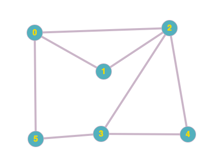

### Table of Contents

1. [Introduction](#introduction)

2. [BFS vs DFS](#bfs-vs-dfs)

3. [Conclusion](#conclusion)

4. [Problems](#problems)

### Introduction
Breadth first search, as the name suggests, is concerned with looking at vertices that are closest to the current vertex. It gradually moves away from the starting vertex. BFS, therefore, can help find the shortest path to vertices from a given vertex. BFS does so by first exploring all vertices 1 edge away from the source, then exploring all vertices 2 edges away from the source and so on. 

In contrast, depth first search took a long route to find a path. That is because DFS is not designed to find the shortest route. It is used to find **a** route. Therefore, DFS helped us answer whether a path existed, BFS will help us find the shortest path from the starting node. 

In breadth first search, we start the search from elements closest to the starting node. The only difference between the code for depth first and breadth first is that breadth first uses `queue` instead of `stack`. 

The algorithm has 3 main steps:
- Remove a vertex from the queue
- Mark all vertices adjacent to current vertex and push them onto the queue
- Repeat until queue is empty

```cpp{numberLines: true}
void AdjList::BFS(int v){
    vector<int> visited(vectorSize);
    queue<int> q;
    visited[v] = true;
    q.push(v);
    while (!q.empty()){
        int curr = q.front();
        cout << curr << " ";
        q.pop();
        for (int i = 0; i < adjList[curr].size(); i++){
            int neighbor = adjList[curr][i];
            if (!visited[neighbor]){
                edgeTo[neighbor] = curr;
                visited[neighbor] = true;
                q.push(neighbor);
            }
        }
    }
    cout << endl;
}
```
 The code above first creates a boolean vector to keep track of visited elements called `visited`.
 
 We also create a queue to push elements so that we can visit them later. We want first in first out for breadth first search because we want to explore all the nodes closest to the starting node first. 

 Next we push the passed element, `v`, onto the queue and mark it. Then we enter a while loop until the queue is empty. 

 We pop an element off the queue, call it `curr`, and start to visit and mark all the elements that are adjacent to `curr`. In the process, we also go ahead and mark these adjacent vertices. This is because we're **visiting** them at this time and this is because BFS is interested in the vertices closest to the passed in vertex. At this point we also populate the `edgeTo` array to record how we got to the current vertex. 
 
We then push each one of these visited vertices onto the queue.

Let's walk through an example again. Here is the graph we're using:

 [Image Credit - Undirected Graph 1](https://graphonline.ru/en/)

Let's say we start at vertex 0 and our queue is empty and the visited array has each entry as false and edgeTo array is empty:

```
queue:             

visited[0] =        
visited[1] = 
visited[2] = 
visited[3] = 
visited[4] =
visited[5] =  

edgeTo[0] =        
edgeTo[1] = 
edgeTo[2] = 
edgeTo[3] = 
edgeTo[4] = 
edgeTo[5] = 
```
Since we start at 0, we push and mark it:


```
                   current Vertex: 0
queue:                  0

visited[0] =             T
visited[1] = 
visited[2] = 
visited[3] = 
visited[4] =
visited[5] =  

edgeTo[0] =             0
edgeTo[1] = 
edgeTo[2] = 
edgeTo[3] = 
edgeTo[4] = 
edgeTo[5] = 
```

We then go inside the `while` loop, pop 0 from queue, visit all its neighbors, mark them and push them on queue:

```cpp
                   current Vertex: 0
queue:                 2,1,5

visited[0] =             T
visited[1] =             T
visited[2] =             T
visited[3] = 
visited[4] =
visited[5] =             T

edgeTo[0] =             0
edgeTo[1] =             0
edgeTo[2] =             0
edgeTo[3] =     
edgeTo[4] = 
edgeTo[5] =             0
```

Next, we go back to the top of the while loop and pop another element off the queue which is 2:
```cpp
                   current Vertex: 2
queue:                 1,5

visited[0] =             T
visited[1] =             T
visited[2] =             T
visited[3] = 
visited[4] =
visited[5] =             T

edgeTo[0] =             0
edgeTo[1] =             0
edgeTo[2] =             0
edgeTo[3] =     
edgeTo[4] = 
edgeTo[5] =             0
```
We then move through the adjacency list for 2 and mark each vertex and push each to the queue as well:

```cpp
                   current Vertex: 2
queue:                 1,5

visited[0] =             T
visited[1] =             T
visited[2] =             T
visited[3] =             T
visited[4] =             T
visited[5] =             T

edgeTo[0] =             0
edgeTo[1] =             0
edgeTo[2] =             0
edgeTo[3] =             2
edgeTo[4] =             2
edgeTo[5] =             0
```

Although the marking is done and our `edgeTo` array is fully created, the algorithm keeps running until all the elements from the queue are popped off. Notice how the `edgeTo` list now notes that we got to 1,2 and 5 from 0 and we got to 3 and 4 from 2. So if you were to call the `FindPath()` function, it'll provide you with the shortest path from any vertex to any other vertex. 

You can create a tree using the `edgeTo` array (look at [DFS](/undirected-graphs-depth-first-search) to see how I did it). The tree in BFS's case would look like this:

```css

        0
      / | \
     1  2  5
       / \
      3   4
``` 

**Notice in DFS we mark a vertex not as soon as we visit it while go through another vertex's adjacency list but it is marked when it is its turn to be processed. However, in BFS, we mark the element as soon as we visit it while exploring another vertex's adjacency list.** BFS says: as soon as you get to a vertex, mark it and push it to the queue. 

Similar to DFS, the running time for BFS is also $O(V + E)$.

### BFS vs DFS
When do we choose one over the other? 

**BFS**
Helps us find all the vertices that are one edge away from the starting position, then 2 edges away and so on. BFS, therefore, is to be used when you're looking to find the shortest path to a vertex. 

**DFS**
Helps us actually answer the question whether a path exists between the vertices we're interested in. 

### Conclusion

Relationship between objects that can be represented using undirected graphs and a lot of questions can be answered about the said objects using the BFS as we've discussed in this section. Happy coding!

### Problems
- [Problem 1](https://leetcode.com/problems/walls-and-gates/) 
- [Problem 2](https://leetcode.com/problems/rotting-oranges/)
