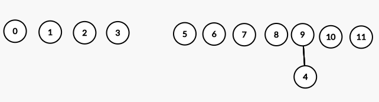
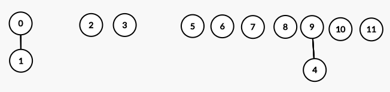
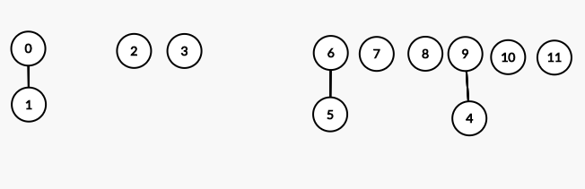

### Table of Contents

1. [Introduction](#introduction)

2. [Setup](#setup)

3. [Weighted Quick Union](#weighted-quick-union)

4. [Analysis](#analysis)

5. [Code](#code)

6. [Summary](#summary)

6. [Conclusion](#conclusion)


### Introduction

In this post I'll talk about a data structure called **union find**. Union find can be used to figure out whether two elements belong to the same set. This set could represent a network of connected computers and you want to know whether two components in this network are connected. Or it can be used to detect cycles in a graph. For example, if two vertices are already in the same component and we proceed to connect them, we'd be creating a cycle.

As the name suggests, union find data structure supports two main operations:
- Find: This is where we determine whether an element belongs to a set. An element could belong to a set where there're multiple other elements ({1,2,3,4}) or it could belong to a set where the only member of the set is the element itself ({1}).
- Union: This is where we add an element to a set or in other words, merge two sets.

The union operation, therefore, can be used to create connected components. Before we dive in, let's define what it means to be connected. 

**Connected** can be thought of as an equivalence relation:

- Reflexive: $A$ is connected to itself.
- Symmetric: If $A$ is connected to $B$, it also means that $B$ is connected to $A$.
- Transitive: If $A$ is connected to $B$, and $B$ is connected to $C$ then $A$ is connected to $C$.
 

### Setup

Before we begin, we need to create a mapping that translates say, a computer name to an integer value. This mapping will allow us to easily perform the union and find operations on our elements. The assigned integer will be in the range $[0, N)$ where $N$ is the total number of computers in the network. For example, if we're dealing with 20 computers in our network, then we'll use an array of size 19. Once we have this mapping, we can represent these computers using the assigned integer values. As a convention, our component identifier would always be one of the one of the sites in the component.

Next, we need to store our integers in an array since we need some sort of association among the objects themselves. Remember our aim is to figure out whether two objects are connected. Initially, each of our components is disconnected from every other component. So this is what our array looks like with say 12 components:

```

 0   1   2   3   4   5   6   7   8   9   10  11   
___ ___ ___ ___ ___ ___ ___ ___ ___ ___ ___ ___
 0   1   2   3   4   5   6   7   8   9   10  11   

```
We want to manipulate our array in such a way that we'd be able to answer questions such as:

- Is the information represented in the structure correctly depict the connections?
- Can we `union()` items - ie connect two components?
- Can we `find()` the component number for the given component?
- Can we tell if two components are `connected()`?
- Finally, can we get the `count()` of the number of components present? 

### Weighted Quick Union
**(For now, ignore the title of this section and assume we're only talking about union)**

Ok, so we've got our array setup where each element is disconnected fom every other component and is in a set by itself. Initially, the number of components in our structure equals the number of objects (12 in our example). Let's say we want to union 2 objects by calling: 
```cpp
union(int p, int q)
``` 
function. Say, we call union with the following:
```cpp
union(4, 9)
union(1, 0)
union(5, 6)
union(5, 10)
union(4, 3)
union(3, 2)
union(7, 1)
union(4, 5)
union(5, 10)
union(11, 8)
union(11, 1)
union(11, 10)
```

In doing so, we make one element the child (or parent) of the other. The choice I made is arbitrary so I chose this convention: 
```cpp
union(p,q)
``` 
This would mean make `p`'s root the child of `q`'s root. So, if we perform $union(4,9)$, we make $4$'s root the child of $9$'s root. What do I mean by $4$'s root? It means, which component does $4$ belong to? Initially, each element is in a set by itself therefore, 4's root is 4 and 9's root is 9. As we said earlier, each component would be represented by one of the elements, so as we update the root for `4`, we put `9` in `arr[4]` to show the fact.

 [Image Credit - Union Find](https://csacademy.com/app/graph_editor/)

 To represent this in our array, we would:
 - Find root of `p` (in the example above it means find root of 4)
 - And change the value at that root to `q`
 
 Therefore, we're going to do this:
 
 ```
Update p's root to point to q's root 
                  | 
  0   1   2   3   9   5   6   7   8   9   10  11   
___ ___ ___ ___ ___ ___ ___ ___ ___ ___ ___ ___
  0   1   2   3   4   5   6   7   8   9   10  11  
```

To find p's root, we keep checking the array until the value at `arr[index]` = `index`. So, 4's root is 4 because `arr[4]` = `4`. 9's root is 9 because `arr[9]` = `9`. So we make 4's root the child of 9's root. For each subsequent union, I'm going to show the updated tree and the array:

**union(1,0)**:

 [Image Credit - Union Find](https://csacademy.com/app/graph_editor/)


 ```
  0   0   2   3   9   5   6   7   8   9   10  11   
___ ___ ___ ___ ___ ___ ___ ___ ___ ___ ___ ___
  0   1   2   3   4   5   6   7   8   9   10  11   
```

**union(5, 6)**:

 [Image Credit - Union Find](https://csacademy.com/app/graph_editor/)

 ```
  0   0   2   3   9   6   6   7   8   9   10  11   
___ ___ ___ ___ ___ ___ ___ ___ ___ ___ ___ ___
  0   1   2   3   4   5   6   7   8   9   10  11   
```

**union(5, 10)**:

This is an interesting one, we usually make p's root the child of q's root. That would mean make 5's root, which is 6, the child of 10's root which is 10. BUT, this is inefficient because we're making a larger tree the child of a smaller tree. This would imply that we change more entries in the array (when we change the array to point to new root). So, as a rule:

- During union operation, make smaller tree the child of the larger tree. 

Keeping that in mind, we're going to make 10's root, the child of 5's root because 10's tree only has 1 element (which is 10 itself) while 5's tree has 2 elements (6 and 5).

 [Image Credit - Union Find](https://csacademy.com/app/graph_editor/)

 ```
  0   0   2   3   9   6   6   7   8   9   6  11   
___ ___ ___ ___ ___ ___ ___ ___ ___ ___ ___ ___
  0   1   2   3   4   5   6   7   8   9   10  11  
```

With the few examples above, we've summarized the rules required for union find:

- During union operation, make smaller tree the child of the larger tree.
- If both trees have same number of elements, Find root of `p` and change the value at that root to `q`

If you go through all the union operations, your tree and array would look like this at the end:

 [Image Credit - Union Find](https://csacademy.com/app/graph_editor/)

```
  9   0   9   9   9   6   9   0   0   9   6   8   
 ___ ___ ___ ___ ___ ___ ___ ___ ___ ___ ___ ___
  0   1   2   3   4   5   6   7   8   9   10  11  
```

Notice the final connections array above: you'd expect every entry to be `9` since 9 is the root of every object. However, since this is quick union, we are not going to determine the top level root for each object. This would make our `find` operation a bit expensive. For example, if we want to see whether 5 and 11 are in the same component, we'll go through these steps until `arr[index] = index`:

```
//For 5
arr[5] = 6
arr[6] = 9
arr[9] = 9


//For 11
arr[11] = 8
arr[8] = 0
arr[0] = 9
arr[9] = 9

``` 

Since roots of 5 and 11 are the same, as expected, they belong to the same component.

### Analysis

The algorithm we discussed above is formally called **weighted quick union**. 
- Weighted: because we check the weights of the two roots before we unionize. This allows us to change fewest possible entries in the array
- Quick union: because the union operation is fast: all we need to do is update one array entry

As a result, the depth of a tree generated using WQU is at most $log(N)$ due to which our `Union` and `Find` would take $O(logN)$ time.

### Code

```cpp{numberLines:true}
class UF{
private:
    vector<int> connectionsArray;
    vector<int> children;
    int numberOfSites;
    
public:
    UF(int);
    void Union(int,int);
    int FindRoot(int);
    void Unionize(int,int);
    void PrintAllVectors();
};


/// Constructor that takes in the number of sites
/// @param num number of sites
UF::UF(int num) : numberOfSites(num){
    for (int i = 0; i < numberOfSites; i++){
        connectionsArray.push_back(i);
    }
    children.resize(numberOfSites);
    
}

/// Function that'll be called by the client with parent and child
/// @param child integer that is to be designated as child
/// @param parent integer that is to be designated as parent
void UF::WeightedQuickUnion(int child, int parent){
    int childRoot = FindRoot(child);
    int parentRoot = FindRoot(parent);
    
    //If the two don't already belong to the same component
    if (childRoot != parentRoot){
        if (children[childRoot] == children[parentRoot] || children[childRoot] < children[parentRoot]){
            //Same number of children in both roots, make childRoot the child of parentRoot
            Unionize(parentRoot, childRoot);
        } else {
            Unionize(childRoot, parentRoot);
        }
    } else {
        cout << child << " and " << parent << " are part of the same component with root: " << childRoot << endl;
    }
}

/// Function to find the root for the items being unioned
/// @param r The item being unioned
int UF::FindRoot(int r){
    while(true){
        if (connectionsArray[r] == r)
            break;
        r = connectionsArray[r];
    }
    
    return r;
}

/// Function to actually perform the union operation
/// @param parent integer being designated as parent
/// @param child integer being designated as child
void UF::Unionize(int parent, int child){
    connectionsArray[child] = parent;
    children[parent] += children[child] + 1;
}
```

On line 16, we define our constructor that takes in the number of objects we're about to specify:

```cpp{numberLines: 16}
/// Constructor that takes in the number of sites
/// @param num number of sites
UF::UF(int num) : numberOfSites(num){
    for (int i = 0; i < numberOfSites; i++){
        connectionsArray.push_back(i);
    }
    children.resize(numberOfSites);
    
}
```
This constructor then initializes the connections array with value $0$ till $N - 1$ where $N$ is the number of objects. This connections array signifies, initially, that each site is connected to itself. The constructor also initializes the `children` array to all $0$s since initially each site has $0$ children.

Next, we're ready to perform union operations on pairs of sites. Let's start with this union operation: 
```cpp
Union(4,9)
```
 
 where child is `4` and parent `9`:
 
 [Image Credit - Union Find](https://csacademy.com/app/graph_editor/)

Here's the function called for performing the union operation:

```cpp{numberLines: 26}
/// Function that'll be called by the client with parent and child
/// @param child integer that is to be designated as child
/// @param parent integer that is to be designated as parent
void UF::WeightedQuickUnion(int child, int parent){
    int childRoot = FindRoot(child);
    int parentRoot = FindRoot(parent);
    
    //If the two don't already belong to the same component
    if (childRoot != parentRoot){
        if (children[childRoot] == children[parentRoot] || children[childRoot] < children[parentRoot]){
            //Same number of children in both roots, make childRoot the child of parentRoot
            Unionize(parentRoot, childRoot);
        } else {
            Unionize(childRoot, parentRoot);
        }
    } else {
        cout << child << " and " << parent << " are part of the same component with root: " << childRoot << endl;
    }
}
```

The first thing we do in this function is to check whether the `childRoot` and `parentRoot` are the same. Notice, we're not checking whether the child and the parent are the same, but the root of the child and root of the parent. To find that root, we use the function called `FindRoot`:

```cpp{numberLines: 46}
/// Function to find the root for the items being unioned
/// @param r The item being unioned
int UF::FindRoot(int r){
    while(true){
        if (connectionsArray[r] == r)
            break;
        r = connectionsArray[r];
    }
    
    return r;
}
```

This function goes through the `connectionsArray` until the value at `connectionsArray[item]` = `item`. If so, return the root. Once we get our roots, back, we check if the roots are the same. If so, the items we're unionizing are already children of the same root so no need to unionize. If not, we then check to see which one of the two (childRoot or parentRoot) has more children. If one has more children, we make it the parent. If both are same, we make childRoot the child of parentRoot. This is the **weighted** part of WQU. Once that is determined, we call the `Unionize` function:

```cpp{numberLines: 58}
/// Function to actually perform the union operation
/// @param parent integer being designated as parent
/// @param child integer being designated as child
void UF::Unionize(int parent, int child){
    connectionsArray[child] = parent;
    children[parent] += children[child] + 1;
}
``` 

that makes the child to parent connection by changing values in the `connectionsArray` and also updates the number of children for the parent in the `children` array. 

Once we're done with all the union operations, this is what our `connectionsArray` and `children` array would look like:

```
Connections Array: 
9 0 9 9 9 6 9 0 0 9 6 8 
Children array: 
4 0 0 0 0 0 2 0 1 11 0 0 
```

Notice how `children[9]` shows `11` which means every site's root is `9`. 

If you notice, we haven't addressed the main reason we wrote this entire `UnionFind` class: to check if two sites are part of the same component. Or if two vertices in a graph are already connected. We don't need a new function for it because we've already got one for it: `FindRoot(int r)`. Our client can call this function for the two sites they're interested in. If `FindRoot(int r)` returns the same root for both, then the sites are connected, otherwise they're not.

### Summary
To summarize, here're the steps we take to create and use our union find data structure:
- Create a mapping between items and integers so that we can store our items in an array 
- Start processing pairs by calling `union()` function for 2 sites, namely `p` and `q`.
- Check if `p` and `q` are already connected - if so, move on. If not, make `p`'s root the child of `q`'s root. At this step you can have various techniques based on whether your find or union operations are more frequent. You can use:
    - Quick Find
    - Quick Union
    - Weighted Quick Union 
- Continue until no more pairs are left to be processed.


### Conclusion
WQU is an efficient method to determine connectivity among objects. We'll see it in action when we talk about graph algorithms.  