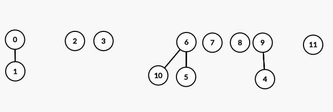
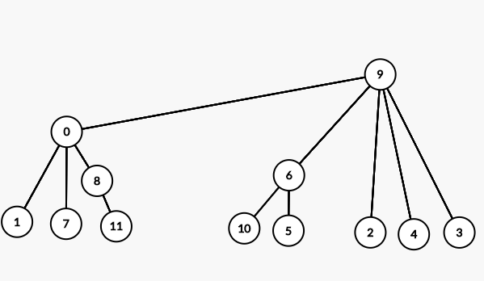

### Table of Contents

1. [Introduction](#introduction)

2. [Setup](#setup)

3. [Union](#union)

4. [Analysis](#analysis)

5. [Code](#code)


### Introduction

In this post I'll talk about an algorithm called the union find algorithm. Union find can be used to figure out whether two elements belong to the same set. This set could represent a network of connected computers and you want to know whether two components in this network are connected. Or it can be used to detect cycles in a graph. For example, if two vertices are already in the same component and we proceed to connect them, we'd be creating a cycle. Before we dive in, let's define what it means to be connected. 

**Connected** can be thought of as an equivalence relation:

- Reflexive: $A$ is connected to itself.
- Symmetric: If $A$ is connected to $B$, it also means that $B$ is connected to $A$.
- Transitive: If $A$ is connected to $B$, and $B$ is connected to $C$ then $A$ is connected to $C$.
 

### Setup

Before we begin, we need to create a bijection (or a one to one mapping) that translates a computer name to an integer value. This integer will be in the range $[0, N)$ where $N$ is the total number of computers in the network. Once we have this mapping, we can represent these computers using the assigned integer values. Now, we're ready to manipulate these integers. 

Next, we need to store our integers in an array since we need some sort of association among the objects themselves. Remember our aim is to figure out whether two objects are connected. Initially, each of our components is disconnected from every other component. So this is what our array looks like with say 12 components:

```

 0   1   2   3   4   5   6   7   8   9   10  11   
___ ___ ___ ___ ___ ___ ___ ___ ___ ___ ___ ___
 0   1   2   3   4   5   6   7   8   9   10  11   

```
We want to manipulate our array in such a way that we'd be able to answer questions such as:

- Is the information represented in the structure correctly depict the connections?
- Can we `union()` items - ie connect two components?
- Can we `find()` the component number for the given component?
- Can we tell if two components are `connected()`?
- Finally, can we get the `count()` of the number of components present? 

### Union

Ok, so we've got our array setup where each element is disconnected fom every other component. Initially, the number of components in our structures equals the number of objects (12 in our example). Let's say we want to union 2 objects by calling the`union(int p, int q)` function. Say, we call union with the following:
```cpp
union(4, 9)
union(1, 0)
union(5, 6)
union(5, 10)
union(4, 3)
union(3, 2)
union(7, 1)
union(4, 5)
union(5, 10)
union(11, 8)
union(11, 1)
union(11, 10)
```

In doing so, we make one element the child (or parent) of the other. The choice I made is arbitrary so I chose this convention: 
```cpp
union(p,q)
``` 
would mean make `q`'s root the child of `p`'s root. So, if we perform $union(4,9)$, we make $4$'s root the child of $9$'s root:

 [Image Credit - Union Find](https://csacademy.com/app/graph_editor/)

 To represent this in our array, we'll update `arr[p]`'s root to the value of `q`. This would mean:
 - Find root of `p` (in the example above it means find root of 4)
 - And change the value at that root to `q`
 
 Therefore, we're going to do this:
 
 ```
Update p's root to point to q's root 
                 | 
  0   1   2   3   9   5   6   7   8   9   10  11   
___ ___ ___ ___ ___ ___ ___ ___ ___ ___ ___ ___
  0   1   2   3   4   5   6   7   8   9   10  11  
```

To find p's root, we keep checking the array until the value at `arr[index]` = `index`. So, 4's root is 4 because `arr[4]` = `4`. 9's root is 9 because `arr[9]` = `9`. So we make 4's root the child of 9's root. For each subsequent union, I'm going to show the updated tree and the array:

**union(1,0)**:

 [Image Credit - Union Find](https://csacademy.com/app/graph_editor/)


 ```
  0   0   2   3   9   5   6   7   8   9   10  11   
___ ___ ___ ___ ___ ___ ___ ___ ___ ___ ___ ___
  0   1   2   3   4   5   6   7   8   9   10  11   
```

**union(5, 6)**:

 [Image Credit - Union Find](https://csacademy.com/app/graph_editor/)

 ```
  0   0   2   3   9   6   6   7   8   9   10  11   
___ ___ ___ ___ ___ ___ ___ ___ ___ ___ ___ ___
  0   1   2   3   4   5   6   7   8   9   10  11   
```

**union(5, 10)**:

This is an interesting one, we usually make p's root the child of q's root. That would mean make 5's root, which is 6, the child of 10's root which is 10. BUT, this is inefficient because we're making a larger tree the child of a smaller tree. This would imply that we change more entries in the array (when we change the array to point to new root). So, as a rule:

- During union operation, make smaller tree the child of the larger tree. 

Keeping that in mind, we're going to make 10's root, the child of 5's root because 10's tree only has 1 element (which is 10 itself) while 5's tree has 2 elements (6 and 5).

 [Image Credit - Union Find](https://csacademy.com/app/graph_editor/)

 ```
  0   0   2   3   9   6   6   7   8   9   6  11   
___ ___ ___ ___ ___ ___ ___ ___ ___ ___ ___ ___
  0   1   2   3   4   5   6   7   8   9   10  11  
```

With the few examples above, we've summarized the rules required for union find:

- During union operation, make smaller tree the child of the larger tree.
- If both trees have same number of elements, Find root of `p` and change the value at that root to `q`

If you go through all the union operations, your tree and array would look like this at the end:

 [Image Credit - Union Find](https://csacademy.com/app/graph_editor/)

```
  9   0   9   9   9   6   9   0   0   9   6   8   
 ___ ___ ___ ___ ___ ___ ___ ___ ___ ___ ___ ___
  0   1   2   3   4   5   6   7   8   9   10  11  
```

Notice the final connections array above: you'd expect every entry to be `9` since 9 is the root of every object. However, since this is quick union, we are not going to determine the top level root for each object. This would make our `find` operation a bit expensive. For example, if we want to see whether 5 and 11 are in the same component, we'll go through these steps until `arr[index] = index`:

```
//For 5
arr[5] = 6
arr[6] = 9
arr[9] = 9


//For 11
arr[11] = 8
arr[8] = 0
arr[0] = 9
arr[9] = 9

``` 

Since roots of 5 and 11 are the same, as expected, they belong to the same component.

### Analysis

The algorithm we discussed above is formally called **weighted quick union**. 
- Weighted: because we check the weights of the two roots before we unionize. This allows us to change fewest possible entries in the array
- Quick union: because the union operation is fast: all we need to do is update one array entry

As a result, the depth of a tree generated using WQU is at most $log(N)$

### Code

```cpp{numberLines:true}
class UF{
private:
    vector<int> connectionsArray;
    vector<int> children;
    int numberOfSites;
    
public:
    UF(int);
    void Union(int,int);
    int FindRoot(int);
    void Unionize(int,int);
    void PrintAllVectors();
};


/// Constructor that takes in the number of sites
/// @param num number of sites
UF::UF(int num) : numberOfSites(num){
    for (int i = 0; i < numberOfSites; i++){
        connectionsArray.push_back(i);
    }
    children.resize(numberOfSites);
    
}

/// Function that'll be called by the client with parent and child
/// @param child integer that is to be designated as child
/// @param parent integer that is to be designated as parent
void UF::Union(int child, int parent){
    int childRoot = FindRoot(child);
    int parentRoot = FindRoot(parent);
    
    //If the two don't already belong to the same component
    if (childRoot != parentRoot){
        if (children[childRoot] == children[parentRoot] || children[childRoot] < children[parentRoot]){
            //Same number of children in both roots, make childRoot the child of parentRoot
            Unionize(parentRoot, childRoot);
        } else {
            Unionize(childRoot, parentRoot);
        }
    } else {
        cout << child << " and " << parent << " are part of the same component with root: " << childRoot << endl;
    }
}

/// Function to find the root for the items being unioned
/// @param r The item being unioned
int UF::FindRoot(int r){
    while(true){
        if (connectionsArray[r] == r)
            break;
        r = connectionsArray[r];
    }
    
    return r;
}

/// Function to actually perform the union operation
/// @param parent integer being designated as parent
/// @param child integer being designated as child
void UF::Unionize(int parent, int child){
    connectionsArray[child] = parent;
    children[parent] += children[child] + 1;
}

/// Function to print vectors
void UF::PrintAllVectors(){
    cout << "Connections Array: " << endl;
    for (auto i : connectionsArray)
        cout << i << " ";
    cout << endl;
    cout << "Children array: " << endl;
    for (auto i : children)
        cout << i << " ";
    cout << endl;
}
```

