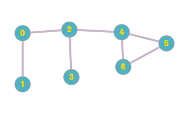
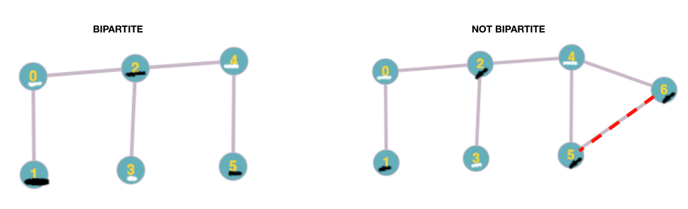
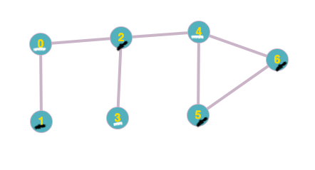

### Table of Contents

1. [Motivation](#motivation)

2. [Logic](#logic)

3. [Code](#code)

4. [Resource](#resources)

### Motivation

Let's say we have an undirected graph and want to check and see whether the graph is bipartite. A graph is considered bipartite if its vertices can be assigned one of two colors (black or white) in such a way that no edge connects vertices of the same color. Let's say this is the graph in question:

 [Image Credit - Cycle Graph 1](https://graphonline.ru/en/)

Let's write an algorithm that answers the simple question whether the graph is bipartite or not.

### Logic

 To check the bipartite property, we'll use a modified version of [recursive depth first search](/graphs#depth-first-search)algorithm. Before we dive into the modified version let's understand logically how we can tackle this problem. Similar to DFS, we'll maintain a visited array and start with vertex 0. In addition, we'll also maintain an array that'll keep track of the color for each vertex we have. Here's the crux of our algorithm:
 
```text
Let's say we're on a vertex `v` and have colored it already. 
If we were to iterate through the adjacency list of this vertex `v` and find a neighbor `u` 
that has also been colored and `v` and `u` have different colors, our graph is bipartite. 
This property has to hold for each vertex and its neighbor. 
```

Here are 2 graphs where one is bipartite and one that isn't:

 [Image Credit - Comparison 1](https://graphonline.ru/en/)

The one on the left is bipartite because we were able to color our vertices in an arrangement where no edge connects two vertices of the same color. Conversely, the graph on the right is not bipartite because we have an edge, marked in red, that connects two vertices of the same color. If you try changing the color of one of the vertices, you'll upset the balance of colors elsewhere in the graph.

How will we about coloring the graph and making sure we haven't violated this property? As I already mentioned, we'll make use of 2 arrays, one that'll keep track of visited vertices as usual and one that'll keep track of colors for each of the vertices. 

**We'll say that the bipartite property isn't violated as long as each vertex on a particular vertex's adjacency list (let's call them `neighbors`) has a different color than the original vertex (let's call it `v`).** 

For example if we're considering vertex 0 that we color white and have the following adjacency list:  

```css
0 -> 1 -> 2
1 -> 0
2 -> 0 -> 3 -> 4
3 -> 2
4 -> 2 -> 6 -> 5
5 -> 4 -> 6
6 -> 4 -> 5
``` 

then we expect vertices 1 and 2 to be black:
```css
0 (white) -> 1 (black) -> 2 (black)
``` 

So, while we're going through our DFS routine we need to take the following actions:

- If encountered vertex in an adjacency list is not visited, mark it as visited and assign it a color that is opposite of the original vertex's color
- If encountered vertex in adjacency list is visited, check if color is opposite that of original vertex's color: if so, we're good, otherwise, bipartite property has been violated. 

Let's have a look at the code:

### Code

```cpp{numberLines: true}
class AdjList{
private:
    int vectorSize;
    vector<vector<int>> adjList;
    vector<bool> visited;
    vector<bool> colors;
    vector<int> edgeTo;
    void initializeStructures();
    
public:
    AdjList();
    AdjList(int);
    void AddEdge(int,int);
    void Print();
    void IsBiPartite();
    void DFSBiPartite(int v);
};

void AdjList::IsBiPartite(){
    DFSBiPartite(0);
}

void AdjList::DFSBiPartite(int v){
    visited[v] = true;
    cout << v << "'s color " << colors[v] << endl;
    for (int i = 0; i < adjList[v].size(); i++){
        int neighbor = adjList[v][i];
        if (!visited[neighbor]){
            colors[neighbor] = !(colors[v]);
            DFSBiPartite(neighbor);
        } else if (visited[neighbor]){
            if (colors[neighbor] == colors[v]){
                cout << "Not bi partite because " << neighbor << " and " << v << " have the same color" << endl;
            }
        }
    }
}

AdjList::AdjList(int vecSize) : vectorSize(vecSize){
    cout << "Number of vertices was passed as: " << vectorSize << endl;
    initializeStructures();
}
AdjList::AdjList(){
    cout << "Number of vertices defaults to 5..." << endl;
    vectorSize = 5;
    initializeStructures();
}

//Helper function to set sizes for structures
//used for various operations
void AdjList::initializeStructures(){
    adjList.resize(vectorSize);
    visited.resize(vectorSize);
    edgeTo.resize(vectorSize);
    colors.resize(vectorSize);
}

void AdjList::Print(){
    for (int i = 0; i < vectorSize; i++){
        cout << i;
        for (auto j : adjList[i]){
            cout << " -> ";
            cout << j;
        }
        cout << endl;
    }
    cout << endl;
}

void AdjList::AddEdge(int i, int j){
    adjList[i].push_back(j);
    adjList[j].push_back(i);
}
```

The client will call the function `IsBiPartite()` on line 19 that in turn calls `DFSBiPartite(int v)` on line 23. Let's walk through `DFSBiPartite(int v)` function:

```cpp{numberLines: 23}
void AdjList::DFSBiPartite(int v){
    visited[v] = true;
    cout << v << "'s color " << colors[v] << endl;
    for (int i = 0; i < adjList[v].size(); i++){
        int neighbor = adjList[v][i];
        if (!visited[neighbor]){
            colors[neighbor] = !(colors[v]);
            DFSBiPartite(neighbor);
        } else if (visited[neighbor]){
            if (colors[neighbor] == colors[v]){
                cout << "Not bi partite because " << neighbor << " and " << v << " have the same color" << endl;
            }
        }
    }
}
```

The function first marks `visited[v]` as true and prints the color of the vertex (colors is a boolean array so 1 = true = black while 0 = false = white). Since the vector, `colors` was initialized in the class constructor, it was initialized with default values of `0` or false. So, we start with vertex `0` colored as `white`. Next, we visit neighbors of `0` based on off the adjacency list we have and check if the neighbor has been visited. If it hasn't been visited, we mark `colors[niehgbor]` with the opposite color of vertex `v`. So, we started with vertex 0 with color white and we're moving to un-visited vertex 1, so we'll mark 1 as black. We continue this process by visiting each vertex's neighbors and coloring the neighbors appropriately.

If we have this graph: 

 [Image Credit - Not Bipartite](https://graphonline.ru/en/)

we'll have the following output when we run the code above with this client:

```cpp
    AdjList l(7);
    l.AddEdge(0,1);
    l.AddEdge(0,2);
    l.AddEdge(2,3);
    l.AddEdge(2,4);
    l.AddEdge(4,6);
    l.AddEdge(4,5);
    l.AddEdge(5,6);
    l.IsBiPartite();
```

Output:

```
Adjacency List:
0 -> 1 -> 2
1 -> 0
2 -> 0 -> 3 -> 4
3 -> 2
4 -> 2 -> 6 -> 5
5 -> 4 -> 6
6 -> 4 -> 5

0's color 0
1's color 1
2's color 1
3's color 0
4's color 0
6's color 1
5's color 0
Not bi partite because 4 and 5 have the same color
```

We start off with 0 as white, 1 and 2 as black, 3 and 4 as white and then we visit 4's neighbor 6. We color 6 as black and go to 6's adjacency list. In 6's adjacency list we encounter 4 which is already visited so we skip it and visit 5. We find 5 as unvisited so we color it opposite of what the color of 6 is, so white. We return control back to 4 where we continue processing 4's adjacency list and continue where we left off which was 5. We find 5 is already visited so we check its color and see that it is white as well (we colored it white when we visited 5 via 6's adjacency list). We find that 4 and 5 have the same color and the bipartite property doesn't hold. 


