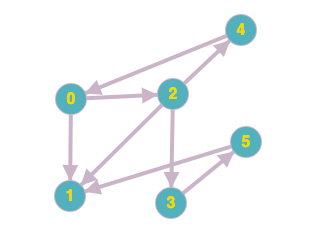

### Table of Contents

1. [Introduction](#introduction)

2. [Definitions](#definitions)

3. [Adjacency Matrix](#adjacency-matrix)

4. [Adjacency List](#adjacency-list)

    * [Adjacency List code](#adjacency-list-code)

5. [Depth First Search](#depth-first-search)

6. [Single Source directed paths](#single-source-directed-paths)

7. [Single Source shortest directed paths](#single-source-shortest-directed-paths)

8. [Conclusion](#conclusion)

### Introduction

In this post I'll talk about directed graphs. We'll be looking at the algorithms we discussed while talking about [undirected graphs](/undirected-graphs) and I suggest you go over those (DFS,BFS,Cycle detection, connected components, union find and bipartite) before proceeding with this post.

### Definitions

Just as a recap, a directed graph is one that is represented by arrow heads showing the allowed direction that can be travelled. A digraph can be represented by an ordered pair. An ordered pair is useful because the order of each pair determines the direction of the edge. For example, edge (1,2) would mean you can travel from 1 to 2 BUT not the other way round.

Here is what an undirected graph looks like:

 [Image Credit - Directed Graph](https://graphonline.ru/en/)

Notice for our directed graph, or digraph, there are arrows representing the allowed travel direction. This was not present in undirected graphs where an edge between $A$ and $B$ meant you could travel in either direction. That is not the case with directed graphs. For example, you can travel from 3 to 5 but not from 5 to 3.


### Adjacency Matrix

Similar to undirected graphs, we can represent a digraph using an adjacency matrix as well. This time, however there will be no symmetry: If 0 is connected to 1, there'll be only one entry in the matrix for this edge. Here's what the above digraph would look like using a matrix: (and the digraph above again for reference):


 [Image Credit - Directed Graph](https://graphonline.ru/en/)

|  | 0 | 1 | 2 | 3 | 4 | 5 |
| -- | -- | -- | -- | -- | -- |
| **0** | 1 | 1 | 0 | 0 | 0 | 0 |
| **1** | 0 | 0 | 0 | 0 | 0 | 0 | 
| **2** | 0 | 1 | 0 | 1 | 1 | 0 |
| **3** | 0 | 0 | 0 | 0 | 0 | 1 |
| **4** | 1 | 0 | 0 | 0 | 0 | 0 |
| **5** | 0 | 1 | 0 | 0 | 0 | 0 |

Although this is a good representation to understand how we are using a data structure to represent a graph in memory, it is actually wasteful of the memory. Our graph takes up $O(V^2)$ space and has barely 8 entries (number of edges). Therefore, we'll use [adjacency lists](/undirected-graphs#adjacency-list) to represent digraphs as well.

### Adjacency List

An adjacency is a linked list of vertices that is a way for us to represent a graph in memory. For our graph, this is what the adjacency list would look like (again graph is shown as well for reference):

 [Image Credit - Directed Graph](https://graphonline.ru/en/)

```
0 -> 1 -> 2
1
2 -> 1 -> 3 -> 4
3 -> 5
4 -> 0
5 -> 1
```

Notice, unlike undirected graphs, a digraph's adjacency list doesn't have symmetric entries. For example, we have 2 in 0's adjacency list but there is no 0 in 2's. Again, that is because direction of arrows dictates connections. Notice how vertex 1's adjacency list is empty because 1 doesn't point to any other vertex.

### Adjacency List code

Let's see the code for constructing this directed graph:

```cpp{numberLines: true}
class Digraph{
private:
    int vectorSize;
    vector<vector<int>> adjList;
    vector<bool> visited;
    vector<int> edgeTo;
    void initializeStructures();
    int numberOfComponents;
    bool hasCycle;
    
public:
    Digraph();
    Digraph(int);
    void AddEdge(int,int);
    void Print();
    void BFS(int);
    void RecursiveDFS();
    void RecursiveDFS(int v);
    void PrintEdgeTo();
    void FindPath(int v, int w);
};

void Digraph::BFS(int v){
    vector<int> marked(vectorSize);
    queue<int> q;
    marked[v] = true;
    q.push(v);
    while (!q.empty()){
        int curr = q.front();
        cout << curr << " ";
        q.pop();
        for (int i = 0; i < adjList[curr].size(); i++){
            int neighbor = adjList[curr][i];
            if (!marked[neighbor]){
                edgeTo[neighbor] = curr;
                marked[neighbor] = true;
                q.push(neighbor);
            }
        }
    }
    cout << endl;
}

void Digraph::RecursiveDFS(){
    for (int i = 0; i < visited.size(); i++){
        if (!visited[i]){
            RecursiveDFS(i);
        }
    }
}

void Digraph::RecursiveDFS(int v){
    visited[v] = true;
    cout << v << " ";
    for (int i = 0; i < adjList[v].size(); i++){
        int curr = adjList[v][i];
        if (!visited[curr]){
            edgeTo[curr] = v;
            RecursiveDFS(curr);
        }
    }
}

void Digraph::PrintEdgeTo(){
    for (int i = 0; i < edgeTo.size(); i++){
        cout << "edgeTo[" << i << "]" << " --> " << edgeTo[i] << endl;
    }
}


Digraph::Digraph(int vecSize) : vectorSize(vecSize){
    cout << "Number of vertices was passed as: " << vectorSize << endl;
    initializeStructures();
}
Digraph::Digraph(){
    cout << "Number of vertices defaults to 5..." << endl;
    vectorSize = 5;
    initializeStructures();
}

//Helper function to set sizes for structures
//used for various operations
void Digraph::initializeStructures(){
    adjList.resize(vectorSize);
    visited.resize(vectorSize);
    edgeTo.resize(vectorSize);
    numberOfComponents = 0;
}

void Digraph::Print(){
    for (int i = 0; i < vectorSize; i++){
        cout << i;
        for (auto j : adjList[i]){
            cout << " -> ";
            cout << j;
        }
        cout << endl;
    }
    cout << endl;
}

void Digraph::AddEdge(int i, int j){
    adjList[i].push_back(j);
}

void Digraph::FindPath(int v, int w){
    /**
     Begin at the w vertex: 5 (push 5 on the stack)
     Check edgeTo[w] = edgeTo[5] = 3. (push 3 on the stack)
     Go to edgeTo[3] = 2 (push 2 on the stack)
     Go to edgeTo[2] = 0 (push 0 on the stack)
     We're now at v vertex: 0
     */
    stack<int> s;
    int end = w;
    while (true){
        s.push(end);
        if (end == v){
            break;
        }
        end = edgeTo[end];
    }
    
    cout << "Path from " << v << " to " << w <<": "<<endl;
    while (!s.empty()) {
        int curr = s.top();
        cout << curr << " ";
         s.pop();
    }
    
    cout << endl;
}
```
To create our list, we're using a vector of vectors declared on line 4. If you're using the default constructor, the number of vertices default to 5. There's another constructor where you can pass in the number of vertices. We initialize the vector of vectors called `adjList` in the `initializeStructures()` function:

```cpp{numberLines: 75}
void Digraph::initializeStructures(){
    adjList.resize(vectorSize);
    visited.resize(vectorSize);
    edgeTo.resize(vectorSize);
    numberOfComponents = 0;
}
```

This function resizes the `adjList` to the number of vertices. This creates our outer vector and then inner vectors are populated when add edges. Here is the `AddEdge(int i, int j)` function:

```cpp{numberLines: 94}
void Digraph::AddEdge(int i, int j){
    adjList[i].push_back(j);
}
```

### Depth First Search

There is no difference between undirected graph dfs and digraph dfs. Remember the idea is to get as far away from the starting vertex as possible before unwinding our way back.To do so, we have a recursive function that starts off with a vertex and repeatedly calls unvisited neighbors of this vertex. On each call to the neighbor, the neighbor's neighbor is then visited and so on. The first `RecursiveDFS()` function is what the client uses to call this function. This function, on line 44, iterates over the unvisited vertices and for each unvisited vertex, it calls `RecursiveDFS(int v)` that iterates over its neighbors: 

```cpp{numberLines: 44}
void Digraph::RecursiveDFS(){
    for (int i = 0; i < visited.size(); i++){
        if (!visited[i]){
            RecursiveDFS(i);
        }
    }
}

void Digraph::RecursiveDFS(int v){
    visited[v] = true;
    cout << v << " ";
    for (int i = 0; i < adjList[v].size(); i++){
        int curr = adjList[v][i];
        if (!visited[curr]){
            edgeTo[curr] = v;
            RecursiveDFS(curr);
        }
    }
}
```

### Single Source directed paths

When we call the dfs function, notice we're also building the `edgeTo` array. `edgeTo` is nothing but a record of how we got to the current vertex. For example `edgeTo[1] = 0` means that we got to `1` from `0`. So, once we've called DFS with vertex 0, we get the following `edgeTo` array:

```css
edgeTo[0] --> 0
edgeTo[1] --> 0
edgeTo[2] --> 0
edgeTo[3] --> 2
edgeTo[4] --> 2
edgeTo[5] --> 3
```
We can process this array in a function called `FindPath(int v, int w)`:

```cpp{numberLines: 98}
void Digraph::FindPath(int v, int w){
    /**
     Begin at the w vertex: 5 (push 5 on the stack)
     Check edgeTo[w] = edgeTo[5] = 3. (push 3 on the stack)
     Go to edgeTo[3] = 2 (push 2 on the stack)
     Go to edgeTo[2] = 0 (push 0 on the stack)
     We're now at v vertex: 0
     */
    stack<int> s;
    int end = w;
    while (true){
        s.push(end);
        if (end == v){
            break;
        }
        end = edgeTo[end];
    }
    
    cout << "Path from " << v << " to " << w <<": "<<endl;
    while (!s.empty()) {
        int curr = s.top();
        cout << curr << " ";
         s.pop();
    }
    
    cout << endl;
}
```

Let's say we want to find **a** path from vertex 0 to vertex 5. To do so, we'll do the following:

```
(1) Start at destination vertex - w and push it on stack
(2) Get value at edgeTo[w] let's call this curr
(3) Push curr to stack
(4) Get value at edgeTo[curr] (call this curr again) and push to stack again
(5) Continue this process until v is reached
(6) Pop off stack the top element to get path
```

Let's look at our `edgeTo` array:

```css
edgeTo[0] --> 0
edgeTo[1] --> 0
edgeTo[2] --> 0
edgeTo[3] --> 2
edgeTo[4] --> 2
edgeTo[5] --> 3
```

Here is our trace:

```
                         push 5 on stack
start at edgeTo[5] 
edgeTo[5] = 3 = curr    (push 3 on stack)
edgeTo[3] = 2 = curr    (push 2 on stack)
edgeTo[2] = 0 = curr    (push 0 on stack) 
curr == v end
Popping off stack: 0 -> 2 -> 3 -> 5
```

### Single Source shortest directed paths

In the section above, we found **a** path, we can find the **shortest** path by creating the `edgeTo` array by using breadth first search instead of depth first search. Here is the code for breadth first search:

```cpp{numberLines: 22}
void Digraph::BFS(int v){
    vector<int> marked(vectorSize);
    queue<int> q;
    marked[v] = true;
    q.push(v);
    while (!q.empty()){
        int curr = q.front();
        cout << curr << " ";
        q.pop();
        for (int i = 0; i < adjList[curr].size(); i++){
            int neighbor = adjList[curr][i];
            if (!marked[neighbor]){
                edgeTo[neighbor] = curr;
                marked[neighbor] = true;
                q.push(neighbor);
            }
        }
    }
    cout << endl;
}
```

### Conclusion

Directed graphs are a good model to solve a particular type of problem where relationships between vertices is more nuanced. For example, in another post I'll talk about representing say a college course plan where a course must be taken after its pre-reqs are met. This is a problem that can be modeled using directed graphs. 