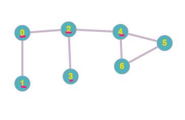
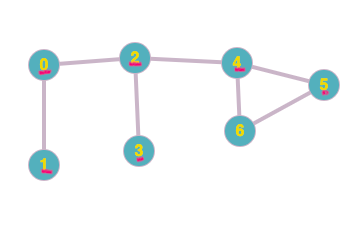
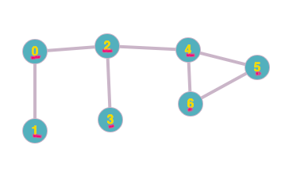
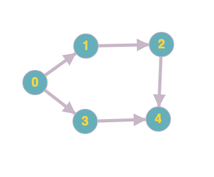

### Table of Contents

1. [Motivation](#motivation)

2. [Logic](#logic)

3. [Code](#code)

4. [Digraph](#digraph)

### Motivation

Let's say we have a graph (can be directed or undirected) and want to check and see whether the graph has any cycles. A cycle is defined where the vertices are connected in a closed chain. Here is a graph that has a cycle with vertices $4$, $5$ and $6$ forming a closed chain:

 [Image Credit - Cycle Graph 1](https://graphonline.ru/en/)

Let's write an algorithm that answers the simple question whether an **undirected** graph contains a  cycle or not. 

### Logic

 In order to check whether a cycle exists, we'll use a modified version of [recursive depth first search](/undirected-graphs-depth-first-search)algorithm. Before we dive into the modified version let's understand logically how we can tackle this problem. Similar to DFS, we'll maintain a visited array and start with vertex 0. Here's the crux of our algorithm:
 
```css
If we find a vertex, called neighbor in a vertex's adjacency list and find that 
the neighbor has already been visited and that neighbor is not the parent vertex, we have a cycle.
```

In the statement above, the `parent` is the vertex that made the `DFS` call. For example, if we have this adjacency list for the graph above:

```css
0 -> 1 -> 2
1 -> 0 
2 -> 0 -> 3 -> 4
3 -> 2
4 -> 2 -> 5 -> 6
5 -> 4 -> 6
6 -> 4 -> 5 
``` 

and we call DFS starting at vertex `0`, then 0 would find that `1` is unvisited and another recursive call would be made. This new DFS call would have the vertex as `1` and parent as `0` since `0` initiated this new recursive call. 

To keep track of the parent we'd have to modify the signature of our `DFS` function so that we can pass parent to each recursive call.

Why does this work? It works because if there is a cycle, there has to be a back edge between two edges. In our graph above, the back edge is the edge connecting vertices 4 and 5. Let's have a look at the graph again to better understand why this works. 

Assume we've visited nodes 0 - 4 and the visited nodes are marked in red. Now, we're considering 4's adjacency list and about to make DFS calls based off it:

 [Image Credit - Cycle Graph 2](https://graphonline.ru/en/)

At this point, 4 was called from vertex 2 so 2 is the parent here. This is 4's adjacency list:

```css
4 -> 2 -> 5 -> 6
```
We pick 2 and see it has already been visited and check to see if 2 is 4's parent which it is so we move on to the next element. Next we find 5 and see it has not been visited so we mark it as visited and call DFS again but this time with vertex as 5 and parent as 4:


 [Image Credit - Cycle Graph 3](https://graphonline.ru/en/)

Again we look in 5's adjacency list:

```css
5 -> 4 -> 6
```

and find 4. 4 is already visited and is the parent so we move on to the next vertex in the list. Next we find 6, 6 is not visited so we call DFS with 6 as the vertex and 5 as the parent:

 [Image Credit - Cycle Graph 4](https://graphonline.ru/en/)

For vertex 6, we find this adjacency list:

```css
6 -> 4 -> 5 
```

and we choose the first vertex in the list which is 4. We find that 4 is already visited BUT this time, we also find that 4, even though is visited, it is NOT the parent vertex. We've found a link to the grandparent (in terms of recursive calls). We have a cycle. This check for parent is necessary for undirected graphs because the current vertex's parent is already visited because we got to the current vertex through its parent. We're only interested in the vertex if the visited vertex is NOT the parent which was true for the last case above. 

### Code

Let's have a look at the modified `DFS` function that I've called `CycleDFS`:

```cpp
bool AdjList::CyclePresent(){
    for (int i = 0; i < vectorSize; i++){
        if (!visited[i])
            CycleDFS(i, -1);
    }
    if (hasCycle)
        cout << "There is a cycle!" << endl;
    return hasCycle;
}

//Visited is an array that keeps track of visited vertices
//adjList is a vector of vectors to represent the adjacency list for each vertex
//hasCycle is an instance variable to keep track of wether graph as a cycle
void AdjList::CycleDFS(int v, int parent){
    cout << "v is: " << v << " and parent is: " << parent << endl;
    visited[v] = true;
    for (int i = 0; i < adjList[v].size(); i++){
        int neighbor = adjList[v][i];
        if (!visited[neighbor]){
            CycleDFS(neighbor, v);
        } else {
            if (neighbor != parent){
                hasCycle = true;
            }
        }
    }
}
```

We've got a helper function, `CyclePresent`, that calls `CycleDFS()` initially with vertex 0 and parent as -1 since vertex 0 has no parent. We continue calling the function and marking the `visited` array. At one point, we reach the case where we process vertex 6 and it is called by vertex 5 (5 is the parent). At this point, we find 4 in 6's adjacency list which has already been visited (we reached 5 via 4 so 4 has already been visited). We check to see if neighbor, which is 4, is not equal to the parent, which is 5. The neighbor is indeed not equal to the parent and we have a cycle.

### Digraph 
Now, let's answer the same question for a digraph. You might ask: "Why doesn't the algorithm above work for a digraph?". Let's take an example:

 [Image Credit - Di Graph 1](https://graphonline.ru/en/)

For the graph above, we'll have this adjacency list:

```css
0 -> 1 -> 3
1 -> 2
2 -> 4
3 -> 4
4 
``` 
Say we're starting at vertex 0, we'll go through the undirected graph algorithm and find that we'll end up at vertex 4 via 2 paths (as show from the digraph). When we reach `4` from the 0->3->4 path, the undirected graph algo will return true saying that there does exist a cycle while in reality there isn't! We need another approach:

We can keep track of our current path using a boolean array and if at any point we reach a vertex in the graph that is on the current path or call stack, we know there's a **back edge**. As we return our recursive calls, we'll update the `onStack`. Here's this logic converted to code:


```cpp{numberLines: true}
void DFS(vector<vector<int>>& graph, vector<bool>& visited, vector<bool>& onStack, bool& hasCycle, int v){
    if (hasCycle)
        return;
    visited[v] = true;
    if (onStack[v]){
        hasCycle = true;
        return;
    }
    
    onStack[v] = true;
    for (int i = 0; i < graph[v].size(); i++){
        int curr = graph[v][i];
        if (!onStack[curr]){
            DFS(graph, visited, onStack, hasCycle, curr);
        } else {
            hasCycle = true;
            return;
        }
    }
    
    onStack[v] = false;
}
```

Notice how we're updating the `onStack` variable on line 10 for the current vertex and once we're done processing its neighbors, we change the value in `onStack` back to false. This way, we'll always have correct path present in this array.