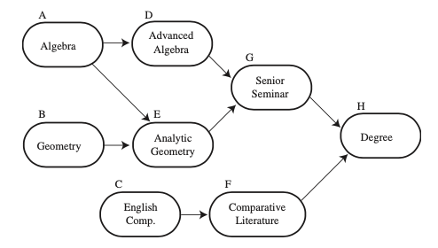
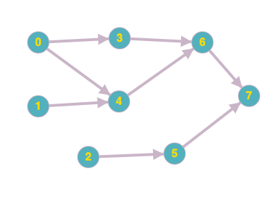

### Table of Contents

1. [Motivation](#motivation)

2. [Logic](#logic)

3. [Depth First Orders](#depth-first-orders)

4. [Code](#code)

5. [Explanation](#explanation)

5. [Conclusion](#conclusion)

6. [Digraphs, Cycles and Topological Sort](#digraphs-cycles-and-topological-sort)

In this post, I'll assume you have sufficient directed graph knowledge. If not, feel free to browse through my post on [directed graphs](/directed-graphs).

### Motivation

The word topology literally means **the way in which constituent parts are interrelated or arranged**. Therefore, topological sort deals with the idea of sorting elements based on their arrangement or specified order. For example, we can use topological sort to come up with a curriculum for a typical CS student based on the classes required for graduation and their pre-requisites. The idea is that you can't enroll for advanced algorithms without completing introduction to computer science class. 

### Logic

Let's say you're a math major and have this arrangement of required classes for your degree:

[Image Credit - La Fore Data Structures](https://www.pearson.com/us/higher-education/program/Lafore-Data-Structures-and-Algorithms-in-Java-2nd-Edition/PGM32075.html)

The directed graph above shows that before you enroll for Senior Seminar, you need to have passed Advanced Algebra and before you can enroll for Advanced Algebra, you need to have successfully passed Algebra. Therefore, one possible path to getting a degree is:

```css
CABFDEGH
```

Notice how we take the introductory courses first and then proceed to more advanced courses. There is no course taken out of order. Also, the arrangement of courses for a given degree plan might not be a unique solution. For example, instead of completing `CAB` first in that order, one might choose to complete the requirements in this order: 

```css
ABCFDEGH
```

Creating this course plan from possible courses' directed graph requires the use of topological sort. So think about the problem: we start our academic careers by signing up for classes that have no pre-reqs. In our graph, these classes are labelled A,B and C. Next, we're eligible to sign up for classes that come immediately AFTER those intro classes: D,E or F and the process continues until we graduate! 

So the idea is to start with the vertex that has no arrows going into it: no incoming edges. That would mean, these vertices are our starting point and then we'd have to somehow iterate over all the connected edges from these starting vertices. This iteration can be done using either [depth first search](/directed-graphs#depth-first-search) or you can also use breadth first search.

Before we start operating on our digraph, let's convert it to its integer representation and have a look at its adjacency list as well:

In the image below, all we've done is replace vertices labelled A-H to 0-7:


The corresponding adjacency list would be:

```
0 -> 3 -> 4
1 -> 4
2 -> 5
3 -> 6
4 -> 6
5 -> 7
6 -> 7
7
```

Ok,so if we run [digraph dfs](/directed-graphs#depth-first-search) on this graph, we'd get this output:

```
0 3 6 7 4 1 2 5 
```

Although this actually follows the correct sequence of courses, it doesn't end at `7` and also it's a coincidence that we start at 0 and it happens to be the vertex that is without any pre-reqs, otherwise it would've failed at that part too. So, it is clear that a simple DFS won't do. 

Also, topoligcal sort won't be possible for a graph that has a cycle. That is because if I need to complete $X$ before $Y$ and $Y$ before $Z$ and $Z$ before $X$, then theer's a problem in the logic!

Therefore, our topological sort algorithm should be able to do this: **Given a digraph, put the vertices in an order such that all directed edges point from a vertex earlier in the sequence to a vertex later in the sequence. Otherwise return that such an arrangement is not possible.**

### Depth First Orders

It turns out, topological sort is quite easy to implement using DFS. As we've already seen, [DFS](directed-graphs#depth-first-search) visits each vertex exactly once. For our reference, here is recursive DFS again:

```cpp{numberLines: true}
void Digraph::RecursiveDFS(int v){
    visited[v] = true;
    cout << v << " ";
    for (int i = 0; i < adjList[v].size(); i++){
        int curr = adjList[v][i];
        if (!visited[curr]){
            edgeTo[curr] = v;
            RecursiveDFS(curr);
        }
    }
}
```

If we save the current vertex we're on in an appropriate data structure ([queue](/queue) or [stack](/stack)), and iterate over these populated data structures, we'd be able to get our vertices in a certain order based on the data structure used and the point in the `RecursiveDFS()` function where we push the vertex on the said data structure. Having said that, there are 3 vertex orderings that can be generated: 

- PreOrder
- PostOrder
- Reverse PostOrder

We've already seen PreOrder and PostOrder in the [binary search trees](/binary-search-trees#traversal) post. Here's what this traversal order means for digraphs:

- PreOrder: Put the vertex on queue **before** recursive call: **This is recording of vertices in order based on DFS calls made**
- PostOrder: Put the vertex on queue **after** recursive call: **This is the recording of vertices in order based on which vertices are completed first**
- ReversePostOrder: Put the vertex on stack **after** recursive call: **This generates a topological sort for us from the digraph**

### Code

The code is exactly the same as what we've seen so far for directed graphs. The only difference is in the `RecursiveDFS()` function and we've also created a helper function to print the depth first search in the order we discussed in the previous section. Here are the functions we updated:

```cpp{numberLines: true}
//Private instance variables for data structures:
    queue<int> pre;
    queue<int> post;
    stack<int> reversePost; 

void Digraph::PrintOrder(){
    cout << "Pre: " << endl;
    while (!pre.empty()){
        cout << pre.front() << " ";
        pre.pop();
    }
    cout << endl;
    cout << "Post: " << endl;
    while (!post.empty()){
        cout << post.front() << " ";
        post.pop();
    }
    cout << endl;
    cout << "Reverse Post: " << endl;
    while (!reversePost.empty()){
        cout << reversePost.top() << " ";
        reversePost.pop();
    }
    cout << endl;
}

void Digraph::RecursiveDFS(){
    for (int i = 0; i < visited.size(); i++){
        if (!visited[i]){
            RecursiveDFS(i);
        }
    }
}

void Digraph::RecursiveDFS(int v){
    visited[v] = true;
//    cout << v << " ";
    pre.push(v);
    for (int i = 0; i < adjList[v].size(); i++){
        int curr = adjList[v][i];
        if (!visited[curr]){
            edgeTo[curr] = v;
            RecursiveDFS(curr);
        }
    }
    post.push(v);
    reversePost.push(v);
}
```

As usual, we've got 2 `RecursiveDFS()` functions: the one on line 27 is called by the client and it iterates over the visited array. This function then, for each unvisited vertex, calls the `RecursiveDFS(int v)` function which then populates our `pre`, `post` and `reversePost` data structures. 

```cpp{numberLines: 27}
void Digraph::RecursiveDFS(){
    for (int i = 0; i < visited.size(); i++){
        if (!visited[i]){
            RecursiveDFS(i);
        }
    }
}

void Digraph::RecursiveDFS(int v){
    visited[v] = true;
//    cout << v << " ";
    pre.push(v);
    for (int i = 0; i < adjList[v].size(); i++){
        int curr = adjList[v][i];
        if (!visited[curr]){
            edgeTo[curr] = v;
            RecursiveDFS(curr);
        }
    }
    post.push(v);
    reversePost.push(v);
}
```
`pre` is populated as soon as we visit the vertex as denoted on line 38 by pushing the vertex to the queue.
`post` is populated after we're done processing a vertex and visiting all its neighbors as denoted on line 46 by pushing the vertex to the queue.
`reversePost` is populated after we're done processing a vertex and visiting all its neighbors as denoted on line 47 by pushing the vertex to the stack.

### Explanation

 Let's look at how having `reversePost` in that position and using a stack allows us to get a topologically sorted order of vertices:
 
 From the explanations earlier, it is clear that we want to start our academic career by taking a class that has no pre-requisites. Let's examine the vertices of our graph:
 
 


which is represented by this adjacency list:

```
0 -> 3 -> 4
1 -> 4
2 -> 5
3 -> 6
4 -> 6
5 -> 7
6 -> 7
7
```

It is clear that we want to end at 7 (where 7 = degree attained). We can start with either 2,1 or 0 and then move on from there. Let's say we start our DFS function at vertex 0. DFS will continue searching away from 0 until it runs into a dead-end. That dead-end occurs for us at vertex 7. At this point we push 7 to our stack. We then unwind the recursive call and go to 6 which had called 7. 6 is only connected to 7 so 6's execution ends and we push 6 onto the stack. We keep doing this until we've run out of elements to push. So, this is what we see when we print `reversePost`:

```
2 5 1 0 4 3 6 7
```

The key insight here is this: the last thing to go onto the `reversePost` stack is the vertex that has no dependencies. So, when we start popping items off this stack, it'll be from the vertex that has no dependencies and continues until the last vertex.

Let's step through the 2 functions and look at how `reversePost` is populated:

```cpp{numberLines: 27}
void Digraph::RecursiveDFS(){
    for (int i = 0; i < visited.size(); i++){
        if (!visited[i]){
            RecursiveDFS(i);
        }
    }
}

void Digraph::RecursiveDFS(int v){
    visited[v] = true;
    pre.push(v);
    for (int i = 0; i < adjList[v].size(); i++){
        int curr = adjList[v][i];
        if (!visited[curr]){
            edgeTo[curr] = v;
            RecursiveDFS(curr);
        }
    }
    post.push(v);
    reversePost.push(v);
}
```

Ok, so the client calls `RecursiveDFS()` on line 27 which starts our loop by checking `visited`. Initially this is what our `visited` array, call stack and `reversePost` stack look like:

```

visited
0   F
1   F
2   F
3   F
4   F
5   F
6   F       ___________     ________________
7   F       reversePost     call stack for v
```

We start with 0, and call `RecursiveDFS(0)`. In this function we set `visited[0]` to true and pick up `0`'s adjacency list:

```

visited
0   T
1   F
2   F
3   F
4   F
5   F                              0
6   F       ___________     ________________
7   F       reversePost     call stack for v
```

In `0`'s adjacency list, we find `3` which is also unvisited, so we halt `0`'s execution and call `RecursiveDFS(3)`. Here, we set `visited[3]` as true and look at 3's adjacency list:

```

visited
0   T
1   F
2   F
3   T
4   F                              3
5   F                              0
6   F       ___________     ________________
7   F       reversePost     call stack for v
```

In 3's adjacency list, we find `6` which is unvisited as well so we call `RecursiveDFS(6)`. Here, we set `visited[6]` as true and look at 6's adjacency list:

```

visited
0   T
1   F
2   F
3   T                              6
4   F                              3
5   F                              0
6   T       ___________     ________________
7   F       reversePost     call stack for v
```

In 6's adjacency list, we find `7` which is unvisited as well so we call `RecursiveDFS(7)`. Here, we set `visited[7]` as true and look at 7's adjacency list:

```

visited
0   T
1   F
2   F                              7
3   T                              6
4   F                              3
5   F                              0
6   T       ___________     ________________
7   T       reversePost     call stack for v
```

7's adjacency list is empty, so there's nothing to visit. We're currently at 7 so we fall through the for loop on line 38 and push `v` to `reversePost`:

```

visited
0   T
1   F
2   F                              7
3   T                              6
4   F                              3
5   F           7                  0
6   T       ___________     ________________
7   T       reversePost     call stack for v
```

We're done with 7, so we pop 7 off the call stack for v and continue with 6:


```

visited
0   T
1   F
2   F                              
3   T                              6
4   F                              3
5   F           7                  0
6   T       ___________     ________________
7   T       reversePost     call stack for v
```

We continue to inspect 6's adjacency list which doesn't have any other vertices other than 7. So, again, we fall through the for loop on line 38 for vertex 6 and push the current `v` to `reversePost`:

```

visited
0   T
1   F
2   F                              
3   T                              
4   F           6                  3
5   F           7                  0
6   T       ___________     ________________
7   T       reversePost     call stack for v
```

Next, we find 3 on the call stack and we go to 3's adjacency list that, again, has nothing but 6 so we fall though the for loop for vertex 3 and push current `v` to `reversePost`:

```

visited
0   T
1   F
2   F                              
3   T           3                   
4   F           6                  
5   F           7                  0
6   T       ___________     ________________
7   T       reversePost     call stack for v
```

We're now back to 0. 0's adjacency list has more vertices so we pick up the next available vertex which is 4. We call `RecursiveDFS(4)` and set `visited[4]` to true. Our new `v` is now 4:

```

visited
0   T
1   F
2   F                              
3   T           3                   
4   T           6                  4
5   F           7                  0
6   T       ___________     ________________
7   T       reversePost     call stack for v
```

4's adjacency list has 6 which is already visited so we're done with 4. We fall through the for loop on line 38 and push 4 to the `reversePost` stack:

```

visited
0   T
1   F
2   F           4                   
3   T           3                   
4   T           6                  
5   F           7                  0
6   T       ___________     ________________
7   T       reversePost     call stack for v
```

We're now back to 0 that doesn't have any more unvisited neighbors. So, we fall through to line 38 for 0 and push 0 onto `reversePost` stack:

```

visited
0   T
1   F           0
2   F           4                   
3   T           3                   
4   T           6                  
5   F           7                  
6   T       ___________     ________________
7   T       reversePost     call stack for v
```

We send control back up to the original `RecursiveDFS()` function on line 27. Here, we continue looking for unvisited vertices and find that 1 is unvisited. We, therefore make this call: `RecursiveDFS(1)`. For this call, we mark `visited[1]` as true, and check out 1's adjacency list:

```

visited
0   T
1   T           0
2   F           4                   
3   T           3                   
4   T           6                  
5   F           7                  1
6   T       ___________     ________________
7   T       reversePost     call stack for v
```

We find that 4 is already visited so we fall through to line 47 and push the current v onto the `reversePost` stack after which we're done with this v which is popped of call stack for v:

```

visited
0   T           1
1   T           0
2   F           4                   
3   T           3                   
4   T           6                  
5   F           7                  
6   T       ___________     ________________
7   T       reversePost     call stack for v
```

We send control back up to the original `RecursiveDFS()` function on line 27. Here, we continue looking for unvisited vertices and find that 2 is unvisited. We, therefore make this call: `RecursiveDFS(2)`. For this call, we mark `visited[2]` as true, and check out 2's adjacency list:

```

visited
0   T           1
1   T           0
2   T           4                   
3   T           3                   
4   T           6                  
5   F           7                  2
6   T       ___________     ________________
7   T       reversePost     call stack for v
```

We look in 2's adjacency list and find 5. 5 is unvisited so we make another recursive call with 5 and halt 2's execution. For 5, we mark it as true:

```

visited
0   T           1
1   T           0
2   T           4                   
3   T           3                   
4   T           6                  5
5   T           7                  2
6   T       ___________     ________________
7   T       reversePost     call stack for v
```

and then we check out 5's adjacency list which only has 7 which has already been visited. So, for 5, we fall down to line 47, push 5 onto `reversePost` and pop 5 off call stack for v:


```

visited         
                5
0   T           1
1   T           0
2   T           4                   
3   T           3                   
4   T           6                  
5   T           7                  2
6   T       ___________     ________________
7   T       reversePost     call stack for v
```

We then continue with 2 where we left off and find that 2 has no more neighbors. We fall to line 47 for 2, push to `reversePost` and pop 2 off stack:

```

visited         
                2
                5
0   T           1
1   T           0
2   T           4                   
3   T           3                   
4   T           6                  
5   T           7                  
6   T       ___________     ________________
7   T       reversePost     call stack for v
```

We send control back up to the original `RecursiveDFS()` function on line 27. Here, we continue looking for unvisited vertices and find that all vertices have been visited now. We're done with creating our `reversePost` stack. 

### Conclusion

Notice how the last element we pushed on stack were in reverse order based on their dependencies. For example if 5 is dependent on 2, we pushed 5 first and then we pushed 2. Now when we print `reversePost` by popping off each element, we get this order:

```
2 5 1 0 4 3 6 7 
```

This order clearly complies with all the dependencies before we get to graduation!!!

### Digraphs, Cycles and Topological Sort

Now that we've looked at [digraphs](/directed-graphs), [cycles](/cycle-detection) and [topological sort](/topological-sort#logic), we've completed all the important parts of a job-scheduling application:

- You specify the tasks and the relevant constraints for those tasks (which task needs to be performed first, second, and so on): this is the digraph
- You make sure that there are no cycles
- You then generate an order in which the tasks can be completed based on the constraints specified using the digraph: this is where topological sort comes in.