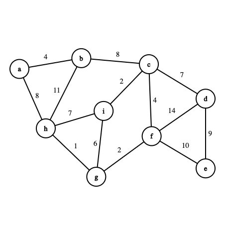

### Table of Contents

1. [Motivation](#motivation)

2. [Prim's Algorithm](#prims-algorithm)

2. [Kruskal's Algorithm](#kruskals-algorithm)

In this post, I'll assume you have sufficient [weighted undirected graph](/weighted-undirected-graphs) and [union find](/union-find) knowledge. If not, feel free to browse through the relevant posts.

### Motivation

Before we begin talking about minimal spanning trees,we need to understand the role of edge-weighted graphs. In these graphs, each edge has a weight associated with it. For example, if the vertices are cities then edges could be the ticket price for a flight between the two cities. We'd obviously be interested in finding the cheapest flight that go through multiple cities. 

To find such a flight we'd have to make use of minimal spanning tree. We'd be able to answer the question: given an undirected edge weighted graph, find a minimum spanning tree for that graph

A **spanning tree** of a graph is a connected subgraph with no cycles that connects all the vertices: **there's a path from every vertex to every other vertex in the graph**. Finding a minimum spanning tree for an edge weighted graph would mean finding a spanning tree where the sum of this tree's edges is as small as possible (when you consider all possible paths through the graph). 

Therefore, the requirements are:
- The tree needs to be connected
- The tree needs to be acyclic (when adding a node to the tree, it shouldn't create a cycle)
- The tree needs to have the minimum weight

An observation: once you have a minimum spanning tree, this condition would hold true:
$$$
Edges = Vertices - 1
$$$

Remember, the aim is to find a path through the graph that connects each edge to every other edge BUT making sure the path we found has the least total weight.

### Prim's Algorithm

Here are the steps behind Prim's algorithm:
1. Start with an arbitrary edge and add it to the empty tree
2. Look for the edge with the least weight and add it to the tree IF that edge doesn't create a cycle
3. Repeat step 2 until there are no more edges left to visit

Let's look at the graph we'd be operating on:

 [Image Credit - MST Graph](https://csacademy.com/app/graph_editor/)

Let's walk through and see how the above graph can be processed by Prim's. Before we do that, here's the adjacency list for the undirected weighted graph:

```css
```

### Kruskal's Algorithm

Here are the steps behind Kruskal's algorithm: 
1. Pick the edge with the least weight (need to keep our edges in sorted order)
2. Add this picked edge to the MST IF it doesn't create a cycle
3. Go back to step 1 until there are no more edges left

There are a few questions that we need to answer before we can begin implementing Kruskal's algorithm:

1. Pick the edge with the least weight (need to keep our edges in sorted order): **How do we sort the edges efficiently?**

To keep our edges in sorted order, we'll create a priority queue

2. Add this picked edge to the MST IF it doesn't create a cycle: **How do we make sure a cycle is not created?**

