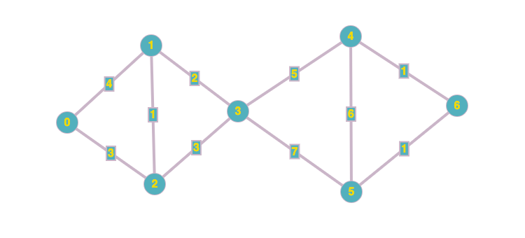
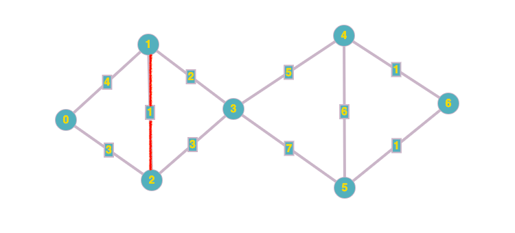
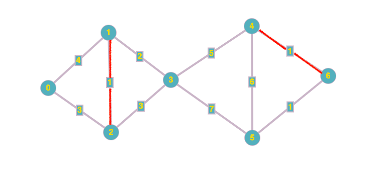
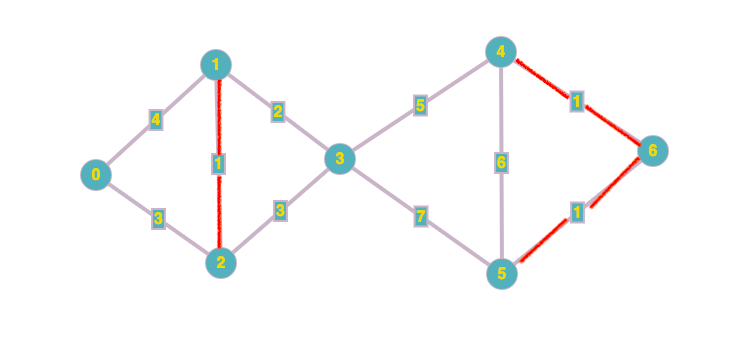
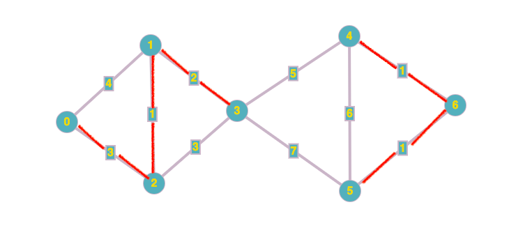
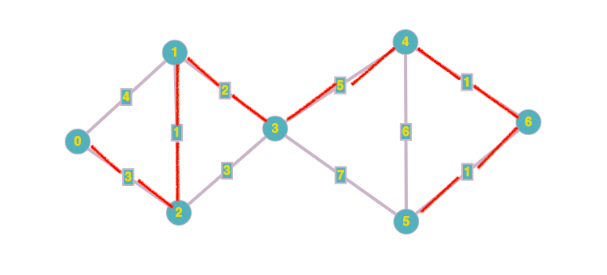

### Table of Contents

1. [Motivation](#motivation)

2. [Kruskal's Algorithm](#kruskals-algorithm)

3. [Code for Kruskal's](#code-for-kruskals)

4. [Analysis](#analysis)

In this post, I'll assume you have sufficient [weighted undirected graph](/weighted-undirected-graphs) and [union find](/union-find) knowledge. If not, feel free to browse through the relevant posts.

### Motivation

Before we begin talking about minimal spanning trees,we need to understand the role of edge-weighted graphs. In these graphs, each edge has a weight associated with it. For example, if the vertices are cities then edges could be the ticket price for a flight between the two cities. We'd obviously be interested in finding the cheapest flight that go through multiple cities. 

To find such a flight we'd have to make use of minimal spanning tree. We'd be able to answer the question: given an undirected edge weighted graph, find a minimum spanning tree for that graph

A **spanning tree** of a graph is a connected subgraph with no cycles that connects all the vertices: **there's a path from every vertex to every other vertex in the graph**. Finding a minimum spanning tree for an edge weighted graph would mean finding a spanning tree where the sum of this tree's edges is as small as possible (when you consider all possible paths through the graph). 

Therefore, the requirements are:
- The tree needs to be connected
- The tree needs to be acyclic (when adding a node to the tree, it shouldn't create a cycle)
- The tree needs to have the minimum weight

An observation: once you have a minimum spanning tree, this condition would hold true:
$$$
Edges = Vertices - 1
$$$

Remember, the aim is to find a path through the graph that connects each edge to every other edge BUT making sure the path we found has the least total weight.

### Kruskal's Algorithm

Here are the steps behind Kruskal's algorithm: 
1. Pick the edge with the least weight (need to keep our edges in sorted order)
2. Add this picked edge to the MST IF it doesn't create a cycle
3. Go back to step 1 until there are no more edges left

There are a few questions that we need to answer before we can begin implementing Kruskal's algorithm:

1. Pick the edge with the least weight (need to keep our edges in sorted order): **How do we sort the edges efficiently?**

To keep our edges in sorted order, we'll create a min heap

2. Add this picked edge to the MST IF it doesn't create a cycle: **How do we make sure a cycle is not created?**

Let's look at a graph and walk through how Kruskal's would find its MST:



For this tree, these are the steps Kruskal's will perform:

First, we need to sort the edges from least weight to the one with the most weight. 

Then we start with lowest weight edge: 3 options, either 1-2, 4-6 or 5-1. Let's pick 1-2:

```cpp
1-2
```

After 1-2 is picked, we check to see if they are part of the same component. If they are, we ignore this edge since it'd cause a cycle otherwise we perform the weighted quick union operation on the two to represent that vertices 1 and 2 belong to the same component:

```cpp
1-2 and Union(1,2);
```


Next, we pick the next smallest edge which is 4-6. Check if 4-6 are part of the same component which they aren't so we can add the connection between 4-6:

```cpp
1-2
4-6 and Union(4,6)
```



Next, we pick the next smallest edge which is 5-6. Check if 5-6 are part of the same component which they aren't so we can add the connection between 5-6:

```cpp
1-2
4-6
5-6 and Union(5,6)
```



We keep adding edges 1-3 and 0-2:
```cpp
1-2
4-6
5-6
1-3
0-2
```
 
 
 
 
 Next we get to 2-3. We find that 2-3 are already in the same component:


that's because edges 1-2 and 1-3 already exist and we're trying to add the 2-3 edge which would create the 1-2-3 cycle so we ignore 2-3. 0-1 would also create a cycle which is also ignored. We then finally add the last edge, 3-4 and complete the MST:




### Code for Kruskal's

```cpp{numberLines: true}
class MST{
private:
    //From weighted undirected graph
    vector<vector<pair<int,int>>> graph;
    vector<tuple<int,int,int>> minHeap;
    queue<tuple<int,int,int>> actualMST;
    
    //From UnionFind implementation
    vector<int> connectionsArray;
    vector<int> children;
    int numberOfSites;
    
    //From heaps implementation
    void trickleUp(tuple<int,int,int>);
    void trickleDown(tuple<int,int,int>);
    
    
public:
    //From weighted undirected graph
    int GetNumberOfVertices();
    void Insert(int,int, int);
    
    //From UnionFind Implementation
    void Union(int,int);
    int FindRoot(int);
    void Unionize(int,int);
    
    //From heaps implementation
    void HeapInsert(tuple<int,int,int>);
    tuple<int,int,int> HeapGetMin();
    
    //MST
    MST(int v);
    void createMST();
};

tuple<int,int,int> MST::HeapGetMin(){
    tuple<int,int,int> minElement = minHeap[0];
    int replacement = int(minHeap.size() - 1);
    minHeap[0] = minHeap[replacement];
    minHeap.erase(minHeap.end() - 1);
    if (int(minHeap.size()) != 1)
        trickleDown(minHeap[0]);
    return minElement;
}

void MST::createMST(){
    int count = 0;
    int weight = 0;
    while (count != (numberOfSites - 1)){
        tuple<int,int,int> minElement = HeapGetMin();
        int child = get<0>(minElement);
        int parent = get<1>(minElement);
        if (FindRoot(child) != FindRoot(parent)){
            weight += get<2>(minElement);
            cout << child << " - " << parent << " " << endl;
            Union(child, parent);
            count++;
        } else {
            cout << child << " - " << parent << " would cause a cycle" << endl;
        }
    }
    cout << "And min weight is: " << weight << endl;
    cout << endl;
}

void MST::trickleUp(tuple<int,int,int> item){
    //Trickle up will always start at
    //the last index and will work its
    //way up the array
    int curr = int(minHeap.size() - 1);
    while (curr != 0){
        //Get parent index
        int parent = ((curr - 1) / 2);
        if (get<2>(minHeap[curr]) < get<2>(minHeap[parent]) ){
            //Newly added node's weight < parent's weight
            //Move up the newly added node and re-check
            tuple<int,int,int> temp = minHeap[parent];
            minHeap[parent] = minHeap[curr];
            minHeap[curr] = temp;
            curr = parent;
        } else {
            //Parent was not > child,
            //we're done
            break;
        }
    }
}

void MST::trickleDown(tuple<int,int,int> item){
    //Trickle down will always begin from root,
    //so we'll always assume that the index is 0
    //for the item to be trickled down.
    int currIndex = 0;
    int arraySize = int(minHeap.size()) - 1;
    while (true){
        int leftChildIndex = (currIndex * 2) + 1;
        int rightChildIndex = (currIndex * 2) + 2;
        if (leftChildIndex <= arraySize && rightChildIndex <= arraySize){
            //We have both, a left and a right child
            if (get<2>(minHeap[leftChildIndex]) < get<2>(minHeap[currIndex]) && get<2>(minHeap[leftChildIndex]) < get<2>(minHeap[rightChildIndex])){
                //Left child is less than curr AND is also less than right child
                //Swap curr with left child
                tuple<int,int,int> temp = minHeap[leftChildIndex];
                minHeap[leftChildIndex] = minHeap[currIndex];
                minHeap[currIndex] = temp;
                currIndex = leftChildIndex;
            } else if (get<2>(minHeap[rightChildIndex]) < get<2>(minHeap[currIndex]) && get<2>(minHeap[rightChildIndex]) < get<2>(minHeap[leftChildIndex])){
                //Right child is less than curr AND is also less than left child
                //Swap curr with right child
                tuple<int,int,int> temp = minHeap[rightChildIndex];
                minHeap[rightChildIndex] = minHeap[currIndex];
                minHeap[currIndex] = temp;
                currIndex = rightChildIndex;
            } else {
                //Left and right child have the same weight, just pick one at random
                tuple<int,int,int> temp = minHeap[rightChildIndex];
                minHeap[rightChildIndex] = minHeap[currIndex];
                minHeap[currIndex] = temp;
                currIndex = rightChildIndex;
            }
        } else if (leftChildIndex <= arraySize && get<2>(minHeap[leftChildIndex]) < get<2>(minHeap[currIndex])){
            //Only left child exists and this left child
            //is less than the element we're swapping
            tuple<int,int,int> temp = minHeap[leftChildIndex];
            minHeap[leftChildIndex] = minHeap[currIndex];
            minHeap[currIndex] = temp;
            currIndex = leftChildIndex;
        } else if (rightChildIndex <= arraySize && get<2>(minHeap[rightChildIndex]) < get<2>(minHeap[currIndex])){
            //Only right child exists and this right child
            //is less than the element we're swapping
            tuple<int,int,int> temp = minHeap[rightChildIndex];
            minHeap[rightChildIndex] = minHeap[currIndex];
            minHeap[currIndex] = temp;
            currIndex = rightChildIndex;
        } else {
            return;
        }
        
    }
    
}

MST::MST(int v) : numberOfSites(v){
    for (int i = 0; i < numberOfSites; i++)
        connectionsArray.push_back(i);
    children.resize(numberOfSites);
    graph.resize(numberOfSites);
}

void MST::Insert(int from, int to, int weight){
    //Add edges to graph representation
    pair<int,int> edge1(from, weight);
    pair<int,int> edge2(to,weight);
    graph[from].push_back(edge2);
    graph[to].push_back(edge1);
    //Add edges to our min heap
    tuple<int,int,int> newItemForHeap(from,to,weight);
    HeapInsert(newItemForHeap);
}

void MST::Unionize(int parent, int child){
    connectionsArray[child] = parent;
    children[parent] += children[child] + 1;
}

int MST::FindRoot(int r){
    while(true){
        if (connectionsArray[r] == r)
            break;
        r = connectionsArray[r];
    }
    
    return r;
}

void MST::Union(int child, int parent){
    int childRoot = FindRoot(child);
    int parentRoot = FindRoot(parent);
    if (children[childRoot] == children[parentRoot] || children[childRoot] < children[parentRoot]){
        //Same number of children in both roots, make childRoot the child of parentRoot
        Unionize(parentRoot, childRoot);
    } else {
        Unionize(childRoot, parentRoot);
    }
}

void MST::HeapInsert(tuple<int, int, int>curr){
    //Adding to end of vector
    minHeap.push_back(curr);
    trickleUp(curr);
}
```

We've seen all most of these functions before in the [union find](/union-find) post and [heap](/heap) post so I won't go into their details. Here're the functions we haven't seen or are a modified version of their former selves:

Let's start with the client:

```cpp
int main(int argc, const char * argv[]) {
    MST mst(7);
    mst.Insert(0, 1, 4);
    mst.Insert(0, 2, 3);
    mst.Insert(1, 2, 1);
    mst.Insert(1, 3, 2);
    mst.Insert(2, 3, 3);
    mst.Insert(3, 4, 5);
    mst.Insert(3, 5, 7);
    mst.Insert(4, 5, 6);
    mst.Insert(4, 6, 1);
    mst.Insert(5, 6, 1);
    mst.createMST();
    return 0;
}
```

The client does nothing but insert elements into our graph and calls the `createMST()` function.

Here's what the insert function is doing:
```cpp{numberLines: 151}
void MST::Insert(int from, int to, int weight){
    //Add edges to our min heap
    tuple<int,int,int> newItemForHeap(from,to,weight);
    HeapInsert(newItemForHeap);
}
``` 

The function takes in 3 integers: the from vertex, the to vertex and the weight. Next we create a the `newItemForHeap` tuple called `newItemForHeap`. Next, we call the `HeapInsert` function that creates our `minHeap`. The `minHeap` allows us to grab the smallest weight edge in $O(1)$ time.

Let's look at the `HeapInsert` function:

```cpp{numberLines:188}
void MST::HeapInsert(tuple<int, int, int>curr){
    //Adding to end of vector
    minHeap.push_back(curr);
    trickleUp(curr);
}
``` 

that which takes in the tuple we created from the insert call and creates the `minHeap` vector. Any adjustments required to maintain the heap property are done by the call to `trickleUp` function. 

This process of inserting into the heap continues until all the edges and their weights are added to the `minHeap`. Remember, `minHeap` is our heap that has the edge with the least weight at index 0 at all times (after removal and inserts).

Next, the client then calls the `createMST()` function. At this point, the only thing that is ready is our `minHeap` with our edges. Here's what `createMST()` looks like:

```cpp{numberLines:47}
void MST::createMST(){
    int count = 0;
    int weight = 0;
    while (count != (numberOfSites - 1)){
        tuple<int,int,int> minElement = HeapGetMin();
        int child = get<0>(minElement);
        int parent = get<1>(minElement);
        if (FindRoot(child) != FindRoot(parent)){
            weight += get<2>(minElement);
            cout << child << " - " << parent << " " << endl;
            Union(child, parent);
            count++;
        } else {
            cout << child << " - " << parent << " would cause a cycle" << endl;
        }
    }
    cout << "And min weight is: " << weight << endl;
    cout << endl;
}
```

This function declares the `count` variable that is used to stop our loop later. This `count` would let us know when the number of edges is one less than the number of vertices. We also initialize the `weight` variable that will keep track of the total weight of the MST so far:

```cpp
int count = 0;
int weight = 0;
while (count != (numberOfSites - 1)){
//.....
}
```

We then enter the while loop and extract the smallest element from our `minHeap` and get the two vertices:

```cpp
int count = 0;
int weight = 0;
while (count != (numberOfSites - 1)){
    tuple<int,int,int> minElement = HeapGetMin();
    int child = get<0>(minElement);
    int parent = get<1>(minElement);
}
```

If this is our first iteration, we would've grabbed this tuple: 
```cpp
<1,2,1>
```

meaning the edge from vertex 1 to vertex 2 with weight 1. Then we check to see if vertex 1 and 2 are already in the same set by calling `FindRoot` which is the same function we saw in the union find post:

```cpp
int count = 0;
int weight = 0;
while (count != (numberOfSites - 1)){
    tuple<int,int,int> minElement = HeapGetMin();
    int child = get<0>(minElement);
    int parent = get<1>(minElement);
    if (FindRoot(child) != FindRoot(parent)){
        //....
    }
}
```

If they're not in the same component, we go ahead and add them to the same component using the `Union` function which again is something we've already seen. We also go ahead and add the weight of this edge to the total `weight` variable. We also increment the count.

```cpp
int count = 0;
int weight = 0;
while (count != (numberOfSites - 1)){
    tuple<int,int,int> minElement = HeapGetMin();
    int child = get<0>(minElement);
    int parent = get<1>(minElement);
    if (FindRoot(child) != FindRoot(parent)){
        weight += get<2>(minElement);
        cout << child << " - " << parent << " " << endl;
        Union(child, parent);
        count++;
    }
}
```

We continue doing so until the condition in the `while` loop is not satisfied.

### Analysis

1. **Building the heap**
As we saw above, whenever the client calls insert, we take in that edge and build our `minHeap`. This building process is done $E$ times where $E$ is the number of edges. The process itself involves trickling up if the an edge is added that has the least weight of all the edges seen so far. Trickling up takes $O(logN)$ time or each $E$. So overall, building out our `minHeap` takes $O(E logN)$ time. 

The heap itself takes up $O(E)$ space since it needs to store the weight of each edge.

2. **Building Union Find**
Our union find is actually weighted quick union where building up the `connectionsArray` takes up $O(V)$ space: Since the array's length equals the number of vertices. The union operation takes $O(logV)$ where $V$ is the number of vertices. It takes the same time for `findRoot()` operation. 
