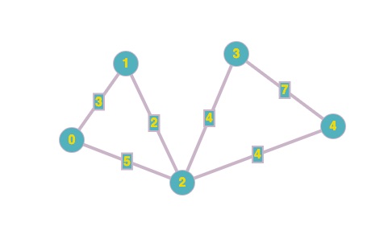

### Table of Contents

1. [Introduction](#introduction)

2. [Explanation](#explanation)

3. [Adjacency List](#adjacency-list)

4. [Conclusion](#conclusion)

### Introduction

In this post I'll talk about a type data structure called weighted undirected graph (particularly undirected graphs). We've already seen what an [undirected graph](/undirected-graphs) looks like. We'll be building on top of the ideas we discussed in that post. The only difference is, that here we'll be adding weights to each edge of the undirected graph. The weight between two edges could mean the cost of flight between two cities or the time it takes to drive from one city to the other. 

### Explanation

Here is what a weighted undirected graph looks like:



How would we go about representing a graph in our code?

### Adjacency List

In our adjacency list, not only do we need to keep track of what edge we're connected to but also the weight for that edge. So, the first entry in 2's adjacency list: (O,5) means that 2 is connected to 0 (and 0 is connected to 2) by an edge whose weight is 5:

```cpp
0 -> (1, 3) -> (2, 5)
1 -> (0, 3) -> (2, 2)
2 -> (0, 5) -> (1, 2) -> (3, 4) -> (4, 4)
3 -> (2, 4) -> (4, 7)
4 -> (2, 4) -> (3, 7)
```

### Adjacency List code

Let's see the code for constructing this weighted undirected graph:


```cpp{numberLines: true}
class WUG{
  
private:
    int numberOfVertices;
    vector<vector<pair<int,int>>> graph;
    
public:
    WUG(int v);
    int GetNumberOfVertices();
    void Insert(int,int, int);
    void Print();
};


/// Function to insert an edge to our adjacency list
/// @param from edge from
/// @param to edge to
/// @param weight the weight of the edge
void WUG::Insert(int from, int to, int weight){
    //Create two pairs, one for each vertex.
    pair<int,int> edge1(from, weight);
    pair<int,int> edge2(to, weight);
    //Push each pair to relevant index
    graph[from].push_back(edge2);
    graph[to].push_back(edge1);
}

void WUG::Print(){
    cout << endl;
    for (int i = 0; i < graph.size(); i++){
        cout << i;
        for (int j = 0; j < graph[i].size(); j++){
            cout << " -> ";
            cout << "(" << graph[i][j].first << ", ";
            cout << graph[i][j].second << ")";
        }
        cout << endl;
    }
    cout << endl;
}

/// Constructor to initialize our vector of vector of pairs
/// @param v the number of vertices
WUG::WUG(int v) : numberOfVertices(v){
    graph.resize(numberOfVertices);
}

int WUG::GetNumberOfVertices(){
    return numberOfVertices;
}
```

The implementation is simple: We're storing the edge information in a vector of vector of pairs:

```cpp
// outer vector
    |
    0 -> <pair 1> -> <pair 2>  // inner vector of pairs 
    1
    2
    3
    4
```

Each edge's information is stored in a pair where ```pair.first``` represents the edge and ```pair.second``` represents the weight of that edge. Pair is part of the ```<utlility>``` header.

Let's have a look at the function `Insert()`:

```cpp {numberLines: 15}
/// Function to insert an edge to our adjacency list
/// @param from edge from
/// @param to edge to
/// @param weight the weight of the edge
void WUG::Insert(int from, int to, int weight){
    //Create two pairs, one for each vertex.
    pair<int,int> edge1(from, weight);
    pair<int,int> edge2(to, weight);
    //Push each pair to relevant index
    graph[from].push_back(edge2);
    graph[to].push_back(edge1);
}
```

Say we're adding the edge from 0 to 1 with weight 3. We'll make this call: ```Insert(0, 1, 3)```. Inside the function we make two pairs. Two pairs because this is an undirected graph so an edge from 0 to 1 would also mean an edge from 1 to 0. (If it were a directed graph, we'd only create one edge and insert it.) The first edge we create is this:

```css
(0, 3)
```

that'll be inserted in 1's adjacency list. 

The second pair we create is:

```css
(1, 3)
```

that'll be inserted in 0's adjacency list. Once these two are inserted, here's what our graph adjacency list would look like:

```cpp
0 -> (1, 3) 
1 -> (0, 3) 
2
3
4
```

We continue to add edges from the client using this code (can be called from main):

```cpp
    WUG wug(5);
    wug.Insert(0, 1, 3);
    wug.Insert(0, 2, 5);
    wug.Insert(1, 2, 2);
    wug.Insert(2, 3, 4);
    wug.Insert(2, 4, 4);
    wug.Insert(3, 4, 7);
    wug.Print();
```

The output of the print function would be:

```cpp
0 -> (1, 3) -> (2, 5)
1 -> (0, 3) -> (2, 2)
2 -> (0, 5) -> (1, 2) -> (3, 4) -> (4, 4)
3 -> (2, 4) -> (4, 7)
4 -> (2, 4) -> (3, 7)
```

### Conclusion

It is easy to see what stl utility needs to be used to create a pair to signify a weighted undirected graph.