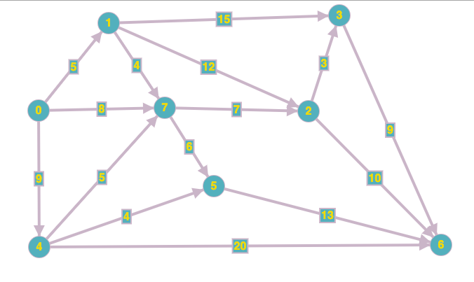
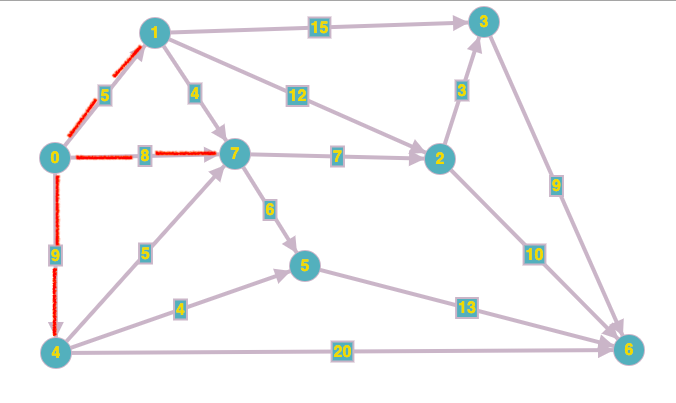
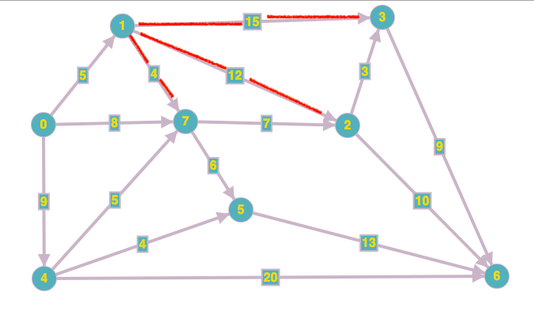

### Table of Contents

1. [Motivation](#motivation)

2. [Dijkstra's Algorithm](#dikjstras-algorithm--single-source)

In this post, I'll assume you have sufficient [digraph](/directed-graphs) knowledge

### Motivation

The motivation behind studying SPAs is to help us figure out, as the name suggests, the shortest paths between two vertices in a graph. SPAs can be used to answer questions such as:

- What is the shortest path from A to B? (Called **source sink**)
- What is the shortest path from A to every other vertex? (Called **single source**)
- What is the shortest path between all pairs? (Called **all pairs**)

To answer the questions above, need to be mindful of the edge weights:

- Are there negative weights allowed?
- Are cycles allowed?
- Are negative cycles allowed?

**Goal**: Once the above questions are answered, we need to be able to come up with a data structure that gives us the shortest paths from a source vertex `s` to every other vertex in the graph. 

### Dikjstra's Algorithm : Single Source 

Let's start with an algorithm that'll help us answer the question: **What is the shortest path from A to every other vertex?** This algorithm was introduced by Dijkstra:  

The algorithm makes use of two arrays: 

- an `edgeTo` array (which we've already seen being used with DFS and BFS) to find the paths from source to a vertex
- a `distanceTo` array which will hold the weight from one vertex to another

The information above is nothing new. What is new is how we'd change the entries in the two arrays. Let's walk through this graph and and see how we'd go about filling out the two arrays:

 [Image Credit - Directed Graph](https://graphonline.ru/en/)

Let's say we're asked for the shortest path from 0 to every other vertex. Initially our `edgeTo`, `distanceTo` and `visited` arrays look like this:

|  | distanceTo | edgeTo | visited |
| :--: | :--: | :--: | :--: |
| **0** | $\infty$ | 0 | F | 
| **1** | $\infty$ | 0 | F |
| **2** | $\infty$ | 0 | F |
| **3** | $\infty$ | 0 | F |
| **4** | $\infty$ | 0 | F |
| **5** | $\infty$ | 0 | F |
| **6** | $\infty$ | 0 | F |
| **7** | $\infty$ | 0 | F |

Initially, all distances are infinity, edge to is all 0s by default and visited is set to false. Alright, so we start at 0, so we set:
 
 - `distanceTo[0] = 0`
 - `edgeTo[0] = 0`
 - `visited[0] = true`
 
 and inspect each adjacent edge to 0:
 
  [Image Credit - Directed Graph](https://graphonline.ru/en/)


We go to vertex 1, so `distanceTo[1]` is set to 5 since that is the weight of the edge and and it is less than the weight currently shown in `distanceTo[1]`. `edgeTo[1]` is set to 0 since we came from 0.

We go to vertex 7, so `distanceTo[7]` is set to 8 since that is the weight of the edge and and it is less than the weight currently shown in `distanceTo[7]`. `edgeTo[7]` is set to 0 since we came from 0.

We go to vertex 4, so `distanceTo[4]` is set to 9 since that is the weight of the edge and and it is less than the weight currently shown in `distanceTo[4]`. `edgeTo[4]` is set to 0 since we came from 0.

In the above three statements we update the `distanceTo` array because the relevant distance to array shows a value which is higher than the current value we came in with. Since our aim is to find the shortest path, we update the distance and the edge that gave us this shortest distance seen so far:

|  | distanceTo | edgeTo | visited |
| :--: | :--: | :--: | :--: |
| **0** | 0 | 0 | T | 
| **1** | 5 | 0 | F |
| **2** | $\infty$ | 0 | F |
| **3** | $\infty$ | 0 | F |
| **4** | 9 | 0 | F |
| **5** | $\infty$ | 0 | F |
| **6** | $\infty$ | 0 | F |
| **7** | 8 | 0 | F |

Notice, `visited[1]`, `visited[7]` and `visited[4]` are still false. That is because we consider a vertex visited once we've processed its neighbors. 

Now, we search for the least weight edge in `distanceTo` which is not yet visited. This is `distanceTo[1]` so we'll next visit vertex 1. We can mark `visited[1]` as true:

|  | distanceTo | edgeTo | visited |
| :--: | :--: | :--: | :--: |
| **0** | 0 | 0 | T | 
| **1** | 5 | 0 | T |
| **2** | $\infty$ | 0 | F |
| **3** | $\infty$ | 0 | F |
| **4** | 9 | 0 | F |
| **5** | $\infty$ | 0 | F |
| **6** | $\infty$ | 0 | F |
| **7** | 8 | 0 | F |

Now we consider 1's neighbors:

 [Image Credit - Directed Graph](https://graphonline.ru/en/)

We go to vertex 3, so `distanceTo[3]` is set to 20 (5 from 0 to 1 and 15 from 1 to 3) since that is the weight of the edge and and it is less than the weight currently shown in `distanceTo[3]`. `edgeTo[1]` is set to 1 since we came from 1.

We go to vertex 2, so `distanceTo[2]` is set to 17 (5 from 0 to 1 and 12 from 1 to 2) since that is the weight of the edge and and it is less than the weight currently shown in `distanceTo[2]`. `edgeTo[7]` is set to 1 since we came from 1.

We go to vertex 7, so `distanceTo[7]` can be set to 9 (5 from 0 to 1 and 4 from 1 to 7) since that is the weight of the edge BUT it is NOT less than the weight currently shown in `distanceTo[7] = 8`. Therefore, we can leave `distanceTo[7]` and `edgeTo[7]` as is:

|  | distanceTo | edgeTo | visited |
| :--: | :--: | :--: | :--: |
| **0** | 0 | 0 | T | 
| **1** | 5 | 0 | T |
| **2** | 17 | 1 | F |
| **3** | 20 | 1 | F |
| **4** | 9 | 0 | F |
| **5** | $\infty$ | 0 | F |
| **6** | $\infty$ | 0 | F |
| **7** | 8 | 0 | F |


Now, we search for the least weight edge in `distanceTo` which is not yet visited. This is `distanceTo[7]` so we'll next visit vertex 7. We can mark `visited[7]` as true:

|  | distanceTo | edgeTo | visited |
| :--: | :--: | :--: | :--: |
| **0** | 0 | 0 | T | 
| **1** | 5 | 0 | T |
| **2** | 17 | 1 | F |
| **3** | 20 | 1 | F |
| **4** | 9 | 0 | F |
| **5** | $\infty$ | 0 | F |
| **6** | $\infty$ | 0 | F |
| **7** | 8 | 0 | T |

Now, we consider 7's neighbors:

We go to vertex 2, so `distanceTo[2]` is set to 15 (8 from 0 to 7 and 7 from 7 to 2) since that is the weight of the edge and and it is less than the weight currently shown in `distanceTo[2]`. `edgeTo[2]` is set to 7 since we came from 7.

We go to vertex 5, so `distanceTo[5]` is set to 14 (8 from 0 to 7 and 6 from 7 to 5) since that is the weight of the edge and and it is less than the weight currently shown in `distanceTo[5]`. `edgeTo[5]` is set to 7 since we came from 7.


|  | distanceTo | edgeTo | visited |
| :--: | :--: | :--: | :--: |
| **0** | 0 | 0 | T | 
| **1** | 5 | 0 | T |
| **2** | 15 | 7 | F |
| **3** | 20 | 1 | F |
| **4** | 9 | 0 | F |
| **5** | 14 | 7 | F |
| **6** | $\infty$ | 0 | F |
| **7** | 8 | 0 | T |

We're done with 7's neighbors. We need to again find the unvisited vertex with the least weight which is now 4. We continue updating our edgeTo and distanceTo arrays until we've visited every vertex. At the end this is what our arrays would look like:

|  | distanceTo | edgeTo | visited |
| :--: | :--: | :--: | :--: |
| **0** | 0 | 0 | T | 
| **1** | 5 | 0 | T |
| **2** | 15 | 7 | T |
| **3** | 18 | 2 | T |
| **4** | 9 | 0 | T |
| **5** | 13 | 4 | T |
| **6** | 25 | 2 | T |
| **7** | 8 | 0 | T |

Notice now we can answer questions such as what is the shortest path from 0 to any other vertex? The distanceTo array holds the least weight from 0 to any other vertex. The edgeTo array can be processed and each element put on a stack to determine the shortest path. 

Let's look at how we can get the shortest path from 0 to 6:

```cpp
Start at 6 push 6 to stack: 

6
_____
stack
```

Look at edgeTo[6] = 2. 

```cpp
Push 2 on the stack:

2
6
_____
stack
```

Look at edgeTo[2] = 7

```cpp
Push 7 on the stack:

7
2
6
_____
stack
```

Look at edgeTo[7] = 0

```cpp
Push 0 on the stack:

0
7
2
6
_____
stack
```

We're done since we've reached 0. Now popping off stack we get:

0 - 7 - 2 - 6 