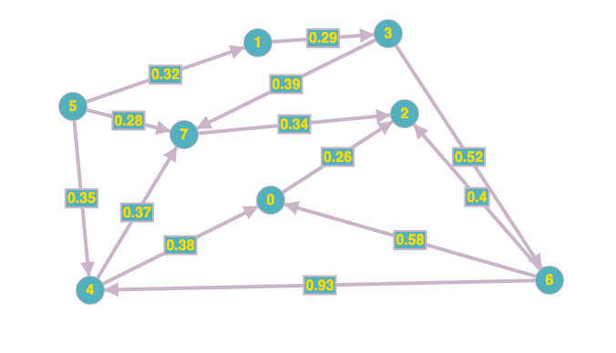

### Table of Contents

1. [Motivation](#motivation)

2. [Logic](#logic)

In this post, I'll assume you have sufficient [topological sort](/topological-sort) knowledge

### Motivation

Turns out, if our graph has no cycles, we can use topological sort to find single source shortest paths even when negative weights are present (Dijkstra's cannot handle negative weights).

### Logic

The idea behind this algorithm is simple:

- Initialize `dist[s]` to 0 and all other `dist[]` values to infinity
- Then instead of using weights of edges like we did in Dijkstra's, use topological sort generated sequence to relax the edges. 

Let's start with this graph that has no cycles:

 [Image Credit - Directed Graph](https://graphonline.ru/en/)

