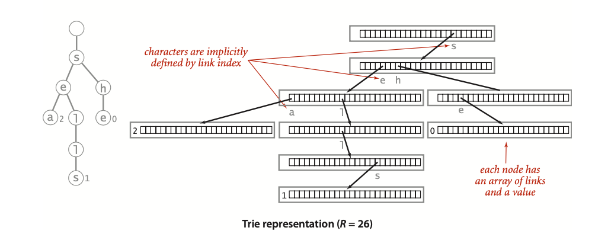
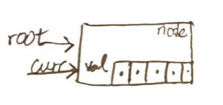
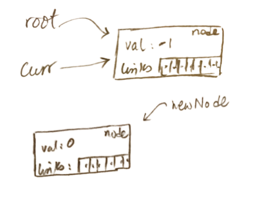
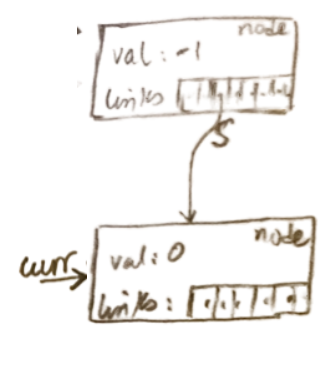
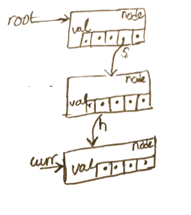
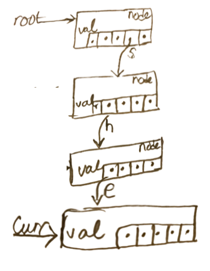
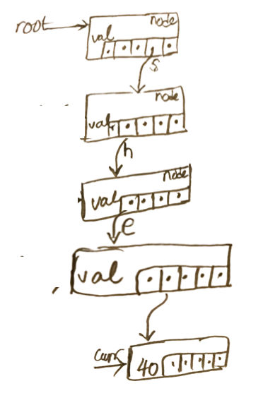

### Table of Contents

1. [Introduction](#introduction)

2. [Properties](#properties)

3. [Insertion](#insertion)

4. [Code](#code)

    * [Put](#put)

### Introduction
There are plenty of applications where we need to search through strings. An efficient data structure that allows us to do so is called a trie. With tries, we can search in time proportional to the length of the search key. On the other hand, if the string is not present in our trie, we need to only examine a few characters. 

The word trie comes from re**trie**val and is pronounced as try. A trie can be considered a search tree consisting of nodes and values. Let's have a deeper look at a trie.

### Properties 
- Similar to trees, a trie consists of nodes and links. The interesting part is what those links point to and what the nodes contain. Each node is an array of pointers to another node. The size of the array is equal to the number of possible alphabets in our string. So, if we are using our trie to hold all possible characters, we'd have 256 pointers in each node. 

- A node not only has an array of pointers but also a field called "value" that holds the value at that particular node. Here's what a node with an array of pointers and a value would look like:


 [Image Credit](https://algs4.cs.princeton.edu/home/)

- Each pointer in the pointers array can be looked at as a character in our alphabet. 

- A populated value field for a node would signify the value at that point starting from the root. 

Let's have a look at an example:

 [Image Credit](https://algs4.cs.princeton.edu/home/)

In the example above, our trie comprises of 3 strings: sea, sells, she. We start at the root (the empty node) and go down the tree until we reach a node that has an actual value. The values are stored only at the terminal nodes. For example, at the last `s` node, there'd be pointer to another node where all links would be null BUT the value would be 1. This would signify that the string `shells` has the value 1. 

Notice that all values in the array representation are null EXCEPT for the array entry that represents the character we've inserted. For example:

 - the first node has only `s` as not null which points to another node
 
 - the second node, pointer to by first node, has `e` and `h` as not null
  

### Insertion
Let's talk about how we'd insert values in a trie. For ease of use, we'd only show the links that are not null but remember each node has an array of pointers where most are null except for the ones we've inserted. 

Ok, so let's start with an empty tree that has a null root node:

```css
    root
```

Let's insert the key `she` with value 0:

```css

        root
         |
         s 
         |
         h   
         |
         e
         |
         0
```

Root points to a node where `pointerArr[s]` is not null. That node points to another node where `pointerArr[h]` is not null. This second node points to a third node where `pointerArr[e]` is not null. All three nodes have no value in their nodes. Finally, the node where `pointerArr[e]` is not null points to a node where all entries in `pointerArr[]` are null BUT the value field for this node is 0.

Let's insert the key `sells` with value 1. As of now, this is what our trie looks like:


```css

        root
         |
         s 
         |
         h   
         |
         e
         |
         0
```
We start with root and see there's already an `s`, we'll use that s:

```css

        root
         |
         s
       /     
      h   
      |
      e
      |
      0
```

This `s` node's array of pointers has h as not null and with the addition of `e` will also have the `e` pointer as not null:

```css

        root
         |
         s
       /    \ 
      h      e
      |
      e
      |
      0
```

We continue adding nodes in manner similar to how we did for `she`:

```css

        root
         |
         s
       /    \ 
      h      e
      |      |
      e      l
      |      |
      0      l
             |
             s
             |
             1
```

### Code

Let's have a look at how we'd go about coding a trie. Here's what the class looks like. We'll add more functions to it as we discuss the trie in more detail:

```cpp{numberLines: true}
class Trie{
private:
    //A node class
    class Node{
    public:
        int value;
        vector<Node*> links;
    };
    Node* root;
    int alphabetSize;
   
public:
    Trie(int);
    void Put(string,int);
};

Trie::Trie(int s) : alphabetSize(s){
    root = new Node;
    root->value = -1;
    root->links.resize(alphabetSize);
}

void Trie::Put(string key, int val){
    Node* curr = root;
    int index = 0;
    for (int i = 0; i < key.size(); i++){
        index = int(key[i]) - 97;
        if (curr->links[index] == nullptr){
            //We're adding this character for the first time
            Node* newNode = new Node;
            newNode->links.resize(alphabetSize);
            curr->links[index] = newNode;
            curr = newNode;
        } else {
            //Already added by previous addition,
            //follow the link
            curr = curr->links[index];
        }
    }
    curr->value = val;
}
```

We've got a private `Node` class within our `Trie` class. Inside the node class, each node has a `value` and an array of pointers where each pointer can point to a node. We call this array of pointers `links`:

```cpp{numberLines: 3}
    //A node class
    class Node{
    public:
        int value;
        vector<Node*> links;
    };
```

Next, we've got a private instance variables: 
- `root` that'll allow us to access the trie
- `alphabetSize` that'll be passed in by the user and then assigned to this variable

In the public section of the class, we've got:
 - constructor that initializes our `alphabetSize` variable, creates a `Node` and points the `root` to that node. We also need to make sure that we resize the vector of pointers:
 
 ```cpp
Trie::Trie(int s) : alphabetSize(s){
    root = new Node;
    root->value = -1;
    root->links.resize(alphabetSize);
} 
``` 

- `Put` function that takes in a key and a value and inserts it into our trie. Let's have a look at the insert function in more detail by inserting `she` with value 40:    

### Put

```cpp{numberLines: 23}
void Trie::Put(string key, int val){
    Node* curr = root;
    int index = 0;
    for (int i = 0; i < key.size(); i++){
        index = int(key[i]) - 97;
        if (curr->links[index] == nullptr){
            //We're adding this character for the first time
            Node* newNode = new Node;
            newNode->links.resize(alphabetSize);
            curr->links[index] = newNode;
            curr = newNode;
        } else {
            //Already added by previous addition,
            //follow the link
            curr = curr->links[index];
        }
    }
    curr->value = val;
}
```

The first thing we do online 24 is create a node pointer called `curr` that points to `root`:




Next, we start to iterate over the key (which is the string passed in). We then get the index of this new character by converting the char to an int and saving it to the index variable. We're assuming that the user will always enter a character between 'a' and 'z'. Next, on line 28 we check to see if the link at the newly calculated index is null. In our case, we're entering `s` for the first time. So index 18 (calculated for `s`) is empty. We go ahead and create a new node and resize its links vector:




Next, on line 32, we make the calculated index point to this new node which makes the calculated index no longer a `nullptr` and then move `curr` to this new node:



Next, we go back to the top of the loop, grab the index for `h` which comes out to 7. Our curr is currently pointing to an empty node that is being pointed to by link `s`. We create the new node, add the link from `s` to `h` and make curr point to this new node:



We then do the same for `e`:

 

and now we're out of characters to add to our trie. What we need to do now is set the value of the last node to whatever the user passed in:

 


If we go ahead and now insert `shells` with value 20, we'd go down the chain using this else block:

```cpp{numberLines: 34}
        } else {
            //Already added by previous addition,
            //follow the link
            curr = curr->links[index];
        }
```

until we get to the point when we need to add `l`. Here, we branch off and continue adding the two `l`s until we're out of characters. We then add the value passed in by the user.