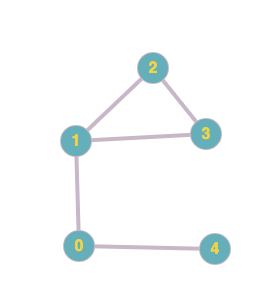
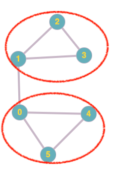
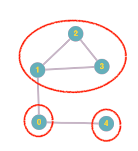
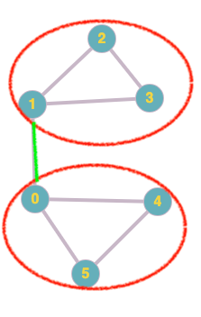
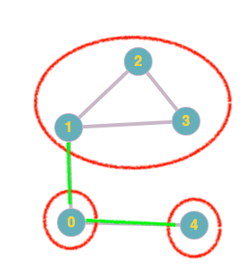
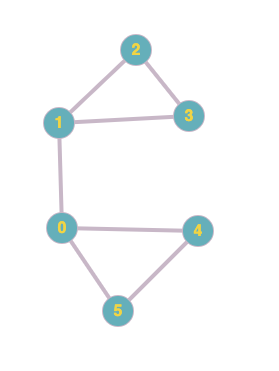
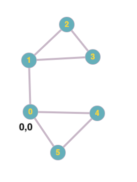
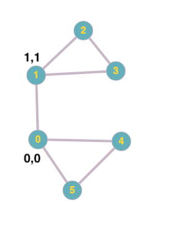
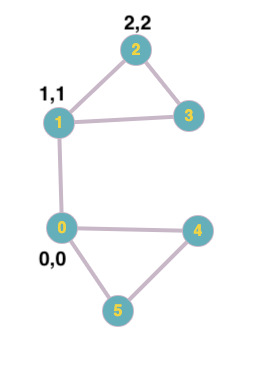
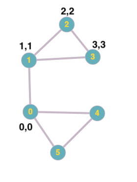

### MOOCs

- [Distributed Systems](http://composition.al/CSE138-2021-03/schedule.html) 

### TODO
- [Top problems](https://www.teamblind.com/post/New-Year-Gift---Curated-List-of-Top-75-LeetCode-Questions-to-Save-Your-Time-OaM1orEU):

#### Arrays

- [Two Sum](https://leetcode.com/problems/two-sum/)
- [Best Time to Buy and Sell Stock](https://leetcode.com/problems/best-time-to-buy-and-sell-stock/)
- [Contains Duplicate](https://leetcode.com/problems/contains-duplicate/)
- [Product of Array Except Self](https://leetcode.com/problems/product-of-array-except-self/)
- [Maximum Subarray](https://leetcode.com/problems/maximum-subarray/)
- [Maximum Product Subarray](https://leetcode.com/problems/maximum-product-subarray/)
- [Find Minimum in Rotated Sorted Array](https://leetcode.com/problems/find-minimum-in-rotated-sorted-array/)
- [Search in Rotated Sorted Array](https://leetcode.com/problems/search-in-rotated-sorted-array/)
- [3Sum](https://leetcode.com/problems/3sum/)
- [Container With Most Water](https://leetcode.com/problems/container-with-most-water/)
- [Maximum sum of non-overlapping subarrays](https://leetcode.com/problems/maximum-sum-of-3-non-overlapping-subarrays/)
- [Missing element in sorted array](https://leetcode.com/problems/missing-element-in-sorted-array/)

---

#### Bit Manipulation

- [Sum of Two Integers](https://leetcode.com/problems/sum-of-two-integers/)
- [Number of 1 Bits](https://leetcode.com/problems/number-of-1-bits/)
- [Counting Bits](https://leetcode.com/problems/counting-bits/)
- [Missing Number](https://leetcode.com/problems/missing-number/)
- [Reverse Bits](https://leetcode.com/problems/reverse-bits/)

---

#### Dynamic Programming

- [Frog Jump](https://leetcode.com/contest/leetcode-weekly-contest-5/problems/frog-jump/)
- [Minimum Cost for Tickets](https://leetcode.com/explore/challenge/card/august-leetcoding-challenge/552/week-4-august-22nd-august-28th/3436/)
- [Climbing Stairs](https://leetcode.com/problems/climbing-stairs/)
- [Coin Change](https://leetcode.com/problems/coin-change/)
- [Longest Increasing Subsequence](https://leetcode.com/problems/longest-increasing-subsequence/)
- Longest Common Subsequence
- [Word Break Problem](https://leetcode.com/problems/word-break/)
- [Combination Sum](https://leetcode.com/problems/combination-sum-iv/)
- [House Robber](https://leetcode.com/problems/house-robber/)
- [House Robber II](https://leetcode.com/problems/house-robber-ii/)
- [Decode Ways](https://leetcode.com/problems/decode-ways/)
- [Unique Paths](https://leetcode.com/problems/unique-paths/)
- [Jump Game](https://leetcode.com/problems/jump-game/)
- Scrambled String
- [Rusian Doll Envelopes](https://leetcode.com/problems/russian-doll-envelopes/)

---

#### Graph

- [Clone Graph](https://leetcode.com/problems/clone-graph/)
- [Course Schedule](https://leetcode.com/problems/course-schedule/)
- [Pacific Atlantic Water Flow](https://leetcode.com/problems/pacific-atlantic-water-flow/)
- [Number of Islands](https://leetcode.com/problems/number-of-islands/)
- [Longest Consecutive Sequence](https://leetcode.com/problems/longest-consecutive-sequence/)
- [Alien Dictionary](https://leetcode.com/problems/alien-dictionary/)
- [Graph Valid Tree](https://leetcode.com/problems/graph-valid-tree/)
- [Number of Connected Components in an Undirected Graph](https://leetcode.com/problems/number-of-connected-components-in-an-undirected-graph/)
- [Closest Leaf node](https://leetcode.com/problems/closest-leaf-in-a-binary-tree/)

---

#### Interval

- Render a calendar - 13.6
- [Insert Interval](https://leetcode.com/problems/insert-interval/)
- [Merge Intervals](https://leetcode.com/problems/merge-intervals/)
- [Non-overlapping Intervals](https://leetcode.com/problems/non-overlapping-intervals/)
- [Meeting Rooms](https://leetcode.com/problems/meeting-rooms/)
- [Meeting Rooms II](https://leetcode.com/problems/meeting-rooms-ii/)
- [Interval list intersection](https://leetcode.com/problems/interval-list-intersections/)

---

#### Linked List

- [Reverse a Linked List](https://leetcode.com/problems/reverse-linked-list/)
- [Detect Cycle in a Linked List](https://leetcode.com/problems/linked-list-cycle/)
- [Merge Two Sorted Lists](https://leetcode.com/problems/merge-two-sorted-lists/)
- [Merge K Sorted Lists](https://leetcode.com/problems/merge-k-sorted-lists/)
- [Remove Nth Node From End Of List](https://leetcode.com/problems/remove-nth-node-from-end-of-list/)
- [Reorder List](https://leetcode.com/problems/reorder-list/)

---

#### Matrix

- [Set Matrix Zeroes](https://leetcode.com/problems/set-matrix-zeroes/)
- [Spiral Matrix](https://leetcode.com/problems/spiral-matrix/)
- [Rotate Image](https://leetcode.com/problems/rotate-image/)
- [Word Search](https://leetcode.com/problems/word-search/)

---

#### String

- [Longest Substring Without Repeating Characters](https://leetcode.com/problems/longest-substring-without-repeating-characters/)
- [Longest Repeating Character Replacement](https://leetcode.com/problems/longest-repeating-character-replacement/)
- [Minimum Window Substring](https://leetcode.com/problems/minimum-window-substring/)
- [Valid Anagram](https://leetcode.com/problems/valid-anagram/)
- [Group Anagrams](https://leetcode.com/problems/group-anagrams/)
- [Valid Parentheses](https://leetcode.com/problems/valid-parentheses/)
- [Valid Palindrome](https://leetcode.com/problems/valid-palindrome/)
- [Longest Palindromic Substring](https://leetcode.com/problems/longest-palindromic-substring/)
- [Palindromic Substrings](https://leetcode.com/problems/palindromic-substrings/)
- [Encode and Decode Strings](https://leetcode.com/problems/encode-and-decode-strings/)

---

#### Tree

- Construct BST from pre-order data
- Construct a BT from in-order and pre-order traversals
- [Maximum Depth of Binary Tree](https://leetcode.com/problems/maximum-depth-of-binary-tree/)
- [Same Tree](https://leetcode.com/problems/same-tree/)
- [Invert/Flip Binary Tree](https://leetcode.com/problems/invert-binary-tree/)
- [Binary Tree Maximum Path Sum](https://leetcode.com/problems/binary-tree-maximum-path-sum/)
- [Binary Tree Level Order Traversal](https://leetcode.com/problems/binary-tree-level-order-traversal/)
- [Serialize and Deserialize Binary Tree](https://leetcode.com/problems/serialize-and-deserialize-binary-tree/)
- [Subtree of Another Tree](https://leetcode.com/problems/subtree-of-another-tree/)
- [Construct Binary Tree from Preorder and Inorder Traversal](https://leetcode.com/problems/construct-binary-tree-from-preorder-and-inorder-traversal/)
- [Validate Binary Search Tree](https://leetcode.com/problems/validate-binary-search-tree/)
- [Kth Smallest Element in a BST](https://leetcode.com/problems/kth-smallest-element-in-a-bst/)
- [Lowest Common Ancestor of BST](https://leetcode.com/problems/lowest-common-ancestor-of-a-binary-search-tree/)
- [Implement Trie (Prefix Tree)](https://leetcode.com/problems/implement-trie-prefix-tree/)
- [Add and Search Word](https://leetcode.com/problems/add-and-search-word-data-structure-design/)
- [Word Search II](https://leetcode.com/problems/word-search-ii/)
- [Convert BST to sorted doubly linked list](https://leetcode.com/problems/convert-binary-search-tree-to-sorted-doubly-linked-list/)
- [BST Iterator](https://leetcode.com/problems/binary-search-tree-iterator/)
- [Binary Tree level order traversal II](https://leetcode.com/problems/binary-tree-level-order-traversal-ii/)
- [Binary Tree right side view](https://leetcode.com/problems/binary-tree-right-side-view/)

----

#### Heap

- [Merge K Sorted Lists](https://leetcode.com/problems/merge-k-sorted-lists/)
- [Top K Frequent Elements](https://leetcode.com/problems/top-k-frequent-elements/)
- [Find Median from Data Stream](https://leetcode.com/problems/find-median-from-data-stream/)

---

#### Greedy algorithms
- [Task Scheduler](https://leetcode.com/problems/task-scheduler/)

---
- 11.10
- LCA
- LCA with parent pointers
- Previous chapter (stack and queue) problems related to binary tree
- Interval problems
- [Preorder, inorder, postorder without recursion (clean solution)](https://stackoverflow.com/a/31643444/11556612)
- [Num of islands**](https://leetcode.com/problems/number-of-islands/)
- [Accounts merge**](https://leetcode.com/problems/accounts-merge/)
- [Max are of island](https://leetcode.com/problems/max-area-of-island/)
- [battleships on a board](https://leetcode.com/problems/battleships-in-a-board/)

### Some fun problems:

 * [Largest square with all Ones](#largest-square-with-all-ones)
 * [Num of pairs divisible by k](#num-of-pairs-divisible-by-k)
 * [Connected components in graph](#connected-components-in-graph)
 * [Critical connections in a graph](#critical-connections-in-a-graph)
 * [Min difficulty](#min-difficulty)
 
 
### Largest Square with all Ones 
**Given an m x n binary matrix filled with 0's and 1's, find the largest square containing only 1's and return its area.**

Let's see how we can tackle this problem. Say this is what our square looks like:

```cpp
    {'1','0','1','0','0'},
    {'1','0','1','1','1'},
    {'1','1','1','1','1'},
    {'1','0','0','1','0'}
```

The largest square is 4. There are 2 such squares. This seems like a problem that builds upon itself. For example, if I start at index 0,0, the largest square I've seen ending at index 0,0 is 1 (because 0,0 equals 1). Next, if I keep going across row 0, the largest values are the values of the original matrix themselves (other unvisited indices are initialized to 0):

|  | 0 | 1 | 2 | 3 | 4 |
| -- | -- | -- | -- | -- | -- |
| **0** | 1 | 0 | 1 | 0 | 0 | 
| **1** | 1 | 0 | 0 | 0 | 0 | 
| **2** | 1 | 0 | 0 | 0 | 0 | 
| **3** | 1 | 0 | 0 | 0 | 0 | 

So far so good. Now, let's start at index 1,1. What's the largest square so far? It's still 1. That's because the value at 0,1 is 0 AND value at 1,1 is also 0. Now, if values at 0,1 would've been 1 AND at 1,1 would've been 1, the largest square would've been 2! Therefore, seems like for index (i,j) we need to find the minimum of 3 indices: (i-1,j), (i,j-1) and (i-1,j-1) and add the minimum to the value at index (i,j). This'll get us the largest square at index (i,j)! Converted to code, this is what we'll get:

```cpp
int maximalSquare(vector<vector<char>>& matrix) {
    
    vector<vector<int>> dp(matrix.size(), vector<int>(matrix[0].size(), 0));
    for (int i = 0; i < matrix[0].size(); i++){
        dp[0][i] = matrix[0][i] - '0';
    }
    
    for (int i = 0; i < matrix.size(); i++){
        dp[i][0] = matrix[i][0] - '0';
    }
    
    int maxSoFar = numeric_limits<int>::min();
    for (int i = 1; i < matrix.size(); i++){
        for (int j = 1; j < matrix[i].size(); j++){
            dp[i][j] = matrix[i][j] - '0' + min(matrix[i-1][j] - '0', min(matrix[i][j-1] - '0', matrix[i-1][j-1] - '0'));
            if (dp[i][j] > maxSoFar)
                maxSoFar = dp[i][j];
        }
    }
    return maxSoFar*maxSoFar;
}
``` 

 
### Num of pairs divisible by k 
**Given an array, return the number of pairs that are divisible by k**

Example:

```cpp
[30,20,150,100,40] k = 60
return 3:
30 + 150,
20 + 100,
20 + 40
``` 

The brute force solution is simple to see: create an outer loop to start at 0 and an inner loop to start at 1. Next add element pointed to by the outer loop to the element pointer to by the inner loop. Check to see if the sum % k == 0. If so increment counter, otherwise, move on. This takes $O(N^2)$ time.

A better approach: Let's store the modulo of elements with k. For example, if we're looking to add up to 60, and my current element is 100, I'll add to my hash table the following entry:

```cpp
ht[40] = 1
```

I'll keep incrementing this if I find any more modulo that result in 40. Let's see what my hash table will look like if I have the following input:

 ```cpp
k = 60
[ 30, 20, 150, 100, 40]

ht [ 30 % 60 = 30 ]   = 1
ht [ 20 % 60 = 20 ]   = 1

ht [ 150 % 60 =  30], increment earlier count:
ht [ 30 & 150 % 60 = 30 ]   = 2
ht [ 20 % 60 = 20 ]   = 1  
ht [ 100 % 60 = 40] = 1

ht [ 140 % 60 = 20], increment earlier count:
ht [ 30 & 150 % 60 = 30 ]   = 2
ht [ 20 & 140 % 60 = 20 ]   = 2
ht [ 100 % 60 = 40] = 1
```

Ok, now our hash table has the information above. Now, all we need to do is go through the list and see if we can find the complement of the mod of value we're looking for. For example, if we're at 20, we know we'll need 40 more to add up to 60. So, the question we'll ask is, is there another element that can give us the 40 to add up to 60? Yes! We have 1 other element. A special case: what if we have 60 and 30? Well, in that case, we'll have to see how many 30s and 60s we have. If the number > 1, then we can add to 60. Here's this logic converted to code:

```cpp
int numPairsDivisibleByK(vector<int>& time, int k) {
    unordered_map<int,int> hash;
    int ans = 0;
    for(int  i : time){
        i %= k;
        cout << "Incrementing: " << i << endl;
        hash[i]++;
        if(i == 0 || i == k/2){
            cout << hash[i] << endl;
            ans += hash[i]-1;
        }
        else if(hash.count(60-i)){
            cout << "Found: " << hash[k-i] << " for: " << i << endl;
            ans += hash[k-i];
        }

    }
    return ans;
}
```

### Connected components in graph

**There are n cities. Some of them are connected, while some are not. If city a is connected directly with city b, and city b is connected directly with city c, then city a is connected indirectly with city c.
A province is a group of directly or indirectly connected cities and no other cities outside of the group.**

The only difference here is that we're using an adjacency matrix. This is our vanilla DFS connected components question:

```cpp{numberLines: true}

void DFS (vector<vector<int>>& mat, vector<bool>& visited, int v){
    visited[v] = true;
    for (int i = 0; i < mat[v].size(); i++){
        if (i != v && mat[v][i] == 1){
            int currVertex = i;
            if (!visited[currVertex]){
                DFS(mat, visited, currVertex);
            }
        }
    }
}

int findCircleNum(vector<vector<int>>& isConnected) {
    vector<bool> visited (isConnected.size(), false);
    int provinces = 0;
    for (int i = 0; i < visited.size(); i++){
        if (!visited[i]){
            provinces++;
            DFS(isConnected, visited, i);
        }
    }
    
    return provinces;
}
```

One thing to note here is that on line 5, we're going to set current vertex as `i` and NOT value of `mat[v][i]` because this is not an adj list but an adj matrix. Running time is the same as always for DFS: $O(V+E)$.

  


### Critical connections in a graph
**There are n servers numbered from 0 to n-1 connected by undirected server-to-server connections forming a network where connections[i] = [a, b] represents a connection between servers a and b. Any server can reach any other server directly or indirectly through the network.**

Example:

 [Image Credit - Graph](https://graphonline.ru/en/)

In the graph above, critical connections are edges 0-1 and 0-4. That is because if either one of those edges are disconnected, all nodes will not be reachable from every node. 

#### Brute Force
A brute force solution that comes to mind is to iterate over your connections array and assume, one by one, that the current connection is not present. For example, if for the graph above we have this adjacency matrix given:

```cpp
[
    [0,1],
    [1,2],
    [2,3],
    [3,1],
    [4,0]
]
```

what we can do is assume that connection 0,1 does not exist and then check and see if ALL nodes are reachable (ie connected components). Keep doing this for the next pair and so on. Now to check connected components, we use DFS as I've explained [here](/undirected-graphs-depth-first-search#connected-components). Running time for DFS connected components is $O(V+E)$. Now if you're running DFS for each edge, you get running time of $O(E^2 + EV)$. This is quite horrible! There should be a better way to do this. Enter, Tarjan's algorithm.

#### Tarjan's Algorithm

Before we dive into the algorithm, let's understand what a strongly connected component is: a strongly connected component is a part of the graph (or the entire graph) where if you pick a pair of nodes, you can reach from node a to node b and from node b to node a. Components that comprise our SCC within a graph are **self-contained** meaning they're all connected to each other. The definition implies that Tarjan's can also be used for directed graphs. 

Here's an example with 2 SCCs:

 [Image Credit - Graph](https://graphonline.ru/en/)

and an example with 3 SCCs:

 [Image Credit - Graph](https://graphonline.ru/en/)

Remember, we're trying to get the critical connections ie a connection which, if broken, will prevent us from getting from one node to every other node. Looking at the SCCs above, what do you notice about them based on the problem we're trying to solve? It should be obvious that the critical connections are the ones that connect one SCC to another. For example, in the two graphs below, I've highlighted the critical connections in green:


Graph A             |  Graph B
:-------------------------:|:-------------------------:
 [Image Credit - Graph](https://graphonline.ru/en/)  |  [Image Credit - Graph](https://graphonline.ru/en/)


Therefore, any connection between 2 SCCs is a critical connection. How do we go about finding each such connection? At a high level, we need to first find all SCCs and then the edges that connect 2 SCCs. This is where Trajan's algorithm will help! It'll first determine which vertices belong to a SCC and then at the same time determine which edge will be a critical connection using DFS. Formally, the two steps are: 
(1) Determine SCC for each vertex using DFS
(2) While running DFS, determine which edge is critical.

In order to determine which vertices belong to a SCC, we'll have to keep track of 2 things: the id of each vertex and the lowest value id a particular vertex is connected to as we run DFS. In the graphs below, I'll denote id and lowest value as a pair: id,low. Let's step through an example to determine each of the two for our graph:

 [Image Credit - Graph](https://graphonline.ru/en/)

Let's say this is our adjacency list for the graph above:

```cpp
0 - 1 - 4 - 5
1 - 0 - 2 - 3
2 - 1 - 3
3 - 1 - 2
4 - 0 - 5
5 - 0 - 4
```

Let's run DFS starting with vertex 0. As a refresher, here's what DFS looks like:

```cpp
void AdjList::RecursiveDFS(){
    for (int i = 0; i < visited.size(); i++){
        if (!visited[i]){
            RecursiveDFS(i);
        }
    }
}

void AdjList::RecursiveDFS(int v){
    visited[v] = true;
    cout << v << " ";
    for (int i = 0; i < adjList[v].size(); i++){
        int curr = adjList[v][i];
        if (!visited[curr]){
            RecursiveDFS(curr);
        }
    }
}
```

Now remember, we're trying to assign IDs to our vertices. So, we'll pass a reference to an ID to each recursive call. Initially, low value will be equal to the id. That's because when we visit a vertex for the first time, the lowest value vertex it is connected to is itself.

```cpp
visited = [f,f,f,f,f,f]
curr = 0
id = 0
low = 0 
```

We visit 0, mark it as true and assign node 0 an id of 0 and low of 0:
```cpp
visited = [T,f,f,f,f,f]
curr = 0
id = 0
low = 0 
```

 [Image Credit - Graph](https://graphonline.ru/en/)

Next, we increment our id and visit the next unvisited neighbor in adj list for 0 which is 1:
```cpp
visited = [T,T,f,f,f,f]
curr = 1
id = 1
low = 1 
```

 [Image Credit - Graph](https://graphonline.ru/en/)


Next, we increment our id and visit the next unvisited neighbor in adj list for 1 which is 2:
```cpp
visited = [T,T,T,f,f,f]
curr = 2
id = 2
low = 2 
```

 [Image Credit - Graph](https://graphonline.ru/en/)

Next, we increment our id and visit the next unvisited neighbor in adj list for 2 which is 3:
```cpp
visited = [T,T,T,T,f,f]
curr = 3
id = 3
low = 3 
```

 [Image Credit - Graph](https://graphonline.ru/en/)

Now, 3 has no neighbors that are currently unvisited. Therefore, it's now time for us to return from the recursive call for 3. BUT, before we do so, we need to update the lowest id vertex 3 is connected to. To do so, we simply look at the adjacency list for 3 and find the lowest value vertex which is 1. At this point, we update 3's low as 1 and return back to our caller with the lowest value we just set:

```cpp
visited = [T,T,T,T,f,f]
curr: 3
low: 1
```

**TO BE COMPLETED: https://www.youtube.com/watch?v=wUgWX0nc4NY**

### Min Difficulty
**You want to schedule a list of jobs in d days. Jobs are dependent (i.e To work on the i-th job, you have to finish all the jobs j where 0 <= j < i). You have to finish at least one task every day. The difficulty of a job schedule is the sum of difficulties of each day of the d days. The difficulty of a day is the maximum difficulty of a job done in that day.**

Worded differently, this problem asks you to cut the array into `d` pieces such that the sum of max of each piece is as small as possible. Example:

```cpp
Input: jobDifficulty = [6,5,4,3,2,1], d = 2
Output: 7

This cut returns the minimum sum:

[6 5 4 3 2] [1] 6 + 1 = 7

Other cuts would be larger:
[6 5 3 3] [2 1] 6 + 2 = 8 
```

Brute force approach would be to try a cut at every position and getting the min of all max sums. Since this implies finding all combinations, we can use DP! 

We can have a DP table with rows = `d + 1` and columns = `number of jobs`:

|  | 0 | 1 | 2 | 3 | 4 |
| -- | -- | -- | -- | -- | -- |
| **0** | 0 | 0 | 0 | 0 | 0 | 
| **1** | 0 | 0 | 0 | 0 | 0 | 
| **2** | 0 | 0 | 0 | 0 | 0 | 

