1. [Intro](#introduction)
2. [Scalability](#scalability)
3. [Reliability](#reliability)
4. [Load Balancers](#load-balancers)
    * [Load Balancers Deep Dive](#load-balancers-deep-dive)
    * [Balancing algorithms](#balancing-algorithms)
5. [Replication](#replication)
    * [Replication Deep Dive](#replication-deep-dive)
    * [Single Leader replication](#single-leader-replication)
        * [Single Leader: Synch vs Asynch replication](#single-leader-synch-vs-asynch-replication)
        * [Single Leader: Eventual Consistency](#single-leader-eventual-consistency)
    * [Multileader replication](#multi-leader-replication)
        * [MultiLeader: Pros](#multi-leader-pros)
        * [MultiLeader: Cons](#multi-leader-cons)
    * [Leaderless replication](#leaderless-replication)
6. [Caching](#caching)
    * [Cache Types](#cache-types)
7. [CDN](#content-delivery-network-cdn)
8. [Web Tier and Statelessness](#web-tier-and-statelessness)
9. [Data Centers](#data-centers)
    * [Data Centers: Geo-Routing](#data-centers-geo-routing)

100. [Useful architectures](#userful-architectures)

### Introduction
If you were to setup your website today, from scratch, how would you go about doing it? You'd probably have a single server to serve your website. You'll have something like this:

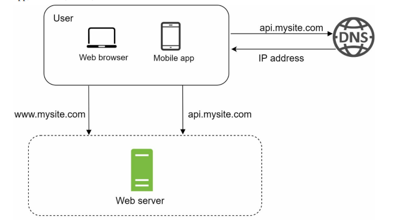 [Image Credit](https://www.amazon.com/System-Design-Interview-insiders-Second/dp/B08CMF2CQF)

A user would hit your website by either going to his/her browser or the mobile app, and enter the URL to your website. Next, this request will be routed to a domain name server that translates the address to an IP address and returns back to you. Next, you visit that IP address and the server returns the HTML page stored at the server.  

Now, say as your website grows, you want to show a personalized page for each visitor. To store each visitor's information, you need a data-store: ie database. This is what our flow would look like with a database:

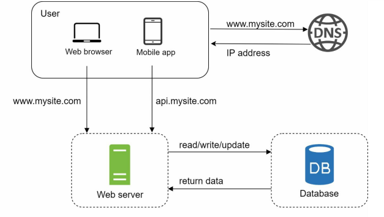 [Image Credit](https://www.amazon.com/System-Design-Interview-insiders-Second/dp/B08CMF2CQF)

Now, your website server would hit the database, get the user information/preferences and return the page rendered with that information.

A few questions you should ask:

**(1) What type of database should I use?**

Relation databases (MySQL, Oracle, PostgreSQL) are preferred where the data has relationships: ie a user has an address, etc. Non-relational databases can be used if:
 - your data is unstructured,
 - you only need to serialize/deserialize data
 - you need low latency 

**(2) What if there are a lot of users connecting to your site at the same time?**
By asking this question, you're looking to make your website **scalable** and **reliable**:

### Scalability

A scalable system is one that is **able to deal with its growth**. Growth can be defined as increased volume of data or increased traffic volume. Scalability is used to describe how the system copes with increased load. 

It doesn't make sense to just say system X is scalable. What does that mean? Scalability needs to be considered by asking questions like **if the system's load increases how are we going to handle that growth?** For example, a system could suddenly go from 100 to million users or a client uploads TBs of data through our system: is our system able to handle these sudden spikes? 

### Reliability

A reliable system is one that **continues to work correctly(ie correct function and performance levels) in the face of adversity(hardware or software failures).**

Reliable systems are fault tolerant: this fault can be a human error (incorrect input) or hardware/software errors. Even under faulty circumstances, our system continues to be reliable. Reliable systems are **resilient** and **fault tolerant**.

There are several types of faults:
- Hardware faults: Hard disk crash, RAM becomes faulty, electric outage etc. To prevent hardware faults, we add redundancy to our applications: setup disks in RAID (redundant array of independent disks) configuration, have dual power supplies, backup power for data centers etc.  

- Software faults: Leap year errors, bad input errors etc. Happen in unusual set of circumstances. 

- Human errors
 
In the example where you have a single server, your server might grind to a halt if a number of users hit your website at the same time. You have 2 options:
- Scale vertically: Add more compute power to a single machine
- Scale horizontally: Add more servers to your backend

### Load Balancers
Now, if you suddenly start receiving a lot of traffic and have a collection of servers in your backend, how do you direct traffic to each of the servers? You want to utilize the servers to a point where the work-load is evenly distributed among all available servers. Enter **load balancers**:

 [Image Credit](https://www.amazon.com/System-Design-Interview-insiders-Second/dp/B08CMF2CQF)

A user connects to the **public IP** of your load balancer (public IP means one that is available over the internet) and we move the web servers to private IP addresses (NOT reachable over the internet). Now, all traffic is directed to the load-balancer. The load balancer will be aware of the status of each of the web servers and if either goes down, traffic can be routed to the correct server. With the addition of a load balancer, we've solved the problem of servers going down.

### Load Balancers Deep Dive
Now, you might be wondering, what are the different ways I can choose to route which traffic goes to which server? Well, in an OSI model, there are 7 layers: the most abstract layer is the application layer (ie application logic) and the most concrete layer is the physical layer:

Load balancing can be done at:

- **Layer 4 (L4)**: 
Here, load balancers work at the transport level. That means they can make routing decisions based on the TCP or UDP ports that packets use along with their source and destination IP addresses. L4 load balancers perform Network Address Translation but do not inspect the actual contents of each packet.

- **Layer 7 (L7)**: 
Here, load balancers act at the application level, the highest in the OSI model. They can evaluate a wider range of data than L4 counterparts, including HTTP headers and SSL session IDs, when deciding how to distribute requests across the server farm.

### Balancing algorithms
There are a few algorithms that can be used by a balancer to determine which server gets the request from a pool of possible servers. Here're a few common algorithms:

- **Round Robin**

Round robin is a simple technique for making sure that a virtual server forwards each client request to a different server based on a rotating list. It is easy for load balancers to implement, but does don’t take into account the load already on a server. There is a danger that a server may receive a lot of processor-intensive requests and become overloaded.

- **Least Response Time Method**

The least response time method relies on the time taken by a server to respond to a health monitoring request. The speed of the response is an indicator of how loaded the server is and the overall expected user experience. Some load balancers will take into account the number of active connections on each server as well.

- **Hashing Methods**

Methods in this category make decisions based on a hash of various data from the incoming packet. This includes connection or header information, such as source/destination IP address, port number, URL or domain name, from the incoming packet.

**What if our database goes down or is hit with a time consuming request?**

To handle this case, we need to perform database replication:

### Replication
In replication, the idea is to **replicate** the same information across multiple databases. To replicate this information, we'll designate one server that holds our database as the **leader** and remaining servers as **followers**. The leader will:

- Handle all CUD (Create, update and delete) operations
- Forward any new data to the followers so that the followers have up to date information

The followers will:
- Handle all read operations

A setup with multiple DBs (along with leader/follower) setup might look like this: 

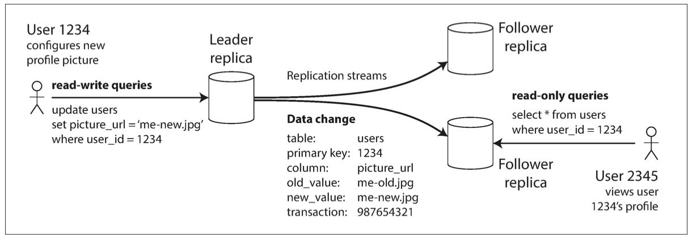 [Image Credit](https://www.amazon.com/Designing-Data-Intensive-Applications-Reliable-Maintainable/dp/1449373321)

Advantages of replicating our databases:
- Improved performance
- Reliability: If one node goes down, we have the data on several other nodes
- Availability: By having replicas close to your clients, you can render content fast

The entire system is shown below:

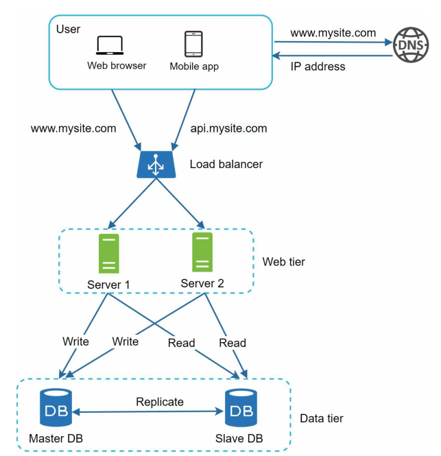 [Image Credit](https://www.amazon.com/System-Design-Interview-insiders-Second/dp/B08CMF2CQF)

Finally, the flow for this design shown would be:

- A user gets the IP address of the load balancer from DNS.
- A user connects the load balancer with this IP address.
- The HTTP request is routed to either Server 1 or Server 2.
- A web server reads user data from a follower database.
- A web server routes any data-modifying operations to the master database. This includes write, update, and delete operations.

### Replication Deep Dive
As we said earlier, replicating data allows us to create available, scalable systems. Replicating data that is not changing (static) is easy, real difficulty lies in replicating data that is changing often. There are 3 main ways to replicate data: **single leader replication** (one we discussed briefly above), **multi-leader replication** and **leaderless replication**. Let's have a look at all 3 in detail:

### Single Leader Replication
As we said in our intro, this type of replication deals with a single node acting as a leader. This node is responsible for receiving insert/update requests from the user and then propagating any changes made to the data to the followers. We have the remaining nodes acting as followers: followers are used for read operations only. Whenever the leader writes new data to its local storage, it also sends the data change to all of its followers.

The leader can transmit the changes to the followers via 2 methods: **synchronous replication** and **asynchronous replication**:

### Single Leader: Synch vs Asynch Replication
In **synchronous replication**, the leader waits to get an ok response from **all** followers before sending an ok response back to the client. The advantage here is that all the followers will ALWAYS have up to date information. Disadvantage is that if one follower is down, the entire system will grind to a halt. This defeats the purpose of having a highly available system! Therefore, it is impractical to have completely synchronous replication.

In **asynchronous replication**, the leader will only update its local storage with the updates and send the ok response back to the client, without waiting for ANY of the followers to send back the ok response. Advantage here is response times are low. Disadvantage here is that if the leader goes down, there could be information loss.

**Compromise** here is that replication is usually **semi-asynchronous** where the leader will wait for at-least one follower to respond with an ok before sending the confirmation back to the client. 

### Single Leader: Eventual consistency

In read heavy workloads, the attractive option is to create many followers and distribute read requests across the followers. This removes load from the leader and allows read requests to be served by nearby replicas. As the number of followers increase, the probability that one of the followers has stale data (assuming asynchronous replication) also increases. We call this phenomenon **eventual consistency**: the reality where all followers will eventually have up to date data. This eventual propagation of data to followers is called **replication lag**. 

This replication lag results in poor customer experience! Imagine you posted a comment on facebook and when you refreshed the page your comment disappeared! There are a few solutions to tackle this problem:

- **Read your own writes**

Always read the user's profile from the leader, and any other user's profiles from a follower. In our facebook example, we used user profile, in other systems this information could be something else (that a user updated). BUT, what if the user can edit a lot of items?!

- **Make all reads from leader**

Now what if the user can make edits to a bunch of items, all requests would end up with the leader which defeats the purpose of having a distributed system! In that case read your own writes won't work. Another possible solution is to keep track of the latest update and say for one minute after the last update, direct all read requests to the leader. BUT, what if the users of the system make a lot of edits?!

- **Read from same replica**

Another solution is to read from the same replica for the same user. That way the user is always guaranteed to see up to date, instant changes. 

### Multi-leader Replication
If you have a setup with multiple data-centers located in geographically separated locations, you'd have to use multi-leader replication. That is because each user would be connected to the data center closest to him/her and the leader from that data center would then asynchronously replicate that information to other leaders and data centers.   

### Multi-leader: Pros
As compared to single leader replication, there're advantages that a multi-leader setup enjoys:

- **Performance**

In single leader, every write must go to the single leader. No matter how far you're located from that leader, every write will go the leader via the internet. In multi-leader, every write can be processed at the local data center and then replicated to other data centers. This results in a better perceived performance.

- **Tolerance**

If single leader goes down, new writes/updates need to be halted and a new leader has to be elected before accepting new writes/updates. With multi-leader, if a leader goes down, other centers can continue to operate and the down leader can catch up once it is back.  

### Multi-Leader: Cons
In single leader, since all writes go to one leader, there's always just a single source of truth. If 2 clients try to write at the same time, one client would have to wait until the other is done. With multi-leader, that is not the case: there can be write conflicts. 

To resolve for write conflicts, there're a bunch of different techniques: last write wins, merger of writes, ask user to resolve conflicts etc. 

If your setup requires low latency high availability for geographically dispersed users, multi-leader configuration is the way to go. 

### Leaderless replication
Another method to replicate data across servers is to get rid of leaders entirely: every node is a leader. The client sends its writes to multiple nodes and waits for a specific number of acknowledgements before a write can be considered a success. 

If a node goes down and is unable to receive a write, it'll return stale data. Upon returning stale data, up to date nodes can provide the stale data node with up to date information. This is called **read repair**

Another way to prevent stale data from being returned is to perform periodic scans of all nodes and update any nodes that have fallen behind. This is called **anti-entropy process**.

### Caching
Now, as you can imagine, querying the database for the same information over and over again can be quite expensive. For example, let's say we perform a join on a few tables to render on each user's page the most frequently visited part of the site for a particular day. Getting this information for each and every site visitor is expensive. Since this information does not change frequently, we can look up this information once and then **cache** it for future use. This will improve the performance of our application. 

The **cache tier** is temporary data store layer that lies between the server and the database. If the information we want is present in the cache tier, we'll grab it from there, otherwise we'll query the DB, store this information in cache and return. Retrieving data from the cache tier is faster than querying the database for the same information. In addition, using the cache tier will also reduce database workloads. We can use Memcache, Redis etc based on the data we're caching. 

Here's a possible cache tier setup:

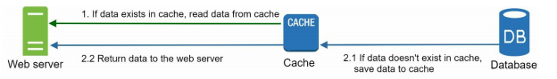 [Image Credit](https://www.amazon.com/System-Design-Interview-insiders-Second/dp/B08CMF2CQF)

Not all types of data can be stored in cache! Let's look at a few pitfalls when using caches:

- **Type of data**
Since cache data is read once and then stored in cache tier, it is not advisable to cache data that changes frequently. The ideal candidate for cached data is one that is read frequently but updated infrequently. It is a good idea to set an expiration policy where the cache is **invalidated** and the data in cache is refreshed by performing another read of the DB. 

- **Inconsistency**
Even if you set an expiration policy, your cache data might be out of date therefore it is important to keep cache and data store in sync using TTL.

- **Eviction Policy**
Once the cache is full, we'll have to start removing content from the cache. To do so, we can use something called LRU (least recently used) cache eviction policy where the least recently used data is removed from cache.

### Cache: Types
There are several strategies where the choice to pick the correct strategy depends on your **data access patterns**. For example: do you have more writes than reads? (ie time based logs), do you have write once and read multiple times? (ie think user profiles on Facebook), do you have a combination? (update and search data). Depending on your use-case, your caching strategy would evolve. Let's look at the various types of caches available.

- **Side Cache**

 [Image Credit](https://codeahoy.com/2017/08/11/caching-strategies-and-how-to-choose-the-right-one/)

This is the simplest of them all: the application, before calling the DB, checks the cache to see if there's a cache hit: if so, application returns the data. In case of a cache miss, the DB is queried, cache is updated and data is then returned to the application. If the cache goes down, application can continue to query the DB.

- **Read Through Cache**

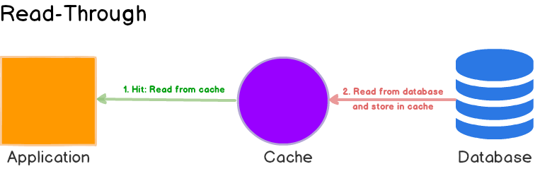 [Image Credit](https://codeahoy.com/2017/08/11/caching-strategies-and-how-to-choose-the-right-one/)

As the name suggests, read through cache is placed between the application and the database. This means that the application ONLY interacts with the cache and NOT the DB. Any cache misses are populated and cache hits are returned. For example:

 (1) Given a key-value pair, the application first tries to read the data from DB. If the cache is populated with the data (cache hit), the value is returned. If not, on to step 2.
 
 (2) Transparent to the application, if there was a cache miss, DAX fetches the key-value pair from DB.
 
 (3) To make the data available for any subsequent reads, the key-value pair is then populated in the cache.
 
 (4) The key-value pair then returns the value back to the application.
 
 If cache goes down, access to DB will also be lost. Disadvantage here is that on the first request, since the cache is empty, you'll have to query the DB so the first request will always be slow. Read through cache is a good use case for **read heavy** work loads.  

- **Write Through Cache**

 [Image Credit](https://codeahoy.com/2017/08/11/caching-strategies-and-how-to-choose-the-right-one/)

Similar to read-through cache, write-through cache also sits in line with the DB and the cache is updated as data is written to DB. Here're the data flow for a write through cache:

 (1) For a given key-value pair, the application writes to the DB.
 
 (2) Cache intercepts the write and then writes the key-value pair to DB.
 
 (3) Upon a successful write, the cache is hydrated with the new value so that any subsequent reads for the same key-value pair result in a cache hit. If the write is unsuccessful, the exception is returned to the application.
 
 (4) The acknowledgement of a successful write is then returned to the application.
 
 Write through and read-through caches can be deployed together to simplify the use of caches. Because a write-through cache automatically caches the update, there's a slight amount of latency for writes. However, the advantage here is that data that is written is also immediately available for reads! Think about it: you have a DB that stores title and summary of new books that you publish. Say you've published a new book and on the landing page of your website you have a huge banner advertising this new book. Before you push the banner to your site, you update your DB with the book title and summary. As soon as you write to the DB, your cache is updated (since it is a write through cache). Now when millions of users flock to your website, they request this new book and its summary which is returned from the cache and NOT the DB. 
 
 Therefore, **write-through cache is advantageous for read heavy workloads**. 

- **Write Around Cache**

 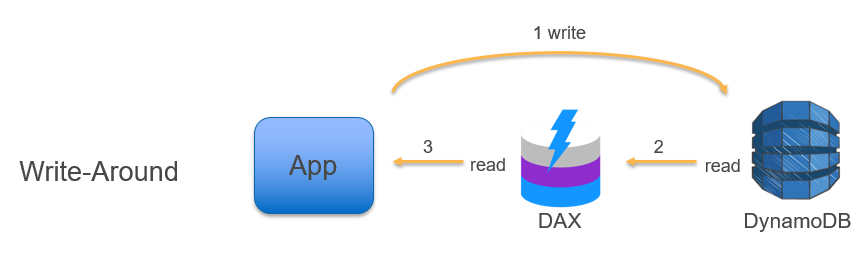 [Image Credit](https://aws.amazon.com/blogs/database/amazon-dynamodb-accelerator-dax-a-read-throughwrite-through-cache-for-dynamodb/)

Some workloads in the IoT or ad tech space have a considerable amount of data that is written once and read never. In these scenarios, it often doesn’t make sense to use a write-through cache. If the cache is populated with data that is never read, it usually means that the utilization and cache/hit miss ratio is low, reducing the utility of the cache. To work around this issue (pun intended), you can employ a write-around pattern in which writes go directly to DynamoDB. Only the data that is read—and thus has a higher potential to be read again—is cached.

- **Write Back Cache**

 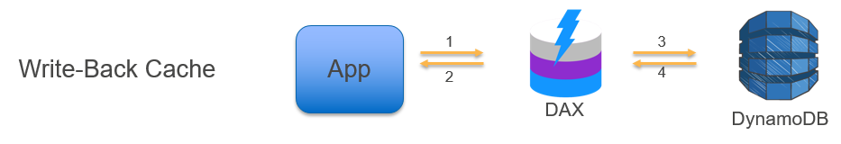 [Image Credit](https://aws.amazon.com/blogs/database/amazon-dynamodb-accelerator-dax-a-read-throughwrite-through-cache-for-dynamodb/)

Whereas both read-through and write-through caches address read-heavy workloads, a write-back (or write-behind) cache is designed to address write-heavy workloads. In this scenario, items are written to the cache and then asynchronously written to the underlying data store. The process is as follows:

(1) The item is written to the cache.

(2) The item is acknowledged by the cache, and success is returned to the application.

(3) As a background process, items are de-staged and written to DynamoDB.

(4) The cache acknowledges the write.

### Content delivery network (CDN)
While we're on the topic of getting content to users fast, it is apt to talk about content delivery networks or CDNs. A CDN is a network of geographically dispersed servers that is used to deliver **static** content. CDN caches static content such as images, CSS, JS and HTML pages that are then delivered to customers close to the server in the CDN. CDNs help improve site load times. Examples of CDNs are Amazon CloudFront, Akamai ImageManager, Fastly IO, PageCDN etc.

Here's how a CDN might work:

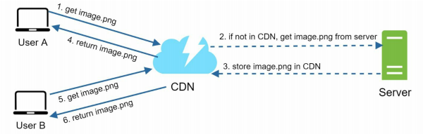 [Image Credit](https://www.amazon.com/System-Design-Interview-insiders-Second/dp/B08CMF2CQF)

- User 1 requests an image that is not found in the CDN. The image is requested from **origin** (or the main server)
- The image is then stored in the CDN
- The image is then returned to the user
- User 2 requests the same image from the same geographical location. The image is found in the CDN and the image is returned to user 2 faster.

CDN content comes with a **TTL** or time to live that describes how long the image can be cached. 

**CDN Drawbacks**
- **Cost** 
CDNs are run by third-party providers, and you are charged for data transfers in and out of the CDN. Caching infrequently used assets provides no significant benefits so you should consider moving them out of the CDN.

- Setting an appropriate cache expiry: For time-sensitive content, setting a cache expiry time is important. The cache expiry time should neither be too long nor too short. If it is too long, the content might no longer be fresh. If it is too short, it can cause repeated requests to the origin servers thus making the CDN useless.

- **CDN fallback**
You should consider how your website/application copes with CDN failure. If there is a temporary CDN outage, clients should be able to detect the problem and request resources from the origin.

Here's the complete diagram with CDN and cache added:

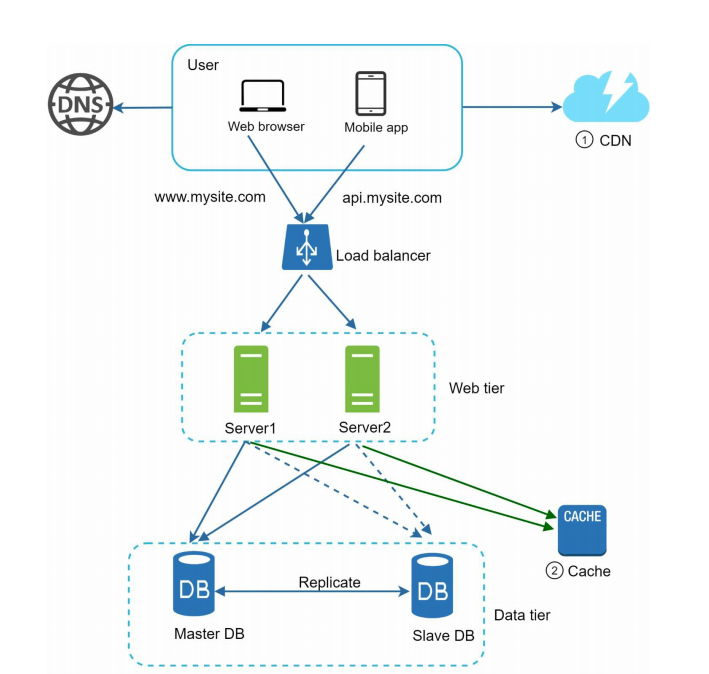 [Image Credit](https://www.amazon.com/System-Design-Interview-insiders-Second/dp/B08CMF2CQF)

In the diagram above we have plenty of improvements over our single server setup:
- Static assets are directly fetched from CDNs that are located close to the end user
- A load balancer is able to scale up/down our backend based on demand and is able to route our requests appropriately
- Database load is lightened by caching data
- Data stored in the database is replicated across followers so that reads are faster

### Web Tier and Statelessness
To understand statelessness we must first understand what stateful means. In a stateful architecture, a user's data is "remembered" between sessions. For example, say a user connects to server A, updates his/her profile, and then disconnects. The next time user A re-connects, he/she needs to be re-directed to server A since that is where user's latest information is. Example:

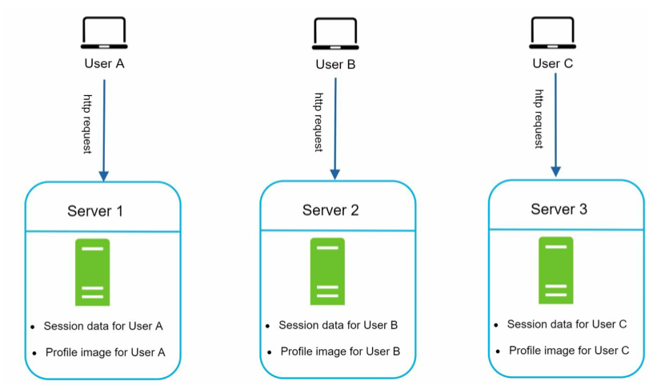 [Image Credit](https://www.amazon.com/System-Design-Interview-insiders-Second/dp/B08CMF2CQF)

Now if user A's login information is stored on server A, then to authenticate user A, all his/her requests need to be routed to server A. The issue here is that the same client must be routed to the same original server. This leaves us at a disadvantage that prevents us from scaling down or up since the server needs to stay up in-case user A logs back in! This also makes it difficult for us to handle server failures. 

A better approach would be to have non-sticky sessions where no user information is stored on ANY server. Instead, user information is kept in shared storage in the **data tier** that allows us to fetch user information whenever he/she logs in. This is called **stateless** architecture:

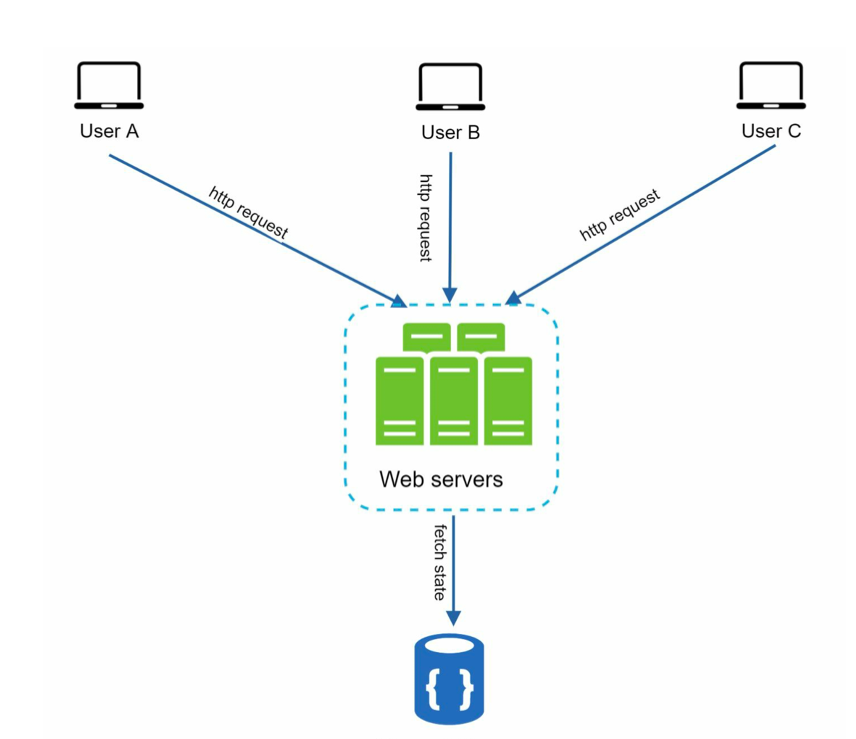 [Image Credit](https://www.amazon.com/System-Design-Interview-insiders-Second/dp/B08CMF2CQF)
   
As you can see above, our users can be re-directed to ANY server which will then fetch state data from a shared data store. As a result, state data is kept out of web tier which makes our **web tier stateless**. 

Now, our overall picture with a stateless web tier looks like so:

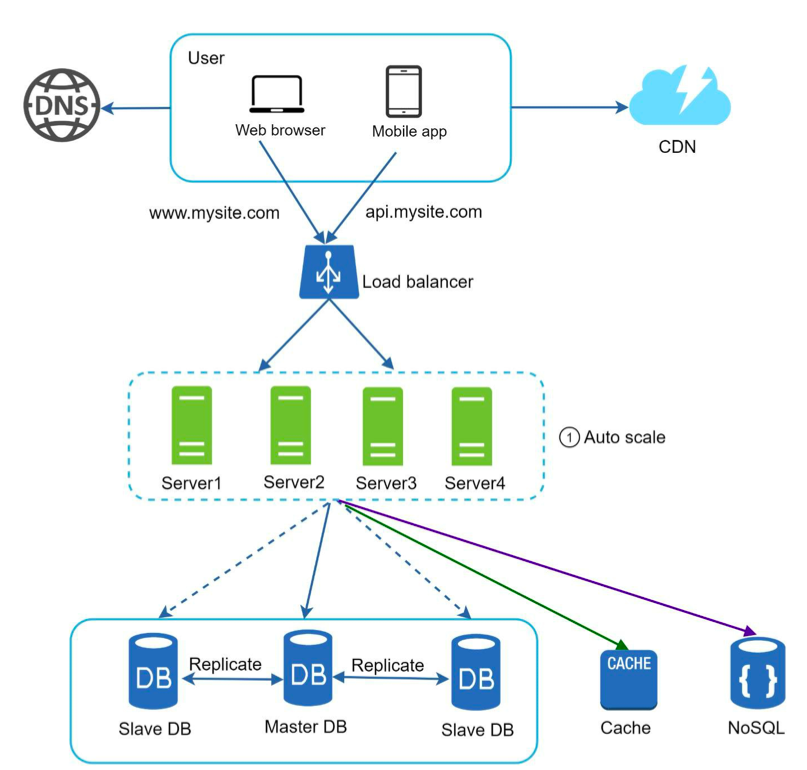 [Image Credit](https://www.amazon.com/System-Design-Interview-insiders-Second/dp/B08CMF2CQF)

After the state data is moved out of web servers, auto-scaling of the web tier is easily achieved by adding or removing servers based on traffic load. We no longer have to keep servers around unnecessarily since web tier servers contain no state information and can be added/removed based on traffic. 

### Data Centers
Now let's say this is where we are in our journey to build the ultimate fault tolerant website:
- Our web tier lies behind a load balancer
- Our web tier is configured to auto-scale
- Our state data is in the data tier
- Our data tier is replicated 
- We have cache setup for better response times

But what if our servers (both in web and data tier) located in the USA east region and there's a power outage that takes down our server farm? Our website would be down as well! How would we go about making sure that our website is immune to such accidents and is still able to load for users that are farther away from us geographically?

Enter: **multiple data centers**

We'd have multiple data centers with the same setup(architecture) BUT located in geographically separated regions. For example, we could have one data center in Virginia USA and another in Oregon USA. Thinking globally, we can have another in Shanghai and another in London. 

Now, with the introduction of multiple data centers, how do we route our customers' requests? For example, if a user is in Europe, would the request be routed to Oregon data center or London? Obviously London! We'll do that via **geo-routing**

### Data Centers: Geo routing

### Useful architectures
 - [WordPress on AWS](#https://docs.aws.amazon.com/whitepapers/latest/best-practices-wordpress/reference-architecture.html)
 - [Netflix active-active](https://netflixtechblog.com/active-active-for-multi-regional-resiliency-c47719f6685b)
 