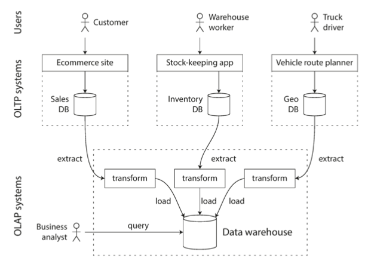
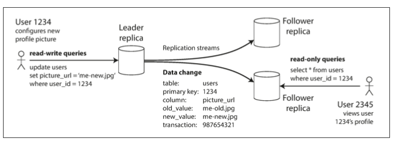

**These are my notes as I go through the book [designing data intensive applications](https://www.oreilly.com/library/view/designing-data-intensive-applications/9781491903063/)**

1. [Intro](#intro)
2. [Reliability](#reliability)
3. [Scalability](#scalability)
    * [Load](#load)
    * [Twitter](#twitter)
4. [Storage and Retrieval](#storage-and-retrieval)
5. [Storage Engines](#storage-engines)
6. [Log structured](#log-structured)
    * [Index](#index)
    * [B-trees](#b-trees)
7. [Page oriented](#page-oriented)
8. [OLTP vs OLAP](#oltp-vs-olap)
9. [Data Warehouses](#data-warehouses)
10. [Distributed Data](#distributed-data)
11. [Leaders and Followers](#leaders-and-followers)
12. [Adding followers]

### Intro

As the amount of data produced by various sources increases, so does the need to process and make sense of the data. As a result, applications today are `data intensive` as opposed to `compute intensive`. 

These data intensive apps may need to:
- Store data (in databases)
- Speed up reads by remembering results of expensive operations (caches)
- Allow users to search/filter the data collected (search index)
- Allow for multi-processing by sending message to another application asynchronously (stream processing)
- Process large chunks of data at regular intervals (batch processing)

To do so there are various tools and techniques that can be used in conjunction to create a tool for the job at hand. Since these systems can get complex with multiple mini systems "stitched" together, we create an API to hide the details of such a system from the client. In doing so, you have created a special purpose data system from smaller, general purpose components.

When such systems are created, there are 3 main concerns for the designer: 
- Reliability of the system
- Scalability of the system
- Maintainability of the system

### Reliability

A reliable system is one that **continues to work correctly(ie correct function and performance levels) in the face of adversity(hardware or software failures).**

Reliable systems are fault tolerant: this fault can be a human error (incorrect input) or hardware/software errors. Even under faulty circumstances, our system continues to be reliable. Reliable systems are **resilient** and **fault tolerant**.

There are several types of faults:
- Hardware faults: Hard disk crash, RAM becomes faulty, electric outage etc. To prevent hardware faults, we add redundancy to our applications: setup disks in RAID (redundant array of independent disks) configuration, have dual power supplies, backup power for data centers etc.  

- Software faults: Leap year errors, bad input errors etc. Happen in unusual set of circumstances. 

- Human errors

### Scalability

A scalable system is one that is **able to deal with its growth**. Growth can be defined as increased volume of data or increased traffic volume. Scalability is used to describe how the system copes with increased load. 

It doesn't make sense to just say system X is scalable. What does that mean? Scalability needs to be considered by asking questions like **if the system's load increases how are we going to handle that growth?** For example, a system could suddenly go from 100 to million users or a client uploads TBs of data through our system: is our system able to handle these sudden spikes? 

#### Load

To handle `load`, we need to first describe what load means and how we can measure it. To do so, we make use of **load parameters**: these could be:
- Requests per second for a web server: as number of users increase the number of requests for your homepage increase thus the requests per second increase
- Ratio of reads to writes for a database: as a user uploads TBs of data through our system, we need to be able to handle large writes etc.

In each unique scenario, the load would mean something different: perhaps the bottleneck is due to a small number of extreme cases.

#### Twitter

Let's have a look at a concrete example using twitter: twitter's main operations are:
- post tweet: Publish a tweet to one's followers (4.6K req/sec on avg 12K at peak) 
- home timeline: View one's timeline (300K req/sec)

This seems easy to handle until you consider **fan-out** where each user follows many people and each user is followed by many people. 

One approach could be to store tweets in a single DB. When I open twitter and request my TL, lookup all the people I follow, grab their tweets from the DB, sort them by time and display those tweets for me. This is quite expensive if I follow a lot of people who tweet alot! 

Another approach could be to have a cache for my timeline. If I follow Elon, every time he tweets, insert that new tweet into my home TL cache. So, when I open my TL the next time, I'll have all the tweets already present ready to be displayed for me. The request to read here is cheap because the results have been calculated ahead of time.

When twitter initially launched, the first approach was used but the systems were overwhelmed. That was because people request for the home TL twice as much as they tweet so it is preferred to do more work at write time than at read time. It makes sense that since most people are requesting for timelines, twitter would make sure that the TL loads faster. 

The second approach also has a downside: every time someone tweets, the system has to lookup all that person's followers and add it to their cached TLs. Consider this for a famous person who has millions of followers, delivering the new tweets to each follower's TL in < 5 secs is a challenge. Therefore, in our twitter example, the key **load parameter** would be the number of followers per user weighted by the frequency of tweets. If a person with millions of followers tweets a lot, this would be a significant increase in twitter's load as compared to a person with few followers who rarely tweets. 

As it turns out, twitter has implemented a hybrid approach where people with few followers are delivered cached tweets (approach 2) while people with millions of followers are delivered tweets using approach 1.

### Storage and retrieval  
There are various different "ways" to store data depending on the type of data that is being stored. There are:

- **Document databases**

These target use cases where data being stored is a self-contained document and there are no relations between two documents. This is part of the NoSQL data store family. 

- **Graph databases**

These are for use cases where anything is potentially related to everything.This is also part of the NoSQL data store family. 

- **Relational Databases**

These are for use cases where the data can have many to many relationships. 

### Storage Engines
Let's talk about the various ways in which databases will store information internally. As you can imagine, different storage engines would best suit a particular data storage and retrieval scenario. There isn't a one size fit all solution. For example, you might have a workload that is transaction heavy while others might be optimized for analytics. Let's start by discussing the two types of simpler storage engines: **log-structured** and **page-oriented**.

### Log structured
In a log structured engine, in order to save a record to the database, roughly an entry is **logged** or appended to the end of a simple data structure (such as a file). Each new entry would keep appending to this log. Appending to a file is generally very efficient.

However, as the number of entries grow, the cost of retrieval also increases since the engine has to go through all the entries to get to the latest entry. To efficiently return records, another data structure is used behind the scenes. It is called **index**.

### Index 
The idea behind an index is simple: store extra metadata information on the side that acts as a marker telling you where to find the record. Many databases allow you to specify the type of indexes that you want to create which in turn affects lookup speeds. As you can imagine, as we add more data to the DB, these indexes must also be updated, therefore increasing the time it takes to write the data.
 
 **This is an important trade-off in storage systems: indexes speed up reads but each that needs to be maintained slows down writes**. Due to this, databases will not index everything by default but would require the developer, with his/her knowledge of application's query patterns, to create indexes as required. It is an act of balancing the write and read times!
 
 There are various types of indexes that can be created using:
 - Hash tables
 - Sorted-String Tables and LSM-Trees
 - B-Trees

### Page Oriented
Let's talk about page oriented indexing. This is where information is stored in fixed sizes called pages. B-trees allow us to implement page-oriented indexing:

### B-Trees
B-trees break down the database into blocks that are called **pages** of size, usually, 4KB. B-trees read and write one page at a time. Each page is identified using an address and the b-tree stores addresses of each of these pages. The number of references to child pages is determined by the branching factor. If number of entries go above the branching factor, a page split is required to keep the branch factor.

### OLTP vs OLAP 
Now that we've seen how indexing can speed up information lookup and the role it plays in data writes, let's discuss the types of read/writes that we can come across when dealing with data intensive applications. 

We can have **online transaction processing** where the queries are typically related to lookups on a small set of rows and updates are not too intensive either. OLTP is primarily used by applications that interact directly with the end users and answer simple questions posed by the user. In OLTP, raw data is returned to the user with little or no modification.

We can also have **online analytic processing** where large amounts of information need to be processed where manipulation of the underlying data is required. This manipulation could be aggregating values in multiple rows, averaging a particular value etc. OLAP help derive business intelligence from raw data. Even though SQL DBs were apt for OLAP, many new data warehouses have been built specifically for this purpose.

### Data Warehouses
As we discussed in the previous section, data warehouses were specifically created to perform analytics without affecting transactions occurring on the main DB. A data warehouse is separate database that can be queried without affecting OLTP operations. Data warehouse contains read-only copy of the data in all the various OLTP systems. This copy is made either via a stream of updates or periodic updates so that latest data is available for OLAP. Before the data is dumped into the warehouse, it is usually transformed into analytics friendly schema, cleaned and then uploaded into the warehouse. This process is called **extract-transform-load** (ETL):

[Image Credit - Warehouse](https://learning.oreilly.com/library/view/designing-data-intensive-applications/9781491903063/)

### Distributed Data
So far, our discussion has revolved around data stored on a single machine. In this section, we'll talk about another approach (which is more prevalent) for storing/retrieving data: one where data is stored on multiple machines. Before we deep dive, we'd want to ask ourselves WHY we need more than a single machine to store data?

- What if our application's load (# of requests) is too high for a single machine to handle? Issue of **scalability**
- What if our single machine goes down? Issue of **fault tolerance** and **high availability**
- What if our machine is geographically far away from the customers it serves content to? Issue of **latency**

This architecture where data is distributed among machines is called **shared-nothing** architecture. Here, each machine, or a **node** is a stand-alone unit where coordination between nodes is done on a network level. There are 2 common ways data is distributed among multiple nodes: 

- **Replication**

Replication is where a copy of the data is store on several different nodes in different locations. This helps provide redundancy: case where if a node goes down, we have another node with the same data that can continue to serve our customers. 

- **Partitioning**

What if our data set is too large to be stored on a single machine? In this case, we partition our data: ie break it down into chunks that can be stored on different nodes. This is also known as **sharding**.

Most often, replication and partition are both carried out in large scale data systems. 

### Replication

Like we said in the previous section, replication means to keep a copy of the same data on multiple machines that are then connected via a network. You'd want to replicate data to:

- Resolve latency issues
- To make your data highly available and fault tolerant
- To improve overall performance by scaling our system

In this section, we'll assume that partitioning is not required ie our data is small enough to be stored on a single machine. Now, let's start to think about how we'd replicate data across multiple machines:

- **Static data**

This is where our data is written once and NEVER changes. In this case, all we need to do is grab the data and write to all the nodes and be done! Real challenge is when we need to replicate dynamic, or changing data

- **Dynamic Data**

This is where our data gets updated quite often: think of a customer's transaction data base. This data will get updated every time the customer makes a purchase or returns an item. Here, each change to the data needs to be propagated to every machine that holds a copy of the data so that the **replicas** (each node that stores a copy of the database is called a replica) are up to date. There are 3 main algorithms for replicating dynamic data: **single-leader**, **multi-leader** and **leaderless** replication. In addition to updating the nodes, there're other trade-offs to consider as well when we perform replication:

    - How to update nodes (what we discussed earlier)
     
    - Whether to use synchronous or asynchronous replication (and the idea of eventual consistency)
    
    - How to handle failed replicas
    
Let's start with how we might replicate data across nodes:

### Leaders and Followers
Every write to the database needs to be processed by every replica otherwise our replicas would be useless! One way to do so is to use **leader-based** replication which works like so:

- One of the replicas is designated the **leader**. When a client writes to the database, they send their request to the leader which writes that information first to its own local storage.

- The other replicas, known as **followers**, receive this information from the leader every time the leader receives a new request. Whenever a leader writes to its local storage, it also sends the data to all its followers as part of the **replication log**. Each follower then takes the replication log from the leader and updates its local copy of the database with the new changes applying all writes in the same order as they were processed on the leader.

- Reads can be done by querying either the leader or the followers BUT writes need to ALWAYS go through the leader.

Here's an example flow with leader and 2 followers:

[Image Credit - Leader/Follower Replication](https://learning.oreilly.com/library/view/designing-data-intensive-applications/9781491903063/)

### Synchronous vs Asynchronous Replication

Now, one concern with this replication is how long (if at all) the leader should wait until it is sure that all the followers have been updated. What if there are 1000 followers? To answer this question, we need to understand the 2 modes of replication:

- **Synchronous**:

For this type of replication, the leader **waits** until the follower sends back an ok before returning back to the client saying that the write was successful. Here, the leader would wait. The advantage here is that the follower is guaranteed to have most up to date information because leader won't return success until follower returns success. Disadvantage here is that writes would be slow since the leader would wait for all the followers to return a success. What if one of the followers is down? We'd be waiting for that follower to come back online, request the replication log, update its local storage and then return a success. See the problem? One down node would bring our whole system to a halt!

- **Asynchronous**:

For this type of replication, the leader **does not wait** until the follower sends back an ok before returning back to the client saying that the write was successful. Here, the leader updates its local storage and returns success. The follower would eventually send back a success. Advantage here is that the wait time is as minimal as possible ie the time it takes for the leader to update local storage. Disadvantage here is that the followers might not be able to update their local and clients would receive stale data. 

In reality, replication is done in a **semi-synchronous** fashion: leader waits for atleast 1 node to return success and then the leader conveys back to the client that the write was successful.

### Adding Followers

Now say our system is consisted of multiple followers and a single leader. Our clients are consistently writing via the leader and we realize that our number of followers are not enough based on the load. How do we go about adding more followers? We can't take the system offline while we replicate data to new followers since clients are consistently writing. Here's the process to do so:

(1) Take a **snapshot** of the leader's database at some point in time.

(2) Copy the snapshot to the follower node

(3) Once the copy is completed, request the leader for all the writes that happened since the snapshot was taken. This is determined by comparing the snapshot with the leader's replication log.

(4) Once the replica gets its missing records, we say that is now **caught up** and it can now continue to receive updates from the leader.