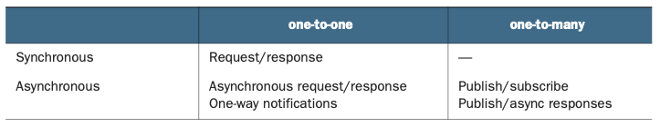
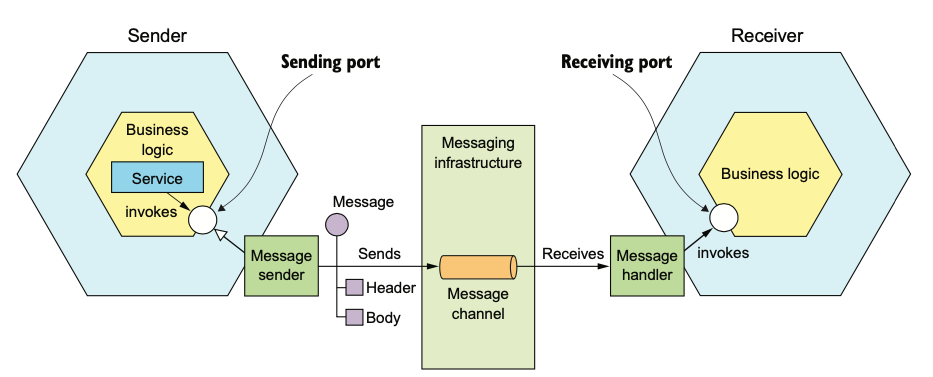
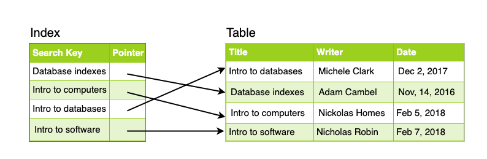
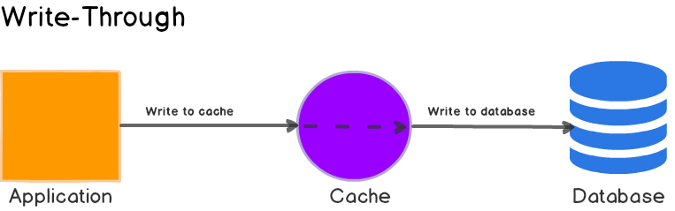

0. [Microservice Architecture](#microservice-architecture)
    * [Service](#service)
    * [Pros vs Cons](#pros-vs-cons)
    * [IPC](#ipc)
    * [Message Formats](#message-formats)
    * [Communication Using RPI](#communication-using-rpi)
        * [REST: Pros vs Cons](#rest-pros-vs-cons)
        * [gRPC](#grpc)
    * [Circuit Breaker Pattern](#circuit-breaker-pattern)
    * [Service discovery](#service-discovery)
    * [Messaging](#messaging)
        * [Brokerless Messaging](#brokerless-messaging)
        * [Broker Based Messaging](#broker-based-messaging)
    * [Sagas](#sagas)
    * [Queries](#queries)
        * [API Composition Pattern](#api-composition-pattern)
    * [API Gateway](#api-gateway)
        * [Edge Functions](#edge-functions)
        * [Secure Services](#secure-services)
        * [Rate Limiter](#rate-limiter)
    * [Summary](#summary)
1. [Intro](#introduction)
    * [DNS](#dns)
    * [Types of data](#types-of-data)
        * [Types of data - Relational Model](#types-of-data---relational-model)
        * [Types of data - Document Model](#types-of-data---document-model)
        * [Types of data - Relation vs Document Model](#types-of-data---relation-vs-document-model)
        * [Types of data - Graph model](#types-of-data---graph-model)
    * [Types of Databases](#types-of-databases)
        * [Relational Database](#relational-database)
        * [When to pick RDBs](#when-to-pick-rdbs)
        * [NoSQL Database](#nosql-dbs)
        * [NoSQL vs RDBs](#nosql-vs-rdbs)
        * [Redis](#redis)
    * [Data Encoding](#data-encoding)
        * [Data Encoding - Language Specific Encoders](#data-encoding---language-specific-encoders)
        * [Data Encoding - JSON and XML](#data-encoding---json-and-xml)
        * [Data Encoding - AVRO](#data-encoding---avro)
    * [DataFlow](#data-flow)
        * [Data Flow - REST](#data-flow---rest)
    * [Communication Between Services](#communication-between-services)
2. [Distributed](#distributed)
2. [Scalability](#scalability)
3. [Reliability](#reliability)
4. [CAP Theorem](#cap-theorem)
    * [Vector Clock](#vector-clock)
    * [Handling Failures](#handling-failures)
3. [Vertival vs Horizontal Scaling](#vertical-vs-horizontal-scaling)
4. [Load Balancers](#load-balancers)
    * [Why load balance](#why-load-balance)
    * [Load Balancers Deep Dive](#load-balancers-deep-dive)
    * [Balancing algorithms](#balancing-algorithms)
    * [Redundant Load Balancers](#redundant-load-balancers)
5. [Replication](#replication)
    * [Replication Deep Dive](#replication-deep-dive)
    * [Single Leader replication](#single-leader-replication)
        * [Single Leader: Synch vs Asynch replication](#single-leader-synch-vs-asynch-replication)
        * [Single Leader: Eventual Consistency](#single-leader-eventual-consistency)
    * [Multileader replication](#multi-leader-replication)
        * [MultiLeader: Pros](#multi-leader-pros)
        * [MultiLeader: Cons](#multi-leader-cons)
    * [Leaderless replication](#leaderless-replication)
6. [Partitioning](#partitioning)
    * [Partitioning: Techniques](#partitioning-techniques)
    * [Partitioning: Criteria](#partitioning-criteria)
    * [Partitioning: Issues](#partitioning-issues)
6. [Indexes](#indexes)
    * [Indexing Example](#indexing-example)
    * [Index: Write Performance](#index-write-performance)
6. [Caching](#caching)
    * [Cache Types](#cache-types)
7. [CDN](#content-delivery-network-cdn)
8. [Web Tier and Statelessness](#web-tier-and-statelessness)
9. [Data Centers](#data-centers)
    * [Data Centers: Geo-Routing](#data-centers-geo-routing)
10. [Decoupling](#decoupling)
    * [Decoupling: Message queues](#decoupling-message-queues)
11. [System Design](#system-design)
    * [Generating Unique IDs in a distributed Env](#generating-unique-ids-in-a-distributed-env)
    * [Reliable vs Available](#reliable-vs-available)
    * [Back of the envelope Estimation](#back-of-the-envelope-estimation)
    * [Storing Images](#storing-images)
    * [Allowing users to chat](#allowing-users-to-chat)
100. [Useful architectures](#useful-architectures)

### Microservice Architecture
Before we begin designing distributed architectures, let's first understand what the microservice architecture is:
As modern systems grow in size, it is recommended to break monolithic systems down into microservices. The idea is to have modularity in our application where each part of the application does one job and does it well. Each modular part is called a service. A key characteristic of microservice architecture is that services are responsible for performing one function. Each service is independent of other services, meaning services are **loosely coupled**: a service can run in isolation from other services. 

According to the book, The Art of Scalability, a microservice is also scalable. It can be scaled using the scalability cube:

 [Image Credit](https://microservices.io/book)

X-axis scaling is a common way to scale a monolithic application. Figure above shows how X-axis scaling works. You run multiple instances of the application behind a load balancer. The load balancer distributes requests among the N identical instances of the application. This is a great way of improving the capacity and availability of an application.

Z-axis scaling also runs multiple instances of the monolith application, but unlike X-axis scaling, each instance is responsible for only a subset of the data.


X- and Z-axis scaling improve the application’s capacity and availability. But neither approach solves the problem of increasing development and application complexity. To solve those, you need to apply Y-axis scaling, or functional decomposition. A service is a mini application that implements narrowly focused functionality, such as order management, customer management, and so on

Applying the rules of scalability cube, this is what a microservice could look like:

 [Image Credit](https://microservices.io/book)

A key characteristic of the microservice architecture is that the services are loosely coupled and communicate only via APIs. One way to achieve loose coupling is by each service having its own datastore. At development time, developers can change a service’s schema without having to coordinate with developers working on other services. At runtime, the services are isolated from each other—for example, one service will never be blocked because another service holds a database lock.
 
Another benefit of the microservice architecture is that each service is relatively small. The code is easier for a developer to understand. The small code base doesn’t slow down the IDE, making developers more productive. And each service typically starts a lot faster than a large monolith does, which also makes developers more productive and speeds up deployments.

### Service
A service is a standalone, independently deployable software component that implements some useful functionality. A service’s API encapsulates its internal implementation. Unlike in a monolith, a developer can’t write code that bypasses its API. As a result, the microservice architecture enforces the application’s modularity. Each service in a microservice architecture has its own architecture and, potentially, technology stack. An important characteristic of the microservice architecture is that the services are loosely coupled. All interaction with a service happens via its API, which encapsulates its implementation details. This enables the implementation of the service to change without impacting its clients. Loosely coupled services are key to improving an application’s development time attributes, including its maintainability and testability. They are much easier to understand, change, and test.

But why should we use microservice architecture?

### Pros vs Cons

The microservice architecture has the following benefits:
- It enables the continuous delivery and deployment of large, complex applications. 
- Services are small and easily maintained.
- Services are independently deployable.
- Services are independently scalable.
- The microservice architecture enables teams to be autonomous. 
- It allows easy experimenting and adoption of new technologies. 
- It has better fault isolation.

Here are the major drawbacks and issues of the microservice architecture:
- Finding the right set of services is challenging.
- Distributed systems are complex, which makes development, testing, and deployment difficult.
- Deploying features that span multiple services requires careful coordination.
- Deciding when to adopt the microservice architecture is difficult.

Let's discuss some major challenges when working with distributed microservices:

**Network latency** is an ever-present concern in a distributed system. You might discover that a particular decomposition into services results in a large number of round-trips between two services. Sometimes, you can reduce the latency to an acceptable amount by implementing a batch API for fetching multiple objects in a single round trip. But in other situations, the solution is to combine services, replacing expensive IPC with language-level method or function calls.

Another problem is how to implement inter-service communication in a way that doesn’t reduce **availability**. Meaning, if one service is dependent on another service and that other service is down. This would have a cascading affect whereby the unavailability of one service makes the whole system grind to a halt. A solution could be to have asynchronous calls between services.

Another challenge is maintaining **data consistency** across services. Some system operations need to update data in multiple services. For example, when a restaurant accepts an order, updates must occur in both the Kitchen Service and the Delivery Service. The traditional solution is to use a two-phase, commit-based, distributed transaction management mechanism which doesn't work for distributed systems. We'd have to use a very different approach to transaction management, a saga. A saga is a sequence of local transactions that are coordinated using messaging. Sagas are more complex than traditional ACID transactions but they work well in many situations. One limitation of sagas is that they are eventually consistent. If you need to update some data atomically, then it must reside within a single service, which can be an obstacle to decomposition.

### IPC
Now that our services are defined as loosely coupled components, what if we need 2 services to talk to each other? Enter **interprocess communication or IPC** mechanisms. Services must often collaborate in order to handle a request. Because service instances are typically processes running on multiple machines, they must interact using IPC. It plays a much more important role in a microservice architecture than it does in a monolithic application. There’s no shortage of IPC mechanisms to chose from. Today, the fashionable choice is REST (with JSON). It’s important, though, to remember that there are no silver bullets. You must carefully consider the options.  

Before we begin describing the types of IPC technologies, let's see the various interaction styles that are available that allow IPC. We can have:

 [Image Credit](https://microservices.io/book)

As summed above, these are the types of one-to-one requests that we can have:
- Request/response: A service client makes a request to a service and waits for a response. The client expects the response to arrive in a timely fashion. It might event block while waiting. This is an interaction style that generally results in services being tightly coupled.
- Asynchronous request/response: A service client sends a request to a service, which replies asynchronously. The client doesn’t block while waiting, because the service might not send the response for a long time.
- One-way notifications: A service client sends a request to a service, but no reply is expected or sent.

The following are the different types of one-to-many requests:
- Publish/subscribe: A client publishes a notification message, which is consumed by zero or more interested services.
- Publish/async responses: A client publishes a request message and then waits for a certain amount of time for responses from interested services.

Your choice of IPC mechanism impacts availability of your application. Synchronous communication with other services as part of request handling reduces application availability. As a result, you should design your services to use asynchronous messaging whenever possible. REST is an extremely popular IPC mechanism. You may be tempted to use it for interservice communication. The problem with REST, though, is that it’s a synchronous protocol: an HTTP client must wait for the service to send a response. Whenever services communicate using a synchronous protocol, the availability of the application is reduced. To see why, consider this scenario:

 [Image Credit](https://microservices.io/book)

If either one of the consumer service or the restaurant service is slow/unavailable, we'll be impacting the response time to our client.  All services must be available in order for the order to be processed. The best way to handle issues here is to use an asynch request/asynch reponse style of interaction to create orders:
  
 [Image Credit](https://microservices.io/book)
  
The client and the services communicate asynchronously by sending messages via messaging channels. No participant in this interaction is ever blocked waiting for a response.
Such an architecture would be extremely resilient, because the message broker buffers messages until they can be consumed. The problem, however, is that services often have an external API that uses a synchronous protocol such as REST, so it must respond to requests immediately.
If a service has a synchronous API, one way to improve availability is to replicate data. Let’s see how that works:

One way to minimize synchronous requests during request processing is to replicate data. A service maintains a replica of the data that it needs when processing requests.

 [Image Credit](https://microservices.io/book)

### Messaging
When using messaging, services communicate by asynchronously exchanging messages. A messaging-based application typically uses a message broker, which acts as an intermediary between the services, although another option is to use a brokerless architecture, where the services communicate directly with each other. A service client makes a request to a service by sending it a message. If the service instance is expected to reply, it will do so by sending a separate message back to the client. Because the communication is asynchronous, the client doesn’t block waiting for a reply. Messages are exchanged over channels. The business logic in the sender invokes a sending port interface, which encapsulates the underlying communication mechanism. The sending port is implemented by a message sender adapter class, which sends a mes- sage to a receiver via a message channel. A message channel is an abstraction of the messaging infrastructure. A message handler adapter class in the receiver is invoked to handle the message. It invokes a receiving port interface implemented by the consumer’s business logic. Any number of senders can send messages to a channel. Similarly, any number of receivers can receive messages from a channel.

 [Image Credit](https://microservices.io/book)


There are two kinds of channels: point-to-point and pub-sub:
- A point-to-point channel delivers a message to exactly one of the consumers that is reading from the channel. Services use point-to-point channels for the one- to-one interaction styles described earlier. For example, a command message is often sent over a point-to-point channel.
- A publish-subscribe channel delivers each message to all of the attached consumers. Services use publish-subscribe channels for the one-to-many interaction styles described earlier. For example, an event message is usually sent over a publish-subscribe channel.

A messaging-based application typically uses a message broker, an infrastructure service through which the service communicates. But a broker-based architecture isn’t the only messaging architecture. You can also use a brokerless based messaging architecture, in which the services communicate with one another directly. The two approaches, shown below, have different trade-offs, but usually a broker-based architecture is a better approach.

 [Image Credit](https://microservices.io/book)


### Brokerless Messaging

In a brokerless architecture, services can exchange messages directly. [ZeroMQ](http:// zeromq.org) is a popular brokerless messaging technology. It’s both a specification and a set of libraries for different languages. It supports a variety of transports, including TCP, UNIX-style domain sockets, and multicast.
The brokerless architecture has some benefits:
- Allows lighter network traffic and better latency, because messages go directly from the sender to the receiver, instead of having to go from the sender to the message broker and from there to the receiver
- Eliminates the possibility of the message broker being a performance bottle- neck or a single point of failure
- Features less operational complexity, because there is no message broker to set up and maintain

As appealing as these benefits may seem, brokerless messaging has significant drawbacks:
- Services need to know about each other’s locations and must therefore use one of the discovery mechanisms describer earlier in section 3.2.4.
- It offers reduced availability, because both the sender and receiver of a message must be available while the message is being exchanged.
- Implementing mechanisms, such as guaranteed delivery, is more challenging.

### Broker Based Messaging
A message broker is an intermediary through which all messages flow. A sender writes the message to the message broker, and the message broker delivers it to the receiver. An important benefit of using a message broker is that the sender doesn’t need to know the network location of the consumer. Another benefit is that a message broker buffers messages until the consumer is able to process them.
There are many message brokers to chose from. Examples of popular open source message brokers include [ActiveMQ](http://activemq.apache.org), [RabbitMQ](https://www.rabbitmq.com), [Apache Kafka](http://kafka.apache.org) etc.

**There are many advantages to using broker-based messaging:**
- Loose coupling: A client makes a request by simply sending a message to the appropriate channel. The client is completely unaware of the service instances. It doesn’t need to use a discovery mechanism to determine the location of a service instance.
- Message buffering: The message broker buffers messages until they can be processed. With a synchronous request/response protocol such as HTTP, both the client and service must be available for the duration of the exchange. With messaging, though, messages will queue up until they can be processed by the consumer. This means, for example, that an online store can accept orders from customers even when the order-fulfillment system is slow or unavailable. The messages will simply queue up until they can be processed.
- Flexible communication: Messaging supports all the interaction styles described earlier.
- Explicit interprocess communication: RPC-based mechanism attempts to make invoking a remote service look the same as calling a local service. But due to the laws of physics and the possibility of partial failure, they’re in fact quite different.

**There are some downsides to using messaging:**
- Potential performance bottleneck: There is a risk that the message broker could be a performance bottleneck. Fortunately, many modern message brokers are designed to be highly scalable.
- Potential single point of failure: It’s essential that the message broker is highly available—otherwise, system reliability will be impacted. Fortunately, most modern brokers have been designed to be highly available.
- Additional operational complexity: The messaging system is yet another system component that must be installed, configured, and operated.

A challenge you must tackle when using messaging is dealing with duplicate messages. A message broker should ideally deliver each message only once, but guaranteeing exactly-once messaging is usually too costly. Instead, most message brokers promise to deliver a message at least once. Best way to handle duplicate messages is to write idempotent message handlers. Another method is to track messages and discard duplicates (more costly than idempotency). 

### Message formats
The choice of message format can impact the efficiency of IPC, the usability of the API, and its evolvability. If you’re using a messaging system or protocols such as HTTP, you get to pick your message format. Some IPC mechanisms—such as gRPC, which you’ll learn about shortly—might dictate the message format. There are two main categories of message formats: text and binary. Text based are JSON and XML. Binary are AVRO, Thrift and Protocol Buffers. 

### Communication Using RPI
When using a remote procedure invocation-based IPC mechanism, a client sends a request to a service, and the service processes the request and sends back a response. Some clients may block waiting for a response, and others might have a reactive, non-blocking architecture. There're 2 main types of RPI methods: REST and gRPC. REST is quite well understood, so let's just understand the benefits/drawbacks of REST and then we'll see how gRPC works:

### REST: Pros vs Cons
**There are numerous benefits to using REST:**
- It’s simple and familiar.
- You can test an HTTP API from within a browser using, for example, the Postman plugin, or from the command line using curl (assuming JSON or some other text format is used).
- It directly supports request/response style communication.
- HTTP is, of course, firewall friendly.
- It doesn’t require an intermediate broker, which simplifies the system’s architecture.

**There are some drawbacks to using REST:**
- It only supports the request/response style of communication.
- Reduced availability. Because the client and service communicate directly without an intermediary to buffer messages, they must both be running for the duration of the exchange.
- Clients must know the locations (URLs) of the service instances(s). This is a nontrivial problem in a modern application. Clients must use what is known as a service discovery mechanism to locate service instances.
- Fetching multiple resources in a single request is challenging.
- It’s sometimes difficult to map multiple update operations to HTTP verbs.

### gRPC
As mentioned in the preceding section, one challenge with using REST is that because HTTP only provides a limited number of verbs, it’s not always straightforward to design a REST API that supports multiple update operations. An IPC technology that avoids this issue is [gRPC](www.grpc.io), a framework for writing [cross-language clients and servers](https://en.wikipedia.org/wiki/Remote_procedure_call for more). gRPC is a binary message-based protocol, and this means—as mentioned earlier in the discussion of binary message formats—you’re forced to take an API-first approach to service design. You define your gRPC APIs using a Protocol Buffers-based IDL, which is Google’s language-neutral mechanism for serializing structured data. You use the Protocol Buffer compiler to generate client-side stubs and server-side skeletons. The compiler can generate code for a variety of languages, including Java, C#, NodeJS, and GoLang. Clients and servers exchange binary messages in the Protocol Buffers format using HTTP/2. 

gRPC uses Protocol Buffers as the message format. Protocol Buffers is, as menioned earlier, an efficient, compact, binary format. It’s a tagged format. Each field of a Protocol Buffers message is numbered and has a type code. A message recipient can extract the fields that it needs and skip over the fields that it doesn’t recognize. As a result, gRPC enables APIs to evolve while remaining backward-compatible.

gRPC has several benefits:
- It’s straightforward to design an API that has a rich set of update operations.
- It has an efficient, compact IPC mechanism, especially when exchanging large messages.
- Bidirectional streaming enables both RPI and messaging styles of communication.
- It enables interoperability between clients and services written in a wide range of languages.

gRPC also has several drawbacks:
- It takes more work for JavaScript clients to consume gRPC-based API than REST/JSON-based APIs.
- Older firewalls might not support HTTP/2.

### Circuit Breaker Pattern
In a distributed system, whenever a service makes a synchronous request to another service, there is an ever-present risk of partial failure. Because the client and the service are separate processes, a service may not be able to respond in a timely way to a client’s request. The service could be down because of a failure or for maintenance. Or the service might be overloaded and responding extremely slowly to requests. Because the client is blocked waiting for a response, the danger is that the failure could cascade to the client’s clients and so on and cause an outage.

 [Image Credit](https://microservices.io/book)

In the example above, say our Order service is unresponsive, our first call from the order service proxy to the order service would return a 503 (Service not found). Each subsequent call would return the same because obviously the service is down. The circuit breaker pattern allows us to provide a threshold where we can specify the duration and the number of retries after which any further calls to the unresponsive service would be blocked at the proxy level. 

### Service Discovery
Service instances have dynamically assigned network locations. Moreover, the set of service instances changes dynamically because of autoscaling, failures, and upgrades. Consequently, your client code must use a service discovery. 

 [Image Credit](https://microservices.io/book)

An application must use a dynamic service discovery mechanism. Service discovery is conceptually quite simple: its key component is a service registry, which is a database of the network locations of an application’s service instances. The service discovery mechanism updates the service registry when service instances start and stop. When a client invokes a service, the service discovery mechanism queries the service registry to obtain a list of available service instances and routes the request to one of them. Let's see how the service registry works:

 [Image Credit](https://microservices.io/book)


This approach to service discovery is a combination of two patterns. The first pattern is the Self registration pattern. A service instance invokes the service registry’s registration API to register its network location. It may also supply a health check URL: The health check URL is an API endpoint that the service registry invokes periodically to verify that the service instance is healthy and available to handle requests. A service registry may require a service instance to periodically invoke a “heartbeat” API in order to prevent its registration from expiring. 
The second pattern is the Client-side discovery pattern. When a service client wants to invoke a service, it queries the service registry to obtain a list of the service’s instances. To improve performance, a client might cache the service instances. The service client then uses a load-balancing algorithm, such as a round-robin or random, to select a service instance. It then makes a request to a select service instance.

### Sagas
Sagas are mechanisms to maintain data consistency in a microservice architecture without having to use distributed transactions. You define a saga for each system command that needs to update data in multiple services. A saga is a sequence of local transactions. Each local transaction updates data within a single service using the familiar ACID transaction frameworks and libraries mentioned earlier. 

 [Image Credit](https://microservices.io/book)

One challenge with sagas is that they are ACD (Atomicity, Consistency, Durability). They lack the isolation feature of traditional ACID transactions. As a result, an application must use what are known as countermeasures, design techniques that prevent or reduce the impact of concurrency anomalies caused by the lack of isolation.

### Queries
Now that you've created a distributed service architecture, you want to gather data residing in different services' DBs to say, for example, create a master view for monitoring. How would you go about doing so? There are two different patterns for implementing query operations in a microservice architecture:

- **The API composition pattern**: This is the simplest approach and should be used whenever possible. It works by making clients of the services that own the data responsible for invoking the services and combining the results.
- **The Command query responsibility segregation (CQRS) pattern**: This is more powerful than the API composition pattern, but it’s also more complex. It maintains one or more view databases whose sole purpose is to support queries.


### API Composition Pattern
One way to implement query operations, that retrieve data owned by multiple services is to use the API composition pattern. This pattern implements a query operation by invoking the services that own the data and combining the results. 

 [Image Credit](https://microservices.io/book)


Figure above shows three provider services. The API composer implements the query by retrieving data from the provider services and combining the results. 

### API Gateway
Now that you've created your service, you'd usually have clients connecting to your services. These clients could be connecting via mobile applications, via JS running in the browser, or other applications. Now, since our services are broken down into multiple microservices, each service would have its own API. Plus, different clients typically require different data. A desktop browser-based UI usually displays far more information than a mobile application. Also, different clients access the services over different kinds of networks. Four kinds of clients consume the services’ APIs:

- Web applications
- JavaScript applications running in the browser
- Mobile applications, one for consumers and the other for couriers
- Applications written by third-party developers

The diagram below shows the initial state of our design:

 [Image Credit](https://microservices.io/book)

We can't have clients directly calling our services. As we discussed earlier ideas relating to circuit-breaker, clients making multiple calls to services etc, we need an additional coordination layer between our backend services and clients. This coordination layer can be represented by a service called the **API Gateway Service**. An API gateway is a service that’s the entry point into the application from the outside world. It’s responsible for request routing, API composition, and other functions, such as authentication. Clients to make a single request to an API gateway, a service that serves as the single entry point for API requests into an application from outside the firewall. API gateway encapsulates the application’s internal architecture and provides an API to its clients. It may also have other responsibilities, such as authentication, monitoring and rate limiting. Here's what our structure would look like with the API gateway added:

 [Image Credit](https://microservices.io/book)

The API gateway is responsible for request routing, API composition, and protocol translation. All API requests from external clients first go to the API gateway, which routes some requests to the appropriate service. The API gateway handles other requests using the API composition pattern and by invoking multiple services and aggregating the results. It may also translate between client-friendly protocols such as HTTP and WebSockets and client-unfriendly protocols used by the services. 

### Edge Functions
Although an API gateway’s primary responsibilities are API routing and composition, it may also implement what are known as edge functions. An edge function is, as the name suggests, a request-processing function implemented at the edge of an application. Examples of edge functions that an application might implement include the following:

- Authentication—Verifying the identity of the client making the request.
- Authorization—Verifying that the client is authorized to perform that particular operation.
- Rate limiting —Limiting how many requests per second from either a specific client and/or from all clients.
- Caching—Cache responses to reduce the number of requests made to the services.
- Metrics collection—Collect metrics on API usage for billing analytics purposes.
- Request logging—Log requests.

It’s often convenient to implement these edge functions, especially authorization, in the API gateway itself. There’s one less network hop, which improves latency. There are also fewer moving parts, which reduces complexity. Usually, to increase availability, we have the API gateway behind a load balancer.

**BENEFITS OF AN API GATEWAY**
A major benefit of using an API gateway is that it encapsulates internal structure of the application. Rather than having to invoke specific services, clients talk to the gateway. The API gateway provides each client with a client-specific API, which reduces the number of round-trips between the client and application. It also simplifies the client code.

**DRAWBACKS OF AN API GATEWAY**
The API gateway pattern also has some drawbacks. It is yet another highly available component that must be developed, deployed, and managed. There’s also a risk that the API gateway becomes a development bottleneck. Developers must update the API gateway in order to expose their services’s API. It’s important that the process for updating the API gateway be as lightweight as possible. Otherwise, developers will be forced to wait in line in order to update the gateway. Despite these drawbacks, though, for most real-world applications, it makes sense to use an API gateway. If necessary, you can use the Backends for frontends pattern to enable the teams to develop and deploy their APIs independently.

### Secure Services
An application developer is primarily responsible for implementing four different
aspects of security:
- Authentication: Verifying the identity of the application or human (a.k.a. the principal) that’s attempting to access the application. For example, an application typically verifies a principal’s credentials, such as a user ID and password or an application’s API key and secret.
- Authorization: Verifying that the principal is allowed to perform the requested operation on the specified data. Applications often use a combination of role-based security and access control lists (ACLs). Role-based security assigns each user one or more roles that grant them permission to invoke particular operations. ACLs grant users or roles permission to perform an operation on a particular business object, or aggregate.
- Auditing: Tracking the operations that a principal performs in order to detect security issues, help customer support, and enforce compliance.
- Secure interprocess communication: Ideally, all communication in and out of services should be over Transport Layer Security (TLS). Interservice communication may even need to use authentication.

There are a couple of different ways to handle authentication. One option is for the individual services to authenticate the user. The problem with this approach is that it permits unauthenticated requests to enter the internal network. It relies on every development team correctly implementing security in all of their services. As a result, there’s a significant risk of an application containing security vulnerabilities.

A better approach is for the API gateway to authenticate a request before forwarding it to the services. Centralizing API authentication in the API gateway has the advantage that there’s only one place to get right. As a result, there’s a much smaller chance of a security vulnerability. Another benefit is that only the API gateway has to deal with the various different authentication mechanisms. It hides this complexity from the services. Two types of clients are possible when authenticating: API Client and Login-based client:

 [Image Credit](https://microservices.io/book)

The sequence of events for API clients is as follows:

1. A client makes a request containing credentials.
2. The API gateway authenticates the credentials, creates a security token, and passes that to the service or services.

The sequence of events for login-based clients is as follows:

1. A client makes a login request containing credentials.
2. The API gateway returns a security token.
3. The client includes the security token in requests that invoke operations.
4. The API gateway validates the security token and forwards it to the service or services.

Authenticating a client’s credentials is important but insufficient. An application must also implement an authorization mechanism that verifies that the client is allowed to perform the requested operation. You can use an off-the-shelf service or framework that implements a standard called OAuth 2.0.

The key concepts in OAuth 2.0 are the following:
- Authorization Server: Provides an API for authenticating users and obtaining an access token and a refresh token. Spring OAuth is a great example of a framework for building an OAuth 2.0 authorization server.
- Access Token: A token that grants access to a Resource Server. The format of the access token is implementation dependent. But some implementations, such as Spring OAuth, use JWTs.
- Refresh Token: A long-lived yet revocable token that a Client uses to obtain a new AccessToken.
- Resource Server: A service that uses an access token to authorize access. In a microservice architecture, the services are resource servers.
- Client: A client that wants to access a Resource Server. In a microservice architecture, API Gateway is the OAuth 2.0 client.

### Rate Limiter
One of the most important edge functions provided by an API gateway is the rate limiter. API limiting, which is also known as rate limiting, is an essential component of Internet security, as DoS attacks can tank a server with unlimited API requests. Rate limiting also helps make your API scalable. If your API blows up in popularity, there can be unexpected spikes in traffic, causing severe lag time. 

API owners typically measure processing limits in Transactions Per Second (TPS). Some systems may have physical limitations on data transference. Both are part of the Backend Rate Limiting. To prevent an API from being overwhelmed, API owners often enforce a limit on the number of requests, or the quantity of data clients can consume. This is called Application Rate Limiting. If a user sends too many requests, API rate limiting can throttle client connections instead of disconnecting them immediately. Throttling lets clients still use your services while still protecting your API.

Some APIs feature soft limits, which allow users to exceed the limits for a short period. Others have a more hardline approach, immediately returning an HTTP 429 error and timing out, forcing the user to send a brand new query. There are various algorithms for rate limiting, each with its benefits and drawbacks. Let’s review each of them so you can pick the best one for your needs.

**Sliding Window**
We track a counter for each fixed window. Next, we account for a weighted value of the previous window’s request rate based on the current timestamp to smooth out bursts of traffic. For example, if the current window is 25% through, we weigh the previous window’s count by 75%. The relatively small number of data points needed to track per key allows us to scale and distribute across large clusters.Sliding window approach is recommended because it gives the flexibility to scale rate limiting with good performance. The rate windows are an intuitive way to present rate limit data to API consumers. It also avoids the starvation problem of the leaky bucket and the bursting problems of fixed window implementations.

Let's have a look at a detailed design for a rate limiter:

 [Image Credit](https://www.amazon.com/System-Design-Interview-insiders-Second/dp/B08CMF2CQF)


Once a client makes a request to our API gateway, we first check and see whether the user is on the rate-limited list! To do so, we route the request to the rate limiter middleware. The middleware hits the cache that has the rules stored for determining when to limit API calls. Based on the rules, the middleware sets the constraints. On a high level, we need a counter to keep track of how many requests are sent from the same user, IP address etc. If the counter is > limit, request is denied. Where shall we store the counters? Using the database is not a good idea due to slowness of disk access. In-memory cache is chosen because it is fast and supports time-based expiration strategy. For instance, Redis is a popular option to implement rate limiting. It is an in-memory store that offers two commands: INCR and EXPIRE.

• INCR: It increases the stored counter by 1.
• EXPIRE: It sets a timeout for the counter. If the timeout expires, the counter is automatically deleted.

Rate limiter middleware loads rules from the cache. It fetches counters and last request timestamp from Redis cache. Based on the response, the rate limiter decides if the request is not rate limited, it is forwarded to API servers. If the request is rate limited, the rate limiter returns 429 too many requests error to the client. In the meantime, the request is either dropped or forwarded to the queue depending on how you want to handle blocked requests.

Building a rate limiter that works in a single server environment is not difficult. However, scaling the system to support multiple servers and concurrent threads is a different story. There are two challenges: **Race condition** and **Synchronization issue**. 

Race condition occurs when two clients read the value from Redis cache and try to update the value concurrently. A possible solution is to use locks however locks are not scalable and will slow down our system. A simple solution is to use a lua script that, when executing, prevents concurrent updates. We can also use Redis' built-in sorted sets.

Synchronization issues arise when we have multiple rate limiter servers and consecutive user requests hit different servers. For the first request, user's counter is updated in server 1 but for the second request, since the request is routed to server 2,  the counter is updated there. Even though the number of requests from the user are 2, our systems show that we've only received 1 request. To handle this, we need to synchronize our Redis instances. We can try and use sticky sessions that routes user requests to the same server BUT it is not scalable. A better approach is to use centralized Redis data stores. This is done via eventual consistency model:

 [Image Credit](https://www.amazon.com/System-Design-Interview-insiders-Second/dp/B08CMF2CQF)

[Interesting read on rate limiting by Cloudflare](https://blog.cloudflare.com/counting-things-a-lot-of-different-things/)
### Summary
We talked about the best practices when designing microservices and the trade-offs between different approaches. We can use the ideas discussed in the section above to setup a system from scratch using the microservice approach.

### Introduction
If you were to setup your website today, from scratch, how would you go about doing it? You'd probably have a single server to serve your website. In this single server setup, everything is running on one server: your web application, maybe a database, your cache etc. You'll have something like this:

 [Image Credit](https://www.amazon.com/System-Design-Interview-insiders-Second/dp/B08CMF2CQF)

A user would hit your website by either going to his/her browser or the mobile app, and enter the URL to your website. Next, this request will be routed to a domain name server that translates the address to an IP address and returns back to you. Let's talk a little more about the DNS:
 
### DNS
 
 Anything connected to the internet - laptops, phones etc has an IP address. A DNS's job is to convert the IP address to something more recognizable (from 64.202.189.170 to yourwebsite.com). So, when you type yourwebsite.com into your browser, your browser sends a query over the internet to find the website for yourwebsite.com. The query, in simplified terms, would be "What is the IP address of yourwebsite.com". The request is first sent to the **recursive resolver (RR)** (usually operated by your ISP). RR knows which other DNS servers might know the answer to your question. 
 
The first server RR talks to is called the **Root Server**. These servers are running all over the world and each one knows DNS information about top level domains. These root servers are placed strategically around the world to handle user traffic appropriately. The root server then returns the IP address to the recursive resolver. Since the internet supports IPv4 and IPv6, the recursive resolver returns both ip addresses. Finally, now that the recursive resolver has the answer for "What is the IP address of yourwebsite.com", it can go ahead and visit the IP address and the server at that address responds to your request.  

Now, say as your website grows, you want to show a personalized page for each visitor. To store each visitor's information, you need a data-store: ie database. This is what our flow would look like with a database:

 [Image Credit](https://www.amazon.com/System-Design-Interview-insiders-Second/dp/B08CMF2CQF)

Now, your website server would hit the database, get the user information/preferences and return the page rendered with that information.

A few questions you should ask:

### Types of Data

**(1) What type of database should I use?**

In order to answer this question, you need to understand the data model that you'll use to represent your data! The data model will determine how you THINK about the problem. You can use JSON or XML documents, tables in a relational database or a graph model. The representation that you choose for your data would determine how your data is queried, searched, manipulated and processed in various ways. Let's look at some common data models:

### Types of data - Relational Model
This is by far the best known model: the SQL model. Here, data is organized into relations (tables in SQL) where each relation is an unordered collection of tuples (rows in SQL). Common use cases for the SQL model constitute transaction processing such as entering sales or banking transactions, airline reservations etc and batch processing: customer invoicing, payroll, reporting  etc. 

In the relational model, the data is laid out in the open: a table is simply a collection of rows and that's it! There are no nested structures or complicated access paths to follow if you want to look at the data. You can read any or all rows in a table, selecting those that match a condition. In relational DBs, the **query optimizer** automatically decides which parts of the query to execute in which order, and which indexes to use. Those choices, when compared to document model, are effectively the access path BUT they're made automatically by the optimizer and not the app developer. 

The key insight of the relational model is this: you only need to build a query optimizer once and all applications that use the DB can benefit from it.  

Sometimes, there's an awkward transitional layer required between the objects in application code (POJOs for example) and the database model of tables, rows and columns. In order to remedy this, object-relational mapping frameworks can be used such as Hibernate, Spring DAO etc. 

### Types of data - Document Model
In this category, the pre-dominant force is the family of NoSQL DBs. These came into existence to solve for:

- A need for greater scalability than relational databases: ie handling very large datasets and very high throughput
- Specialized query operations that are not well supported by relational model

In the document model, records are saved as a single document. For example, a resume that can be represented using JSON. Databases such as MongoDB, RethinkDB, CouchDB and Espresso support document model. Document model reverted back to the hierarchical model by storing nested records within the parent record rather than in a separate table:

```js
[
    {
        "year" : 2013,
        "title" : "Turn It Down, Or Else!",
        "info" : {
            "directors" : [ "Alice Smith", "Bob Jones"],
            "release_date" : "2013-01-18T00:00:00Z",
            "rating" : 6.2,
            "genres" : ["Comedy", "Drama"],
            "image_url" : "http://ia.media-imdb.com/images/N/O9ERWAU7FS797AJ7LU8HN09AMUP908RLlo5JF90EWR7LJKQ7@@._V1_SX400_.jpg",
            "plot" : "A rock band plays their music at high volumes, annoying the neighbors.",
            "actors" : ["David Matthewman", "Jonathan G. Neff"]
        }
    },
    {
        "year": 2015,
        "title": "The Big New Movie",
        "info": {
            "plot": "Nothing happens at all.",
            "rating": 0
        }
    }
]
```

### Types of data - Relation vs Document Model
There are many differences to consider when deciding whether to use relational DBs or document DBs. Let's create a quick table to compare and contrast the two:

|  | Relation Model | Document Model |
| -- | -- | -- |
| **Schema Flexibility** | If you want to add a new field to your existing schema, you'd have to update the tables. There needs to be a middle layer to translate your code objects to data in DB. | Schema changes are easier in the document model where all you need to do is add a field to the schema and expect the clients to handle that new field. Plus, your application code would have the same data objects that the DB uses.| 
| **Performance** | In order to get all the data that you need, you'd have to customize your query. | In document model, the performance is better due to locality. If your application needs to access the entire document (to render on a web page for example), then reading entire data in one go would be better than having to join across tables to get all relevant information|
| **Relations in data** | There's better support for joins, many-to-one and many-to-many relationships | For joins and multiple relations, you'd have to have references that can get complicated pretty fast! | 

### Types of data - Graph model

We've seen that many-to-many relationships can cause relational and document models to break. If your data consists of numerous many to many relations, then the graph model would be best suited. As with our vanilla graph data structure, a graph model comprises of vertices and edges. Well known graph algorithms can then operate on these structures.

### Types of Databases
Now that we've talked about the types of data that our application can expect to collect, let's talk about the types of databases that can be used to store our data.

### Relational Database
This is the most common & widely used type of database in the industry. A relational database saves data containing relationships. One to One, One to Many, Many to Many, Many to One etc. It has a relational data model. SQL is the primary data query language used to interact with relational databases. MySQL is the most popular example of a relational database. What are relationships? Let’s say you as a customer buy five different books from an online book store. When you created an account on the book store you would have been assigned a customer id say C1. Now that C1[You] is linked to five different books B1, B2, B3, B4, B5. This is a one to many relationship. In the simplest of forms, one table will contain the details of all the customers & another table will contain all the products in the inventory. One row in the customer table will correspond to multiple rows in the product inventory table. On pulling the user object with id C1 from the database we can easily find what books C1 purchased via the relationship model.

Besides, the relationships, relational databases also ensure saving data in a normalized fashion. In very simple terms, normalized data means a unique entity occurs in only one place/table, in its simplest and atomic form and is not spread throughout the database. This helps in maintaining the consistency of the data. In future, if we want to update the data, we just update at that one place and every fetch operation gets the updated data. Had the data been spread throughout the database in different tables. We would have to update the new value of an entity everywhere. This is troublesome and things can get inconsistent.
 
Besides normalization & consistency, relational databases also ensure ACID transactions.
ACID – Atomicity, Consistency, Isolation, Durability.
An acid transaction means if a transaction in a system occurs, say a financial transaction, either it will be executed with perfection without affecting any other processes or transactions; the system will have a new state after the transaction which is durable & consistent. Or if anything amiss happens during the transaction, say a minor system failure, the entire operation is rolled back. When a transaction happens, there is an initial state of the system State A & then there is a final state of the system State B after the transaction. Both the states are consistent and durable. A relational database ensures that either the system is in State A or State B at all times. There is no middle state. If anything fails, the system goes back to State A. If the transaction is executed smoothly the system transitions from State A to State B.


### When to pick RDBs
If you are writing a software which has anything to do with money or numbers, that makes transactions, ACID, data consistency super important to you. Relational DBs shine when it comes to transactions & data consistency. They comply with the ACID rule, have been around for ages & are battle-tested.

If your data has a lot of relationships like which friends of yours live in a particular city? Which of your friends already ate at the restaurant you plan to visit today? etc. There is nothing better than a relational database for storing this kind of data. Relational databases are built to store relationships.  

### NoSQL DBs
Not only SQL DBs, or NoSQL DBs, are like JSON-based databases built for Web 2.0. Some of the popular NoSQL databases used in the industry are MongoDB, Redis, Neo4J, Cassandra.
They are built for high frequency read & writes, typically required in social applications like Twitter, LIVE real-time sports apps, online massive multi-player games etc.Now, one obvious question that would pop-up in our minds is: Why the need for NoSQL databases when relational databases were doing fine, were battle-tested, well adopted by the industry & had no major persistence issues?

Well, one big limitation with SQL based relational databases is Scalability. Scaling relational databases is something which is not trivial. They have to be Sharded or Replicated to make them run smoothly on a cluster. In short, this requires careful thought and human intervention. On the contrary, NoSQL databases have the ability to add new server nodes on the fly & continue the work, without any human intervention.

NoSQL databases are designed to run intelligently on clusters. And when I say intelligently, I mean with minimal human intervention. Today, the server nodes even have self-healing capabilities. That’s pretty smooth. The infrastructure is intelligent enough to self-recover from faults. Though all this innovation does not mean old school relational databases aren’t good enough & we don’t need them anymore. Relational databases still work like a charm & are still in demand. They have a specific use-case. Also, NoSQL databases had to sacrifice Strong consistency, ACID Transactions & much more to scale horizontally over a cluster & across the data centres.
The data with NoSQL databases is more Eventually Consistent as opposed to being Strongly Consistent.

### NoSQL vs RDBs
**Why RDBs**
Here are a few reasons to choose a SQL database: We need to ensure ACID compliance. ACID compliance reduces anomalies and protects the integrity of your database by prescribing exactly how transactions interact with the database. Generally, NoSQL databases sacrifice ACID compliance for scalability and processing speed, but for many e-commerce and financial applications, an ACID-compliant database remains the preferred option.
Your data is structured and unchanging. If your business is not experiencing massive growth that would require more servers and if you’re only working with data that is consistent, then there may be no reason to use a system designed to support a variety of data types and high traffic volume.

**Why NoSQL**
Here are a few reasons to use NoSQL database: When all the other components of our application are fast and seamless, NoSQL databases prevent data from being the bottleneck. Big data is contributing to a large success for NoSQL databases, mainly because it handles data differently than the traditional relational databases. A few popular examples of NoSQL databases are MongoDB, CouchDB, Cassandra, and HBase.
Storing large volumes of data that often have little to no structure. A NoSQL database sets no limits on the types of data we can store together and allows us to add new types as the need changes. With document-based databases, you can store data in one place without having to define what “types” of data those are in advance. Making the most of cloud computing and storage. Cloud-based storage is an excellent cost-saving solution but requires data to be easily spread across multiple servers to scale up. Using commodity (affordable, smaller) hardware on-site or in the cloud saves you the hassle of additional software and NoSQL databases like Cassandra are designed to be scaled across multiple data centers out of the box, without a lot of headaches. Rapid development. NoSQL is extremely useful for rapid development as it doesn’t need to be prepped ahead of time. If you’re working on quick iterations of your system which require making frequent updates to the data structure without a lot of downtime between versions, a relational database will slow you down.

### Redis
Let's talk about another type of DB called Redis. Redis is an open source, **in-memory data structure store**, used as a database, cache, and message broker. Redis provides data structures such as strings, hashes, lists, sets, sorted sets with range queries, bitmaps, hyperloglogs, geospatial indexes, and streams. Redis has built-in replication, Lua scripting, LRU eviction, transactions, and different levels of on-disk persistence, and provides high availability via Redis Sentinel and automatic partitioning with Redis Cluster. You can run atomic operations on these types, like appending to a string; incrementing the value in a hash; pushing an element to a list; computing set intersection, union and difference; or getting the member with highest ranking in a sorted set. To achieve top performance, Redis works with an in-memory dataset. Depending on your use case, you can persist your data either by periodically dumping the dataset to disk or by appending each command to a disk-based log. You can also disable persistence if you just need a feature-rich, networked, in-memory cache. Redis also supports asynchronous replication, with very fast non-blocking first synchronization, auto-reconnection with partial resynchronization on net split.

Of the NoSQL databases Redis’ various data structures take it closest to the native data structures programmers most commonly use inside applications and algorithms. This ease of use makes it ideal for rapid development and fast applications, as core data structures are easily shared between processes and services.

### Data Encoding
Since we're on the topic of data, let's talk about another common action performed with (on?!) data: data encoding. Usually, applications keep data in in-memory data structures such as arrays, hash tables, trees etc. where it is easy to access and modify. When want to send that same data over a network to another process or save that data in a file, you need to encode it. The translation of data from in-memory representation to a byte sequence is called **encoding** and when you receive that same information over a network and want to use it locally in your application you perform the reverse process: aka **decoding**. There are a myriad different libraries and encoding formats to choose from. 

### Data Encoding - Language specific encoders
Most OOP languages come built-in with encoders. For example, Java has java.io.Serializable, Ruby has Marshal etc. The advantage of using these libraries is they're convenient and easy to use. However, disadvantage here is that you're now tied to that language. If you're sending over data serialized using java's serializable, you expect your recipient to deserialize it using the same. Plus, this encoding/decoding process is notorious for its poor performance and bloated encoding. 

### Data Encoding - JSON and XML
Moving on from language specific encoders, we can use JSON, XML and CSV as encoding options. These are widely known and are language agnostic. However, using these formats, it is hard to distinguish between a string and an integer. You're also limited by the precision of your floating point integers. In addition, JSON and XML, although popular, are not the most memory/space efficient encoding methods.

### Data Encoding - AVRO
Apache AVRO, is a binary encoding format that uses a schema (in .avsc files) to specify the structure of the data being encoded. The resulting encoded data is in binary format and is compact as compared to JSON and XML. In addition, AVRO allows forward and backward compatibility semantics. To parse avro data, you go through the fields in the order that they appear in the schema and use the schema to tell you the datatype of each field. This means binary data can be decoded correctly if the code is reading the data using the exact same schema as the code that wrote the data.

### Data Flow
So far we've discussed how data is stored, retrieved and encoded but have avoided how it is transferred. For example, how would a service, running on a server receive our data and how would it respond back to our request? The most common arrangement for communication over a network is to have two roles: clients and servers. The servers expose an API over the network and the client connect to the servers to make requests to that API. The API exposed by the service is also known as service. Let's look at a few basic modes of data flow:

### Data Flow - REST
When HTTP is used as the underlying protocol for talking to a service running on a server, it is called a web-service. One approach to speak with a web-service is to use  REST. REST is not a protocol but a design philosophy that models its principles after HTTP. It uses verbs to interact with the web-service by utilizing GET to retrieve information and POST to update it on a web-service. With REST APIs you can expect the response from a running service instantaneously. 

### Data Flow - Message Passing
So far, we've looked at the REST philosophy of interacting with web-services which is a synchronous request-response model. We can also pass data to services using asynchronous message passing systems that deliver messages to another process with low latency via an intermediary called the **message broker or message queue**. The message queue stores the message temporarily and acts as a buffer between the sender and the web-service. There are several advantages if MQs are used: 

- They can act as a buffer if the recipient is unavailable or overloaded thus improving system reliability
- It can automatically redeliver messages to a process that crashed, thus improving system durability
- It allows one sender to send messages to multiple recipients
- It **decouples** the sender from the recipient: the sender will send the message out into the abyss and won't care what services consume those messages

The general flow of data to MQs is as follows: One process sends a message to a queue or a topic, and the broker ensures that the message is delivered to one or more consumers of or subscribers to the that queue or topic.  

### Communication Between Services
Long-Polling, WebSockets, and Server-Sent Events are popular communication protocols between a client like a web browser and a web server in addition to HTTP pull and push mechanisms. Let's look at these protocols in detail:

### Ajax Polling

Polling is a standard technique used by the vast majority of AJAX applications. The basic idea is that the client repeatedly polls (or requests) a server for data. The client makes a request and waits for the server to respond with data. If no data is available, an empty response is returned.

 - The client opens a connection and requests data from the server using regular HTTP.
 - The requested webpage sends requests to the server at regular intervals (e.g., 0.5 seconds).
 - The server calculates the response and sends it back, just like regular HTTP traffic.
 - The client repeats the above three steps periodically to get updates from the server.

The problem with Polling is that the client has to keep asking the server for any new data. As a result, a lot of responses are empty, creating HTTP overhead. 

### HTTP Long-Polling
This is a variation of the traditional polling technique that allows the server to push information to a client whenever the data is available. With Long-Polling, the client requests information from the server exactly as in normal polling, but with the expectation that the server may not respond immediately. That’s why this technique is sometimes referred to as a “Hanging GET”.

If the server does not have any data available for the client, instead of sending an empty response, the server holds the request and waits until some data becomes available.
Once the data becomes available, a full response is sent to the client. The client then immediately re-request information from the server so that the server will almost always have an available waiting request that it can use to deliver data in response to an event.

### Web Sockets
WebSocket provides [Full duplex](https://en.wikipedia.org/wiki/Duplex_(telecommunications)#Full_duplex) communication channels over a single TCP connection. It provides a persistent connection between a client and a server that both parties can use to start sending data at any time. The client establishes a WebSocket connection through a process known as the WebSocket handshake. If the process succeeds, then the server and client can exchange data in both directions at any time. The WebSocket protocol enables communication between a client and a server with lower overheads, facilitating real-time data transfer from and to the server. This is made possible by providing a standardized way for the server to send content to the browser without being asked by the client and allowing for messages to be passed back and forth while keeping the connection open. In this way, a two-way (bi-directional) ongoing conversation can take place between a client and a server.

### Server Sent Events
Under SSEs the client establishes a persistent and long-term connection with the server. The server uses this connection to send data to a client. If the client wants to send data to the server, it would require the use of another technology/protocol to do so.

 - Client requests data from a server using regular HTTP.
 - The requested webpage opens a connection to the server.
 - The server sends the data to the client whenever there’s new information available.
 
SSEs are best when we need real-time traffic from the server to the client or if the server is generating data in a loop and will be sending multiple events to the client.

### XMPP
XMPP stands for Extensible Messaging and Presence Protocol. This is a protocol that works as a P2P connection. XMPP is mainly used for chat based applications. See [chat](#allowing-users-to-chat) for more details on how XMPP works.

### Distributed
So far, we've looked at a simple single server architecture. We've talked about how our data can be encoded and transmitted to services. In summary this is what we have as of now:

 [Image Credit](https://www.amazon.com/System-Design-Interview-insiders-Second/dp/B08CMF2CQF)

We've talked about data that's stored on a single machine but ask this question:

**What if there are a lot of users connecting to your site at the same time?**
By asking this question, you're looking to make your website **scalable, available and reliable**. (With this type of architecture, your data storage and retrieval would occur between multiple databases):

### Scalability

A scalable system is one that is **able to deal with its growth**. Growth can be defined as increased volume of data or increased traffic volume. Scalability is used to describe how the system copes with increased load. 

It doesn't make sense to just say system X is scalable. What does that mean? Scalability needs to be considered by asking questions like **if the system's load increases how are we going to handle that growth?** For example, a system could suddenly go from 100 to million users or a client uploads TBs of data through our system: is our system able to handle these sudden spikes? 

### Reliability

A reliable system is one that **continues to work correctly(ie correct function and performance levels) in the face of adversity(hardware or software failures).**

Reliable systems are fault tolerant: this fault can be a human error (incorrect input) or hardware/software errors. Even under faulty circumstances, our system continues to be reliable. Reliable systems are **resilient** and **fault tolerant**.

There are several types of faults:
- Hardware faults: Hard disk crash, RAM becomes faulty, electric outage etc. To prevent hardware faults, we add redundancy to our applications: setup disks in RAID (redundant array of independent disks) configuration, have dual power supplies, backup power for data centers etc.  

- Software faults: Leap year errors, bad input errors etc. Happen in unusual set of circumstances. 

- Human errors
 
In the example where you have a single server, your server might grind to a halt if a number of users hit your website at the same time. You have 2 options:
- Scale vertically: Add more compute power to a single machine
- Scale horizontally: Add more servers to your backend

### CAP Theorem
CAP theorem states that it is impossible for a distributed software system to simultaneously provide more than two out of three of the following guarantees (CAP): Consistency, Availability, and Partition tolerance. When we design a distributed system, trading off among CAP is almost the first thing we want to consider. CAP theorem says while designing a distributed system, we can pick only two of the following three options:

Consistency: All nodes see the same data at the same time. Consistency is achieved by updating several nodes before allowing further reads.

Availability: Every request gets a response on success/failure. Availability is achieved by replicating the data across different servers.

Partition tolerance: The system continues to work despite message loss or partial failure. A partition-tolerant system can sustain any amount of network failure that doesn’t result in a failure of the entire network. Data is sufficiently replicated across combinations of nodes and networks to keep the system up through intermittent outages.

 [Image Credit](https://www.educative.io/module/lesson/grokking-system-design-interview/3w8r0BNQLwn)

Nowadays, DBs stores are classified based on the two CAP characteristics they support:
CP (consistency and partition tolerance) systems: a CP key-value store supports consistency and partition tolerance while sacrificing availability.
AP (availability and partition tolerance) systems: an AP key-value store supports availability and partition tolerance while sacrificing consistency.
CA (consistency and availability) systems: a CA key-value store supports consistency and availability while sacrificing partition tolerance. Since network failure is unavoidable, a distributed system must tolerate network partition. Thus, a CA system cannot exist in real- world applications.

In an ideal world, our data either resides on a single node and we don't worry about any of the compromises listed above or data written to one node is instantaneously written to other nodes present in the system. In a distributed system, partitions cannot be avoided, and when a partition occurs, we must choose between consistency and availability. Say for example we have this setup with 3 nodes:


 [Image Credit](https://www.amazon.com/System-Design-Interview-insiders-Second/dp/B08CMF2CQF)


If node 3 were to go down, and we choose consistency over availability (CP system), we must block all write operations to n1 and n2 to avoid data inconsistency among these three servers, which makes the system unavailable. However, if we choose availability over consistency (AP system), the system keeps accepting reads, even though it might return stale data. For writes, n1 and n2 will keep accepting writes, and data will be synced to n3 when the network partition is resolved.

For large applications, it is infeasible to fit the complete data set in a single server. The simplest way to accomplish this is to split the data into smaller partitions and store them in multiple servers. There are two challenges while partitioning the data:

• Distribute data across multiple servers evenly.

• Minimize data movement when nodes are added or removed.

For the problems above, we use [consistent hashing](#partitioning). To achieve high availability and reliability, data must be replicated asynchronously over N servers, where N is a configurable parameter. Nodes in the same data center often fail at the same time due to power outages, network issues, natural disasters, etc. For better reliability, replicas are placed in distinct data centers, and data centers are connected through high-speed networks.

Since data is replicated at multiple nodes, it must be synchronized across replicas. Quorum consensus can guarantee consistency for both read and write operations. Let us establish a few definitions first.
- N = The number of replicas
- W = A write quorum of size W. For a write operation to be considered as successful, write operation must be acknowledged from W replicas.
- R = A read quorum of size R. For a read operation to be considered as successful, read operation must wait for responses from at least R replicas.

How to configure N, W, and R to fit our use cases? Here are some of the possible setups:

- If R = 1 and W = N, the system is optimized for a fast read.
- If W = 1 and R = N, the system is optimized for fast write.
- If W + R > N, strong consistency is guaranteed (Usually N = 3, W = R = 2).
- If W + R <= N, strong consistency is not guaranteed.

Depending on the requirement, we can tune the values of W, R, N to achieve the desired level of consistency. 

Replication gives high availability but causes inconsistencies among replicas. Versioning and vector locks are used to solve inconsistency problems. Versioning means treating each data modification as a new immutable version of data. Before we talk about versioning, let us use an example to explain how inconsistency happens: Inconsistency occurs when the same data is updated on two different nodes by two different clients. In order to reach a stable state, conflict resolution is required.

To resolve this issue, we need a versioning system that can detect conflicts and reconcile conflicts. A vector clock is a common technique to solve this problem. Let us examine how vector clocks work.

### Vector Clock
A vector clock is a [server, version] pair associated with a data item. It can be used to check if one version precedes, succeeds, or in conflict with others.
Assume a vector clock is represented by D([S1, v1], [S2, v2], ..., [Sn, vn]), where D is a data item, v1 is a version counter, and s1 is a server number, etc. If data item D is written to server Si, the system must perform one of the following tasks:

• Increment vi if [Si, vi] exists.

• Otherwise, create a new entry [Si, 1].

 [Image Credit](https://www.amazon.com/System-Design-Interview-insiders-Second/dp/B08CMF2CQF)


### Handling Failures
As with any large system at scale, failures are not only inevitable but common. Handling failure scenarios is very important. In this section, we first introduce techniques to detect failures. Then, we go over common failure resolution strategies.

In a distributed system, it is insufficient to believe that a server is down because another server says so. Usually, it requires at least two independent sources of information to mark a server down. One solution is to use an all-to-all broadcast where each node "pings" every other node in the system to determine which node is down. This can be inefficient if there're a lot of nodes in the system.

A better solution is to use decentralized failure detection methods like **gossip protocol**. Gossip protocol works as follows:

• Each node maintains a node membership list, which contains member IDs and heartbeat counters.

• Each node periodically increments its heartbeat counter.

• Each node periodically sends heartbeats to a set of random nodes, which in turn propagate to another set of nodes.

• Once nodes receive heartbeats, membership list is updated to the latest info.

• If the heartbeat has not increased for more than predefined periods, the member is considered as offline.

 [Image Credit](https://www.amazon.com/System-Design-Interview-insiders-Second/dp/B08CMF2CQF)

After failures have been detected through the gossip protocol, the system needs to deploy certain mechanisms to ensure availability. In the strict quorum approach, read and write operations could be blocked as illustrated in the quorum consensus section. A technique called “sloppy quorum” is used to improve availability. Instead of enforcing the quorum requirement, the system chooses the first W healthy servers for writes and first R healthy servers for reads on the hash ring. Offline servers are ignored.
If a server is unavailable due to network or server failures, another server will process requests temporarily. When the down server is up, changes will be pushed back to achieve data consistency. This process is called hinted handoff. Since s2 is unavailable in diagram above, reads and writes will be handled by s3 temporarily. When s2 comes back online, s3 will hand the data back to s2.

Hinted handoff is used to handle temporary failures. What if a replica is permanently unavailable? To handle such a situation, we implement an anti-entropy protocol to keep replicas in sync. Anti-entropy involves comparing each piece of data on replicas and updating each replica to the newest version.

Refer to Cassandra's [architecture](https://cassandra.apache.org/doc/latest/architecture/dynamo.html) for a better understanding. 

### Vertical vs Horizontal Scaling
Vertical scaling is when you join many CPUs, RAMs and disks together under one OS where a fast interconnect allows any CPU to access any part of the memory or disk. In this kind of **shared memory** architecture, all components can be treated as a single machine. Therefore, when the number of users increase, the only thing you can do is add more CPU, RAM and disk to that single machine.

Horizontal scaling is when you have multiple machines running the same software connected via a network. Each machine running the software or holding our DB is called a node. Each node uses its CPUs, RAM and disks independently. Any coordination between nodes is done at the software level, using a conventional network. From this point on, in this post, we'll assume that we've chosen to use horizontal scaling and have multiple cheap machines connected together over the network. 

### Load Balancers
Now that our backend is setup with a horizontally scaled system, we can go ahead and improve our system's availability, reliability and scalability. To test our system so far, consider this: say you suddenly start receiving a lot of traffic and have a collection of servers in your backend, how do you direct traffic to each of the servers? You want to utilize the servers to a point where the work-load is evenly distributed among all available servers. Enter **load balancers**:

 [Image Credit](https://www.amazon.com/System-Design-Interview-insiders-Second/dp/B08CMF2CQF)

A user connects to the **public IP** of your load balancer (public IP means one that is available over the internet) and we move the web servers to private IP addresses (NOT reachable over the internet). Now, all traffic is directed to the load-balancer. The load balancer will be aware of the status of each of the web servers and if either goes down, traffic can be routed to the correct server. With the addition of a load balancer, we've solved the problem of servers going down.

To utilize full scalability and redundancy, we can try to balance the load at each layer of the system. We can add LBs in three places:

- Between the user and the web server
- Between web servers and an internal platform layer, like application servers or cache servers
- Between internal platform layer and database.

 [Image Credit](https://www.educative.io/module/lesson/grokking-system-design-interview/3w8r0BNQLwn)

### Why load balance
Users experience faster, uninterrupted service. Users won’t have to wait for a single struggling server to finish its previous tasks. Instead, their requests are immediately passed on to a more readily available resource.
Service providers experience less downtime and higher throughput. Even a full server failure won’t affect the end user experience as the load balancer will simply route around it to a healthy server.
Load balancing makes it easier for system administrators to handle incoming requests while decreasing wait time for users.
Smart load balancers provide benefits like predictive analytics that determine traffic bottlenecks before they happen. As a result, the smart load balancer gives an organization actionable insights. These are key to automation and can help drive business decisions.
System administrators experience fewer failed or stressed components. Instead of a single device performing a lot of work, load balancing has several devices perform a little bit of work.

### Load Balancers Deep Dive
Now, you might be wondering, what are the different ways I can choose to route which traffic goes to which server? Well, in an OSI model, there are 7 layers: the most abstract layer is the application layer (ie application logic) and the most concrete layer is the physical layer:


Load balancing can be done at:

- **Layer 4 (L4)**: 
Here, load balancers work at the transport level. That means they can make routing decisions based on the TCP or UDP ports that packets use along with their source and destination IP addresses. L4 load balancers perform Network Address Translation but do not inspect the actual contents of each packet.

- **Layer 7 (L7)**: 
Here, load balancers act at the application level, the highest in the OSI model. They can evaluate a wider range of data than L4 counterparts, including HTTP headers and SSL session IDs, when deciding how to distribute requests across the server farm.

### Balancing algorithms
There are a few algorithms that can be used by a balancer to determine which server gets the request from a pool of possible servers. Here're a few common algorithms:

- **Least Connection Method** 
This method directs traffic to the server with the fewest active connections. This approach is quite useful when there are a large number of persistent client connections which are unevenly distributed between the servers.

- **Least Response Time Method**
This algorithm directs traffic to the server with the fewest active connections and the lowest average response time.

- **Least Bandwidth Method**
This method selects the server that is currently serving the least amount of traffic measured in megabits per second (Mbps).

- **Round Robin Method**
This method cycles through a list of servers and sends each new request to the next server. When it reaches the end of the list, it starts over at the beginning. It is most useful when the servers are of equal specification and there are not many persistent connections.

- **Weighted Round Robin Method**
The weighted round-robin scheduling is designed to better handle servers with different processing capacities. Each server is assigned a weight (an integer value that indicates the processing capacity). Servers with higher weights receive new connections before those with less weights and servers with higher weights get more connections than those with less weights.

- **IP Hash**
Under this method, a hash of the IP address of the client is calculated to redirect requests to a server.

### Redundant Load Balancers
The load balancer can be a single point of failure; to overcome this, a second load balancer can be connected to the first to form a cluster. Each LB monitors the health of the other and, since both of them are equally capable of serving traffic and failure detection, in the event the main load balancer fails, the second load balancer takes over.

 [Image Credit](https://www.educative.io/module/lesson/grokking-system-design-interview/3w8r0BNQLwn)

Following links have some good discussion about load balancers:
[What is load balancing](https://avinetworks.com/what-is-load-balancing/)
[Introduction to architecting systems](https://lethain.com/introduction-to-architecting-systems-for-scale/)
[Load balancing](https://en.wikipedia.org/wiki/Load_balancing_(computing))

With the help of load-balancers, we've managed to break our web-service so that user requests for the home page are forwarded to only those nodes that are healthy and are not under heavy load. To do so, we'll be using one of the load balancing algorithms described above. Having said that, this is what our architecture looks like as of now:

 [Image Credit](https://www.amazon.com/System-Design-Interview-insiders-Second/dp/B08CMF2CQF)


Now the web tier looks good but what about the data tier? The current design has one database, so it does not support failover and redundancy. Meaning, what if our DB is hit with a time consuming query or what if the database node is down? Database replication is a common technique to address those problems. Let us take a look.

### Replication
In replication, the idea is to **replicate** the same information across multiple databases. To replicate this information, we'll designate one server that holds our database as the **leader** and remaining servers as **followers**. The leader will:

- Handle all CUD (Create, update and delete) operations
- Forward any new data to the followers so that the followers have up to date information

The followers will:
- Handle all read operations

A setup with multiple DBs (along with leader/follower) setup might look like this: 


 [Image Credit](https://www.amazon.com/Designing-Data-Intensive-Applications-Reliable-Maintainable/dp/1449373321)

Advantages of replicating our databases:
- Improved performance
- Reliability: If one node goes down, we have the data on several other nodes
- Availability: By having replicas close to your clients, you can render content fast

The entire system is shown below:

 [Image Credit](https://www.amazon.com/System-Design-Interview-insiders-Second/dp/B08CMF2CQF)

Finally, the flow for this design shown would be:

- A user gets the IP address of the load balancer from DNS.
- A user connects the load balancer with this IP address.
- The HTTP request is routed to either Server 1 or Server 2.
- A web server reads user data from a follower database.
- A web server routes any data-modifying operations to the master database. This includes write, update, and delete operations.

### Replication Deep Dive
As we said earlier, replicating data allows us to create available, scalable systems. Replicating data that is not changing (static) is easy, real difficulty lies in replicating data that is changing often. There are 3 main ways to replicate data: **single leader replication** (one we discussed briefly above), **multi-leader replication** and **leaderless replication**. Let's have a look at all 3 in detail:

### Single Leader Replication
As we said in our intro, this type of replication deals with a single node acting as a leader. This node is responsible for receiving insert/update requests from the user and then propagating any changes made to the data to the followers. We have the remaining nodes acting as followers: followers are used for read operations only. Whenever the leader writes new data to its local storage, it also sends the data change to all of its followers.

The leader can transmit the changes to the followers via 2 methods: **synchronous replication** and **asynchronous replication**:

### Single Leader: Synch vs Asynch Replication
In **synchronous replication**, the leader waits to get an ok response from **all** followers before sending an ok response back to the client. The advantage here is that all the followers will ALWAYS have up to date information. Disadvantage is that if one follower is down, the entire system will grind to a halt. This defeats the purpose of having a highly available system! Therefore, it is impractical to have completely synchronous replication.

In **asynchronous replication**, the leader will only update its local storage with the updates and send the ok response back to the client, without waiting for ANY of the followers to send back the ok response. Advantage here is response times are low. Disadvantage here is that if the leader goes down, there could be information loss.

**Compromise** here is that replication is usually **semi-asynchronous** where the leader will wait for at-least one follower to respond with an ok before sending the confirmation back to the client. 

### Single Leader: Eventual consistency

In read heavy workloads, the attractive option is to create many followers and distribute read requests across the followers. This removes load from the leader and allows read requests to be served by nearby replicas. As the number of followers increase, the probability that one of the followers has stale data (assuming asynchronous replication) also increases. We call this phenomenon **eventual consistency**: the reality where all followers will eventually have up to date data. This eventual propagation of data to followers is called **replication lag**. 

This replication lag results in poor customer experience! Imagine you posted a comment on facebook and when you refreshed the page your comment disappeared! There are a few solutions to tackle this problem:

- **Read your own writes**

Always read the user's profile from the leader, and any other user's profiles from a follower. In our facebook example, we used user profile, in other systems this information could be something else (that a user updated). BUT, what if the user can edit a lot of items?!

- **Make all reads from leader**

Now what if the user can make edits to a bunch of items, all requests would end up with the leader which defeats the purpose of having a distributed system! In that case read your own writes won't work. Another possible solution is to keep track of the latest update and say for one minute after the last update, direct all read requests to the leader. BUT, what if the users of the system make a lot of edits?!

- **Read from same replica**

Another solution is to read from the same replica for the same user. That way the user is always guaranteed to see up to date, instant changes. 

### Multi-leader Replication
If you have a setup with multiple data-centers located in geographically separated locations, you'd have to use multi-leader replication. That is because each user would be connected to the data center closest to him/her and the leader from that data center would then asynchronously replicate that information to other leaders and data centers.   

### Multi-leader: Pros
As compared to single leader replication, there're advantages that a multi-leader setup enjoys:

- **Performance**

In single leader, every write must go to the single leader. No matter how far you're located from that leader, every write will go the leader via the internet. In multi-leader, every write can be processed at the local data center and then replicated to other data centers. This results in a better perceived performance.

- **Tolerance**

If single leader goes down, new writes/updates need to be halted and a new leader has to be elected before accepting new writes/updates. With multi-leader, if a leader goes down, other centers can continue to operate and the down leader can catch up once it is back.  

### Multi-Leader: Cons
In single leader, since all writes go to one leader, there's always just a single source of truth. If 2 clients try to write at the same time, one client would have to wait until the other is done. With multi-leader, that is not the case: there can be write conflicts. 

To resolve for write conflicts, there're a bunch of different techniques: last write wins, merger of writes, ask user to resolve conflicts etc. 

If your setup requires low latency high availability for geographically dispersed users, multi-leader configuration is the way to go. 

### Leaderless replication
Another method to replicate data across servers is to get rid of leaders entirely: every node is a leader. The client sends its writes to multiple nodes and waits for a specific number of acknowledgements before a write can be considered a success. 

If a node goes down and is unable to receive a write, it'll return stale data. Upon returning stale data, up to date nodes can provide the stale data node with up to date information. This is called **read repair**

Another way to prevent stale data from being returned is to perform periodic scans of all nodes and update any nodes that have fallen behind. This is called **anti-entropy process**.

### Partitioning
Replication of your data across multiple servers goes hand in hand with partitioning of data. Data partitioning is a technique to break up a big database (DB) into many smaller parts. It is the process of splitting up a DB/table across multiple machines to improve the manageability, performance, availability, and load balancing of an application. The justification for data partitioning is that, after a certain scale point, it is cheaper and more feasible to scale horizontally by adding more machines than to grow it vertically by adding beefier servers. Say for example, your data set is so large that it is impossible for us to hold it on a single machine. This is where data **sharding** or **partitioning** comes into picture. The main reason for wanting to partition data is scalability. Different partitions can be placed on different nodes. As a result, a large data set can be distributed across many disks and the query load can be distributed across many processors. The goal is to spread the data and query load evenly across our nodes. 

Unfair partitioning would result in **skewed** queries that result in **hotspots**. There are multiple approaches to distributing or sharding data across partitions:

### Partitioning: Techniques
The simplest approach to help avoid hotspots is to assign records to nodes randomly. That would distribute the data quite evenly across nodes. HOWEVER, when you go back to read the partitioned data, you'd have no way of knowing where the data is since it was partitioned randomly! 

A better approach is to partition by **key range**: for example, keys between Aa - Bf will be stored on node 1, Bg - Cf will be stored on node 2 and so on. Another approach is to partition using **hash of key** where the hash function produces a uniformly random value. 

Another approach is to use **dynamic partitioning**: when a partition grows to exceed a configured size, it is split into two partitions so that each partition handles approximately half of the data. This is similar to how a B-Tree handles node splitting. 

Now as you can imagine, the data is partitioned on different nodes and is usually moved between nodes as data is added or deleted, we need to be able to know at all times, the location of each piece of data. This process is called **service discovery**. To solve this problem, there're 3 approaches:

(1) Send request to all nodes and the node that has the data will respond
(2) Send request to the one node that has information about all nodes and have it forward your request to the correct node
(3) Have client maintain this information on its end.

Many systems rely on a separate coordination service such as Zookeeper to keep track of cluster metadata. Each node registers itself in Zookeeper and Zookeeper maintains the mapping of partitions to nodes. So, whenever any mapping information is updated, Zookeeper informs the routing tier that can then update its records:

 [Image Credit](https://www.amazon.com/System-Design-Interview-insiders-Second/dp/B08CMF2CQF)

Cassandra and Riak use a different approach called the **gossip protocol** to disseminate any changes in cluster state. Requests can be sent to any node and that node forwards them to the appropriate node for the requested partition. This comes at a cost of added complexity but removes dependency on external coordination services like Zookeeper. 

Below are three of the most popular schemes used by various large scale applications.

a. Horizontal partitioning: In this scheme, we put different rows into different tables. For example, if we are storing different places in a table, we can decide that locations with ZIP codes less than 10000 are stored in one table and places with ZIP codes greater than 10000 are stored in a separate table. This is also called a range based partitioning as we are storing different ranges of data in separate tables. Horizontal partitioning is also called as Data Sharding.

The key problem with this approach is that if the value whose range is used for partitioning isn’t chosen carefully, then the partitioning scheme will lead to unbalanced servers. In the previous example, splitting location based on their zip codes assumes that places will be evenly distributed across the different zip codes. This assumption is not valid as there will be a lot of places in a thickly populated area like Manhattan as compared to its suburb cities.

b. Vertical Partitioning: In this scheme, we divide our data to store tables related to a specific feature in their own server. For example, if we are building Instagram like application - where we need to store data related to users, photos they upload, and people they follow - we can decide to place user profile information on one DB server, friend lists on another, and photos on a third server.

Vertical partitioning is straightforward to implement and has a low impact on the application. The main problem with this approach is that if our application experiences additional growth, then it may be necessary to further partition a feature specific DB across various servers (e.g. it would not be possible for a single server to handle all the metadata queries for 10 billion photos by 140 million users).

c. Directory Based Partitioning: A loosely coupled approach to work around issues mentioned in the above schemes is to create a lookup service which knows your current partitioning scheme and abstracts it away from the DB access code. So, to find out where a particular data entity resides, we query the directory server that holds the mapping between each tuple key to its DB server. This loosely coupled approach means we can perform tasks like adding servers to the DB pool or changing our partitioning scheme without having an impact on the application.

### Partitioning Criteria
a. Key or Hash-based partitioning: Under this scheme, we apply a hash function to some key attributes of the entity we are storing; that yields the partition number. For example, if we have 100 DB servers and our ID is a numeric value that gets incremented by one each time a new record is inserted. In this example, the hash function could be ‘ID % 100’, which will give us the server number where we can store/read that record. This approach should ensure a uniform allocation of data among servers. The fundamental problem with this approach is that it effectively fixes the total number of DB servers, since adding new servers means changing the hash function which would require redistribution of data and downtime for the service. A workaround for this problem is to use Consistent Hashing.

b. List partitioning: In this scheme, each partition is assigned a list of values, so whenever we want to insert a new record, we will see which partition contains our key and then store it there. For example, we can decide all users living in Iceland, Norway, Sweden, Finland, or Denmark will be stored in a partition for the Nordic countries.

c. Round-robin partitioning: This is a very simple strategy that ensures uniform data distribution. With ‘n’ partitions, the ‘i’ tuple is assigned to partition (i mod n).

d. Composite partitioning: Under this scheme, we combine any of the above partitioning schemes to devise a new scheme. For example, first applying a list partitioning scheme and then a hash based partitioning. Consistent hashing could be considered a composite of hash and list partitioning where the hash reduces the key space to a size that can be listed.

### Partitioning Issues
On a partitioned database, there are certain extra constraints on the different operations that can be performed. Most of these constraints are due to the fact that operations across multiple tables or multiple rows in the same table will no longer run on the same server. Below are some of the constraints and additional complexities introduced by partitioning:

a. Joins and Denormalization: Performing joins on a database which is running on one server is straightforward, but once a database is partitioned and spread across multiple machines it is often not feasible to perform joins that span database partitions. Such joins will not be performance efficient since data has to be compiled from multiple servers. A common workaround for this problem is to denormalize the database so that queries that previously required joins can be performed from a single table. Of course, the service now has to deal with all the perils of denormalization such as data inconsistency.

b. Referential integrity: As we saw that performing a cross-partition query on a partitioned database is not feasible, similarly, trying to enforce data integrity constraints such as foreign keys in a partitioned database can be extremely difficult.

Most of RDBMS do not support foreign keys constraints across databases on different database servers. Which means that applications that require referential integrity on partitioned databases often have to enforce it in application code. Often in such cases, applications have to run regular SQL jobs to clean up dangling references.

c. Rebalancing: There could be many reasons we have to change our partitioning scheme:

The data distribution is not uniform, e.g., there are a lot of places for a particular ZIP code that cannot fit into one database partition.
There is a lot of load on a partition, e.g., there are too many requests being handled by the DB partition dedicated to user photos.
In such cases, either we have to create more DB partitions or have to rebalance existing partitions, which means the partitioning scheme changed and all existing data moved to new locations. Doing this without incurring downtime is extremely difficult. Using a scheme like directory based partitioning does make rebalancing a more palatable experience at the cost of increasing the complexity of the system and creating a new single point of failure (i.e. the lookup service/database).

When we're re-balancing our partitions, there're a few issues that can crop up. Say, for example, that you initially had 12 servers and your data is partitioned across these servers. In order to assign data to a server, you used the mod technique: 

```cpp
index = key % num_of_servers
``` 

Now, as your load grows, you add more servers. This would change our `num_of_servers` variable and we'd have to move most of the keys from one node to another based on the new number of servers. The same applies if your load decreases and you reduce the number of servers in your cluster. Such frequent moves make re-balancing expensive. We need an approach that doesn't move data around more than necessary. Enter **consistent hashing**.

**Consistent Hashing**
Consistent hashing was designed to avoid the problem of having to change the server assignment of every object when a server is added or removed. The main idea is to use a hash function to randomly map both the objects and the servers to a unit circle, e.g. at an angle of **hash(object) mod 360** degrees w.r.t. the horizontal axis. Each object is then assigned to the next server that appears on the circle in clockwise order. This provides an even distribution of objects to servers. But, more importantly, if a server fails and is removed from the circle, only the objects that were mapped to the failed server need to be reassigned to the next server in clockwise order. Likewise, if a new server is added, it is added to the unit circle, and only the objects mapped to that server need to be reassigned. Importantly, when a server is added or removed, the vast majority of the objects maintain their prior server assignments.

 [Image Credit](https://blog.hltbra.net/2019/02/18/consistent-hashing.html)


Before we move forward, let's recap what we've seen so far:

 [Image Credit](https://www.amazon.com/System-Design-Interview-insiders-Second/dp/B08CMF2CQF)

Diagram above shows that the user gets the IP address of the load balancer from DNS. User connects to the load balancer with this IP address. The HTTP request is routed to either Server 1 or Server 2. A web server reads user data from a follower database. A web server routes any data-modifying operations to the leader database. This includes write, update, and delete operations.

### Indexes
Indexes are well known when it comes to databases. Sooner or later there comes a time when database performance is no longer satisfactory. One of the very first things you should turn to when that happens is database indexing.

The goal of creating an index on a particular table in a database is to make it faster to search through the table and find the row or rows that we want. Indexes can be created using one or more columns of a database table, providing the basis for both rapid random lookups and efficient access of ordered records.

### Indexing: Example
A library catalog is a register that contains the list of books found in a library. The catalog is organized like a database table generally with four columns: book title, writer, subject, and date of publication. There are usually two such catalogs: one sorted by the book title and one sorted by the writer name. That way, you can either think of a writer you want to read and then look through their books or look up a specific book title you know you want to read in case you don’t know the writer’s name. These catalogs are like indexes for the database of books. They provide a sorted list of data that is easily searchable by relevant information.

Simply saying, an index is a data structure that can be perceived as a table of contents that points us to the location where actual data lives. So when we create an index on a column of a table, we store that column and a pointer to the whole row in the index. Let’s assume a table containing a list of books, the following diagram shows how an index on the ‘Title’ column looks like:

 [Image Credit](https://www.educative.io/module/lesson/grokking-system-design-interview/3w8r0BNQLwn)

Just like a traditional relational data store, we can also apply this concept to larger datasets. The trick with indexes is that we must carefully consider how users will access the data. In the case of data sets that are many terabytes in size, but have very small payloads (e.g., 1 KB), indexes are a necessity for optimizing data access. Finding a small payload in such a large dataset can be a real challenge, since we can’t possibly iterate over that much data in any reasonable time. Furthermore, it is very likely that such a large data set is spread over several physical devices—this means we need some way to find the correct physical location of the desired data. Indexes are the best way to do this.

### Index: Write Performance
An index can dramatically speed up data retrieval but may itself be large due to the additional keys, which slow down data insertion & update.

When adding rows or making updates to existing rows for a table with an active index, we not only have to write the data but also have to update the index. This will decrease the write performance. This performance degradation applies to all insert, update, and delete operations for the table. For this reason, adding unnecessary indexes on tables should be avoided and indexes that are no longer used should be removed. To reiterate, adding indexes is about improving the performance of search queries. If the goal of the database is to provide a data store that is often written to and rarely read from, in that case, decreasing the performance of the more common operation, which is writing, is probably not worth the increase in performance we get from reading.

[Detailed read here](https://en.wikipedia.org/wiki/Database_index)

### Caching
So far, we've improved the availability and reliability of our system. We can now concentrate on speeding up our architecture by improving latency by improving response and load times for our web-page. Now, as you can imagine, querying the database for the same information over and over again can be quite expensive. For example, let's say we perform a join on a few tables to render on each user's page the most frequently visited part of the site for a particular day. Getting this information for each and every site visitor is expensive. Since this information does not change frequently, we can look up this information once and then **cache** it for future use. This will improve the performance of our application. 

The **cache tier** is temporary data store layer that lies between the server and the database. If the information we want is present in the cache tier, we'll grab it from there, otherwise we'll query the DB, store this information in cache and return. Retrieving data from the cache tier is faster than querying the database for the same information. In addition, using the cache tier will also reduce database workloads. We can use Memcache, Redis etc based on the data we're caching. Interacting with cache servers is simple because most cache servers provide APIs for common programming languages.

Here's a possible cache tier setup:

 [Image Credit](https://www.amazon.com/System-Design-Interview-insiders-Second/dp/B08CMF2CQF)

Not all types of data can be stored in cache! Let's look at a few pitfalls when using caches:

- **Type of data**
Since cache data is read once and then stored in cache tier, it is not advisable to cache data that changes frequently. The ideal candidate for cached data is one that is read frequently but updated infrequently. It is a good idea to set an expiration policy where the cache is **invalidated** and the data in cache is refreshed by performing another read of the DB. 

- **Inconsistency**
Even if you set an expiration policy, your cache data might be out of date therefore it is important to keep cache and data store in sync using TTL.

- **Eviction Policy**
Once the cache is full, we'll have to start removing content from the cache. To do so, we can use something called LRU (least recently used) cache eviction policy where the least recently used data is removed from cache.

### Cache: Types
There are several strategies where the choice to pick the correct strategy depends on your **data access patterns**. For example: do you have more writes than reads? (ie time based logs), do you have write once and read multiple times? (ie think user profiles on Facebook), do you have a combination? (update and search data). Depending on your use-case, your caching strategy would evolve. Let's look at the various types of caches available.

- **Side Cache**

 [Image Credit](https://codeahoy.com/2017/08/11/caching-strategies-and-how-to-choose-the-right-one/)

This is the simplest of them all: the application, before calling the DB, checks the cache to see if there's a cache hit: if so, application returns the data. In case of a cache miss, the DB is queried, cache is updated and data is then returned to the application. If the cache goes down, application can continue to query the DB.

- **Read Through Cache**

 [Image Credit](https://codeahoy.com/2017/08/11/caching-strategies-and-how-to-choose-the-right-one/)

As the name suggests, read through cache is placed between the application and the database. This means that the application ONLY interacts with the cache and NOT the DB. Any cache misses are populated and cache hits are returned. For example:

 (1) Given a key-value pair, the application first tries to read the data from DB. If the cache is populated with the data (cache hit), the value is returned. If not, on to step 2.
 
 (2) Transparent to the application, if there was a cache miss, cache fetches the key-value pair from DB.
 
 (3) To make the data available for any subsequent reads, the key-value pair is then populated in the cache.
 
 (4) The key-value pair then returns the value back to the application.
 
 If cache goes down, access to DB will also be lost. Disadvantage here is that on the first request, since the cache is empty, you'll have to query the DB so the first request will always be slow. Read through cache is a good use case for **read heavy** work loads.  

- **Write Through Cache**

 [Image Credit](https://codeahoy.com/2017/08/11/caching-strategies-and-how-to-choose-the-right-one/)

Similar to read-through cache, write-through cache also sits in line with the DB and the cache is updated as data is written to DB. Here're the data flow for a write through cache:

 (1) For a given key-value pair, the application writes to the DB.
 
 (2) Cache intercepts the write and then writes the key-value pair to DB.
 
 (3) Upon a successful write, the cache is hydrated with the new value so that any subsequent reads for the same key-value pair result in a cache hit. If the write is unsuccessful, the exception is returned to the application.
 
 (4) The acknowledgement of a successful write is then returned to the application.
 
 Write through and read-through caches can be deployed together to simplify the use of caches. Because a write-through cache automatically caches the update, there's a slight amount of latency for writes. However, the advantage here is that data that is written is also immediately available for reads! Think about it: you have a DB that stores title and summary of new books that you publish. Say you've published a new book and on the landing page of your website you have a huge banner advertising this new book. Before you push the banner to your site, you update your DB with the book title and summary. As soon as you write to the DB, your cache is updated (since it is a write through cache). Now when millions of users flock to your website, they request this new book and its summary which is returned from the cache and NOT the DB. 
 
 Therefore, **write-through cache is advantageous for read heavy workloads**. 

- **Write Around Cache**

  [Image Credit](https://aws.amazon.com/blogs/database/amazon-dynamodb-accelerator-dax-a-read-throughwrite-through-cache-for-dynamodb/)

Some workloads in the IoT or ad tech space have a considerable amount of data that is written once and read never. In these scenarios, it often doesn’t make sense to use a write-through cache. If the cache is populated with data that is never read, it usually means that the utilization and cache/hit miss ratio is low, reducing the utility of the cache. To work around this issue (pun intended), you can employ a write-around pattern in which writes go directly to DynamoDB. Only the data that is read—and thus has a higher potential to be read again—is cached.

- **Write Back Cache**

  [Image Credit](https://aws.amazon.com/blogs/database/amazon-dynamodb-accelerator-dax-a-read-throughwrite-through-cache-for-dynamodb/)

Whereas both read-through and write-through caches address read-heavy workloads, a write-back (or write-behind) cache is designed to address write-heavy workloads. In this scenario, items are written to the cache and then asynchronously written to the underlying data store. The process is as follows:

(1) The item is written to the cache.

(2) The item is acknowledged by the cache, and success is returned to the application.

(3) As a background process, items are de-staged and written to DynamoDB.

(4) The cache acknowledges the write.

### Content delivery network (CDN)
While we're on the topic of getting content to users fast, it is apt to talk about content delivery networks or CDNs. A CDN is a network of geographically dispersed servers that is used to deliver **static** content. CDN caches static content such as images, CSS, JS and HTML pages that are then delivered to customers close to the server in the CDN. CDNs help improve site load times. Examples of CDNs are Amazon CloudFront, Akamai ImageManager, Fastly IO, PageCDN etc.

Here's how a CDN might work:

 [Image Credit](https://www.amazon.com/System-Design-Interview-insiders-Second/dp/B08CMF2CQF)

- User 1 requests an image that is not found in the CDN. The image is requested from **origin** (or the main server)
- The image is then stored in the CDN
- The image is then returned to the user
- User 2 requests the same image from the same geographical location. The image is found in the CDN and the image is returned to user 2 faster.

CDN content comes with a **TTL** or time to live that describes how long the image can be cached. 

**CDN Drawbacks**
- **Cost** 
CDNs are run by third-party providers, and you are charged for data transfers in and out of the CDN. Caching infrequently used assets provides no significant benefits so you should consider moving them out of the CDN.

- Setting an appropriate cache expiry: For time-sensitive content, setting a cache expiry time is important. The cache expiry time should neither be too long nor too short. If it is too long, the content might no longer be fresh. If it is too short, it can cause repeated requests to the origin servers thus making the CDN useless.

- If all your users are located within the same geographical region, say Europe, you don't need a CDN in US for your customers.

- **CDN fallback**
You should consider how your website/application copes with CDN failure. If there is a temporary CDN outage, clients should be able to detect the problem and request resources from the origin.

Here's the complete diagram with CDN and cache added:

 [Image Credit](https://www.amazon.com/System-Design-Interview-insiders-Second/dp/B08CMF2CQF)

In the diagram above we have plenty of improvements over our single server setup:
- Static assets are directly fetched from CDNs that are located close to the end user
- A load balancer is able to scale up/down our backend based on demand and is able to route our requests appropriately
- Database load is lightened by caching data
- Data stored in the database is replicated across followers so that reads are faster

### Web Tier and Statelessness
To understand statelessness we must first understand what stateful means. In a stateful architecture, a user's data is "remembered" between sessions. For example, say a user connects to server A, updates his/her profile, and then disconnects. The next time user A re-connects, he/she needs to be re-directed to server A since that is where user's latest information is. Example:

 [Image Credit](https://www.amazon.com/System-Design-Interview-insiders-Second/dp/B08CMF2CQF)

Now if user A's login information is stored on server A, then to authenticate user A, all his/her requests need to be routed to server A. The issue here is that the same client must be routed to the same original server. This leaves us at a disadvantage that prevents us from scaling down or up since the server needs to stay up in-case user A logs back in! This also makes it difficult for us to handle server failures. 

A better approach would be to have **non-sticky** sessions where no user information is stored on ANY server. Instead, user information is kept in shared storage in the **data tier** that allows us to fetch user information whenever he/she logs in. This is called **stateless** architecture:

 [Image Credit](https://www.amazon.com/System-Design-Interview-insiders-Second/dp/B08CMF2CQF)
   
As you can see above, our users can be re-directed to ANY server which will then fetch state data from a shared data store. As a result, state data is kept out of web tier which makes our **web tier stateless**. 

Now, our overall picture with a stateless web tier looks like so:

 [Image Credit](https://www.amazon.com/System-Design-Interview-insiders-Second/dp/B08CMF2CQF)

After the state data is moved out of web servers, auto-scaling of the web tier is easily achieved by adding or removing servers based on traffic load. We no longer have to keep servers around unnecessarily since web tier servers contain no state information and can be added/removed based on traffic. 

### Data Centers
Now let's say this is where we are in our journey to build the ultimate fault tolerant website:
- We have CDN setup to deliver static content to our user FAST
- Our web tier lies behind a load balancer that uses one of the algos listed earlier to route requests
- Our web tier is configured to auto-scale
- Our state data is in the data tier
- Our data tier is replicated 
- We have cache setup for better response times

But what if our servers (both in web and data tier) located in the USA east region and there's a power outage that takes down our server farm? Our website would be down as well! How would we go about making sure that our website is immune to such accidents and is still able to load for users that are farther away from us geographically?

Enter: **multiple data centers**

We'd have multiple data centers with the same setup(architecture) BUT located in geographically separated regions. For example, we could have one data center in Virginia USA and another in Oregon USA. Thinking globally, we can have another in Shanghai and another in London. 

Now, with the introduction of multiple data centers, how do we route our customers' requests? For example, if a user is in Europe, would the request be routed to Oregon data center or London? Obviously London! We'll do that via **geo-routing**

### Data Centers: Geo routing
Geolocation routing lets you choose the resources that serve your traffic based on the geographic location of your users, meaning the location that DNS queries originate from. For example, you might want all queries from Europe to be routed to a load balancer in the London region. It allows domain names to be resolved to IP addresses based on the location of a user:

 [Image Credit](https://www.amazon.com/System-Design-Interview-insiders-Second/dp/B08CMF2CQF)

Now, if the data center closest to the customer is down (due to a natural disaster), requests can then be routed to the second closest data center. In order to make geo routing possible, there're a few things that need to be figured out:

 - Traffic redirection: Effective tools are needed to direct traffic to the correct data center. GeoDNS can be used to direct traffic to the nearest data center depending on where a user is located.
 - Data synchronization: Users from different regions could use different local databases or caches. In failover cases, traffic might be routed to a data center where data is unavailable. A common strategy is to replicate data across multiple data centers.
 - Test and deployment: With multi-data center setup, it is important to test your website/application at different locations. Automated deployment tools are vital to keep services consistent through all the data centers. 


### Decoupling
Let's have another look at the system we've designed so far:

 [Image Credit](https://www.amazon.com/System-Design-Interview-insiders-Second/dp/B08CMF2CQF)

In the system above, we've got our servers receiving requests from the client. Let's assume, our client requests are simple: delivering your dynamic website. The architecture as shown would work perfectly. Now imagine if your website offers another service: processing images and returning the classification of objects found in the image: 

 [Image Credit](https://www.kdnuggets.com/2018/09/object-detection-image-classification-yolo.html)

Now the classification process is more time consuming than simply returning an HTML webpage. Your servers that receive request from your client must wait for the processing servers to finish classification and THEN return back to the client. Your client servers are dependent on processing servers. This makes our system tightly coupled. We want to decouple our system so that we can scale up or down our processing servers. This classification process cannot be performed by any of the services we've seen so far:
 
 - CDN: this is only for static content
 - Load balancer: Routes your traffic
 - Cache: Prevents multiple hits to the database
 
 We need something else! Enter: **message queues**

### Decoupling: Message Queues
A message queue is a durable component, stored in memory, that supports asynchronous communication. It serves as a buffer and distributes asynchronous requests. The basic architecture of a message queue is simple. Input services, called producers/publishers, create messages, and publish them to a message queue. Other services or servers, called consumers/subscribers, connect to the queue, and perform actions defined by the messages. We'll add these queues to the datacenter.

 [Image Credit](https://www.amazon.com/System-Design-Interview-insiders-Second/dp/B08CMF2CQF)

Decoupling makes the message queue a preferred architecture for building a scalable and reliable application. With the message queue, the producer can post a message to the queue when the consumer is unavailable to process it. The consumer can read messages from the queue even when the producer is unavailable. If the number of messages in our queue reach a certain threshold, we can increase the size of our processing cluster to quickly process the classification requests. Once the requests are no more, we can scale down our processing cluster:


 [Image Credit](https://www.amazon.com/System-Design-Interview-insiders-Second/dp/B08CMF2CQF)

Here's the architecture (with only a single data center shown - in reality you'll have multiple data centers):

 [Image Credit](https://www.amazon.com/System-Design-Interview-insiders-Second/dp/B08CMF2CQF)

Having said that, here's a summary of techniques we've talked about:

- Keep web tier stateless
- Build redundancy at every tier
- Cache data as much as you can
- Support multiple data centers
- Host static assets in CDN
- Scale your data tier by sharding
- Split tiers into individual services
- Monitor your system and use automation tools

### System Design
Before we can design a system, we need to be able to understand the key characteristics of a distributed, robust system. These characteristics include Scalability, Reliability, Availability, Efficiency, and Manageability. We've already seen what scalability means (vertical vs horizontal), reliability (where even with system failures, the service remains functional with no impact on services) and availability (system is up - not necessarily reliable though).

### Generating Unique IDs in a distributed Env
Check Twitter blog [here](https://blog.twitter.com/engineering/en_us/a/2010/announcing-snowflake.html)

### Reliable vs Available
If a system is reliable, it is available. However, if it is available, it is not necessarily reliable. In other words, high reliability contributes to high availability, but it is possible to achieve a high availability even with an unreliable product by minimizing repair time and ensuring that spares are always available when they are needed. 

### Back of the envelope Estimation
Below is a table explaining the data volume unit 

 [Image Credit](https://www.amazon.com/System-Design-Interview-insiders-Second/dp/B08CMF2CQF)

Some common facts: 

                   • Memory is fast but the disk is slow.
                   • Avoid disk seeks if possible.
                   • Simple compression algorithms are fast.
                   • Compress data before sending it over the internet if possible.
                   • Data centers are usually in different regions, and it takes time to send data between them.
                   

 [Image Credit](https://www.amazon.com/System-Design-Interview-insiders-Second/dp/B08CMF2CQF)
             
- Single Character requires 1 byte
- Integer requires 4 bytes 
- Media requires 1 MB 

For variable length strings, we need this calculation to determine the number of bytes needed:
$$$
\textrm{Total size (in Bytes)} = ((\textrm{Number of bits used to encode a single character}) * (\textrm{Number of characters}))/8
$$$

If we are using ASCII encoding, we need 8 bits to encode each character, so Number of bits used to encode a single character = 8
If we are using UNICODE encoding, we need 16 bits to encode each character, so Number of bits used to encode a single character = 16.

### Storing Images
Say, for example, that you're creating an image sharing system (instagram like service) and need to store images for your service. How/where would you store them? You have 2 options: use a DB and store images as blob (binary large object) or use a distributed file system and have a DB store location of images for each user. Let's have a look at the pros and cons for each:

**Why DB**
- DB is ACID (Atomicity, Consistency, Isolation, Durability) compliant
- DB provides data integrity between the file and its metadata (Files can be deleted from FS causing database integrity to be compromised.)
- Much easier to perform backups as the entire process is built-in
- Database indexes perform better than file system trees when more number of items are to be stored
- File deletion and updates becomes simpler as opposed to a File System.( In the case of FS, we first delete the mapping from DB and then delete the image from FS as well. There’s this extra overhead to make sure that the file in FS is deleted. In DB this operation is atomic)

**Why DFS**
- If your application uploads a large number of high-quality images, your DB backups become huge, which can have a significant impact on the makes replication speed
- FS can be accessed via a CDN without allowing the user’s request to go through your Application and Database layers
- Needless to say, this will be cost-effective as compared to DB
- Easier in cases where files has to be shared with third-party providers
- Storing/retrieving BLOB in DB is a heavy process
- For the application in which the images will be used requires streaming performance, such as real-time video playback

The case against DB is that for images, we aren't ever going to use ACID properties (those are for financial transactions etc). DFS is cheaper as compared to a DB, it is faster and a DFS can make use of a CDN to render our images for us. 

### User authentication

### Allowing users to Chat
XMPP, an Extensible Messaging and Presence Protocol, helps to build a real time chat application. XMPP provides an open and decentralized instant messaging services. As the name indicates, it is a highly extendable protocol formerly known as Jabber protocol. To exchange the information, XMPP uses Extensible Markup language (XML) as the base format. XMPP uses the TCP protocol to maintain connections between 2 clients.

A simple XMPP architecture consists of a server and two clients. Every client acts as the part of a common domain where the servers can also communicate for the purpose of routing between domains.

 [Image Credit](https://blog.mirrorfly.com/xmpp-use-cases-for-scalable-chat-platform/)

XMPP protocol is a great fit for Real-Time Web applications like Live News, Interactive web page, web games and web chat. It provides an inbuilt security with multiple layers. Moreover, here the users need to authenticate both host servers as well as messages to prevent the risk of spoofing. Eventually, it eradicates the fear of spamming. Now, when you use XMPP in a chat service, you need to able to keep track of the user ids and connection ids that are being used by each user. To do so, you can have a **connection service** that maintains this information for you:


### Useful architectures
 - [WordPress on AWS](https://docs.aws.amazon.com/whitepapers/latest/best-practices-wordpress/reference-architecture.html)
 - [Netflix active-active](https://netflixtechblog.com/active-active-for-multi-regional-resiliency-c47719f6685b)
 