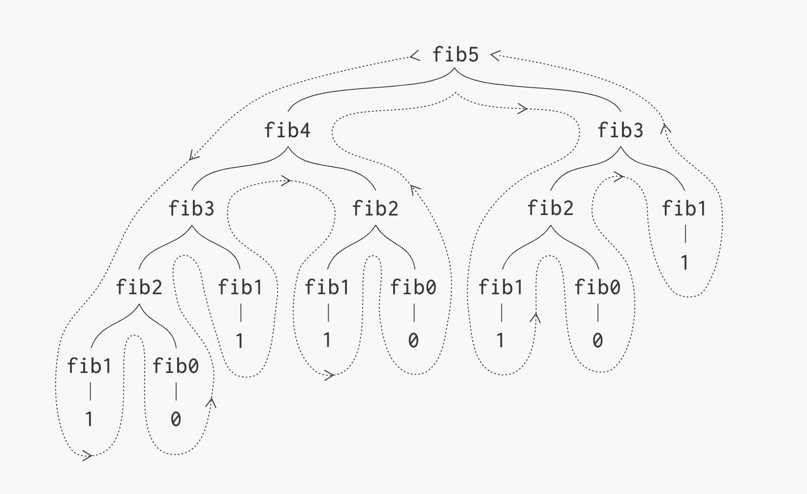

1. [Introduction](#introduction)
2. [Recursion](#recursion)
3. [Triangular Numbers](#triangular-numbers)
4. [Factorials](#factorials)
5. [Fibonacci](#fibonacci)
6. [Max subarray](#max-subarray)
12. [Conclusion](#conclusion) 


### Introduction

DP is a general technique for solving optimization, search, and counting problems that can be decomposed into sub-problems. You should consider using DP whenever you have to make choices to arrive at the solution, specifically, when the solution relates to sub-problems.
Like divide-and-conquer, DP solves the problem by combining the solutions of multiple smaller problems, but what makes DP different is that the same sub-problem may reoccur. Therefore, a key to making DP efficient is caching the results of inter- mediate computations. 

The key to solving a DP problem efficiently is finding a way to break the problem into sub-problems such that

- the original problem can be solved relatively easily once solutions to the sub¬ problems are available, and
- these sub-problem solutions are cached.

Usually, but not always, the sub-problems are easy to identify.

Before we jump into dynamic programming, let's talk about recursion as well.

### Recursion
Recursion is a common technique to define a problem or a relation where subsequent "terms" build on calculations for previous terms. For example, I could say, every number in a sequence is the sum of its preceding number and 2. I've defined a function in terms of itself ie I'm using the solution that the function found for a previous term and then determining  the subsequent term using that solution. If I had to mathematically represent this sequence (every number in a sequence is the sum of its preceding number and 2), it would look like this:

$$$
S_{N} = S_{N-1} + 2
$$$  

Which simply means:

$$$
S_{4} = S_{3} + 2
$$$

So, to get the solution for $S_{4}$, I need to know what $S_3$ is. To know what $S_3$ is, I need to know what $S_2$. See the problem here? This sequence appears to continue for eternity! No matter what value I ask you to calculate, you'd never be able to get to a solution with just the information I provided above.

We need at-least one value which is not required to be calculated. This means, that there exists a single term that is already known and we don't need to recursively call $S$ to get its value. This term is called the **base case**. Now, if I tell you this:

 $$$
 S_{N} = S_{N-1} + 2
 $$$
 $$$
 S_0 = 0
 $$$
 $$$
 S_1 = 1
 $$$  

you can easily calculate what $S_2$ is! 

This is what recursion means: repeatedly calling the function until you get to the base case and then building your solution back up from the base case. OR, you can start at the base case and move up toward the solution.

Therefore recursive functions:
- Call themselves 
- The call made to itself is to solve a smaller version of the original problem
- There's some version of the problem that doesn't need to be solved and can be returned without making another call (the base case)

### Triangular Numbers

Numbers that follow this pattern:
 
$$$
1,3,6,10,15,21,....
$$$

Therefore, `triangularNumber(2)` should return 3. To put it recursively, you'd look at it and notice that

$$$
3 = 2 + 1
$$$ 

ie, the value passed in, 2, plus the value for previous term which is 1. 

`triangularNumber(3)` should return 6, which is 3 added to the 3rd term:

$$$
6 = 3 + 3
$$$ 

In general, the first term is 1 and $n^{th}$ term is obtained by adding $n$ to the $n-1^{st}$ term. Converting that to a mathematical formula we get:

$$$
a_{1} = 1
$$$
$$$
a_{n} = a_{n-1} + n
$$$

Translating that to a function in c++, we get:

```cpp{numberLines: true}
int triangularNumbers(int num){
    if (num == 1)
        return 1;
    return (num + triangularNumbers(num - 1));
}
```

### Factorials

Another overused example is that of factorials:

$$$
0! = 1
$$$
$$$
1! = 1
$$$
$$$
2! = 2 * 1
$$$
$$$
3! = 3 * 2 * 1 
$$$

Mathematically, this is:

$$$
a_{0} = 1
$$$
$$$
a_{1} = 1
$$$
$$$
a_{n} = n * (n-1)!
$$$

Converting this to code we get:

```cpp
int Fact(int n){
    if (n == 1)
        return 1;
    return (n * Fact(n-1));
}
```

### Fibonacci

Let's start with fibonacci as an example for dp. Fibonacci series is this sequence:

$$$
F_{N} = F_{N-1} + F_{N-2}
$$$
$$$
F(0) = 0;
$$$
$$$
F(1) = 1;
$$$

Now, a simple C++ program to calculate $N^{th}$ fibonacci number:

```cpp
int Fib(int n){
    if (n == 0)
        return 0;
    if (n == 1)
        return 1;
    int ans = Fib(n-1) + Fib(n-2);
    return ans;
}
```

This approach works and is quite easy to derive. Let's run through the calls to see how we'd get the 5th fib number (5):



In the image above, notice how we're calculating fib(3) twice, and fib(2) 4 times!  This is in efficient. We can reduce the time complexity by caching results that we've already calculated. This would allow us to reduce our time from polynomial to linear at the expense of additional space:

```cpp
int DPFib(int n){
    if (n == 0)
        return 0;
    if (n == 1)
        return 1;
    
    int minusTwo = 0;
    int minusOne = 1;
    int currFib = -1;
    for (int i = 2; i <= n; i++){
        currFib = minusOne + minusTwo;
        minusTwo = minusOne;
        minusOne = currFib;
    }
    return currFib;
}
```

We only need to keep track of the previous two terms, so every time we calculate a new term, we update minus one and minus two.
 **This technique where we remembered the previous two terms instead of blindly using recursion is dynamic programming where we cached the results of already calculated values.**
 

### Max Subarray

**Find the maximum sum over all subarrays of a given array of integers.The maximum subarray is one where consecutive entries when added yield the largest sum of all subarrays.** 

Example:
```cpp
<4,3,-9,8,-1,5,6,-2,-9,7>
```

The maximum sum would be this subarray: 8 + -1 + 5 + 6 = 18 

Approach 1: Start at first index, add to this index every other element in succession and keep track of the largest sum seen in this sequence. For example, start with 4 then:

- 4 + 3
- 4 + 3 - 9
- 4 + 3 - 9 + 8
- 4 + 3 - 9 + 8 -1
 
 and so on. Repeat this process for every other element and compare the max. This would get you the max in $O(N^2)$ time. That is because you'd have to do $O(N)$ work for each element when you iterate over every other element. Can we do better?

Approach 2: We can keep a running sum and start from there. Let's see:

```cpp
        4   3   -9  8   -1  5   6   -2  -9  7
sum:    4   7   -2  6   5   10  16  14  5   12
```
Ok, so the running sum doesn't help but it's a start. Now let's think through it logically. When we look at the running sum, notice that we were good until the third element after which the running sum and the correct answer had no correlation. That makes sense because we have negative integers in the array. Just keeping the sum is not enough. 

We're looking for the largest sum right? So whenever the running sum becomes less than the current element, change the running sum's value to the current element. That is because up to the third index, we were doing the best we could but suddenly a higher number was presented and we can be 100% sure that the max sum in the array CANNOT be before 8. So ditch the running sum, and update it to the current element:

 Formally:
 
$$$
\textrm{runningSum} = max (A[i],\textrm{runningSum} + A[i]) 
$$$

Let's see how this affects our totals:

```cpp
        4   3   -9  8   -1  5   6   -2  -9  7
sum:    4   7   -2  8   7   12  18  16  7   14
```

Now, notice how the max sum, 16, occurs at the end of the sequence! This works because at each index, the max sum has 2 possibilities:
- The max sum is just the element itself
- The max sum is sum so far and the element

Since there can be only one max, we choose the larger value of the two bullet points above to determine our max.

Code:

```cpp
int MaxSum(vector<int>& A){
    int curr = A[0], sum = curr, ans = curr;
    for (int i = 1; i < int(A.size()) - 1; i++){
        curr = A[i];
        sum = max(curr,sum + curr);
        ans = max(ans, sum);
    }
    
    return ans;
}
```

Running time is $O(N)$

### Conclusion

- DP is applied usually when you need to iterate or find something from ALL combinations of a sequence