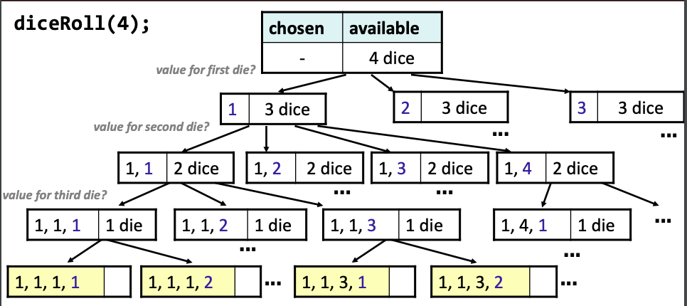
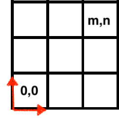
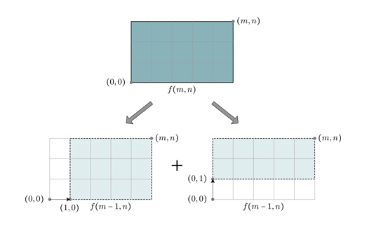

1. [Introduction](#introduction)
2. [Approach](#approach)
2. [Examples](#Examples)
    * [Sum](#sum)
    * [Factorial](#factorial)
    * [Sum of first N integers](#sum-of-first-n-integers)
    * [Self similar](#self-similar)
3. [Leap of faith](#leap-of-faith)
4. [Diagram](#diagram)
5. [Linear Recursion](#linear-recursion)
    * [Power](#power)
    * [Decimal to binary](#decimal-to-binary)
    * [Count number of bits set to 1](#count-number-of-bits-set-to-1)
    * [Reverse a string](#reverse-a-string)
    * [isPalindrome](#ispalindrome)
    * [Power set](#power-set)
    * [Alternate approach to subsets](#alternate-approach-to-subsets)
    * [Permutations](#permutations)
    * [Alternate approach to permutations](#alternate-approach-to-permutations)
    * [Permutations and Subsets](#permutations-and-subsets)
9. [Backtracking](#backtracking)
    * [Dice Rolls](#dice-rolls)
    * [Dice Rolls with target](#dice-rolls-with-target)
8. [Counting Problems](#counting-problems)
    * [Stair case](#stair-case)
    * [Manhattan Path](#manhattan-path)
    * [BasketBall Score](#basketball-score)
6. [Binary Search](#binary-search)
7. [Multiple recursion](#multiple-recursion)
    * [Is list sorted in ascending](#is-list-sorted-in-ascending-order)
    * [Find max contiguous sum](#find-max-contiguous-sum)


### Introduction
Recursion is a common technique to define a problem or a relation where subsequent "terms" build on calculations for previous terms. Our aim is to make decisions based on the existing choices we have and each time we make a choice, we obviously would reduce the number of problems that we'd have to solve. 

A lot of the definitions of recursion insist that we reduce the size of our problem. That is something that I find misleading since the aim is not to reduce the size but to make decisions and as a result of making those decisions, our problem size in-effect decreases. It is a consequence of the decision we make. 

Therefore, recursion is all about making decisions that help us reduce the input. How do we know that the problem has a recursive solution? The problem would be defined by the choices that we have and the decisions that we can make. It'd be clear that there are various choices and soon as we pick a choice, the complexity of our problem is reduced.

### Approach
We'll use this approach to break down recursive problems:
- Determine the size of the problem (how many times do we have to recurse?)
- Determine the base case (what is the smallest valid input?)
- Create a diagram (we'll see them below)
- Test!

### Examples
Let's have a look at a few examples to build some recursive intuition:

### Sum
**Say you're given this general formula**:
$$$
S_N = S_{N-1} + S_{N-2}
$$$

This is the simplest and most obvious form of recursion: the entity being defined, $S$, appears on both sides of the equation. This means that the elements are defined in terms of themselves. If we provide this information:

$$$
S_1 = 1 \textrm{ and } S_2 = 1
$$$

we've provided a complete recursive definition of the problem where:

$$$

  S_N=\begin{cases}
    1 & \text{if $N=1$}.\textrm(base case) \\ 
    1 & \text{if $N=2$}.\textrm(base case) \\
    S_{N-1} + S_{N-2} & \text{if $N>2$}. \textrm(recursive case)
    
  \end{cases}
$$$

### Factorial
Another recursive definition:
$$$
N! \text{ = } 1 \times 2 \times 3 \times 4 \times \text{. . . . } \times (N-1) \times N   
$$$

There's no explicit $N!$ on the RHS but since:

$$$
N! \text{ = } 1 \times 2 \times 3 \times 4 \times \text{. . . . } \times (N-1) \times N   
$$$

$$$
N! \text{ = } (N-1)! \times N   
$$$

we can see that this is also recursive since our final solution is a repeat of the original BUT with smaller term: $N-1$. Again, if we're to provide the trivial case where $0! = 1$ then we'll get:

$$$

  N!=\begin{cases}
    1 & \text{if $N=0$}. \\ 
    (N-1)! \times N & \text{if $N>0$}.
    
  \end{cases}
$$$

### Sum of first N integers

Let's say we have this:

$$$
S_N = 0 + 1 + 2 + 3 + 4 + ..... + N-1 + N
$$$

Then how can we break it into a recursive formula? ie, express $N$ in terms of $N-1$:

$$$
S_N = 0 + 1 + 2 + 3 + 4 + ..... + N-1 + N\\
S_N = S_{N-1} + N
$$$

Recursive definition for this function would be:

$$$

  S_N=\begin{cases}
    0 & \text{if $N=0$}.\\ 
    S_{N-1} + N & \text{if $N>0$}.
    
  \end{cases}
$$$

### Self similar
Each example we've seen above is an example of **self similar** recursion where each problem is a smaller version of itself ie self similar. Here, the smaller version is a smaller instance of the original problem.

### Leap of faith
In each of the problems above, we described the smaller version of the problem in terms of the original problem: ie:

$$$
S_N = S_{N-1} + N \\
N! = (N-1)! \times N \\
S_N = S_{N-1} + S_{N-2}
$$$

When we're writing recursive functions, we use these smaller versions to determine what to do next once we have our solution. We assume that if I want to sum up till $N$, then $S_{N-1}$ will correctly get the sum for me from $1 \text{ till } N-1$. Now, once I have that sum, what do I do with it to get to sum till $N$? Add $N$ to it! This faith that I'll get the previous sum correctly is called the leap of faith. And this is how we'll go about defining the recursive functions.

You assume that the code works for smaller problems even if you have not yet written a line of code! 

### Diagram

Let's look at a simple diagram that'll help us tackle recursive problems:

```cpp

    input                  Final solution  
      |                        | 
      |                        |        Perform recursive step  
      |                        |            here
      |                        | 
    smaller    ----->  solution for smaller 
     input                  input
```

Here, we start with the input and break it into a smaller input: ie we go from $S_N$ to $S_{N-1}$. We then get the solution of this smaller input. Now, what do we do once we get this smaller solution? We perform the recursive step and then return the final solution. 

Let's look at a few examples:

**Find the sum for all positive integers from 1 till N given N = 5**

Base case: sum is 1 if N = 1

decomposition: keep subtracting 1

```cpp

   input = 5            Final solution  = 15 
      |                        | 
      |                        |        Perform recursive step  
      |                        |            here => 10 + what gives me final answer?  
      |                        |            => 10 + N 
      4                        |            => 10 + 5
    smaller    ----->  solution for smaller 1 + 2 + 3 + 4 = 10 
     input                  input
    (input - 1)
```


```cpp
int sum(int n){
    if (n == 1) //base case
        return 1;
    return sum(n-1) + n; //recursive case
}
```

**Sum the digits of an integer: given 5432 you should return 14**

```cpp
   input 5432           Final solution  = 14
      |                        | 
      |                        |        Perform recursive step  
      |                        |            here => 12 + what gives me final answer? ie N % 10  
      |                        |            => 12 + N 
     543                       |            => 12 + 2
    smaller    ----->  solution for smaller 5 + 4 + 3 = 12 
     input                  input
    (input/10)
```

Base case: if n < 10, sum is simply n

decomposition: keep dividing by 10

```cpp
int sumDigits(int n){
    if (n < 10)
        return n;
    return (sumDigits/10) + n % 10;
}
```

So far we've seen problems where there's only a single sub-problem: ie divide n by 10 or subtract 1 from n. What if there are multiple sub-problems?

**Given an array, find the max in the array by dividing array in 2 and getting max from each half**

```cpp
   [9,2,8,4,5]           Final solution  = 9
      |                        | 
      |                        |   Perform recursive step  
      |                        |   what should I return given            
      |                        |   the 2 maxes? max(max1, max2)
     [9,2,8] ----->         solution: 9
     [4,5]  ----->         solution: 5
    smaller       
     input                  
```

Base case: when size of array is 1, return that element.

```cpp
int findMax(vector<int>A, int lo, int hi){
    if (lo == hi)
        return A[lo]; //base case
    int m = lo + (hi-lo)/2;
    int leftMax = findMax(A,lo,m);
    int rightMax = findMax(A,m+1,hi);
    return max(leftMax, rightMax);
}
```
 
### Linear Recursion
Linear recursion is the case where a method calls itself once and in each call, output of the recursive call is processed before producing or returning the current call's result.

### Power
**Given base 2 and exponent P(base, exponent), return base raised to the power**

```cpp
    P(2,4)               Final solution = 16  
      |                        | 
      |                        |        Perform recursive step  
      |                        |        8 * what = 16?        
      |                        |        8 * base = 16
    P(2,3)    ----->  solution for smaller  2 * 2 * 2 = 8 
  smaller input                  input
```

base case: when exponent = 1, return base 

decomposition: keep reducing the exponent

```cpp
int power(int base, int exp){
    if (exp == 1)
        return base;
    return power(base, exp-1) * base;
}
```

### Decimal to binary
**Given an integer in decimal, return an int representation of this decimal in binary**

At times, you have to look at all possible cases to determine the solution:
even input:
```cpp
    C(8)               Final solution = 1000  
      |                        |        Recursive step:
      |                        |        100 * 10  
      |                        |                
      |                        |        
    C(4)    ----->  solution for smaller  4 = 100
  smaller input                  input
    8/2
```

odd input:
```cpp
    C(7)               Final solution = 111  
      |                        |        Recursive step:
      |                        |        11 * 10 + 1  
      |                        |                
      |                        |        
    C(3)    ----->  solution for smaller  3 = 11
  smaller input                  input
    7/2
```

### Count number of bits set to 1

**Given an integer in base 10, count the number of bits that are set to 1 for this integer's binary representation**

The problem is quite simple. Let's say we use 5 as an example:
```text
5 in binary is 0101
```

Let's first see a simple method to convert decimal to binary:

```cpp

5/2 = 2 remainder 1
2/2 = 1 remainder 0
1/2 = 0 remainder 1
0/2 END ADD 0:    0         
```

Notice how the final result would have a 1 when the current element modulus 2 is 1. We'll take advantage of this fact. Finally, remember the problem is to **count the number of 1s in binary representation**.

**Base Case**
This occurs when we have smallest valid input: ie when n <= 1. In this case, we just return `n`. Why does this work? How many 1s are in binary representation of 1 (0001)? 1. How many 1s are in binary representation of 0 (0000)? 0. 

**Decomposition**
How are we going to make our way toward base cases? In the example above, we kept dividing n by 2, so we'll do the same. We'll decompose the problem in 2. 

**Diagram**
```cpp
    count(5)               Final solution = 2 
      |                        |        Recursive step:
      |                        |        solution + n % 2. 
      |                        |         1 + (5 % 2) = 2       
      |                        |        
    count(5/2)    ----->  solution for smaller 2 = 1 
  smaller input                  input
    5/2
```

```cpp
int numberOfBitsSetToOne(int n){
    if (n <= 1)
        return n;
    return numberOfBitsSetToOne(n/2) + n%2;
}
```

### Reverse a string
**Given a string, reverse it using recursion**

Base case: A single character, just return it
Decomposition: Keep moving back one character

```cpp
string reversal(string s, int n, string ans){
    if (n == 0){
        stringstream ss;
        string ret;
        ss << s[n];
        ss >> ret;
        return ret;
    }
    return ans + s[n] + reversal(s, n-1, ans);
}
```

### isPalindrome
**Given a string, check if it is a palindrome**
We can obviously solve this using an iterative approach but let's try using recursion:

**Base Case**
This occurs when the string has either 1 character or 2 characters

**Decomposition**
How would we check if a string is a palindrome? We need to check if:

```yaml
//A = string, n = size of string
A[0] == A[n]
A[1] == A[n-1]
A[2] == A[n-2]
....
A[n/2] == A[(n/2)+1] 
```
Therefore, on each iteration, we're decreasing the size of the string by 2, by moving on from character at the last and the first position.

**Diagram**
```cpp
    afccfa               Final solution = true
      |                        |  Recursive step:
      |                        |  compare the two removed        
      |                        |  characters. Then AND with other result 
      |                        |  return (currMatch && otherMatch)
    fccf    --------------->  true     
  smaller input               solution
```

```cpp
bool isPalindrome(string A, int i, int j){
    if (i == j)
        return true;
    if (abs(i-j) == 1){
        return A[i] == A[j];
    }
    bool currMatch = A[i] == A[j];
    bool othersMatch = isPalindrome(A, i+1, j-1);
    return currMatch && othersMatch;
}
```

We'll use two pointers, `i` and `j` to simulate removal of characters. The first base case is simple, where there's just a single character in the string. The second base case, where difference between `i` and `j` is that of 1, we're handling the case where we're given a string with just two characters:

```yaml
ab //not a palindrome
aa //is a palindrome
```
Therefore, if we're given a string with 2 characters, all we need to return is the result of a check for the characters' equality.

Running time: $O(N)$

### Power set
A power set is the set of all possible subsets. For example, if we're given:

```cpp
abc
```

then the power set would be:

```cpp
{a},{b},{c},{ab},{bc},{ac},{abc}
```

This is also known as the subset problem

**Base Case**
This would occur when we're given just a single character. In that case, we'll push that character to the `perms` vector and return.

**Problem size**
This is equal to the number of characters in the string

**Decomposition**
We'll start from the end of the string and make our way down to the first character. Therefore, the decomposition would comprise of removing one character at a time.

**Diagram**


```cpp
     abc        final solution={a},{b},{c},{ab},{bc},{ac},{abc}
      |                        |  Recursive step:
      |                        |  1. add current char to list
      |                        |  2. Add curr char to every string in list      
      |                        |  except for the current char added      
     ab     ----------------> [{a},{b},{ab}]              
```

Code: 

```cpp
void getPowerSet(string A, int n, vector<string>& powerSet){
    if (n == 0){
        powerSet.emplace_back(string() + A[n]);
        return;
    }
    getPowerSet(A, n-1, powerSet);
    powerSet.emplace_back(string() + A[n]);
    int currSize = int(powerSet.size()) - 1, i = 0;
    while (i < currSize){
        string newAdd = string() + powerSet[i] + A[n];
        powerSet.emplace_back(newAdd);
        i++;
    }
    return;
}
```

### Alternate approach to subsets

Let's have a look at another approach to solving the power set or the subset problem. Again, the problem requires us to print all subsets of a given set. To recursively solve this, we'll:

- Recursively separate an element from the original set
- We then have 2 choices: include in the current subset or not include in the current subset
- We'll then form subsets recursively including the element
- We'll then form subsets recursively excluding the element
- Continue until base case

In this problem, we're not worried about order, for example, bc is the same as cb. We're only going to concern ourselves with inclusion: do we include `a` or exclude it and so on. Therefore, given: ABC, you can have: ABC, AB, AC, A, BC, B, C, {}. Each element that I'm given has the option of being in the subset or not. 

Therefore, for each element, I need to make the possible decisions to generate all possible subsets. Therefore, there'll be a total of 2 recursive calls: one where I choose the current element and then generate other subsets and the other where I ignore the current element and generate other subsets.

On each iteration, we're **removing** the possible choices we have therefore moving toward the base case where we have nothing left to pick from. As a result, on each recursive call, we're reducing our decision space (ie elements left to be picked).  

This is the same as the [power set](/recursion#power-set) problem, but at each step we need to make a decision. This approach can be used with various different problems where we need to make decisions. 

-**Base Case**
This is when the string given to us has no characters. We'll return an empty set (or string) in this case.

-**Decomposition**
What are the choices that I have? At each step, as I make a choice, I'll get closer to the base case. In this problem, the choices that I have are: either I choose the current character in my subset, or I ignore it. The choices I have are the characters provided to me.

Notice, to get all subsets we're to come back to the current node and go down the other choice. So, if we chose `a` initially, we'll come back and go down the path where we ignore it.
Let's look at the decision tree:

```cpp

                {}
           /         \      +a ?
          a          {}   
       /    \     /     \   +b ?
     ab     a    b      {}
   /   \   /  \ /  \   /  \ +c ?
  abc  ab ac  a bc b  c   {}
```

In the diagram above, we start with an empty set. Next, we look at our decisions. The first decision we'll make is regarding `a`. There're 2 options for us with `a`. We can either choose `a` or ignore `a`. The left path of the node is taken if we choose the character, otherwise right path is taken. At each level, we have the choice of either choosing or ignoring the current character.

A quick aside into why our choices are either to pick `a` or ignore `a` and NOT whether to pick a,b or c like so: 

```cpp
    
        {}
      / |  \      
     a  b  c
    ........
```

That is because while we're coding this solution, our solution would look at each character one at a time so we can only make a decision based on what we have in front of us which would be the current character. Each decision then becomes: "Include `a` or not?" ... "Include `b` or not?". The order of characters chosen does not matter; only the membership. Therefore, possible decisions for the character in front of us are choose or ignore. 

Let's start with the function signature:

```cpp
void subsets(string input,int n, string generated){}
```

`input` is the string we're operating on, ie `abc`. 

`n` is the position we're on in the string

`generated` is the generated string based on the decisions we've made

-**Base case**
This is reached when the size of the string is less than 0. ie we're done with all characters in the string. Here, we'll simply print the solution we have so far:

```cpp
void subsets(string input,int n, string generated){
    if (n < 0)
        cout << "{"<<generated<<"}" << endl;
}
```

Next we'll look at the choices we have:
- **Choose** 

Choose the current character, ie go down the left path in the diagram above:

```cpp
void subsets(string input,int n, string generated){
    if (n < 0)
        cout << "{"<<generated<<"}" << endl;
    subsets(input, n-1, generated + string() + input[n]);
}
```

Come back to the character and go down the remaining choices which is to:

- **Ignore**

Here, we'll simply not add the current character to the generated string:

```cpp
void subsets(string input,int n, string generated){
    if (n < 0)
        cout << "{"<<generated<<"}" << endl;
    //choose by adding to subset and removing from input
    subsets(input, n-1, generated + string() + input[n]);
    //ignore by NOT adding to subset BUT just remove from input
    subsets(input, n-1, generated);
}
```

When we make the decision of choosing the current character, I'm generating the string inside the recursive call. So when that call returns, we're back at our original string.

Finally, running the program above, would generate this output:

```cpp
{ABC}
{AB}
{AC}
{A}
{BC}
{B}
{C}
{}
```

If you're more inclined to see a version where the removal and addition is more explicit, here it is:

```cpp
void forcedRemovalSubset(string soFar, string rest){
    if (rest == ""){
        cout << soFar << endl;
        return;
    }
    //choose
    //Pick next available character from rest,
    //add it to soFar and remove it from rest
    forcedRemovalSubset(soFar + rest[0] , rest.substr(1));
    //ignore
    //Pick next available character from rest,
    //DON'T add it to soFar but just remove it from rest
    forcedRemovalSubset(soFar, rest.substr(1));
}
```

### Permutations
**Given a string, print all possible permutations of the string**. Example:

```cpp
string A = "ABC"
//permutations:
ABC
ACB
BAC
BCA
CAB
CBA
```

**Base case**: We've got just a single character, in which case, we'll print out that character and be done

**Size of the problem**: Number of characters in the string

**Decomposition**: Discard (or ignore) one character and permute the remaining characters. Keep ignoring until you reach the last character

code:

```cpp
void generatePerms(string s, int n){
    if (n == s.size() - 1){
        cout << s << endl;
        return;
    }
    for (int i = n; i < int(s.size()); i++){
        swap(s[i], s[n]);
        generatePerms(s, n+1);
    }
    return;
}
```

Base is case is checking if the parameter, `n`, is equal to the size of the string, in which case we've got nothing to do but print the string. Secondly, notice above that we've got the loop running from `n` till the end of the string and not from 0 till end of string. This is to simulate the "ignore" effect. Finally, we recurse on next available character.

### Alternate approach to permutations

Let's have a look at another approach to solve permutations. You can think of the process as removing a character from our available set and adding it to the permuted string. Next, we call the function recursively to generate permutations for the remainder of strings. Therefore, we'll have to keep track of 2 strings: `soFar` which will represent all the permutations and `rest` which'll represent our decision space. Initially this is what we'll have:

```cpp
       soFar  rest 
        "", "ABC"
```

Then, we'll pick an element from the `rest` string and place in the `soFar` string. Then, our strings would look like:

```cpp
           soFar  rest 
            "", "ABC"
            /
        "A", "BC"
```

We then pick the next available character from `rest` and append to `soFar`. We keep doing this until rest is empty:

```cpp
           soFar  rest 
            "", "ABC"
            /
        "A", "BC"
         /
   "AB", "C"
      /
"ABC", ""
```

This'll be our base case: when we have no more decisions to make. Next, we return back to the call where we had another option and continue recursing. 

Here's the code representing the logic we discussed above:


```cpp{numberLines: true}
void permute(string soFar, string rest){
    if (rest == "")
        cout << soFar << endl;
    for (int i = 0; i < rest.size(); i++){
        //Grabbing the next available character
        string next = soFar + rest[i]      
        //Removing this character from decision space
        //which is the string rest
        string remaining = rest.substr(0,i) + rest.substr(i+1);
        permute(next, remaining);
    }
}
```

We're using the loop to pick between the choices we have. On each call, we're adding the picked element to our result and removing this choice from the decision space since we don't want to repeat the decision. 

Having said that, if you run this code, you'll notice that it'll start with the first character of the string you provide and print all permutations starting with that first character. Next, it'll do the same for the second character and so on until the string `rest` is empty.

### Permutations and Subsets
Let's recap what we learned from permutation and subsets problems:
- Both problems use the idea of **choices**: you include an element or not include an element
- Depths of their respective trees represent the number of decisions made and width represents number of available options per decision
    - In the subset problem, we have 2 branches at each level since for each option we have 2 options: choose or ignore
    - In the permutations problem, the first call has `n` branches because we have `n` different options for the first position. At the next level, we have `n-1` branches and so on until we're out of elements to pick from.
- Therefore, the tree in each case represents the decisions that are to be made and we move toward the point where there are no more decisions to be made
- These problems are considered to be exhaustive where we look at every possible option. We can improve our run time by pruning the tree when certain criteria is provided that'll rule out some part of the tree.


### Backtracking
Now permutations and subsets problems used exhaustive search which explores ALL possible options at our disposal. Some times, it is wise to prune the recursive calls we make based on some criteria so that we don't perform unnecessary calculations. We can choose to go down a path by making certain choices and if we fail, we can backtrack to our starting point and go down another **valid** avenue. This is called backtracking.

The term backtracking literally means to retrace your steps. In recursive backtracking, we use this technique to solve types of problems where the final solution depends on the constraints provided. Backtracking is used when we're given "choices" at each step and we're to make a decision on whether to include or exclude the choice at hand and then proceed. If we make a choice and go down a path and realize that the choices made so far don't take us to the solution, we **backtrack** to a previous choice and proceed from there.

For some problems, the choices would be the available inputs and for others, the choices would be an actual decision on whether to pick and element or ignore it. This distinction will be clear when we see a few examples. For now, let's look at the mental model we'll follow to use backtracking as a technique:

(1) Determine what the base step is and what you'll be doing at that base step.

For **decomposition**, we'll ask ourselves these questions
(2) Find what choices we have at each step, ie what are the different options for next step?

(3) For each valid choice:
   - Make the choice and explore remaining solution recursively. Pass relevant information to the next call.
   - Once that call returns, undo the changes you made. Restore everything to the way it was before making this choice
   - In some problems, the undo step is not needed since we're not doing an exhaustive search
   
How are these analogous to the decomposition steps we've seen so far? Remember, decomposition is used to make the input smaller and it guides us toward the base case. Therefore, At each step, as I make a choice, I'll get closer to the base case. 

In pseudocode, here is what backtracking does:

```cpp
bool Solve (configuration conf){
    //base case
    if (no more choices){
        return (conf in goal state);
    }
    
    for (all available choices){
        try one choice c;
        //If this choice worked out, you're done!
        if (Solve (conf with choice c made)){
            return true;
        }        
        //Undo the changes
        unmake choice c;
    }
    //No solution found
    return false;
}
```

- We return true at the base case therefore not needing to go over EVERY possibility, once we hit a true, we're done
- Inside the for loop, we make a choice and then call the method, `Solve` again

### Dice rolls
**Given a number dies, n, generate ALL possible outcomes of rolling those dies**

For example, if we're given 2 dies, we can have 11, 12, 13, 14, 15, 16, 21, 22 ...

Why does this qualify as a backtracking problem? Because we have choices that we need to make. Now, we need to decide whether this is an ignore/choose choice diagram or pick every choice diagram. Obviously, the problem asks for ALL possible outcomes, so we need to choose EVERY possible choice. 

Let's start with the template we discussed above:
(1) Base Step: This is when we don't have any more dice to roll: here, we'll print our result

(2) Choices: the value of die that I can choose

(3) Relevant info to be passed to next call: the numbers rolled so far.

(4) Undo the decision: remove the rolled number 

Let's code this:

Function signature:
- `n` for the number of dies we're asked to roll
- `soFar` the numbers rolled so far

```cpp
void diceRolls(int n, string soFar){}
```

Let's add the base case:

```cpp
void diceRolls(int n, string soFar){
    if (n == 0){
        cout << soFar << endl;
        return;
    }
}
```

Now, we need to determine how we'll represent the choices. `n` would be used to represent the number of dies and for each die we can go from 1 to 6.

```cpp
void diceRolls(int n, string soFar){
    if (n == 0){
        cout << soFar << endl;
        return;
    }
    
    for (int i = 1; i <=6; i++){
        stringstream ss;
        ss << i;
        string curr;
        ss >> curr;
        soFar += curr;
    }    

}
```

We've made the choice, now we need to make a recursive call to get remaining choices:

```cpp
void diceRolls(int n, string soFar){
    if (n == 0){
        cout << soFar << endl;
        return;
    }
    
    for (int i = 1; i <=6; i++){
        stringstream ss;
        ss << i;
        string curr;
        ss >> curr;
        soFar += curr;
        diceRolls(n-1,soFar);
    }    

}
```

Finally, we need to undo the change we did before we made the recursive call: ie remove the roll added:

```cpp
void diceRolls(int n, string soFar){
    if (n == 0){
        cout << soFar << endl;
        return;
    }
    
    for (int i = 1; i <=6; i++){
        stringstream ss;
        ss << i;
        string curr;
        ss >> curr;
        soFar += curr;
        diceRolls(n-1,soFar);
        soFar.pop_back();
    }    
}
```

That's it! We've basically made the following choices on each iteration:

[Image credit](https://web.stanford.edu/class/archive/cs/cs106x/cs106x.1192/lectures/Lecture10/Lecture10.pdf)

### Dice Rolls with Target
Let's say you're given a number of dies and want to print all rolls that add up to a target. How would that modify our code? Well, the solution is similar to what we had for the origin dice roll problem but here're the additions:
- Our base case will check to see if the chosen elements so far have sum equal to the target
- We'll use a vector to keep track of `chosen` elements
- We'll add checks to make sure we don't go down unnecessary paths. For example, if target is 4, we can ignore values of 5 and 6 for dice rolls

Here's the code:

```cpp
void getRolls(int dice, int target, vector<int>& chosen){
    if (dice == 0){
        //getSum is helper function that adds elements
        //in the vector and returns their sum
        if (getSum(chosen) == target)
            printVec(chosen); //to print vector
    }
    
    int sum = getSum(chosen);
    for (int i = 1; i <= 6; i++){
        if (sum + i <= target){
            chosen.push_back(i);
            getRolls(dice-1, target, chosen);
            chosen.pop_back();
        }
    }
}
```

### Counting Problems
Recursion can be used in combinatorics which is a mathematical field that deals with counting. This section will deal with such algorithms and we'll see how recursion will help us solve these types of problems. 

### Stair case

**Given that you can climb either 1 step at a time or 2 steps at a time, count the number of ways to climb 6 steps**

**Base case**: This is the smallest valid step that you can take: ie you can take 1 step and the number of ways to take 1 step is 1 (by taking just 1 step). Another smallest valid step is that you can take 2 steps. How many ways can you take 2 steps? Well, you can take 1 step twice (way 1) or you can take 2 steps once (way 2):

```cpp
if (n == 1)
    return 1;
if (n == 2)
    return 2;
```

**Decomposition**: Well, you've got 6 steps that you need to climb. In this case, let's look at our choice diagram:

```cpp
                    6
                  /   \         
                 4     5
               /   \ /  \
              2    3 3   4
```

The diagram above shows that we start with 6 steps. Next, the left choice is when we take 2 steps and the right choice is when we take 1 step. On each step, we're to add the number of ways that we've calculated so far. Therefore, we'll be cascading up as we calculate the number of ways for each step. Then, it is clear to see that total number of ways that we can get to 6 steps is by adding the total number of ways we can get to 4 steps and the total number of ways we can get to 5 steps:

$$$
Ways(6) = Ways(5) + Ways(4) \\
\textrm{ie } F(n) = F(n-1) + F(n-2)
$$$

**Size of problem** Size is equal to the number of steps we're asked to climb ie 6 in our example

Now, the code becomes quite simple:

```cpp
int numberOfWaysToClimb(int n){
    if (n == 1)
        return 1;
    if (n == 2)
        return 2;
    int oneBack = numberOfWaysToClimb(n-1);
    int twoBack = numberOfWaysToClimb(n-2);
    return oneBack + twoBack;
}
```

### Manhattan Path
**Given a grid and a target point in that grid at (m,n), find the number of ways to get from 0,0 to m,n.**

Example:



Legal moves are denoted by the red arrows. 

**Base case**: This is when either `m` or `n` is 0. In that case, we're either along the x axis (if n is 0) or y axis (if m is 0). In both these scenarios, the number of ways to get to the point is 1: ie move in one direction until the point is reached

**Decomposition**: Here, we decompose our problem based on `m` and `n`:

[Image credit](https://learning.oreilly.com/library/view/introduction-to-recursive/9781351647175/)

Where we want to reduce `m` by one and keep `n` the same or reduce `n` by one and keep `m` the same. 

Finally, we add up all the ways up to `m` and `n`:

```cpp
int ManhattanPath(int m, int n){
    if (m == 0 || n == 0)
        return 1;
    int reducedMWays = ManhattanPath(m-1, n);
    int reducedNWays = ManhattanPath(m, n-1);
    return reducedMWays + reducedNWays;
}
```

### Basketball Score

**In a game of basketball a team can score points in three different ways. A “free throw” scores one point, a “field goal” is worth two points, and a successful shot beyond the “three-point” line scores three points. Write a program that determines the number of ways a team can reach n points. For example, there are four ways to score three points: 1+1+1, 1+2, 2+1, and 3. Thus, assume that the order in which the points are scored matters.**

- **Base case**
This the minimum number of valid points that can be scored:
- 1 point: there's only 1 way to score 1 point
- 2 points: there're two ways to score 2 points: 1+1 and 2
- 3 points: there're four ways to score 3 points: 1+1+1, 1+2, 2+1, and 3

-**Decomposition**
We'll break the problem down using our decision tree since it is easier to see all the different decisions that we need to make. Say, we're asked to get number of ways to go up till 4:


```cpp
                     4
                  /  |  \         
                 3   2   1 Add at each level
               / |   |  
              2  1   1      
```

-**Size of problem**
The size of the problem obviously depends on the score that we need to generate. 

```cpp
int bbPts(int n){
    if (n == 1)
        return 1;
    if (n == 2)
        return 2;
    if (n == 3)
        return 4;
    return bbPts(n-1) + bbPts(n-2) + bbPts(n-3);
}
```

### Binary Search
**A common algorithm that uses recursion is binary search: given a sorted list, find the given element. If present, return the index, otherwise, return -1.**

Base case: array is comprised of 1 item: perform check and return

Decomposition: keep searching in each half based on mid value

We're given the element we need to find. We'll calculate the value of `mid` and look in either half based on the element at A[mid]:

```cpp
int binarySearch(vector<int>A, int f, int lo, int hi){
    if (hi < lo)
        return -1;
    int mid = lo + (hi-lo)/2;
    if (A[mid] == f){
        return m;
    } else if (A[mid] < f){
        return binarySearch(A, f, mid+1, hi);
    } else {
        return binarySearch(A, f, lo, mid-1);
    }
}
```

### Multiple recursion
So far we've seen linear recursion where the recursive function is called once in each recursive call. Multiple recursion, as the name suggests, has multiple recursive calls present in the method and the solutions from these multiple calls are combined, extended or modified to get the solution for the main problem. Divide and conquer fall in this category. Here, we'll see a few problems that use multiple recursion:

### Is List sorted in ascending order
**Given a list (array), return true if it is sorted in ascending order, false otherwise**

**Base case**
There's only one element in the list where we can return true

**Size of problem**
`n`: number of elements

**Decomposition**
We can check one element at a time OR divide the list into two halves and check. We'll use the latter approach.

**Example**
Happy path example:
[1,3,7,9]

```cpp
    1,3,7,9               Final solution = true 
      |                        |        Recursive step:
      |                        |        return (left && right);
      |                        |         
      |                        |        
    1,3     ------------>  left = true;          
    7,9     ------------>  right = true; 
```
Failing example:
[1,8,6,9]

```cpp
    1,8,6,9               Final solution = false 
      |                        |        Recursive step:
      |                        |        return (left && right);
      |                        |         
      |                        |        
    1,8     ------------>  left = true;          
    6,9     ------------>  right = true; 
```

It is clear from the failing example that simply testing the two sub-lists isn't enough. In the top row our solution shows that the final answer should be false but in the recursive step our logic returns a true. How do we handle this? We need to check the two elements that are across sub-lists: ie last element of left and first element of right. This changes our solution:


```cpp
    1,8,6,9               Final solution = false 
      |                        |        Recursive step:
      |                        |        bool cross = leftLast && rightFirst;
      |                        |        return left && cross && right;
      |                        |        
    1,8     ------------>  left = true;          
    6,9     ------------>  right = true; 
```

```cpp
bool isAscending(vector<int>A, int lo, int hi){
    if (hi <= lo)
        return true;
    int m = lo + (hi - lo)/2;
    bool left = isAscending(A, lo, m);
    bool cross = (A[m] < A[m+1]);
    bool right = isAscending(A, m+1, hi);
    return left && cross && right;
}
```

Here's the recursive definition for this function:

$$$

  T(n)=\begin{cases}
    1 & \text{if $n$ <= $1$}.\\ 
    2T(n/2) + 1 & \text{if $n>1$}.
    
  \end{cases}
$$$

Therefore, running time is $O(N)$

### Find max contiguous sum
**Given an array, find the maximum continuous sum**

(There's an algorithm called Kadane's algorithm that solves this problem in $O(N)$ time BUT we'll be using divide and conquer to better understand how this technique works!)

Example: [-1, 3, 4, -5, 9, -2] Then the max contiguous sum is 3 + 4 -5 + 9 = 11

**Base case**
When there's just one element, max is that one element

**Size of problem**
Number of elements in the array

**Decomposition**
We'll break this problem in two halves, recursively solve each half and then do some more analysis.

**Diagram**
```cpp
  -1,3,4,-5,9,-2        Final solution = 3 + 4  -5 + 9 = 11 
      |                        |        Recursive step:
      |                        |        max(leftSum,rightSum)
      |                        |         
      |                        |        
    -1,3,4     ------------>  leftSum = 6           
    -5,9,-2    ------------>  rightSum = 2; 
```

As the diagram above shows, just getting the max from each half is not enough. What if the max spans the two halves like this case? Well, in that case, we need to start on each side of mid and get the max sum. We'll then add the two sums that cross the middle:

```cpp
  -1,3,4,-5,9,-2        Final solution = 3 + 4  -5 + 9 = 11 
      |                        |        Recursive step:
      |                        |        <crossingSumCalculation>
      |                        |         
      |                        |        
    -1,3,4     ------------>  leftSum = 6           
    -5,9,-2    ------------>  rightSum = 2; 
```

Here's the crossing sum calculation:
```cpp
            <--------   -------->
                    m   m+1
            -1  3   4   -5  9   -2
runningSum: 6   7   4   -5  4   2 
```

We're to get the max sum from both halves and add the two:

```cpp
            <--------   -------->
                    m   m+1
            -1  3   4   -5  9   -2
runningSum: 6   7   4   -5  4   2 
Return 7 + 4 = 11
```

Finally, our diagram is:

```cpp
  -1,3,4,-5,9,-2        Final solution = 3 + 4  -5 + 9 = 11 
      |                        |        Recursive step:
      |                        |        max (leftSum,rightSum,crossingSum)
      |                        |        max(6,2,11)
      |                        |        
    -1,3,4     ------------>  leftSum = 6           
    -5,9,-2    ------------>  rightSum = 2; 
```

code:

```cpp{numberLines: true}
int middleSum(vector<int>& A, int lo, int m, int hi){
    int leftMax = A[m], leftSum = A[m], rightSum = A[m+1], rightMax = A[m+1];
    for (int i = m-1; i >= lo; i--){
        leftSum = leftSum + A[i];
        if (leftSum > leftMax)
            leftMax = leftSum;
    }
    for (int i = m + 2; i <= hi; i++){
        rightSum = rightSum + A[i];
        if (rightSum > rightMax)
            rightMax = rightSum;
    }
    return leftMax + rightMax;
}

int maxSum(vector<int> A, int lo, int hi, int maximum){
    if (hi <= lo){
        return (A[hi] > maximum ? A[hi] : maximum);
    }
    int m = lo + (hi-lo)/2;
    int left = maxSum(A, lo, m, maximum);
    int right = maxSum(A, m+1, hi, maximum);
    int midSum = middleSum(A, lo, m, hi);
    return max(left, max(right, midSum));
}
```

Running time:
- In the `maxSum` function:
    - the base case takes constant time
    - calculation of `m` takes constant time
    - call to get `left` takes $T(n/2)$ time
    - call to get `right` takes $T(n/2)$ time
    - call to get `midSum` takes $\theta(n)$ time
    - return takes constant time

Therefore, overall running time is:

$$$
2T(n/2) + \theta(n)
$$$

This is the same as merge sort therefore the running time is $O(nlogn)$ 

### Conclusion
- Use recursion if
    - The problems is worded such that the final solution is made up solutions to smaller problems
    - There is some sort of counting involved: ie count the number of ways, or get the total number of ways etc
- Sometimes, you can represent recursion using decomposition diagram (linear recursion mostly) and at other times you'd need a choice diagram (counting problems: stair climb)
