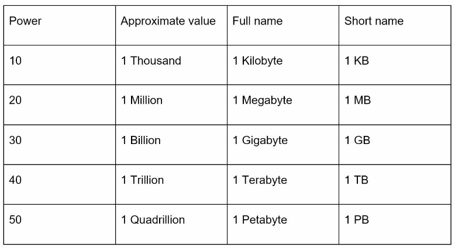
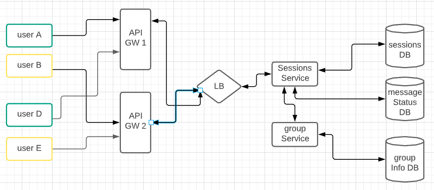

1. [System Design](#system-design)
2. [Generating Unique IDs in a distributed Env](#generating-unique-ids-in-a-distributed-env)
3. [Back of the envelope Estimation](#back-of-the-envelope-estimation)
4. [Storing Images](#storing-images)
5. [Allowing users to chat](#allowing-users-to-chat)
6. [Design Chat Messaging](#design-chat-messaging)
7. [Design Rate Limiting](#design-rate-limiting)
    * [Sharing data between servers](#sharing-data-between-servers)
    * [TCP vs UDP](#tcp-vs-udp)
8. [Design Distributed Message Queue](#design-distributed-message-queue)
100. [Useful architectures](#useful-architectures)

### System Design
Let's look at some example system designs and see the trade-offs between various approaches that can be used to design a solution.  

### Generating Unique IDs in a distributed Env
Say you're given a distributed system and are asked to come up with a function to generate a globally unique ID for this system. On a single machine, this is simple, you just auto-increment an ID in your DB and you have a unique ID on each call. However, this isn't possible if you have a distributed system with multiple machines and multiple partitions.

- **Requirements**
- The ID should be unique across EVERY call and EVERY machine.
- It should consist of numerical values only
- It should fit into 64-bit
- Should be able to generate over 10,000 unique IDs/sec

First thing that comes to mind is to use UUID that can be generated independently without coordination between servers. However, UUIDs are 128 bits long and are non-numeric: Example: 09c93e62-50b4-468d-bf8a-c07e1040bfb2. 

Another thing that can be done is to have a centralized generator. Every time you need to generate a new ID, this centralized generator is called. The issue here is that this is a single point of failure and is not scalable. It definitely won't be able to handle 10,000 unique IDs/sec. 

How about we just use time as the id? Hmm, ok so if I have distributed environment, it is possible that two different nodes are called at the same time to generate the id. Even if they're not, different nodes might have different clocks that might result in collisions. 

But the idea of using time does look promising ie using epoch time. Now to make it unique, we can add in the IP address of the server. So, we might be able to concatenate the IP address of the server with the epoch time and get a unique id right? Well, what if we invoke this function in the same microsecond on the same server? That would cause a collision!  Maybe we can use a counter that gets incremented every time this function is called. So something like: `epochTime_serverID_counter`. Hmm, this would work!

But wait a second, what if the machine reboots? What if it crashes, has to re-boot and then start generating unique ids again. Since the machine crashed, our counter would reset to 0. Maybe we can store this counter somewhere and have the server read it from there on restart. And every time it is incremented, we can push the counter value to this store! This sounds like a job for Redis! Yup, that would work. So, our unique ID would be: `epochTime_serverID_counter`

- **Approach**
Ok, so we've deiced to have the unique ID like so: `epochTime_serverID_counter`. Now, we can have up to 64 bits in the id. Epoch time takes 41 bits. How do I know that? Convert an epoch time value to binary and count the number of bits. For example,  epoch time 1288834974657 converted to binary is:

```cpp
0       epoch time                      40
10010110000010100100011010000001111000001
```
We're still left with 23 bits. For the sake of having a more robust id, we can add the datacenter id to the unique ID as well! So our unique ID would be:

`epochTime_dataCenterID_serverID_counter`

Alright, so we've got 41 bits for epoch time. Next up, we can use 5 bits for our dataCenterID. This would result in a total of 32 data centers because $2^5 = 32$. Our ID now is:

```cpp
0       epoch time                     40   44 
1001011000001010010001101000000111100000100001
                                        dcID
``` 

Next, we add serverId which we can have a bit longer, say 6 bits meaning we can have 64 servers in a datacenter:

```cpp
0       epoch time                     40   44    45 
1001011000001010010001101000000111100000100001000001
                                        dcID serverID
``` 

and finally the remaining bits can be the counter value meaning $2^19$ giving us a total of 524288 per machine:

```cpp
0       epoch time                     40   44    45   counter       64
10010110000010100100011010000001111000001000010000010000000000000000001
                                        dcID serverID
``` 

### Types of Encoding
Encodings could be base36 ([a-z ,0-9]) or base62 ([A-Z, a-z, 0-9]). If you use base 36 encoding and have a 4 character string, possible number of strings would be: $36^4$. For 62 base encoding and 7 character string: $62^7$.

### Back of the envelope Estimation
Below is a table explaining the data volume unit 

 [Image Credit](https://www.amazon.com/System-Design-Interview-insiders-Second/dp/B08CMF2CQF)

Some common facts: 

                   • Memory is fast but the disk is slow.
                   • Avoid disk seeks if possible.
                   • Simple compression algorithms are fast.
                   • Compress data before sending it over the internet if possible.
                   • Data centers are usually in different regions, and it takes time to send data between them.
                   

 [Image Credit](https://www.amazon.com/System-Design-Interview-insiders-Second/dp/B08CMF2CQF)
             
- Single Character requires 1 byte
- Integer requires 4 bytes 
- Media requires 1 MB 

For variable length strings, we need this calculation to determine the number of bytes needed:
$$$
\textrm{Total size (in Bytes)} = ((\textrm{Number of bits used to encode a single character}) * (\textrm{Number of characters}))/8
$$$

If we are using ASCII encoding, we need 8 bits to encode each character, so Number of bits used to encode a single character = 8
If we are using UNICODE encoding, we need 16 bits to encode each character, so Number of bits used to encode a single character = 16.

### Storing Images
Say, for example, that you're creating an image sharing system (instagram like service) and need to store images for your service. How/where would you store them? You have 2 options: use a DB and store images as blob (binary large object) or use a distributed file system and have a DB store location of images for each user. Let's have a look at the pros and cons for each:

**Why DB**
- DB is ACID (Atomicity, Consistency, Isolation, Durability) compliant
- DB provides data integrity between the file and its metadata (Files can be deleted from FS causing database integrity to be compromised.)
- Much easier to perform backups as the entire process is built-in
- Database indexes perform better than file system trees when more number of items are to be stored
- File deletion and updates becomes simpler as opposed to a File System.( In the case of FS, we first delete the mapping from DB and then delete the image from FS as well. There’s this extra overhead to make sure that the file in FS is deleted. In DB this operation is atomic)

**Why DFS**
- If your application uploads a large number of high-quality images, your DB backups become huge, which can have a significant impact on the makes replication speed
- FS can be accessed via a CDN without allowing the user’s request to go through your Application and Database layers
- Needless to say, this will be cost-effective as compared to DB
- Easier in cases where files has to be shared with third-party providers
- Storing/retrieving BLOB in DB is a heavy process
- For the application in which the images will be used requires streaming performance, such as real-time video playback

The case against DB is that for images, we aren't ever going to use ACID properties (those are for financial transactions etc). DFS is cheaper as compared to a DB, it is faster and a DFS can make use of a CDN to render our images for us. 

### Allowing users to Chat
XMPP, an Extensible Messaging and Presence Protocol, helps to build a real time chat application. XMPP provides an open and decentralized instant messaging services. As the name indicates, it is a highly extendable protocol formerly known as Jabber protocol. To exchange the information, XMPP uses Extensible Markup language (XML) as the base format. XMPP uses the TCP protocol to maintain connections between 2 clients.

A simple XMPP architecture consists of a server and two clients. Every client acts as the part of a common domain where the servers can also communicate for the purpose of routing between domains.

 [Image Credit](https://blog.mirrorfly.com/xmpp-use-cases-for-scalable-chat-platform/)

XMPP protocol is a great fit for Real-Time Web applications like Live News, Interactive web page, web games and web chat. It provides inbuilt security with multiple layers. Moreover, here the users need to authenticate both host servers as well as messages to prevent the risk of spoofing. Eventually, it eradicates the fear of spamming. Now, when you use XMPP in a chat service, you need to able to keep track of the user ids and connection ids that are being used by each user. To do so, you can have a **connection service** that maintains this information for you:


XMPP uses XML to exchange data between client and server. Whenever a client connects to an XMPP server using a chat application, they transmit information with each other which is also known as an XML “Stanza”. Stanza is a basic unit of communication in XMPP. In XMPP based communication, there are 3 types of stanzas:

- Message: Used to exchange messages.
- Presence: Used to exchange online and subscription status.
- IQ (Info/Query): Used to control dynamic settings of the communication that is controlled over the server.

Advantages of XMPP:
- **Extensible**: XMPP can be used to send different message types including text, pictures, videos, and audios
- **Decentralized architecture**: Which means anyone can set up an XMPP server
- **Security**: XMPP allows developers to set up a separate storage server which can have its own encryption and security standards
- **Flexibility**: Can connect to non-Jabber programs as well using special gateway services

Disadvantages of XMPP:
- **No default way to assure message delivery**: XMPP doesn’t provide the ability to request message delivered confirmation by default. The developers need to set up message receipts manually.
- **Slow speed**: The decentralized architecture of XMPP allows anyone to run his/her own server, however, it does eat up on the speed of the connection.

We've already talked about websockets and WS can also be used to implement chat based applications. Let's see its advantages and disadvantages:
- **Speed**: With a centralized and persistent communication connection, WebSockets are the fastest online communication method.
- **Unlimited open sessions**: There can be an unlimited number of user sessions on a single app.

Disadvantages:
- **Low Security**: Although WebSockets utilize WSS(Websockets of SSL), the technology is still new and prone to attacks like XSS and DDOS.

### Design Chat Messaging

Requirements:
- Users should be able to chat in a group
- Sent + Delivered + Read Receipts
- Person online/last seen
- Chat history (permanent vs temporary)

Ok, let's start with the basic setup of how we want our users to interact. We'll use an API gateway which'll capture requests from client:


Ok, to allow your users to chat, you'd have to keep track of connection information (port etc). This information can be stored in API GW. However, the downside is that our system would not be loosely coupled. We want a separate microservice that handles all sessions for us, leaving the gateway to concentrate on the edge functions. So, the flow would now be that the user connects to our API gateway, and API gateway calls the **sessions** service. 

Our sessions service would reside behind a load balancer and we'll have multiple servers working as sessions service. The service would also need access to a DB where it'll be able to update/retrieve user session information. For that, we'll create a table with userID, connectionInfo etc. The type of data store I'm thinking here is a MySQL DB since we'll be able to quickly access user info by creating an index n userId. So, our architecture will look like so:


Now, when userA wants to connect to userB, userA will send a **sendMessage(B)** request to our API GW. API GW will forward that request to sessions service. Sessions service will determine which port userB is connected to (using information from the DB) and will forward request to the appropriate connection and thus sending the message to userB. Now, to actually send message to userB (client) from server, we can use multiple techniques as discussed earlier such as long polling, ajax, websockets or xmpp etc. Now in the [chat](#allowing-users-to-chat) section, we compared XMPP and websockets. One advantage of using websocket is that it allows for unlimited open sessions over TCP. Since we're looking for group chat as well, we'll go ahead and use websockets that communicate via TCP. 

One requirement for our chat app is that the sender should be able to see sent + delivered + read receipts. In order for us to be able to show to userA that the message was **sent**, we can send a response back from session service to gateway and back to userA that the message will be sent when possible. In order to store this information, we'll need another DB for our sessions service. This new DB will hold our message statuses. This flow is shown with red arrows in the diagram below:


When userB opens the app on his/her end, the message gets sent to userB's phone. Upon receipt of the message, userB's phone should respond with a message saying that he/she received the message from userA. At that point, the **delivered** confirmation flows from userB to API GW to sessions service and back to userA. This done via a TCP acknowledgement. userB will send back the info that it received message from userA and sessions service will deliver the delivered receipt by looking up the box where userA's connection resides and will send the confirmation back to userA. This flow is shown via blue arrows in the diagram below:


The flow above is also relevant for read receipt. UserB would send another message back to our API GW once the app is opened and message is read on userB's phone. This will result in a **read** receipt being sent back to userA. 

**Let's tackle our third requirement: last seen/online**

Let's say userB is online and is chatting with others. UserB will send requests to our API GW via websocket connection. Remember, we've already stored userB's connection information in our sessionsDB. We can look at the sessionsDB to see whether connectionInfo related to userB is actually showing an active connection or that the connection has been closed. If it is active, we can show to userA and userC that userB is online. If connection is inactive, we need another method to determine last-seen. For last-seen, as userB exits the app, we can send a message from userB's phone to API GW and to session service saying that userB has terminated the connection. We can store this information in a Redis cache data store with userB's uniqueID and time-stamp. So, any time userA or userC clicks on userB's profile, we can display the last time userB was online: which would be the time-stamp when userB exited the app. 

**Group messaging**

Let's focus now on group messaging. Earlier we talked about two users chatting; what if we have multiple users who're part of different groups. In the diagram below, users are grouped as shown and each user can be connected to a different API GW (remember, API gateway is also a service which needs to be highly available and resilient):


Now, here's the requirement: we want to determine if the user we just received a message from is present in a group and if the user is sending a message to a group or a single individual. If it is a single individual, the API GW call would be **sendMessage(B)** as we discussed earlier. If it is a group message, message received on the API GW would be **sendGroupMessage(userA)**, meaning userA is trying to send a group message to his/her group. Now, we need to determine what group userA is trying to send message to. If we ask session service to determine that for us, we'd be coupling our functionality so instead, let's have a separate service that handles our group information. Let' call this group service. What will now happen is that if sessionService receives a group message request, it'll call groupService to determine all the users in that group. GroupService will return that information, which'll be connectionID (remember webSockets allow us to have multiple chat sessions), where we'll be able to send message to the entire group. Group service needs to have a data-store where it converts groupId to connectionIds since different users can be on different connections:



There're multiple improvements to consider: 
- We can have consistent hashing for db partitioning 
- We can have MQs between services to handle failures
- We can have retry mechanisms between services 

### Design Rate Limiting
The requirement here is simple: we already know what rate limiting is. Now, we need to design it for our service. Before we begin to design rate limiting for a distributed system, let's design one for a single server first! 

On a single machine, all we need to worry about is the fact that there's a rules DB that'll hold the criteria based on which we'll throttle requests. We'll have a background process that routinely polls the DB for these rules and saves them in memory. Disk reads are expensive so we'll look to save these rules in memory using Redis cache. We'll check these cached rules whenever a request comes in and determine whether the request can be allowed through or not. Next, we'll have to keep track of the number of requests made by the client (we can id the client based on their IP address for example) in the past second and check whether the threshold has been reached as set in cache. If threshold is not reached, we can allow our request to go through. If threshold is met or exceeded, we have 3 options: drop the request, send back a 503 (service unavailable) or 429 (too many requests), or add the request to a queue and wait for threshold to recede:


Cool, we've got the design working for a single server. Now, let's talk about a simple algorithm to handle rate limiting: bucket algorithm. Here, the idea is simple, we will have a bucket with **tokens** and each request from the client will deplete the tokens present in the bucket. Each second that passes, we'll refill the bucket with one token. Now, say for example we start with one server that has one bucket with 4 tokens (ie 4 requests per second) and receives 5 requests within the first second, first 4 requests will be allowed to go through while the final request will be throttled. That's the algorithm in a nutshell for a single server. 

Now imagine, these requests coming in to our distributed microservice. Say we have 3 hosts handling our requests, where each host is initially allotted 4 tokens. Since our architecture would have load balancers, say our requests are distributed like so:


We've already consumed our allotted 4 requests for the current 1 second window and should throttle all remaining requests HOWEVER, each of our hosts still has tokens available. How do we make sure we throttle our requests? We need the hosts to talk to each other and determine the TOTAL number of tokens consumed:


Host A should see that the other 2 hosts used up 3 tokens in total and reduce that number from its available tokens. Hosts B and C should do the same leaving us with this:


How do we share information between hosts? 

### Sharing data between servers

We need to be able to share data/information between servers. Let's look at the different ways we can do this:

### Message Broadcasting
- One approach to keep track of the number of tokens used is for each host to tell every other host everything. ie tell everyone everything aka **full mesh topology**:


How would each server know what other servers are present in the network? You could use [service discovery mechanisms](#services-service-discovery) already discussed earlier! However, this approach is not scalable. 

- Another good approach is to  use [gossip protocol](#handling-failures) that we've already seen earlier. 

- Another approach is to use a distributed, in-memory cache store (Redis) to keep track of the count for each server's used tokens. This will be eventually consistent but is highly scalable:


- Another approach is to have a single leader in the cluster that'll gather information from all the nodes, calculate the total number of tokens used and return the number back to each node. In this setup, all nodes will only talk to one master node. This can be done using consensus algorithms such as paxos and raft implemented in a coordination service: 


- We can also have a multi-leader setup where we can have multiple leaders coming to the same answer and then broadcasting it to their respective followers:


Out of all the approaches above, we'll use in-memory Redis cache. Here're all the approaches that can be taken to allow server-server communication:


Now, in order for the servers to talk to each other, they have to use some sort of communication protocol. We have 2 types of protocols: TCP and UDP

### TCP vs UDP

A service host in a network has to choose how it wants to send its data to other hosts in the network. That choice boils down to sending the data reliably vs unreliably. Reliably, data is sent via TCP:

**TCP**

This is the most widely used protocol to send data between hosts. If there is a network blip and some segments are lost along the way, TCP can recover them ie user experience is not compromised. Here're TCP attributes: 

- Slower than UDP
- Guarantees delivery of data
- Guarantees that packets will be delivered in the order they were sent

**UDP**

UDP has no error handling or sequencing that comes with TCP. UDP has one goal which is to send data fast! All the checks done by TCP are time consuming. UDP is chosen for live data transmission such as voice calls, live gaming etc.

- Faster than TCP
- No data delivery guarantee
- No order guarantee

So which one should we use for our rate limiting solution? If we're more interested in accuracy and are ok with a hit to our performance, we'll go with TCP. If we're ok with inaccurate counts BUT want lightning fast responses, we'll go with UDP. 

### Design Distributed Message Queue
Let's understand what synchronous and asynchronous communication is before we begin designing distributed message queues:

**Synchronous Communication**

- When producer makes a call to a consumer, waits for a response.
- Easier and faster to implement.
- Harder to deal with consumer service failures. Need to think about when and how to properly retry failed requests? How not to overwhelm consumer service with too many requests? How to deal with a slow consumer service host?

**Asynchronous Communication**

Queue : Producer sends data to that component and exactly one consumer gets this data to a short time after.
It is distributed, because data is stored across several machines.
Do not confuse queue with topic. In case of a topic, message goes to all subscribers. In case of a queue, message is received by only one consumer.

Let's look at our functional and non-functional requirements:

**Functional Requirements**

- sendMessage(messageBody)
- receiveMessage()

**Non-Functional Requirements**

- Scalable (handle load increases, more queues, messages)
- Highly Available (tolerates hardware / network failures)
- Highly Performant (single digit latency, both send and receive operations are fast)
- Durable (once submitted, data is not lost, so persistent)

As always, let's start with a single producer and consumer and a single machine. On a single machine, all we'll be doing is receiving a request from a single producer that posts to our queue. Our application sits behind a single LB that knows the address of our single server. Our single server would be connected to one DB that'll be responsible for keeping track of the metadata of our queue. For the sake of record-keeping, we'll save each message received in a separate DB that is accessed via our message service:


Here, a single producer produces a message and sends it over to our virtual IP address. This virtual IP resolves to our single LB that then forwards the request to produce the message to our API gw. API gw then checks to see whether the user is authorized to publish to the queue and upon successful authorization, allows the message to move on to metadata service first. In our metadata service, we check to see whether the queue being pushed to is already created, if so, we return the name of the queue back to API GW, otherwise, we create this new queue and return this information back to our API gw. Once API gw receives this response back, it will call the message service where it'll hold the message for the queue. For durability, we'll also store this message in  message service's DB. 

To improve this experience and add reliability, availability and higher durability, we'll create a distributed service. We'll start by addressing the first point of failure in our architecture: the load balancer.

A single load balancer would be overwhelmed if there are too many requests. Therefore, we need multiple load balancers using VIPs and have these load balancers partitioned so that each LB can receive a request and forward it to our API GW:


Next, we need our metadata service to be durable: ie our queue metadata needs to be replicated among various nodes. For this, we can either use single leader replication, multi-leader replication or leaderless replication. We'll use leaderless replication so that we have multiple nodes available to receive our metadata and distribute it among all available nodes. Single leader replication is not scalable since it introduces a SPOF: the single leader. 

We also want our data to be partitioned among nodes. Now, if our data is small enough to be stored on a single machine, we'll have every node in our cluster hold this information for us. So, when a request comes in to our metadata service to fetch information for a particular queue, we can send the request to any of the nodes. However, if our queue metadata gets too large, we'll have to partition this data using a hash ring with virtual nodes. To determine where each data queue metadata lives, we can either use client side discovery with each node updating a registry with its information or have each node ping every other node its information (gossip protocol).  


### Useful architectures
 - [WordPress on AWS](https://docs.aws.amazon.com/whitepapers/latest/best-practices-wordpress/reference-architecture.html)
 - [Netflix active-active](https://netflixtechblog.com/active-active-for-multi-regional-resiliency-c47719f6685b)
 