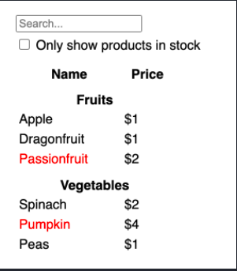
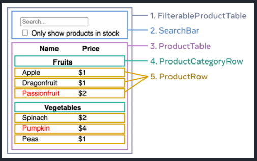

**My notes as I walk through [react docs](https://beta.reactjs.org/learn)**

- [Introduction](#introduction)
- [Local Setup](#local-setup)
- [React Basics](#react-basics)
  - [Classes](#classes)
  - [Components](#components)
  - [JSX](#jsx)
  - [Conditional Rendering](#conditional-rendering)
  - [Rendering Lists](#rendering-lists)
  - [Responding to Events](#responding-to-events)
- [React State](#react-state)
  - [Props vs States](#props-vs-states)
- [Using Hooks](#using-hooks)
- [Sharing data between components](#sharing-data-between-components)
- [Let's Design!](#lets-design)
  - [Break UI into a component hierarchy](#break-ui-into-a-component-hierarchy)
  - [Create a static version in React](#create-a-static-version-in-react)
  - [Static to Interactive](#static-to-interactive)
  - [Identify Where State Should live](#identify-where-state-should-live)
  - [Inverse Data Flow](#inverse-data-flow)
  - [Final Design](#final-design)
- [ENDED HERE](#ended-here)

## Introduction

React is a JavaScript-based UI development library. Facebook and an open-source developer community run it. Although React is a library rather than a language, it is widely used in web development. At its very core, React is a library for rendering user interfaces (UI). UI is built from small units like buttons, text, and images. React lets you combine them into reusable, nestable components.From web sites to phone apps, everything on the screen can be broken down into components.

When you write something like:

```jsx
const tag = <h1>Hello</h1>;
```

what you're essentially doing is this:

```jsx
const tag = React.createElement("h1", {}, "Hello");
```

Later down the road, we'll see the `<App />` tag in `index.js` which parses all our components and creates the completed DOM for us. This means that when `<App />` has done parsing, there's just a huge object of React elements.

Then how is React able to construct actual divs and p tags out of it? Meet `ReactDOM` which recursively creates nodes depending on their 'type' property and appends them to the DOM. For more details, checkout [this](https://www.freecodecamp.org/news/react-under-the-hood/) great write-up

## Local Setup

Here's how to create your own react-app so that you can follow along:

```tsx
npx create-react-app my-app --template typescript
```

Using the command above, you can start a new TypeScript app using templates. That's defined by appending `--template typescript` to the creation command above. This will create your react app called `my-app` in the directory where you ran this command. Once the project is created, remove all the fluff except for:

```tsx
index.html, App.tsx,
index.tsx, .gitignore,
package.json, tsconfig.json
```

All other files can be safely deleted.

Then run these commands:

```tsx
npm install && npm run build
npm start
```

Your app should automatically be launched using your default browser at the URL: `http://localhost:3000/`. To setup `prettier` and format on save, check out [this](https://scottsauber.com/2017/06/10/prettier-format-on-save-never-worry-about-formatting-javascript-again/) write up. Let's dive in and see how react works!

## React Basics

Let's check out some basic concepts in react:

### Classes

In pure JS, a simple class would look like this:

```jsx
class Person {
    constructor(firstName, lastName){
        this.firstName = firstName;
        this.lastName = firstName;
    }

    getName(){
        return this.lastName + ',' this.firstName;
    }
}
var newPerson = new Person('John', 'Doe');
console.log(newPerson.getName());
```

This is quite a simple class with a constructor that expects two strings and a `getName()` method that returns concatenated strings. In addition, the `extends` keyword can be used to inherit from another class. The more specialized class (ie more specific class), inherits from the more general class. For example, if there's a specific type of person represnted by a class, say a soccer player, then it can `extend` the `Person` class like so:

```jsx
class Person {
    constructor(firstName, lastName){
        this.firstName = firstName;
        this.lastName = firstName;
    }

    getName(){
        return this.lastName + ',' this.firstName;
    }
}
class SoccerPlayer extends Person{
    getPosition(){
        return 'attacker';
    }
}

var newPlayer = new SoccerPlayer('John', 'Doe');
console.log(newPlayer.getName()); //Prints John Doe
console.log(newPlayer.getPosition()); //Prints attacker
```

We pass the name to SoccerPlayer's constructor above even though there's no specific constructor for the soccerPlayer class. That's because it extends the Person class which does have a constructor. That is why, we're able to call getName and print the name.

Similarly, here's a class "component" in React:

```jsx
import React, { Component } from "react";

class App extends Component {
  render() {
    return (
      <div>
        <h1>Welcome to React</h1>
      </div>
    );
  }
}
export default App;
```

We've defined a class component called `App` that's a more specific version of class `Component` which is imported from the `react` package (the import statement). Similar to how we were able to use `getName()` for our player above, the `App` component can use methods exposed by `Component` class such as `componentDidMount()`, `setState()` etc.

As a side note, you can have your react classes in either a `.ts` file (pure typescript file) or `.tsx` file (allows use of jsx tags). You can use `tsx` instead of `ts` with very little difference. `tsx` obviously allows the usage of `jsx` tags inside TypeScript, but this introduces some parsing ambiguities that make tsx slightly different. Since we're using explicit tags, we'll use `.tsx`.

### Components

I used the term class component above. Let's formally understand what a component is:
React apps are made out of components. A component is a piece of the UI (user interface) that has its own logic and appearance. A component can be as small as a button, or as large as an entire page.

React components are JavaScript functions that return markup:

```tsx
function MyButton() {
  return <button>Click me</button>;
}
```

This component can then be "nested" inside another component. For our demo, we'll use the bare bones App component we created earlier:

```tsx
import React, { Component } from "react";

function MyButton() {
  return <button>Click me</button>;
}

class App extends Component {
  render() {
    return (
      <div className="App">
        <h1>Welcome to React</h1>
        <MyButton />
      </div>
    );
  }
}

export default App;
```

Snippet above shows 2 common methods to create a component in react: class (App) vs functions (MyButton). The export default keywords specify the main component in the file which is `App` in our example.

Notice that `<MyButton />` starts with a capital letter. That’s how you know it’s a React component. React component names must always start with a capital letter, while HTML tags must be lowercase.

### JSX

The markup syntax you’ve seen above is called JSX. It is optional, but most React projects use JSX for its convenience.

JSX is stricter than HTML. You have to close tags like `<br />`. Your component also can’t return multiple JSX tags. You have to wrap them into a shared parent, like a `<div>...</div>` or an empty `<>...</>` wrapper.

JSX lets you put markup into JavaScript. Curly braces let you “escape back” into JavaScript so that you can embed some variable from your code and display it to the user. For example, this will display user.name:

```jsx
return <h1>{user.name}</h1>;
```

You can also “escape into JavaScript” from JSX attributes, but you have to use curly braces instead of quotes. For example, className="avatar" passes the "avatar" string as the CSS class, but src={user.imageUrl} reads the JavaScript user.imageUrl variable value, and then passes that value as the src attribute:

```jsx
return ;
```

### Conditional Rendering

In React, there is no special syntax for writing conditions. Instead, you’ll use the same techniques as you use when writing regular JavaScript code. For example, you can use an if statement to conditionally include JSX:

```jsx
let content;
if (isLoggedIn) {
  content = <AdminPanel />;
} else {
  content = <LoginForm />;
}
return <div>{content}</div>;
```

If you prefer more compact code, you can use the conditional ? operator. Unlike if, it works inside JSX:

```jsx
<div>{isLoggedIn ? <AdminPanel /> : <LoginForm />}</div>
```

When you don’t need the else branch, you can also use a shorter logical && syntax:

```jsx
<div>{isLoggedIn && <AdminPanel />}</div>
```

### Rendering Lists

You will rely on JavaScript features like for loop and the array map() function to render lists of components. For example, let’s say you have an array of products:

```jsx
const products = [
  { title: "Cabbage", isFruit: false, id: 1 },
  { title: "Garlic", isFruit: false, id: 2 },
  { title: "Apple", isFruit: true, id: 3 },
];
```

Inside your component, use the map() function to transform an array of products into an array of <li> items:

```jsx
const listItems = products.map((product) => (
  <li
    key={product.id}
    style={{
      color: product.isFruit ? "magenta" : "darkgreen",
    }}
  >
    {product.title}
  </li>
));
```

Here's our original `App` component making use of lists and displaying the items:

```jsx
import React, { Component } from "react";

function MyButton() {
  return <button>Click me</button>;
}

function DisplayList() {
  const products = [
    { title: "Cabbage", isFruit: false, id: 1 },
    { title: "Garlic", isFruit: false, id: 2 },
    { title: "Apple", isFruit: true, id: 3 },
  ];

  const listItems = products.map((product) => (
    <li
      key={product.id}
      style={{
        color: product.isFruit ? "magenta" : "darkgreen",
      }}
    >
      {product.title}
    </li>
  ));
  return <div>{listItems}</div>;
}

class App extends Component {
  render() {
    return (
      <div className="App">
        <h1>Welcome to React</h1>
        <MyButton />
        <DisplayList />
      </div>
    );
  }
}

export default App;
```

### Responding to Events

You can respond to events by declaring event handler functions inside your components. Let's update the button component to display 'You clicked me' when clicked:

```jsx
function MyButton() {
  function handleClick() {
    alert("You clicked me!");
  }

  return <button onClick={handleClick}>Click me</button>;
}
```

Notice how onClick={handleClick} has no parentheses at the end! Do not **_call_** the event handler function: you only need to **_pass it down_**. React will call your event handler when the user clicks the button.

## React State

Often, you’ll want your component to “remember” some information and display it. For example, maybe you want to count the number of times a button is clicked. To do this, add state to your component.

First, import `useState` from React:

```jsx
import { useState } from "react";
```

Now you can declare a **_state variable_** inside your component:

```jsx
function MyButton() {
  const [count, setCount] = useState(0);
```

You will get two things from `useState`: the current state (count), and the function that lets you update it (`setCount`). You can give them any names, but the convention is to call them like `[something, setSomething]`.

The first time the button is displayed, count will be 0 because you passed 0 to `useState()`. When you want to change state, call `setCount()` and pass the new value to it. Clicking this button will increment the counter.

I've cleaned up our `App` component to only use `MyButton` component. Inside `MyButton`, I'm using `useState` with initial value as 0. `onClick` calls `handleClick` that increments the `count` using `setCount`. I show the current value of `count` as part of button's text:

```jsx
import React, { Component } from "react";
import { useState } from "react";

function MyButton() {
  const [count, setCount] = useState(0);
  function handleClick() {
    setCount(count + 1);
  }
  return <button onClick={handleClick}>Clicked count: {count}</button>;
}

class App extends Component {
  render() {
    return (
      <div className="App">
        <h1>Welcome to React</h1>
        <MyButton />
      </div>
    );
  }
}

export default App;
```

Clicking this button will increment the counter. React will call your component function again. This time, count will be 1. Then it will be 2. And so on. If you render the same component multiple times (ie multiple buttons), each will get its own state. Try clicking each button separately:

```jsx
import React, { Component } from "react";
import { useState } from "react";

function MyButton() {
  const [count, setCount] = useState(0);
  function handleClick() {
    setCount(count + 1);
  }
  return <button onClick={handleClick}>Clicked count: {count}</button>;
}

class App extends Component {
  render() {
    return (
      <div className="App">
        <h1>Welcome to React</h1>
        <MyButton />
        <MyButton />
        <MyButton />
        <MyButton />
      </div>
    );
  }
}

export default App;
```

Notice how each button “remembers” its own count state and doesn’t affect other buttons. More [here](https://beta.reactjs.org/apis/usestate) on `[useState]`.

### Props vs States

The two are very different:

- Props are like arguments you pass to a function. They let a parent component pass data to a child component and customize its appearance. For example, a Form can pass a color prop to a Button.

- State is like a component’s memory. It lets a component keep track of some information and change it in response to interactions. For example, a Button might keep track of isHovered state.

Props and state are different, but they work together. A parent component will often keep some information in state (so that it can change it), and pass it down to child components as their props. It’s okay if the difference still feels fuzzy on the first read. It takes a bit of practice for it to really stick!

## Using Hooks

Functions starting with use are called Hooks. useState is a built-in Hook provided by React. You can find other built-in Hooks in the [React API reference](https://beta.reactjs.org/apis). You can also write your own Hooks by combining existing ones.

Hooks are more restrictive than regular functions. You can only call Hooks at the top level of your components (or other Hooks). If you want to `useState` in a condition or a loop, extract a new component and put it there.

## Sharing data between components

In the previous example, each button had its own independent counter, but what if you wanted all buttons to always show the sum of all clicks? This is where you'd want to share data between buttons and would want them to always update together.

To make all buttons display the same count and update together, you need to move the state from the individual buttons “upwards” to the closest component containing all of them. In this example, it is `App`. This means, you'd have to move state up from `MyButton` to `App`. If, however, you tried adding state to your `App` component as is:

```jsx
class App extends Component {
  render() {
    const [count, setCount] = useState(0);
    return (
      <div className="App">
        <h1>Welcome to React</h1>
        <MyButton />
        <MyButton />
        <MyButton />
        <MyButton />
      </div>
    );
  }
```

you'd see this error (more on it [here](https://reactjs.org/docs/hooks-rules.html)):

```text
React Hook useState cannot be called in a class component.
React Hooks must be called in a React function component or
a custom React Hook function.
```

We'd have to convert our `App` from:

```jsx
class App extends Component{...}
```

to

```jsx
export default function App(){...}
```

and remove `render()`. Here's the new `App` component:

```jsx
import { useState } from "react";

function MyButton() {
  const [count, setCount] = useState(0);
  function handleClick() {
    setCount(count + 1);
  }
  return <button onClick={handleClick}>Clicked count: {count}</button>;
}

export default function App() {
  return (
    <div className="App">
      <h1>Welcome to React</h1>
      <MyButton />
      <MyButton />
      <MyButton />
      <MyButton />
    </div>
  );
}
```

Now, we can add state to `App`:

```jsx
export default function App() {
  const [count, setCount] = useState(0);

  function handleClick() {
    setCount(count + 1);
  }

  return (
    <div className="App">
      <h1>Welcome to React</h1>
      <MyButton />
      <MyButton />
      <MyButton />
    </div>
  );
}
```

Then, pass the state down from `App` to each `MyButton`, together with the shared click handler. You can pass information to MyButton using the JSX curly braces:

```jsx
export default function App() {
  const [count, setCount] = useState(0);

  function handleClick() {
    setCount(count + 1);
  }

  return (
    <div className="App">
      <h1>Welcome to React</h1>
      <MyButton count={count} onClick={handleClick} />
      <MyButton count={count} onClick={handleClick} />
      <MyButton count={count} onClick={handleClick} />
    </div>
  );
}
```

Finally, `MyButton` will take in the count and handler and update itself accordingly (also note how I had to define the type as any for `count` and `onClick`):

```jsx
function MyButton({ count, onClick }: { count: any, onClick: any }) {
  return <button onClick={onClick}>Clicked count: {count}</button>;
}
```

Here's the complete code:

```jsx
import { useState } from "react";

function MyButton({ count, onClick }: { count: any, onClick: any }) {
  return <button onClick={onClick}>Clicked count: {count}</button>;
}

export default function App() {
  const [count, setCount] = useState(0);

  function handleClick() {
    setCount(count + 1);
  }

  return (
    <div className="App">
      <h1>Welcome to React</h1>
      <MyButton count={count} onClick={handleClick} />
      <MyButton count={count} onClick={handleClick} />
      <MyButton count={count} onClick={handleClick} />
    </div>
  );
}
```

When you click the button, the `onClick` handler fires. Each button’s onClick prop was set to the handleClick function inside `App`, so the code inside of it runs. That code calls setCount(count + 1), incrementing the count state variable. The new count value is passed as a prop to each button, so they all show the new value. This is called “lifting state up”. By moving state up, we’ve shared it between components.

## Let's Design!

Let's walk through the thought process of building a searchable product data table with React. Imagine we have a JSON API configured that returns this data when queried:

```jsx
[
  { category: "Fruits", price: "$1", stocked: true, name: "Apple" },
  { category: "Fruits", price: "$1", stocked: true, name: "Dragonfruit" },
  { category: "Fruits", price: "$2", stocked: false, name: "Passionfruit" },
  { category: "Vegetables", price: "$2", stocked: true, name: "Spinach" },
  { category: "Vegetables", price: "$4", stocked: false, name: "Pumpkin" },
  { category: "Vegetables", price: "$1", stocked: true, name: "Peas" },
];
```

Here's what it should be displayed as:



### Break UI into a component hierarchy

We'll start by drawing boxes around every component and subcomponent in the mockup and naming them. If your JSON is well-structured, you’ll often find that it naturally maps to the component structure of your UI. That’s because UI and data models often have the same information architecture—that is, the same shape. Separate your UI into components, where each component matches one piece of your data model.

There are five components on this screen:



Here's how we'll label each component:

- `FilterableProductTable` (grey) contains the entire app.
- `SearchBar` (blue) receives the user input.
- `ProductTable` (lavender) displays and filters the list according to the user input.
- `ProductCategoryRow` (green) displays a heading for each category.
- `ProductRow` (yellow) displays a row for each product.

If you look at `ProductTable` (lavender), you’ll see that the table header (containing the “Name” and “Price” labels) isn’t its own component. This is a matter of preference, and you could go either way. For this example, it is a part of `ProductTable` because it appears inside the `ProductTable’s` list. However, if this header grows to be complex (e.g., if you add sorting), it would make sense to make this its own `ProductTableHeader` component.

Now that you’ve identified the components in the mockup, arrange them into a hierarchy. Components that appear within another component in the mockup should appear as a child in the hierarchy:

- `FilterableProductTable`
  - `SearchBar`
  - `ProductTable`
    - `ProductCategoryRow`
    - `ProductRow`

### Create a static version in React

Now that you have your component hierarchy, it’s time to implement your app. The most straightforward approach is to build a version that renders the UI from your data model without adding any interactivity… yet! It’s often easier to build the static version first and then add interactivity separately. Building a static version requires a lot of typing and no thinking, but adding interactivity requires a lot of thinking and not a lot of typing.

To build a static version of your app that renders your data model, you’ll want to build components that reuse other components and pass data using props. Props are a way of passing data from parent to child. (If you’re familiar with the concept of state, don’t use state at all to build this static version. State is reserved only for interactivity, that is, data that changes over time. Since this is a static version of the app, you don’t need it.)

You can either build “top down” by starting with building the components higher up in the hierarchy (like FilterableProductTable) or “bottom up” by working from components lower down (like ProductRow). In simpler examples, it’s usually easier to go top-down, and on larger projects, it’s easier to go bottom-up.

Let's have a look at the code for creating a "staic only" version of our product.

- Let's start with the smallest element: `ProductRow`:

`ProductRow` is the row that displays our product's name as red if it is not stocked and its price. In order to display this information, it'd need access to the current product that's being processed. For example:

```jsx
{ category: "Vegetables", price: "$1", stocked: true, name: "Peas" },
```

Once it is determined whether the item is stocked or not, we create a table row and add the name (with the right color) and price to the table:

```jsx
function ProductRow({ product }: { product: any }) {
  const name = product.stocked ? (
    product.name
  ) : (
    <span style={{ color: "red" }}>{product.name}</span>
  );

  return (
    <div>
      <tr>
        <td>{name}</td>
        <td>{product.price}</td>
      </tr>
    </div>
  );
}
```

- Let's next see `ProductCategoryRow`:

This is a special case of a row which ONLY displays what the category name is. To perform its function, all it needs is the category for the current item being processed. Notice however that in the final table, this category is only listed ONCE: when the category type changes. This special condition will be handled elsewhere. This is what our `ProductCategoryRow` looks like:

```jsx
function ProductCategoryRow({ category }: { category: string }) {
  return (
    <tr>
      <th colSpan={2}>{category}</th>
    </tr>
  );
}
```

- `ProductTable`

This is where we need to display the two headers: `Name` and `Price` and display our list of items. For this, we need the list of products. This is also where we'll add the logic for displaying category name (using a simple `lastCategory` check). We'll aggregate all our rows in a list called `rows` and then finally return it from this component:

```jsx
function ProductTable({ products }: { products: [any] }) {
  const rows: any[] = [];
  let lastCategory = "";
  products.forEach((product, i) => {
    if (product.category !== lastCategory) {
      rows.push(
        <ProductCategoryRow
          category={product.category}
          key={product.category}
        />
      );
    }
    rows.push(<ProductRow product={product} key={product.name} />);
    lastCategory = product.category;
  });

  return (
    <table>
      <thead>
        <tr>
          <th colSpan={2}>Name</th>
          <th colSpan={2}>Price</th>
        </tr>
        <tbody>{rows}</tbody>
      </thead>
    </table>
  );
}
```

- `SearchBar`

This one is simple: all we need here is a search bar with some pre-populated text and a checkbox with some text:

```jsx
function SearchBar() {
  return (
    <form>
      <input type="text" placeholder="Search..." />
      <br />
      <br />
      <label>
        <input type="checkbox" /> Only show products in stock
      </label>
    </form>
  );
}
```

- `FilterableProductTable`

The top level component receives the products array and is responsible for calling all the components with this info:

```jsx
function FilterableProductTable({ products }: { products: any }) {
  return (
    <div>
      <SearchBar />
      <ProductTable products={products} />
    </div>
  );
}
```

Most logical approach is to first display the `SearchBar` and then display the `ProductTable` because that's how our UI is designed.

Final `App` component that gets rendered is setup like so:

```jsx
const PRODUCTS = [
  { category: "Fruits", price: "$1", stocked: true, name: "Apple" },
  { category: "Fruits", price: "$1", stocked: true, name: "Dragonfruit" },
  { category: "Fruits", price: "$2", stocked: false, name: "Passionfruit" },
  { category: "Vegetables", price: "$2", stocked: true, name: "Spinach" },
  { category: "Vegetables", price: "$4", stocked: false, name: "Pumpkin" },
  { category: "Vegetables", price: "$1", stocked: true, name: "Peas" },
];

export default function App() {
  return (
    <div className="App">
      <FilterableProductTable products={PRODUCTS} />
    </div>
  );
}
```

Our static table is now completed! We still need to take of the checkbox and searchbox functionalities.

Before moving on, let's see the static UI code in its entirety:

```jsx
function FilterableProductTable({ products }: { products: any }) {
  return (
    <div>
      <SearchBar />
      <ProductTable products={products} />
    </div>
  );
}

function ProductRow({ product }: { product: any }) {
  const name = product.stocked ? (
    product.name
  ) : (
    <span style={{ color: "red" }}>{product.name}</span>
  );

  return (
    <div>
      <tr>
        <td>{name}</td>
        <td>{product.price}</td>
      </tr>
    </div>
  );
}

function ProductCategoryRow({ category }: { category: string }) {
  return (
    <tr>
      <th colSpan={2}>{category}</th>
    </tr>
  );
}

function ProductTable({ products }: { products: [any] }) {
  const rows: any[] = [];
  let lastCategory = "";
  products.forEach((product, i) => {
    if (product.category !== lastCategory) {
      rows.push(
        <ProductCategoryRow
          category={product.category}
          key={product.category}
        />
      );
    }
    rows.push(<ProductRow product={product} key={product.name} />);
    lastCategory = product.category;
  });

  return (
    <table>
      <thead>
        <tr>
          <th colSpan={2}>Name</th>
          <th colSpan={2}>Price</th>
        </tr>
        <tbody>{rows}</tbody>
      </thead>
    </table>
  );
}

function SearchBar() {
  return (
    <form>
      <input type="text" placeholder="Search..." />
      <br />
      <br />
      <label>
        <input type="checkbox" /> Only show products in stock
      </label>
    </form>
  );
}

const PRODUCTS = [
  { category: "Fruits", price: "$1", stocked: true, name: "Apple" },
  { category: "Fruits", price: "$1", stocked: true, name: "Dragonfruit" },
  { category: "Fruits", price: "$2", stocked: false, name: "Passionfruit" },
  { category: "Vegetables", price: "$2", stocked: true, name: "Spinach" },
  { category: "Vegetables", price: "$4", stocked: false, name: "Pumpkin" },
  { category: "Vegetables", price: "$1", stocked: true, name: "Peas" },
];

export default function App() {
  return (
    <div className="App">
      <FilterableProductTable products={PRODUCTS} />
    </div>
  );
}
```

### Static to Interactive

To make the UI interactive, you need to let users change your underlying data model. You will use state for this.

Think of [state](#react-state) as the minimal set of changing data that your app needs to remember. The most important principle for structuring state is to keep it DRY (Don’t Repeat Yourself). Figure out the absolute minimal representation of the state your application needs and compute everything else on-demand. For example, if you’re building a shopping list, you can store the items as an array in state. If you want to also display the number of items in the list, don’t store the number of items as another state value—instead, read the length of your array.

Now think of all of the pieces of data in this example application:

- The original list of products
- The search text the user has entered
- The value of the checkbox
- The filtered list of products

Which of these are state? Identify the ones that are not:

- **Does it remain unchanged over time? If so, it isn’t state.**
- **Is it passed in from a parent via props? If so, it isn’t state.**
- **Can you compute it based on existing state or props in your component? If so, it definitely isn’t state!**
- What’s left is probably state.

Let’s go through them one by one again:

- The original list of products

This is passed from parent, so it is a prop and not a state (`filterText`)

- The search text the user has entered

Seems to be state since it changes over time and can’t be computed from anything

- The value of the checkbox (`inStockOnly`)
  Seems to be state since it changes over time and can’t be computed from anything

- The filtered list of products
  Can be calculated from the state, so not state!

Therefore, our two pieces of states are: `filterText` and `inStockOnly`

### Identify Where State Should live

Which component should be responsible for storing and updating the two states? ie who **_owns_** the state. Remember: React uses one-way data flow, passing data down the component hierarchy from parent to child component. It may not be immediately clear which component should own what state.

You can figure it out by following these steps:

For each piece of state in your application:

1. Identify every component that renders something based on that state.
2. Find their closest common parent component—a component above them all in the hierarchy.
3. Decide where the state should live:
   1. Often, you can put the state directly into their common parent.
   2. You can also put the state into some component above their common parent.
   3. If you can’t find a component where it makes sense to own the state, create a new component solely for holding the state and add it somewhere in the hierarchy above the common parent component.

In the previous step, you found two pieces of state in this application: the search input text, and the value of the checkbox. In this example, they always appear together, so it is easier to think of them as a single piece of state.

As a refresher, here's what our component hierarchy looks like:

- `FilterableProductTable`
  - `SearchBar` ---> Both pieces of state are here
  - `ProductTable`
    - `ProductCategoryRow`
    - `ProductRow`

Since both states appear in the same component, we can use it as a single piece of state. Now let’s run through our strategy for this state:

1. Identify every component that renders something based on that state.

`ProductTable` component needs it to filter the table
`SearchBar` component needs to display that state: we will display `filterText` in the search bar and show a checked mark if `inStockOnly` is checked or not.

2. Find their closest common parent component—a component above them all in the hierarchy.

Closest common parent would be `FilterableProductTable`

3. Decide where the state should live: --> `FilterableProductTable`
   1. Often, you can put the state directly into their common parent.
   2. You can also put the state into some component above their common parent.
   3. If you can’t find a component where it makes sense to own the state, create a new component solely for holding the state and add it somewhere in the hierarchy above the common parent component.

So it is decided! We'll add the two states in `FilterableProductTable`!

Let's update our `FilterableProductTable` to setup our 2 states and pass both to `SearchBar` and `ProductTable`:

```jsx
import React from "react";

function FilterableProductTable({ products }: { products: any }) {
  const [filterText, setFilterText] = React.useState("");
  const [inStockOnly, setInStockOnly] = React.useState(false);

  return (
    <div>
      <SearchBar filterText={filterText} inStockOnly={inStockOnly} />
      <ProductTable
        products={products}
        filterText={filterText}
        inStockOnly={inStockOnly}
      />
    </div>
  );
}
```

Next, update `SearchBar` to show the passed `filterText` value as placeholder and `inStockOnly` to determine if we need to show a check-mark or not:

```jsx
function SearchBar({
  filterText,
  inStockOnly,
}: {
  filterText: string,
  inStockOnly: boolean,
}) {
  return (
    <form>
      <input type="text" value={filterText} placeholder="Search..." />
      <br />
      <br />
      <label>
        <input type="checkbox" checked={inStockOnly} /> Only show products in
        stock
      </label>
    </form>
  );
}
```

We're just passing the values from parent to children, we're not updating anything as of now. To help us change the state according to userinput, we need to support inverse data flow:

### Inverse Data Flow

Currently your app renders correctly with props and state flowing down the hierarchy. But to change the state according to user input, you will need to support data flowing the other way: the form components deep in the hierarchy need to update the state in `FilterableProductTable`.

If you try to type or check the box in the example above, you’ll see that React ignores your input. This is intentional. By writing `value={filterText}`, you’ve set the value prop of the input to always be equal to the `filterText` state passed in from FilterableProductTable. Since filterText state is never set, the input never changes.

You want to make it so whenever the user changes the form inputs, the state updates to reflect those changes. The state is owned by `FilterableProductTable`, so only it can call `setFilterText` and `setInStockOnly`. To let `SearchBar` update the `FilterableProductTable’s` state, you need to pass these functions down to `SearchBar`. Notice how only `SearchBar` needs to update the state and NOT `ProductTable` so we pass functions to only `SearchBar` and NOT `ProductTable`:

```jsx
import React from "react";

function FilterableProductTable({ products }: { products: any }) {
  const [filterText, setFilterText] = React.useState("");
  const [inStockOnly, setInStockOnly] = React.useState(false);

  return (
    <div>
      <SearchBar
        filterText={filterText}
        inStockOnly={inStockOnly}
        onFilterTextChange={setFilterText}
        onInStockOnlyChange={setInStockOnly}
      />
      <ProductTable
        products={products}
        filterText={filterText}
        inStockOnly={inStockOnly}
      />
    </div>
  );
}

function SearchBar({
  filterText,
  inStockOnly,
  onFilterTextChange,
  onInStockOnlyChange,
}: {
  filterText: string,
  inStockOnly: boolean,
  onFilterTextChange: any,
  onInStockOnlyChange: any,
}) {
  return (
    <form>
      <input
        type="text"
        value={filterText}
        placeholder="Search..."
        onChange={(e) => onFilterTextChange(e.target.value)}
      />
      <br />
      <br />
      <label>
        <input
          type="checkbox"
          checked={inStockOnly}
          onChange={(e) => onFilterTextChange(e.target.value)}
        />
        Only show products in stock
      </label>
    </form>
  );
}
```

Notice how we're sending update back up to `FilterableProductTable` using the callback function. Also notice HOW we do that:

To send back search term:

```jsx
onChange={(e) => onFilterTextChange(e.target.value)}
```

To send back if checked or not:

```jsx
onChange={(e) => onFilterTextChange(e.target.value)}
```

Finally, we need to update `ProductTable` logic to check what the state is and update the table accordingly:

- To check and see if we're going to show in stock items only, we'll add this simple test at the start of our processing of the products array:

```jsx
if (inStockOnly && !product.stocked) return;
```

- To check and see if the `filterText` needs to be used to filter our list, we'll this:

An example here:

```jsx
if (product.name.toLowerCase().indexOf(filterText.toLowerCase()) === -1) {
  return;
}
```

The test above checks if the input is present anywhere in the product's name. For example, if I type `a`, any product that has the character `a` in it will be displayed. Here's what ProductTable looks like when completed:

```jsx
function ProductTable({
  products,
  filterText,
  inStockOnly,
}: {
  products: [any],
  filterText: string,
  inStockOnly: boolean,
}) {
  const rows: any[] = [];
  let lastCategory = "";
  products.forEach((product, i) => {
    if (inStockOnly && !product.stocked) return;
    if (product.name.toLowerCase().indexOf(filterText.toLowerCase()) === -1) {
      return;
    }

    if (product.category !== lastCategory) {
      rows.push(
        <ProductCategoryRow
          category={product.category}
          key={product.category}
        />
      );
    }
    rows.push(<ProductRow product={product} key={product.name} />);
    lastCategory = product.category;
  });

  return (
    <table>
      <thead>
        <tr>
          <th colSpan={2}>Name</th>
          <th colSpan={2}>Price</th>
        </tr>
        <tbody>{rows}</tbody>
      </thead>
    </table>
  );
}
```

### Final Design

Here's what our code will look like in its entirety:

```jsx
import React from "react";

function FilterableProductTable({ products }: { products: any }) {
  const [filterText, setFilterText] = React.useState("");
  const [inStockOnly, setInStockOnly] = React.useState(false);

  return (
    <div>
      <SearchBar
        filterText={filterText}
        inStockOnly={inStockOnly}
        onFilterTextChange={setFilterText}
        onInStockOnlyChange={setInStockOnly}
      />
      <ProductTable
        products={products}
        filterText={filterText}
        inStockOnly={inStockOnly}
      />
    </div>
  );
}

function SearchBar({
  filterText,
  inStockOnly,
  onFilterTextChange,
  onInStockOnlyChange,
}: {
  filterText: string,
  inStockOnly: boolean,
  onFilterTextChange: any,
  onInStockOnlyChange: any,
}) {
  return (
    <form>
      <input
        type="text"
        value={filterText}
        placeholder="Search..."
        onChange={(e) => onFilterTextChange(e.target.value)}
      />
      <br />
      <br />
      <label>
        <input
          type="checkbox"
          checked={inStockOnly}
          onChange={(e) => onInStockOnlyChange(e.target.checked)}
        />
        Only show products in stock
      </label>
    </form>
  );
}

function ProductRow({ product }: { product: any }) {
  const name = product.stocked ? (
    product.name
  ) : (
    <span style={{ color: "red" }}>{product.name}</span>
  );

  return (
    <div>
      <tr>
        <td>{name}</td>
        <td>{product.price}</td>
      </tr>
    </div>
  );
}

function ProductCategoryRow({ category }: { category: string }) {
  return (
    <tr>
      <th colSpan={2}>{category}</th>
    </tr>
  );
}

function ProductTable({
  products,
  filterText,
  inStockOnly,
}: {
  products: [any],
  filterText: string,
  inStockOnly: boolean,
}) {
  const rows: any[] = [];
  let lastCategory = "";
  products.forEach((product, i) => {
    if (inStockOnly && !product.stocked) return;
    if (product.name.toLowerCase().indexOf(filterText.toLowerCase()) === -1) {
      return;
    }

    if (product.category !== lastCategory) {
      rows.push(
        <ProductCategoryRow
          category={product.category}
          key={product.category}
        />
      );
    }
    rows.push(<ProductRow product={product} key={product.name} />);
    lastCategory = product.category;
  });

  return (
    <table>
      <thead>
        <tr>
          <th colSpan={2}>Name</th>
          <th colSpan={2}>Price</th>
        </tr>
        <tbody>{rows}</tbody>
      </thead>
    </table>
  );
}

const PRODUCTS = [
  { category: "Fruits", price: "$1", stocked: true, name: "Apple" },
  { category: "Fruits", price: "$1", stocked: true, name: "Dragonfruit" },
  { category: "Fruits", price: "$2", stocked: false, name: "Passionfruit" },
  { category: "Vegetables", price: "$2", stocked: true, name: "Spinach" },
  { category: "Vegetables", price: "$4", stocked: false, name: "Pumpkin" },
  { category: "Vegetables", price: "$1", stocked: true, name: "Peas" },
];

export default function App() {
  return (
    <div className="App">
      <FilterableProductTable products={PRODUCTS} />
    </div>
  );
}
```

## ENDED HERE

✋ 🚧 Sections below are WIP 🚧 ✋
