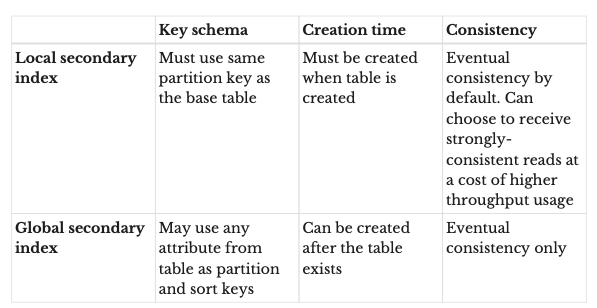

---
date: 2021-09-08
draft: false
thumbnail: /post-images/dynamo-db.png
title: DynamoDB Notes
extract: My notes as I learn DynamoDB
categories:
    - General
tags:
    - blog
--- 

**My notes as I walk through the great book on DynamoDB - [DynamoDB Book by Alex DeBrie](https://www.dynamodbbook.com/)** All images and examples used below are taken from the linked book. 

### Table of Contents

1. [Table](#table)
2. [Item](#item)
3. [Attributes](#attributes)
4. [Primary Key](#primary-key)
5. [Secondary indexes](#secondary-indexes)
6. [Item Collections](#item-collections)
7. [DDB Streams](#ddb-streams)
8. [TTL](#ttl)
9. [Overloading keys and indexes](#overloading-keys-and-indexes)
10. [API Actions](#api-actions)
11. [Item Based Actions](#item-based-actions)
12. [Query](#query)

### Table
The first basic concept in DynamoDB is a table. A DynamoDB table is similar in some ways to a table in a relational database or a collection in MongoDB. It is a grouping of records that conceptually belong together. For example, your table could be a collection of notifications you generate for a set of tools that you own. 

You often include multiple entity types in the same DynamoDB table. This is to avoid the join operation, which is expensive as a database scales. 

With DynamoDB, you do not declare all of your columns and column types on your table. At the database level, DynamoDB is schemaless, meaning the table itself won’t ensure your records conform to a given schema.

### Item

An item is a single record in a DynamoDB table. It is comparable to a row in a relational database or a document in MongoDB. In our notifications example earlier, an item could be a single notification for a tool with notification information such as message, notification start time, tool name etc.

### Attributes
A DynamoDB item is made up of attributes, which are typed data values holding information about the element. For our notification, you might have an attribute named "toolName" with a value of "permissionsTool".

When you write an item to DynamoDB, each attribute is given a specific type. There are ten different data types in DynamoDB. It’s helpful to split them into three categories:

**- Scalars** 

Scalars represent a single, simple value, such as a username (string) or an age (integer). There are five scalar types: string, number, binary, boolean, and null.

**- Complex** 

Complex types are the most flexible kind of attribute, as they represent groupings with arbitrary nested attributes. There are two complex types: lists and maps. You can use complex attribute types to hold related elements.

**- Sets**
 
 Sets are a powerful compound type that represents multiple, unique values. They are similar to sets in your favorite programming language. You can use sets to keep track of unique items, making it easy to track the number of distinct elements without needing to make multiple round trips to the database.
 
 
The type of attribute affects which operations you can perform on that attribute in subsequent operations. For example, if you have a number attribute, you can use an update operation to add or subtract from the attribute. If you use a set attribute, you can check for the existence of a particular value before updating the item.

### Primary Key
When creating a DynamoDB table, you must declare a primary key for your table. The primary key can be simple, consisting of a single value, or composite, consisting of two values. Each item in your table is uniquely identifiable by its primary key. Almost all of your data access will be driven off primary keys, so you need to choose them wisely.

In DynamoDB, there are two kinds of primary keys: 

• **Simple primary keys**, which consist of a single element called a partition key.

• **Composite primary keys**, which consist of two elements, called a partition key and a sort key.

The type of primary key you choose will depend on your access patterns. A simple primary key allows you to fetch only a single item at a time. It works well for one-to-one operations where you are only operating on individual items.

Composite primary keys, on the other hand, enable a "fetch many" access pattern. With a composite primary key, you can use the Query API to grab all items with the same partition key. You can even specify conditions on the sort key to narrow down your query space. Composite primary keys are great for handling relations between items in your data and for retrieving multiple items at once.

### Secondary indexes

The way you configure your primary keys may allow for one read or write access pattern but may prevent you from handling a second access pattern. To help with this problem, DynamoDB has the concept of secondary indexes. Secondary indexes allow you to reshape your data into another format for querying, so you can add additional access patterns to your data.

When you create a secondary index on your table, you specify the primary keys for your secondary index, just like when you’re creating a table. AWS will copy all items from your main table into the secondary index in the reshaped form. You can then make queries against the secondary index.

When creating a secondary index, you will need to specify the key schema of your index. The key schema is similar to the primary key of your table—you will state the partition and sort key (if desired) for your secondary index that will drive your access patterns.
There are two kinds of secondary indexes in DynamoDB:

• **Local secondary indexes** 

A local secondary index uses the same partition key as your table’s primary key but a different sort key. This can be a nice fit when you are often filtering your data by the same top-level property but have access patterns to filter your dataset further. The partition key can act as the top-level property, and the different sort key arrangements will act as your more granular filters.

• **Global secondary indexes**

With a global secondary index, you can choose any attributes you want for your partition key and your sort key. Global secondary indexes are used much more frequently with DynamoDB due to their flexibility.

*There are a few other differences to note between local and global secondary indexes:*
 
 *For global secondary indexes, you need to provision additional throughput for the secondary index. The read and write throughput for the index is separate from the core table’s throughput. This is not the case for local secondary indexes, which use the throughput from the core table.*
 
 *With global secondary indexes, your only choice is eventual
 consistency. Data is replicated from the core table to global secondary indexes in an asynchronous manner. This means it’s possible that the data returned in your global secondary index does not reflect the latest writes in your main table. The delay in replication from the main table to the global secondary indexes isn’t large, but it may be something you need to account for in your application.*
 
 *On the other hand, local secondary indexes allow you to opt for strongly-consistent reads if you want it. Strongly-consistent reads on local secondary indexes consume more read throughput than eventually-consistent reads, but they can be beneficial if you have strict requirements around consistency.*

Alex DeBrie says *I opt for global secondary indexes. They’re more flexible, you don’t need to add them at table-creation time, and you can delete them if you need to.*

Table showing the comparisons discussed above:

### Item Collections

An item collection refers to a group of items that share the same partition key in either the base table or a secondary index. Let's look at a table that includes actors and actresses and the movies in which they’ve played roles. We could model this with a composite primary key where the partition key is Actor and the sort key is Movie. The table with some example data looks as follows:

There are four movie roles in this table. Notice that two of those movie roles have the same partition key: Tom Hanks. Those two movie role items are said to be in the same item collection. Likewise, the single movie role for Natalie Portman is in an item collection, even though it only has one item in it.

Item collections are important for two reasons. First, they are useful for partitioning. DynamoDB partitions your data across a number of nodes in a way that allows for consistent performance as you scale. However, all items with the same partition key will be kept on the same storage node. This is important for performance reasons. Second, item collections are useful for data modeling.

### DDB Streams 

With DynamoDB streams, you can create a stream of data that includes a record of each change to an item in your table. Whenever an item is written, updated, or deleted, a record containing the details of that record will be written to your DynamoDB stream. You can then process this stream with AWS Lambda or other compute infrastructure.

### TTL

TTLs allow you to have DynamoDB automatically delete items on a per-item basis. This is a great option for storing short-term data in DynamoDB as you can use TTL to clean up your database rather than handling it manually via a scheduled job.
To use TTL, you specify an attribute on your DynamoDB table that will serve as the marker for item deletion. 

For each item that you want to expire, you should store a Unix timestamp as a number in your specified attribute. This timestamp should state the time after which the item should be deleted. DynamoDB will periodically review your table and delete items that have your TTL attribute set to a time before the current time.

Your application should be safe around how it handles items with TTLs. Items are generally deleted in a timely manner, but AWS only states that items will usually be deleted within 48 hours after the time indicated by the attribute. This delay could be unacceptable for the access patterns in your application. Rather than relying on the TTL for data accuracy in your application, you should confirm an item is not expired when you retrieve it from DynamoDB.

### Overloading keys and indexes
One unique quirk of modeling with DynamoDB is that you will often include different types of entities in a single table. Including multiple entity types in one table will make for more efficient queries.

Imagine you had a SaaS application and organizations signed up for your application, and each organization had multiple Users that belonged to the organization. Let’s start with a table that just has our organization items in it:

First, notice how generic the names of the partition key and sort key are. Rather than having the partition key named 'OrgName`, the partition key is titled PK, and the sort key is SK. That’s because we will also be putting User items into this table, and Users don’t have an OrgName. They have a UserName.

Second, notice that the `PK` and `SK` values have prefixes. The pattern for both is `ORG#<OrgName>`. We do this for a few reasons. First, it helps to identify the type of item that we’re looking at. Second, it helps avoid overlap between different item types in a table. Remember that a primary key must be unique across all items in a table. If we didn’t have this prefix, we could run into accidental overwrites. Imagine if the real estate company Keller Williams signed up for our application, and the musician Keller Williams was a user of our application. The two could overwrite each other!

Let’s edit our table to add Users now. A table with both Organization and User entities might look as follows:

Here we’ve added three Users to our existing Organization items. Our User items use a `PK` value of `ORG#<OrgName>` and an `SK` value of `USER#<UserName>`.

This concept of using generic names for your primary keys and using different values depending on the type of item is known as **overloading your keys**. You will do this with both your primary keys and your secondary indexes to enable the access patterns you need.

### API Actions

Let's learn about the core API actions with DynamoDB that can be broken down into 3 categories: Item-based actions, queries and scans. The API actions are divided based on what you’re operating on: 
- Operating on specific items? Use the item-based actions. 

- Operating on an item collection? Use a Query. 

- Operating on the whole table? Use a Scan.
 

### Item Based Actions
Item-based actions are used whenever you are operating on a specific item in your DynamoDB table. There are four core API actions for item-based actions:

1. GetItem--used for reading a single item from a table.

2. PutItem--used for writing an item to a table. This can completely overwrite an existing item with the same key, if any.

3. UpdateItem--used for updating an item in a table. This can create a new item if it doesn’t previously exist, or it can add, remove, or alter properties on an existing item.

4. DeleteItem--used for deleting an item from a table.

There are three rules around item-based actions. First, the full primary key must be specified in your request. Second all actions to alter data—writes, updates, or deletes—must use an item-based action. Finally, all item-based actions must be performed on your main table, not a secondary index.

The combination of the first two rules can be surprising—you can’t make a write operation to DynamoDB that says, "Update the attribute X for all items with a partition key of Y" (assuming a composite primary key). You would need to specify the full key of each of the items you’d like to update.

### Query
The second category of API actions is the Query API action. The Query API action lets you retrieve multiple items with the same partition key. This is a powerful operation, particularly when modeling and retrieving data that includes relations. You can use the Query API to easily fetch all related objects in a one-to-many relationship or a many-to-many relationship.

Imagine you modeled a table that tracked actors and actresses and the movies in which they acted. Your table might have some items like the following: