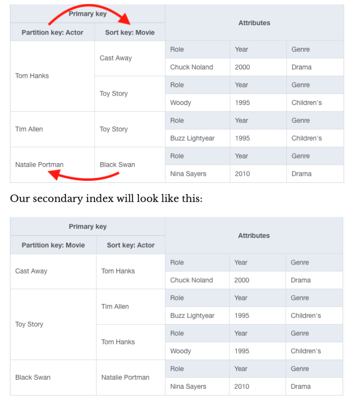

---
date: 2021-09-08
draft: false
thumbnail: /post-images/dynamo-db.png
title: DynamoDB Notes
extract: My notes as I learn DynamoDB
categories:
    - General
tags:
    - blog
--- 

**My notes as I walk through the great book on DynamoDB - [DynamoDB Book by Alex DeBrie](https://www.dynamodbbook.com/)** All images and examples used below are taken from the linked book. 

### Table of Contents

1. [Table](#table)
2. [Item](#item)
3. [Attributes](#attributes)
4. [Primary Key](#primary-key)
5. [Secondary indexes](#secondary-indexes)
6. [Item Collections](#item-collections)
7. [DDB Streams](#ddb-streams)
8. [TTL](#ttl)
9. [Overloading keys and indexes](#overloading-keys-and-indexes)
10. [API Actions](#api-actions)
11. [Item Based Actions](#item-based-actions)
12. [Query](#query)
13. [Scan](#scan)
14. [Expressions](#expressions)
15. [DDB vs RDB Data Modeling](#ddb-vs-rdb-data-modeling)
16. [Modeling with DDB](#modeling-with-ddb)
    * [ERD](#erd)
    * [Define Access Patterns](#define-access-patterns)
    * [Model primary key structure](#model-primary-key-structure)
    * [Secondary Indexes and Streams]


### Table
The first basic concept in DynamoDB is a table. A DynamoDB table is similar in some ways to a table in a relational database or a collection in MongoDB. It is a grouping of records that conceptually belong together. For example, your table could be a collection of notifications you generate for a set of tools that you own. 

You often include multiple entity types in the same DynamoDB table. This is to avoid the join operation, which is expensive as a database scales. 

With DynamoDB, you do not declare all of your columns and column types on your table. At the database level, DynamoDB is schemaless, meaning the table itself won’t ensure your records conform to a given schema.


### Item

An item is a single record in a DynamoDB table. It is comparable to a row in a relational database or a document in MongoDB. In our notifications example earlier, an item could be a single notification for a tool with notification information such as message, notification start time, tool name etc.


### Attributes
A DynamoDB item is made up of attributes, which are typed data values holding information about the element. For our notification, you might have an attribute named "toolName" with a value of "permissionsTool".

When you write an item to DynamoDB, each attribute is given a specific type. There are ten different data types in DynamoDB. It’s helpful to split them into three categories:

**- Scalars** 

Scalars represent a single, simple value, such as a username (string) or an age (integer). There are five scalar types: string, number, binary, boolean, and null.

**- Complex** 

Complex types are the most flexible kind of attribute, as they represent groupings with arbitrary nested attributes. There are two complex types: lists and maps. You can use complex attribute types to hold related elements.

**- Sets**
 
 Sets are a powerful compound type that represents multiple, unique values. They are similar to sets in your favorite programming language. You can use sets to keep track of unique items, making it easy to track the number of distinct elements without needing to make multiple round trips to the database.
 
 
The type of attribute affects which operations you can perform on that attribute in subsequent operations. For example, if you have a number attribute, you can use an update operation to add or subtract from the attribute. If you use a set attribute, you can check for the existence of a particular value before updating the item.

### Primary Key
When creating a DynamoDB table, you must declare a primary key for your table. The primary key can be simple, consisting of a single value, or composite, consisting of two values. Each item in your table is uniquely identifiable by its primary key. Almost all of your data access will be driven off primary keys, so you need to choose them wisely.

In DynamoDB, there are two kinds of primary keys: 

• **Simple primary keys**, which consist of a single element called a partition key.

• **Composite primary keys**, which consist of two elements, called a partition key and a sort key.


The type of primary key you choose will depend on your access patterns. A simple primary key allows you to fetch only a single item at a time. It works well for one-to-one operations where you are only operating on individual items.

Composite primary keys, on the other hand, enable a "fetch many" access pattern. With a composite primary key, you can use the Query API to grab all items with the same partition key. You can even specify conditions on the sort key to narrow down your query space. Composite primary keys are great for handling relations between items in your data and for retrieving multiple items at once.

### Secondary indexes

The way you configure your primary keys may allow for one read or write access pattern but may prevent you from handling a second access pattern. To help with this problem, DynamoDB has the concept of secondary indexes. Secondary indexes allow you to reshape your data into another format for querying, so you can add additional access patterns to your data.

When you create a secondary index on your table, you specify the primary keys for your secondary index, just like when you’re creating a table. AWS will copy all items from your main table into the secondary index in the reshaped form. You can then make queries against the secondary index.

When creating a secondary index, you will need to specify the key schema of your index. The key schema is similar to the primary key of your table—you will state the partition and sort key (if desired) for your secondary index that will drive your access patterns.
There are two kinds of secondary indexes in DynamoDB:

• **Local secondary indexes** 

A local secondary index uses the same partition key as your table’s primary key but a different sort key. This can be a nice fit when you are often filtering your data by the same top-level property but have access patterns to filter your dataset further. The partition key can act as the top-level property, and the different sort key arrangements will act as your more granular filters.

• **Global secondary indexes**

With a global secondary index, you can choose any attributes you want for your partition key and your sort key. Global secondary indexes are used much more frequently with DynamoDB due to their flexibility.


*There are a few other differences to note between local and global secondary indexes:*
 
 *For global secondary indexes, you need to provision additional throughput for the secondary index. The read and write throughput for the index is separate from the core table’s throughput. This is not the case for local secondary indexes, which use the throughput from the core table.*
 
 *With global secondary indexes, your only choice is eventual
 consistency. Data is replicated from the core table to global secondary indexes in an asynchronous manner. This means it’s possible that the data returned in your global secondary index does not reflect the latest writes in your main table. The delay in replication from the main table to the global secondary indexes isn’t large, but it may be something you need to account for in your application.*
 
 *On the other hand, local secondary indexes allow you to opt for strongly-consistent reads if you want it. Strongly-consistent reads on local secondary indexes consume more read throughput than eventually-consistent reads, but they can be beneficial if you have strict requirements around consistency.*

Alex DeBrie says *I opt for global secondary indexes. They’re more flexible, you don’t need to add them at table-creation time, and you can delete them if you need to.*


Table showing the comparisons discussed above:


### Item Collections

An item collection refers to a group of items that share the same partition key in either the base table or a secondary index. Let's look at a table that includes actors and actresses and the movies in which they’ve played roles. We could model this with a composite primary key where the partition key is Actor and the sort key is Movie. The table with some example data looks as follows:


There are four movie roles in this table. Notice that two of those movie roles have the same partition key: Tom Hanks. Those two movie role items are said to be in the same item collection. Likewise, the single movie role for Natalie Portman is in an item collection, even though it only has one item in it.

Item collections are important for two reasons. First, they are useful for partitioning. DynamoDB partitions your data across a number of nodes in a way that allows for consistent performance as you scale. However, all items with the same partition key will be kept on the same storage node. This is important for performance reasons. Second, item collections are useful for data modeling.

### DDB Streams 

With DynamoDB streams, you can create a stream of data that includes a record of each change to an item in your table. Whenever an item is written, updated, or deleted, a record containing the details of that record will be written to your DynamoDB stream. You can then process this stream with AWS Lambda or other compute infrastructure.


### TTL

TTLs allow you to have DynamoDB automatically delete items on a per-item basis. This is a great option for storing short-term data in DynamoDB as you can use TTL to clean up your database rather than handling it manually via a scheduled job.
To use TTL, you specify an attribute on your DynamoDB table that will serve as the marker for item deletion. 

For each item that you want to expire, you should store a Unix timestamp as a number in your specified attribute. This timestamp should state the time after which the item should be deleted. DynamoDB will periodically review your table and delete items that have your TTL attribute set to a time before the current time.

Your application should be safe around how it handles items with TTLs. Items are generally deleted in a timely manner, but AWS only states that items will usually be deleted within 48 hours after the time indicated by the attribute. This delay could be unacceptable for the access patterns in your application. Rather than relying on the TTL for data accuracy in your application, you should confirm an item is not expired when you retrieve it from DynamoDB.


### Overloading keys and indexes
One unique quirk of modeling with DynamoDB is that you will often include different types of entities in a single table. Including multiple entity types in one table will make for more efficient queries.

Imagine you had a SaaS application and organizations signed up for your application, and each organization had multiple Users that belonged to the organization. Let’s start with a table that just has our organization items in it:


First, notice how generic the names of the partition key and sort key are. Rather than having the partition key named 'OrgName`, the partition key is titled PK, and the sort key is SK. That’s because we will also be putting User items into this table, and Users don’t have an OrgName. They have a UserName.

Second, notice that the `PK` and `SK` values have prefixes. The pattern for both is `ORG#<OrgName>`. We do this for a few reasons. First, it helps to identify the type of item that we’re looking at. Second, it helps avoid overlap between different item types in a table. Remember that a primary key must be unique across all items in a table. If we didn’t have this prefix, we could run into accidental overwrites. Imagine if the real estate company Keller Williams signed up for our application, and the musician Keller Williams was a user of our application. The two could overwrite each other!


Let’s edit our table to add Users now. A table with both Organization and User entities might look as follows:


Here we’ve added three Users to our existing Organization items. Our User items use a `PK` value of `ORG#<OrgName>` and an `SK` value of `USER#<UserName>`.

This concept of using generic names for your primary keys and using different values depending on the type of item is known as **overloading your keys**. You will do this with both your primary keys and your secondary indexes to enable the access patterns you need.

### API Actions

Let's learn about the core API actions with DynamoDB that can be broken down into 3 categories: Item-based actions, queries and scans. The API actions are divided based on what you’re operating on: 
- Operating on specific items? Use the item-based actions. 

- Operating on an item collection? Use a Query. 

- Operating on the whole table? Use a Scan.
 

### Item Based Actions
Item-based actions are used whenever you are operating on a specific item in your DynamoDB table. There are four core API actions for item-based actions:

1. GetItem--used for reading a single item from a table.

2. PutItem--used for writing an item to a table. This can completely overwrite an existing item with the same key, if any.

3. UpdateItem--used for updating an item in a table. This can create a new item if it doesn’t previously exist, or it can add, remove, or alter properties on an existing item.

4. DeleteItem--used for deleting an item from a table.

There are three rules around item-based actions. First, the full primary key must be specified in your request. Second all actions to alter data—writes, updates, or deletes—must use an item-based action. Finally, all item-based actions must be performed on your main table, not a secondary index.

The combination of the first two rules can be surprising—you can’t make a write operation to DynamoDB that says, "Update the attribute X for all items with a partition key of Y" (assuming a composite primary key). You would need to specify the full key of each of the items you’d like to update.

### Query
The second category of API actions is the Query API action. The Query API action lets you retrieve multiple items with the same partition key. This is a powerful operation, particularly when modeling and retrieving data that includes relations. You can use the Query API to easily fetch all related objects in a one-to-many relationship or a many-to-many relationship.

Imagine you modeled a table that tracked actors and actresses and the movies in which they acted. Your table might have some items like the following:


Here we have four items in our table. The primary key is a composite primary key using the actor’s name as the Partition key and the Movie name as the Sort key.

You can use the Query operation on either your base table or secondary index. When making a Query, you must include a partition key in your request. In our example, this can be useful to find all the roles an actor has played. For example, we could use the Query operation and specify a partition key of "Tom Hanks":

```jsx
 items = client.query(
    TableName=
    KeyConditionExpression=
    ExpressionAttributeNames={
        '#actor': 'Actor'
    },
,
 'MoviesAndActors'
 '#actor = :actor'
,
ExpressionAttributeValues={
        ':actor': { 'S': 'Tom Hanks' }
} )
```

This Query would return two items—Tom Hanks in Cast Away and Tom Hanks in Toy Story.Remember that all items with the same partition key are in the same item collection. Thus, the Query operation is how you efficiently read items in an item collection. This is why you carefully structure your item collections to handle your access patterns. 


While the partition key is required, you may also choose to specify conditions on the sort key in a Query operation. In our example, imagine we want to get all of Tom Hanks' roles in movies where the title is between A and M in the alphabet. We could use the Query action to get: Tom Hanks in Cast Away—as it is the only item that satisfies both the partition key requirement and the sort key requirement.

As mentioned, you can use the Query API on either the main table or a secondary index. With our example, we can query movie roles by the actor’s name. But what if we want to query by a movie? Our current pattern doesn’t allow this, as the partition key must be included in every request. To handle this pattern, we can create a global secondary index that flips our partition key and sort key:



Notice that we have the same four items as in our previous table. The primary key has changed, but the data is the same.
Now, we can get all performers in Toy Story by using a Query operation on the secondary index and specifying "Toy Story" as the partition key. We will receive two items back—Tom Hanks and Tim Allen— representing the Toy Story roles in our database.

### Scan


The final kind of API action is the Scan. The Scan API is the bluntest tool in the DynamoDB toolbox. By way of analogy, item- based actions are like a pair of tweezers, deftly operating on the exact item you want. The Query call is like a shovel—grabbing a larger amount of items but still small enough to avoid grabbing everything. A Scan will grab everything in a table. If you have a large table, this will be infeasible in a single request, so it will paginate. Your first request in a Scan call will read a bunch of data and send it back to you, along with a pagination key. You’ll need to make another call, using the pagination key to indicate to DynamoDB where you left off.

### Expressions

As you’re working with the DynamoDB API, a lot of your time will be spent writing various kinds of expressions. Expressions are statements that operate on your items. They’re sort of like mini- SQL statements. 


There are five types of expressions in DynamoDB:

- Key Condition Expressions: Used in the Query API call to describe which items you want to retrieve in your query

- Filter Expressions: Used in Query and Scan operations to describe which items should be returned to the client after finding items that match your key condition expression

- Projection Expressions: Used in all read operations to describe which attributes you want to return on items that were read

- Condition Expressions: Used in write operations to assert the existing condition (or non-condition) of an item before writing to it

- Update Expressions: Used in the UpdateItem call to describe the desired updates to an existing item

The first three expressions are for read-based operations. The fourth, Condition Expressions, is for all write-based operations, and the last, Update Expressions, is for update operations only.

### DDB vs RDB Data Modeling

Let’s look at a few ways that data modeling in DynamoDB is different than data modeling with a relational database. Relational databases have been the de facto standard for a few decades, and most developers have familiarity with relational data modeling.

It’s a bad idea to model your data in DynamoDB the same way you model your data in a relational database. The entire point of using a NoSQL datastore is to get some benefit you couldn’t get with a relational database. If you model the data in the same way, you not only won’t get that benefit but you will also end up with a solution that’s worse than using the relational database!

Below are a few key areas where DynamoDB differs from relational databases:

-**JOINS**

In a relational database, you use the JOIN operator to connect data from different tables in your query. It’s a powerful way to reassemble your data and provide flexibility in your access patterns. But joins come at a cost. Joins need large amounts of CPU to combine your disparate units of data. You won’t find information about joins in the DynamoDB documentation because there are no joins in DynamoDB. Joins are inefficient at scale, and DynamoDB is built for scale. Rather than reassembling your data at read time with a join, you should preassemble your data in the exact shape that is needed for a read operation. One last note—people often try to do joins in their application code. They’ll make an initial request to DynamoDB to fetch a record, then make a follow-up request to query all related records for that record. You should avoid this pattern. DynamoDB doesn’t have joins for a reason!

-**NORMALIZATION**

Normalization is basically the database version of the popular code mantra of "Don’t Repeat Yourself" (or, "DRY"). If you have data that is duplicated across records in a table, you should split the record out into a separate table and refer to that record from your original table. In a relational database, each entity type is put into a different table. Customers will be in one table, CustomerOrders will be in another table, and InventoryItems will be in a third table. Each table has a defined set of columns that are present on every record in the table—Customers have names, dates of birth, and an email address, while CustomerOrders have an order date, delivery date, and total cost.

There are no joins in DynamoDB, and we also saw that you shouldn’t fake joins in your application code by making multiple serial requests to your DynamoDB table. So how do you solve a complex access pattern in a single request, such as fetching a customer and all customer orders? You put multiple entity types in a single table. Rather than having a Customers table and a CustomerOrders table, your application will have a single table that includes both Customers and CustomerOrders (and likely other entities as well). Then, you design your primary key such that you can fetch both a Customer and the matching CustomerOrders in a single request.

-**FILTERING**

Filtering with relational databases is glorious. You can specify any condition you want using the magical WHERE clause. You can filter on properties of top-level objects or properties of nested objects that have been joined to your data. You can filter using dynamic properties, such as the current time of the request. The WHERE clause is supremely powerful and a huge benefit to relational databases.

But, like other aspects of a relational database, the flexibility of the WHERE clause is a luxury you can’t afford at scale. A WHERE clause needs to read and discard a large number of records, and this is wasted compute.

Filtering with DynamoDB is much more limited and, as a result, much more performant. With DynamoDB, filtering is built directly into your data model. The primary keys of your table and your secondary indexes determine how you retrieve data. Rather than arbitrarily filtering on any attribute in your record, you use precise, surgical requests to fetch the exact data you need.

The DynamoDB approach requires more planning and work upfront but will provide long-term benefits as it scales. This is how DynamoDB is able to provide consistently fast performance as you scale. The sub-10 millisecond response times you get when you have 1 gigabyte of data is the same response time you get as you scale to a terabyte of data and beyond. The same cannot be said about relational databases.

### Modeling with DDB

Data modeling in DynamoDB is driven entirely by your access patterns. You will not be able to model your data in a generic way that allows for flexible access in the future. You must shape your data to fit the access patterns. The steps for modeling with DynamoDB, at a high level, are:
- Understand your application
- Create an entity-relationship diagram ("ERD")
- Write out all of your access patterns
- Model your primary key structure
- Satisfy additional access patterns with secondary indexes and streams

### ERD

An entity-relationship diagram is just like it sounds—a diagram that lists the different entities in your application and how they relate to each other. Imagine you have a "Notes" application. Users sign up for your application, and they can save notes. A note has a title, a date when it was created, and a body, which contains the content of the note. The ERD for your Notes application would look like this:


First, note that there are two rectangular boxes, titled "Users" and "Notes". These are the entities in your application. Usually, these are the nouns you use when talking about your application—Users, Notes, Orders, Organizations, etc. Note that each entity lists a number of attributes for that entity. Our User entity has a username, email address, and date created, while the Note entity has a title, a date created, and a body. Second, notice that there is a diamond with some lines connecting the User and Note entities. This indicates a relationship between the two entities. The line shown indicates a one-to-many relationship, as one User can own many notes. ERD forces you to think about your data upfront and provides a nice artifact for those that are new to your application.

### Define Access Patterns

When using a relational database, you can usually just ship your ERD straight to the database. Your entities become tables, and your relationships are configured via foreign keys. You design your data in a way that can accomodate flexible query patterns in the future.

This is not the case when data modeling in DynamoDB. You design your data to handle the specific access patterns you have, rather than designing for flexibility in the future.

Thus, your next step after creating an ERD is to define your data access patterns. All of them. Be specific and thorough. Failure to do this correctly may lead to problems down the line as you find your DynamoDB table isn’t as flexible to new patterns as your relational database was.

### Model Primary Key Structure

The primary key is the foundation of your table, so you should start there. I model my primary key using the following four steps:

First, I create an 'entity chart' that is used to track the different types of items I’ll have in my table. The entity chart tracks the type of item, the primary key structure for each item, and any additional notes and properties. I usually start by copying each entity in my ERD into the entity chart.


As you build out your data model, the rows in your entity chart may change. You may remove entities that appear in your ERD because they aren’t tracked as separate items in DynamoDB. For example, you may use a list or map attribute type to represent related objects on a particular item. This denormalized approach means there’s not a separate item for each of the related entities. Additionally, you may need to add entities to your chart as you design your table. A common example here is with a many-to-many relationship where you need to add an item type to represent the relationship between entities.

After deciding the entities and relationships to model, the second step is to decide on a simple or composite primary key. Most complex data models use a composite primary key but there are exceptions. In general, a rule of thumb is that if you have any access patterns that require retrieving multiple entities (e.g., Get all Orders for a User) or entity types (e.g., Get a Sensor and the most recent SensorReadings for the Sensor), you will need a composite primary key.

The last step is to start designing the primary key format for each entity type. Make sure you satisfy the uniqueness requirements first. If you have some additional flexibility in your key design after handling uniqueness, try to solve some of the "fetch many" access patterns you have.

There’s no one-size-fits-all approach to designing your primary key, but there are a few principles you should keep in mind:

- Consider what your client will know at read time

Remember that your client must know the primary key at read time or otherwise make costly additional queries to figure out the primary key.

- Use primary key prefixes to distinguish between entity types

We mentioned in the previous section that you will include multiple entity types per table. This can make it difficult to distinguish between the different types of entities, particularly when looking at your table in the console or exporting to analytics systems. Further, it can prevent accidental overlaps if you have different entity types with common attributes.

Use a prefixing system on primary keys to help identify the type of entity that is being referenced. For example, if you have Customers and CustomerOrders in a table, the pattern for Customers might be CUSTOMER#<CustomerId> for the partition key and METADATA#<CustomerId> on the sort key. For the CustomerOrder, the pattern might be ORDER#<OrderId> for the partition key and METADATA#<OrderId> for the sort key.
As you’re modeling your entities, keep track of primary key templates in your entity chart as shown below:


This will help you maintain clarity as you build out your access patterns chart and will serve as a nice artifact for development and post-development. 

### Secondary Indexes and Streams

You won’t always be able to model everything with your primary key. That’s where you start thinking about secondary indexes. New users often want to add a secondary index for each read pattern. This is overkill and will cost more. Instead, you can overload your secondary indexes just like you overload your primary key. Use generic attribute names like GSI1PK and GSI1SK for your secondary indexes and handle multiple access patterns within a single secondary index. 