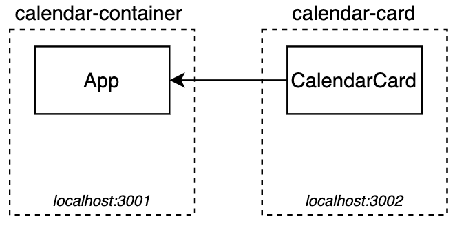
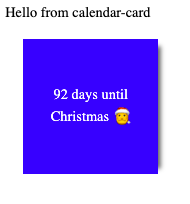

---
date: 2021-09-21
draft: false
thumbnail: /post-images/microfrontends.png
title: Micro Frontend
extract: My notes as I learn Micro Frontend
categories:
    - General
tags:
    - blog
--- 


### Table of contents

1. [What is MFE](#what-is-mfe)
2. [Module Federation](#module-federation)
2. [MFE in Action](#mfe-in-action)


### What is MFE
Micro-frontend serves a purpose similar to that of microservices where we decompose frontend monoliths into smaller, simpler chunks that can be developed, tested and deployed independently, while still appearing to customers as a single cohesive product. 

Benefits include:

- smaller, more cohesive and maintainable codebases
- more scalable organisations with decoupled, autonomous teams
- the ability to upgrade, update, or even rewrite parts of the frontend in a more incremental fashion than was previously possible

Here's a logical view of what an app with MFE architecture looks like:

 [Image Credit: Martin Fowler Article](https://martinfowler.com/articles/micro-frontends.html)

Before we dive deep into the world of MFEs, let's talk about a few more important concepts:

### Module Federation
As described by the creator himself, 

*Module federation allows a JavaScript application to dynamically load code from another application — in the process, sharing dependencies, if an application consuming a federated module does not have a dependency needed by the federated code — Webpack will download the missing dependency from that federated build origin.*

In short, Module Federation allows JavaScript application to dynamically import code from another application at runtime. The module will build a unique JavaScript entry file which can be downloaded by other applications by setting up the Webpack configuration to do so.

Makes sense but what is Webpack? 

At its core, [webpack](https://webpack.js.org/concepts/) is a static module bundler for modern JavaScript applications. When webpack processes your application, it internally builds a dependency graph from one or more entry points and then combines every module your project needs into one or more bundles, which are static assets to serve your content from.

So webpack helps us with module federation

### MFE in Action
Let's create a project from scratch. We'll first create a MFE app and then add webpacks for module federation. Credit to Hege Haavaldsen's post that can be found [here](https://react.christmas/2020/5). As per the example, here's what we're going to build: We will create a Christmas calendar using module federation. For illustrative purposes, we will be using two separate npm projects:

- `calendar-container`: Contains the calendar component.
- `calendar-card`: Contains the calendar card component.

We will use module federation to import components from `calendar-card` into the `calendar-container` during runtime:

 [Image Credit: Hege Haavaldsen](https://react.christmas/2020/5)

Let's start with the app's structure. Since these are two separate apps, our apps will reside in two separate packages:

```text
|--mainApp
|----calendar-card/
|--------public/
|----------index.html
|--------src/
|----------App.js
|----------Index.js
|----------CalendarCard.jsx
|--------package-lock.json
|--------package.json
|----calendar-container/
|--------public/
|----------index.html
|--------src/
|----------App.js
|----------Index.js
|----------CalendarContainer.jsx
|--------package-lock.json
|--------package.json
```

To generate the two packages, make a new top level directory and run `npx create-react-app calendar-card` and `npx create-react-app calendar-container`. This will create 2 separate react apps for us. Next, we'll do some clean up in each and get rid of boiler-plate code that comes in with `create-react-app`. For each app, here's what the files look like after cleanup:

`App.js`:

```jsx
function App() {
  return (
    <div className="App">
      <header className="App-header">
        Hello from calendar-container
      </header>
    </div>
  );
}

export default App;
```

`index.js`:

```jsx
import React from 'react';
import ReactDOM from 'react-dom';
import App from './App';

ReactDOM.render(
    <App />,
  document.getElementById('root')
);
```

Next, we'll create a new file in the `src` folder for `calendar-card` project and call it `CalendarCard.js`:

```jsx
import React, { useState } from 'react';

const style = {
    width: '150px',
    height: '150px',
    backgroundColor: 'blue',
    color: 'white',
    display: 'flex',
    justifyContent: 'center',
    alignItems: 'center',
    margin: '20px',
    boxShadow: '10px 1px 5px -7px rgba(0,0,0,0.61)',
    textAlign: 'center',
};

const CalendarCard = ({ dayOfDecember }) => {
    const [isClicked, setIsClicked] = useState(false);
    var date1 = new Date();
    var date2 = new Date("12/25/2021");
    const daysUntilChristmas = Math.round((date2.getTime() - date1.getTime())/ (1000 * 3600 * 24));
    return (
        <div onClick={() => setIsClicked(!isClicked)} style={style}>
            {isClicked ? (
                <p>{daysUntilChristmas} days until Christmas 🎅</p>
            ) : (
                <p>{dayOfDecember}</p>
            )}
        </div>
    );
};
export default CalendarCard;
```

We'll then import this class in `calendar-card` (same package)'s App.js file:

```jsx
import CalendarCard from "./CalendarCard";

function App() {
  return (
    <div className="App">
      <header className="App-header">
        Hello from calendar-card
      </header>
      <CalendarCard/>
    </div>
  );
}

export default App;
```

Ok, so now we've got our `calendar-card` package that is displaying the number of days between today and christmas like so:



So far, we've created our `calendar-card` package to show the number of days till Christmas while our `calendar-container` package prints out a simple line. We'll now connect the two so that `calendar-container` can use the `calendar-car**__**``d`. This is done in each app's `webpack.config.js` utilizing webpack's ModuleFederation-plugin. We need to expose `CalendarCard` component. Let's create an empty `webpack.config.js` file in `calendar-card` project at the root level:

```text
|--mainApp
|----calendar-card/
|--------public/
|----------index.html
|--------src/
|----------App.js
|----------Index.js
|----------CalendarCard.jsx
|--------package-lock.json
|--------package.json
|--------webpack.config.js
```

Here's what the `webpack.config.js` file will look like:

```jsx
const path = require('path');
const HtmlWebpackPlugin = require('html-webpack-plugin');
const ModuleFederationPlugin = require('webpack/lib/container/ModuleFederationPlugin');

module.exports = {
    mode: 'development',
    devServer: {
        port: 3000,
    },
    module: {
        rules: [
            {
                test: /\.jsx?$/,
                exclude: /node_modules/,
                loader: 'babel-loader',
                options: {
                    presets: ['@babel/preset-env', '@babel/preset-react'],
                },
            },
        ],
    },
    resolve: {
        modules: [path.resolve('./src'), path.resolve('./node_modules')],
        extensions: ['*', '.js', '.jsx'],
    },
    plugins: [
        new HtmlWebpackPlugin({
            template: './public/index.html',
        }),
        new ModuleFederationPlugin({
            name: 'calendar_card',
            filename: 'remoteEntry.js',
            exposes: {
                './CalendarCard': './src/CalendarCard',
            },
            shared: ['react', 'react-dom'],
        }),
    ],
};
```

Let's break down this file:


- [Mode](https://webpack.js.org/concepts/#mode) 

By setting the mode parameter to either development, production or none, you can enable webpack's built-in optimizations that correspond to each environment. The default value is production.  

- [Plugins](https://webpack.js.org/concepts/#plugins)

In order to use a plugin, you need to `require()` it and add it to the `plugins` array. Most plugins are customizable through options. Since you can use a plugin multiple times in a configuration for different purposes, you need to create an instance of it by calling it with the `new` operator.

Using the above file, we've exposed our `calendar-card` package that contains `CalendarCard`. We now need to tell `calendar-container` where to find `calendar-card`. The set up is similar to `calendar-card`, but we let webpack know that it is expecting a remote module called `calendar_card`. This is done in the `remotes` field. 

We also specify the location of the remote entry, which is `http://localhos:3000/remoteEntry.js`. This remote entry tells `calendar-container` which url/port/file `calendar-card` is running on. As no other project is importing code from `calendar-container` yet, there is no need to expose anything in this application. We need to list the shared dependencies in `calendar-container` as well, to let `calendar-card` know it will not need to provide them as fallback dependencies. Let's see what `calendar-container`'s `webpack.config.js` file looks like:

```jsx
const path = require('path');
const HtmlWebpackPlugin = require('html-webpack-plugin');
const ModuleFederationPlugin = require('webpack/lib/container/ModuleFederationPlugin');

module.exports = {
    mode: 'development',
    devServer: {
        // What port THIS app is running on
        port: 3001,
    },
    module: {
        rules: [
            {
                test: /\.jsx?$/,
                exclude: /node_modules/,
                loader: 'babel-loader',
                options: {
                    presets: ['@babel/preset-env', '@babel/preset-react'],
                },
            },
        ],
    },
    resolve: {
        modules: [path.resolve('./src'), path.resolve('./node_modules')],
        extensions: ['*', '.js', '.jsx'],
    },
    plugins: [
        new HtmlWebpackPlugin({
            template: './public/index.html',
        }),
        new ModuleFederationPlugin({
            name: 'container',
            remotes: {
                calendar_card:
                    'calendar_card@http://localhost:3000/remoteEntry.js',
            },
            shared: ['react', 'react-dom'],
        }),
    ],
};
```

Interesting thing to note here is the `remotes` as defined under `HtmlWebpackPlugin`. Here, we're pointing to the remote package we want imported here. 