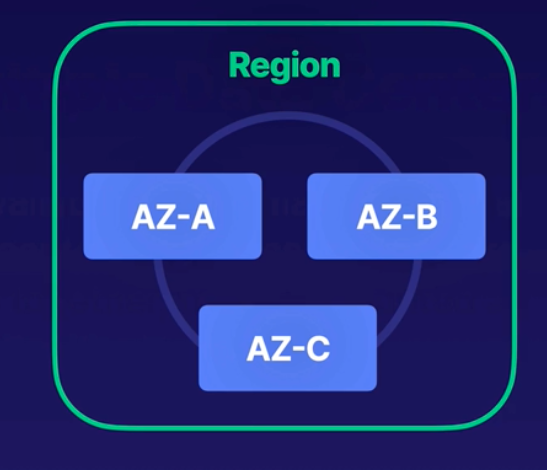

### Table of Contents

- [Building Blocks](#building-blocks)
- [Important Tenets](#important-tenets)
- [AWS Shared Responsibility Model](#aws-shared-responsibility-model)
- [High Availability](#high-availability)
- [Fault Tolerance](#fault-tolerance)
- [Disaster Recovery](#disaster-recovery)
- [Well Architected Framework](#well-architected-framework)

## Building Blocks

AWS has the concept of a `Region`, which is a physical location around the world where we cluster data centers. Common regions are us-east-1, us-west-2, eu-west-1, af-south-1 etc.

An Availability Zone, (AZ), is one or more discrete data centers with redundant power, networking, and connectivity in an AWS Region. All AZs in an AWS Region are interconnected with high-bandwidth, low-latency networking, over fully redundant, dedicated metro fiber providing high-throughput, low-latency networking between AZs. All traffic between AZs is encrypted.

[Image Credit - Acloud guru](https://acloudguru.com/)

There's another concept called Edge locations. Edge locations are endpoints to cache content closer to our end user. Services such as CloudFront can be considered as edge locations.

## Important Tenets

Compute, storage, DBs and networking are all important for our purposes:

- **Compute**: Servers, VMs, lambdas: These are used to processs our information. In terms of AWS services, these are EC2, Lambda, ElasticBeanStalk.
- **Storage**: You can think of storage as a giant disk in the cloud that stores our information for us. AWS services in this category include S3, EBS, EFS, FSx, storage gateway etc.
- **DBs**: Giant spreadsheets: RDS, DynamoDB, Redshift etc
- **Networking**: Way for one AZ to communicate with another. Examples include: VPS, Direct Connect, Route53, API GW etc

## AWS Shared Responsibility Model

Within the AWS eco-system, you're responsible for security **IN** the cloud while AWS is responsible for security **OF** the cloud:

[Image-Credit: AWS Docs](https://aws.amazon.com/compliance/shared-responsibility-model/)

## High Availability

A HA system is one designed to be online and "available" (ie providing services that it promises), as often as possible. So, when a highly available system fails, it components are replaced or fixed as fast as possible often using automation and are brought back online to keep the service running. HA aims to maximize the time a service/system is online.

Availability is usually measured as a percentage: 99.999% (five nines) means that a system is down only 5.26 minutes in a year! That's because there're 525,600 minutes in a year and the system can only be down 0.001% or 0.00001 \* 525,600 = 5.26 minutes in a year. This down time includes the time it takes for your team to find out that the system is down, finding the root cause and getting it back up.

## Fault Tolerance

Fault tolerance is when the system continues to operate smoothly even if one or more of its parts fail! See the difference as compared to HA? HA said it is ok to have issues and go offline but FT says even if there's an issue, we don't go offline AT ALL! Mission critical systems (surgical operation machines, flight control machines etc) cannot be just highly available; they need to be fault tolerant. With FT, you need to minimize outages and then be able to tolerate any failures that occur. This is similar to an aircraft: it comes with duplicate hydraulic systems so if one goes down, the other is online.

## Disaster Recovery

DR is a set of policies and tools that enable recovery of vital infra following a disaster (earthquake, fire, flooding etc). So, HA and FT are about keeping systems running, DR allows us to determine what should be done when a disaster's affects are felt. In AWS systems, that means taking backups of your data, having standby power generators etc.

## Well Architected Framework

Well architected framework consists of 6 pillars:

- Operational Excellence: The ability to support development and run workloads effectively, gain insight into their operations, and to continuously improve supporting processes and procedures to deliver business value.
- Security: The security pillar describes how to take advantage of cloud technologies to protect data, systems, and assets in a way that can improve your security posture.
- Reliability: The reliability pillar encompasses the ability of a workload to perform its intended function correctly and consistently when it’s expected to. This includes the ability to operate and test the workload through its total lifecycle.
- Performance Efficiency: The ability to use computing resources efficiently to meet system requirements, and to maintain that efficiency as demand changes and technologies evolve.
- Cost Optimization: The ability to run systems to deliver business value at the lowest price point.
- Sustainability: The ability to continually improve sustainability impacts by reducing energy consumption and increasing efficiency across all components of a workload by maximizing the benefits from the provisioned resources and minimizing the total resources required.

It is suggested to re-visit these once you're done with familiarizing yourself with common AWS services.
You can read more on well architected frameworks using white-papers [here](https://aws.amazon.com/whitepapers/?whitepapers-main.sort-by=item.additionalFields.sortDate&whitepapers-main.sort-order=desc&awsf.whitepapers-content-type=*all&awsf.whitepapers-tech-category=*all&awsf.whitepapers-industries=*all&awsf.whitepapers-business-category=*all&awsf.whitepapers-global-methodology=methodology%23well-arch-framework) and [here](https://docs.aws.amazon.com/wellarchitected/latest/framework/welcome.html?did=wp_card&trk=wp_card).
