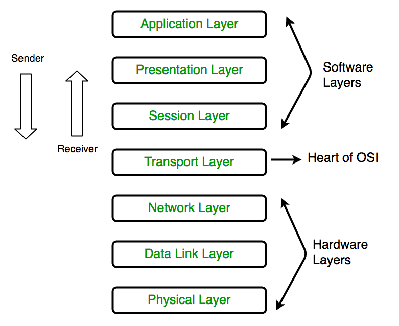
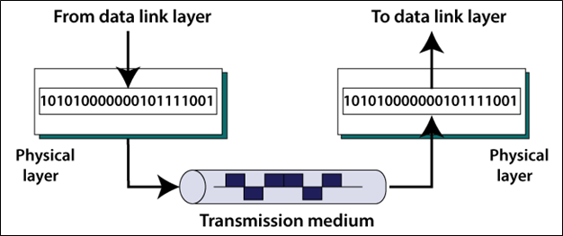

---
date: 2021-11-20
draft: false
thumbnail: /post-images/networking.png
title: Networking Basics
extract: Notes for Networking
categories:
    - AWS
tags:
    - blog
    - AWS
--- 


### Table of Contents

- [Intro](#intro)
- [Layer 1 - Physical](#layer-1---physical)
- [Layer 2 - Data Link Layer](#layer-2---data-link-layer)
- [Layer 3 - Network](#layer-3---network)
  - [Packets](#packets)
  - [IP Addressing (v4) - IPv4](#ip-addressing-v4---ipv4)
  - [Default Gateway](#default-gateway)
  - [Subnet Mask](#subnet-mask)
  - [Route Table](#route-table)
- [Layer 4 & 5 - Transport & Session](#layer-4--5---transport--session)
  - [UDP](#udp)
  - [TCP](#tcp)
  - [TCP and transferring data](#tcp-and-transferring-data)
  - [TCP 3-way handshakes](#tcp-3-way-handshakes)
  - [TCP security](#tcp-security)
- [Network Address Translation](#network-address-translation)
  - [Static NAT](#static-nat)
  - [Dynamic NAT](#dynamic-nat)
  - [Port Address Translation](#port-address-translation)
- [Security](#security)


## Intro


Before we can fully understand what VPC is and how it operates, it is important to understand fundamentals of networking. As an intro, we'll be going through some of the important layers present in the OSI network model:

[Image Credit](https://www.geeksforgeeks.org/layers-of-osi-model/)

We'll start at the bottom layer (physical) and make our way up to the top layer (application). All of these layers combined together create your networking stack. 

Layers 1-3 can be thought of as the media layer which deals with sending data from point A to point B.

Layers 5-7 can be thought of as the host layers which deals with chopping of data and transporting it. 

## Layer 1 - Physical

Let's start with layer 1. If you want to connect 2 machines (laptops, servers etc), you can use the same wifi network or a network cable. Let's assume, we're using a network cable to connect A with B. This network cable is literally your copper cable! Therefore, the signal used to transfer information between A and B would be electrical for our example. We can also use WiFi to connect A to B (where signal would be radio frequency) or a fiber link (where signal would be light).



Layer 1 specs define how data is transmitted where data is raw bit (1s and 0s) streams between 2 devices using a shared physical medium. The specs define what voltage levels will be used, the timing of our signals, the rates etc. It is at this layer wher we determine what level of voltage would represent 1 bit and what level would represent 0 bit. Therefore a layer 1 device just understands layer 1 communication methods. While a layer 3 device would understand layers 1, 2 AND 3. 

What if we need more devices connect to each other? Say 4 devices? You can use a hub to connect 4 devices together. A hub's job is to transmit a message received on any port to every other port. However, with hub communication, you can: 

- only have 1 device transmitting at a time 
- because there're no device addresses! 
- If 2 devices transmit at the same time, the message is corrupted. 
- there's no method to control media collision or media access control
- not scalable if we can't handle collision

## Layer 2 - Data Link Layer

Layer 2 network works on top of layer 1. This means, we'll build on top of what we already had in layer 1. Layer 2 introduces the ideas of:

- **frames**: instead of focusing on voltages, frames are used. Frames help "package data". 
- **device addresses**: devices at L2 have unique hardware, MAC, addresses. 
- **carrier checks**: to prevent collisions on layer 1.

Layer 2 will provide frames and device addresses which will then be transported via layer 1 mediums. So when layer 1 is transmitting a frame it won't understand what it is transmitting but would still do its job which is to transport data from A to B.

The frame contains information such as destination MAC address, source MAC address, payload (actual data that we want delivered) and ET (ethernet type). This payload is generally generated by layer 3! Layer 2 frames are generated by the software on the source side. These frames are then transmitted to the destination via layer 1 and received by the destination at layer 1. If there's a carrier flag detected by layer 2 on layer 1, the message is not sent. The carrier flag signifies that another message is currently being transmitted via layer 1. This helps prevent collision. If both sides detect no carrier and send at the same time, we can use collision detection, or CD, to determine that. This triggers a jam signal that triggers a random back off period where all sides stop sending signals and one transmitter at random will start again. If no carrier flag is detected, the frame is then transmitted on to layer 2 on destination side and the frame is interpreted here before the payload is passed on to layer 3 on the destination side.

Remember we used hub for layer 1? If we use layer 2 devices using a hub, we'd still get lots of collisions and corruption. We can use switches for the transport layer as well where a switch is a layer 2 device. Switches use a MAC address table that keeps track of what port each MAC is on. This allows switches to direct frames to correct machines. 

## Layer 3 - Network

Layer 3 requires a functional layer 2. The job of layer 3 is to move data from source to destination: for example, from youtube server to your local device via the internet. 

Say we have 2 layer 2 local are networks that are geographically separated and isolated (one is in us-east-1 and the other is in us-west-2). Devices can communicate with each other within their LANs but not outside of their local networks. You can use a point-to-point (or P2P) link to connect these 2 LANs but that would be expensive and is not scalable!

Layer 3 is that common protocol that can be used to connect layer 2 networks that are using different protocols. This adds internet protocol or IP addresses to the LANs and routing to move data between LANs without using direct P2P links. This means that the source and destination have IP addresses and the destination can request for data from source. IP "packets" are moved from source to destination via intermediate networks (or internet!) and the information is encapsulated in different frames along the way.

### Packets

Packets are simialr to frames but the difference is that the source and destination of a packet can be global whereas frames generally have local destinations and source. Generally during their journey, the packets remain the same. Packets are placed inside frames where each frame is specific to the local network that the packet is moving through. The frames change as the LAN changes while the packet remains unchanged. 

There're 2 versions of IP packet structures: IPv4 and IPv6. Similar to frames, the IP packet contains various different fields. The important ones are:

- source and destination IP address fields. IPv6 source and destination numbers are larger as compared to IPv4 packet.
- protocol: this is the protocol provided by layer 4. Example could be ICMP (pings!), TCP or UDP. The destination layer 3 would then know which layer 4 data protocol to pass the data into.
- ttl or hop limit in IPv6: time to live determines how many hops the packet is allowed to make from network to network in case the packets hops around the world for some reason.
- data! 

Remember, Layer 3 packets have no ordering, no error checking and no association with other packets whatsoever.

### IP Addressing (v4) - IPv4

An example IP address: `133.33.3.7`. You could send a packet to this address. Now there could be firewalls or that the destination IP address is offline but you could get the ball rolling on sending this destination a packet. This is known as dotted decimal notation that is 4 numbers separated by dots where each number can be in the range 0-255. The first two numbers, `133.33` define the network and the last two, `3.7` define the host or a device on that network. 

These IP addresses are not how they're used in an actual network. They're converted to decimal for our ease of use. In a network, they're used as an 8-bit representation:

```text
133 = 10000101
33  = 00100001
3   = 00000011
7   = 00000111
```

Therefore we'll have 4 sets of 8 bits which means an IP address is 32 bits long. 

This IP address, `133.33.3.7` , has a /16 prefix. Meaning, the first 16 bits, or the first octect, represents the network. The remaining bits are for the hosts. IP addresses on the same network will have the same first 16 bits. 

### Default Gateway

An item configured on network interfaces is a default gateway. Default gateway is nothing but an IP address on the local network to whcih packets are fowarded to generally if the destination is not a local IP address. 

### Subnet Mask

Another item configured is a subnet mask. These are configured on layer 3 interfaces. Subnet masks allow an IP device to know if an IP address which it is communicating with is on the same network or not. A subnet mask is configured on a host device. For example, `255.255.0.0` is the same as `/16` prefix or meaning that the first 16 bits represent the network. Why is this `/16`? Because `255.255.0.0` converted to binary is `11111111.11111111.00000000.00000000`. This is the number of 1s in this adddress = 16. It is called a subnet mask because if you AND it with the subnet mask, you get the network IP address. So, using our example earlier (binary representation of 133.33.3.7 and subnet mask /16):

```text
10000101.00100001.00000011.00000111
11111111.11111111.00000000.00000000(AND)
-----------------------------------
10000101.00100001.00000000.00000000 

Network IP:
133.33.0.0
```

The subnet mask allows the device to figure out whether to communicate directly on the local network or if it needs to use the default gateway. In your home network, your internet router is likely set as your default gateway. When you try to visit youtube.com from your laptop, and since youtube's IP address is not local, your request packets are forwarded to your router. 

### Route Table

When a request created on your laptop for AWS us-east-1 s3 endpoint, it first goes to your home router and next to your ISP where it encounters a route table. The route table has specific `Next Hop/Target` fields for `Destinations`. Meaning, if the packet is for a particular destination, it needs to be sent to the `Next Hop/Target` address. This is where the packet is wrapped in a frame and is forwarded! 

## Layer 4 & 5 - Transport & Session

Transport layer runs on top of networking layer. In layer 3 we assumed packet order and delivery is guaranteed! Which is not the case. At times when there's a network outage, the packet could go missing. Also layer 3 has no way of differentiating packets by app or channel. Layer 3 also has no flow control (source emitting faster than destination consuming). 

Layer 4 adds transmission control protocol (TCP) and UDP (User Datagram Protocol) to layer 3. Both of these protocols run on top of IP and both add a collection of features depending on which one is used. 

### UDP

UDP is faster as compared to TCP because it doesn't bother with data order or reliability. 

### TCP

TCP allows for reliable, error free and ordered data delivery. It is used for important application layer protocols such as HTTP, HTTPS and SSH. TCP is a connection oriented protocol, meaning that you need to first establish a connection between two devices and once set up, it creates a bi-directional channel of communications.

TCP is a connection based protocol where a "connection" is established between 2 devices using a port on the client and the server. Once established, this connection is bi-directional. Port on the client is said to be random. It is an ephemeral (short-lived), temporary port. However, on the server receiving the TCP connection, the port must be 443. 

Using TCP, we introduce the idea of a "segment". Segment is similar to frames and segments are encapsulated within IP packets. Packets carry segments from their source to their destination. Segments don't have source or destination IP addresses because they use IP packets for transit. However, TCP segments add more capabilities to IP pacjets. 

- source and destination ports: allows for multiple connection types: ssh, https (port 443), http etc!
- sequence number: for ordering
- acknowledgements: one side can ack that it has received up to and including up to a certain sequence number. This helps ensure reliability of TCP.
- window: # of bytes you agree to receive bytes from the sender

### TCP and transferring data

Layer 4 takes the data and divides it into segments. These segments contain sequence numbers to maintain order and lost segments can be re-transmitted. Now using the ephemeral port on sender and 443 on receiver, we can establish "communication". The receiver port can then send communication back to sender with now 443 as sender port and ephemeral port as the receiver port. Therefore, from a layer 4 perspective, you have 2 sets of segment communication:

```text
source      destination
----------------------
ephemeral -> 443
443       -> ephemeral
```
This is hwy you need 2 sets of rules on NACL in AWS (more on this in VPC section). 

### TCP 3-way handshakes

1. Client creates a segment with SYN and informing server what sequence number (call it cs) it is going to start with
2. Server returns a SYN-ACK segment back to client and a separate sequence number (call it ss) where ss = cs + 1
3. Client then creates a new segment with ACK, increments ss and cs and sends it back to server.

At this point, the connection is established and communication can proceed! 

### TCP security

With TCP communcation, you want to have some sort of security around your sender. You need a firewall for that. You can have a stateless firewall which doesn't understand that you're in a 2 way communication. Therefore, for stateless firewalls, you need to setup rules for both outbound and inbound traffic. This is nothing but NACL in AWS world!

Another firewall you can have is stateful: it understands that the connection is of type TCP and it understands the state of our TCP segment. So, if you allow outbound traffic from a port, it'll automatically allow inbound traffic to that port. This is a security group in AWS world.

## Network Address Translation

NAT is used to allow private devices to gain internet access by translating private IP addresses into public IP addresses so that packets can flow over the public internet and then back in from the internet to the private service. Private services have IP addresses usually starting with `10.0.0.<X>`. NAT only makes sense for IPv4 since there's a shortage of public IP addresses. There are multiple different types of NATs:

### Static NAT

This is where you have a network of private IPv4 addresses and you can allocate a public IP address for each private IP. This gives the private address access to the public address in both directions. This in AWS world is the Internet Gateway. This allows you to have consisten mapping from private to public.

### Dynamic NAT

Here, you use a pool of public IP addresses to use. In this scenario, there's a shortage of public IP addresses because we're using IPv4. 

### Port Address Translation

This is where we have MANY private IP addresses translated to a single public IP address. This is what NAT gateways are in the AWS world! 

## Security

Secure Sockets Layer (SSL) and Transport Layer Security (TLS) are what provides encrypted communications for HTTPS and other encrypted connection oriented protocols. This encryption allows for privacy (encrypted communication) and data integrity between client and server. 