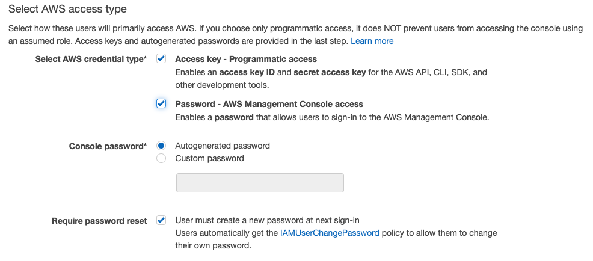
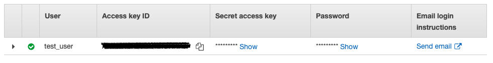
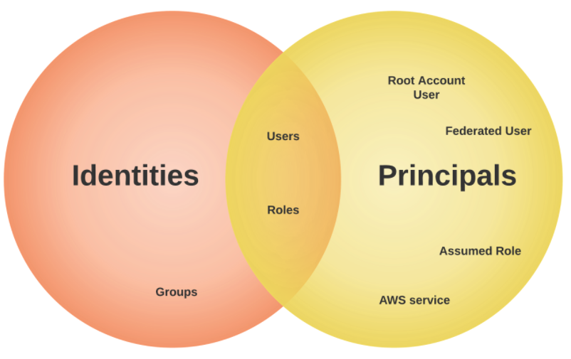
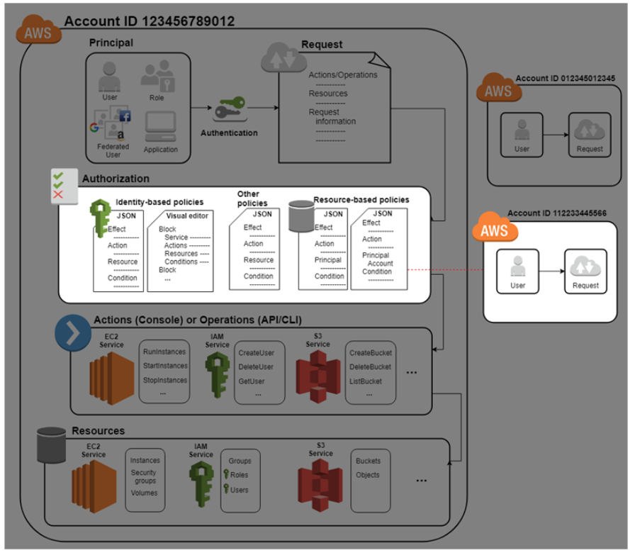
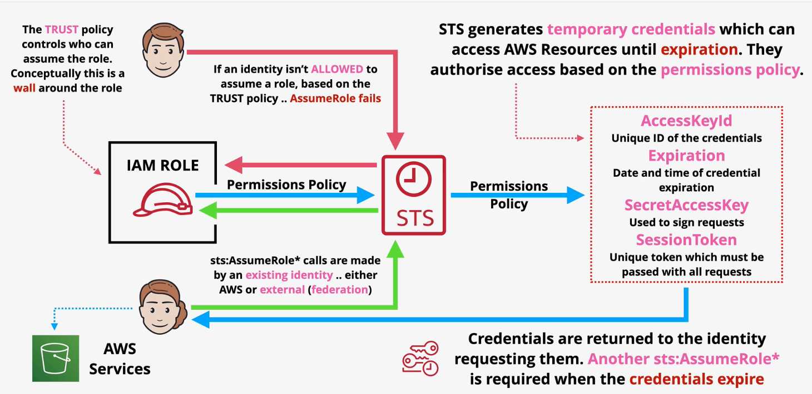
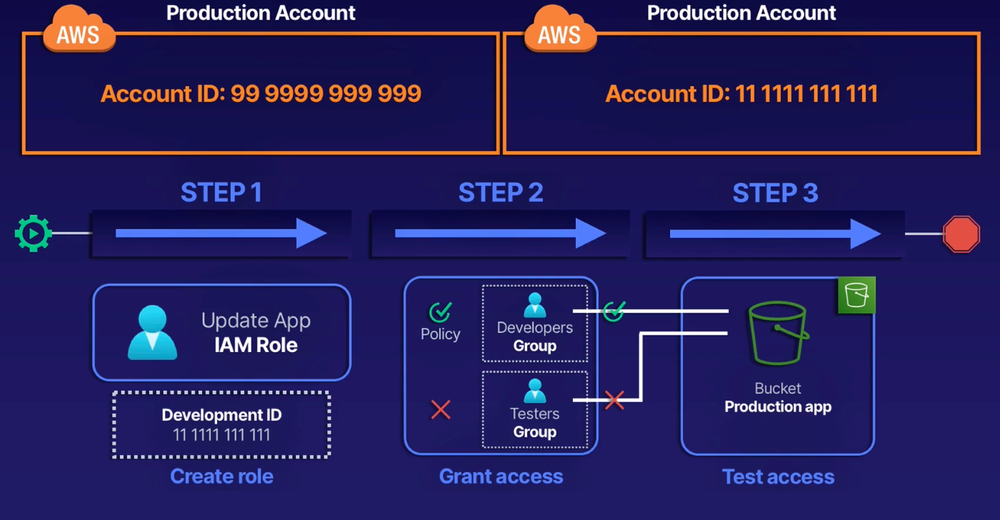

### Table of Contents

- [What is IAM?](#what-is-iam)
- [Identities](#identities)
  - [Root Users](#root-users)
  - [IAM Users](#iam-users)
  - [IAM User Groups](#iam-user-groups)
  - [Principals](#principals)
  - [AWS Services](#aws-services)
- [Access Management](#access-management)
  - [ARNs](#arns)
  - [Policy Documents](#policy-documents)
  - [IAM Permissions boundaries](#iam-permissions-boundaries)
  - [Access contorl lists (ACLs)](#access-contorl-lists-acls)
  - [Policy Documents Deep Dive](#policy-documents-deep-dive)
  - [IAM Roles](#iam-roles)
    - [Creating an IAM role for a user](#creating-an-iam-role-for-a-user)
    - [Creating an IAM role for an AWS service](#creating-an-iam-role-for-an-aws-service)
  - [Security Token Service](#security-token-service)
  - [When to use IAM Roles](#when-to-use-iam-roles)
- [Limitations](#limitations)
- [Resources](#resources)

## What is [IAM](https://docs.aws.amazon.com/IAM/latest/UserGuide/introduction.html)?

Since we're discussing Identity and Access Management, it is only fair to dive deep by discussing identities first and then access management.

## Identities

Identities are IAM resource objects that are used to identify and group. You can attach a policy to an IAM identity. These include users, groups, and roles. Identities include:

### Root Users

The most basic type of identity is created when you create a new AWS account. When you log in using the e-mail address you provided during signup, you sign in as a root user. The root user has permissions to perform all actions on all services. Thus, it is imperative that we secure this user. To do so, we can:

- Turn on MFA
- Create an admin group and assign permissions to this group
- Create user accounts for admins
- Add users to your admin groups

It is strongly recommend that you do not use the root user for your everyday tasks, even the administrative ones. Instead, adhere to the best practice of using the root user only to create your first IAM user. Take a look at [security best practices](https://docs.aws.amazon.com/IAM/latest/UserGuide/best-practices.html#create-iam-users) for more info.

### IAM Users

An IAM user is an entity that you create in AWS. The IAM user represents the person or service who uses the IAM user to interact with AWS.

A primary use for IAM users is to give people the ability to sign in to the AWS Management Console for interactive tasks and to make programmatic requests to AWS services using the API or CLI. You should use an IAM user to provide long term AWS access.

When you create a user, you have 2 options for access: programmatic access and console access:



If you choose programmatic access, you'll be provided an access key id and a secret access key:



Programmatic access is for users that might need to make API calls, use the AWS CLI, or use the Tools for Windows PowerShell. In that case, create an access key (access key ID and a secret access key) for that user.

By default, new users have NO permissions.

### IAM User Groups

An IAM user group is a collection of IAM users. User groups let you specify permissions for multiple users, which can make it easier to manage the permissions for those users. A group can have inline policies or managed policies attached. A single user can be a part of multiple groups. In addition to the policies attached to a group, a user can have his/her own inline polciy attached as well. All these policies are merged into one and then evaluated by AWS as a single policy.

Groups can't be referenced as a principal in a **resource** policy (more on resource policy later). That's because groups do not have ARNs associated with them.

Some more things to remeber:

- you cannot log in to a group!
- 300 groups per account
- can't have nested groups

Best practice is for users to be grouped together based off their job function. For example, we can have a group of EC2 admins who have administrator privileges for EC2 service only. If a new user joins your organization and should have administrator privileges, you can assign the appropriate permissions by adding the user to that user group. Similarly, if a person changes jobs in your organization, instead of editing that user's permissions, you can remove him or her from the old user groups and add him or her to the appropriate new user groups.

### Principals

A principal can be a person, a group of persons or services or a group of services. For a principal to be able to do anything in AWS, it needs to first authenticate itself: prove to IAM that it is an identity that it claims to be. To do so, the identity can provide IAM with access key id and secret access key combination or a user-name password combination. Once authenticated the principal is then known as an authenticated identity. IAM can then begin the process of authorization checks to see if the authenticated identity can perform any actions or not. Authorization is done through policy documents.

### AWS Services

For the purposes of our discussion it is also important to note that specific AWS services (CloudWatch, S3, EC2, Lambda etc) are also considered as entities that require permissions to perform cross service actions (such as lambda writing to S3, EC2 emitting cloudwatch logs etc).

## Access Management

Before diving into the permissions, let's break down our identities into their respective groups:

[Image Credit - AWS-blog.de](https://aws-blog.de/2021/08/iam-what-happens-when-you-assume-a-role.html)

An identity is used to identify and group entities within IAM. From our venn diagram above, we can see that groups are exclusively an identity. A group is not a principal and as such can’t take action in an AWS account. Action here means making a call to an API Gateway endpoint etc.

A principal on the other hand, is a person or application that can make a request for an action or operation on an AWS resource. The principal is authenticated as the AWS account root user or an IAM entity to make requests to AWS.

When a principal makes a request in AWS, the AWS enforcement code checks whether the principal is authenticated (signed in) and authorized (has permissions). You manage access in AWS by creating policies and attaching them to IAM identities or AWS resources. Policies (more on policies in the next section) are JSON documents in AWS that, when attached to an identity or resource, define their permissions.

### ARNs

In order to differentiate resources, AWS uses the concept of ARNs (Amazon Resource Names). ARNs uniquely identify resources within accounts. ARN generally follow this format:

```text
arn:partition:service:region:account-id:resource-id
arn:partition:service:region:account-id:resource-type/resource-id
arn:partition:service:region:account-id:resource-type:resource-id
```

**partition**: almost always aws unless it is china aws-cn
**region**: can be a double colon (::) if that doesn't matter
**account-id**: the account that owns the resource (EC2 needs this, S3 does not need account-id because its globally unique)
**resource-type/id**: changes based on the resource

### Policy Documents

[Image Credit - AWS-Docs](https://docs.aws.amazon.com/IAM/latest/UserGuide/access.html)

In order to manage access for identities listed above, we use something called a policy. A policy is defined in something called a policy document:

PDs are used to assign permissions using IAM. PDs are JSON files. Here's an example:

```json
{
  "Version": "2012-10-17",
  "Statement": [
    {
      "Sid": "fullAccess",
      "Effect": "Allow",
      "Action": ["s3:*"],
      "Resource": "*"
    },
    {
      "Sid": "denyDummyBucket",
      "Effect": "Deny",
      "Action": ["s3:*"],
      "Resource": ["arn:aws:s3:::dummyBucket", "arn:aws:s3:::dummyBucket/*"]
    }
  ]
}
```

The policy document above shows that we have the allow effect for all actions for all resources. A policy allows or denies a set of actions to a principal on certain resources. AWS checks each policy that applies to the context of the request. If a single policy denies the request, AWS denies the entire request and stops evaluating policies. This is called an explicit deny. Because requests are denied by default, IAM authorizes your request only if every part of your request is allowed by the applicable policies. The evaluation logic for a request within a single account follows these rules (listed in order of when the rule gets applied):

- Explicit deny: Denies override ANY allows
- Explicit allow: Allows access IF no explicit deny is present
- Implicity deny (default): If no deny or allow is present, it gets denied

So, using the rules above, the policy allows access to all actions in all S3 buckets EXCEPT dummyBucket.

These policies can be applied to individual accounts one by one where you specify what that account can do and not do. This is known as **inline** policy. This is not best practice because you'd have to literally do the same for each individual account that you create or an account that gets added to your org. If you want to change any permission, you'd have to change it in EVERY account! Use this for exceptional circumstances.

A better approach is to use **managed policies**: first you create the managed policy and then you attach that policy to any account you want. Managed policies are re-usable, meaning create once attach to many! Next, if you need to change permissions, all you do is update the managed policy it is applied immediately to all identities that have the policy attached. Use this for general circumstances.

These policies come in two main varieties: **identity-based** and **resource-based**. Identity-based policies can be attached to all identities and resource based policies belong to resources. They’re very similar in what they do, but there are a few key differences:

- **Identity-Based**:
  Identity-based policies are attached to an IAM user, group, or role. These policies let you specify what that identity can do (its permissions). These policies control what actions an identity (users, groups of users, and roles) can perform, on which resources, and under what conditions. For example, you can attach the policy to the IAM user named John, stating that he is allowed to perform the Amazon EC2 RunInstances action. The policy could further state that John is allowed to get items from an Amazon DynamoDB table named MyCompany. You can also allow John to manage his own IAM security credentials. An identity based policy answers the question **_“Which API calls can this identity perform on which resources?”_**

Here's an example ID based policy:

```json
{
  "Version": "2012-10-17",
  "Statement": [
    {
      "Action": "s3:PutObject",
      "Resource": "*",
      "Effect": "Allow"
    }
  ]
}
```

This says that our identity can only make PutObject calls on s3.

- **Resource-Based**:
  Resource-based policies are JSON policy documents that you attach to an Amazon resource such as an Amazon S3 bucket, EC2 instance etc. These policies grant the specified principal permission to perform specific actions on that resource and defines under what conditions this applies. Resource-based policies are inline policies. There are no managed resource-based policies. For example, you can attach resource-based policies to Amazon S3 buckets, Amazon SQS queues, VPC endpoints, and AWS Key Management Service encryption keys. A resource based policy answers the question: **_“Which identities can perform which actions on me?”_**.

Here's an example resource based policy:

```json
{
  "Version": "2012-10-17",
  "Statement": [
    {
      "Sid": "1",
      "Effect": "Allow",
      "Principal": { "AWS": ["arn:aws:iam::account-id:root"] },
      "Action": "s3:*",
      "Resource": ["arn:aws:s3:::mybucket", "arn:aws:s3:::mybucket/*"]
    }
  ]
}
```

The resource-based policy above can be attached to an Amazon S3 bucket. The policy allows members (or identities) of a specific AWS account to perform any Amazon S3 actions in the bucket named mybucket. It allows any action that can be performed on a bucket or the objects within it. (Because the policy grants trust only to the account, individual users in the account must still be granted permissions for the specified Amazon S3 actions.)

### IAM Permissions boundaries

A permissions boundary is an advanced feature in which you set the maximum permissions that an identity-based policy can grant to an IAM entity. When you set a permissions boundary for an entity, the entity can perform only the actions that are allowed by both its identity-based policies and its permissions boundaries.

You can use a permissions boundary on Zhang to make sure that he is never given access to the `CompanyConfidential` S3 bucket. To do this, determine the maximum permissions that you want Zhang to have. In this case, you control what he does using his permissions policies. Here, you only care that he doesn't access the confidential bucket. So you use the following policy to define Zhang's boundary to allow all AWS actions for Amazon S3 and a few other services but deny access to the `CompanyConfidential` S3 bucket. Because the permissions boundary does not allow any IAM actions, it prevents Zhang from deleting his (or anyone's) boundary.

```json
{
  "Version": "2012-10-17",
  "Statement": [
    {
      "Sid": "SomeServices",
      "Effect": "Allow",
      "Action": ["cloudwatch:*", "dynamodb:*", "ec2:*", "s3:*"],
      "Resource": "*"
    },
    {
      "Sid": "NoConfidentialBucket",
      "Effect": "Deny",
      "Action": "s3:*",
      "Resource": [
        "arn:aws:s3:::CompanyConfidential/*",
        "arn:aws:s3:::CompanyConfidential"
      ]
    }
  ]
}
```

### Access contorl lists (ACLs)

Access control lists (ACLs) are service policies that allow you to control which principals in another account can access a resource. ACLs cannot be used to control access for a principal within the same account. ACLs are similar to resource-based policies, although they are the only policy type that does not use the JSON policy document format.

### Policy Documents Deep Dive

As a recap, when you create an IAM policy, you can control access to the following:

- Principals – Control what the person making the request (the principal) is allowed to do.
- IAM Identities – Control which IAM identities (user groups, users, and roles) can be accessed and how.
- IAM Policies – Control who can create, edit, and delete customer managed policies, and who can attach and detach all managed policies.
- AWS Resources – Control who has access to resources using an identity-based policy or a resource-based policy.
- AWS Accounts – Control whether a request is allowed only for members of a specific account.

Let's look at policy documents in more detail. The following policy has three statements, each of which defines a separate set of permissions within a single account:

```json
{
  "Version": "2012-10-17",
  "Statement": [
    {
      "Sid": "FirstStatement",
      "Effect": "Allow",
      "Action": ["iam:ChangePassword"],
      "Resource": "*"
    },
    {
      "Sid": "SecondStatement",
      "Effect": "Allow",
      "Action": "s3:ListAllMyBuckets",
      "Resource": "*"
    },
    {
      "Sid": "ThirdStatement",
      "Effect": "Allow",
      "Action": ["s3:List*", "s3:Get*"],
      "Resource": [
        "arn:aws:s3:::confidential-data",
        "arn:aws:s3:::confidential-data/*"
      ],
      "Condition": { "Bool": { "aws:MultiFactorAuthPresent": "true" } }
    }
  ]
}
```

Let's start with the first statement:

```json
    {
      "Sid": "FirstStatement",
      "Effect": "Allow",
      "Action": ["iam:ChangePassword"],
      "Resource": "*"
    },
```

The first statement, with an Sid (Statement ID) of FirstStatement, lets the user with the attached policy change their own password. The Resource element in this statement is "\*" (which means "all resources"). But in practice, the ChangePassword API operation (or equivalent change-password CLI command) affects only the password for the user who makes the request

Second statement,

```json
    {
      "Sid": "SecondStatement",
      "Effect": "Allow",
      "Action": "s3:ListAllMyBuckets",
      "Resource": "*"
    },
```

lets the user list all the Amazon S3 buckets in their AWS account. The Resource element in this statement is "\*" (which means "all resources"). But because policies don't grant access to resources in other accounts, the user can list only the buckets in their own AWS account.

The third statement

```json
{
  "Sid": "ThirdStatement",
  "Effect": "Allow",
  "Action": ["s3:List*", "s3:Get*"],
  "Resource": [
    "arn:aws:s3:::confidential-data",
    "arn:aws:s3:::confidential-data/*"
  ],
  "Condition": { "Bool": { "aws:MultiFactorAuthPresent": "true" } }
}
```

lets the user list and retrieve any object that is in a bucket named confidential-data, but only when the user is authenticated with multi-factor authentication (MFA). The Condition element in the policy enforces the MFA authentication.

When a policy statement contains a Condition element, the statement is only in effect when the Condition element evaluates to true. In this case, the Condition evaluates to true when the user is MFA-authenticated. If the user is not MFA-authenticated, this Condition evaluates to false. In that case, the third statement in this policy does not apply and the user does not have access to the confidential-data bucket.

Another interesting example:

```json
{
  "Version": "2012-10-17",
  "Statement": [
    {
      "Sid": "DenyNonApprovedRegions",
      "Effect": "Deny",
      "NotAction": ["cloudfront:*", "iam:*", "route53:*"],
      "Resource": "*",
      "Condition": {
        "StringNotEquals": {
          "aws:RequestedRegion": ["eu-west-1", "ap-southeast-2"]
        }
      }
    }
  ]
}
```

Statement above is a deny statement. In the actions, we see a `NotAction` which is an "inverse" statement: it means we deny anything which is not in `["cloudfront:*","iam:*", "route53:*"]`. Basically it is equivalent to:

```json
{
  "Effect": "Allow",
  "Action": ["cloudfront:*", "iam:*", "route53:*"]
}
```

We also add an inverse condition where we deny anything when the requested region is NOT in `["eu-west-1","ap-southeast-2"]`. The two regions you see here are the only approved regions.

Let's take a look at another policy:

```json
{
  "Version": "2012-10-17",
  "Statement": [
    {
      "Effect": "Allow",
      "Action": "s3:ListBucket",
      "Resource": "arn:aws:s3:::folders",
      "Condition": {
        "StringLike": {
          "s3:prefix": ["", "home/", "home/${aws:username}/*"]
        }
      }
    }
  ]
}
```

Here we only allow the list items in bucket operation for only current user's folders.

Visit [here](https://docs.aws.amazon.com/IAM/latest/UserGuide/access_policies_examples.html) to see a large collection of various IAM policies.

### IAM Roles

An IAM role is an IAM identity that you can create in your account that has specific permissions. An IAM role is similar to an IAM user, in that it is an AWS identity with permission policies that determine what the identity can and cannot do in AWS. However, instead of being uniquely associated with one person, a role is intended to be assumable by anyone who needs it. This can be an unknown number of identities.

A role does not have standard long-term credentials such as a password or access keys associated with it. Instead, when you assume a role, it provides you with temporary security credentials for your role session. These credentials are created by a service called STS (Secure Token Service).

When you create a role, you can have 2 types of policies attached to it:

- **Permissions policy**
  A permissions document in JSON format in which you define what actions and resources the role can use. The document is written according to the rules of the IAM policy language.

- **Trust policy**
  A JSON policy document in which you define the principals that can assume the role. The principals that you can specify in the trust policy can include users, roles, accounts, and services. The principals can be in the same account or in a different account.

When you create a trust policy, you cannot specify a wildcard (\*) as a principal. The trust policy is attached to the role in the trusting account, and is one-half of the permissions. The other half is the permissions policy attached to the user in the trusted account that allows that user to switch to, or assume the role. A user who assumes a role temporarily gives up his or her own permissions and instead takes on the permissions of the role. When the user exits, or stops using the role, the original user permissions are restored. An additional parameter called external ID helps ensure secure use of roles between accounts that are not controlled by the same organization.

- **AWS service role**
  A role that a service assumes to perform actions in your account on your behalf. When you set up some AWS service environments, you must define a role for the service to assume. This service role must include all the permissions required for the service to access the AWS resources that it needs. Service roles vary from service to service, but many allow you to choose your permissions, as long as you meet the documented requirements for that service. You can create, modify, and delete a service role from within IAM.

An example is the service role for an EC2 instance: A special type of service role that an application running on an Amazon EC2 instance can assume to perform actions in your account. This role is assigned to the EC2 instance when it is launched. Applications running on that instance can retrieve temporary security credentials and perform actions that the role allows.

- **Role for cross-account access**
  A role that grants access to resources in one account to a trusted principal in a different account. Roles are the primary way to grant cross-account access. However, some AWS services allow you to attach a policy directly to a resource (instead of using a role as a proxy). These are called resource-based policies, and you can use them to grant principals in another AWS account access to the resource. Some of these resources include Amazon Simple Storage Service (S3) buckets, S3 Glacier vaults, Amazon Simple Notification Service (SNS) topics, and Amazon Simple Queue Service (SQS) queues.

see [How IAM roles differ from resource-based policies](https://docs.aws.amazon.com/IAM/latest/UserGuide/id_roles_compare-resource-policies.html). also check out some [common scenarios](https://docs.aws.amazon.com/IAM/latest/UserGuide/id_roles_common-scenarios.html).

#### Creating an IAM role for a user

Here's an example role that can be assumed by a user. According to the trust policy below that'll be attached to a new role that you create, it allows users in the 123456789012 account to assume the role using the AssumeRole operation, but only if the user provides MFA authentication using the SerialNumber and TokenCode parameters:

```json
{
  "Version": "2012-10-17",
  "Statement": [
    {
      "Effect": "Allow",
      "Principal": { "AWS": "arn:aws:iam::123456789012:root" },
      "Action": "sts:AssumeRole",
      "Condition": { "Bool": { "aws:MultiFactorAuthPresent": "true" } }
    }
  ]
}
```

Next, you must attach a permissions policy to the role. The following example permissions policy allows the role to perform only the ListBucket action on the example_bucket Amazon S3 bucket:

```json
{
  "Version": "2012-10-17",
  "Statement": {
    "Effect": "Allow",
    "Action": "s3:ListBucket",
    "Resource": "arn:aws:s3:::example_bucket"
  }
}
```

#### Creating an IAM role for an AWS service

Many AWS services require that you use roles to allow the service to access resources in other services on your behalf. A role that a service assumes to perform actions on your behalf is called a service role. When a role serves a specialized purpose for a service, it is categorized as a service role for EC2 instances (for example), or a service-linked role.

In this example, include the following trust policy in the first command when you create the role. This trust policy allows the Amazon EC2 service to assume the role:

```json
{
  "Version": "2012-10-17",
  "Statement": {
    "Effect": "Allow",
    "Principal": { "Service": "ec2.amazonaws.com" },
    "Action": "sts:AssumeRole"
  }
}
```

Next, you must attach a permissions policy to the role. The following example permissions policy allows the role to perform only the ListBucket action on the example_bucket Amazon S3 bucket:

```json
{
  "Version": "2012-10-17",
  "Statement": {
    "Effect": "Allow",
    "Action": "s3:ListBucket",
    "Resource": "arn:aws:s3:::example_bucket"
  }
}
```

### Security Token Service

Let's have a look again at the trust policy we created in the previous section:

```json
{
  "Version": "2012-10-17",
  "Statement": {
    "Effect": "Allow",
    "Principal": { "Service": "ec2.amazonaws.com" },
    "Action": "sts:AssumeRole"
  }
}
```

STS allows us to generate temporary credentials whenever the `sts:AssumeRole` operation is used. These temp credentials can be used by the identity that assumes the role. STS generated credentials are long term which means they are similar to access keys. Therefore, STS generated credentials have a access key id and a secret access key. HOWEVER, these credentials expire and do not belong to the identity that assumes the role. These credentials then can be used to access AWS resources.

Let's say you have 2 users who want to assume an IAM role. There's a trust policy that controls who can assume the role. This is conceptually a "wall" around the role only allowing certain people access to that role. If an EXISTING identity is not allowed to assume a role based on the trust policy, the `sts:AssumeRole` call fails for that identity.

Next, the permissions policy associated with the role will determine what the identity that just assumed that role can and cannot do in an account. STS uses this permissions policy to generate temporary credentials. When these temporary credenitals expire, another assume role call needs to be made.

[Image Credit: learn.cantrill.io](https://learn.cantrill.io/courses/895720/lectures/16733911)

### When to use IAM Roles

- **For AWS Services**

Inside your account, AWS services operate on your behalf to take certain actions. For example, a lambda function could be starting/stopping an EC2 instance, forwarding messages to an SNS topic etc. By default, this lambda function would have no permissions. For it to function, the lambda needs permissions. For that, it'll need to assume a role called a **lambda execution role**. This execution role has a trust policy that trusts the Lambda service. This means that the lambda can assume that role whenever a function is executed. This role will also have a permissions policy attached to it which grants access to services. In our example, the lambda would need access to EC2 service.

Why did we use a role here? That's because if we had no role for lambda to use, we would've hard-coded access keys for lambda to access EC2 which is NOT recommended for obvious reasons.

- **For emergency**

Say you're tech support and your job is to make sure that the service is performing well. For this you have read-only access. When you're the only on-call and an alarm triggers where the EC2 instance for the service needs to be re-started manually, you'd need elevated permissions. This situation is called a break-glass situation. Here, you can assume a role as an emergency EC2 admin, log in to the prod account, and re-start the EC2 instance.

- **Too many users!**

Say you have more than 5000 users that need to log in for a short period of time. To do so, you can assume a role and log in.

- **Web ID Federation**

Say you have a popular app that needs to access DynamoDB to retrieve user info. Your app has millions of users and you can't possibly have an IAM account per user! Your users can use a web identity (Twitter, FB, Google etc) to log in to your app. We can have a role in our account that has a trust policy attached that trusts any of the previously mentioned web identities. Next, we can add a permission policy to our role to allow access to DynamoDB!

- **Cross Account Access**

Cross Account roles allow you to assume roles that have policies attached that let you perform certain actions in another account. Say you have a partner org that has an S3 bucket that they use of ML models. Your org pushes datat to their bucket. To do so, you can create a role and utilize cross account access.

First step is to create the role, grant access via policies and then check to see if access is granted:

[Image Credit: ACloudguru](https://acloudguru.com)

Let's say we have 2 accounts, A and B . Go to IAM for account A and follow these steps:

- Choose Another AWS Account
- Provide B's ID
- For permissions, provide S3 full access
- Call the role cross-account-role
- Switch to other AWS account: B
- Click on switch role from dropdown
- Provide Account ID for account A and role name as cross-account-role
- Tada!

## Limitations

Let's talk about some limits set in IAM:

- You can only have 5000 IAM users per account
- You can have a user part of up to 10 groups

## Resources

[Here're](https://docs.aws.amazon.com/IAM/latest/UserGuide/resources.html) some great resources for diving deep into IAM.
