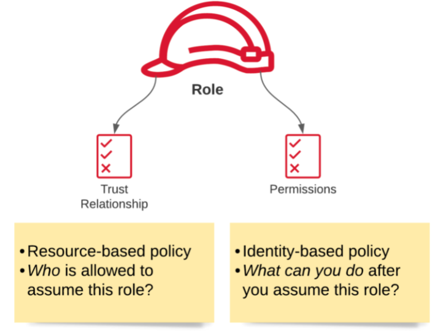

---
date: 2021-12-12
draft: false
thumbnail: /post-images/iam.png
title: AWS - IAM
extract: My notes for AWS intro and IAM
categories:
    - AWS
tags:
    - blog
    - AWS
--- 

### Table of Contents

- [Building Blocks](#building-blocks)
- [Important Tenets](#important-tenets)
- [Well Architected Framework](#well-architected-framework)
- [IAM](#iam)
  - [Identities](#identities)
    - [Root Users](#root-users)
    - [IAM Users](#iam-users)
    - [IAM User Groups](#iam-user-groups)
    - [IAM Roles](#iam-roles)
    - [AWS Services](#aws-services)
  - [Access Management](#access-management)
    - [Policy Documents](#policy-documents)
    - [IAM Permissions boundaries](#iam-permissions-boundaries)
    - [Access contorl lists (ACLs)](#access-contorl-lists-acls)
    - [ACLs](#acls)
    - [Policy Documents Deep Dive](#policy-documents-deep-dive)
  - [IAM Roles Deep Dive](#iam-roles-deep-dive)
    - [Basics](#basics)
    - [Creating an IAM role for a user](#creating-an-iam-role-for-a-user)
    - [Creating an IAM role for an AWS service](#creating-an-iam-role-for-an-aws-service)
  - [IAM Assume Role](#iam-assume-role)
- [Resources](#resources)


## Building Blocks
AWS has the concept of a `Region`, which is a physical location around the world where we cluster data centers. Common regions are us-east-1, us-west-2, eu-west-1, af-south-1 etc. 

An Availability Zone, (AZ), is one or more discrete data centers with redundant power, networking, and connectivity in an AWS Region. All AZs in an AWS Region are interconnected with high-bandwidth, low-latency networking, over fully redundant, dedicated metro fiber providing high-throughput, low-latency networking between AZs. All traffic between AZs is encrypted. 

[Image Credit - Acloud guru](https://acloudguru.com/)

There's another concept called Edge locations. Edge locations are endpoints to cache content closer to our end user. Services such as CloudFront can be considered as edge locations. 

## Important Tenets
Compute, storage, DBs and networking are all important for our purposes:

- **Compute**: Servers, VMs, lambdas: These are used to processs our information. In terms of AWS services, these are EC2, Lambda, ElasticBeanStalk. 
- **Storage**:  You can think of storage as a giant disk in the cloud that stores our information for us. AWS services in this category include S3, EBS, EFS, FSx, storage gateway etc.
- **DBs**: Giant spreadsheets: RDS, DynamoDB, Redshift etc
- **Networking**: Way for one AZ to communicate with another. Examples include: VPS, Direct Connect, Route53, API GW etc

## Well Architected Framework
Well architected framework consists of 6 pillars:

- Operational Excellence: The ability to support development and run workloads effectively, gain insight into their operations, and to continuously improve supporting processes and procedures to deliver business value.
  
- Security: The security pillar describes how to take advantage of cloud technologies to protect data, systems, and assets in a way that can improve your security posture.
  
- Reliability: 	The reliability pillar encompasses the ability of a workload to perform its intended function correctly and consistently when it’s expected to. This includes the ability to operate and test the workload through its total lifecycle. This paper provides in-depth, best practice guidance for implementing reliable workloads on AWS.
  
- Performance Efficiency: The ability to use computing resources efficiently to meet system requirements, and to maintain that efficiency as demand changes and technologies evolve.
  
- Cost Optimization: The ability to run systems to deliver business value at the lowest price point.

- Sustainability: The ability to continually improve sustainability impacts by reducing energy consumption and increasing efficiency across all components of a workload by maximizing the benefits from the provisioned resources and minimizing the total resources required.

It is suggested to re-visit these once you're done with familiarizing yourself with common AWS services. 
You can read more on well architected frameworks using white-papers [here](https://aws.amazon.com/whitepapers/?whitepapers-main.sort-by=item.additionalFields.sortDate&whitepapers-main.sort-order=desc&awsf.whitepapers-content-type=*all&awsf.whitepapers-tech-category=*all&awsf.whitepapers-industries=*all&awsf.whitepapers-business-category=*all&awsf.whitepapers-global-methodology=methodology%23well-arch-framework) and [here](https://docs.aws.amazon.com/wellarchitected/latest/framework/welcome.html?did=wp_card&trk=wp_card). 

## IAM
Since we're discussing Identity and Access Management, it is only fair to dive deep by discussing identities first and then access management. 

### Identities
#### Root Users
The most basic type of identity is created when you create a new AWS account. When you log in using the e-mail address you provided during signup, you sign in as a root user. The root user has permissions to perform all actions on all services. Thus, it is imperative that we secure this user. To do so, we can:
- Turn on MFA
- Create an admin group and assign permissions to this group
- Create user accounts for admins
- Add users to your admin groups

It is strongly recommend that you do not use the root user for your everyday tasks, even the administrative ones. Instead, adhere to the best practice of using the root user only to create your first IAM user. Take a look at [security best practices](https://docs.aws.amazon.com/IAM/latest/UserGuide/best-practices.html#create-iam-users) for more info. 

#### IAM Users
An IAM user is an entity that you create in AWS. The IAM user represents the person or service who uses the IAM user to interact with AWS. A primary use for IAM users is to give people the ability to sign in to the AWS Management Console for interactive tasks and to make programmatic requests to AWS services using the API or CLI. When you create a user, you have 2 options for access: programmatic access and console access:


If you choose programmatic access, you'll be provided an access key id and a secret access key:


Programmatic access is for users that might need to make API calls, use the AWS CLI, or use the Tools for Windows PowerShell. In that case, create an access key (access key ID and a secret access key) for that user.

AWS Management Console access is for users that need to access the AWS Management Console. Create a password for the user. Disabling console access for a user prevents them from signing in the to the AWS Management Console using their user name and password. It does not change their permissions or prevent them from accessing the console using an assumed role.

By default, new users have NO permissions. 

#### IAM User Groups
An IAM user group is a collection of IAM users. User groups let you specify permissions for multiple users, which can make it easier to manage the permissions for those users. Best practice is for users to be grouped together based off their job function. For example, we can have a group of EC2 admins who have administrator privileges for EC2 service only. If a new user joins your organization and should have administrator privileges, you can assign the appropriate permissions by adding the user to that user group. Similarly, if a person changes jobs in your organization, instead of editing that user's permissions, you can remove him or her from the old user groups and add him or her to the appropriate new user groups. 

#### IAM Roles
An IAM role is an IAM identity that you can create in your account that has specific permissions. An IAM role is similar to an IAM user, in that it is an AWS identity with permission policies that determine what the identity can and cannot do in AWS. However, instead of being uniquely associated with one person, a role is intended to be assumable by anyone who needs it. Also, a role does not have standard long-term credentials such as a password or access keys associated with it. Instead, when you assume a role, it provides you with temporary security credentials for your role session.

You can use roles to delegate access to users, applications, or services that don't normally have access to your AWS resources. For example, you might want to grant users in your AWS account access to resources they don't usually have, or grant users in one AWS account access to resources in another account. Or you might want to allow a mobile app to use AWS resources, but not want to embed AWS keys within the app (where they can be difficult to rotate and where users can potentially extract them). Sometimes you want to give AWS access to users who already have identities defined outside of AWS, such as in your corporate directory. Or, you might want to grant access to your account to third parties so that they can perform an audit on your resources.

Have a look at the [deep dive section](#iam-roles-deep-dive) section for more details on roles

#### AWS Services
For the purposes of our discussion it is also important to note that specific AWS services (CloudWatch, S3, EC2, Lambda etc) are also considered as entities that require permissions to perform cross service actions (such as lambda writing to S3, EC2 emitting cloudwatch logs etc).

### Access Management
Before diving into the permissions, let's break down our identities into their respective groups:

[Image Credit - AWS-blog.de](https://aws-blog.de/2021/08/iam-what-happens-when-you-assume-a-role.html)

An identity is used to identify and group entities within IAM. From our venn diagram above, we can see that groups are exclusively an identity. A group is not a principal and as such can’t take action in an AWS account. Action here means making a call to an API Gateway endpoint etc. 

A principal on the other hand, is a person or application that can make a request for an action or operation on an AWS resource. The principal is authenticated as the AWS account root user or an IAM entity to make requests to AWS.

When a principal makes a request in AWS, the AWS enforcement code checks whether the principal is authenticated (signed in) and authorized (has permissions). You manage access in AWS by creating policies and attaching them to IAM identities or AWS resources. Policies (more on policies in the next section) are JSON documents in AWS that, when attached to an identity or resource, define their permissions.

[Image Credit - AWS-Docs](https://docs.aws.amazon.com/IAM/latest/UserGuide/access.html)

In order to manage access for identities listed above, we use something called a policy. A policy is defined in something called a policy document: 

#### Policy Documents
PDs are used to assign permissions using IAM. PDs are JSON files. Here's an example:

```json
{
  "Version": "2012-10-17",
  "Statement": [
      {
        "Effect": "Allow",
        "Action": "*",
        "Resource": "*"
      }
  ]
}
```

The policy document above shows that we have the allow effect for all actions for all resources. A policy allows or denies a set of actions to a principal on certain resources. AWS checks each policy that applies to the context of the request. If a single policy denies the request, AWS denies the entire request and stops evaluating policies. This is called an explicit deny. Because requests are denied by default, IAM authorizes your request only if every part of your request is allowed by the applicable policies. The evaluation logic for a request within a single account follows these rules:

 - By default, all requests are implicitly denied. (Alternatively, by default, the AWS account root user has full access.)
 - An explicit allow in an identity-based or resource-based policy overrides this default.
 - If a permissions boundary, Organizations SCP, or session policy is present, it might override the allow with an implicit deny.
 - An explicit deny in any policy overrides any allows.

After your request has been authenticated and authorized, AWS approves the request. If you need to make a request in a different account, a policy in the other account must allow you to access the resource. In addition, the IAM entity that you use to make the request must have an identity-based policy that allows the request.

These policies come in two main varieties: **identity-based** and **resource-based**. Identity-based policies can be attached to all identities and resource based policies belong to resources. They’re very similar in what they do, but there are a few key differences:

- **Identity-Based**: 
Identity-based policies are attached to an IAM user, group, or role. These policies let you specify what that identity can do (its permissions). These policies control what actions an identity (users, groups of users, and roles) can perform, on which resources, and under what conditions. For example, you can attach the policy to the IAM user named John, stating that he is allowed to perform the Amazon EC2 RunInstances action. The policy could further state that John is allowed to get items from an Amazon DynamoDB table named MyCompany. You can also allow John to manage his own IAM security credentials. An identity based policy answers the question ***“Which API calls can this identity perform on which resources?”*** 

Here's an example ID based policy:

```json
{
	"Version": "2012-10-17",
	"Statement": [
		{
			"Action": "s3:PutObject",
			"Resource": "*",
			"Effect": "Allow"
		}
	]
}
```

This says that our identity can only make PutObject calls on s3. 

- **Resource-Based**: 
Resource-based policies are JSON policy documents that you attach to a resource such as an Amazon S3 bucket. These policies grant the specified principal permission to perform specific actions on that resource and defines under what conditions this applies. Resource-based policies are inline policies. There are no managed resource-based policies. For example, you can attach resource-based policies to Amazon S3 buckets, Amazon SQS queues, VPC endpoints, and AWS Key Management Service encryption keys. A resource based policy answers the question: ***“Which identities can perform which actions on me?”***.

Here's an example resource based policy:

```json
{
  "Version": "2012-10-17",
  "Statement": [{
    "Sid": "1",
    "Effect": "Allow",
    "Principal": {"AWS": ["arn:aws:iam::account-id:root"]},
    "Action": "s3:*",
    "Resource": [
      "arn:aws:s3:::mybucket",
      "arn:aws:s3:::mybucket/*"
    ]
  }]
}
```

The resource-based policy above can be attached to an Amazon S3 bucket. The policy allows members (or identities) of a specific AWS account to perform any Amazon S3 actions in the bucket named mybucket. It allows any action that can be performed on a bucket or the objects within it. (Because the policy grants trust only to the account, individual users in the account must still be granted permissions for the specified Amazon S3 actions.)


#### IAM Permissions boundaries
A permissions boundary is an advanced feature in which you set the maximum permissions that an identity-based policy can grant to an IAM entity. When you set a permissions boundary for an entity, the entity can perform only the actions that are allowed by both its identity-based policies and its permissions boundaries. Resource-based policies that specify the user or role as the principal are not limited by the permissions boundary. An explicit deny in any of these policies overrides the allow.

You can use a permissions boundary on Zhang to make sure that he is never given access to the `CompanyConfidential` S3 bucket. To do this, determine the maximum permissions that you want Zhang to have. In this case, you control what he does using his permissions policies. Here, you only care that he doesn't access the confidential bucket. So you use the following policy to define Zhang's boundary to allow all AWS actions for Amazon S3 and a few other services but deny access to the `CompanyConfidential` S3 bucket. Because the permissions boundary does not allow any IAM actions, it prevents Zhang from deleting his (or anyone's) boundary.

```json
{
    "Version": "2012-10-17",
    "Statement": [
        {
            "Sid": "SomeServices",
            "Effect": "Allow",
            "Action": [
                "cloudwatch:*",
                "dynamodb:*",
                "ec2:*",
                "s3:*"
            ],
            "Resource": "*"
        },
        {
            "Sid": "NoConfidentialBucket",
            "Effect": "Deny",
            "Action": "s3:*",
            "Resource": [
                "arn:aws:s3:::CompanyConfidential/*",
                "arn:aws:s3:::CompanyConfidential"
            ]
        }
    ]
}
```

When you use a policy to set the permissions boundary for a user, it limits the user's permissions but does not provide permissions on its own. In this example, the policy sets the maximum permissions of Zhang as all operations except editing IAM permissions and accessing the confidential bucket. Zhang can never perform operations in any other service, including IAM, even if she has a permissions policy that allows it.

#### Access contorl lists (ACLs)
Access control lists (ACLs) are service policies that allow you to control which principals in another account can access a resource. ACLs cannot be used to control access for a principal within the same account. ACLs are similar to resource-based policies, although they are the only policy type that does not use the JSON policy document format. 

#### ACLs
Use ACLs to control which principals in other accounts can access the resource to which the ACL is attached. ACLs are similar to resource-based policies, although they are the only policy type that does not use the JSON policy document structure. ACLs are cross-account permissions policies that grant permissions to the specified principal. ACLs cannot grant permissions to entities within the same account. 

#### Policy Documents Deep Dive
You can use a policy to control access to resources within IAM or all of AWS. To use a policy to control access in AWS, you must understand how AWS grants access. AWS is composed of collections of resources. An IAM user is a resource. An Amazon S3 bucket is a resource. When you use the AWS API, the AWS CLI, or the AWS Management Console to perform an operation (such as creating a user), you send a request for that operation. Your request specifies an action, a resource, a principal entity (user or role), a principal account, and any necessary request information. All of this information provides context.

AWS then checks that you (the principal) are authenticated (signed in) and authorized (have permission) to perform the specified action on the specified resource. During authorization, AWS checks all the policies that apply to the context of your request. Most policies are stored in AWS as JSON documents and specify the permissions for principal entities.

AWS authorizes the request only if each part of your request is allowed by the policies.

When you create an IAM policy, you can control access to the following:

 - Principals – Control what the person making the request (the principal) is allowed to do.
 - IAM Identities – Control which IAM identities (user groups, users, and roles) can be accessed and how.
 - IAM Policies – Control who can create, edit, and delete customer managed policies, and who can attach and detach all managed policies.
 - AWS Resources – Control who has access to resources using an identity-based policy or a resource-based policy.
 - AWS Accounts – Control whether a request is allowed only for members of a specific account.


Let's look at policy documents in more detail. The following policy has three statements, each of which defines a separate set of permissions within a single account:

```json
{
  "Version": "2012-10-17",
  "Statement": [
    {
      "Sid": "FirstStatement",
      "Effect": "Allow",
      "Action": ["iam:ChangePassword"],
      "Resource": "*"
    },
    {
      "Sid": "SecondStatement",
      "Effect": "Allow",
      "Action": "s3:ListAllMyBuckets",
      "Resource": "*"
    },
    {
      "Sid": "ThirdStatement",
      "Effect": "Allow",
      "Action": [
        "s3:List*",
        "s3:Get*"
      ],
      "Resource": [
        "arn:aws:s3:::confidential-data",
        "arn:aws:s3:::confidential-data/*"
      ],
      "Condition": {"Bool": {"aws:MultiFactorAuthPresent": "true"}}
    }
  ]
}
```

Let's start with the first statement:

```json
    {
      "Sid": "FirstStatement",
      "Effect": "Allow",
      "Action": ["iam:ChangePassword"],
      "Resource": "*"
    },
```

The first statement, with an Sid (Statement ID) of FirstStatement, lets the user with the attached policy change their own password. The Resource element in this statement is "*" (which means "all resources"). But in practice, the ChangePassword API operation (or equivalent change-password CLI command) affects only the password for the user who makes the request 


Second statement,

```json
    {
      "Sid": "SecondStatement",
      "Effect": "Allow",
      "Action": "s3:ListAllMyBuckets",
      "Resource": "*"
    },
```

lets the user list all the Amazon S3 buckets in their AWS account. The Resource element in this statement is "*" (which means "all resources"). But because policies don't grant access to resources in other accounts, the user can list only the buckets in their own AWS account.

The third statement

```json
    {
      "Sid": "ThirdStatement",
      "Effect": "Allow",
      "Action": [
        "s3:List*",
        "s3:Get*"
      ],
      "Resource": [
        "arn:aws:s3:::confidential-data",
        "arn:aws:s3:::confidential-data/*"
      ],
      "Condition": {"Bool": {"aws:MultiFactorAuthPresent": "true"}}
    }
```

lets the user list and retrieve any object that is in a bucket named confidential-data, but only when the user is authenticated with multi-factor authentication (MFA). The Condition element in the policy enforces the MFA authentication.

When a policy statement contains a Condition element, the statement is only in effect when the Condition element evaluates to true. In this case, the Condition evaluates to true when the user is MFA-authenticated. If the user is not MFA-authenticated, this Condition evaluates to false. In that case, the third statement in this policy does not apply and the user does not have access to the confidential-data bucket.

Visit [here](https://docs.aws.amazon.com/IAM/latest/UserGuide/access_policies_examples.html) to see a large collection of various IAM policies.

### IAM Roles Deep Dive

#### Basics
Let's get some understanding of the basic concepts:

- **Roles**

As described earlier, a role is an IAM identity that you can create in your account that has specific permissions. An IAM role has some similarities to an IAM user. Roles and users are both AWS identities with permissions policies that determine what the identity can and cannot do in AWS.

Roles can be used by the following:
 - An IAM user in the same AWS account as the role
 - An IAM user in a different AWS account than the role
 - A web service offered by AWS such as Amazon Elastic Compute Cloud (Amazon EC2)
 - An external user authenticated by an external identity provider (IdP) service that is compatible with SAML 2.0 or OpenID Connect, or a custom-built identity broker.

- **AWS service role**
A role that a service assumes to perform actions in your account on your behalf. When you set up some AWS service environments, you must define a role for the service to assume. This service role must include all the permissions required for the service to access the AWS resources that it needs. Service roles vary from service to service, but many allow you to choose your permissions, as long as you meet the documented requirements for that service. You can create, modify, and delete a service role from within IAM. 

An example is the service role for an EC2 instance: A special type of service role that an application running on an Amazon EC2 instance can assume to perform actions in your account. This role is assigned to the EC2 instance when it is launched. Applications running on that instance can retrieve temporary security credentials and perform actions that the role allows. 

- **Role chaining**

Role chaining occurs when you use a role to assume a second role through the AWS CLI or API. For example, assume that User1 has permission to assume RoleA and RoleB. Additionally, RoleA has permission to assume RoleB. You can assume RoleA by using User1's long-term user credentials in the AssumeRole API operation. This operation returns RoleA short-term credentials. To engage in role chaining, you can use RoleA's short-term credentials to assume RoleB.

When you assume a role, you can pass a session tag and set the tag as transitive. Transitive session tags are passed to all subsequent sessions in a role chain. 

- **Permissions policy**
A permissions document in JSON format in which you define what actions and resources the role can use. The document is written according to the rules of the IAM policy language.

- **Trust policy**
A JSON policy document in which you define the principals that you trust to assume the role. A role trust policy is a required resource-based policy that is attached to a role in IAM. The principals that you can specify in the trust policy include users, roles, accounts, and services.

- **Delegation**
The granting of permissions to someone to allow access to resources that you control. Delegation involves setting up a trust between two accounts. The first is the account that owns the resource (the trusting account). The second is the account that contains the users that need to access the resource (the trusted account). The trusted and trusting accounts can be any of the following:

 - The same account.
 - Separate accounts that are both under your organization's control.
 - Two accounts owned by different organizations.

To delegate permission to access a resource, you create an IAM role in the trusting account that has two policies attached. The permissions policy grants the user of the role the needed permissions to carry out the intended tasks on the resource. The trust policy specifies which trusted account members are allowed to assume the role.

When you create a trust policy, you cannot specify a wildcard (*) as a principal. The trust policy is attached to the role in the trusting account, and is one-half of the permissions. The other half is a permissions policy attached to the user in the trusted account that allows that user to switch to, or assume the role. A user who assumes a role temporarily gives up his or her own permissions and instead takes on the permissions of the role. When the user exits, or stops using the role, the original user permissions are restored. An additional parameter called external ID helps ensure secure use of roles between accounts that are not controlled by the same organization.

- **Role for cross-account access**
A role that grants access to resources in one account to a trusted principal in a different account. Roles are the primary way to grant cross-account access. However, some AWS services allow you to attach a policy directly to a resource (instead of using a role as a proxy). These are called resource-based policies, and you can use them to grant principals in another AWS account access to the resource. Some of these resources include Amazon Simple Storage Service (S3) buckets, S3 Glacier vaults, Amazon Simple Notification Service (SNS) topics, and Amazon Simple Queue Service (SQS) queues. 

see [How IAM roles differ from resource-based policies](https://docs.aws.amazon.com/IAM/latest/UserGuide/id_roles_compare-resource-policies.html). also check out some [common scenarios](https://docs.aws.amazon.com/IAM/latest/UserGuide/id_roles_common-scenarios.html).

#### Creating an IAM role for a user
Here's an example role that can be assumed by a user. According to the trust policy below that'll be attached to a new role that you create, it allows users in the 123456789012 account to assume the role using the AssumeRole operation, but only if the user provides MFA authentication using the SerialNumber and TokenCode parameters:

```json
{
  "Version": "2012-10-17",
  "Statement": [
      {
          "Effect": "Allow",
          "Principal": { "AWS": "arn:aws:iam::123456789012:root" },
          "Action": "sts:AssumeRole",
          "Condition": { "Bool": { "aws:MultiFactorAuthPresent": "true" } }
      }
  ]
}
```

Next, you must attach a permissions policy to the role. The following example permissions policy allows the role to perform only the ListBucket action on the example_bucket Amazon S3 bucket:

```json
{
  "Version": "2012-10-17",
  "Statement": {
    "Effect": "Allow",
    "Action": "s3:ListBucket",
    "Resource": "arn:aws:s3:::example_bucket"
  }
}
```

#### Creating an IAM role for an AWS service
Many AWS services require that you use roles to allow the service to access resources in other services on your behalf. A role that a service assumes to perform actions on your behalf is called a service role. When a role serves a specialized purpose for a service, it is categorized as a service role for EC2 instances (for example), or a service-linked role. 

In this example, include the following trust policy in the first command when you create the role. This trust policy allows the Amazon EC2 service to assume the role:

```json
{
  "Version": "2012-10-17",
  "Statement": {
    "Effect": "Allow",
    "Principal": {"Service": "ec2.amazonaws.com"},
    "Action": "sts:AssumeRole"
  }
}
```

Next, you must attach a permissions policy to the role. The following example permissions policy allows the role to perform only the ListBucket action on the example_bucket Amazon S3 bucket:

```json
{
  "Version": "2012-10-17",
  "Statement": {
    "Effect": "Allow",
    "Action": "s3:ListBucket",
    "Resource": "arn:aws:s3:::example_bucket"
  }
}
```


### IAM Assume Role
Now that we’ve covered the mechanisms for authentication (principals) and authorization (policies), let’s take a look at roles. A role is both a principal and identity in AWS and has the primary purpose of granting **temporary** permissions to perform API-calls in an account. In order to use a role, it has to be assumed:

[Image Credit - AWS-blog.de](https://aws-blog.de/2021/08/iam-what-happens-when-you-assume-a-role.html)

Each role has a trust relationship which determines the entities that can assume the role. It also has a set of permissions that define which privileges entities get after they assume the role. To assume a role, we use the Security Token Service (STS) that gives us temporary credentials to use the role. Why would we need separate credentials? When you assume a role, you get credentials, which you can use to make API-calls with. These credentials let you act as the role until they expire.

The API call we need to make in order to assume the role is the sts:AssumeRole action. Here we need to specify the ARN of the role we want to assume as well as a session name. The session name will be visible in CloudTrail and is part of what makes it transparent who assumed a role. Optionally we can also specify how long the credentials should be valid. The upper limit in IAM is 72 hours, but you can specify a lower boundary for each role.

In order for this to work, the principal that assumes the role needs the sts:AssumeRole permission for said role in its identity policy and the principal needs to be listed in the trust relationship of the role. If either of them is missing the call fails.

[Checkout the video](/aws-ec-2#ec2-and-assuming-roles) in EC2 post that assumes a role to access a bucket in S3 from EC2. 

For more info, read [this](https://aws-blog.de/2021/08/iam-what-happens-when-you-assume-a-role.html) great write up.

## Resources
[Here're](https://docs.aws.amazon.com/IAM/latest/UserGuide/resources.html) some great resources for diving deep into IAM. 