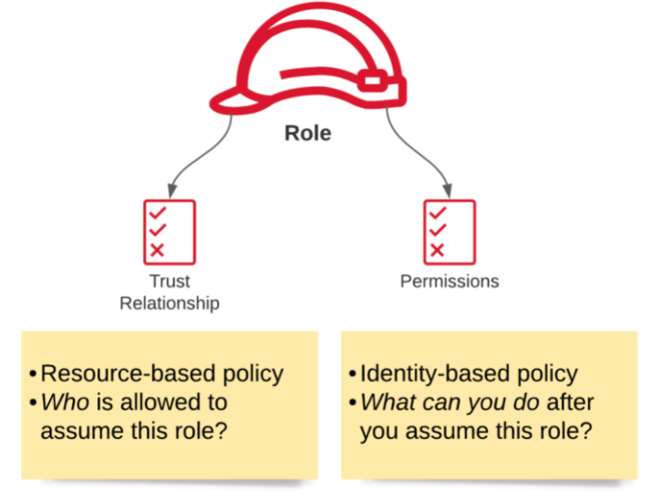

---
date: 2021-12-12
draft: false
thumbnail: /post-images/iam.png
title: AWS - IAM
extract: My notes for AWS intro and IAM
categories:
    - AWS
tags:
    - blog
    - AWS
--- 

### Table of Contents

- [Building Blocks](#building-blocks)
- [Important Tenets](#important-tenets)
- [Well Architected Framework](#well-architected-framework)
- [IAM](#iam)
  - [Identities](#identities)
    - [Root Users](#root-users)
    - [IAM Users](#iam-users)
    - [IAM User Groups](#iam-user-groups)
    - [IAM Roles](#iam-roles)
    - [AWS Services](#aws-services)
  - [Access Management](#access-management)
    - [Policy Documents](#policy-documents)
    - [IAM Permissions boundaries](#iam-permissions-boundaries)
    - [Access contorl lists (ACLs)](#access-contorl-lists-acls)
    - [Policy Documents Deep Dive](#policy-documents-deep-dive)
  - [IAM Assume Role](#iam-assume-role)


## Building Blocks
AWS has the concept of a `Region`, which is a physical location around the world where we cluster data centers. Common regions are us-east-1, us-west-2, eu-west-1, af-south-1 etc. 

An Availability Zone, (AZ), is one or more discrete data centers with redundant power, networking, and connectivity in an AWS Region. All AZs in an AWS Region are interconnected with high-bandwidth, low-latency networking, over fully redundant, dedicated metro fiber providing high-throughput, low-latency networking between AZs. All traffic between AZs is encrypted. 

[Image Credit - Acloud guru](https://acloudguru.com/)

There's another concept called Edge locations. Edge locations are endpoints to cache content closer to our end user. Services such as CloudFront can be considered as edge locations. 

## Important Tenets
Compute, storage, DBs and networking are all important for our purposes:

- **Compute**: Servers, VMs, lambdas: These are used to processs our information. In terms of AWS services, these are EC2, Lambda, ElasticBeanStalk. 
- **Storage**:  You can think of storage as a giant disk in the cloud that stores our information for us. AWS services in this category include S3, EBS, EFS, FSx, storage gateway etc.
- **DBs**: Giant spreadsheets: RDS, DynamoDB, Redshift etc
- **Networking**: Way for one AZ to communicate with another. Examples include: VPS, Direct Connect, Route53, API GW etc

## Well Architected Framework
Well architected framework consists of 6 pillars:

- Operational Excellence: The ability to support development and run workloads effectively, gain insight into their operations, and to continuously improve supporting processes and procedures to deliver business value.
  
- Security: The security pillar describes how to take advantage of cloud technologies to protect data, systems, and assets in a way that can improve your security posture.
  
- Reliability: 	The reliability pillar encompasses the ability of a workload to perform its intended function correctly and consistently when it’s expected to. This includes the ability to operate and test the workload through its total lifecycle. This paper provides in-depth, best practice guidance for implementing reliable workloads on AWS.
  
- Performance Efficiency: The ability to use computing resources efficiently to meet system requirements, and to maintain that efficiency as demand changes and technologies evolve.
  
- Cost Optimization: The ability to run systems to deliver business value at the lowest price point.

- Sustainability: The ability to continually improve sustainability impacts by reducing energy consumption and increasing efficiency across all components of a workload by maximizing the benefits from the provisioned resources and minimizing the total resources required.

It is suggested to re-visit these once you're done with familiarizing yourself with common AWS services. 
You can read more on well architected frameworks using white-papers [here](https://aws.amazon.com/whitepapers/?whitepapers-main.sort-by=item.additionalFields.sortDate&whitepapers-main.sort-order=desc&awsf.whitepapers-content-type=*all&awsf.whitepapers-tech-category=*all&awsf.whitepapers-industries=*all&awsf.whitepapers-business-category=*all&awsf.whitepapers-global-methodology=methodology%23well-arch-framework) and [here](https://docs.aws.amazon.com/wellarchitected/latest/framework/welcome.html?did=wp_card&trk=wp_card). 

## IAM
Since we're discussing Identity and Access Management, it is only fair to dive deep by discussing identities first and then access management. 

### Identities
#### Root Users
The most basic type of identity is created when you create a new AWS account. When you log in using the e-mail address you provided during signup, you sign in as a root user. The root user has permissions to perform all actions on all services. Thus, it is imperative that we secure this user. To do so, we can:
- Turn on MFA
- Create an admin group and assign permissions to this group
- Create user accounts for admins
- Add users to your admin groups

It is strongly recommend that you do not use the root user for your everyday tasks, even the administrative ones. Instead, adhere to the best practice of using the root user only to create your first IAM user. Take a look at [security best practices](https://docs.aws.amazon.com/IAM/latest/UserGuide/best-practices.html#create-iam-users) for more info. 

#### IAM Users
An IAM user is an entity that you create in AWS. The IAM user represents the person or service who uses the IAM user to interact with AWS. A primary use for IAM users is to give people the ability to sign in to the AWS Management Console for interactive tasks and to make programmatic requests to AWS services using the API or CLI. When you create a user, you have 2 options for access: programmatic access and console access:


If you choose programmatic access, you'll be provided an access key id and a secret access key:


By default, new users have NO permissions. 

#### IAM User Groups
Best practice is for users to be grouped together based off their job function. For example, we can have a group of EC2 admins who have administrator privileges for EC2 service only. If a new user joins your organization and should have administrator privileges, you can assign the appropriate permissions by adding the user to that user group. Similarly, if a person changes jobs in your organization, instead of editing that user's permissions, you can remove him or her from the old user groups and add him or her to the appropriate new user groups. 

#### IAM Roles
An IAM role is very similar to a user, in that it is an identity with permission policies that determine what the identity can and cannot do in AWS. However, a role does not have any credentials (password or access keys) associated with it. Instead of being uniquely associated with one person, a role is intended to be assumable by anyone who needs it. An IAM user can assume a role to temporarily take on different permissions for a specific task. A role can be assigned to a federated user who signs in by using an external identity provider instead of IAM. 

#### AWS Services
For the purposes of our discussion it is also important to note that specific AWS services (CloudWatch, S3, EC2, Lambda etc) are also considered as entities that require permissions to perform cross service actions (such as lambda writing to S3, EC2 emitting cloudwatch logs etc).

### Access Management
Before diving into the permissions, let's break down our identities into their respective groups:

[Image Credit - AWS-blog.de](https://aws-blog.de/2021/08/iam-what-happens-when-you-assume-a-role.html)

An identity is used to identify and group entities within IAM. From our venn diagram above, we can see that groups are exclusively an identity. A group is not a principal and as such can’t take action in an AWS account. Action here means making a call to an API Gateway endpoint etc. 

A principal on the other hand, is a person or application that can make a request for an action or operation on an AWS resource. The principal is authenticated as the AWS account root user or an IAM entity to make requests to AWS.

In order to manage access for identities listed above, we use something called a policy. A policy is defined in something called a policy document: 

#### Policy Documents
PDs are used to assign permissions using IAM. PDs are JSON files. Here's an example:

```json
{
  "Version": "2012-10-17",
  "Statement": [
      {
        "Effect": "Allow",
        "Action": "*",
        "Resource": "*"
      }
  ]
}
```

The policy document above shows that we have the allow effect for all actions for all resources. A policy allows or denies a set of actions to a principal on certain resources. These policies come in two main varieties: **identity-based** and **resource-based**. Identity-based policies can be attached to all identities and resource based policies belong to resources. They’re very similar in what they do, but there are a few key differences:

- **Identity-Based**: 
Identity-based policies are attached to an IAM user, group, or role. These policies let you specify what that identity can do (its permissions). These policies control what actions an identity (users, groups of users, and roles) can perform, on which resources, and under what conditions. For example, you can attach the policy to the IAM user named John, stating that he is allowed to perform the Amazon EC2 RunInstances action. The policy could further state that John is allowed to get items from an Amazon DynamoDB table named MyCompany. You can also allow John to manage his own IAM security credentials. An identity based policy answers the question ***“Which API calls can this identity perform on which resources?”*** 

Here's an example ID based policy:

```json
{
	"Version": "2012-10-17",
	"Statement": [
		{
			"Action": "s3:PutObject",
			"Resource": "*",
			"Effect": "Allow"
		}
	]
}
```

- **Resource-Based**: 
Resource-based policies are JSON policy documents that you attach to a resource such as an Amazon S3 bucket. These policies grant the specified principal permission to perform specific actions on that resource and defines under what conditions this applies. Resource-based policies are inline policies. There are no managed resource-based policies. For example, you can attach resource-based policies to Amazon S3 buckets, Amazon SQS queues, VPC endpoints, and AWS Key Management Service encryption keys. A resource based policy answers the question: ***“Which identities can perform which actions on me?”***.

Here's an example resource based policy:

```json
{
  "Version": "2012-10-17",
  "Statement": [{
    "Sid": "1",
    "Effect": "Allow",
    "Principal": {"AWS": ["arn:aws:iam::account-id:root"]},
    "Action": "s3:*",
    "Resource": [
      "arn:aws:s3:::mybucket",
      "arn:aws:s3:::mybucket/*"
    ]
  }]
}
```

The resource-based policy above can be attached to an Amazon S3 bucket. The policy allows members (or identities) of a specific AWS account to perform any Amazon S3 actions in the bucket named mybucket. It allows any action that can be performed on a bucket or the objects within it. (Because the policy grants trust only to the account, individual users in the account must still be granted permissions for the specified Amazon S3 actions.)


#### IAM Permissions boundaries
A permissions boundary is an advanced feature in which you set the maximum permissions that an identity-based policy can grant to an IAM entity. When you set a permissions boundary for an entity, the entity can perform only the actions that are allowed by both its identity-based policies and its permissions boundaries. Resource-based policies that specify the user or role as the principal are not limited by the permissions boundary. An explicit deny in any of these policies overrides the allow.

For example, assume that the IAM user named ShirleyRodriguez should be allowed to manage only Amazon S3, Amazon CloudWatch, and Amazon EC2. To enforce this rule, you can use the following policy to set the permissions boundary for the ShirleyRodriguez user:

```json
{
    "Version": "2012-10-17",
    "Statement": [
        {
            "Effect": "Allow",
            "Action": [
                "s3:*",
                "cloudwatch:*",
                "ec2:*"
            ],
            "Resource": "*"
        }
    ]
}
```

When you use a policy to set the permissions boundary for a user, it limits the user's permissions but does not provide permissions on its own. In this example, the policy sets the maximum permissions of ShirleyRodriguez as all operations in Amazon S3, CloudWatch, and Amazon EC2. Shirley can never perform operations in any other service, including IAM, even if she has a permissions policy that allows it.

#### Access contorl lists (ACLs)
Access control lists (ACLs) are service policies that allow you to control which principals in another account can access a resource. ACLs cannot be used to control access for a principal within the same account. ACLs are similar to resource-based policies, although they are the only policy type that does not use the JSON policy document format. 

#### Policy Documents Deep Dive
Let's look at policy documents in more detail. The following policy has three statements, each of which defines a separate set of permissions within a single account:

```json
{
  "Version": "2012-10-17",
  "Statement": [
    {
      "Sid": "FirstStatement",
      "Effect": "Allow",
      "Action": ["iam:ChangePassword"],
      "Resource": "*"
    },
    {
      "Sid": "SecondStatement",
      "Effect": "Allow",
      "Action": "s3:ListAllMyBuckets",
      "Resource": "*"
    },
    {
      "Sid": "ThirdStatement",
      "Effect": "Allow",
      "Action": [
        "s3:List*",
        "s3:Get*"
      ],
      "Resource": [
        "arn:aws:s3:::confidential-data",
        "arn:aws:s3:::confidential-data/*"
      ],
      "Condition": {"Bool": {"aws:MultiFactorAuthPresent": "true"}}
    }
  ]
}
```

The first statement, with an Sid (Statement ID) of FirstStatement, lets the user with the attached policy change their own password. The Resource element in this statement is "*" (which means "all resources"). But in practice, the ChangePassword API operation (or equivalent change-password CLI command) affects only the password for the user who makes the request. 

The second statement lets the user list all the Amazon S3 buckets in their AWS account. The Resource element in this statement is "*" (which means "all resources"). But because policies don't grant access to resources in other accounts, the user can list only the buckets in their own AWS account.

The third statement lets the user list and retrieve any object that is in a bucket named confidential-data, but only when the user is authenticated with multi-factor authentication (MFA). The Condition element in the policy enforces the MFA authentication.

When a policy statement contains a Condition element, the statement is only in effect when the Condition element evaluates to true. In this case, the Condition evaluates to true when the user is MFA-authenticated. If the user is not MFA-authenticated, this Condition evaluates to false. In that case, the third statement in this policy does not apply and the user does not have access to the confidential-data bucket.

Visit [here](https://docs.aws.amazon.com/IAM/latest/UserGuide/access_policies_examples.html) to see a large collection of various IAM policies.

### IAM Assume Role
Now that we’ve covered the mechanisms for authentication (principals) and authorization (policies), let’s take a look at roles. A role is both a principal and identity in AWS and has the primary purpose of granting temporary permissions to perform API-calls in an account. In order to use a role, it has to be assumed:

[Image Credit - AWS-blog.de](https://aws-blog.de/2021/08/iam-what-happens-when-you-assume-a-role.html)

Each role has a trust relationship which determines the entities that can assume the role. It also has a set of permissions that define which privileges entities get after they assume the role. To assume a role, we use the Security Token Service (STS) that gives us temporary credentials to use the role. Why would we need separate credentials? When you assume a role, you get credentials, which you can use to make API-calls with. These credentials let you act as the role until they expire.

The API call we need to make in order to assume the role is the sts:AssumeRole action. Here we need to specify the ARN of the role we want to assume as well as a session name. The session name will be visible in CloudTrail and is part of what makes it transparent who assumed a role. Optionally we can also specify how long the credentials should be valid. The upper limit in IAM is 72 hours, but you can specify a lower boundary for each role.

In order for this to work, the principal that assumes the role needs the sts:AssumeRole permission for said role in its identity policy and the principal needs to be listed in the trust relationship of the role. If either of them is missing the call fails.

For more info, read [this](https://aws-blog.de/2021/08/iam-what-happens-when-you-assume-a-role.html) great write up.

