---
date: 2021-12-13
draft: false
thumbnail: /post-images/aws-s3.png
title: AWS - S3
extract: Notes for S3
categories:
    - AWS
tags:
    - blog
    - AWS
--- 


### Table of Contents

- [What is S3?](#what-is-s3)
- [S3 Basics](#s3-basics)
- [S3 Objects](#s3-objects)
  - [Object Key](#object-key)
  - [Object Value](#object-value)
  - [Object Metadata](#object-metadata)
  - [Object Version ID](#object-version-id)
- [S3 Buckets](#s3-buckets)
- [S3 Versioning](#s3-versioning)
  - [Versioning workflows](#versioning-workflows)
  - [Delete Markers](#delete-markers)
- [S3 Object Lock](#s3-object-lock)
- [S3 Glacier Vault Lock Policy](#s3-glacier-vault-lock-policy)
- [S3 Encryption](#s3-encryption)
  - [Server Side Encryption](#server-side-encryption)
  - [<u>Server-Side Encryption with Amazon S3-Managed Keys (SSE-S3)</u>](#userver-side-encryption-with-amazon-s3-managed-keys-sse-s3u)
  - [<u>Server-Side Encryption with KMS keys Stored in AWS Key Management Service (SSE-KMS)</u>](#userver-side-encryption-with-kms-keys-stored-in-aws-key-management-service-sse-kmsu)
  - [<u>Server-Side Encryption with Customer-Provided Keys (SSE-C)</u>](#userver-side-encryption-with-customer-provided-keys-sse-cu)
- [S3 Storage Classes](#s3-storage-classes)
  - [S3 Standard](#s3-standard)
  - [Reduced Redundancy](#reduced-redundancy)
  - [S3 IA Classes](#s3-ia-classes)
    - [S3 Standard IA](#s3-standard-ia)
    - [S3 One Zone IA](#s3-one-zone-ia)
  - [S3 Glacier IR](#s3-glacier-ir)
  - [S3 Glacier FR](#s3-glacier-fr)
  - [S3 Glacier Deep Archive](#s3-glacier-deep-archive)
- [Storage Classes Comparison](#storage-classes-comparison)
- [Lifecycle Management](#lifecycle-management)
- [Securing your data](#securing-your-data)
  - [Pre-Signed URLs and Cookies](#pre-signed-urls-and-cookies)
- [Consistency Model](#consistency-model)
- [Hosting a Static Website](#hosting-a-static-website)
  - [Endpoints](#endpoints)
  - [Adding a DNS CNAME](#adding-a-dns-cname)
  - [Enabling website hosting](#enabling-website-hosting)
    - [Configuring an index document](#configuring-an-index-document)
    - [Configuring a custom error document](#configuring-a-custom-error-document)
    - [Setting permissions for website access](#setting-permissions-for-website-access)
- [S3 Prefixes](#s3-prefixes)
- [S3 Performance](#s3-performance)
- [S3 Replication](#s3-replication)
  - [When to use Cross-Region Replication](#when-to-use-cross-region-replication)
  - [When to use Same-Region Replication](#when-to-use-same-region-replication)
  - [Requirements for replication](#requirements-for-replication)
  - [Replication Walk through!](#replication-walk-through)


## What is [S3](https://docs.aws.amazon.com/AmazonS3/latest/userguide/Welcome.html)?
Simple Storage Service, or S3, provides object storage in the cloud. It is a durable and highly scalable service. S3 is object based storage: meaning it manages data as objects rather than file system. S3 is a key value store where key is the name you give your object and value is the object itself. You can upload any file type to S3 (image, text, videos, HTML files etc). You however, cannot run OSs or DBs on S3! You store your static files in S3. 

## S3 Basics
You can store unlimited number of objects in S3. Objects can be from 0B to 5TB in size. Files are stored in a bucket. 

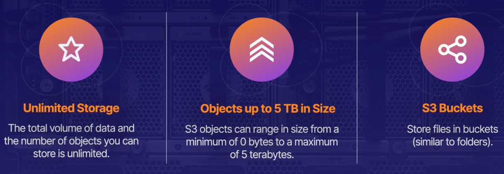[Image Credit - Acloud guru](https://acloudguru.com/)

## S3 Objects
An S3 [object](https://docs.aws.amazon.com/AmazonS3/latest/userguide/UsingObjects.html) is comprised of a key, a value, a versionId and metadata. Let's take a look at some of these in more detail:

### Object Key
The name that you assign to an object. You use the object key to retrieve the object. The object key (or key name) uniquely identifies the object in an Amazon S3 bucket. 

### Object Value

Value is the actual content that you are storing. An object value can be any sequence of bytes. Objects can range in size from zero to 5 TB. **If your object size is >= 5GB, it is required to use multi-part upload**. The multipart upload API is designed to improve the upload experience for larger objects. You can upload an object in parts. These object parts can be uploaded independently, in any order, and in parallel. You can use a multipart upload for objects from 5 MB to 5 TB in size. 

### Object Metadata
Along with the object data (bytes that make your object), there also exists object metadata. The metadata is a set of name-value pairs that describe the object. These pairs include some default metadata, such as the date last modified, and standard HTTP metadata, such as Content-Type. You can also specify custom metadata at the time that the object is stored. 

There are two kinds of metadata in Amazon S3: system-defined metadata and user-defined metadata. System metadata information include the following:
- Date
- Content-Length	
- Content-Type	
- Last-Modified	
- x-amz-server-side-encryption
- x-amz-version-id	
- x-amz-delete-marker	
- x-amz-storage-class	
- x-amz-website-redirect-location	

and more! 

User-defined metadata can be defined when uploading an object. You provide this optional information as a name-value (key-value) pair when you send a PUT or POST request to create the object. When you upload objects using the REST API, the optional user-defined metadata names must begin with "x-amz-meta-" to distinguish them from other HTTP headers. When you retrieve the object using the REST API, this prefix is returned. 

More info on metadata [here](https://docs.aws.amazon.com/AmazonS3/latest/userguide/UsingMetadata.html)

### Object Version ID
Version ID allows you to store multiple versions of the same object. See [versioning](#s3-versioning) section below. 

## S3 Buckets
A bucket is a container for objects stored in Amazon S3. You can store any number of objects in a bucket and can have up to 100 buckets in your account. To request an increase, visit the Service Quotas Console. Here're a few properties related to our S3 buckets:

- **Universal Namespace**

An Amazon S3 bucket name is globally unique, and the namespace is shared by all AWS accounts. This means that after a bucket is created, the name of that bucket cannot be used by another AWS account in any AWS Region until the bucket is deleted. You should not depend on specific bucket naming conventions for availability or security verification purposes. Amazon S3 creates buckets in a Region that you specify. To optimize latency, minimize costs, or address regulatory requirements, choose any AWS Region that is geographically close to you.  

- **Bucket URLs**

Each bucket that you create will have a URL associated with it. The URL will follow this convention:

`https://<bucket-name>.s3.<Region>.amazonaws.com/<key-name>`

For example, if the object named photos/puppy.jpg is stored in the DOC-EXAMPLE-BUCKET bucket in the US West (Oregon) Region, then it is addressable using the URL `https://DOC-EXAMPLE-BUCKET.s3.us-west-2.amazonaws.com/photos/puppy.jpg`. When you create a bucket, you enter a bucket name and choose the AWS Region where the bucket will reside. After you create a bucket, you cannot change the name of the bucket or its Region. Bucket names must follow the bucket naming rules. 

## S3 Versioning
You can use S3 Versioning to keep multiple variants of an object in the same bucket. With S3 Versioning, you can preserve, retrieve, and restore every version of every object stored in your buckets. You can easily recover from both unintended user actions and application failures. **Versioning helps you recover accidental overwrites and deletes along with MFA.** 

It is recommend to use versioning as a best practice to recover objects from being deleted or overwritten by mistake. For example, if you delete an object, Amazon S3 inserts a delete marker instead of removing the object permanently. The delete marker becomes the current object version. If you overwrite an object, it results in a new object version in the bucket. You can always restore the previous version. **By default, S3 Versioning is disabled on buckets, and you must explicitly enable it.**

Buckets can be in one of three states: Unversioned (the default), versioning-enabled or versioning-suspended. You enable and suspend versioning at the bucket level. After you version-enable a bucket, it can never return to an unversioned state. But you can suspend versioning on that bucket.  When you enable versioning in a bucket, all new objects are versioned and given a unique version ID. Objects that already existed in the bucket at the time versioning was enabled will thereafter always be versioned and given a unique version ID when they are modified by future requests. 

Let's say you uploaded a file and then uploaded a 2nd version with some changes. With `Show Versions` enabled, you'll see this in the bucket:

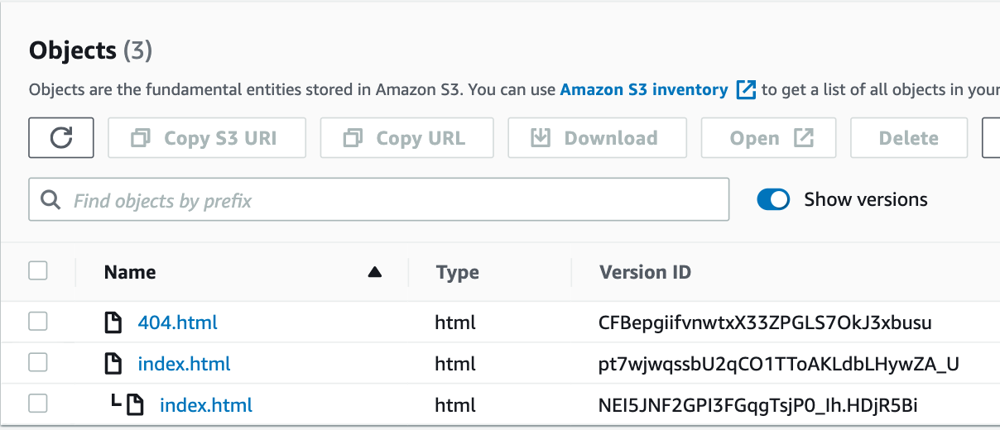

You'll be able to see the old version (last in the list above) but won't be able to access it. You'll get an access denied if you tried. That's because the old version is not public.

### Versioning workflows
When you PUT an object in a versioning-enabled bucket, the noncurrent version is not overwritten. The following figure shows that when a new version of photo.gif is PUT into a bucket that already contains an object with the same name, the original object (ID = 111111) remains in the bucket, Amazon S3 generates a new version ID (121212), and adds the newer version to the bucket.

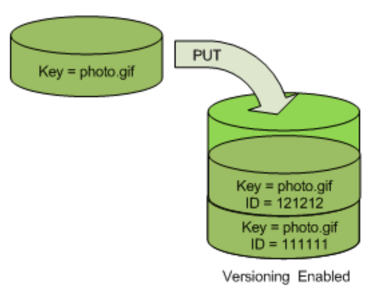[Image-Credit](https://docs.aws.amazon.com/AmazonS3/latest/userguide/versioning-workflows.html)


This functionality prevents you from accidentally overwriting or deleting objects and gives you the opportunity to retrieve a previous version of an object.

When you DELETE an object, all versions remain in the bucket and Amazon S3 inserts a delete marker, as shown in the following figure.

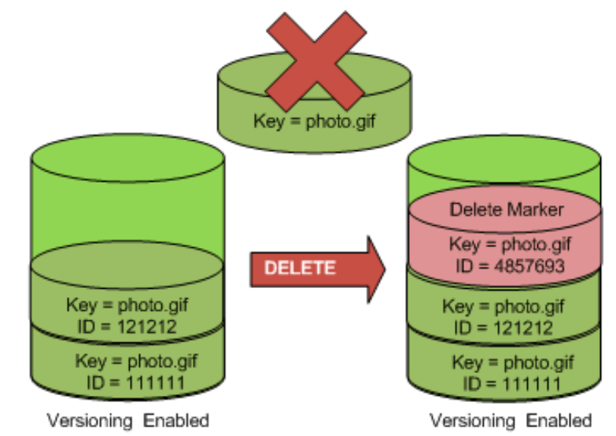[Image-Credit](https://docs.aws.amazon.com/AmazonS3/latest/userguide/versioning-workflows.html)

The delete marker becomes the current version of the object. By default, GET requests retrieve the most recently stored version. Performing a simple GET Object request when the current version is a delete marker returns a 404 Not Found error, as shown in the following figure.

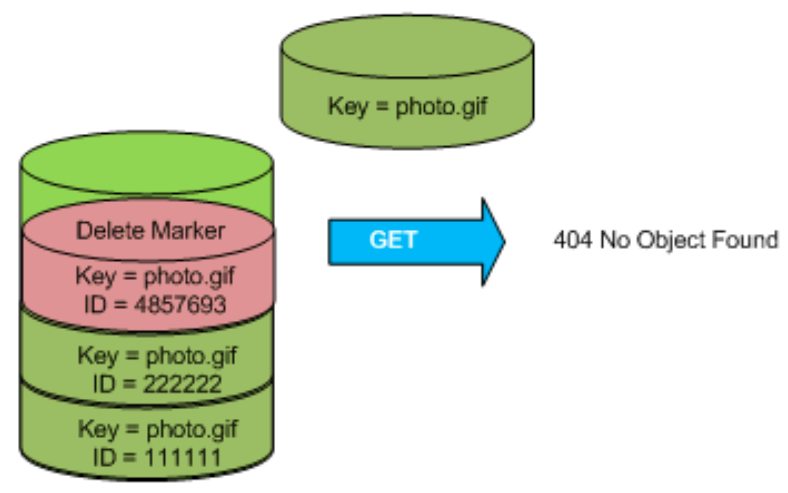[Image-Credit](https://docs.aws.amazon.com/AmazonS3/latest/userguide/versioning-workflows.html)

You can add more security by configuring a bucket to enable MFA (multi-factor authentication) delete. When you do, the bucket owner must include two forms of authentication in any request to delete a version or change the versioning state of the bucket.

### Delete Markers
Let's go ahead and delete `index.html`. It disappears from the list but if you click on `Show Versions` you notice that it is not actually gone:

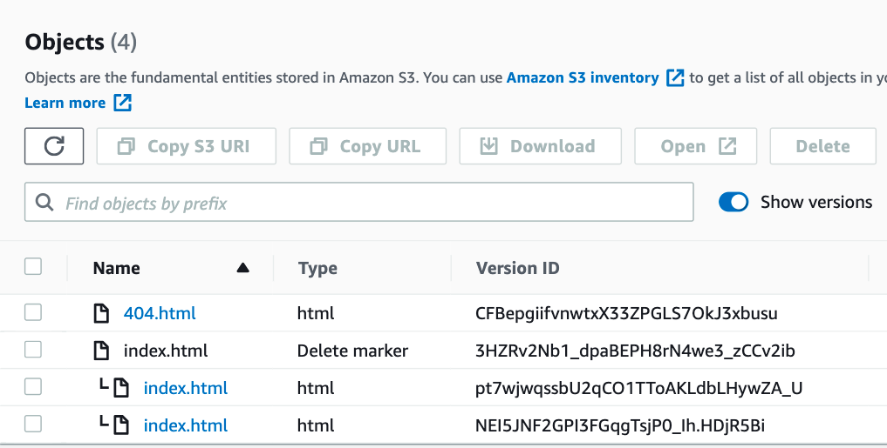

Notice how the file now has something called  a delete marker. The file is not deleted, it is just marked as deleted. Now what if I want to bring back this deleted file? Just delete the delete marker! Which is delete the `index.html` file again. 

If you delete an object, instead of removing it permanently, Amazon S3 inserts a delete marker, which becomes the current object version. You can then restore the previous version.


## S3 Object Lock
With S3 Object Lock, you can store objects using a write-once-read-many (WORM) model. This means that you write your object "ONCE" and then that object is to be read many many times. 

Object Lock can help prevent objects from being deleted or overwritten for a fixed amount of time or indefinitely. You can use Object Lock to help meet regulatory requirements that require WORM storage, or to simply add another layer of protection against object changes and deletion.

S3 Object Lock provides two retention modes:

**Governance mode**

In governance mode, users can't overwrite or delete an object version or alter its lock settings unless they have special permissions. With governance mode, you protect objects against being deleted by most users, but you can still grant some users permission to alter the retention settings or delete the object if necessary. You can also use governance mode to test retention-period settings before creating a compliance-mode retention period. 

To override or remove governance-mode retention settings, a user must have the s3:BypassGovernanceRetention permission and must explicitly include x-amz-bypass-governance-retention:true as a request header with any request that requires overriding governance mode.

**Compliance mode**

In compliance mode, a protected object version can't be overwritten or deleted by any user, including the root user in your AWS account. When an object is locked in compliance mode, its retention mode can't be changed, and its retention period can't be shortened. Compliance mode helps ensure that an object version can't be overwritten or deleted for the duration of the retention period.

Let's look at the retention periods that are available with the two modes we discussed above:

**Retention period** — Specifies a fixed period of time during which an object remains locked. During this period, your object is WORM-protected and can't be overwritten or deleted. To implement retention period, S3 stores a timestamp in the object version's metadata to indicate when the retention period expires. After the period expires, the object version can be overwritten or deleted unless you also placed a legal hold on the object version. 

**Legal hold** — Provides the same protection as a retention period, but it has no expiration date. Instead, a legal hold remains in place until you explicitly remove it. Legal holds are independent from retention periods. Legal holds do not have an assoicated retention period and remain in effect until removed. Legal holds can be freely placed and removed by any user who has the `s3:PutObjectLegalHold` permission.

An object version can have both a retention period and a legal hold, one but not the other, or neither. Object Lock works only in versioned buckets, and retention periods and legal holds apply to individual object versions. When you lock an object version, Amazon S3 stores the lock information in the metadata for that object version. Placing a retention period or legal hold on an object protects only the version specified in the request. It doesn't prevent new versions of the object from being created.

## S3 Glacier Vault Lock Policy
S3 Glacier Vault Lock allows you to easily deploy and enforce compliance controls for individual S3 Glacier vaults with a vault lock policy. You can specify controls such as “write once read many” (WORM) in a vault lock policy and lock the policy from future edits. Once locked, the policy can no longer be changed. S3 Glacier enforces the controls set in the vault lock policy to help achieve your compliance objectives, for example, for data retention. You can deploy a variety of compliance controls in a vault lock policy using the AWS Identity and Access Management (IAM) policy language. 

A vault lock policy is different than a vault access policy. Both policies govern access controls to your vault. However, a vault lock policy can be locked to prevent future changes, providing strong enforcement for your compliance controls. You can use the vault lock policy to deploy regulatory and compliance controls, which typically require tight controls on data access. 

In contrast, you use a vault access policy to implement access controls that are not compliance related, temporary, and subject to frequent modification. Vault lock and vault access policies can be used together. For example, you can implement time-based data retention rules in the vault lock policy (deny deletes), and grant read access to designated third parties or your business partners (allow reads).

Locking a vault takes two steps:

1. Initiate the lock by attaching a vault lock policy to your vault, which sets the lock to an in-progress state and returns a lock ID. While in the in-progress state, you have 24 hours to validate your vault lock policy before the lock ID expires.

2. Use the lock ID to complete the lock process. If the vault lock policy doesn't work as expected, you can stop the lock and restart from the beginning.


## S3 Encryption

Let's first look at the types of encryptions:

- **Server Side Encryption:** Encryption of data as it resides in your S3 bucket. Can be done using SSE-S3, SSE-KMS and SSE-C. To select the type of encryption, you could use the console or via bucket policy.

- **Encryption in transit:** Encryption of data as you transfer data to and retrieve data from S3. This can be done using SSL/TLS and HTTPS.

- **Client Side Encryption:** You encrypt the files yourself before you upload them to S3. 

### Server Side Encryption
Server-side encryption is the encryption of data at its destination by the application or service that receives it. Amazon S3 encrypts your data at the object level as it writes it to disks in its data centers and decrypts it for you when you access it. As long as you authenticate your request and you have access permissions, there is no difference in the way you access encrypted or unencrypted objects. You have three mutually exclusive options, depending on how you choose to manage the encryption keys.

### <u>Server-Side Encryption with Amazon S3-Managed Keys (SSE-S3)</u>
When you use Server-Side Encryption with Amazon S3-Managed Keys (SSE-S3), each object is encrypted with a unique key. As an additional safeguard, it encrypts the key itself with a root key that it regularly rotates. Amazon S3 server-side encryption uses one of the strongest block ciphers available, 256-bit Advanced Encryption Standard (AES-256), to encrypt your data. 

If you need server-side encryption for all of the objects that are stored in a bucket, use a bucket policy. For example, the following bucket policy denies permissions to upload an object unless the request includes the x-amz-server-side-encryption header to request server-side encryption:

```json
{
  "Version": "2012-10-17",
  "Id": "PutObjectPolicy",
  "Statement": [
    {
      "Sid": "DenyIncorrectEncryptionHeader",
      "Effect": "Deny",
      "Principal": "*",
      "Action": "s3:PutObject",
      "Resource": "arn:aws:s3:::awsexamplebucket1/*",
      "Condition": {
        "StringNotEquals": {
          "s3:x-amz-server-side-encryption": "AES256"
        }
      }
    },
    {
      "Sid": "DenyUnencryptedObjectUploads",
      "Effect": "Deny",
      "Principal": "*",
      "Action": "s3:PutObject",
      "Resource": "arn:aws:s3:::awsexamplebucket1/*",
      "Condition": {
        "Null": {
          "s3:x-amz-server-side-encryption": "true"
        }
      }
    }
  ]
}
```

### <u>Server-Side Encryption with KMS keys Stored in AWS Key Management Service (SSE-KMS)</u>
Server-Side Encryption with AWS KMS keys (SSE-KMS) is similar to SSE-S3, but with some additional benefits and charges for using this service. There are separate permissions for the use of a KMS key that provides added protection against unauthorized access of your objects in Amazon S3. SSE-KMS also provides you with an audit trail that shows when your KMS key was used and by whom. Additionally, you can create and manage customer managed keys or use AWS managed keys that are unique to you, your service, and your Region.

When you use server-side encryption with AWS KMS (SSE-KMS), you can use the default AWS managed key, or you can specify a customer managed key that you have already created. The data keys used to encrypt your data are also encrypted and stored alongside the data that they protect.

If you don't specify a customer managed key, Amazon S3 automatically creates an AWS KMS key in your AWS account the first time that you add an object encrypted with SSE-KMS to a bucket. By default, Amazon S3 uses this KMS key for SSE-KMS. To require server-side encryption of all objects in a particular Amazon S3 bucket, you can use a policy. For example, the following bucket policy denies upload object (s3:PutObject) permission to everyone if the request does not include the x-amz-server-side-encryption header requesting server-side encryption with SSE-KMS:

```json
{
   "Version":"2012-10-17",
   "Id":"PutObjectPolicy",
   "Statement":[{
         "Sid":"DenyUnEncryptedObjectUploads",
         "Effect":"Deny",
         "Principal":"*",
         "Action":"s3:PutObject",
         "Resource":"arn:aws:s3:::DOC-EXAMPLE-BUCKET1/*",
         "Condition":{
            "StringNotEquals":{
               "s3:x-amz-server-side-encryption":"aws:kms"
            }
         }
      }
   ]
}
```

### <u>Server-Side Encryption with Customer-Provided Keys (SSE-C)</u>
With Server-Side Encryption with Customer-Provided Keys (SSE-C), you manage the encryption keys and Amazon S3 manages the encryption, as it writes to disks, and decryption, when you access your objects. 

Using server-side encryption with customer-provided encryption keys (SSE-C) allows you to set your own encryption keys. With the encryption key you provide as part of your request, Amazon S3 manages the encryption as it writes to disks and decryption when you access your objects. Therefore, you don't need to maintain any code to perform data encryption and decryption. The only thing you do is manage the encryption keys you provide.

When you upload an object, Amazon S3 uses the encryption key you provide to apply AES-256 encryption to your data and removes the encryption key from memory. When you retrieve an object, you must provide the same encryption key as part of your request. Amazon S3 first verifies that the encryption key you provided matches and then decrypts the object before returning the object data to you.

There are no new charges for using server-side encryption with customer-provided encryption keys (SSE-C).

## S3 Storage Classes

### S3 Standard
The default storage class. If you don't specify the storage class when you upload an object, Amazon S3 assigns the S3 Standard storage class.

Properties:
  - Data is stored redundantly across multiple devices in multiple facilities ( >= 3AZs).
  - 99.99% availability
  - 99.999999999% durability
  - Designed for frequent access
  - Suitable for websites, content distribution, mobile and gaming apps, big data analytics etc
  
### Reduced Redundancy
The Reduced Redundancy Storage (RRS) storage class is designed for noncritical, reproducible data that can be stored with less redundancy than the S3 Standard storage class.

### S3 IA Classes
The S3 Standard-IA and S3 One Zone-IA storage classes are designed for long-lived and infrequently accessed data. (IA stands for infrequent access.) S3 Standard-IA and S3 One Zone-IA objects are available for millisecond access (similar to the S3 Standard storage class). Amazon S3 charges a retrieval fee for these objects, so they are most suitable for infrequently accessed data. 

You might choose the S3 Standard-IA and S3 One Zone-IA storage classes to do the following:
 - For storing backups.
 - For older data that is accessed infrequently, but that still requires millisecond access. For example, when you upload data, you might choose the S3 Standard storage class, and use lifecycle configuration to tell Amazon S3 to transition the objects to the S3 Standard-IA or S3 One Zone-IA class.

The S3 Standard-IA and S3 One Zone-IA storage classes are suitable for objects larger than 128 KB that you plan to store for at least 30 days. If an object is less than 128 KB, Amazon S3 charges you for 128 KB. If you delete an object before the end of the 30-day minimum storage duration period, you are charged for 30 days.

#### S3 Standard IA
Amazon S3 stores the object data redundantly across multiple geographically separated Availability Zones (similar to the S3 Standard storage class). S3 Standard-IA objects are resilient to the loss of an Availability Zone. This storage class offers greater availability and resiliency than the S3 One Zone-IA class.

**Use for your primary or only copy of data that can't be re-created.**

#### S3 One Zone IA
Amazon S3 stores the object data in only one Availability Zone, which makes it less expensive than S3 Standard-IA. However, the data is not resilient to the physical loss of the Availability Zone resulting from disasters, such as earthquakes and floods. The S3 One Zone-IA storage class is as durable as Standard-IA, but it is less available and less resilient.

**Use if you can re-create the data if the Availability Zone fails, and for object replicas when setting S3 Cross-Region Replication (CRR).**

### S3 Glacier IR
Use for archiving data that is rarely accessed and requires milliseconds retrieval. Data stored in the S3 Glacier Instant Retrieval storage class offers a cost savings compared to the S3 Standard-IA storage class, with the same latency and throughput performance as the S3 Standard-IA storage class. S3 Glacier Instant Retrieval has higher data access costs than S3 Standard-IA. 

### S3 Glacier FR
Use for archives where portions of the data might need to be retrieved in minutes. Data stored in the S3 Glacier Flexible Retrieval storage class has a minimum storage duration period of 90 days and can be accessed in as little as 1-5 minutes using expedited retrieval. If you have deleted, overwritten, or transitioned to a different storage class an object before the 90-day minimum, you are charged for 90 days. 

### S3 Glacier Deep Archive
Use for archiving data that rarely needs to be accessed. Data stored in the S3 Glacier Deep Archive storage class has a minimum storage duration period of 180 days and a default retrieval time of 12 hours. S3 Glacier Deep Archive is the lowest cost storage option in AWS. Storage costs for S3 Glacier Deep Archive are less expensive than using the S3 Glacier Flexible Retrieval storage class. You can reduce S3 Glacier Deep Archive retrieval costs by using bulk retrieval, which returns data within 48 hours.


## Storage Classes Comparison
| Storage class	      | Designed for	  | Availability | Min storage duration | Min billable object size | Other considerations |
| ----------- | -----------  | ----------- | ----------- | ----------- | ----------- |
| **Standard**      | Frequently accessed data (more than once a month) with millsecond access              | 99.99%         | None       | None       | None       |
| **Standard-IA**   | Long-lived, infrequently accessed data (once a month) with millisecond access                | 99.9%           | 30 days        | 128KB        | Per GB retrieval fees apply        |
| **Intelligent-Tiering**   | Data with unknown, changing, or unpredictable access patterns                | 99.9%           | None        | None        | Monitoring and automation fees per object apply. No retrieval fees.        |
| **One Zone-IA**   | Recreatable, infrequently accessed data (once a month) with millisecond access                | 99.5%        | 30 days        | 128KB        | Per GB retrieval fees apply. Not resilient to the loss of the Availability Zone.        |
| **Glacier Instant Retrieval**   | Long-lived, archive data accessed once a quarter with millisecond access                | 99.9%           | 90 days        | 128 KB        | Per GB retrieval fees apply.        |
| **Glacier Flexible Retrieval**   | Long-lived archive data accessed once a year with retrieval times of minutes to hours                | 99.99% (after you restore objects)           | 90 days        | 40 KB        | Per GB retrieval fees apply. You must first restore archived objects before you can access them.         |
| **Glacier Deep Archive**   | Long-lived archive data accessed less than once a year with retrieval times of hours                | 99.99% (after you restore objects)           | 180 days        | 40 KB        | Per GB retrieval fees apply. You must first restore archived objects before you can access them.        |


* All of the classes above have a durability of 11 9s: 99.999999999%
* All classes above are replicated across 3 AZs EXCEPT for obviously One Zone-IA that is replicated in 1 AZ.
* All of the storage classes except for S3 One Zone-IA are designed to be resilient to the physical loss of an Availability Zone resulting from disasters. In addition to the performance requirements of your application scenario, consider costs.

## Lifecycle Management
To manage your objects so that they are stored cost effectively throughout their lifecycle, configure their Amazon S3 Lifecycle. An S3 Lifecycle configuration is a set of rules that define actions that Amazon S3 applies to a group of objects. You can use lifecycle management to move different versions of objects to different storage tiers as well.


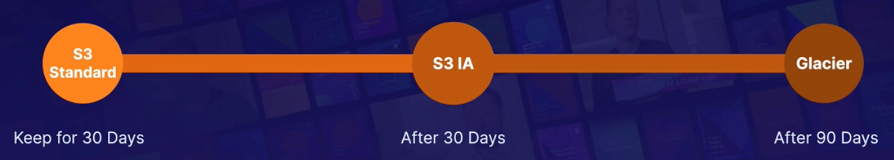[Image Credit - Acloud guru](https://acloudguru.com/)

There are two types of actions:

- **Transition actions** 

These actions define when objects transition to another storage class. For example, you might choose to transition objects to the S3 Standard-IA storage class 30 days after creating them, or archive objects to the S3 Glacier Flexible Retrieval storage class one year after creating them. There are costs associated with lifecycle transition requests.

- **Expiration actions**
These actions define when objects expire. Amazon S3 deletes expired objects on your behalf. Lifecycle expiration costs depend on when you choose to expire objects.

Define S3 Lifecycle configuration rules for objects that have a well-defined lifecycle. For example:

- If you upload periodic logs to a bucket, your application might need them for a week or a month. After that, you might want to delete them.
- Some documents are frequently accessed for a limited period of time. After that, they are infrequently accessed. At some point, you might not need real-time access to them, but your organization or regulations might require you to archive them for a specific period. After that, you can delete them.
- You might upload some types of data to Amazon S3 primarily for archival purposes. For example, you might archive digital media, financial and healthcare records, raw genomics sequence data, long-term database backups, and data that must be retained for regulatory compliance.

With S3 Lifecycle configuration rules, you can tell Amazon S3 to transition objects to less-expensive storage classes, or archive or delete them.

Below is a sample lifecycle rule that transitions a file to OneZoneIA after 30 days:

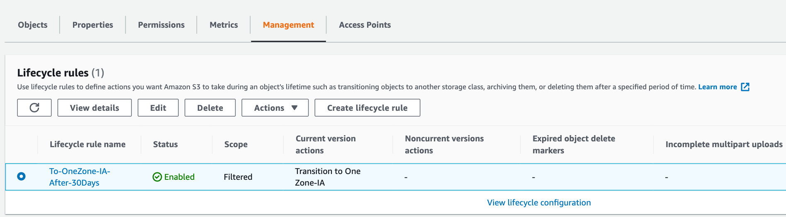

You can have multiple transition rules as shown below:

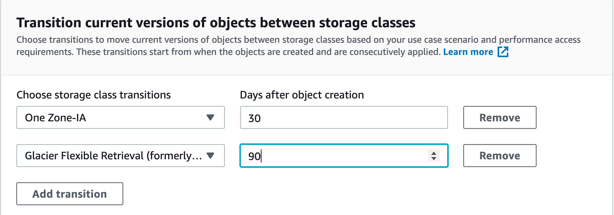

## Securing your data
- **Server side encryption**:
You can set default encryption on a bucket to encrypt all new objects when they are stored in the bucket. 

- **ACLs**:
Define which AWS accounts or groups are granted access and the type of access on your buckets. You can attach S3 ACLs to individul objects within a bucket. Much more fine grained access policies! 

- **Bucket Policies**:
S3 bucket policies that specify what action are allowed or denied (example user A can PUT but not DELETE). Bucket policies are obviously bucket wide. These are IAM policies for S3 buckets. This is more general as compared to ACLs. 

Here's how bucket policies compare to ACLs:

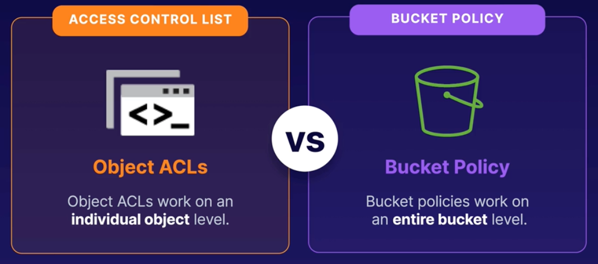[Image Credit - Acloud guru](https://acloudguru.com/)

- **Block Public Access**

This setting blocks public access of your bucket. This is turned on by default. This will make your bucket private. If you try and visit the URL for the uploaded object, you'll see this:

```xml
<Error>
  <Code>AccessDenied</Code>
  <Message>Access Denied</Message>
  <RequestId>G7FM3575JGCWJ9G0</RequestId>
  <HostId>uJHMgzPTlEBCvZjMO0g8+YCBTx21Kc3yAofsC+vRZ2kclsSQDgRf8RqqZyAAMNUypxDjXqZ6tu0=</HostId>
</Error>
```

If you try and make it public, you'll get an error since you've blocked public access at the bucket level. To make objects public, you need to make your bucket public first and then make objects public. 

### Pre-Signed URLs and Cookies

All objects in S3 are private by default and only the owner has access to these objects. Objects can be shared with others by creating a **presigned URL** to grant time-limited permissions to download the objects. Anyone who receives the pre-signed URL can then access the object. 

Sample bash command to pre-sign a URL:

```bash
$ aws s3 presign s3://link/to/my/secret.txt --expires-in 3600
```

This will return a long pre-signed URL which can then be used to access my secret! 

To provide access to multiple restricted files, use **pre-signed cookies**. The cookie will be saved on the user's computer and they will be able to browse the entire contents of the restricted objects. 

## Consistency Model

S3 has **strong read after write consistency** meaning that after a successful write of a new object (PUT, UPDATE or DELETE), any subsequent read requests immediately receive the latest version of the object. 

S3 is strongly consistent for LIST operations

## Hosting a Static Website
You can use Amazon S3 to host a **static** website. On a static website, individual webpages include static content. They might also contain client-side scripts. By contrast, a dynamic website relies on server-side processing, including server-side scripts such as PHP, JSP, or ASP.NET. Amazon S3 does not support server-side scripting, but AWS has other resources for hosting dynamic websites. 

To enable hosting static website, you need to create a bucket and enable Static Website Hosting from properties:

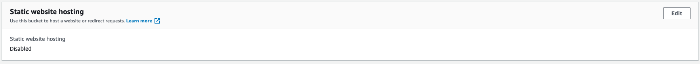

It'll ask you for the index document and error document:

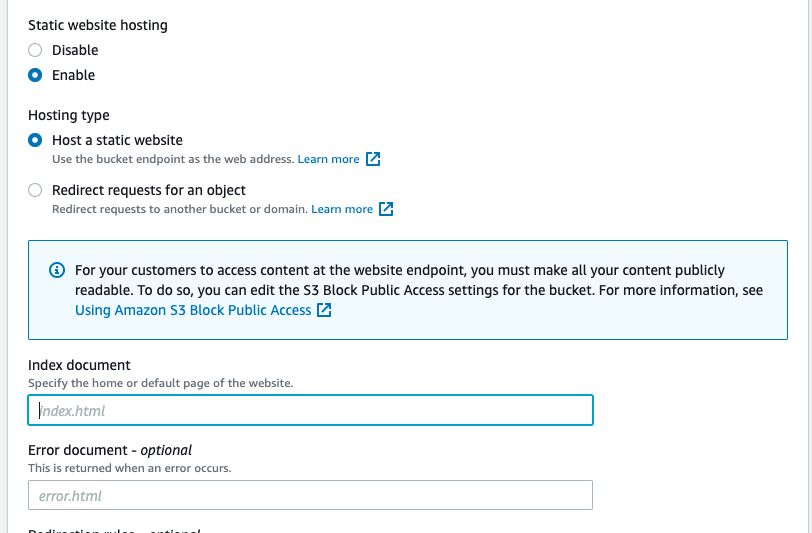 

You'll be given an endpoint that looks like:

`http://iqbaltesting.s3-website-us-east-1.amazonaws.com` 


More info on index and document types in the following sections.

### Endpoints

When you configure your bucket as a static website, the website is available at the AWS Region-specific website endpoint of the bucket. Website endpoints are different from the endpoints where you send REST API requests. Depending on your Region, your Amazon S3 website endpoint follows one of these two formats.

 - s3-website dash (-) Region ‐ `http://bucket-name.s3-website-Region.amazonaws.com`
 - s3-website dot (.) Region ‐ `http://bucket-name.s3-website.Region.amazonaws.com`

These URLs return the default index document that you configure for the website. For your customers to access content at the website endpoint, you must make all your content publicly readable. To do so, you can edit the S3 Block Public Access settings for the bucket. Then, use a bucket policy or an access control list (ACL) on an object to grant the necessary permissions.

### Adding a DNS CNAME

To request a specific object that is stored at the root level in the bucket, use the following URL structure:
`http://bucket-name.s3-website.Region.amazonaws.com/object-name`

If you have a registered domain, you can add a DNS CNAME entry to point to the Amazon S3 website endpoint. For example, if you registered the domain `www.example-bucket.com`, you could create a bucket `www.example-bucket.com`, and add a DNS CNAME record that points to `www.example-bucket.com.s3-website.Region.amazonaws.com`. All requests to `http://www.example-bucket.com` are routed to `www.example-bucket.com.s3-website.Region.amazonaws.com`. This means for the url `http://www.example-bucket.com`, assets will be furnished from your bucket called `www.example-bucket.com.s3-website.Region.amazonaws.com`.

### Enabling website hosting
When you configure a bucket as a static website, you must enable static website hosting, configure an index document, and set permissions. You can enable static website hosting using the Amazon S3 console, REST API, the AWS SDKs, the AWS CLI, or AWS CloudFormation. Since we're exploring S3, let's see how we can enable website hosting via S3!

0. Create appropriate bucket and add bucket policy described in the access section [below](#setting-permissions-for-website-access)

1. Sign in to the AWS Management Console and open the Amazon S3 console at https://console.aws.amazon.com/s3/.

2. In the Buckets list, choose the name of the bucket you created in step 0.

3. Choose Properties.

4. Under Static website hosting, choose Edit.

5. Choose Use this bucket to host a website.

6. Under Static website hosting, choose Enable.

7. In Index document, enter the file name of the index document, typically index.html.

8. The index document name is case sensitive and must exactly match the file name of the HTML index document that you plan to upload to your S3 bucket. When you configure a bucket for website hosting, you must specify an index document. Amazon S3 returns this index document when requests are made to the root domain or any of the subfolders. For more information, see Configuring an index document.

9. To provide your own custom error document for 4XX class errors, in Error document, enter the custom error document file name.

10. The error document name is case sensitive and must exactly match the file name of the HTML error document that you plan to upload to your S3 bucket. If you don't specify a custom error document and an error occurs, Amazon S3 returns a default HTML error document. For more information, see Configuring a custom error document.

11. (Optional) If you want to specify advanced redirection rules, in Redirection rules, enter XML to describe the rules. For example, you can conditionally route requests according to specific object key names or prefixes in the request. For more information, see Configure redirection rules to use advanced conditional redirects.

12. Choose Save changes. Amazon S3 enables static website hosting for your bucket. At the bottom of the page, under Static website hosting, you see the website endpoint for your bucket.

13. Under Static website hosting, note the Endpoint. The Endpoint is the Amazon S3 website endpoint for your bucket. After you finish configuring your bucket as a static website, you can use this endpoint to test your website.


An interesting read for serving websites using S3 via HTTPS can be found [here](https://aws.amazon.com/premiumsupport/knowledge-center/cloudfront-https-requests-s3)

#### Configuring an index document
When you enable website hosting, you must also configure and upload an index document. An index document is a webpage that Amazon S3 returns when a request is made to the root of a website or any subfolder. For example, if a user enters `http://www.example.com` in the browser, the user is not requesting any specific page. In that case, Amazon S3 serves up the index document, which is sometimes referred to as the default page.

When you enable static website hosting for your bucket, you enter the name of the index document (for example, index.html). After you enable static website hosting for your bucket, you upload an HTML file with the index document name to your bucket. Here's waht a sample `index.html` file could look like:

```html
<html xmlns="http://www.w3.org/1999/xhtml" >
<head>
    <title>My Website Home Page</title>
</head>
<body>
  <h1>Welcome to my website</h1>
  <p>Now hosted on Amazon S3!</p>
</body>
</html>
```

#### Configuring a custom error document

After you configure your bucket as a static website, when an error occurs, Amazon S3 returns an HTML error document. You can optionally configure your bucket with a custom error document so that Amazon S3 returns that document when an error occurs. You can provide a custom error document that contains a user-friendly error message and additional help. Amazon S3 returns your custom error document for only the HTTP 4XX class of error codes. After you enable static website hosting for the bucket, you upload an HTML file with this error document name to your bucket. The error document should reside in a file called `4XX.html`. So for example, if you're returning a custom error on 404 (not found error), your document should be called `404.html`. 

#### Setting permissions for website access
When you configure a bucket as a static website, if you want your website to be public, you can grant public read access. To make your bucket publicly readable, you must disable block public access settings for the bucket and write a bucket policy that grants public read access. If your bucket contains objects that are not owned by the bucket owner, you might also need to add an object access control list (ACL) that grants everyone read access. We've already discussed how to enable/disable bucket level public access. Let's look at the bucket policy for website hosting:

```json
{
    "Version": "2012-10-17",
    "Statement": [
        {
            "Sid": "PublicReadGetObject",
            "Effect": "Allow",
            "Principal": "*",
            "Action": [
                "s3:GetObject"
            ],
            "Resource": [
                "arn:aws:s3:::Bucket-Name/*"
            ]
        }
    ]
}
```

In the preceding example bucket policy, Bucket-Name is a placeholder for the bucket name. To use this bucket policy with your own bucket, you must update this name to match your bucket name. With public access allowed and bucket policy specified, your bucket permissions should look like so:

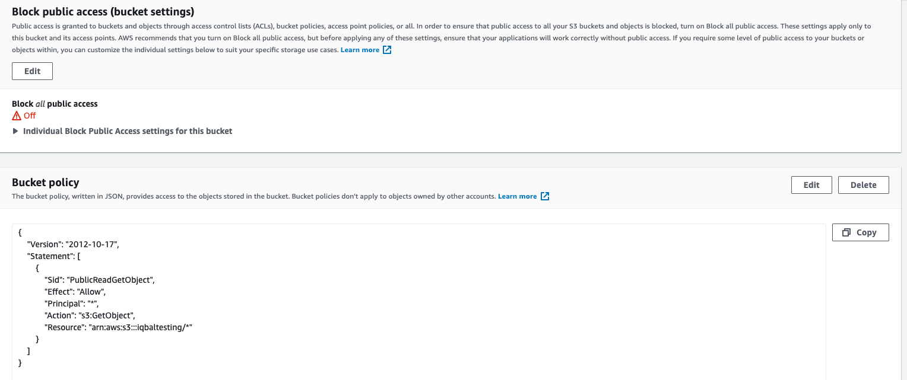

To conclude, here're the steps that we took:
- Create a bucket
- Enable public access by unchecking the box
- Upload index.html and error.html
- Enable static website hosting in Properties tab
- Add bucket policy
- Enjoy!

You can now visit the endpoint and see your page! S3 is highly available and reliable and is also scalable, meaning as traffic increases to your website, S3 will automatically!


## S3 Prefixes
You can use prefixes to organize the data that you store in Amazon S3 buckets. A prefix value is similar to a directory name that enables you to group similar objects together in a bucket. When you programmatically upload objects, you can use prefixes to organize your data.

The prefix limits the results to only those keys that begin with the specified prefix. The delimiter causes a list operation to roll up all the keys that share a common prefix into a single summary list result.

The purpose of the prefix and delimiter parameters is to help you organize and then browse your keys hierarchically. To do this, first pick a delimiter for your bucket, such as slash (/), that doesn't occur in any of your anticipated key names. Next, construct your key names by concatenating all containing levels of the hierarchy, separating each level with the delimiter.

For example, if you were storing information about cities, you might naturally organize them by continent, then by country, then by province or state. Because these names don't usually contain punctuation, you might use slash (/) as the delimiter. The following examples use a slash (/) delimiter.

```json
MyBucket1/France/Nouvelle-Aquitaine/Bordeaux

MyBucket2/Canada/Quebec/Montreal

MyBucket3/USA/Washington/Bellevue

MyBucket4/USA/Washington/Seattle
```

## S3 Performance

- You can get better performance by **spreading your reads across different prefixes**.
- For good upload performance, **use multi-part upload**:
  - Recommended for files > 100MB
  - Required for files > 5GB
  - Parallelized uploads improves efficiency
- **Byte range fetches**: 
  - Parallelize downloads by specifying byte ranges
  - Failures are isolated for each range
- Use Amazon S3 Transfer Acceleration to Minimize Latency Caused by Distance
  - Helps achieve fast, easy, and secure transfers of files over long geographic distances between the client and an S3 bucket. 
- Using Caching for Frequently Accessed Content
  - Many applications that store data in Amazon S3 serve a “working set” of data that is repeatedly requested by users. If a workload is sending repeated GET requests for a common set of objects, you can use a cache such as Amazon CloudFront, Amazon ElastiCache, or AWS Elemental MediaStore to optimize performance. Successful cache adoption can result in low latency and high data transfer rates. Applications that use caching also send fewer direct requests to Amazon S3, which can help reduce request costs.


## S3 Replication
Replication enables automatic, asynchronous copying of objects across Amazon S3 buckets. Buckets that are configured for object replication can be owned by the same AWS account or by different accounts. Objects may be replicated to a single destination bucket or multiple destination buckets. Destination buckets can be in different AWS Regions or within the same Region as the source bucket. By default, replication only supports copying new Amazon S3 objects after it is enabled.

To enable object replication, you add a replication configuration to your source bucket. The minimum configuration must provide the following:
  - The destination bucket or buckets where you want Amazon S3 to replicate objects.
  - An AWS Identity and Access Management (IAM) role that Amazon S3 can assume to replicate objects on your behalf
  
### When to use Cross-Region Replication
S3 Cross-Region Replication (CRR) is used to copy objects across Amazon S3 buckets in different AWS Regions. CRR can help you do the following:

- Meet compliance requirements — Although Amazon S3 stores your data across multiple geographically distant Availability Zones by default, compliance requirements might dictate that you store data at even greater distances. Cross-Region Replication allows you to replicate data between distant AWS Regions to satisfy these requirements.

- Minimize latency — If your customers are in two geographic locations, you can minimize latency in accessing objects by maintaining object copies in AWS Regions that are geographically closer to your users.

- Increase operational efficiency — If you have compute clusters in two different AWS Regions that analyze the same set of objects, you might choose to maintain object copies in those Regions.

### When to use Same-Region Replication
Same-Region Replication (SRR) is used to copy objects across Amazon S3 buckets in the same AWS Region. SRR can help you do the following:

- Aggregate logs into a single bucket — If you store logs in multiple buckets or across multiple accounts, you can easily replicate logs into a single, in-Region bucket. This allows for simpler processing of logs in a single location.

- Configure live replication between production and test accounts — If you or your customers have production and test accounts that use the same data, you can replicate objects between those multiple accounts, while maintaining object metadata.

- Abide by data sovereignty laws — You might be required to store multiple copies of your data in separate AWS accounts within a certain Region. Same-Region replication can help you automatically replicate critical data when compliance regulations don't allow the data to leave your country.

### Requirements for replication

**- Both source and destination buckets must have versioning enabled. For more information about versioning, see Using versioning in S3 buckets.**

- Existing objects won't be replicated if replication is turned on after the bucket has been created. 
  
- Delete markers are not turned on by default but can be turned on if needed.

- The source bucket owner must have the source and destination AWS Regions enabled for their account. The destination bucket owner must have the destination Region-enabled for their account.

- Amazon S3 must have permissions to replicate objects from the source bucket to the destination bucket or buckets on your behalf.

- If the owner of the source bucket doesn't own the object in the bucket, the object owner must grant the bucket owner READ and READ_ACP permissions with the object access control list (ACL). For more information, see Access control list (ACL) overview.

- If the source bucket has S3 Object Lock enabled, the destination buckets must also have S3 Object Lock enabled.

### Replication Walk through!

I created 2 buckets, one in the region us-east-1 (source) and the other in us-west-2 (destination). I deliberately left versioning off and uploaded a sample file to source bucket. Next, we're going to go to `Management` tab for the source bucket and create a replication rule:

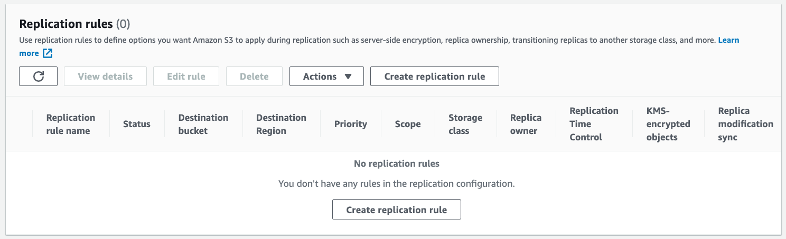

When you click on create replication rule, you'll see that S3 complains that versioning is not enabled:

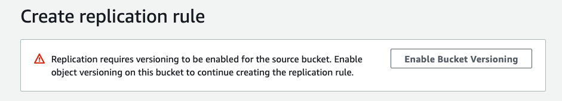

We'll go ahead and enable it. The next few options are quite self explanatory. Finally, you get to choose your destination bucket and since versioning was turned off on that as well, we see a warning:

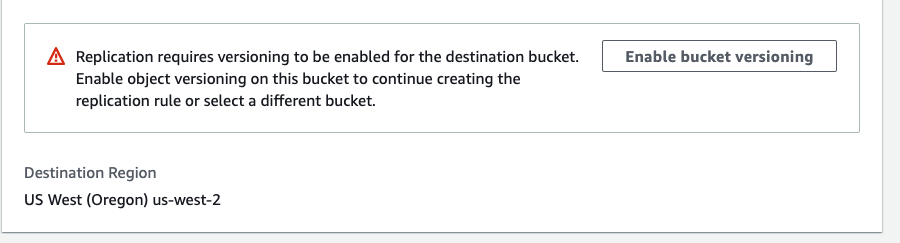

Next, there're quite a few options that can be chosen:

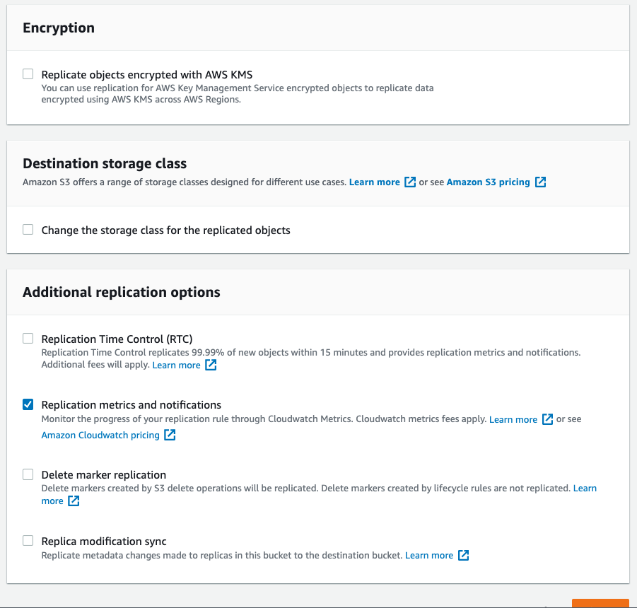

One main option that can't be left out is the IAM role:

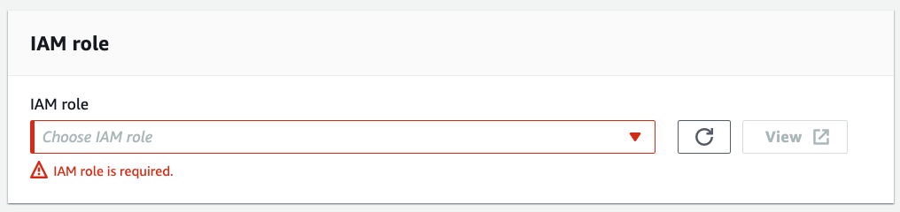

You can choose the Create Role option that'll create the replication role automatically for us. If you go to IAM, you'll see a role with name similar to:

```txt
s3crr_role_for_mysourcebucket
```
For that role, a trust relationship would be created for s3:

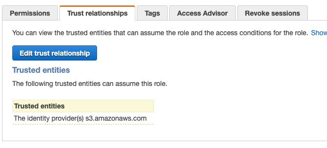 

Under permissions for the same role, you'll see a policy is also created and if you click on it, you'll be taken to the permissions that were attached to that policy:

```json
{
    "Version": "2012-10-17",
    "Statement": [
        {
            "Action": [
                "s3:ListBucket",
                "s3:GetReplicationConfiguration",
                "s3:GetObjectVersionForReplication",
                "s3:GetObjectVersionAcl",
                "s3:GetObjectVersionTagging",
                "s3:GetObjectRetention",
                "s3:GetObjectLegalHold"
            ],
            "Effect": "Allow",
            "Resource": [
                "arn:aws:s3:::mysourcebucket",
                "arn:aws:s3:::mysourcebucket/*",
                "arn:aws:s3:::mydestbucket",
                "arn:aws:s3:::mydestbucket/*"
            ]
        },
        {
            "Action": [
                "s3:ReplicateObject",
                "s3:ReplicateDelete",
                "s3:ReplicateTags",
                "s3:ObjectOwnerOverrideToBucketOwner"
            ],
            "Effect": "Allow",
            "Resource": [
                "arn:aws:s3:::mysourcebucket/*",
                "arn:aws:s3:::mydestbucket/*"
            ]
        }
    ]
}
```

Going back to S3, we've now got versioning enabeled for both buckets and have enabled CRR. However, the initial file that we uploaded to source WILL NOT be in destination. However, any new  files added to source will be. 
