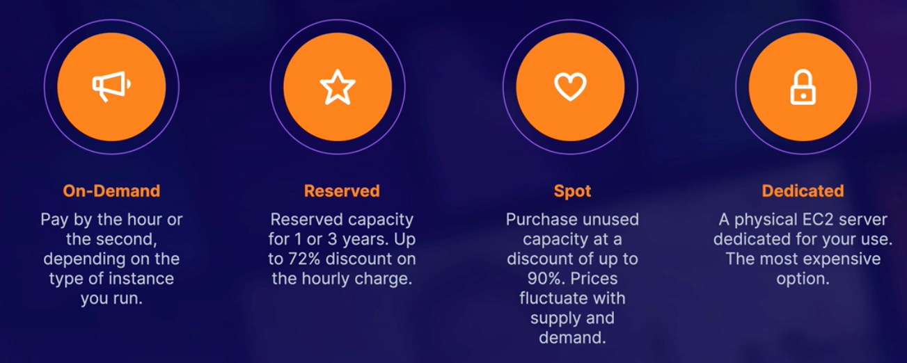
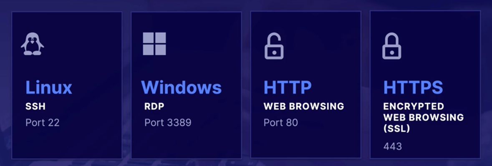
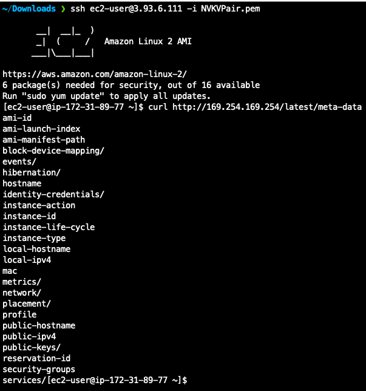
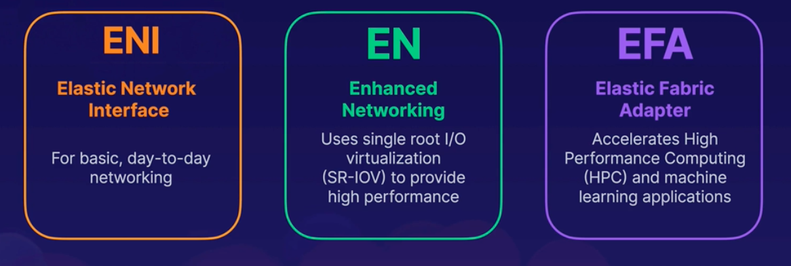
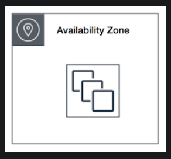
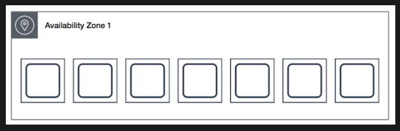
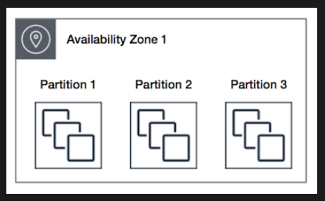
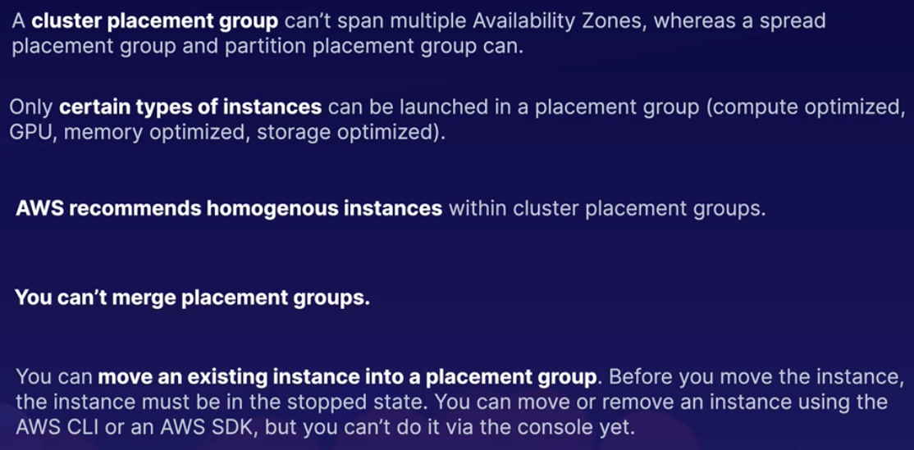

---
date: 2021-12-17
draft: false
thumbnail: /post-images/ec2.png
title: AWS - EC2
extract: Notes for EC2
categories:
    - AWS
tags:
    - blog
    - AWS
--- 


### Table of Contents

- [What is EC2?](#what-is-ec2)
- [Pricing options](#pricing-options)
  - [On-Demand Instances](#on-demand-instances)
  - [Reserved Instances](#reserved-instances)
  - [Spot instances](#spot-instances)
  - [Dedicated Hosts](#dedicated-hosts)
- [Launching an EC2 instance](#launching-an-ec2-instance)
- [AWS CLI](#aws-cli)
- [EC2 and Assuming Roles](#ec2-and-assuming-roles)
- [Security Groups](#security-groups)
- [Bootstrap scripts](#bootstrap-scripts)
- [EC2 Metadata and User data](#ec2-metadata-and-user-data)
- [Networking with EC2](#networking-with-ec2)
- [EC2 Placement Groups](#ec2-placement-groups)
- [Best Practices](#best-practices)


## What is [EC2](https://docs.aws.amazon.com/AWSEC2/latest/UserGuide/concepts.html)?
Amazon Elastic Compute Cloud (Amazon EC2) provides scalable computing capacity in AWS Cloud. Using EC2 eliminates your need to invest in hardware up front, so you can develop and deploy applications faster. You can use EC2 to launch as many or as few virtual servers as you need, configure security and networking, and manage storage. EC2 enables you to scale up or down to handle changes in requirements or spikes in popularity, reducing your need to forecast traffic.

EC2 is esentially a virtual machine that's hosted in AWS instead of your own data center. It gives you the capacity you want when you need it. You're in complete control of your instances. You pay only for what you use. You grow and shrink your infra as needed. Your instances are provisioned in minutes! Let's look at the pricing options for EC2:

## Pricing options

[Image Credit - Acloud guru](https://acloudguru.com/)

- **On demand**: as the name suggests, is priced by the hour or second and the type of instance you run
- **Reserved**: pricing comes into play when you sign up for a contract with AWS and you get discounted rates based off how much you pay up-front and length of the contract (pay more up-front and sign up for a longer contract). 
- **Spot**: where you purchase un-used servers for a discount of up to 90%. However spot prices fluctuate based off supply and demand principles. 
- **Dedicated**: most expensive option. This is where you have a physical EC2 server dedicated for your use. 
  
Let's look at the use-cases for each of these pricing models:

### On-Demand Instances

- Low cost and flexibility of EC2 without upfront payment or long-term commitment
- Use cases include: 
  - a new site from scratch. 
  - short-term applications, spiky unpredictable workloads
  - testing the water where you're developing on AWS for the first time

### Reserved Instances

- Opposite of on-demand, you'd use reserved instances when you know what type of workload you'd get. Steady state applications
- Applications that have specific requirements
- Scenario where you can pay up front
- Can be 72% cheaper than the on-demand price if you pay it all up front! 
- **Convertible reserved instances**: option to change to a different RI type of equal or greater value. Up to 54% cheaper than on-demand price.
- **Scheduled RIs**: Launch within the time window you define. Match your capacity reservation to a predictable recurring schedule that only requires a fraction of a day, week or month. Example could include users logging in at the start of the day.

### Spot instances
- Spot instances are provisioned when the price hits the mark that you chose. If the price goes higher than what you chose, the spot instance will be terminated.
- These are good for applications that have flexible start and end times. This can be for applications such as big data, CI/CD, high performance computing and other test and development workloads. 
- Can't be used for web servers since the instance gets terminated as price moves. 
- Good for apps that are feasible at very low compute prices. Such as in the middle of night on a Sunday morning!
- Use thse when you have an urgent need for large amounts of additional computing capacity
- Scenarios: image rendering, genomic sequencing, algo trading engines. 

To use spot instances, you must first decide on your max spot price. As long as the price < your max price, your instance will be in provisioned state. As soon as it crosses the max, you'll have 2 minutes to choose if you terminate or stop your instance. 

To terminate spot instances you first need to cancel your request (otherwise the spot requests will keep re-provisioning your instances as you terminate them!). Next, you'll go in and then terminate the instances. 

### Dedicated Hosts
- Good for compliance where there're requirements for NOT having multi-tenants on the same VMs. Your compliance needs would mean that your app needs to be the only app running on the machine
- Great for licensing that does not support multi-tenancy or cloud deployments
- Can be purchased on demand (expensive though!)
- Can be reserved

## Launching an EC2 instance

Let's see a short demo on how to launch an EC2 instance. 

- We'll use the cheapest AMI (Amazon Machine Image). This is the type of EC2 instance that we want. Which is Amazon Linux 2 AMI. 
- Next, we'll choose the instance type. t2 is used for general applications and t2 micro is the smallest of that family. We'll go ahead and choose that. 
- Instance details and storage types will be covered in a later section
- Security group configuration allows us to choose HOW our instance can be accessed. In the demo video below, we've chosen SSH, HTTP and HTTPS. You can also see the port range for each method and the CIDR block for IP addresses as well. 
- Next we download security key pair in the form of a `.pem` file. 
- Finally we use EC2 instance connect to log in to our EC2 instance.

<!-- copy and paste. Modify height and width if desired. -->
<iframe class="embeddedObject shadow resizable" name="embedded_content" scrolling="no" frameborder="0" type="text/html" 
        style="overflow:hidden;" src="https://www.screencast.com/users/IqbalKhan8502/folders/Capture/media/02f47bd8-6a15-4360-9290-a0bc95899d6a/embed" height="500" width="946" webkitallowfullscreen mozallowfullscreen allowfullscreen></iframe>


## AWS CLI
While we're on the topic if EC2, it's a good to time familiarize ourselves with AWS CLI. CLI allows us to log in to our EC2 instance. To do so, once you've launched your instance (with SSH, HTTP and HTTPS enabled), go ahead and copy your  public IPv4 address. Before we can log in, we also need to change permissions on the key value pair we downloaded. To do so run:

```bash
chmod 400 KVPair.pem
```

Next, we're ready to log in. We'll use this command to log into our EC2 instance:

```bash
ssh ec2-user@<IPV4address> -i KVPair.pem
```

Once inside your EC2 instance, you need to elevate your user:

```bash
sudo su
```
and now you can update your instance to install the latest software using `yum update -y`. 

We can now interact with S3 services. To do so, we need to follow this format:

```bash
aws <name_of_service> <commmand>
```

For example:

```bash
aws s3 ls
```

If you do so, you'll get an error saying:

```text
Unable to locate credentials. You can configure credentials by running "aws configure".
```

As the error says, you need to run `aws configure`. When you do so, you'll see this:

```bash
[root@ip-172-31-83-150 ec2-user]# aws configure
AWS Access Key ID [None]:
```

We don't have our access key Id. To get one, we need to go back to AWS console. Thinking back to the lessons we learned in IAM, what should we do to create a user that's able to access S3? Should we create an admin user directly who has access to everything? Should this new user be in a group or not? The answer is to create a group that'll hold our S3 admins and apply a policy to this group that grants group members S3 admin privileges. Next, we can then add a user to this group. Here's the AWS managed policy called `AmazonS3FullAccess` that I attached to the group called `S3_Admins`:

```json
{
    "Version": "2012-10-17",
    "Statement": [
        {
            "Effect": "Allow",
            "Action": [
                "s3:*",
                "s3-object-lambda:*"
            ],
            "Resource": "*"
        }
    ]
}
```

Small video showing how I added a user. Notice how we use programmatic access to generate access key ID and secret access key:

<!-- copy and paste. Modify height and width if desired. -->
<iframe class="embeddedObject shadow resizable" name="embedded_content" scrolling="no" frameborder="0" type="text/html" 
        style="overflow:hidden;" src="https://www.screencast.com/users/IqbalKhan8502/folders/Capture/media/815645d5-b730-4131-878c-1207f739a939/embed" height="500" width="950" webkitallowfullscreen mozallowfullscreen allowfullscreen></iframe>

From the above, after we hit create user, we'll get our Access Key ID and Secret Access key. We'll use that in the command line to authenticate our user. Once completed, we can now re-run:

```bash
aws s3 ls
```

and get back the buckets we have. We can also create a bucket from the command line like so:

```bash
[root@ip-172-31-83-150 ec2-user]# clear
[root@ip-172-31-83-150 ec2-user]# aws s3 mb s3://letsmakethisbucketforourtestingshallwe
make_bucket: letsmakethisbucketforourtestingshallwe
```

That's it for CLI! 

## EC2 and Assuming Roles
Let's do something with what we've learned so far. Our requirements are:
- Create an IAM role called `S3AccessRole` that has S3 access
- Create an EC2 instance and attach `S3AccessRole` to it
- Create S3 bucket called `s3accessrolefromec2testingbucket1234` using the CLI
- Access S3 bucket from our EC2 instance

<!-- copy and paste. Modify height and width if desired. -->
<iframe class="embeddedObject shadow resizable" name="embedded_content" scrolling="no" frameborder="0" type="text/html" 
        style="overflow:hidden;" src="https://www.screencast.com/users/IqbalKhan8502/folders/Capture/media/73923868-4af1-4f3c-a347-c35bead34513/embed" height="722" width="1438" webkitallowfullscreen mozallowfullscreen allowfullscreen></iframe>


## Security Groups
Before we dive in to how security groups work, let's understand a few concpets: There're a few different methods to communicate with a server. You can SSH into it, or you can use HTTP, or HTTPS etc. Depending on the type of server, our communication method changes. Below are the types of instances and the methods we use to communicate with each:

- Linux: SSH over port 22
- Windows: RDP port 3389
- HTTP: Web browsing over port 80
- HTTPS: Encrypted web browsing (SSL) over port 443


[Image Credit - Acloud guru](https://acloudguru.com/)

Security groups are virtual firewalls for your EC2 instance. By default, everything is blocked. So when a new EC2 instance is created and if no security groups are attached, you won't be able to SSH into it. To let everything in:

```json
0.0.0.0/0
```

In order to be able to communicate to your EC2 instances via SSH, RDP, HTTP and HTTPS, you'll need to open up the correct ports. In a production environment, you'd open up `0.0.0.0/0` to only HTTP and HTTPS methods (ie port 80 and port 443).

A few points to remember:
- Changes to security groups take effect immediately
- All inbound traffic into the instance is blocked by default
- All outbound traffix out the instance is allowed by default

## Bootstrap scripts
Bootstrap scripts are scripts that run at root level when the instance first launches. An example bootstrap script could be:

```bash
#below is a path to our interpreter
#!/bin/bash
#updates yum
yum update -y
#installs apache
yum install httpd -y
#starting apache
systemctl start httpd
#set apache to run when the system boots
systemctl enable httpd
#go to dir shown
cd /var/www/html
#create an index.html file there
echo "<html><body><h1>Hello my friends! Gurus</h1></body></html>" > index.html
```

Using the bootstrap script helps you to setup your instance without having to log in to the instance! You can then open up port 80 (enable HTTP) on your instance that'll then allow you to view the `index.html` file using HTTP. All you need to do is visit the public IPv4 address of your instance via HTTP. To add your bootstrap script, simply paste it in the `User Data` section as you configure your EC2 instance:


## EC2 Metadata and User data

EC2 metadata is data about your EC2 instance. This can be things such as public/private IP addresses, hostnames, security groups etc. To get your metadata, all you need to do is run this command from your EC2 command line (after you've logged into your EC2 instance:

```bash
curl http://169.254.169.254/latest/meta-data
```
Here're the complete commands that I ran:



Another option is to actually use the User data section and add the same command to your bootstrap script. Here's what you'd then add to your user data section as you configure your EC2 instance:

```bash
curl http://169.254.169.254/latest/meta-data > myIP.txt
```

## Networking with EC2
You can attach 3 different types of virtual networking cards to your EC2 instances: ENI, EN and EFA.

[Image Credit: Acloudguru](https://acloudguru.com/)

- **ENI**
Elastic network interface or network interface is for basic day-to-day networking. Common use cases include:
- Create a management network
- Use network and security applicances in your VPCs
- Create a low budget high availability solution

- **EN**
Enhanced networking is to provide high performance.

- **EFA**
Accelerates high performance computing and ML applications. It can use OS-Bypass which makes it a lot faster with much lower latency.

## EC2 Placement Groups
When you launch a new EC2 instance, the EC2 service attempts to place the instance in such a way that all of your instances are spread out across underlying hardware to minimize correlated failures. You can use placement groups to influence the placement of a group of interdependent instances to meet the needs of your workload. Depending on the type of workload, you can create a placement group using one of the following placement strategies:

- **Cluster**


[Image Credit: AWS Docs](https://docs.aws.amazon.com/AWSEC2/latest/UserGuide/placement-groups.html)

**For low latency high network throughput use cases**
  
This placement group packs instances close together inside an Availability Zone. This strategy enables workloads to achieve the low-latency network performance necessary for tightly-coupled node-to-node communication that is typical of HPC applications.

Cluster placement groups are recommended for applications that benefit from low network latency, high network throughput, or both. They are also recommended when the majority of the network traffic is between the instances in the group. To provide the lowest latency and the highest packet-per-second network performance for your placement group, choose an instance type that supports enhanced networking.


- **Spread** 

[Image Credit: AWS Docs](https://docs.aws.amazon.com/AWSEC2/latest/UserGuide/placement-groups.html)

**For use cases with need for individual critical EC2 instances**

This placement gorup strictly places a small group of instances across distinct underlying hardware to reduce correlated failures. Groups of instances are each placed on distinct racks, with each rack having its own network and power source.

Spread placement groups are recommended for applications that have a small number of critical instances that should be kept separate from each other. Launching instances in a spread placement group reduces the risk of simultaneous failures that might occur when instances share the same racks. Spread placement groups provide access to distinct racks, and are therefore suitable for mixing instance types or launching instances over time.

A spread placement group can span multiple Availability Zones in the same Region.

- **Partition**

[Image Credit: AWS Docs](https://docs.aws.amazon.com/AWSEC2/latest/UserGuide/placement-groups.html)


This placement group spreads your instances across logical partitions such that groups of instances in one partition do not share the underlying hardware with groups of instances in different partitions. This strategy is typically used by large distributed and replicated workloads, such as Hadoop, Cassandra, and Kafka.

Partition placement groups help reduce the likelihood of correlated hardware failures for your application. Amazon EC2 ensures that each partition within a placement group has its own set of racks. Each rack has its own network and power source. No two partitions within a placement group share the same racks, allowing you to isolate the impact of hardware failure within your application.

[Image-Credit: Acloudguru](https://acloudguru.com/)


## Best Practices
Check [here](https://docs.aws.amazon.com/AWSEC2/latest/UserGuide/ec2-best-practices.html) for best practices. 

