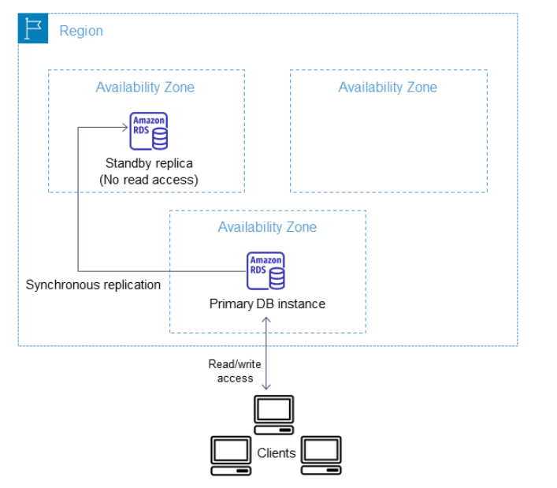
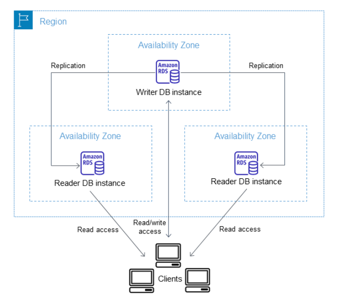
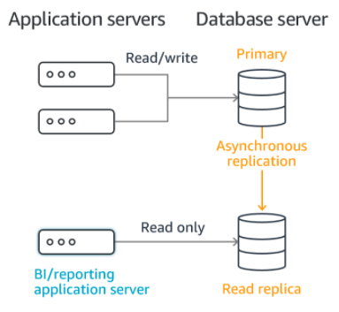
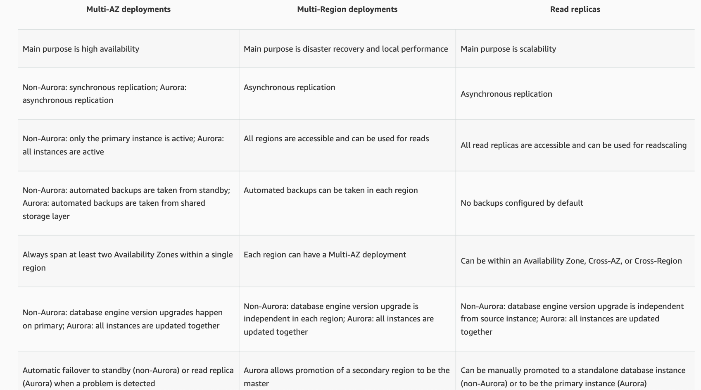

---
date: 2021-12-24
draft: false
thumbnail: /post-images/aws-rds.png
title: AWS - RDS
extract: Notes for RDS
categories:
    - AWS
tags:
    - blog
    - AWS
--- 

### Table of Contents

- [What is RDS?](#what-is-rds)
- [What is relational DB?](#what-is-relational-db)
- [DB Instances](#db-instances)
- [DB Instance Classes](#db-instance-classes)
  - [Standard Instance Class](#standard-instance-class)
  - [Memory Optimized Instance Classes](#memory-optimized-instance-classes)
  - [Burstable Performance](#burstable-performance)
- [Regions, AZs and Local Zones](#regions-azs-and-local-zones)
- [Multi-AZ Deployments for High Availability](#multi-az-deployments-for-high-availability)
  - [Multi-AZ DB instance deployments](#multi-az-db-instance-deployments)
  - [Multi-AZ DB cluster deployments](#multi-az-db-cluster-deployments)
  - [Read Replicas](#read-replicas)
  - [Read replicas, Multi-AZ deployments, and multi-region deployments](#read-replicas-multi-az-deployments-and-multi-region-deployments)
- [What is Amazon Aurora?](#what-is-amazon-aurora)
  - [Aurora Serverless](#aurora-serverless)

## What is [RDS](https://docs.aws.amazon.com/AmazonRDS/latest/UserGuide/CHAP_GettingStarted.html)?

Amazon Relational Database Service (Amazon RDS) is a web service that makes it easier to set up, operate, and scale a relational database in the AWS Cloud. Amazon RDS is a managed database service. It's responsible for most management tasks. By eliminating tedious manual tasks, Amazon RDS frees you to focus on your application and your users. It is recommend to use Amazon RDS over Amazon EC2 as your default choice for most database deployments.

Amazon RDS provides the following specific advantages over database deployments that aren't fully managed:

- You can use the database products you are already familiar with: MySQL, MariaDB, PostgreSQL, Oracle, Microsoft SQL Server.

- Amazon RDS manages backups, software patching, automatic failure detection, and recovery.

- You can turn on automated backups, or manually create your own backup snapshots. You can use these backups to restore a database. The Amazon RDS restore process works reliably and efficiently.

- You can get high availability with a primary instance and a synchronous secondary instance that you can fail over to when problems occur. You can also use read replicas to increase read scaling.

- In addition to the security in your database package, you can help control who can access your RDS databases by using AWS Identity and Access Management (IAM) to define users and permissions. You can also help protect your databases by putting them in a virtual private cloud (VPC).

## What is relational DB?

Relational DBs are DBs that organize data into tables. A table would include rows and columns. Examples of these types of DBs are MySQL, PostgreSQL, MariaDB, Amazon Aurora, Oracle and SQL Server. 

## DB Instances

A DB instance is an isolated database environment running in the cloud. It is the basic building block of Amazon RDS. A DB instance can contain multiple user-created databases, and can be accessed using the same client tools and applications you might use to access a standalone database instance.

Each DB instance has a DB instance identifier. This customer-supplied name uniquely identifies the DB instance when interacting with the Amazon RDS API and AWS CLI commands. The DB instance identifier must be unique for that customer in an AWS Region.

The identifier is used as part of the DNS hostname allocated to your instance by RDS. For example, if you specify db1 as the DB instance identifier, then RDS will automatically allocate a DNS endpoint for your instance, such as `db1.123456789012.us-east-1.rds.amazonaws.com`, where `123456789012` is the fixed identifier for a specific region for your account. Each DB instance supports a database engine. Amazon RDS currently supports MySQL, MariaDB, PostgreSQL, Oracle, Microsoft SQL Server, and Amazon Aurora database engines. 

## DB Instance Classes

The DB instance class determines the computation and memory capacity of an Amazon RDS DB instance. The DB instance class you need depends on your processing power and memory requirements. Amazon RDS supports three types of instance classes: standard, memory optimized, and burstable performance.

RDS is generally used for online transaction processing (OLTP) workloads. These are workloads that process data from transactions in real time (customer orders, banking, booking systems etc). Unlike OLTP, online analytics processing (OLAP) is when we analyze large amounts of data as well as complex queries. OLAP is handled by Amazon Redshift.

### Standard Instance Class

Standard DB instance classes are general-purpose instance classes powered by AWS Graviton2 processors. These deliver balanced compute, memory, and networking for a broad range a general purpose workloads.

### Memory Optimized Instance Classes

Memory optimized DB instance classes are optimized for memory-intensive applications and powered by AWS Graviton2 processors. These offer low cost per GiB of memory.

### Burstable Performance 

Burstable performance DB instance classes are next generation instance classes that provide a baseline performance level, with the ability to burst to full CPU usage.

## Regions, AZs and Local Zones

Amazon cloud computing resources are hosted in multiple locations world-wide. These locations are composed of AWS Regions, Availability Zones, and Local Zones. Each AWS Region is a separate geographic area. Each AWS Region has multiple, isolated locations known as Availability Zones.

By using Local Zones, you can place resources, such as compute and storage, in multiple locations closer to your users. Amazon RDS enables you to place resources, such as DB instances, and data in multiple locations. Resources aren't replicated across AWS Regions unless you do so specifically.

Amazon operates state-of-the-art, highly-available data centers. Although rare, failures can occur that affect the availability of DB instances that are in the same location. If you host all your DB instances in a single location that is affected by such a failure, none of your DB instances will be available.

A Local Zone is an extension of an AWS Region that is geographically close to your users. When you create a DB instance, you can choose a subnet in a Local Zone. Local Zones have their own connections to the internet and support AWS Direct Connect. Thus, resources created in a Local Zone can serve local users with very low-latency communications.

## Multi-AZ Deployments for High Availability

Multi-AZ deployments can have one standby or two standby DB instances. When the deployment has one standby DB instance, it's called a Multi-AZ DB instance deployment. A Multi-AZ DB instance deployment has one standby DB instance that provides failover support, but doesn't serve read traffic. When the deployment has two standby DB instances, it's called a Multi-AZ DB cluster deployment. A Multi-AZ DB cluster deployment has standby DB instances that provide failover support and can also serve read traffic.

### Multi-AZ DB instance deployments

In a Multi-AZ DB instance deployment, Amazon RDS automatically provisions and maintains a synchronous standby replica in a different Availability Zone. The primary DB instance is synchronously replicated across Availability Zones to a standby replica to provide data redundancy and minimize latency spikes during system backups. Running a DB instance with high availability can enhance availability during planned system maintenance. It can also help protect your databases against DB instance failure and Availability Zone disruption. The high availability option isn't a scaling solution for read-only scenarios. You can't use a standby replica to serve read traffic. To serve read-only traffic, use a Multi-AZ DB cluster or a read replica instead.

[Image Credit: AWS-Docs](https://docs.aws.amazon.com/AmazonRDS/latest/UserGuide/Concepts.MultiAZSingleStandby.html)

DB instances using Multi-AZ DB instance deployments can have increased write and commit latency compared to a Single-AZ deployment. This can happen because of the synchronous data replication that occurs. You might have a change in latency if your deployment fails over to the standby replica, although AWS is engineered with low-latency network connectivity between Availability Zones. For production workloads, we recommend that you use Provisioned IOPS (input/output operations per second) for fast, consistent performance. 

If a planned or unplanned outage of your DB instance results from an infrastructure defect, Amazon RDS automatically switches to a standby replica in another Availability Zone if you have turned on Multi-AZ. The time that it takes for the failover to complete depends on the database activity and other conditions at the time the primary DB instance became unavailable. Failover times are typically 60–120 seconds. However, large transactions or a lengthy recovery process can increase failover time. When the failover is complete, it can take additional time for the RDS console to reflect the new Availability Zone.

Multi-AZ DB instance deployment is for disaster recovery ONLY and NOT for improving performance. That's because you cannot connect to the standby instance while the primary is operational. Standby becomes primary in case of a failover. 

### Multi-AZ DB cluster deployments

A Multi-AZ DB cluster deployment is a high availability deployment mode of Amazon RDS with two readable standby DB instances. A Multi-AZ DB cluster has a writer DB instance and two reader DB instances in three separate Availability Zones in the same AWS Region. Multi-AZ DB clusters provide high availability, increased capacity for read workloads, and lower write latency when compared to Multi-AZ DB instance deployments.

With a Multi-AZ DB cluster, Amazon RDS replicates data from the writer DB instance to both of the reader DB instances using the DB engine's native replication capabilities. When a change is made on the writer DB instance, it's sent to each reader DB instance. Acknowledgment from at least one reader DB instance is required for a change to be committed and applied. Reader DB instances act as automatic failover targets and also serve read traffic to increase application read throughput.

The following diagram shows a Multi-AZ DB cluster.

[Image Credit: AWS-Docs](https://docs.aws.amazon.com/AmazonRDS/latest/UserGuide/Concepts.MultiAZSingleStandby.html)

If a planned or unplanned outage of your writer DB instance in a Multi-AZ DB cluster results from an infrastructure defect, Amazon RDS automatically switches to a reader DB instance in another Availability Zone. The time it takes for the failover to complete depends on the database activity and other conditions when the writer DB instance became unavailable. Failover times are typically 20–40 seconds. Failover completes when both reader DB instances have applied outstanding transactions from the failed writer. When the failover is complete, it can take additional time for the RDS console to reflect the new Availability Zone.

### Read Replicas

Amazon RDS Read Replicas provide enhanced performance and durability for RDS database (DB) instances. They make it easy to elastically scale out beyond the capacity constraints of a single DB instance for read-heavy database workloads. You can create one or more replicas of a given source DB Instance and serve high-volume application read traffic from multiple copies of your data, thereby increasing aggregate read throughput. Read replicas can also be promoted when needed to become standalone DB instances. 

Read replicas can be cross AZ as well as cross region. Each replica will have its own DNS endpoint that can then be used to cater read requests. Replicas can also be promoted to independent database. This will however break the replication. You can also have multi-az deployment enabled for your read replicas. To enable read replica, **automatic backups must be enabled**.

For the MySQL, MariaDB, PostgreSQL, Oracle, and SQL Server database engines, Amazon RDS creates a second DB instance using a snapshot of the source DB instance. It then uses the engines' native asynchronous replication to update the read replica whenever there is a change to the source DB instance. The read replica operates as a DB instance that allows only read-only connections; applications can connect to a read replica just as they would to any DB instance. Amazon RDS replicates all databases in the source DB instance.

[Image Credit: AWS-Docs](https://aws.amazon.com/rds/features/read-replicas/)

### Read replicas, Multi-AZ deployments, and multi-region deployments

Amazon RDS read replicas complement Multi-AZ deployments. While both features maintain a second copy of your data, there are differences between the two:

[Image Credit: AWS-Docs](https://aws.amazon.com/rds/features/read-replicas/)

Let's look at a demo where we do the following:
- Create a primary RDS instance
- Create a read replica in the same region BUT a different AZ
- Next we'll promote the read replica to a primary database

<!-- copy and paste. Modify height and width if desired. -->
<iframe class="embeddedObject shadow resizable" name="embedded_content" scrolling="no" frameborder="0" type="text/html" 
        style="overflow:hidden;" src="https://www.screencast.com/users/IqbalKhan8502/folders/Capture/media/e6858f4e-3edc-4575-9fb9-9bd874258e90/embed" height="908" width="1580" webkitallowfullscreen mozallowfullscreen allowfullscreen></iframe>

## What is [Amazon Aurora](https://docs.aws.amazon.com/AmazonRDS/latest/AuroraUserGuide/CHAP_AuroraOverview.html)?

Amazon Aurora (Aurora) is a fully managed relational database engine that's compatible with MySQL and PostgreSQL. Aurora includes a high-performance storage subsystem. Its MySQL- and PostgreSQL-compatible database engines are customized to take advantage of that fast distributed storage. Aurora is part of the managed database service Amazon Relational Database Service (Amazon RDS). 

Some Aurora features:

- Starts with 10GB of storage and scales in 10 GB increments to 128 TB 
- Compute resources scale up as well
- 2 copies of your data are contained in each AZ with a minimum of 3 AZs. ie 6 copies of your data!
- Storage is self-healing: Data blocks and disks are scanned for errors and repaired automatically
- Automated backups are always enabled
- Snapshots can be taken as well that are sharable
  
### Aurora Serverless

Aurora serverless is an on-demand, auto-scaling configuration for the MySQL compatible and PostgreSQL compatible editions of Aurora. It is an Aurora serverless DB cluster that automatically starts up, shuts down and scales based on your application's needs. Use cases include infrequent, intermittent or unpredictable workloads.