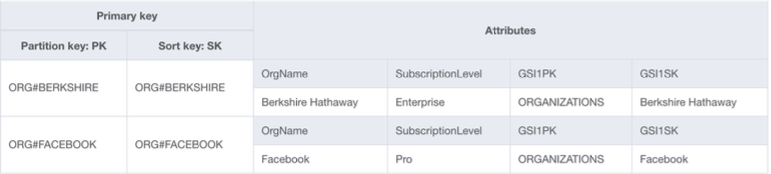
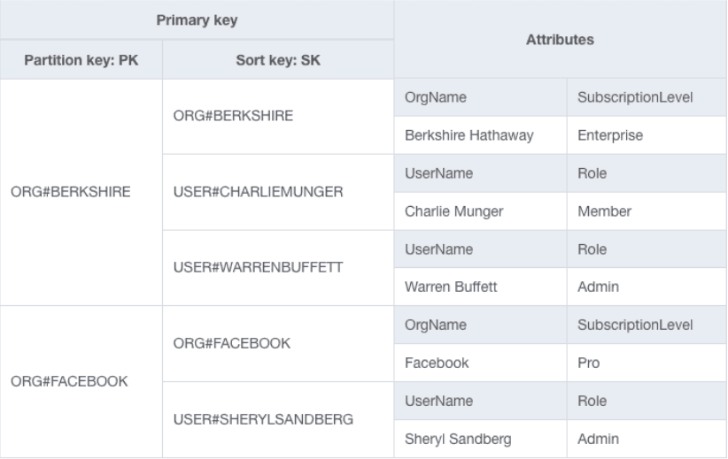
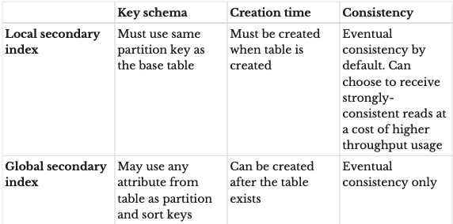

### Table of Contents

- [What is DynamoDB?](#what-is-dynamodb)
- [Features](#features)
- [Basic Vocab](#basic-vocab)
  - [Table](#table)
  - [Item](#item)
  - [Primary Key](#primary-key)
  - [Secondary Indexes](#secondary-indexes)
- [Primary Keys](#primary-keys)
- [Secondary Indexes](#secondary-indexes-1)
  - [Local Secondary Index](#local-secondary-index)
  - [Global Secondary Index](#global-secondary-index)
- [DynamoDB Streams](#dynamodb-streams)
- [TTLs](#ttls)
- [DynamoDB Transactions](#dynamodb-transactions)
- [API Action Types](#api-action-types)
  - [Item Based Actions](#item-based-actions)
- [Read/Write Capacity Mode](#readwrite-capacity-mode)
- [On-Demand Mode](#on-demand-mode)
  - [Read Request Units and Write Request Units](#read-request-units-and-write-request-units)
- [Provisioned Mode](#provisioned-mode)
  - [Read Capacity Units and Write Capacity Units](#read-capacity-units-and-write-capacity-units)
- [Read Consistency](#read-consistency)
  - [Eventually Consistent Reads](#eventually-consistent-reads)
  - [Strongly Consistent Reads](#strongly-consistent-reads)
- [DynamoDB On-Demand Backup and Restore](#dynamodb-on-demand-backup-and-restore)
- [Point in time recovery](#point-in-time-recovery)
- [DynamoDB Global Tables](#dynamodb-global-tables)

## What is [DynamoDB](https://docs.aws.amazon.com/amazondynamodb/latest/developerguide/Introduction.html)?

Amazon DynamoDB is a fully managed NoSQL database service that provides fast and predictable performance with seamless scalability. DynamoDB lets you offload the administrative burdens of operating and scaling a distributed database so that you don't have to worry about hardware provisioning, setup and configuration, replication, software patching, or cluster scaling. DynamoDB also offers encryption at rest, which eliminates the operational burden and complexity involved in protecting sensitive data.

DynamoDB automatically spreads the data and traffic for your tables over a sufficient number of servers to handle your throughput and storage requirements, while maintaining consistent and fast performance. All of your data is stored on solid-state disks (SSDs) and is automatically replicated across multiple Availability Zones in an AWS Region, providing built-in high availability and data durability. You can use global tables to keep DynamoDB tables in sync across AWS Regions.

## Features

DynamoDB is:

- Stored on SSD storage
- Spread across 3 geographically distinct data centers
- Eventually consistent reads by default but can be changed to strongly consistent reads (more on this later)
- Comes with a fully managed caching service called DynamoDB Accelerator or DAX. Usually, when applications have a caching layer, caches are queried first to check if data resides in cache. If so, the result is returned, otherwise, the DB is queried. In the case of DAX, DAX sits between DB and application and updates itself based off a cache hit or miss.
- Uses encryption at rest using KMS
- Can connect using Direct Connect (DX)

## Basic Vocab

There are five basic concepts in DynamoDB—tables, items, attributes, primary keys, and secondary indexes. Let’s review each

### Table

The first basic concept in DynamoDB is a table. A DynamoDB table is similar in some ways to a table in a relational database or a collection in MongoDB. It is a grouping of records that conceptually belong together. DynamoDB is schemaless, meaning the table itself won’t ensure your records conform to a given schema. The fact that DynamoDB (and other NoSQL databases) are schemaless does not mean that your data should not have a schema. It means that your record schema is enforced elsewhere: in your application code rather than in your database.

### Item

A DynamoDB item is made up of attributes, which are typed data values holding information about the element. For example, if you had an item representing a User, you might have an attribute named "Username" with a value of "myuser".

When you write an item to DynamoDB, each attribute is given a specific type. There are ten different data types in DynamoDB. It’s helpful to split them into three categories:

- Scalars: string, number, binary, boolean, and null.
- Complex: the most flexible kind of attribute, they represent groupings with arbitrary nested attributes. There are two complex types: lists and maps
- Sets: Sets are a powerful compound type that represents multiple, unique values.

### Primary Key

When creating a DynamoDB table, you must declare a primary key for your table. The primary key can be simple, consisting of a single value, or composite, consisting of two values. Each item in your table must include the primary key. If you attempt to write an item without the primary key, it will be rejected. Primary key selection and design is the most important part of data modeling with DynamoDB. Almost all of your data access will be driven off primary keys, so you need to choose them wisely.

### Secondary Indexes

Primary keys drive your key access patterns in DynamoDB, but sometimes you need additional flexibility. The way you configure your primary keys may allow for one read or write access pattern but may prevent you from handling a second access pattern.
To help with this problem, DynamoDB has the concept of secondary indexes. Secondary indexes allow you to reshape your data into another format for querying, so you can add additional access patterns to your data.

When you create a secondary index on your table, you specify the primary keys for your secondary index, just like when you’re creating a table. AWS will copy all items from your main table into the secondary index in the reshaped form. You can then make queries against the secondary index.

## Primary Keys

In DynamoDB, there are two kinds of primary keys:

• Simple primary keys, which consist of a single element called a partition key. A simple primary key allows you to fetch only a single item at a time. It works well for one-to-one operations where you are only operating on individual items.

• Composite primary keys, which consist of two elements, called a partition key and a sort key. Composite primary keys enable a "fetch many" access pattern. With a composite primary key, you can use the Query API to grab all items with the same partition key. You can even specify conditions on the sort key to narrow down your query space. Composite primary keys are great for handling relations between items in your data and for retrieving multiple items at once.

Let's have a look at an example. Imagine you had a SaaS application. Organizations signed up for your application, and each Organization had multiple Users that belonged to the Organization. Let’s start with a table that just has our Organization items in it:

[Image Credit: DynamoDB Book](https://www.dynamodbbook.com/)

In the image above, we have two Organization items—one for Berkshire Hathaway and one for Facebook. There are two things worth noting here.

First, notice how generic the names of the partition key and sort key are. Rather than having the partition key named `OrgName`, the partition key is titled `PK`, and the sort key is `SK`. That’s because we will also be putting User items into this table, and Users don’t have an OrgName. They have a UserName.

Second, notice that the `PK` and `SK` values have prefixes. The pattern for both is `ORG#<OrgName>`. We do this for a few reasons. First, it helps to identify the type of item that we’re looking at. Second, it helps avoid overlap between different item types in a table. Remember that a primary key must be unique across all items in a table. If we didn’t have this prefix, we could run into accidental overwrites. Imagine if the real estate company Keller Williams signed up for our application, and the musician Keller Williams was a user of our application. The two could overwrite each other!

Let’s edit our table to add Users now. A table with both Organization and User entities might look as follows:

[Image Credit: DynamoDB Book](https://www.dynamodbbook.com/)

Here we’ve added three Users to our existing Organization items. Our User items use a PK value of ORG#<OrgName> and an SK value of USER#<UserName>.

This concept of using generic names for your primary keys and using different values depending on the type of item is known as overloading your keys. You will do this with both your primary keys and your secondary indexes to enable the access patterns you need.

## Secondary Indexes

When creating a secondary index, you will need to specify the key schema of your index. The key schema is similar to the primary key of your table—you will state the partition and sort key (if desired) for your secondary index that will drive your access patterns.

There are two kinds of secondary indexes in DynamoDB: Local and global secondary indexes

### Local Secondary Index

A local secondary index uses the same partition key as your table’s primary key but a different sort key. This can be a nice fit when you are often filtering your data by the same top-level property but have access patterns to filter your dataset further. The partition key can act as the top-level property, and the different sort key arrangements will act as your more granular filters.

### Global Secondary Index

With a global secondary index, you can choose any attributes you want for your partition key and your sort key. Global secondary indexes are used much more frequently with DynamoDB due to their flexibility.

In general, people usually opt for global secondary indexes. They’re more flexible, you don’t need to add them at table-creation time, and you can delete them if you need to.

[Image Credit: DynamoDB Book](https://www.dynamodbbook.com/)

## DynamoDB Streams

DDB streams are time-ordered sequence of item-level changes in a table. These changes could be create, update or delete operations on the table. Data in the stream is stored for 24 hours. These streams can be combined with lambda functions for functionality like stored procedures. To use TTL, you specify an attribute on your DynamoDB table that will serve as the marker for item deletion. For each item that you want to expire, you should store a Unix timestamp as a number in your specified attribute. This timestamp should state the time after which the item should be deleted. DynamoDB will periodically review your table and delete items that have your TTL attribute set to a time before the current time.

Items are generally deleted in a timely manner, but AWS only states that items will usually be deleted within 48 hours after the time indicated by the attribute. This delay could be unacceptable for the access patterns in your application. Rather than relying on the TTL for data accuracy in your application, you should confirm an item is not expired when you retrieve it from DynamoDB.

## TTLs

Announced in 2017, TTLs allow you to have DynamoDB automatically delete items on a per-item basis. This is a great option for storing short-term data in DynamoDB as you can use TTL to clean up your database rather than handling it manually via a scheduled job.

## DynamoDB Transactions

DynamoDB transactions provide us with atomicity, consistency, isolation and durability (ACID) across 1 or more tables within a single AWS account and region. You can use transactions when building applications that require coordinated CRUD operations as part of a single business oepration. Examples include bank transactions, ticketing systems etc.

## API Action Types

API actions can be broken into three categories:

1. Item-based actions
2. Queries
3. Scans

The API actions are divided based on what you’re operating on.

- Operating on specific items? Use the item-based actions.

- Operating on an item collection? Use a Query.
- Operating on the whole table? Use a Scan.

### Item Based Actions

Item-based actions are used whenever you are operating on a specific item in your DynamoDB table. There are four core API actions for item-based actions:

1. GetItem--used for reading a single item from a table.
2. PutItem--used for writing an item to a table. This can completely
   overwrite an existing item with the same key, if any.
3. UpdateItem--used for updating an item in a table. This can create a new item if it doesn’t previously exist, or it can add, remove, or alter properties on an existing item.
4. DeleteItem--used for deleting an item from a table.

There are three rules around item-based actions. First, the full primary key must be specified in your request. Second all actions to alter data—writes, updates, or deletes—must use an item-based action. Finally, all item-based actions must be performed on your main table, not a secondary index.

✋✋ 🚧Sections below are a WIP!🚧 ✋✋

## Read/Write Capacity Mode

Amazon DynamoDB has two read/write capacity modes for processing reads and writes on your tables: on-demand and provisioned (default, free-tier eligible)

The read/write capacity mode controls how you are charged for read and write throughput and how you manage capacity. You can set the read/write capacity mode when creating a table or you can change it later. Secondary indexes inherit the read/write capacity mode from the base table.

## On-Demand Mode

When you choose on-demand mode, DynamoDB instantly accommodates your workloads as they ramp up or down to any previously reached traffic level. If a workload’s traffic level hits a new peak, DynamoDB adapts rapidly to accommodate the workload. Tables that use on-demand mode deliver the same single-digit millisecond latency, service-level agreement (SLA) commitment, and security that DynamoDB already offers. You can choose on-demand for both new and existing tables and you can continue using the existing DynamoDB APIs without changing code.

On-demand mode is a good option if any of the following are true:

- You create new tables with unknown workloads.

- You have unpredictable application traffic.

- You prefer the ease of paying for only what you use.

### Read Request Units and Write Request Units

For on-demand mode tables, you don't need to specify how much read and write throughput you expect your application to perform. DynamoDB charges you for the reads and writes that your application performs on your tables in terms of read request units and write request units.

**One read request unit represents:**

- One strongly consistent read request, or two eventually consistent read requests for an item up to 4 KB in size.
- Two read request units represent one transactional read for items up to 4 KB.
- You'd need additional read request units for items > 4 KB. Here, the total number of read request units required depends on the item size, and whether you want an eventually consistent or strongly consistent read. For example, if your item size is 8 KB, you require 2 read request units to sustain one strongly consistent read, 1 read request unit if you choose eventually consistent reads, or 4 read request units for a transactional read request.

**One write request unit represents**

- One write for an item up to 1 KB in size
- You'd need additional write request units for items > 1 KB. Here, transactional write requests require 2 write request units to perform one write for items up to 1 KB. The total number of write request units required depends on the item size. For example, if your item size is 2 KB, you require 2 write request units to sustain one write request or 4 write request units for a transactional write request.

## Provisioned Mode

If you choose provisioned mode, you specify the number of reads and writes per second that you require for your application. You can use auto scaling to adjust your table’s provisioned capacity automatically in response to traffic changes. This helps you govern your DynamoDB use to stay at or below a defined request rate in order to obtain cost predictability.

Provisioned mode is a good option if any of the following are true:

- You have predictable application traffic.

- You run applications whose traffic is consistent or ramps gradually.

- You can forecast capacity requirements to control costs.

### Read Capacity Units and Write Capacity Units

For provisioned mode tables, you specify throughput capacity in terms of read capacity units (RCUs) and write capacity units (WCUs):

**One read capacity unit represents**:

- One strongly consistent read per second, or two eventually consistent reads per second, for an item up to 4 KB in size. Transactional read requests require two read capacity units to perform one read per second for items up to 4 KB.
- If you need to read an item that is larger than 4 KB, DynamoDB must consume additional read capacity units. The total number of read capacity units required depends on the item size, and whether you want an eventually consistent or strongly consistent read. For example, if your item size is 8 KB, you require 2 read capacity units to sustain one strongly consistent read per second, 1 read capacity unit if you choose eventually consistent reads, or 4 read capacity units for a transactional read request.

**One write capacity unit represents**:

- One write per second for an item up to 1 KB in size.
- If you need to write an item that is larger than 1 KB, DynamoDB must consume additional write capacity units. Transactional write requests require 2 write capacity units to perform one write per second for items up to 1 KB. The total number of write capacity units required depends on the item size. For example, if your item size is 2 KB, you require 2 write capacity units to sustain one write request per second or 4 write capacity units for a transactional write request.

## Read Consistency

DynamoDB supports eventually consistent and strongly consistent reads.

### Eventually Consistent Reads

When you read data from a DynamoDB table, the response might not reflect the results of a recently completed write operation. The response might include some stale data. If you repeat your read request after a short time, the response should return the latest data.

### Strongly Consistent Reads

When you request a strongly consistent read, DynamoDB returns a response with the most up-to-date data, reflecting the updates from all prior write operations that were successful. However, this consistency comes with some disadvantages:

- A strongly consistent read might not be available if there is a network delay or outage. In this case, DynamoDB may return a server error (HTTP 500).

- Strongly consistent reads may have higher latency than eventually consistent reads.

- Strongly consistent reads are not supported on global secondary indexes.

- Strongly consistent reads use more throughput capacity than eventually consistent reads.

## DynamoDB On-Demand Backup and Restore

DynamoDB has the capabilty to perform on demand backup and restore operations. This allows you to perform full backups at any time with zero impact on performance or availability. Backups are consistent within seconds and retained until deleted. Backups operate within same region as the source table.

## Point in time recovery

PITR protects against accidental writes or deletes and allow syou to restore to any point in the last 35 days. Backups are done incrementally. By default PITR is turned OFF.

Here's a demo showing how to enable PITR and add items to your newly created DynamoDB table:

<!-- copy and paste. Modify height and width if desired. -->
<iframe class="embeddedObject shadow resizable" name="embedded_content" scrolling="no" frameborder="0" type="text/html" 
        style="overflow:hidden;" src="https://www.screencast.com/users/IqbalKhan8502/folders/Capture/media/cff63444-1109-485b-8d57-8d8362e07802/embed" height="762" width="1432" webkitallowfullscreen mozallowfullscreen allowfullscreen></iframe>

## DynamoDB Global Tables

Global tables are managed, multi-master, multi-region replicated tables that are used for globally distributed applications. Global tables are enabled via DynamoDB streams. Therefore, to enable global tables, you need dynamo db streams. Global tables allow you to have multi-region redundancy for disaster recovery and also result in high availability.

Let's check out a demo where we:

- create a table in us-east-1
- add items to our table
- check to see if the table exists in us-west-1
- enable global tables (will ask us to enable dynamodb streams)
- add us-west-1
- create replica in the correct region
    <!-- copy and paste. Modify height and width if desired. -->
  <iframe class="embeddedObject shadow resizable" name="embedded_content" scrolling="no" frameborder="0" type="text/html" 
          style="overflow:hidden;" src="https://www.screencast.com/users/IqbalKhan8502/folders/Capture/media/b3ff9c3e-2908-4e6b-9c3b-ec59c5ff07ec/embed" height="758" width="1434" webkitallowfullscreen mozallowfullscreen allowfullscreen></iframe>
