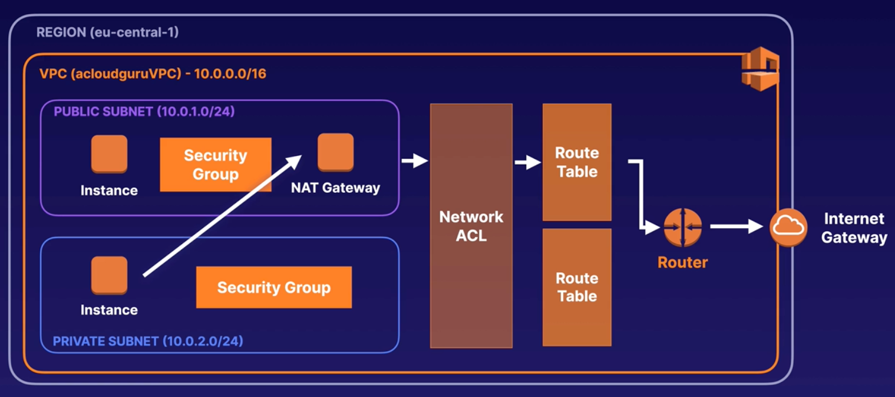

---
date: 2021-12-26
draft: false
thumbnail: /post-images/aws-vpc.png
title: AWS - VPC
extract: Notes for VPC
categories:
    - AWS
tags:
    - blog
    - AWS
--- 


### Table of Contents

- [What is VPC?](#what-is-vpc)
  - [Intro](#intro)
  - [Key Concepts](#key-concepts)
  - [3 tier architecture](#3-tier-architecture)
- [Network diagram for VPC](#network-diagram-for-vpc)
  - [IP address ranges](#ip-address-ranges)
  - [Default Options](#default-options)
  - [Public Subnet Creation](#public-subnet-creation)
  - [Private Subnet Creation](#private-subnet-creation)
  - [Public Subnet Config](#public-subnet-config)
  - [Route Table for Public Subnet](#route-table-for-public-subnet)
  - [Add Public Subnet to New Route Table](#add-public-subnet-to-new-route-table)
  - [Create EC2s](#create-ec2s)
  - [Private EC2 Security Groups](#private-ec2-security-groups)
- [NAT Gateways](#nat-gateways)
- [Security Groups](#security-groups)
- [NACLs](#nacls)


## What is [VPC](https://docs.aws.amazon.com/vpc/latest/userguide/what-is-amazon-vpc.html)?
Amazon Virtual Private Cloud (Amazon VPC) enables you to launch AWS resources into a virtual network that you've defined. This virtual network closely resembles a traditional network that you'd operate in your own data center, with the benefits of using the scalable infrastructure of AWS. 

### Intro

Amazon VPC is the networking layer for Amazon EC2. You can think of a VPC as a virtual data center in the cloud. We've already been using VPCs as seen in the EC2 section where we were provisioning our EC2s into the `default` VPC. Every AWS account has a default VPC that's set up automatically.

VPC is logically isolated part of AWS cloud where you can define your own network. You have complete control of the virtual network including your own IP address range, subnets, route tables and network gateways. VPC is basically a fully customizable network. 


### Key Concepts
The following are the key concepts for VPCs:

- **Virtual private cloud (VPC)** — A virtual network dedicated to your AWS account.

- **Subnet** — A range of IP addresses in your VPC. When you create a subnet, you'll choose a range of IP addresses that you want associated with that subnet. 1 subnet is always in 1 availability zone.

- **Route table** — A set of rules, called routes, that are used to determine where network traffic is directed. This allows us to communicate between subnets.

- **Internet gateway** — A gateway that you attach to your VPC to enable communication between resources in your VPC and the internet.

- **VPC endpoint** — Enables you to privately connect your VPC to supported AWS services and VPC endpoint services powered by PrivateLink without requiring an internet gateway, NAT device, VPN connection, or AWS Direct Connect connection. Instances in your VPC do not require public IP addresses to communicate with resources in the service. Traffic between your VPC and the other service does not leave the Amazon network.

- **CIDR block** — Classless Inter-Domain Routing. An internet protocol address allocation and route aggregation methodology. For CIDR visualization, check out this website: [cidr.xyz](https://cidr.xyz/).

- **NACLs** - Network access control lists that allow us to block specific IP addresses.

### 3 tier architecture

Usually we have a 3 tier architecture (web servers, application and DB). In such an architecture, our web servers are in a public facing subnet meaning these are accessible via port 80 or 443 (HTTP or HTTPS). The application tier is in a private subnet that handles our business logic (rendering the webpage, routing requests for backend, authN and authZ logic etc). The application tier is NOT accessible via the internet and can only speakw ith the web tier or the DB tier. Finally we have the database tier which is also in a private subnet and is responsible for maintaining our data. It can only speak with the application and nothing else. 

[Image Credit - Acloudguru](https://acloudguru.com)

For applications that already exist in a corporate data center, we can create a hardware virtual private network (VPN) connection between the corporate data center and AWS and leverage AWS cloud as an extension of the corporate data center.

## Network diagram for VPC

Here's how we'd usually go about creating a VPC network for a typical use-case:


(1) We first need to choose the region we want to deploy to

### IP address ranges

(2) Next we need to choose the IP address range which could be one of three:
  - 10.0.0.0 (we'll use this with /16 option. Only two valid options are /16 and /28)
  - 172.16.0.0
  - 192.168.0.0

### Default Options

(3) You'll be asked about tenancy. This is the same tenancy we discussed in the VPC section. You can run instances in your VPC on single-tenant, dedicated hardware. Select Dedicated to ensure that instances launched in this VPC are dedicated tenancy instances, regardless of the tenancy attribute specified at launch. Select Default to ensure that instances launched in this VPC use the tenancy attribute specified at launch. `Dedicated` are more expensive! We'll use `Default`

(4) As soon as we create our VPC, a main route table is created automatically for us, along with main network acl. In addition, a default security group is also created for our VPC.

(5) Go ahead and exmaine the route table associated with our VPC. Notice that there're routes associated with it but no subnets as shown under `Subnet associations` section.

(6) However, going to the subnets section, you'll find subnets present. These are associated with our default VPC and not with the new VPC that you created. 

### Public Subnet Creation

(7) Next, we'll create a public subnet (10.0.1.0/24 IP address range), add an instance to it and configure security group. To do so, click on `Create Subnet`. You'll be asked to choose a VPC. We'll obviously choose the VPC we created earlier. Provide a region, `us-east-1a` and name for your subnet. We'll name it using the convention: `<IP ADDRESS RANGE> - <REGION>` which would translate to: `10.0.1.0 - us-east-1a`. Next, we'll specify the IPv4 CIDR block: 10.0.1.0/24. We'll then click on `Create Subnet`. You can see that this subnet is associated with the VPC you created in the steps above.

Notice under the Available IPv4 addresses, you'll see 251. If you go to [cidr.xyz](https://cidr.xyz/) and type in the CIDR block address you provided, it'll return 256. Why does AWS give us 5 fewer addresses? The first four IP addresses and the last IP address in each subnet CIDR block are not available for you to use, and cannot be assigned to an instance. For example, in a subnet with CIDR block 10.0.0.0/24, the following five IP addresses are reserved:

 - 10.0.0.0: Network address.

 - 10.0.0.1: Reserved by AWS for the VPC router.

 - 10.0.0.2: Reserved by AWS. The IP address of the DNS server is the base of the VPC network range plus two. For VPCs with multiple CIDR blocks, the IP address of the DNS server is located in the primary CIDR. We also reserve the base of each subnet range plus two for all CIDR blocks in the VPC. For more information, see Amazon DNS server.

 - 10.0.0.3: Reserved by AWS for future use.

 - 10.0.0.255: Network broadcast address. We do not support broadcast in a VPC, therefore we reserve this address.

### Private Subnet Creation

(8) Similar to our public subnet, we'll create a private subnet. We'll place this private subnet in us-east-1b region. Therefore, we'll name this subnet as: `10.0.2.0 - us-east-1b`. Now go to subnets tab to make sure both new subnets are available.

**Side Note**: Just by creating the two subnets and giving them IP addresses, we haven't made them public or private yet! We'll do that in the steps below. Here's what we've created so far (note the labelled subnets are not actually private or public as stated):

[Image Credit - Acloudguru](https://acloudguru.com)

### Public Subnet Config

(9) Alright, let's make our public subnet public: 

- We'll first enable `Auto-assign public IPv4 address` for the subnet 10.0.1.0-us-east-1a. That's because we want EC2s in that subnet to be public. To do so, choose the public subnet and click on Actions and then click on `Edit subnet settings`. Then all we need to do is enable `Enable auto-assign public IPv4 addressInfo`. This will make our subnet public.
- Next, we'll create an internet gateway. Simply go to Internet Gateway and create one. Next, we need to attach it to your VPC by choosing your VPC name. **You can only have 1 IGW attached to a VPC**.
- Attaching an IGW is not enough. We need to add entries to our Route Table. So go to Route Tables and choose the VPC that you created. Go to routes tab and you'll see that a route already exists: 10.0.0.0/16. This route will ONLY allow our subnets to communicate with each other. Go ahead and click on Subnet Associations and you'll see this message:

**"The following subnets have not been explicitly associated with any route tables and are therefore associated with the main route table:"** 

In that table you'll see our public and private subnets. Any new subnets created are **automatically associated with the main route table**. This is why you wouldn't want your main route table to have a route out to the internet, otherwise, any new subnets created and any EC2s in that subnet will always be internet accessible. Best practice is to create a new route table that's accessible via the internet. That's exactly what we'll do in the next section:

### Route Table for Public Subnet

So let's create the route table for our public subnet. Go ahead and click on create route table and call it `InternetRT` and choose our VPC. With the newly created route table selected, go back to routes and click on edit. We'll add a route to the internet. To do so, clik on add route and provide the following as destination:
`0.0.0.0/0`

and for Target, choose the internet gateway that you created. This will create a route out to the internet! What this does is that for destination `0.0.0.0/0` (ie destination internet), forward requests to internet gateway that's attached to this VPC.

### Add Public Subnet to New Route Table

Next, go back to your public subnet, click on Route table and then on edit route table association. Next, you can choose the internet route table that you created to be associated with your public subnet. Now if you go back to Route Tables and look under Subnet Associations, you'll now only see your private subnet under the message saying subnet not associated with any route table. You'll see your public subnet associated with the new route table.

### Create EC2s

(10) We'll create 2 EC2 instances. One will be placed in our public subnet while the other will be placed in our private subnet. We'll create a standard EC2 instance and in configuration details provide our custom VPC for network instead of our default VPC. Additionally, we'll also provide the subnet where we want our EC2 instance launched. Remember, one will go into public subnet and the other in our private subnet. Add a tag to each EC2 for easy identification (WebServer for public and DBServer for private).

Notice that when public web server is created, it'll automatically be assigned a public IPv4 address. To test whether your WebServer is actually public, try to SSH into it and perform a `yum update`. 

### Private EC2 Security Groups
**IMPORTANT**: For your private DBServer, you don't want internet access for now. You only want access from to DBServer from WebServer:

- To allow MySQL traffic into DBServer. To do so, we'll set Inbound Rules. Since our DBServer is `MySQL/Aurora`, we'll set the type as MySQL/Aurora and the source as `10.0.1.0/24`. Remember, this is the CIDR block we chose for our WebServer. Therefore, we're saying that allow inbound traffic from that IP address range. 
  
- We also want to be able to ping our DBServer. To make that possible, we'll add another inbound rule with type `All ICMP - IPv4`. Again, the source CIDR block would be the WebServer CIDR block: `10.0.1.0/24`.

- We also want HTTP access to our DBServer. To make that possible, we'll add another inbound rule with type `HTTP`. Again, the source CIDR block would be the WebServer CIDR block: `10.0.1.0/24`.

- We also want SSH access to our DBServer. To make that possible, we'll add another inbound rule with type `SSH`. Again, the source CIDR block would be the WebServer CIDR block: `10.0.1.0/24`.

NOTICE: we're adding SSH Inbound Rule ONLY from WebServer for demo purposes.

Now, let's grab the private IPv4 address for our DBServer and from our connected WebServer terminal, see if we're able to ping our DBServer. To do so, we'll run:

```bash
ping <DB_SERVER_IP_ADDRESS>
```
Now, try to connect to the DBServer in another terminal where you're not SSHed into your WebServer. That won't be possible since our security groups do not allow that! 

Now SSH into your DBServer via the WebServer using:

```bash
ssh -i "kvPair.pem" ec2-user@<DBServerPrivateIP>
```
Once in, elevate yourself to `su` and try running `yum update -y`. You'll get a timeout! This is obviously not what we want! We want no internet traffic coming in but at the same time we want our servers to be up to date with latest security patches. We'll look at how to enable this outflow in the next section.

Here's a demo showing what we've done so far:

- Create a VPC in a region
- Create 2 subnets in that region. Use CIDR block `10.0.1.0/24` for public subnet and `10.0.2.0/24` for private subnet
- For public subnet:
  - Create Internet Gateway
  - Enable auto-assign public IPv4 address
  - Add route out to the internet using `0.0.0.0/0`
- For private subnet:
  - Do nothing for now!
- Create 2 EC2 instances, one for public subnet and one for private subnet
- For public subnet EC2, add SSH, HTTP and HTTPS security group rules
- For private subnet EC2, add HTTP, PING and MySQL/Aurora Inbound Rules from our public subnet CIDR block 
- Ping private subnet EC2 from public subnet EC2
- SSH into DBServer from WebServer
- Try yum update for DBServer (which will timeout)

<!-- copy and paste. Modify height and width if desired. -->
<iframe class="embeddedObject shadow resizable" name="embedded_content" scrolling="no" frameborder="0" type="text/html" 
        style="overflow:hidden;" src="https://www.screencast.com/users/IqbalKhan8502/folders/Capture/media/f12d64a9-219c-4e09-ade9-1b5fe11f7c21/embed" height="758" width="1434" webkitallowfullscreen mozallowfullscreen allowfullscreen></iframe>


**SIDE NOTE**:  SSH should be disabled by default but for demo purposes, I've added SSH access to DBServer security group.

(7) Optional: We can attach a virtual private gateway to our VPC that'll allow us to connect our corporate data center to our private subnet

[Image Credit: acloudguru](https://acloudguru.com)

## NAT Gateways

From the previous demo, you can see that DBServer was not able to perfrom a yum update. To prevent outside traffic from reaching our DBServer BUT at the same time, enabling DBServer to reach out to the internet would require something called a NAT gateway. A NAT gateway is a Network Address Translation (NAT) service. You can use a NAT gateway so that instances in a private subnet can connect to services outside your VPC but external services cannot initiate a connection with those instances. 

When you create a NAT gateway, you specify one of the following connectivity types:

- **Public – (Default)** Instances in private subnets can connect to the internet through a public NAT gateway, but cannot receive unsolicited inbound connections from the internet. You create a public NAT gateway in a public subnet and must associate an elastic IP address with the NAT gateway at creation. You route traffic from the NAT gateway to the internet gateway for the VPC. Alternatively, you can use a public NAT gateway to connect to other VPCs or your on-premises network. In this case, you route traffic from the NAT gateway through a transit gateway or a virtual private gateway.

- **Private** – Instances in private subnets can connect to other VPCs or your on-premises network through a private NAT gateway. You can route traffic from the NAT gateway through a transit gateway or a virtual private gateway. You cannot associate an elastic IP address with a private NAT gateway. You can attach an internet gateway to a VPC with a private NAT gateway, but if you route traffic from the private NAT gateway to the internet gateway, the internet gateway drops the traffic.

When our DBServer tries to reach out to the internet, it is unable to do so. That's because there's no route in the route table that allows traffic out to the internet. Similarly, no traffic from the internet can acccess our private subnet.

[Image Credit: acloudguru](https://acloudguru.com)

**The solution to this issue is to provision a NAT Gateway in the public subnet.** You can use a public NAT gateway to enable instances in a private subnet to send outbound traffic to the internet, but the internet cannot establish connections to the private instances. Once the NAT gateway is created in the public subnet, our private DBServer instance can reach out to the NAT Gateway (remember, our private DBServer can speak with other subnets in our VPC). Once DBServer connects to NAT Gateway, the request is sent to network ACL, to route table, the router and then the internet gateway!

[Image Credit: acloudguru](https://acloudguru.com)

As you might remember from the previous section, we're not able to SSH into our DBServer apart from our WebServer. We enabled SSH from `10.0.1.0/24` to our Inbound Rule for security group that's attaced to our DBServer. Next, we SSHed into our WebServer, imported the .pem file into that EC2 instance, and SSHed into our DBServer. We saw that we aren't able to perform a `yum update -y` from the DBServer.

To enable internet access from private subnet, we'll now create a NAT Gateway. To do so, we'll follow these steps:

- Go to NAT Gateways and create NAT gateway
- Call it DBServerNatGateway
- It'll ask you to choose a subnet, choose your public subnet
- Connectivity type: Public
- Choose to Allocate Elastic IP address
- We also need to create a route out to the internet for requests originating from our private subnet. To do so, follow these steps:
  - Go to your route tables and look for the main route table associated with our VPC. Why main route table? Because remember that the main route table is used for unassociated subnets. We never associated our private subnet with any specific route table.
  - Once chosen, go ahead and add the following route: `0.0.0.0/0` and target as the NAT gateway you created.
- Run `yum update -y` in your DBServer to make sure that the DBServer is able to perform the update!

<!-- copy and paste. Modify height and width if desired. -->
<iframe class="embeddedObject shadow resizable" name="embedded_content" scrolling="no" frameborder="0" type="text/html" 
        style="overflow:hidden;" src="https://www.screencast.com/users/IqbalKhan8502/folders/Capture/media/e56e526c-03b6-4c78-9f22-5d83234f3569/embed" height="756" width="1436" webkitallowfullscreen mozallowfullscreen allowfullscreen></iframe>


## Security Groups

Here's what our VPC setup looks like right now (minus the VP Gateway):

[Image Credit: acloudguru](https://acloudguru.com)

When a request comes in from the internet, it hits our router that defers to our route table. The request then goes through NACL and then finally to our security group. The security group is our last line of defense. If you have internet connectivity issues in your VPC, check to see if the route table has correct entry, check if NACL rules are correct (we'll discuss this later) and finally check your security groups.

Security groups are stateful: if you send a request from your instance, the response traffic for that request is allowed to flow in both directions. If port 80 is open, requests can come in via that port and can go out through that port as well. **Responses to allowed inbound traffic are allowed to flow out, regardless of outbound rules**. So if you open port 80 to the world for inbound and try to block outbound at port 80, it won't work.

## NACLs

A NACL is a layer of security for your VPC that acts as a firewall for controlling traffic in and out of one or more subnets. 
- Default NACLs ALLOW all inbound and outbound traffic. 
- If you create a custom NACL, it'll DENY all inbound and outbound traffic until you add rules.
- Each subnet in your VPC must be associated with a NACL. A single NACL can be tied to multiple subnets but each subnet must only have 1 NACL associated
- If you don't explicitly associate a subnet with a NACL, the subnet is automatically associated with default NACL.
- Best practice is to block IP addresses using NACLs and not security groups
- NACLs contain a numbered list of rules that are evaluated in order, starting with the lowest numbered rule.
- NACLs have separate inbound and outbound rules and each rule can be either allow or deny
- NACLs are stateless: responses to allowed inbound traffic are subject to the rules for outbound traffic and vice versa

Let's look at a demo:

- ssh into the WebServer and install apache: `sudo yum install httpd`
- run `sudo service httpd start`
- `cd /var/www/html`
- create a index.html file: echo "<html><body><h1>Hello!</h1></body></html>" > index.html
- Now visit the public address of your WebServer and you should see hello! Close this tab
- Now go to Network ACLs in AWS console and check Inbound Rules for your test VPC: You'll see it allows all traffic with rule number 100 and a deny rule after that.
- Let's create a new NACL and choose our VPC.
- Looking at the rules of the newly created NACL, you'll see it denies both inboud and outbound traffic
- Try associating our public subnet with this NACL and hit save. Re-open the public EC2's URl page and you'll see there's an error now!
- Edit NACLs inbound rule. Start with a rule number of 100 and increment by 100 for each new rule. Rule number 100 will be checked first, then 200 and so on. Items below show what I've added (Rule number -> Type -> Source -> Allow/Deny)
  - 100 -> HTTP -> 0.0.0.0/0 -> ALLOW
  - 200 -> SSH -> 0.0.0.0/0 -> ALLOW 
  - Since NACLs are stateless, we need to add similar rules to outbound rules as well
  - 100 -> HTTP -> 0.0.0.0/0 -> ALLOW
  - 200 -> SSH -> 0.0.0.0/0 -> ALLOW 
  - We also need to add ephemeral ports: 
    - 300 -> Custom TCP -> 1024-65535 (This is the port range) -> 0.0.0.0/0 -> ALLOW
- Refresh the webpage and you should see the same Hello page again!

<!-- copy and paste. Modify height and width if desired. -->
<iframe class="embeddedObject shadow resizable" name="embedded_content" scrolling="no" frameborder="0" type="text/html" 
        style="overflow:hidden;" src="https://www.screencast.com/users/IqbalKhan8502/folders/Capture/media/ec8549ff-76cb-465c-ba83-c986ba0f611a/embed" height="770" width="1438" webkitallowfullscreen mozallowfullscreen allowfullscreen></iframe>