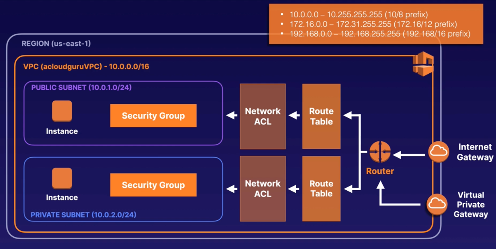

---
date: 2021-12-26
draft: false
thumbnail: /post-images/aws-vpc.png
title: AWS - VPC
extract: Notes for VPC
categories:
    - AWS
tags:
    - blog
    - AWS
--- 

### Table of Contents

- [What is VPC?](#what-is-vpc)
  - [Intro](#intro)
  - [Key Concepts](#key-concepts)
  - [3 tier architecture](#3-tier-architecture)
- [Network diagram for VPC](#network-diagram-for-vpc)
  - [IP address ranges](#ip-address-ranges)
  - [Default Options](#default-options)
  - [Public Subnet Creation](#public-subnet-creation)
  - [Private Subnet Creation](#private-subnet-creation)
  - [Public Subnet Config](#public-subnet-config)
  - [Route Table for Public Subnet](#route-table-for-public-subnet)
  - [Add Public Subnet to New Route Table](#add-public-subnet-to-new-route-table)

## What is [VPC](https://docs.aws.amazon.com/vpc/latest/userguide/what-is-amazon-vpc.html)?
Amazon Virtual Private Cloud (Amazon VPC) enables you to launch AWS resources into a virtual network that you've defined. This virtual network closely resembles a traditional network that you'd operate in your own data center, with the benefits of using the scalable infrastructure of AWS. 

### Intro

Amazon VPC is the networking layer for Amazon EC2. You can think of a VPC as a virtual data center in the cloud. We've already been using VPCs as seen in the EC2 section where we were provisioning our EC2s into the `default` VPC. Every AWS account has a default VPC that's set up automatically.

VPC is logically isolated part of AWS cloud where you can define your own network. You have complete control of the virtual network including your own IP address range, subnets, route tables and network gateways. VPC is basically a fully customizable network. 

### Key Concepts
The following are the key concepts for VPCs:

- **Virtual private cloud (VPC)** — A virtual network dedicated to your AWS account.

- **Subnet** — A range of IP addresses in your VPC. When you create a subnet, you'll choose a range of IP addresses that you want associated with that subnet. 1 subnet is always in 1 availability zone.

- **Route table** — A set of rules, called routes, that are used to determine where network traffic is directed. This allows us to communicate between subnets.

- **Internet gateway** — A gateway that you attach to your VPC to enable communication between resources in your VPC and the internet.

- **VPC endpoint** — Enables you to privately connect your VPC to supported AWS services and VPC endpoint services powered by PrivateLink without requiring an internet gateway, NAT device, VPN connection, or AWS Direct Connect connection. Instances in your VPC do not require public IP addresses to communicate with resources in the service. Traffic between your VPC and the other service does not leave the Amazon network.

- **CIDR block** — Classless Inter-Domain Routing. An internet protocol address allocation and route aggregation methodology. For CIDR visualization, check out this website: [cidr.xyz](https://cidr.xyz/).

- **NACLs** - Network access control lists that allow us to block specific IP addresses.

### 3 tier architecture

Usually we have a 3 tier architecture (web servers, application and DB). In such an architecture, our web servers are in a public facing subnet meaning these are accessible via port 80 or 443 (HTTP or HTTPS). The application tier is in a private subnet that handles our business logic (rendering the webpage, routing requests for backend, authN and authZ logic etc). The application tier is NOT accessible via the internet and can only speakw ith the web tier or the DB tier. Finally we have the database tier which is also in a private subnet and is responsible for maintaining our data. It can only speak with the application and nothing else. 

[Image Credit - Acloudguru](https://acloudguru.com)

For applications that already exist in a corporate data center, we can create a hardware virtual private network (VPN) connection between the corporate data center and AWS and leverage AWS cloud as an extension of the corporate data center.

## Network diagram for VPC

Here's how we'd usually go about creating a VPC network for a typical use-case:

(1) We first need to choose the region we want to deploy to

### IP address ranges

(2) Next we need to choose the IP address range which could be one of three:
  - 10.0.0.0 (we'll use this with /16 option. Only two valid options are /16 and /28)
  - 172.16.0.0
  - 192.168.0.0

### Default Options

(3) You'll be asked about tenancy. This is the same tenancy we discussed in the VPC section. You can run instances in your VPC on single-tenant, dedicated hardware. Select Dedicated to ensure that instances launched in this VPC are dedicated tenancy instances, regardless of the tenancy attribute specified at launch. Select Default to ensure that instances launched in this VPC use the tenancy attribute specified at launch. `Dedicated` are more expensive! We'll use `Default`

(4) As soon as we create our VPC, a main route table is created automatically for us, along with main network acl. In addition, a default security group is also created for our VPC.

(5) Go ahead and exmaine the route table associated with our VPC. Notice that there're routes associated with it but no subnets as shown under `Subnet associations` section.

(6) However, going to the subnets section, you'll find subnets present. These are associated with our default VPC and not with the new VPC that you created. 

### Public Subnet Creation

(7) Next, we'll create a public subnet (10.0.1.0/24 IP address range), add an instance to it and configure security group. To do so, click on `Create Subnet`. You'll be asked to choose a VPC. We'll obviously choose the VPC we created earlier. Provide a region, `us-east-1a` and name for your subnet. We'll name it using the convention: `<IP ADDRESS RANGE> - <REGION>` which would translate to: `10.0.1.0 - us-east-1a`. Next, we'll specify the IPv4 CIDR block: 10.0.1.0/24. We'll then click on `Create Subnet`. You can see that this subnet is associated with the VPC you created in the steps above.

Notice under the Available IPv4 addresses, you'll see 251. If you go to [cidr.xyz](https://cidr.xyz/) and type in the CIDR block address you provided, it'll return 256. Why does AWS give us 5 fewer addresses? The first four IP addresses and the last IP address in each subnet CIDR block are not available for you to use, and cannot be assigned to an instance. For example, in a subnet with CIDR block 10.0.0.0/24, the following five IP addresses are reserved:

 - 10.0.0.0: Network address.

 - 10.0.0.1: Reserved by AWS for the VPC router.

 - 10.0.0.2: Reserved by AWS. The IP address of the DNS server is the base of the VPC network range plus two. For VPCs with multiple CIDR blocks, the IP address of the DNS server is located in the primary CIDR. We also reserve the base of each subnet range plus two for all CIDR blocks in the VPC. For more information, see Amazon DNS server.

 - 10.0.0.3: Reserved by AWS for future use.

 - 10.0.0.255: Network broadcast address. We do not support broadcast in a VPC, therefore we reserve this address.

### Private Subnet Creation

(8) Similar to our public subnet, we'll create a private subnet. We'll place this private subnet in us-east-1b region. Therefore, we'll name this subnet as: `10.0.2.0 - us-east-1b`. Now go to subnets tab to make sure both new subnets are available.

**Side Note**: Just by creating the two subnets and giving them IP addresses, we haven't made them public or private yet! We'll do that in the steps below. Here's what we've created so far (note the labelled subnets are not actually private or public as stated):

[Image Credit - Acloudguru](https://acloudguru.com)

### Public Subnet Config

(9) Alright, let's make our public subnet public: 

- We'll first enable `Auto-assign public IPv4 address` for the subnet 10.0.1.0-us-east-1a. That's because we want EC2s in that subnet to be public. To do so, choose the public subnet and click on Actions and then click on `Edit subnet settings`. Then all we need to do is enable `Enable auto-assign public IPv4 addressInfo`. This will make our subnet public.
- Next, we'll create an internet gateway. Simply go to Internet Gateway and create one. Next, we need to attach it to your VPC by choosing your VPC name. **You can only have 1 IGW attached to a VPC**.
- Attaching an IGW is not enough. We need to add entries to our Route Table. So go to Route Tables and choose the VPC that you created. Go to routes tab and you'll see that a route already exists: 10.0.0.0/16. This route will ONLY allow our subnets to communicate with each other. Go ahead and click on Subnet Associations and you'll see this message:

`The following subnets have not been explicitly associated with any route tables and are therefore associated with the main route table:` In that table you'll see our public and private subnets. Any new subnets created are **automatically associated with the main route table**. This is why you wouldn't want your main route table to have a route out to the internet, otherwise, any new subnets created and any EC2s in that subnet will always be internet accessible. Best practice is to create a new route table that's accessible via the internet. 

### Route Table for Public Subnet

So let's create the route table for our public subnet. Go ahead and click on create route table and call it `InternetRT` and choose our VPC. With the newly created route table selected, go back to routes and click on edit. We'll add a route to the internet. To do so, clik on add route and provide the following as destination:
`0.0.0.0/0`

and for Target, choose the internet gateway that you created. This will create a route out to the internet!

### Add Public Subnet to New Route Table

Next, go back to your public subnet, click on Route table and then on edit route table association. Next, you can then choose the internet route table that you created to be associated with your public subnet. 4:44 

(9) Attach internet gateway to our VPC making our instance in our public subnet internet accessible

(6) Build a private subnet (10.0.2.0/24 IP address range) and attach a security group to it

(7) Optional: We can attach a virtual private gateway to our VPC that'll allow us to connect our corporate data center to our private subnet

[Image Credit: acloudguru](https://acloudguru.com)

