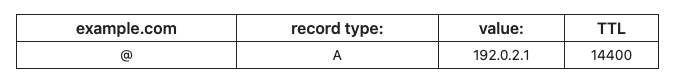
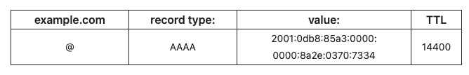
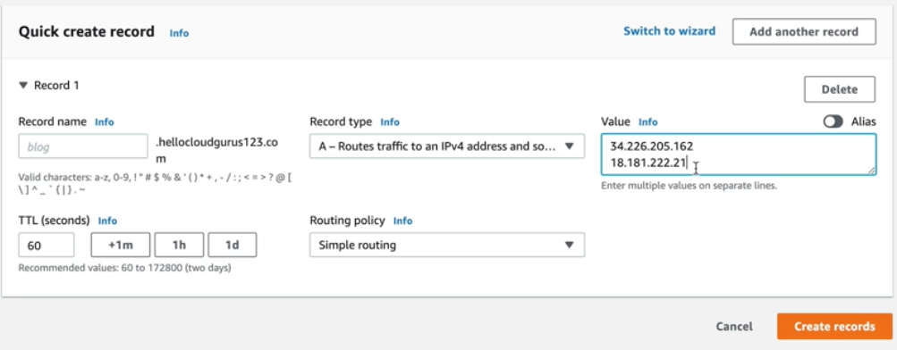
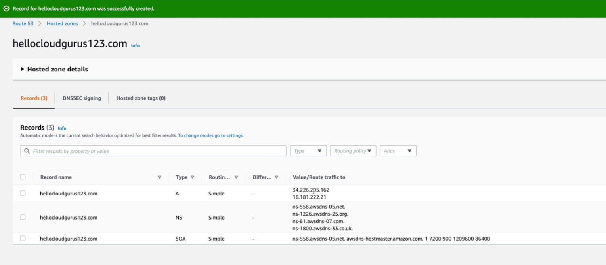
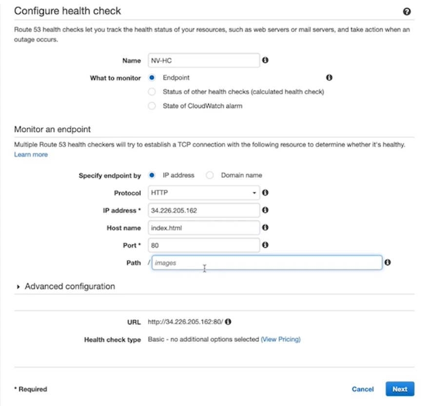
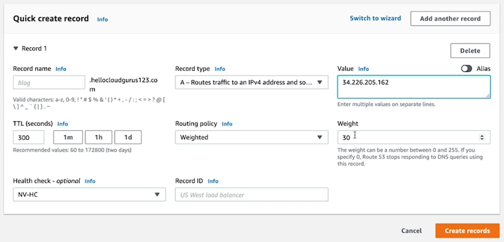
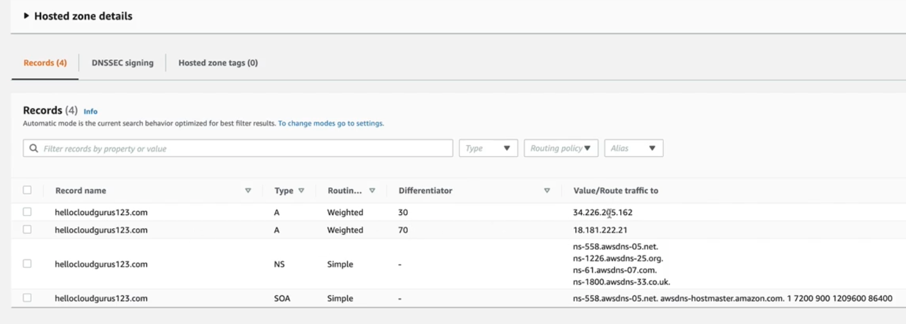

---
date: 2021-12-27
draft: false
thumbnail: /post-images/aws-route53.png
title: AWS - Route 53
extract: Notes for Route 53
categories:
    - AWS
tags:
    - blog
    - AWS
--- 

### Table of Contents

- [What is Route53?](#what-is-route53)
  - [Hosted Zone](#hosted-zone)
  - [DNS](#dns)
  - [Top Level Domain](#top-level-domain)
  - [CNAME](#cname)
  - [SOA](#soa)
  - [NS records](#ns-records)
  - [A Record](#a-record)
  - [AAAA Records](#aaaa-records)
  - [Alias Records](#alias-records)
- [Register A Domain Name](#register-a-domain-name)
- [Simple Routing Policy](#simple-routing-policy)
- [Weighted Routing Policy](#weighted-routing-policy)
- [Failover Routing Policy](#failover-routing-policy)
- [Geolocation Routing Policy](#geolocation-routing-policy)
- [Geoproximity Routing Policy](#geoproximity-routing-policy)
- [Latency Routing Policy](#latency-routing-policy)
- [Multi-Value Answer Routing Policy](#multi-value-answer-routing-policy)

## What is [Route53](https://docs.aws.amazon.com/Route53/latest/DeveloperGuide/Welcome.html)?
Amazon Route 53 is a highly available and scalable Domain Name System (DNS) web service. You can use Route 53 to perform three main functions in any combination: domain registration, DNS routing, and health checking.

### Hosted Zone

A hosted zone is a container for records, and records contain information about how you want to route traffic for a specific domain, such as example.com, and its subdomains (acme.example.com, zenith.example.com). A hosted zone and the corresponding domain have the same name. There are two types of hosted zones:

Public hosted zones contain records that specify how you want to route traffic on the internet. Private hosted zones contain records that specify how you want to route traffic in an Amazon VPC.

### DNS

The Domain Name System (DNS) is the phonebook of the Internet. Humans access information online through domain names, like nytimes.com or espn.com. Web browsers interact through Internet Protocol (IP) addresses. DNS translates domain names to IP addresses so browsers can load Internet resources.

Each device connected to the Internet has a unique IP address which other machines use to find the device. DNS servers eliminate the need for humans to memorize IP addresses such as 192.168.1.1 (in IPv4), or more complex newer alphanumeric IP addresses such as 2400:cb00:2048:1::c629:d7a2 (in IPv6).

The process of DNS resolution involves converting a hostname (such as www.example.com) into a computer-friendly IP address (such as 192.168.1.1). An IP address is given to each device on the Internet, and that address is necessary to find the appropriate Internet device - like a street address is used to find a particular home. When a user wants to load a webpage, a translation must occur between what a user types into their web browser (example.com) and the machine-friendly address necessary to locate the example.com webpage.

### Top Level Domain

Top-level domain (TLD) refers to the last segment of a domain name, or the part that follows immediately after the "dot" symbol.

For example, in the internet address: https://www.google.com, the “.com” portion is the TLD.

TLDs are mainly classified into two categories: generic TLDs and country-specific TLDs.

### CNAME

The ‘canonical name’ (CNAME) record is used in lieu of an A record, when a domain or subdomain is an alias of another domain. All CNAME records must point to a domain, never to an IP address. Imagine a scavenger hunt where each clue points to another clue, and the final clue points to the treasure. A domain with a CNAME record is like a clue that can point you to another clue (another domain with a CNAME record) or to the treasure (a domain with an A record).

For example, suppose blog.example.com has a CNAME record with a value of ‘example.com’ (without the ‘blog’). This means when a DNS server hits the DNS records for blog.example.com, it actually triggers another DNS lookup to example.com, returning example.com’s IP address via its A record. In this case we would say that example.com is the canonical name (or true name) of blog.example.com.

Oftentimes, when sites have subdomains such as blog.example.com or shop.example.com, those subdomains will have CNAME records that point to a root domain (example.com). This way if the IP address of the host changes, only the DNS A record for the root domain needs to be updated and all the CNAME records will follow along with whatever changes are made to the root.

### SOA

The DNS ‘start of authority’ (SOA) record stores important information about a domain or zone such as the email address of the administrator, when the domain was last updated, and how long the server should wait between refreshes.

### NS records

NS stands for ‘nameserver,’ and the nameserver record indicates which DNS server is authoritative for that domain (i.e. which server contains the actual DNS records). Basically, NS records tell the Internet where to go to find out a domain's IP address. A domain often has multiple NS records which can indicate primary and backup nameservers for that domain. Without properly configured NS records, users will be unable to load a website or application.

A nameserver is a type of DNS server. It is the server that stores all DNS records for a domain, including A records, MX records, or CNAME records.

Almost all domains rely on multiple nameservers to increase reliability: if one nameserver goes down or is unavailable, DNS queries can go to another one. Typically there is one primary nameserver and several secondary nameservers, which store exact copies of the DNS records in the primary server. Updating the primary nameserver will trigger an update of the secondary nameservers as well.

### A Record

The "A" stands for "address" and this is the most fundamental type of DNS record: it indicates the IP address of a given domain. For example, if you pull the DNS records of cloudflare.com, the A record currently returns an IP address of: 104.17.210.9.

A records only hold IPv4 addresses. If a website has an IPv6 address, it will instead use an "AAAA" record.

[Image Credit: Cloudflare](https://www.cloudflare.com/learning/dns/dns-records/dns-a-record/)

The "@" symbol in this example indicates that this is a record for the root domain, and the "14400" value is the TTL (time to live), listed in seconds. The default TTL for A records is 14,400 seconds. This means that if an A record gets updated, it takes 240 minutes (14,400 seconds) to take effect.

The vast majority of websites only have one A record, but it is possible to have several. Some higher profile websites will have several different A records as part of a technique called round robin load balancing, which can distribute request traffic to one of several IP addresses, each hosting identical content.

### AAAA Records

DNS AAAA records match a domain name to an IPv6 address. DNS AAAA records are exactly like DNS A records, except that they store a domain's IPv6 address instead of its IPv4 address.

IPv6 is the latest version of the Internet Protocol (IP). One of the important differences between IPv6 and IPv4 is that IPv6 addresses are longer than IPv4 addresses. The Internet is running out of IPv4 addresses, just as there are only so many possible phone numbers for a given area code. But IPv6 addresses offer exponentially more permutations and thus far more possible IP addresses.

As an example of the difference between IPv4 and IPv6 addresses, Cloudflare offers a public DNS resolver that anyone can use by setting their device's DNS to 1.1.1.1 and 1.0.0.1. These are the IPv4 addresses. The IPv6 addresses for this service are 2606:4700:4700::1111 and 2606:4700:4700::1001.

[Image Credit: Cloudflare](https://www.cloudflare.com/learning/dns/dns-records/dns-aaaa-record/)

### Alias Records

Amazon Route 53 alias records provide a Route 53–specific extension to DNS functionality. Alias records let you route traffic to selected AWS resources, such as CloudFront distributions and Amazon S3 buckets. They also let you route traffic from one record in a hosted zone to another record.

## Register A Domain Name
You can buy domain names directly from AWS. To do so, you simply go to Route53 and register a domain after providing your details. Once completed, you'll see a domain name (myexample.com), a record count and some more info. Once you click on the domain name, you'll see the NS and SOA that as created for you.

## Simple Routing Policy

If you choose a simple routing policy, you can only have one record with multiple IP addresses. If you specify multiple values in a record, Route 53 returns all values to the user in a random order. To do so, we provide IP addresses for the 2 EC2 instances we've created in the `Value` box when creating a new record:

[Image Credit: acloudguru](https://acloudguru.com)

Once completed, it creates a new A record for us that shows up in our Records tab like so:

[Image Credit: acloudguru](https://acloudguru.com)

Now, when you visit `hellocloudguru.com`, and open up a different browser with the same link, you'll sometimes be  directed to one EC2 instance (Virginia), while at times you'll be directed to the other EC2 instance (Tokyo).

## Weighted Routing Policy

This policy allows you to split your traffic based on different weights assigned. You can set 10% of your traffic to use-east-1 and 90% to eu-west-1 for example. If one of your regions is down, you need to have a way to direct traffic to the other region. For that, we can configure health checks on individual record sets. If a record fails a health check, it will be removed from route53 until it passes the health check again. Therefore, you need to setup a health check for each weighted route that we're going to create.

Here's what monitoring your routing policy would look like (IP address shown below is for the Northern Virginia region, hence the name NV-HC):

[Image Credit: acloudguru](https://acloudguru.com)

You then need to repeat the same steps for your other region that you'll choose for your weighted routing policy. Next we'll create a separate record set for the other region we want for our weighted policy. Here's what our NV EC2 record set will look like:

[Image Credit: acloudguru](https://acloudguru.com)

Once both records are created with a 30-70 weightage, here's what your records will look like:

[Image Credit: acloudguru](https://acloudguru.com)

## Failover Routing Policy

These are created when you want to create an active/passive setup. Route53 will monitor the health of your primary using a health check.

## Geolocation Routing Policy

This policy lets you choose where your traffic will be sent based on the geographic location of your users. This is the location from which DNS queries originate. For example, you might want all queries from Eurpoe to be routed to a fleet of EC2 instances that are configured for your European customers.

## Geoproximity Routing Policy

In route53 you can use traffic flows that are basically a routing system that uses a combo of geographic location, latency and availability to route traffic. Geoproximity routing lets route53 route traffic to your resources based on the geographic location of your users and your resources. This policy is only available if you're using a traffic flow.

## Latency Routing Policy

Allows you to route your traffic based on the lowest network latency for your end user.

## Multi-Value Answer Routing Policy

This lets you configure route52 to return multiple values such as IP addresses for your web servers in response to DNS queries. 
