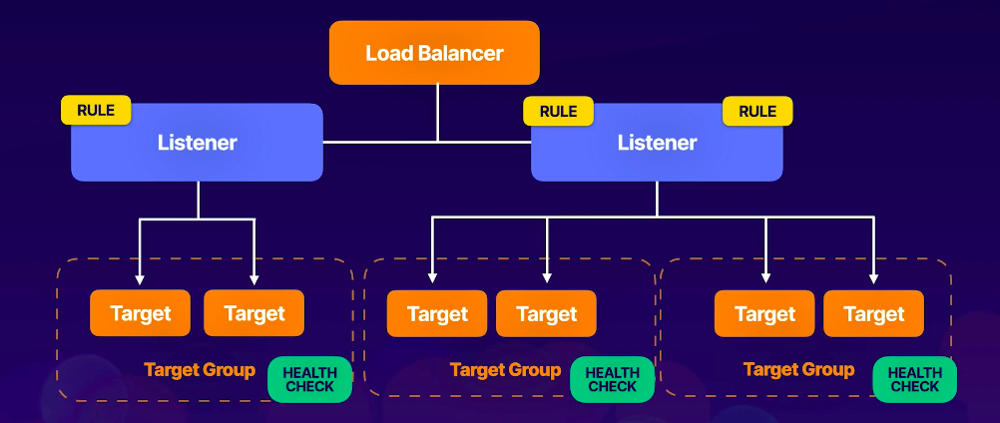

---
date: 2021-12-31
draft: false
thumbnail: /post-images/aws-elb.png
title: AWS - ELB
extract: Notes for AWS Load Balancing
categories:
    - AWS
tags:
    - blog
    - AWS
--- 

### Table of Contents

- [What is ELB?](#what-is-elb)
  - [Listeners](#listeners)
  - [Rules](#rules)
  - [Target Groups](#target-groups)
- [Application Load Balancers](#application-load-balancers)
  - [HTTPS Load Balancing](#https-load-balancing)
  - [ALB Demo](#alb-demo)
- [Network Load Balancers](#network-load-balancers)
- [Classic Load Balancer (or just Load Balancer!)](#classic-load-balancer-or-just-load-balancer)
  - [X-Forwarded-For](#x-forwarded-for)
- [Deregistration Delay](#deregistration-delay)

## What is [ELB](https://aws.amazon.com/elasticloadbalancing/)?
Elastic Load Balancing automatically distributes your incoming traffic across multiple targets, such as EC2 instances, containers, and IP addresses, in one or more Availability Zones. It monitors the health of its registered targets, and routes traffic only to the healthy targets. Elastic Load Balancing scales your load balancer as your incoming traffic changes over time. It can automatically scale to the vast majority of workloads. You can have 4 types of load balancers: application load balancers (ALB), network load balancers (NLB), gateway load balancers (GLB)  and the classic load balancer (CLB).

### Listeners

A listener checks for connection requests that come in from your clients using the protocol and port you configure. Example ports include port 80 (for HTTP requests) and port 443 (for HTTPS requests). You define the rules that determine how the load balancer will route requests to registered targets. 

### Rules

Rules consist of a priority for that rule, action(s) for that rule and condition(s) for that rule. When the rule conditions are met, then the actions are performed. You must define a default rule for each listener and can optionally define additional rules.

### Target Groups

Each target group routes requests to one or more targets such as EC2 instances. Protocol and port used to route requests are defined by you.

[Image Credit: acloudguru](https://acloudguru.com) 

## Application Load Balancers

An Application Load Balancer functions at the application layer, the seventh layer of the Open Systems Interconnection (OSI) model. After the load balancer receives a request, it evaluates the listener rules in priority order to determine which rule to apply, and then selects a target from the target group for the rule action. You can configure listener rules to route requests to different target groups based on the content of the application traffic.

You can configure rules for your listener that forward requests based on the URL in the request. This means that you can get path level routing using ALBs. This is also known as path based routing. This enables you to structure your application as smaller services, and route requests to the correct service based on the content of the URL. You can configure rules for your listener that forward requests based on the host field in the HTTP header. This enables you to route requests to multiple domains using a single load balancer. 

ALBs are the intelligent load balancers and can be though of as Teslas of load balancers. ALBs have the following limitation: ALBs only support HTTP and HTTPS.

### HTTPS Load Balancing
To use HTTPS load balancing you must deploy one SSL/TLS server certificate on your load balancer. The LB uses a server certificate to terminate the frontend connection and then decrypt requests from clients before sending them to the target

### ALB Demo

Ok so for our demo we'll experiment with ALBs:

- Create 3 EC2 instances in 3 different AZs
- While creating these EC2 instances use a bootstrap script to create an index.html file that says which server it is. 
- Use the WebDMZ security group for our instances
- Go to Load Balancers in EC2 and create a load balancer
- Choose ALB
- Choose all 3 AZs
- Next, go to security settings and choose WebDMZ security settings
- Next, we'll configure listeners and routing
- We'll have to create a new target group. Target type will be instance, protocol HTTP and port 80.
- Go to Advanced settings and reduce the thresholds to the minimum allowed (3,2,2,5)
- Next, register targets for this group and we'll choose the 3 EC2 instances we created and add it to this target group
- Once provisioned, copy the `DNS name` that's provided for your ALB in the Description section
- You should also go to Target groups and check whether your 3 targets are all healthy!
- Now go to your browser and paste the DNS name and hit refresh multiple times to see different messages!

That's all good for a simple, single rule ALB. We haven't talked about the listeners and rules yet though. Let's see where the rules are:

- Click on Listeners and click on View/edit rules for the only listener that shows up.
- On the page that opens, you'll see the rules and simple IF THEN boxes
- You can click on + and add additional rules which will be ABOVE the rule that you currently see. This means that if none of the conditions are met, then and only then is the last rule applied. 

<!-- copy and paste. Modify height and width if desired. -->
<iframe class="embeddedObject shadow resizable" name="embedded_content" scrolling="no" frameborder="0" type="text/html" 
        style="overflow:hidden;" src="https://www.screencast.com/users/IqbalKhan8502/folders/Capture/media/bf4a7fdf-6509-4460-aa0a-187648d3fadb/embed" height="758" width="1432" webkitallowfullscreen mozallowfullscreen allowfullscreen></iframe>

## Network Load Balancers

A Network Load Balancer functions at the fourth layer of the Open Systems Interconnection (OSI) model. It can handle millions of requests per second. After the load balancer receives a connection request, it selects a target from the target group for the default rule. It attempts to open a TCP connection to the selected target on the port specified in the listener configuration.

For TCP traffic, the load balancer selects a target using a flow hash algorithm based on the protocol, source IP address, source port, destination IP address, destination port, and TCP sequence number. The TCP connections from a client have different source ports and sequence numbers, and can be routed to different targets. Each individual TCP connection is routed to a single target for the life of the connection.

For UDP traffic, the load balancer selects a target using a flow hash algorithm based on the protocol, source IP address, source port, destination IP address, and destination port. A UDP flow has the same source and destination, so it is consistently routed to a single target throughout its lifetime. Different UDP flows have different source IP addresses and ports, so they can be routed to different targets.

There are NO rules for NLBs as compared to ALBs. NLBs can use ports from 1-65535. You can use a TLS listener to offload the work of encryption and decryption to your LB so your applications can focus on business logic.

NLBs are considered to be the most performant of all LBs. Think of them as the lambos of LBs.

## Classic Load Balancer (or just Load Balancer!)

THese are the legacy load balancers where you can load balance HTTP/HTTPS requests and use Layer7 specific features such as X-Forwarded-For and sticky sessions. You can also use Layer4 load balancing.

If you application stops responding, the CLB will respond with a 504 error.

To ensure that your registered instances are able to handle the request load in each Availability Zone, it is important to keep approximately the same number of instances in each Availability Zone registered with the load balancer. For example, if you have ten instances in Availability Zone us-west-2a and two instances in us-west-2b, the requests are distributed evenly between the two Availability Zones. As a result, the two instances in us-west-2b serve the same amount of traffic as the ten instances in us-west-2a. Instead, you should have six instances in each Availability Zone.

By default, the load balancer distributes traffic evenly across the Availability Zones that you enable for your load balancer. To distribute traffic evenly across all registered instances in all enabled Availability Zones, enable cross-zone load balancing on your load balancer. However, we still recommend that you maintain approximately equivalent numbers of instances in each Availability Zone for better fault tolerance.

### X-Forwarded-For

When traffic is sent from a LB, the server access logs contain the IP addresses of the LB only. To see the original IP address of the client, the `X-Forwarded-For` request header needs to be examined. 

## Deregistration Delay

If you deregister an EC2 instance from the target group, there's a delay between you deregistering and ELB passing requests on to the deregistered instance. This will cause clients to see errors on their end. Best practice is to change the value to 0.

