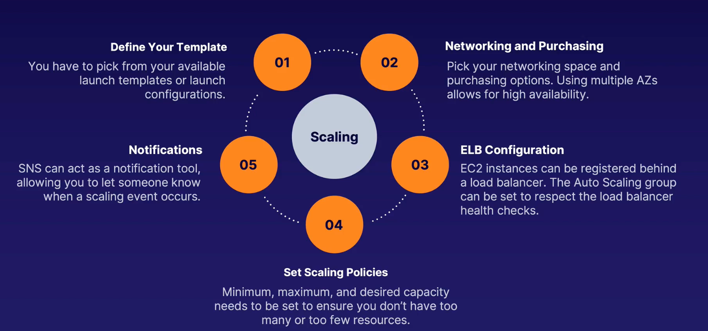
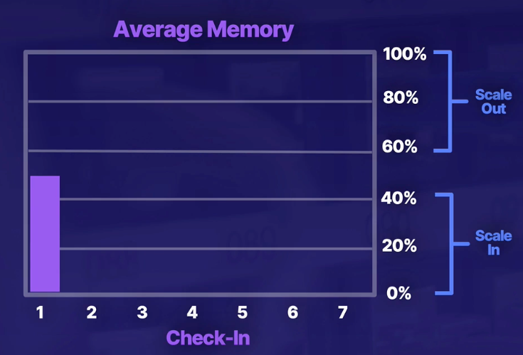
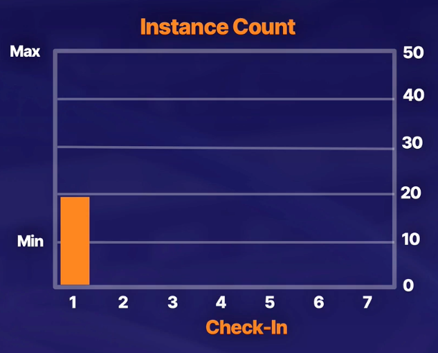

---
date: 2022-01-02
draft: false
thumbnail: /post-images/aws-scaling.png
title: AWS - Auto Scaling
extract: Notes for AWS Auto Scaling
categories:
    - AWS
tags:
    - blog
    - AWS
--- 

### Table of Contents

- [What is Scaling?](#what-is-scaling)
- [Vertical Scaling](#vertical-scaling)
- [Horizontal Scaling](#horizontal-scaling)
- [3 Ws of Scaling](#3-ws-of-scaling)
- [What are we scaling with?](#what-are-we-scaling-with)
  - [Launch Template](#launch-template)
  - [Requirements for Launch Templates](#requirements-for-launch-templates)
  - [Creating Launch Templates](#creating-launch-templates)
- [Where are we going to scale?!](#where-are-we-going-to-scale)
  - [Reqs for ASGs](#reqs-for-asgs)
  - [Restrictions for Auto scaling](#restrictions-for-auto-scaling)
  - [ASG demo](#asg-demo)
- [When are we going to scale?](#when-are-we-going-to-scale)
- [Scaling Policies](#scaling-policies)
  - [Rules](#rules)
  - [Change 1](#change-1)
  - [Change 2](#change-2)
  - [Change 3](#change-3)
  - [Change 4](#change-4)
  - [Change 5](#change-5)
  - [Change 6](#change-6)
  - [Reactive Scaling](#reactive-scaling)
  - [Scheduled Scaling](#scheduled-scaling)
  - [Predictive Scaling](#predictive-scaling)
  - [Steady state ASG](#steady-state-asg)

## What is Scaling?
Scaling, as the name implies, means to increase your resources to handle extra load. There're 2 types of scaling: vertical and horizontal

## Vertical Scaling

This is where you increase the performance by improving the state of your current machines by adding more RAM etc 

## Horizontal Scaling

This is where you increase performance by adding more machines. 

## 3 Ws of Scaling

Whenever we're determining the scope of our scaling, it is important to answer the 3 Ws:

- **What do we scale with?** We have to decide what sort of resource we're going to scale. Are we scaling the EC2 instance? The DB? How do we spin up that instance? And how do we define the template?
  
- **Where do we scale?** We decide where do we scale in our architecture? Where in the VPC? What LBs should be used? 

- **When do we scale?** When do we actually need to scale? When does it make sense to spin up more or take something away. Usually it is CloudWatch that helps guide us.

## What are we scaling with?

When we're trying to answer what to scale with when considering an EC2 instance, we do so by using the launch template

### Launch Template

A launch template specifies all the needed settings that go into building out an EC2 instance. It is a collection of settings that you can configure so you don't have to use the EC2 wizard over and over (similar to what we've been doing for previous EC2 demos!). We can use a template to save our settings! Launch configs are similar to templates but do less than what a template can accomplish! Just use launch templates. Templates:

- Are for more than just autoscaling (demo will clarify this)
- Support versioning 
- Provide you with more granularity
- **AWS Recommended!**

### Requirements for Launch Templates

- An AMI is required
- EC2 instance size is required
- Security groups are required
- Networking information is required

### Creating Launch Templates

Let's look at a demo for launch templates. Remember, our end goal is to use these with an auto-scaling group (we'll talk more about those later):

- EC2 -> Launch templates -> Create Launch Template
- Provide a name and description
- Click the check mark for `Auto Scaling guidance`. If selected, this template can then be used for an auto-scaling group as well. 
- Provide the AMI and Instance Type
- If Key pair is NOT provided, you can't provided it while setting up the ASG. So do provide a key pair
- Leave the VPC section blank. If the VPC is specified in the template, that launch template cannot be used in an ASG.
- Leave everything as is and create template.
- Launch EC2 from template
  - Provide the VPC, SG and leave everything as is
  - Inspect the new instance

<!-- copy and paste. Modify height and width if desired. -->
<iframe class="embeddedObject shadow resizable" name="embedded_content" scrolling="no" frameborder="0" type="text/html" 
        style="overflow:hidden;" src="https://www.screencast.com/users/IqbalKhan8502/folders/Capture/media/f639ed92-8734-4813-ae12-c7613bcd684f/embed" height="760" width="1436" webkitallowfullscreen mozallowfullscreen allowfullscreen></iframe>

## Where are we going to scale?!

Auto scaling groups or ASG is a collection of EC2 instances that are treated as a collective group for purposes of scaling and management. ASG determines when the instances come online, where they're created and where they're destroyed. 

- ASGs are vital to creating a highly available application. 
- We should consider spreading out resources across AZs 
- We should utilize load balancers (more on this below)

### Reqs for ASGs

You first need a **launch template** for ASGs. Launch templates tell ASG the settings required to created our EC2 architecture

Next, you need a **networking space and purchasing options**. This is the reason why we don't choose this when creating the launch template. We should also use at-least 2 AZs for high availability.
 
 **ELB configuration** is also needed. The ELB sits in front of the ASG and as instances come online, they're registered with the ELB. They're de-registered as we remove instances. This happens automatically if we choose the ASG to interact with our ELB. ASG can also use the health check of ELB to make sure that the group count stays up to the required standard. 

 Next, we need to set **scaling policies**: these are the min, max and desired capacity needs that ensure we don't have too many or too little resources.

 **Notifications** via SNS are also required to be set for notifications when scaling event occurs.

 [Image Credit: acloudguru.com](https://acloudguru.com)

 ### Restrictions for Auto scaling

 We need to set the **minimum** or the lowest number of EC2 instances that you'll ever have onilne. You won't dip below this. We want to set this to 2 since we want high availability with instances in multiple AZs.

 We need to set the **maximum** or the highest number of EC2 instances that we'll ever provision. We'll never go above this.

 We need to set the **desired** or how many instances do you want right now?? NOT the average! But how much you want right now?
 
`minimum <= desired <= maximum`

 ### ASG demo

 Let's continue where we left off for launch templates. Our template is created and we have an EC2 instance running that was launched using that template.

 - Open EC2, find ASG and click create ASG
 - Provide a name for the ASG and provide an existing template
 - Choose a VPC and **select 2 subnets** for higher availability
 - For config settings, you can mix and match EC2 capacity: You can choose on-demand and spot capacity
 - Choose adhere to launch template
 - For now, choose no LB
 - For health checks, stick with EC2 but note you can choose ELB health check as we discussed earlier
 - Set min to 2, max to 10 and desired to 2
 - Leave scaling policies as None (will explore those later)
 - Skip notifications and add a sample tag
 - Create ASG

Initially, instances tab will show 0 and desired will show 2. Now if you click on instance management, you'll see that 2 are in pending state. If you update the desired capacity to say 5, ASG will add 3 more instances (2 running add 3 more to take to desired count). If now again you reduce desired to 2, ASG will remove 3 instances (5 running remove 3 to take to desired count of 2).

<!-- copy and paste. Modify height and width if desired. -->
<iframe class="embeddedObject shadow resizable" name="embedded_content" scrolling="no" frameborder="0" type="text/html" 
        style="overflow:hidden;" src="https://www.screencast.com/users/IqbalKhan8502/folders/Capture/media/0efb9b7b-cbc9-4e0b-be7c-f2edf3f58f6c/embed" height="762" width="1434" webkitallowfullscreen mozallowfullscreen allowfullscreen></iframe>

## When are we going to scale?

Now we'll answer the questin of when do we scale using our **scaling policies**. 

## Scaling Policies
Say we have this scenario: We have determined through trial and error that our memory utilization can be broken down as follows:

[Image Credit: acloudguru.com](https://acloudguru.com) 

### Rules
We notice from the image above that when our best memory utilization occurs when utilization is between 40% and 60%. We want to be in this range!

If we hit the 40% mark, it is best to scale in. For scaling in, we'll terminate 10 instances when memory is between 40% and 20%. We'll terminate 15 instances when memory is between 20% and 0%.

If we hit 60% mark, it is best to scale out. For scaling out, we'll add 10 instances when memory is between 60% and 80%. We'll add 15 instances when memory is between 80% and 100%.

[Image Credit: acloudguru.com](https://acloudguru.com) 

From the image above, we can see that our min count is 10,max is 50 and we're currently using 20 instances. 

### Change 1

**Say our average memory utilization (MU) moves UP from 60% to 70%. Currently we have 20 instances running**.

Using the rules we described above, we'll add 10 instances when memory is between 60% and 80%. So, we'll add 10 instances to the existing 20 instances to go to a total of 30 instances. One thing to note here is that these instances will NOT immediately come online. You'd have setup taking place, packages being installed. This is called **warmup period**. ASG is aware that these instances are not ready yet so they'll not be added behind the ELB immediately. We can set a window where we can configure this warm-up period of waiting for the instances to come online.

### Change 2

**Say our average memory utilization (MU) moves UP from 70% to 75%. Currently we have 20 instances running and 10 are in warmup**.

Let's say, while we're in the warmup period we get another burst of traffic and our MU goes up a notch to 75%. We're still in that 60% to 80% range. Do we add another 10 instances? NO! Auto scaling is smart enough to understand that the load is still within that threshold and we've got 10 in the warmup window and will come live soon! So we do NOTHING!

### Change 3

**Say our average memory utilization (MU) moves UP from 75% to 90%. Currently we have 20 instances running and 10 are in warmup**.

Now what do we do? The rule says add 15 instance between 80% and 100%. Do we add 15 more instances? NO! we add 5! Why 5 and not 15? Because we already have 10 coming in from warmup period and we need to get to 15. So we need to add 5 more! 

### Change 4

**Say our average memory utilization (MU) moves DOWN from 90% to 45%. Currently we have 35 instances running**.

This drop in MU happened because the warmup period expired and we have 35 instances that are running. We're currently in that range we like the most! 40% to 60% memory utilization!

### Change 5

**Our MU goes from 45% to 30%. Currently we have 35 instances running**.

What do we do? Rule says termiante 10 instances. That's what we'll do: go down from 35 to 25 instances. Terminating instances is faster than getting them online. Termination is instantaneous. 

### Change 6

**Our MU goes from 30% to 10%. Currently we have 25 instances running**.

Rule says terminate 15 instances in this window. That's what we'll do! We'll remove 15 to go down to 10 instances. 

All actions described above take place automatically using our AS policies. We prevent thrashing (hearbeat like instance counts!) using warmup and cool down periods. We were reactively scaling to our load. 

### Reactive Scaling

Reactive scaling is when you're playing catch up. Once the load is there, you measure it and then determine if you need to create more resources.

### Scheduled Scaling

If you have a predictable workload, create a scaling event to get your resources ready to go before they're actually needed. 

### Predictive Scaling

AWS uses ML algos to determine when you'll need to scale. They are re-evaluated every 24 hours to create a forecast for the next 48.

### Steady state ASG

If you have desired capacity, min capacity and max capacity ALL as the same value that equals 1 and if your instance terminates, it'll be re-launched in a new AZ! This is useful when you can't duplicate your LEGACY code base to multiple EC2s, this will allow you to be highly available.