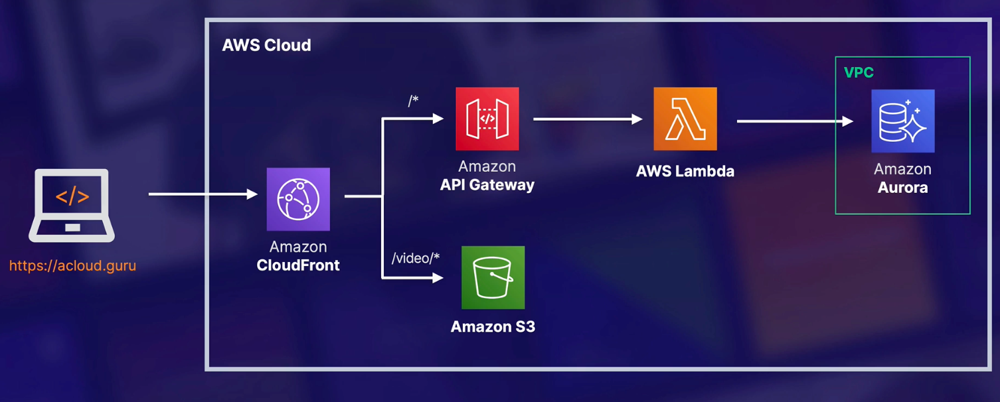

---
date: 2022-01-03
draft: false
thumbnail: /post-images/aws-api-gateway.png
title: AWS - API Gateway
extract: Notes for API Gateway
categories:
    - AWS
tags:
    - blog
    - AWS
--- 

### Table of Contents

- [What is API Gateway?](#what-is-api-gateway)
- [Sample Architecture](#sample-architecture)

## What is [API Gateway?](https://docs.aws.amazon.com/apigateway/latest/developerguide/welcome.html)

Amazon API Gateway is an AWS service for creating, publishing, maintaining, monitoring, and securing REST, HTTP, and WebSocket APIs at any scale. API developers can create APIs that access AWS or other web services, as well as data stored in the AWS Cloud. As an API Gateway API developer, you can create APIs for use in your own client applications. Or you can make your APIs available to third-party app developers. 

APIs you build in Amazon API Gateway provide you or your developer customers with an integrated and consistent developer experience for building AWS serverless applications. API Gateway handles all the tasks involved in accepting and processing up to hundreds of thousands of concurrent API calls. These tasks include traffic management, authorization and access control, monitoring, and API version management.

API Gateway acts as a "front door" for applications to access data, business logic, or functionality from your backend services, such as workloads running on Amazon Elastic Compute Cloud (Amazon EC2), code running on AWS Lambda, any web application, or real-time communication applications.

Here're some advantages of using API GW:

- This service allows you to easily protect your endpoints by attaching a web application firewall (WAF).
- Prevent DDoS and rate limiting
- Ease of use!

## Sample Architecture 

Let's look at a sample architecture using API GW:

[Image Credit: acloudguru](https://acloudguru.com)

In the diagram above, we have the user hit the URL and the request is forwarded to a CloudFront distribution. The static content is delivered by S3. For dynamic content (update profile, make comment etc), the request gets routed to an API gateway. That triggers a lambda which then updates an Aurora instance inside a VPC.