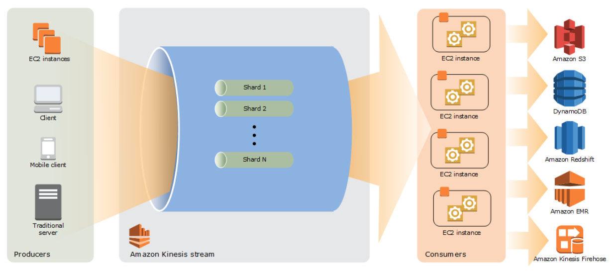
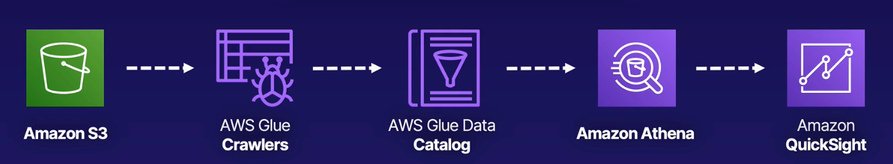

---
date: 2022-01-02
draft: false
thumbnail: /post-images/big-data.png
title: AWS - Big Data
extract: Notes for AWS Big Data
categories:
    - AWS
tags:
    - blog
    - AWS
--- 

### Table of Contents

- [What is Big Data?](#what-is-big-data)
- [What is Redshift?](#what-is-redshift)
- [What is EMR?](#what-is-emr)
- [What is Kinesis?](#what-is-kinesis)
- [What is Kinesis Data Streams?](#what-is-kinesis-data-streams)
  - [Kinesis DS Architecture](#kinesis-ds-architecture)
  - [Kinesis Data Streams Terminology](#kinesis-data-streams-terminology)
- [What is Kinesis Data Firehose?](#what-is-kinesis-data-firehose)
- [Kinesis Data Analytics](#kinesis-data-analytics)
- [What is Athena?](#what-is-athena)
- [What is AWS Glue?](#what-is-aws-glue)
- [Athena and Glue?](#athena-and-glue)
- [Quicksight](#quicksight)

## What is Big Data?

There're 3 Vs of big data:

- Volume, that ranges from TBs to PBs, of data.
- Variety of data that include data from a wide range of sources and formats
- Velocity of data processing where we need to collect, process and analyze data in a short period of time.

## What is [Redshift](https://docs.aws.amazon.com/redshift/latest/gsg/getting-started.html)?

Amazon Redshift is a fully managed, petabyte-scale, relation data warehouse service in the AWS Cloud. An Amazon Redshift data warehouse is a collection of computing resources called nodes, which are organized into a group called a cluster. Each cluster runs an Amazon Redshift engine and contains one or more databases.

- Redshift can handle up to 16PB of data, meaning you don't have to split up your large datasets. 
- Redshift is relational: you can use your standard SQL and BI tools to interact with it.
- Redshift is NOT a DB to serve as your backend!
- **Redshift is GREAT FOR BI**

## What is [EMR](https://docs.aws.amazon.com/emr/latest/ManagementGuide/emr-what-is-emr.html)?

Amazon EMR is a managed cluster platform that simplifies running big data frameworks, such as Apache Hadoop and Apache Spark, on AWS to process and analyze vast amounts of data. Using these frameworks and related open-source projects, you can process data for analytics purposes and business intelligence workloads. Amazon EMR also lets you transform and move large amounts of data into and out of other AWS data stores and databases, such as Amazon Simple Storage Service (Amazon S3) and Amazon DynamoDB.

- EMR allows you to run ETL workloads! 
- It stores your data in S3!
- It creates EC2 instances to process your data! AWS will manage these instances

## What is Kinesis?

Kinesis service allows you to ingest, process and analyze real-time streaming data. Youc an think of it as a huge data highway connected to your AWS account. There are 2 major types of Kinesis offerings: Kinesis Data streams and Kinesis Data Firehose.

## What is [Kinesis Data Streams](https://docs.aws.amazon.com/streams/latest/dev/introduction.html)?

You can use Amazon Kinesis Data Streams to collect and process large streams of data records in real time. You can create data-processing applications, known as Kinesis Data Streams applications. A typical Kinesis Data Streams application reads data from a data stream as data records. These applications can use the Kinesis Client Library, and they can run on Amazon EC2 instances. You can send the processed records to dashboards, use them to generate alerts, dynamically change pricing and advertising strategies, or send data to a variety of other AWS services.

You can use Kinesis Data Streams for rapid and continuous data intake and aggregation. The type of data used can include IT infrastructure log data, application logs, social media, market data feeds, and web clickstream data. Because the response time for the data intake and processing is in real time, the processing is typically lightweight.

Although you can use Kinesis Data Streams to solve a variety of streaming data problems, a common use is the real-time aggregation of data followed by loading the aggregate data into a data warehouse or map-reduce cluster.

Data is put into Kinesis data streams, which ensures durability and elasticity. The delay between the time a record is put into the stream and the time it can be retrieved (put-to-get delay) is typically less than 1 second. In other words, a Kinesis Data Streams application can start consuming the data from the stream almost immediately after the data is added. The managed service aspect of Kinesis Data Streams relieves you of the operational burden of creating and running a data intake pipeline. You can create streaming map-reduce–type applications. The elasticity of Kinesis Data Streams enables you to scale the stream up or down, so that you never lose data records before they expire.

Multiple Kinesis Data Streams applications can consume data from a stream, so that multiple actions, like archiving and processing, can take place concurrently and independently.

### Kinesis DS Architecture

The following diagram illustrates the high-level architecture of Kinesis Data Streams. The producers continually push data to Kinesis Data Streams, and the consumers process the data in real time. Consumers (such as a custom application running on Amazon EC2 or an Amazon Kinesis Data Firehose delivery stream) can store their results using an AWS service such as Amazon DynamoDB, Amazon Redshift, or Amazon S3.

[Image Credit: AWS Docs](https://docs.aws.amazon.com/streams/latest/dev/key-concepts.html)

### Kinesis Data Streams Terminology
**Kinesis Data Stream**

A Kinesis data stream is a set of shards. Each shard has a sequence of data records. Each data record has a sequence number that is assigned by Kinesis Data Streams.

**Data Record**

A data record is the unit of data stored in a Kinesis data stream. Data records are composed of a sequence number, a partition key, and a data blob, which is an immutable sequence of bytes. Kinesis Data Streams does not inspect, interpret, or change the data in the blob in any way. A data blob can be up to 1 MB.

**Capacity Mode**

A data stream capacity mode determines how capacity is managed and how you are charged for the usage of your data stream. Currenly, in Kinesis Data Streams, you can choose between an on-demand mode and a provisioned mode for your data streams.

With the on-demand mode, Kinesis Data Streams automatically manages the shards in order to provide the necessary throughput. You are charged only for the actual throughput that you use and Kinesis Data Streams automatically accommodates your workloads’ throughput needs as they ramp up or down.

With the provisioned mode, you must specify the number of shards for the data stream. The total capacity of a data stream is the sum of the capacities of its shards. You can increase or decrease the number of shards in a data stream as needed and you are charged for the number of shards at an hourly rate.

**Retention Period**

The retention period is the length of time that data records are accessible after they are added to the stream. A stream’s retention period is set to a default of 24 hours after creation. You can increase the retention period up to 8760 hours (365 days) using the IncreaseStreamRetentionPeriod operation, and decrease the retention period down to a minimum of 24 hours using the DecreaseStreamRetentionPeriod operation.

**Encryption**

Amazon Kinesis Data Streams can automatically encrypt sensitive data as a producer enters it into a stream. Kinesis Data Streams uses AWS KMS master keys for encryption.

## What is Kinesis Data [Firehose](https://docs.aws.amazon.com/firehose/latest/dev/what-is-this-service.html)?

Amazon Kinesis Data Firehose is a fully managed service for delivering real-time streaming data to destinations such as Amazon Simple Storage Service (Amazon S3), Amazon Redshift etc. With Kinesis Data Firehose, you don't need to write applications or manage resources. You configure your data producers to send data to Kinesis Data Firehose, and it automatically delivers the data to the destination that you specified. You can also configure Kinesis Data Firehose to transform your data before delivering it.

Firehose is usually used as a data transfer tool to get data into the destinations listed earlier. The speed of delivery is near-real time (60 seconds). Unlike KDS, where you have to manage the consumer, firehose manages all that setup for you. It is the managed version! 

## Kinesis Data Analytics

As your data arrives into your KDS or KDF, you can use SQL like syntax to analyze that data. To do so, you'd use Kinesis Data Analytics! KDA is a fully managed real-time serverlsess service. It will automatically handle scaling and provisioning of needed resources. You only pay for the amount of resources you consume as your data passes through.

## What is [Athena](https://docs.aws.amazon.com/athena/latest/ug/what-is.html)?

Amazon Athena is an interactive query service that makes it easy to analyze data directly in Amazon Simple Storage Service (Amazon S3) using standard SQL. With a few actions in the AWS Management Console, you can point Athena at your data stored in Amazon S3 and begin using standard SQL to run ad-hoc queries and get results in seconds.

Athena is serverless, so there is no infrastructure to set up or manage, and you pay only for the queries you run. Athena scales automatically—running queries in parallel—so results are fast, even with large datasets and complex queries.

Athena helps you analyze unstructured, semi-structured, and structured data stored in Amazon S3. Examples include CSV, JSON, or columnar data formats such as Apache Parquet and Apache ORC. You can use Athena to run ad-hoc queries using ANSI SQL, without the need to aggregate or load the data into Athena.

Athena integrates with Amazon QuickSight for easy data visualization. You can use Athena to generate reports or to explore data with business intelligence tools or SQL clients connected with a JDBC or an ODBC driver. 

## What is AWS [Glue](https://docs.aws.amazon.com/glue/latest/dg/what-is-glue.html)?

AWS Glue is a fully managed ETL (extract, transform, and load) service that makes it simple and cost-effective to categorize your data, clean it, enrich it, and move it reliably between various data stores and data streams. AWS Glue consists of a central metadata repository known as the AWS Glue Data Catalog, an ETL engine that automatically generates Python or Scala code, and a flexible scheduler that handles dependency resolution, job monitoring, and retries. AWS Glue is serverless, so there’s no infrastructure to set up or manage. Glue is a managed version of EMR.

## Athena and Glue?

Say you're getting a bunch of data that's landing S3 buckets BUT the data is not structure the way you want it. It is all over the place. You can use AWS Glue Crawlers to run on these buckets and create a structured version of this data called data catalog. Once the data is more structured, you can then use Athena to query S3 and visualize your results using Quicksight:

[Image Credit: Acloudguru](https://acloudguru.com)

Therefore if you're ever looking for a serverless SQL option for S3, you can use Athena!

## Quicksight

Quicksight is a fully managed BI data visualization service that allows you to create dashboards! 